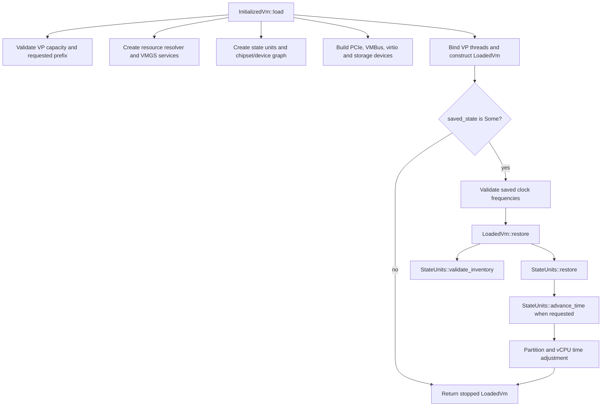

# `InitializedVm::load` complete static call-graph report

> Generated 2026-09-14T11:43:51.136042+00:00 from the current working tree with the repository-local Argus Verus/rust-analyzer tooling.

> Scope note: the source file changed after the LSP graph snapshot was captured. Function names, reachability, and aggregate function/edge counts below describe that completed snapshot; source line ranges and LOC columns are advisory only and were not refreshed, per request.

## Executive summary

The source spelling at the two production call sites is `vm.load(...)`. Here `vm` is a local variable whose static type is `InitializedVm`, because it was produced by `InitializedVm::new(...)`. Rust method-call resolution therefore selects `InitializedVm::load`; `vm::load` would instead be namespace/type-path syntax and is not what these call sites contain.

| Metric | Result |
| --- | ---: |
| Root | `InitializedVm::load` |
| Root location | `openvmm/openvmm_core/src/worker/dispatch.rs:2027-2038` |
| Root function physical LOC | 449 |
| Project-local reachable functions | 1,426 |
| Project-local call edges | 2,081 |
| Direct callees from `load` | 167 |
| External/toolchain call leaves | 2,191 |
| Distinct source files | 225 |
| Distinct workspace crates | 76 |
| Functions with mapped source bodies | 1,141 / 1,426 |
| Unique reachable physical function LOC | approximately 23,213 |
| Unique reachable nonblank/non-comment LOC | approximately 20,678 |
| Maximum ordinary-call depth | 14 |
| LSP graph marked complete | `True` |
| LSP graph warnings | 0 |
| Resolved trait-dispatch edges observed through depth 3 | 43 |
| Rejected broad/spurious implementation matches | 29 |
| Unique implementation probes without a usable hierarchy item | 2,604 |

The LOC totals count every unique reachable project function once, even if multiple paths call it. Standard-library, toolchain, and non-workspace dependency bodies are not included. The nonblank/non-comment value is an approximation based on source lines inside each tree-sitter function range.

## Scope and interpretation

This is a static call graph, not one runtime stack trace. `InitializedVm::load` contains configuration-dependent branches for firmware, chipset, PCIe, VMBus, virtio, storage, architecture, and snapshot restore. The graph is therefore the union of project-local calls rust-analyzer considers reachable from the function body under the indexed workspace configuration. A particular VM execution follows only a subset.

The ordinary call closure was generated without implementation expansion because unbounded `textDocument/implementation` expansion stalled and produced broad false positives such as unrelated `Clone::clone` implementations. Ordinary `callHierarchy/outgoingCalls` completed with zero warnings. A separate depth-3 implementation pass is retained as advisory trait-dispatch evidence; questionable global matches were excluded rather than presented as real calls.

External calls are retained as leaves. Dynamic behavior that cannot be represented as a unique static callee—function pointers, callbacks stored behind trait objects, macro-generated calls, and runtime-selected resource resolvers—must be interpreted using the external and dispatch appendices.

## Entry-point resolution

| Call site | Construction/type evidence | Resolved method |
| --- | --- | --- |
| `dispatch.rs:836` `vm.load(...)` | `vm` is returned by `InitializedVm::new(...)` at `dispatch.rs:801` | `InitializedVm::load` |
| `dispatch.rs:883` `vm.load(Some(saved_state), ...)` | `vm` is returned by `InitializedVm::new(...)` at `dispatch.rs:876` | `InitializedVm::load` |

The exact line numbers above are from the current working tree and may move as the uncommitted verification changes evolve.

## High-level control flow

The report boundary matches the onboarding specification: successful return from `InitializedVm::load`, before `LoadedVm::resume` starts state units or releases the restore stop guard.

## Restore-focused reachable subsets

| Sub-root | Reachable functions including root |
| --- | ---: |
| `LoadedVm::restore` | 30 |
| `StateUnits::advance_time` | 27 |
| `HvlitePartition::advance_snapshot_time` | 1 |
| Union of the restore/apply-time sub-roots above | 32 |

These subsets are contained in the complete `InitializedVm::load` graph. They isolate state application and downtime adjustment from the much larger VM/device construction portion of `load`.

## Reachability by minimum call depth

| Depth | Functions first reached |
| ---: | ---: |
| 0 | 1 |
| 1 | 167 |
| 2 | 208 |
| 3 | 222 |
| 4 | 252 |
| 5 | 186 |
| 6 | 147 |
| 7 | 74 |
| 8 | 48 |
| 9 | 37 |
| 10 | 36 |
| 11 | 20 |
| 12 | 19 |
| 13 | 7 |
| 14 | 2 |

## Largest crates

| Crate | Reachable functions |
| --- | ---: |
| `vmm_core` | 91 |
| `vmgs` | 83 |
| `openvmm_core` | 77 |
| `vmotherboard` | 64 |
| `mesh_node` | 60 |
| `vmbus_channel` | 60 |
| `pal_async` | 58 |
| `mesh_channel_core` | 57 |
| `pci_core` | 56 |
| `guestmem` | 51 |
| `vmcore` | 44 |
| `mesh_channel` | 40 |
| `acpi` | 40 |
| `state_unit` | 40 |
| `virtio` | 39 |
| `vmbus_server` | 36 |
| `pci_resource_assignment` | 35 |
| `chipset_device` | 30 |
| `trycopy` | 29 |
| `acpi_spec` | 29 |
| `pcie` | 24 |
| `vmbus_ring` | 24 |
| `vfio_assigned_device` | 22 |
| `hyperv_dump` | 18 |
| `inspect` | 16 |
| `mesh_protobuf` | 16 |
| `sparse_mmap` | 16 |
| `ide` | 15 |
| `vga` | 15 |
| `disk_backend` | 14 |
| `openvmm_defs` | 13 |
| `cxl_spec` | 13 |
| `vfio_sys` | 12 |
| `vm_topology` | 12 |
| `minircu` | 11 |
| `pal_event` | 11 |
| `membacking` | 10 |
| `framebuffer` | 8 |
| `vpci` | 8 |
| `floppy` | 8 |
| `loader` | 8 |
| `vm_resource` | 8 |
| `hybrid_vsock` | 7 |
| `task_control` | 7 |
| `vmbus_async` | 7 |
| `chipset` | 6 |
| `pal` | 5 |
| `firmware_pcat` | 5 |
| `vmbus_core` | 5 |
| `memory_range` | 5 |
| `vmgs_broker` | 5 |
| `closeable_mutex` | 4 |
| `chipset_legacy` | 4 |
| `scsi_buffers` | 4 |
| `watchdog_core` | 4 |
| `watchdog_vmgs_format` | 4 |
| `arc_cyclic_builder` | 3 |
| `inspect_counters` | 3 |
| `missing_dev` | 3 |
| `cache_topology` | 2 |
| `input_core` | 2 |
| `vga_proxy` | 2 |
| `hvdef` | 2 |
| `vmgs_format` | 2 |
| `virt` | 2 |
| `vm_loader` | 2 |
| `address_filter` | 1 |
| `fast_select` | 1 |
| `guid` | 1 |
| `local_clock` | 1 |
| `chipset_device_resources` | 1 |
| `generation_id` | 1 |
| `pci_bus` | 1 |
| `scsidisk` | 1 |
| `vmm_core_defs` | 1 |
| `chipset_device_worker` | 1 |

## Largest source files

| File | Reachable functions |
| --- | ---: |
| `vm/vmgs/vmgs/src/vmgs_impl.rs` | 68 |
| `vm/vmcore/guestmem/src/lib.rs` | 47 |
| `support/mesh/mesh_node/src/local_node.rs` | 46 |
| `openvmm/openvmm_core/src/worker/dispatch.rs` | 44 |
| `vmm_core/state_unit/src/lib.rs` | 40 |
| `support/mesh/mesh_channel_core/src/mpsc.rs` | 28 |
| `vmm_core/src/partition_unit/vp_set.rs` | 26 |
| `vm/devices/vmbus/vmbus_channel/src/channel.rs` | 25 |
| `vmm_core/src/acpi_builder.rs` | 23 |
| `vm/devices/pci/pci_resource_assignment/src/assign.rs` | 19 |
| `vmm_core/src/partition_unit.rs` | 19 |
| `vm/devices/pci/vfio_assigned_device/src/manager.rs` | 18 |
| `vmm_core/hyperv_dump/src/partition_state.rs` | 18 |
| `openvmm/openvmm_core/src/partition.rs` | 17 |
| `vm/devices/pci/pci_core/src/cfg_space_emu.rs` | 17 |
| `vm/devices/vmbus/vmbus_ring/src/lib.rs` | 17 |
| `support/trycopy/src/x86_64.rs` | 16 |
| `vm/devices/vmbus/vmbus_server/src/lib.rs` | 16 |
| `vm/devices/virtio/virtio/src/device.rs` | 15 |
| `support/mesh/mesh_channel_core/src/oneshot.rs` | 14 |
| `vm/devices/storage/disk_backend/src/lib.rs` | 14 |
| `vm/devices/virtio/virtio/src/transport/task.rs` | 14 |
| `support/mesh/mesh_channel/src/rpc.rs` | 13 |
| `support/mesh/mesh_channel_core/src/deque.rs` | 13 |
| `support/pal/pal_async/src/socket.rs` | 13 |
| `support/sparse_mmap/src/unix.rs` | 12 |
| `vm/devices/pci/pci_resource_assignment/src/enumerate.rs` | 12 |
| `vm/devices/vmbus/vmbus_channel/src/gpadl.rs` | 12 |
| `vmm_core/vmotherboard/src/chipset/backing/arc_mutex/services.rs` | 12 |
| `support/minircu/src/lib.rs` | 11 |
| `support/pal/pal_async/src/interest.rs` | 11 |
| `support/trycopy/src/lib.rs` | 11 |
| `vm/vmcore/vm_topology/src/processor.rs` | 11 |
| `vm/vmgs/vmgs/src/storage.rs` | 11 |
| `support/inspect/src/lib.rs` | 10 |
| `vm/devices/vmbus/vmbus_server/src/channels.rs` | 10 |
| `vm/vmcore/src/line_interrupt.rs` | 10 |
| `vmm_core/vmotherboard/src/chipset/backing/arc_mutex/device.rs` | 10 |
| `vmm_core/vmotherboard/src/chipset/builder/mod.rs` | 10 |
| `support/mesh/mesh_protobuf/src/protobuf.rs` | 9 |
| `vm/chipset_device/src/pci.rs` | 9 |
| `vm/devices/pci/pci_core/src/msi.rs` | 9 |
| `vm/devices/pci/pcie/src/port.rs` | 9 |
| `vm/devices/pci/pcie/src/root.rs` | 9 |
| `vm/devices/vmbus/vmbus_server/src/hvsock.rs` | 9 |
| `support/mesh/mesh_channel/src/cancel.rs` | 8 |
| `support/mesh/mesh_channel/src/lazy.rs` | 8 |
| `vm/acpi_spec/src/iort.rs` | 8 |
| `vm/chipset_device/src/lib.rs` | 8 |
| `vm/devices/framebuffer/src/lib.rs` | 8 |

## Direct callees of `InitializedVm::load`

| # | Callee | Location | Function LOC |
| ---: | --- | --- | ---: |
| 1 | `clone` | `openvmm/membacking/src/memory_manager/device_memory.rs:25` |  |
| 2 | `GuestMemoryManager::device_memory_mapper` | `openvmm/membacking/src/memory_manager/mod.rs:831-833` | 3 |
| 3 | `GuestMemoryManager::dma_mapper_client` | `openvmm/membacking/src/memory_manager/mod.rs:836-838` | 3 |
| 4 | `GuestMemoryManager::ram_visibility_control` | `openvmm/membacking/src/memory_manager/mod.rs:842-846` | 5 |
| 5 | `clone` | `openvmm/membacking/src/region_manager.rs:971` |  |
| 6 | `MeshLoggerResolver::new` | `openvmm/openvmm_core/src/emuplat/firmware.rs:61-63` | 3 |
| 7 | `AdjustGpaRangeResolver` | `openvmm/openvmm_core/src/emuplat/i440bx_host_pci_bridge.rs:60` |  |
| 8 | `HvlitePartition::advance_snapshot_time` | `openvmm/openvmm_core/src/partition.rs:72` |  |
| 9 | `HvlitePartition::apic_frequency_hz` | `openvmm/openvmm_core/src/partition.rs:75` |  |
| 10 | `HvlitePartition::into_doorbell_registration` | `openvmm/openvmm_core/src/partition.rs:105` |  |
| 11 | `HvlitePartition::into_vm_partition` | `openvmm/openvmm_core/src/partition.rs:87` |  |
| 12 | `HvlitePartition::reference_time_source` | `openvmm/openvmm_core/src/partition.rs:126` |  |
| 13 | `HvlitePartition::set_tsc_frequency_hz` | `openvmm/openvmm_core/src/partition.rs:69` |  |
| 14 | `HvlitePartition::supports_virtual_devices` | `openvmm/openvmm_core/src/partition.rs:117` |  |
| 15 | `HvlitePartition::synic` | `openvmm/openvmm_core/src/partition.rs:130` |  |
| 16 | `HvlitePartition::tsc_frequency_hz` | `openvmm/openvmm_core/src/partition.rs:66` |  |
| 17 | `HvLiteVmgsNonVolatileStore::as_non_volatile_store` | `openvmm/openvmm_core/src/vmgs_non_volatile_store.rs:12` |  |
| 18 | `LoadedVm::assign_pci_resources` | `openvmm/openvmm_core/src/worker/dispatch.rs:4344-4369` | 28 |
| 19 | `LoadedVm::restore` | `openvmm/openvmm_core/src/worker/dispatch.rs:4999-5021` | 53 |
| 20 | `LoadedVmInner::load_firmware` | `openvmm/openvmm_core/src/worker/dispatch.rs:3723-3747` | 1677 |
| 21 | `adapt_chipset_with_debug_break` | `openvmm/openvmm_core/src/worker/dispatch.rs:976` |  |
| 22 | `add_fake_pci_bus_root` | `openvmm/openvmm_core/src/worker/dispatch.rs:390-396` | 15 |
| 23 | `apic_frequency_mismatch_error` | `openvmm/openvmm_core/src/worker/dispatch.rs:290` |  |
| 24 | `base_chipset_foundation` | `openvmm/openvmm_core/src/worker/dispatch.rs:308` |  |
| 25 | `bind_vp_threads` | `openvmm/openvmm_core/src/worker/dispatch.rs:529-571` | 70 |
| 26 | `build_configured_pcie_devices` | `openvmm/openvmm_core/src/worker/dispatch.rs:458-463` | 12 |
| 27 | `clone_hvlite_partition` | `openvmm/openvmm_core/src/worker/dispatch.rs:304-306` | 3 |
| 28 | `cxl_ports_require_ranges_error` | `openvmm/openvmm_core/src/worker/dispatch.rs:222-230` | 10 |
| 29 | `cxl_ranges_unresolved_error` | `openvmm/openvmm_core/src/worker/dispatch.rs:228-230` | 10 |
| 30 | `duplicate_ide_drive_error` | `openvmm/openvmm_core/src/worker/dispatch.rs:207` |  |
| 31 | `duplicate_pcie_port_error` | `openvmm/openvmm_core/src/worker/dispatch.rs:238` | 5 |
| 32 | `failed_vmbus_resource_context` | `openvmm/openvmm_core/src/worker/dispatch.rs:268-270` | 3 |
| 33 | `hvlite_partition_handle` | `openvmm/openvmm_core/src/worker/dispatch.rs:972` |  |
| 34 | `invalid_cxl_mmio_error` | `openvmm/openvmm_core/src/worker/dispatch.rs:211` | 3 |
| 35 | `invalid_generic_initiator_node_error` | `openvmm/openvmm_core/src/worker/dispatch.rs:250-252` | 3 |
| 36 | `invalid_restore_vp_count` | `openvmm/openvmm_core/src/worker/dispatch.rs:203-205` | 3 |
| 37 | `microvm_virtio_slot_error` | `openvmm/openvmm_core/src/worker/dispatch.rs:280-282` | 9 |
| 38 | `missing_generic_initiator_port_error` | `openvmm/openvmm_core/src/worker/dispatch.rs:260` |  |
| 39 | `missing_pcie_switch_parent_error` | `openvmm/openvmm_core/src/worker/dispatch.rs:246` | 5 |
| 40 | `new_atapi_drive_media` | `openvmm/openvmm_core/src/worker/dispatch.rs:385-396` | 15 |
| 41 | `new_uefi_watchdog_resolver` | `openvmm/openvmm_core/src/worker/dispatch.rs:327` |  |
| 42 | `new_vpci_device_interfaces` | `openvmm/openvmm_core/src/worker/dispatch.rs:436-449` | 16 |
| 43 | `open_simple_disk` | `openvmm/openvmm_core/src/worker/dispatch.rs:675` |  |
| 44 | `pcie_root_device_name` | `openvmm/openvmm_core/src/worker/dispatch.rs:234-238` | 5 |
| 45 | `pcie_switch_device_name` | `openvmm/openvmm_core/src/worker/dispatch.rs:242-246` | 5 |
| 46 | `spawn_input_distributor` | `openvmm/openvmm_core/src/worker/dispatch.rs:371-376` | 6 |
| 47 | `spawn_vmtime_state_unit` | `openvmm/openvmm_core/src/worker/dispatch.rs:354-369` | 18 |
| 48 | `trace_floppy_opened` | `openvmm/openvmm_core/src/worker/dispatch.rs:738` |  |
| 49 | `trace_too_many_floppy_controllers` | `openvmm/openvmm_core/src/worker/dispatch.rs:743` |  |
| 50 | `trace_vtl2_framebuffer_gpa` | `openvmm/openvmm_core/src/worker/dispatch.rs:733-735` | 17 |
| 51 | `tsc_frequency_mismatch_error` | `openvmm/openvmm_core/src/worker/dispatch.rs:284` |  |
| 52 | `unexpected_vp_binder_count` | `openvmm/openvmm_core/src/worker/dispatch.rs:199` |  |
| 53 | `unsupported_microvm_abi_error` | `openvmm/openvmm_core/src/worker/dispatch.rs:272` |  |
| 54 | `unsupported_microvm_virtio_device_error` | `openvmm/openvmm_core/src/worker/dispatch.rs:276-282` | 9 |
| 55 | `unsupported_vtl1_scsi_error` | `openvmm/openvmm_core/src/worker/dispatch.rs:264` | 3 |
| 56 | `virtio_mmio_device_name` | `openvmm/openvmm_core/src/worker/dispatch.rs:296` |  |
| 57 | `virtio_pci_device_name` | `openvmm/openvmm_core/src/worker/dispatch.rs:300` | 3 |
| 58 | `vmbus_server_builder` | `openvmm/openvmm_core/src/worker/dispatch.rs:428` |  |
| 59 | `validate_pcie_root_complexes` | `openvmm/openvmm_core/src/worker/dispatch/pcie_topology.rs:54-87` | 34 |
| 60 | `PcieMsiPlatform::wrap_msi` | `openvmm/openvmm_core/src/worker/dispatch/pcie_wiring.rs:91-128` | 38 |
| 61 | `PcieMsiRouting::connect_to` | `openvmm/openvmm_core/src/worker/dispatch/pcie_wiring.rs:73-80` | 8 |
| 62 | `RomBuilder::build_from_file_location` | `openvmm/openvmm_core/src/worker/rom.rs:37-43` | 7 |
| 63 | `RomBuilder::new` | `openvmm/openvmm_core/src/worker/rom.rs:32-34` | 3 |
| 64 | `MicrovmSandboxBlockRole::irq` | `openvmm/openvmm_defs/src/config.rs:196-203` | 8 |
| 65 | `MicrovmSandboxBlockRole::mmio_base` | `openvmm/openvmm_defs/src/config.rs:191-193` | 3 |
| 66 | `microvm_sandbox_block_features` | `openvmm/openvmm_defs/src/config.rs:221-245` | 25 |
| 67 | `microvm_virtio_net_irq` | `openvmm/openvmm_defs/src/config.rs:485-496` | 12 |
| 68 | `ProfileSpan::complete` | `openvmm/openvmm_defs/src/lib.rs:77-79` | 3 |
| 69 | `ProfileSpan::start` | `openvmm/openvmm_defs/src/lib.rs:67-74` | 8 |
| 70 | `CloseableMutex::lock` | `support/closeable_mutex/src/lib.rs:92-94` | 3 |
| 71 | `channel` | `support/mesh/mesh_channel_core/src/mpsc.rs:58-66` | 9 |
| 72 | `CfmwsWindowRestrictions::try_from_bits` | `vm/devices/cxl/src/spec.rs:56-62` | 7 |
| 73 | `default_cmos_values` | `vm/devices/firmware/firmware_pcat/src/default_cmos_values.rs:623-727` | 105 |
| 74 | `AssignedBusRange::new` | `vm/devices/pci/pci_core/src/bus_range.rs:38-40` | 3 |
| 75 | `AssignedBusRange::set_bus_range` | `vm/devices/pci/pci_core/src/bus_range.rs:43-48` | 6 |
| 76 | `clone` | `vm/devices/pci/pci_core/src/bus_range.rs:27` |  |
| 77 | `MsiConnection::msi_target` | `vm/devices/pci/pci_core/src/msi.rs:241-249` | 9 |
| 78 | `MsiConnection::new` | `vm/devices/pci/pci_core/src/msi.rs:215-222` | 8 |
| 79 | `MsiConnection::target` | `vm/devices/pci/pci_core/src/msi.rs:255-257` | 3 |
| 80 | `clone` | `vm/devices/pci/pci_core/src/msi.rs:159` |  |
| 81 | `GenericPcieRootComplex::builder` | `vm/devices/pci/pcie/src/root.rs:300-320` | 21 |
| 82 | `GenericPcieRootComplex::downstream_ports` | `vm/devices/pci/pcie/src/root.rs:374-386` | 13 |
| 83 | `GenericPcieRootComplexBuilder::build` | `vm/devices/pci/pcie/src/root.rs:199-295` | 97 |
| 84 | `GenericPcieRootComplexBuilder::chbcr_range` | `vm/devices/pci/pcie/src/root.rs:190-193` | 4 |
| 85 | `GenericPcieRootComplexBuilder::first_port_device_number` | `vm/devices/pci/pcie/src/root.rs:170-173` | 4 |
| 86 | `GenericPcieRootComplexBuilder::reserved_device_numbers` | `vm/devices/pci/pcie/src/root.rs:181-184` | 4 |
| 87 | `GenericPcieRootComplexBuilder::root_ports` | `vm/devices/pci/pcie/src/root.rs:156-163` | 8 |
| 88 | `GenericPcieSwitch::downstream_ports` | `vm/devices/pci/pcie/src/switch.rs:321-330` | 10 |
| 89 | `GenericPcieSwitch::new` | `vm/devices/pci/pcie/src/switch.rs:223-308` | 86 |
| 90 | `VfioCdevDeviceResolver::inspect_handle` | `vm/devices/pci/vfio_assigned_device/src/resolver.rs:138-140` | 3 |
| 91 | `VfioCdevDeviceResolver::new` | `vm/devices/pci/vfio_assigned_device/src/resolver.rs:122-135` | 14 |
| 92 | `VfioDeviceResolver::inspect_handle` | `vm/devices/pci/vfio_assigned_device/src/resolver.rs:48-50` | 3 |
| 93 | `VfioDeviceResolver::new` | `vm/devices/pci/vfio_assigned_device/src/resolver.rs:36-44` | 9 |
| 94 | `DriveRibbon::from_vec` | `vm/devices/storage/floppy/src/lib.rs:956-962` | 7 |
| 95 | `DriveMedia::hard_disk` | `vm/devices/storage/ide/src/lib.rs:1094-1096` | 3 |
| 96 | `VirtioMmioDevice::new_with_disabled_features` | `vm/devices/virtio/virtio/src/transport/mmio.rs:131-164` | 34 |
| 97 | `VirtioPciDevice::new` | `vm/devices/virtio/virtio/src/transport/pci.rs:208-373` | 166 |
| 98 | `HvsockRelay::new` | `vm/devices/vmbus/vmbus_server/src/hvsock.rs:61-108` | 48 |
| 99 | `RelayChannel::new` | `vm/devices/vmbus/vmbus_server/src/lib.rs:174-187` | 14 |
| 100 | `VmbusServerBuilder::build` | `vm/devices/vmbus/vmbus_server/src/lib.rs:466-638` | 173 |
| 101 | `VmbusServerBuilder::delay_max_version` | `vm/devices/vmbus/vmbus_server/src/lib.rs:402-405` | 4 |
| 102 | `VmbusServerBuilder::enable_mnf` | `vm/devices/vmbus/vmbus_server/src/lib.rs:420-423` | 4 |
| 103 | `VmbusServerBuilder::external_requests` | `vm/devices/vmbus/vmbus_server/src/lib.rs:357-363` | 7 |
| 104 | `VmbusServerBuilder::external_server` | `vm/devices/vmbus/vmbus_server/src/lib.rs:367-373` | 7 |
| 105 | `VmbusServerBuilder::hvsock_notify` | `vm/devices/vmbus/vmbus_server/src/lib.rs:335-338` | 4 |
| 106 | `VmbusServerBuilder::max_restore_version` | `vm/devices/vmbus/vmbus_server/src/lib.rs:412-415` | 4 |
| 107 | `VmbusServerBuilder::max_version` | `vm/devices/vmbus/vmbus_server/src/lib.rs:393-396` | 4 |
| 108 | `VmbusServerBuilder::use_message_redirect` | `vm/devices/vmbus/vmbus_server/src/lib.rs:376-379` | 4 |
| 109 | `VmbusServerBuilder::vtl` | `vm/devices/vmbus/vmbus_server/src/lib.rs:329-332` | 4 |
| 110 | `BaseWatchdogPlatform::add_callback` | `vm/devices/watchdog/watchdog_core/src/platform.rs:117-119` | 3 |
| 111 | `BaseWatchdogPlatform::new` | `vm/devices/watchdog/watchdog_core/src/platform.rs:69-77` | 9 |
| 112 | `StaticWatchdogPlatformResolver::new` | `vm/devices/watchdog/watchdog_core/src/resources.rs:46-48` | 3 |
| 113 | `clone` | `vm/vmcore/guestmem/src/lib.rs:1188` |  |
| 114 | `MemoryRange::end` | `vm/vmcore/memory_range/src/lib.rs:169-171` | 3 |
| 115 | `MemoryRange::is_empty` | `vm/vmcore/memory_range/src/lib.rs:179-181` | 3 |
| 116 | `MemoryRange::len` | `vm/vmcore/memory_range/src/lib.rs:174-176` | 3 |
| 117 | `MemoryRange::start` | `vm/vmcore/memory_range/src/lib.rs:144-146` | 3 |
| 118 | `EphemeralNonVolatileStore::new_boxed` | `vm/vmcore/src/non_volatile_store.rs:75-77` | 3 |
| 119 | `VmTaskDriverBuilder::build` | `vm/vmcore/src/vm_task.rs:203-209` | 7 |
| 120 | `VmTaskDriverSource::builder` | `vm/vmcore/src/vm_task.rs:60-66` | 7 |
| 121 | `VmTaskDriverSource::simple` | `vm/vmcore/src/vm_task.rs:42-46` | 5 |
| 122 | `clone` | `vm/vmcore/src/vm_task.rs:215` |  |
| 123 | `Resource::id` | `vm/vmcore/vm_resource/src/lib.rs:105-107` | 3 |
| 124 | `ResourceResolver::add_async_resolver` | `vm/vmcore/vm_resource/src/lib.rs:557-577` | 21 |
| 125 | `ResourceResolver::add_resolver` | `vm/vmcore/vm_resource/src/lib.rs:532-552` | 21 |
| 126 | `ResourceResolver::new` | `vm/vmcore/vm_resource/src/lib.rs:507-527` | 21 |
| 127 | `ResourceResolver::resolve` | `vm/vmcore/vm_resource/src/lib.rs:614-627` | 14 |
| 128 | `ProcessorTopology::vp_count` | `vm/vmcore/vm_topology/src/processor.rs:136-138` | 3 |
| 129 | `Vmgs::request_format` | `vm/vmgs/vmgs/src/vmgs_impl.rs:496-524` | 29 |
| 130 | `Vmgs::try_open` | `vm/vmgs/vmgs/src/vmgs_impl.rs:432-462` | 31 |
| 131 | `clone` | `vm/vmgs/vmgs_broker/src/client.rs:48` |  |
| 132 | `spawn_vmgs_broker` | `vm/vmgs/vmgs_broker/src/lib.rs:22-35` | 14 |
| 133 | `build_vpci_device` | `vmm_core/src/device_builder.rs:47-104` | 58 |
| 134 | `InputDistributor::client` | `vmm_core/src/input_distributor.rs:67-69` | 3 |
| 135 | `InputDistributor::new` | `vmm_core/src/input_distributor.rs:53-65` | 13 |
| 136 | `clone` | `vmm_core/src/input_distributor.rs:41` |  |
| 137 | `PartitionUnit::new` | `vmm_core/src/partition_unit.rs:196-258` | 63 |
| 138 | `PartitionUnit::temporarily_stop_vps` | `vmm_core/src/partition_unit.rs:284-291` | 8 |
| 139 | `Halt::new` | `vmm_core/src/partition_unit/vp_set.rs:755-764` | 10 |
| 140 | `HaltResolver` | `vmm_core/src/platform_resolvers.rs:16` |  |
| 141 | `VmbusServerHandle::new` | `vmm_core/src/vmbus_unit.rs:46-56` | 11 |
| 142 | `offer_vmbus_device_handle_unit` | `vmm_core/src/vmbus_unit.rs:224-245` | 22 |
| 143 | `SpawnedUnit::handle` | `vmm_core/state_unit/src/lib.rs:1415-1417` | 3 |
| 144 | `StateUnits::add` | `vmm_core/state_unit/src/lib.rs:528-536` | 9 |
| 145 | `StateUnits::advance_time` | `vmm_core/state_unit/src/lib.rs:1046-1067` | 22 |
| 146 | `StateUnits::new` | `vmm_core/state_unit/src/lib.rs:483-492` | 10 |
| 147 | `UnitBuilder::depends_on` | `vmm_core/state_unit/src/lib.rs:1286-1289` | 4 |
| 148 | `BaseChipsetBuilder::build` | `vmm_core/vmotherboard/src/base_chipset.rs:200-624` | 425 |
| 149 | `BaseChipsetBuilder::new` | `vmm_core/vmotherboard/src/base_chipset.rs:103-134` | 32 |
| 150 | `BaseChipsetBuilder::with_device_handles` | `vmm_core/vmotherboard/src/base_chipset.rs:147-150` | 4 |
| 151 | `BaseChipsetBuilder::with_expected_manifest` | `vmm_core/vmotherboard/src/base_chipset.rs:138-144` | 7 |
| 152 | `BaseChipsetBuilder::with_isa_dma_handle` | `vmm_core/vmotherboard/src/base_chipset.rs:162-168` | 7 |
| 153 | `BaseChipsetBuilder::with_pci_device_handles` | `vmm_core/vmotherboard/src/base_chipset.rs:153-159` | 7 |
| 154 | `BaseChipsetBuilder::with_trace_unknown_pio` | `vmm_core/vmotherboard/src/base_chipset.rs:173-176` | 4 |
| 155 | `ArcMutexChipsetDeviceBuilder::on_pci_bus` | `vmm_core/vmotherboard/src/chipset/backing/arc_mutex/device.rs:126-129` | 4 |
| 156 | `ArcMutexChipsetDeviceBuilder::on_pcie_port` | `vmm_core/vmotherboard/src/chipset/backing/arc_mutex/device.rs:132-135` | 4 |
| 157 | `ArcMutexChipsetDeviceBuilder::try_add` | `vmm_core/vmotherboard/src/chipset/backing/arc_mutex/device.rs:280-292` | 13 |
| 158 | `ArcMutexChipsetDeviceBuilder::with_pci_addr` | `vmm_core/vmotherboard/src/chipset/backing/arc_mutex/device.rs:120-123` | 4 |
| 159 | `ArcMutexChipsetServices::new_line` | `vmm_core/vmotherboard/src/chipset/backing/arc_mutex/services.rs:216-234` | 19 |
| 160 | `ArcMutexChipsetServices::register_mmio` | `vmm_core/vmotherboard/src/chipset/backing/arc_mutex/services.rs:172-179` | 8 |
| 161 | `ChipsetBuilder::arc_mutex_device` | `vmm_core/vmotherboard/src/chipset/builder/mod.rs:281-288` | 8 |
| 162 | `ChipsetBuilder::build` | `vmm_core/vmotherboard/src/chipset/builder/mod.rs:291-352` | 62 |
| 163 | `ChipsetBuilder::register_weak_mutex_pcie_enumerator` | `vmm_core/vmotherboard/src/chipset/builder/mod.rs:210-239` | 30 |
| 164 | `ChipsetDevices::chipset_unit` | `vmm_core/vmotherboard/src/chipset/builder/mod.rs:62-64` | 3 |
| 165 | `BusId::new` | `vmm_core/vmotherboard/src/lib.rs:86-91` | 6 |
| 166 | `clone` | `vmm_core/vmotherboard/src/lib.rs:78` |  |
| 167 | `RemoteChipsetDeviceResolver` | `workers/chipset_device_worker/src/resolver.rs:25` |  |

## Advisory trait-dispatch edges

These edges came from the bounded implementation pass and passed conservative filtering. They supplement, but do not replace, the warning-free ordinary call closure.

| Caller/interface | Candidate implementation |
| --- | --- |
| `openhcl/underhill_core/src/emuplat/watchdog.rs::UnderhillWatchdogPlatform::add_callback@L57` | `vm/devices/watchdog/watchdog_core/src/platform.rs::BaseWatchdogPlatform::add_callback@L117` |
| `openvmm/openvmm_core/src/partition.rs::BindHvliteVp::bind@L440` | `openvmm/openvmm_core/src/partition.rs::T::bind@L444` |
| `openvmm/openvmm_core/src/partition.rs::HvlitePartition::advance_snapshot_time@L72` | `openvmm/openvmm_core/src/partition.rs::T::advance_snapshot_time@L225` |
| `openvmm/openvmm_core/src/partition.rs::HvlitePartition::apic_frequency_hz@L75` | `openvmm/openvmm_core/src/partition.rs::T::apic_frequency_hz@L230` |
| `openvmm/openvmm_core/src/partition.rs::HvlitePartition::as_signal_msi@L111` | `openvmm/openvmm_core/src/partition.rs::T::as_signal_msi@L273` |
| `openvmm/openvmm_core/src/partition.rs::HvlitePartition::caps@L84` | `openvmm/openvmm_core/src/partition.rs::T::caps@L239` |
| `openvmm/openvmm_core/src/partition.rs::HvlitePartition::into_doorbell_registration@L105` | `openvmm/openvmm_core/src/partition.rs::T::into_doorbell_registration@L266` |
| `openvmm/openvmm_core/src/partition.rs::HvlitePartition::into_vm_partition@L87` | `openvmm/openvmm_core/src/partition.rs::T::into_vm_partition@L243` |
| `openvmm/openvmm_core/src/partition.rs::HvlitePartition::irqfd@L114` | `openvmm/openvmm_core/src/partition.rs::T::irqfd@L277` |
| `openvmm/openvmm_core/src/partition.rs::HvlitePartition::new_virtual_device@L120` | `openvmm/openvmm_core/src/partition.rs::T::new_virtual_device@L285` |
| `openvmm/openvmm_core/src/partition.rs::HvlitePartition::reference_time_source@L126` | `openvmm/openvmm_core/src/partition.rs::T::reference_time_source@L297` |
| `openvmm/openvmm_core/src/partition.rs::HvlitePartition::set_tsc_frequency_hz@L69` | `openvmm/openvmm_core/src/partition.rs::T::set_tsc_frequency_hz@L220` |
| `openvmm/openvmm_core/src/partition.rs::HvlitePartition::supports_virtual_devices@L117` | `openvmm/openvmm_core/src/partition.rs::T::supports_virtual_devices@L281` |
| `openvmm/openvmm_core/src/partition.rs::HvlitePartition::synic@L130` | `openvmm/openvmm_core/src/partition.rs::T::synic@L301` |
| `openvmm/openvmm_core/src/partition.rs::HvlitePartition::tsc_frequency_hz@L66` | `openvmm/openvmm_core/src/partition.rs::T::tsc_frequency_hz@L216` |
| `openvmm/openvmm_core/src/partition.rs::HvliteVp::run@L451` | `openvmm/openvmm_core/src/partition.rs::T::run@L460` |
| `openvmm/openvmm_core/src/partition.rs::VpciDevice::interrupt_mapper@L351` | `openvmm/openvmm_core/src/partition.rs::T::interrupt_mapper@L358` |
| `openvmm/openvmm_core/src/partition.rs::VpciDevice::target@L354` | `openvmm/openvmm_core/src/partition.rs::T::target@L362` |
| `openvmm/openvmm_core/src/vmgs_non_volatile_store.rs::HvLiteVmgsNonVolatileStore::as_non_volatile_store@L12` | `openvmm/openvmm_core/src/vmgs_non_volatile_store.rs::vmgs_broker::VmgsClient::as_non_volatile_store@L20` |
| `vm/devices/pci/pci_core/src/capabilities/mod.rs::PciCapability::len@L30` | `vm/devices/pci/pci_core/src/capabilities/msi_cap.rs::MsiCapability::len@L166` |
| `vm/devices/pci/pci_core/src/capabilities/mod.rs::PciCapability::len@L30` | `vm/devices/pci/pci_core/src/capabilities/msix.rs::MsixCapability::len@L61` |
| `vm/devices/pci/pci_core/src/capabilities/mod.rs::PciCapability::len@L30` | `vm/devices/pci/pci_core/src/capabilities/pci_express.rs::PciExpressCapability::len@L554` |
| `vm/devices/pci/pci_core/src/capabilities/mod.rs::PciCapability::len@L30` | `vm/devices/pci/pci_core/src/capabilities/read_only.rs::ReadOnlyCapability::len@L69` |
| `vm/devices/pci/pci_core/src/capabilities/mod.rs::PciCapability::len@L30` | `vm/devices/virtio/virtio/src/transport/pci.rs::VirtioPciCfgCapability::len@L1135` |
| `vm/devices/virtio/virtio/src/device.rs::DynVirtioDevice::set_shared_memory_region@L231` | `vm/devices/virtio/virtio/src/device.rs::T::set_shared_memory_region@L301` |
| `vm/devices/virtio/virtio/src/device.rs::DynVirtioDevice::traits@L211` | `vm/devices/virtio/virtio/src/device.rs::T::traits@L274` |
| `vm/devices/vmbus/vmbus_channel/src/channel.rs::VmbusDevice::offer@L54` | `vm/devices/net/netvsp/src/lib.rs::Nic::offer@L1298` |
| `vm/devices/vmbus/vmbus_channel/src/channel.rs::VmbusDevice::offer@L54` | `vm/devices/storage/storvsp/src/lib.rs::StorageDevice::offer@L1703` |
| `vm/devices/vmbus/vmbus_channel/src/channel.rs::VmbusDevice::offer@L54` | `vm/devices/vmbus/vmbus_channel/src/simple.rs::SimpleDeviceWrapper::offer@L218` |
| `vm/devices/watchdog/watchdog_core/src/platform.rs::BaseWatchdogPlatform::add_callback@L117` | `openhcl/underhill_core/src/emuplat/watchdog.rs::UnderhillWatchdogPlatform::add_callback@L57` |
| `vm/vmcore/guestmem/src/lib.rs::MemoryMapper::new_region@L2684` | `openvmm/membacking/src/memory_manager/device_memory.rs::DeviceMemoryMapper::new_region@L37` |
| `vm/vmcore/guestmem/src/lib.rs::MemoryMapper::new_region@L2684` | `vm/devices/uidevices/src/video/mod.rs::TestMemoryMapper::new_region@L680` |
| `vm/vmcore/src/synic.rs::SynicPortAccess::add_message_port@L51` | `vmm_core/virt/src/synic.rs::SynicPorts::add_message_port@L233` |
| `vm/vmcore/src/synic.rs::SynicPortAccess::new_guest_message_port@L76` | `vmm_core/virt/src/synic.rs::SynicPorts::new_guest_message_port@L284` |
| `vm/vmcore/src/synic.rs::SynicPortAccess::prefer_os_events@L103` | `vmm_core/virt/src/synic.rs::SynicPorts::prefer_os_events@L310` |
| `vm/vmcore/src/vm_task.rs::DynVmBackend::build@L135` | `vm/vmcore/src/vm_task.rs::T::build@L146` |
| `vm/vmcore/vm_resource/src/lib.rs::DynResolveResource::dyn_resolve@L196` | `vm/vmcore/vm_resource/src/lib.rs::TypedAsyncResolver::dyn_resolve@L248` |
| `vm/vmcore/vm_resource/src/lib.rs::DynResolveResource::dyn_resolve@L196` | `vm/vmcore/vm_resource/src/lib.rs::TypedResolver::dyn_resolve@L212` |
| `vm/vmgs/vmgs/src/logger.rs::Option::log_event_fatal@L30` | `openhcl/underhill_core/src/vmgs_logger.rs::GetVmgsLogger::log_event_fatal@L24` |
| `vm/vmgs/vmgs/src/logger.rs::Option::log_event_fatal@L30` | `vm/vmgs/vmgs/src/vmgs_impl.rs::TestVmgsLogger::log_event_fatal@L2130` |
| `vmm_core/vmotherboard/src/chipset/backing/arc_mutex/pci.rs::RegisterWeakMutexPcie::downstream_ports@L90` | `vmm_core/vmotherboard/src/base_chipset.rs::Arc::downstream_ports@L806` |
| `vmm_core/vmotherboard/src/chipset/backing/arc_mutex/pci.rs::RegisterWeakMutexPcie::downstream_ports@L90` | `vmm_core/vmotherboard/src/base_chipset.rs::Arc::downstream_ports@L845` |
| `vmm_core/vmotherboard/src/lib.rs::PowerEventHandler::on_power_event@L68` | `vmm_core/src/vmotherboard_adapter.rs::Halt::on_power_event@L101` |

## Completeness limitations

- The ordinary project-local call closure is marked complete by the LSP tool and has 0 warnings.
- The bounded implementation pass observed 72 raw dispatch edges. 29 were excluded as broad or clearly unrelated matches; 43 remain advisory.
- The implementation pass produced 2,604 unique locations for which rust-analyzer returned an implementation location but could not prepare a call-hierarchy item. These are recorded as a tool limitation, not silently treated as no-op calls.
- Calls into the Rust standard library, toolchain sources, proc-macro expansions, or dependencies outside the workspace stop at an external leaf.
- Runtime-selected trait objects, callback registries, resource resolvers, spawned tasks, and configuration-gated code mean no static report can identify one unique runtime stack without a concrete VM configuration and execution trace.

<strong>Complete reachable function inventory</strong>

| Depth | Function | Crate | Source | Physical LOC | Code LOC | Incoming | Outgoing | External leaves |
| ---: | --- | --- | --- | ---: | ---: | ---: | ---: | ---: |
| 0 | `InitializedVm::load` | `openvmm_core` | `openvmm/openvmm_core/src/worker/dispatch.rs:2027-2038` | 449 | 368 | 0 | 167 | 49 |
| 1 | `clone` | `membacking` | `openvmm/membacking/src/memory_manager/device_memory.rs:25` |  |  | 1 | 0 | 0 |
| 1 | `GuestMemoryManager::device_memory_mapper` | `membacking` | `openvmm/membacking/src/memory_manager/mod.rs:831-833` | 3 | 3 | 1 | 3 | 0 |
| 1 | `GuestMemoryManager::dma_mapper_client` | `membacking` | `openvmm/membacking/src/memory_manager/mod.rs:836-838` | 3 | 3 | 1 | 2 | 0 |
| 1 | `GuestMemoryManager::ram_visibility_control` | `membacking` | `openvmm/membacking/src/memory_manager/mod.rs:842-846` | 5 | 5 | 1 | 0 | 1 |
| 1 | `clone` | `membacking` | `openvmm/membacking/src/region_manager.rs:971` |  |  | 1 | 0 | 0 |
| 1 | `MeshLoggerResolver::new` | `openvmm_core` | `openvmm/openvmm_core/src/emuplat/firmware.rs:61-63` | 3 | 3 | 1 | 0 | 0 |
| 1 | `AdjustGpaRangeResolver` | `openvmm_core` | `openvmm/openvmm_core/src/emuplat/i440bx_host_pci_bridge.rs:60` |  |  | 1 | 0 | 0 |
| 1 | `HvlitePartition::tsc_frequency_hz` | `openvmm_core` | `openvmm/openvmm_core/src/partition.rs:66` |  |  | 1 | 0 | 0 |
| 1 | `HvlitePartition::set_tsc_frequency_hz` | `openvmm_core` | `openvmm/openvmm_core/src/partition.rs:69` |  |  | 1 | 0 | 0 |
| 1 | `HvlitePartition::advance_snapshot_time` | `openvmm_core` | `openvmm/openvmm_core/src/partition.rs:72` |  |  | 1 | 0 | 0 |
| 1 | `HvlitePartition::apic_frequency_hz` | `openvmm_core` | `openvmm/openvmm_core/src/partition.rs:75` |  |  | 1 | 0 | 0 |
| 1 | `HvlitePartition::into_vm_partition` | `openvmm_core` | `openvmm/openvmm_core/src/partition.rs:87` |  |  | 1 | 0 | 0 |
| 1 | `HvlitePartition::into_doorbell_registration` | `openvmm_core` | `openvmm/openvmm_core/src/partition.rs:105` |  |  | 3 | 0 | 0 |
| 1 | `HvlitePartition::supports_virtual_devices` | `openvmm_core` | `openvmm/openvmm_core/src/partition.rs:117` |  |  | 1 | 0 | 0 |
| 1 | `HvlitePartition::reference_time_source` | `openvmm_core` | `openvmm/openvmm_core/src/partition.rs:126` |  |  | 1 | 0 | 0 |
| 1 | `HvlitePartition::synic` | `openvmm_core` | `openvmm/openvmm_core/src/partition.rs:130` |  |  | 1 | 0 | 0 |
| 1 | `HvLiteVmgsNonVolatileStore::as_non_volatile_store` | `openvmm_core` | `openvmm/openvmm_core/src/vmgs_non_volatile_store.rs:12` |  |  | 1 | 0 | 0 |
| 1 | `unexpected_vp_binder_count` | `openvmm_core` | `openvmm/openvmm_core/src/worker/dispatch.rs:199` |  |  | 1 | 0 | 0 |
| 1 | `invalid_restore_vp_count` | `openvmm_core` | `openvmm/openvmm_core/src/worker/dispatch.rs:203-205` | 3 | 3 | 1 | 0 | 0 |
| 1 | `duplicate_ide_drive_error` | `openvmm_core` | `openvmm/openvmm_core/src/worker/dispatch.rs:207` |  |  | 1 | 0 | 0 |
| 1 | `invalid_cxl_mmio_error` | `openvmm_core` | `openvmm/openvmm_core/src/worker/dispatch.rs:211` | 3 | 3 | 1 | 0 | 0 |
| 1 | `cxl_ports_require_ranges_error` | `openvmm_core` | `openvmm/openvmm_core/src/worker/dispatch.rs:222-230` | 10 | 10 | 1 | 0 | 0 |
| 1 | `cxl_ranges_unresolved_error` | `openvmm_core` | `openvmm/openvmm_core/src/worker/dispatch.rs:228-230` | 10 | 10 | 1 | 0 | 0 |
| 1 | `pcie_root_device_name` | `openvmm_core` | `openvmm/openvmm_core/src/worker/dispatch.rs:234-238` | 5 | 5 | 1 | 0 | 0 |
| 1 | `duplicate_pcie_port_error` | `openvmm_core` | `openvmm/openvmm_core/src/worker/dispatch.rs:238` | 5 | 5 | 1 | 0 | 0 |
| 1 | `pcie_switch_device_name` | `openvmm_core` | `openvmm/openvmm_core/src/worker/dispatch.rs:242-246` | 5 | 5 | 1 | 0 | 0 |
| 1 | `missing_pcie_switch_parent_error` | `openvmm_core` | `openvmm/openvmm_core/src/worker/dispatch.rs:246` | 5 | 5 | 1 | 0 | 0 |
| 1 | `invalid_generic_initiator_node_error` | `openvmm_core` | `openvmm/openvmm_core/src/worker/dispatch.rs:250-252` | 3 | 3 | 1 | 0 | 0 |
| 1 | `missing_generic_initiator_port_error` | `openvmm_core` | `openvmm/openvmm_core/src/worker/dispatch.rs:260` |  |  | 1 | 0 | 0 |
| 1 | `unsupported_vtl1_scsi_error` | `openvmm_core` | `openvmm/openvmm_core/src/worker/dispatch.rs:264` | 3 | 3 | 1 | 0 | 0 |
| 1 | `failed_vmbus_resource_context` | `openvmm_core` | `openvmm/openvmm_core/src/worker/dispatch.rs:268-270` | 3 | 3 | 1 | 0 | 0 |
| 1 | `unsupported_microvm_abi_error` | `openvmm_core` | `openvmm/openvmm_core/src/worker/dispatch.rs:272` |  |  | 1 | 0 | 0 |
| 1 | `unsupported_microvm_virtio_device_error` | `openvmm_core` | `openvmm/openvmm_core/src/worker/dispatch.rs:276-282` | 9 | 9 | 1 | 0 | 0 |
| 1 | `microvm_virtio_slot_error` | `openvmm_core` | `openvmm/openvmm_core/src/worker/dispatch.rs:280-282` | 9 | 9 | 1 | 0 | 0 |
| 1 | `tsc_frequency_mismatch_error` | `openvmm_core` | `openvmm/openvmm_core/src/worker/dispatch.rs:284` |  |  | 1 | 0 | 0 |
| 1 | `apic_frequency_mismatch_error` | `openvmm_core` | `openvmm/openvmm_core/src/worker/dispatch.rs:290` |  |  | 1 | 0 | 0 |
| 1 | `virtio_mmio_device_name` | `openvmm_core` | `openvmm/openvmm_core/src/worker/dispatch.rs:296` |  |  | 1 | 0 | 0 |
| 1 | `virtio_pci_device_name` | `openvmm_core` | `openvmm/openvmm_core/src/worker/dispatch.rs:300` | 3 | 3 | 1 | 0 | 0 |
| 1 | `clone_hvlite_partition` | `openvmm_core` | `openvmm/openvmm_core/src/worker/dispatch.rs:304-306` | 3 | 3 | 1 | 0 | 1 |
| 1 | `base_chipset_foundation` | `openvmm_core` | `openvmm/openvmm_core/src/worker/dispatch.rs:308` |  |  | 1 | 2 | 1 |
| 1 | `new_uefi_watchdog_resolver` | `openvmm_core` | `openvmm/openvmm_core/src/worker/dispatch.rs:327` |  |  | 1 | 1 | 1 |
| 1 | `spawn_vmtime_state_unit` | `openvmm_core` | `openvmm/openvmm_core/src/worker/dispatch.rs:354-369` | 18 | 18 | 1 | 4 | 1 |
| 1 | `spawn_input_distributor` | `openvmm_core` | `openvmm/openvmm_core/src/worker/dispatch.rs:371-376` | 6 | 6 | 1 | 4 | 1 |
| 1 | `new_atapi_drive_media` | `openvmm_core` | `openvmm/openvmm_core/src/worker/dispatch.rs:385-396` | 15 | 15 | 1 | 2 | 1 |
| 1 | `add_fake_pci_bus_root` | `openvmm_core` | `openvmm/openvmm_core/src/worker/dispatch.rs:390-396` | 15 | 15 | 1 | 8 | 0 |
| 1 | `vmbus_server_builder` | `openvmm_core` | `openvmm/openvmm_core/src/worker/dispatch.rs:428` |  |  | 1 | 1 | 1 |
| 1 | `new_vpci_device_interfaces` | `openvmm_core` | `openvmm/openvmm_core/src/worker/dispatch.rs:436-449` | 16 | 16 | 1 | 3 | 1 |
| 1 | `build_configured_pcie_devices` | `openvmm_core` | `openvmm/openvmm_core/src/worker/dispatch.rs:458-463` | 12 | 12 | 1 | 5 | 9 |
| 1 | `bind_vp_threads` | `openvmm_core` | `openvmm/openvmm_core/src/worker/dispatch.rs:529-571` | 70 | 65 | 1 | 10 | 12 |
| 1 | `open_simple_disk` | `openvmm_core` | `openvmm/openvmm_core/src/worker/dispatch.rs:675` |  |  | 1 | 1 | 0 |
| 1 | `trace_vtl2_framebuffer_gpa` | `openvmm_core` | `openvmm/openvmm_core/src/worker/dispatch.rs:733-735` | 17 | 17 | 1 | 0 | 0 |
| 1 | `trace_floppy_opened` | `openvmm_core` | `openvmm/openvmm_core/src/worker/dispatch.rs:738` |  |  | 1 | 0 | 0 |
| 1 | `trace_too_many_floppy_controllers` | `openvmm_core` | `openvmm/openvmm_core/src/worker/dispatch.rs:743` |  |  | 1 | 0 | 0 |
| 1 | `hvlite_partition_handle` | `openvmm_core` | `openvmm/openvmm_core/src/worker/dispatch.rs:972` |  |  | 1 | 1 | 1 |
| 1 | `adapt_chipset_with_debug_break` | `openvmm_core` | `openvmm/openvmm_core/src/worker/dispatch.rs:976` |  |  | 1 | 2 | 0 |
| 1 | `LoadedVmInner::load_firmware` | `openvmm_core` | `openvmm/openvmm_core/src/worker/dispatch.rs:3723-3747` | 1677 | 1390 | 1 | 18 | 14 |
| 1 | `LoadedVm::assign_pci_resources` | `openvmm_core` | `openvmm/openvmm_core/src/worker/dispatch.rs:4344-4369` | 28 | 28 | 1 | 4 | 3 |
| 1 | `LoadedVm::restore` | `openvmm_core` | `openvmm/openvmm_core/src/worker/dispatch.rs:4999-5021` | 53 | 29 | 1 | 2 | 1 |
| 1 | `validate_pcie_root_complexes` | `openvmm_core` | `openvmm/openvmm_core/src/worker/dispatch/pcie_topology.rs:54-87` | 34 | 32 | 1 | 0 | 2 |
| 1 | `PcieMsiRouting::connect_to` | `openvmm_core` | `openvmm/openvmm_core/src/worker/dispatch/pcie_wiring.rs:73-80` | 8 | 8 | 2 | 2 | 0 |
| 1 | `PcieMsiPlatform::wrap_msi` | `openvmm_core` | `openvmm/openvmm_core/src/worker/dispatch/pcie_wiring.rs:91-128` | 38 | 27 | 2 | 2 | 0 |
| 1 | `RomBuilder::new` | `openvmm_core` | `openvmm/openvmm_core/src/worker/rom.rs:32-34` | 3 | 3 | 1 | 0 | 0 |
| 1 | `RomBuilder::build_from_file_location` | `openvmm_core` | `openvmm/openvmm_core/src/worker/rom.rs:37-43` | 7 | 7 | 1 | 1 | 2 |
| 1 | `MicrovmSandboxBlockRole::mmio_base` | `openvmm_defs` | `openvmm/openvmm_defs/src/config.rs:191-193` | 3 | 3 | 1 | 1 | 0 |
| 1 | `MicrovmSandboxBlockRole::irq` | `openvmm_defs` | `openvmm/openvmm_defs/src/config.rs:196-203` | 8 | 8 | 1 | 0 | 0 |
| 1 | `microvm_sandbox_block_features` | `openvmm_defs` | `openvmm/openvmm_defs/src/config.rs:221-245` | 25 | 24 | 1 | 1 | 0 |
| 1 | `microvm_virtio_net_irq` | `openvmm_defs` | `openvmm/openvmm_defs/src/config.rs:485-496` | 12 | 12 | 1 | 0 | 0 |
| 1 | `ProfileSpan::start` | `openvmm_defs` | `openvmm/openvmm_defs/src/lib.rs:67-74` | 8 | 8 | 2 | 1 | 3 |
| 1 | `ProfileSpan::complete` | `openvmm_defs` | `openvmm/openvmm_defs/src/lib.rs:77-79` | 3 | 3 | 1 | 1 | 0 |
| 1 | `CloseableMutex::lock` | `closeable_mutex` | `support/closeable_mutex/src/lib.rs:92-94` | 3 | 3 | 4 | 1 | 1 |
| 1 | `channel` | `mesh_channel_core` | `support/mesh/mesh_channel_core/src/mpsc.rs:58-66` | 9 | 9 | 16 | 6 | 0 |
| 1 | `CfmwsWindowRestrictions::try_from_bits` | `cxl_spec` | `vm/devices/cxl/src/spec.rs:56-62` | 7 | 7 | 1 | 1 | 0 |
| 1 | `default_cmos_values` | `firmware_pcat` | `vm/devices/firmware/firmware_pcat/src/default_cmos_values.rs:623-727` | 105 | 57 | 1 | 3 | 2 |
| 1 | `clone` | `pci_core` | `vm/devices/pci/pci_core/src/bus_range.rs:27` |  |  | 4 | 0 | 0 |
| 1 | `AssignedBusRange::new` | `pci_core` | `vm/devices/pci/pci_core/src/bus_range.rs:38-40` | 3 | 3 | 4 | 1 | 2 |
| 1 | `AssignedBusRange::set_bus_range` | `pci_core` | `vm/devices/pci/pci_core/src/bus_range.rs:43-48` | 6 | 6 | 1 | 0 | 1 |
| 1 | `clone` | `pci_core` | `vm/devices/pci/pci_core/src/msi.rs:159` |  |  | 3 | 0 | 0 |
| 1 | `MsiConnection::new` | `pci_core` | `vm/devices/pci/pci_core/src/msi.rs:215-222` | 8 | 8 | 3 | 0 | 2 |
| 1 | `MsiConnection::msi_target` | `pci_core` | `vm/devices/pci/pci_core/src/msi.rs:241-249` | 9 | 9 | 3 | 0 | 1 |
| 1 | `MsiConnection::target` | `pci_core` | `vm/devices/pci/pci_core/src/msi.rs:255-257` | 3 | 3 | 1 | 2 | 0 |
| 1 | `GenericPcieRootComplexBuilder::root_ports` | `pcie` | `vm/devices/pci/pcie/src/root.rs:156-163` | 8 | 8 | 1 | 0 | 0 |
| 1 | `GenericPcieRootComplexBuilder::first_port_device_number` | `pcie` | `vm/devices/pci/pcie/src/root.rs:170-173` | 4 | 4 | 1 | 0 | 0 |
| 1 | `GenericPcieRootComplexBuilder::reserved_device_numbers` | `pcie` | `vm/devices/pci/pcie/src/root.rs:181-184` | 4 | 4 | 1 | 0 | 0 |
| 1 | `GenericPcieRootComplexBuilder::chbcr_range` | `pcie` | `vm/devices/pci/pcie/src/root.rs:190-193` | 4 | 4 | 1 | 0 | 0 |
| 1 | `GenericPcieRootComplexBuilder::build` | `pcie` | `vm/devices/pci/pcie/src/root.rs:199-295` | 97 | 79 | 1 | 12 | 15 |
| 1 | `GenericPcieRootComplex::builder` | `pcie` | `vm/devices/pci/pcie/src/root.rs:300-320` | 21 | 20 | 1 | 0 | 0 |
| 1 | `GenericPcieRootComplex::downstream_ports` | `pcie` | `vm/devices/pci/pcie/src/root.rs:374-386` | 13 | 13 | 1 | 1 | 4 |
| 1 | `GenericPcieSwitch::new` | `pcie` | `vm/devices/pci/pcie/src/switch.rs:223-308` | 86 | 61 | 1 | 9 | 11 |
| 1 | `GenericPcieSwitch::downstream_ports` | `pcie` | `vm/devices/pci/pcie/src/switch.rs:321-330` | 10 | 10 | 1 | 1 | 4 |
| 1 | `VfioDeviceResolver::new` | `vfio_assigned_device` | `vm/devices/pci/vfio_assigned_device/src/resolver.rs:36-44` | 9 | 9 | 1 | 4 | 0 |
| 1 | `VfioDeviceResolver::inspect_handle` | `vfio_assigned_device` | `vm/devices/pci/vfio_assigned_device/src/resolver.rs:48-50` | 3 | 3 | 1 | 1 | 0 |
| 1 | `VfioCdevDeviceResolver::new` | `vfio_assigned_device` | `vm/devices/pci/vfio_assigned_device/src/resolver.rs:122-135` | 14 | 13 | 1 | 4 | 2 |
| 1 | `VfioCdevDeviceResolver::inspect_handle` | `vfio_assigned_device` | `vm/devices/pci/vfio_assigned_device/src/resolver.rs:138-140` | 3 | 3 | 1 | 1 | 0 |
| 1 | `DriveRibbon::from_vec` | `floppy` | `vm/devices/storage/floppy/src/lib.rs:956-962` | 7 | 7 | 1 | 0 | 4 |
| 1 | `DriveMedia::hard_disk` | `ide` | `vm/devices/storage/ide/src/lib.rs:1094-1096` | 3 | 3 | 1 | 0 | 0 |
| 1 | `VirtioMmioDevice::new_with_disabled_features` | `virtio` | `vm/devices/virtio/virtio/src/transport/mmio.rs:131-164` | 34 | 32 | 1 | 2 | 2 |
| 1 | `VirtioPciDevice::new` | `virtio` | `vm/devices/virtio/virtio/src/transport/pci.rs:208-373` | 166 | 139 | 1 | 19 | 18 |
| 1 | `HvsockRelay::new` | `vmbus_server` | `vm/devices/vmbus/vmbus_server/src/hvsock.rs:61-108` | 48 | 43 | 1 | 6 | 5 |
| 1 | `RelayChannel::new` | `vmbus_server` | `vm/devices/vmbus/vmbus_server/src/lib.rs:174-187` | 14 | 14 | 1 | 1 | 0 |
| 1 | `VmbusServerBuilder::vtl` | `vmbus_server` | `vm/devices/vmbus/vmbus_server/src/lib.rs:329-332` | 4 | 4 | 1 | 0 | 0 |
| 1 | `VmbusServerBuilder::hvsock_notify` | `vmbus_server` | `vm/devices/vmbus/vmbus_server/src/lib.rs:335-338` | 4 | 4 | 1 | 0 | 0 |
| 1 | `VmbusServerBuilder::external_requests` | `vmbus_server` | `vm/devices/vmbus/vmbus_server/src/lib.rs:357-363` | 7 | 7 | 1 | 0 | 0 |
| 1 | `VmbusServerBuilder::external_server` | `vmbus_server` | `vm/devices/vmbus/vmbus_server/src/lib.rs:367-373` | 7 | 7 | 1 | 0 | 0 |
| 1 | `VmbusServerBuilder::use_message_redirect` | `vmbus_server` | `vm/devices/vmbus/vmbus_server/src/lib.rs:376-379` | 4 | 4 | 1 | 0 | 0 |
| 1 | `VmbusServerBuilder::max_version` | `vmbus_server` | `vm/devices/vmbus/vmbus_server/src/lib.rs:393-396` | 4 | 4 | 1 | 0 | 0 |
| 1 | `VmbusServerBuilder::delay_max_version` | `vmbus_server` | `vm/devices/vmbus/vmbus_server/src/lib.rs:402-405` | 4 | 4 | 1 | 0 | 0 |
| 1 | `VmbusServerBuilder::max_restore_version` | `vmbus_server` | `vm/devices/vmbus/vmbus_server/src/lib.rs:412-415` | 4 | 4 | 1 | 0 | 0 |
| 1 | `VmbusServerBuilder::enable_mnf` | `vmbus_server` | `vm/devices/vmbus/vmbus_server/src/lib.rs:420-423` | 4 | 4 | 1 | 0 | 0 |
| 1 | `VmbusServerBuilder::build` | `vmbus_server` | `vm/devices/vmbus/vmbus_server/src/lib.rs:466-638` | 173 | 143 | 1 | 13 | 15 |
| 1 | `BaseWatchdogPlatform::new` | `watchdog_core` | `vm/devices/watchdog/watchdog_core/src/platform.rs:69-77` | 9 | 9 | 1 | 1 | 1 |
| 1 | `BaseWatchdogPlatform::add_callback` | `watchdog_core` | `vm/devices/watchdog/watchdog_core/src/platform.rs:117-119` | 3 | 3 | 1 | 0 | 1 |
| 1 | `StaticWatchdogPlatformResolver::new` | `watchdog_core` | `vm/devices/watchdog/watchdog_core/src/resources.rs:46-48` | 3 | 3 | 1 | 1 | 1 |
| 1 | `clone` | `guestmem` | `vm/vmcore/guestmem/src/lib.rs:1188` |  |  | 10 | 0 | 0 |
| 1 | `MemoryRange::start` | `memory_range` | `vm/vmcore/memory_range/src/lib.rs:144-146` | 3 | 3 | 13 | 0 | 0 |
| 1 | `MemoryRange::end` | `memory_range` | `vm/vmcore/memory_range/src/lib.rs:169-171` | 3 | 3 | 7 | 0 | 0 |
| 1 | `MemoryRange::len` | `memory_range` | `vm/vmcore/memory_range/src/lib.rs:174-176` | 3 | 3 | 7 | 2 | 0 |
| 1 | `MemoryRange::is_empty` | `memory_range` | `vm/vmcore/memory_range/src/lib.rs:179-181` | 3 | 3 | 5 | 0 | 0 |
| 1 | `EphemeralNonVolatileStore::new_boxed` | `vmcore` | `vm/vmcore/src/non_volatile_store.rs:75-77` | 3 | 3 | 1 | 0 | 2 |
| 1 | `VmTaskDriverSource::simple` | `vmcore` | `vm/vmcore/src/vm_task.rs:42-46` | 5 | 3 | 9 | 2 | 0 |
| 1 | `VmTaskDriverSource::builder` | `vmcore` | `vm/vmcore/src/vm_task.rs:60-66` | 7 | 7 | 3 | 0 | 1 |
| 1 | `VmTaskDriverBuilder::build` | `vmcore` | `vm/vmcore/src/vm_task.rs:203-209` | 7 | 7 | 3 | 1 | 1 |
| 1 | `clone` | `vmcore` | `vm/vmcore/src/vm_task.rs:215` |  |  | 1 | 0 | 0 |
| 1 | `Resource::id` | `vm_resource` | `vm/vmcore/vm_resource/src/lib.rs:105-107` | 3 | 3 | 1 | 0 | 0 |
| 1 | `ResourceResolver::new` | `vm_resource` | `vm/vmcore/vm_resource/src/lib.rs:507-527` | 21 | 18 | 1 | 0 | 9 |
| 1 | `ResourceResolver::add_resolver` | `vm_resource` | `vm/vmcore/vm_resource/src/lib.rs:532-552` | 21 | 21 | 1 | 2 | 5 |
| 1 | `ResourceResolver::add_async_resolver` | `vm_resource` | `vm/vmcore/vm_resource/src/lib.rs:557-577` | 21 | 21 | 1 | 2 | 5 |
| 1 | `ResourceResolver::resolve` | `vm_resource` | `vm/vmcore/vm_resource/src/lib.rs:614-627` | 14 | 13 | 5 | 2 | 2 |
| 1 | `ProcessorTopology::vp_count` | `vm_topology` | `vm/vmcore/vm_topology/src/processor.rs:136-138` | 3 | 3 | 4 | 0 | 1 |
| 1 | `Vmgs::try_open` | `vmgs` | `vm/vmgs/vmgs/src/vmgs_impl.rs:432-462` | 31 | 27 | 1 | 4 | 1 |
| 1 | `Vmgs::request_format` | `vmgs` | `vm/vmgs/vmgs/src/vmgs_impl.rs:496-524` | 29 | 24 | 1 | 5 | 1 |
| 1 | `clone` | `vmgs_broker` | `vm/vmgs/vmgs_broker/src/client.rs:48` |  |  | 1 | 0 | 0 |
| 1 | `spawn_vmgs_broker` | `vmgs_broker` | `vm/vmgs/vmgs_broker/src/lib.rs:22-35` | 14 | 12 | 1 | 4 | 0 |
| 1 | `build_vpci_device` | `vmm_core` | `vmm_core/src/device_builder.rs:47-104` | 58 | 50 | 1 | 10 | 2 |
| 1 | `clone` | `vmm_core` | `vmm_core/src/input_distributor.rs:41` |  |  | 1 | 0 | 0 |
| 1 | `InputDistributor::new` | `vmm_core` | `vmm_core/src/input_distributor.rs:53-65` | 13 | 13 | 1 | 2 | 0 |
| 1 | `InputDistributor::client` | `vmm_core` | `vmm_core/src/input_distributor.rs:67-69` | 3 | 3 | 1 | 0 | 0 |
| 1 | `PartitionUnit::new` | `vmm_core` | `vmm_core/src/partition_unit.rs:196-258` | 63 | 58 | 1 | 9 | 10 |
| 1 | `PartitionUnit::temporarily_stop_vps` | `vmm_core` | `vmm_core/src/partition_unit.rs:284-291` | 8 | 7 | 2 | 3 | 1 |
| 1 | `Halt::new` | `vmm_core` | `vmm_core/src/partition_unit/vp_set.rs:755-764` | 10 | 10 | 1 | 2 | 1 |
| 1 | `HaltResolver` | `vmm_core` | `vmm_core/src/platform_resolvers.rs:16` |  |  | 1 | 0 | 0 |
| 1 | `VmbusServerHandle::new` | `vmm_core` | `vmm_core/src/vmbus_unit.rs:46-56` | 11 | 11 | 1 | 4 | 0 |
| 1 | `offer_vmbus_device_handle_unit` | `vmm_core` | `vmm_core/src/vmbus_unit.rs:224-245` | 22 | 22 | 1 | 10 | 1 |
| 1 | `StateUnits::new` | `state_unit` | `vmm_core/state_unit/src/lib.rs:483-492` | 10 | 10 | 1 | 0 | 4 |
| 1 | `StateUnits::add` | `state_unit` | `vmm_core/state_unit/src/lib.rs:528-536` | 9 | 9 | 7 | 0 | 2 |
| 1 | `StateUnits::advance_time` | `state_unit` | `vmm_core/state_unit/src/lib.rs:1046-1067` | 22 | 22 | 1 | 2 | 3 |
| 1 | `UnitBuilder::depends_on` | `state_unit` | `vmm_core/state_unit/src/lib.rs:1286-1289` | 4 | 4 | 3 | 1 | 1 |
| 1 | `SpawnedUnit::handle` | `state_unit` | `vmm_core/state_unit/src/lib.rs:1415-1417` | 3 | 3 | 3 | 0 | 0 |
| 1 | `BaseChipsetBuilder::new` | `vmotherboard` | `vmm_core/vmotherboard/src/base_chipset.rs:103-134` | 32 | 18 | 1 | 0 | 1 |
| 1 | `BaseChipsetBuilder::with_expected_manifest` | `vmotherboard` | `vmm_core/vmotherboard/src/base_chipset.rs:138-144` | 7 | 7 | 1 | 0 | 0 |
| 1 | `BaseChipsetBuilder::with_device_handles` | `vmotherboard` | `vmm_core/vmotherboard/src/base_chipset.rs:147-150` | 4 | 4 | 1 | 0 | 1 |
| 1 | `BaseChipsetBuilder::with_pci_device_handles` | `vmotherboard` | `vmm_core/vmotherboard/src/base_chipset.rs:153-159` | 7 | 7 | 1 | 0 | 1 |
| 1 | `BaseChipsetBuilder::with_isa_dma_handle` | `vmotherboard` | `vmm_core/vmotherboard/src/base_chipset.rs:162-168` | 7 | 7 | 1 | 0 | 0 |
| 1 | `BaseChipsetBuilder::with_trace_unknown_pio` | `vmotherboard` | `vmm_core/vmotherboard/src/base_chipset.rs:173-176` | 4 | 4 | 1 | 0 | 0 |
| 1 | `BaseChipsetBuilder::build` | `vmotherboard` | `vmm_core/vmotherboard/src/base_chipset.rs:200-624` | 425 | 385 | 1 | 30 | 12 |
| 1 | `ArcMutexChipsetDeviceBuilder::with_pci_addr` | `vmotherboard` | `vmm_core/vmotherboard/src/chipset/backing/arc_mutex/device.rs:120-123` | 4 | 4 | 2 | 0 | 0 |
| 1 | `ArcMutexChipsetDeviceBuilder::on_pci_bus` | `vmotherboard` | `vmm_core/vmotherboard/src/chipset/backing/arc_mutex/device.rs:126-129` | 4 | 4 | 3 | 0 | 0 |
| 1 | `ArcMutexChipsetDeviceBuilder::on_pcie_port` | `vmotherboard` | `vmm_core/vmotherboard/src/chipset/backing/arc_mutex/device.rs:132-135` | 4 | 4 | 2 | 0 | 0 |
| 1 | `ArcMutexChipsetDeviceBuilder::try_add` | `vmotherboard` | `vmm_core/vmotherboard/src/chipset/backing/arc_mutex/device.rs:280-292` | 13 | 13 | 2 | 2 | 1 |
| 1 | `ArcMutexChipsetServices::register_mmio` | `vmotherboard` | `vmm_core/vmotherboard/src/chipset/backing/arc_mutex/services.rs:172-179` | 8 | 8 | 5 | 1 | 2 |
| 1 | `ArcMutexChipsetServices::new_line` | `vmotherboard` | `vmm_core/vmotherboard/src/chipset/backing/arc_mutex/services.rs:216-234` | 19 | 17 | 2 | 4 | 3 |
| 1 | `ChipsetDevices::chipset_unit` | `vmotherboard` | `vmm_core/vmotherboard/src/chipset/builder/mod.rs:62-64` | 3 | 3 | 1 | 0 | 0 |
| 1 | `ChipsetBuilder::register_weak_mutex_pcie_enumerator` | `vmotherboard` | `vmm_core/vmotherboard/src/chipset/builder/mod.rs:210-239` | 30 | 29 | 1 | 3 | 2 |
| 1 | `ChipsetBuilder::arc_mutex_device` | `vmotherboard` | `vmm_core/vmotherboard/src/chipset/builder/mod.rs:281-288` | 8 | 8 | 5 | 2 | 2 |
| 1 | `ChipsetBuilder::build` | `vmotherboard` | `vmm_core/vmotherboard/src/chipset/builder/mod.rs:291-352` | 62 | 51 | 1 | 11 | 3 |
| 1 | `clone` | `vmotherboard` | `vmm_core/vmotherboard/src/lib.rs:78` |  |  | 3 | 0 | 0 |
| 1 | `BusId::new` | `vmotherboard` | `vmm_core/vmotherboard/src/lib.rs:86-91` | 6 | 6 | 4 | 0 | 1 |
| 1 | `RemoteChipsetDeviceResolver` | `chipset_device_worker` | `workers/chipset_device_worker/src/resolver.rs:25` |  |  | 1 | 0 | 0 |
| 2 | `DeviceMemoryMapper::new` | `membacking` | `openvmm/membacking/src/memory_manager/device_memory.rs:31-33` | 3 | 3 | 1 | 0 | 0 |
| 2 | `clone` | `membacking` | `openvmm/membacking/src/region_manager.rs:187` |  |  | 1 | 0 | 0 |
| 2 | `RegionManager::client` | `membacking` | `openvmm/membacking/src/region_manager.rs:917-919` | 3 | 3 | 2 | 0 | 0 |
| 2 | `DmaMapperClient::new` | `membacking` | `openvmm/membacking/src/region_manager.rs:977-981` | 5 | 5 | 1 | 1 | 0 |
| 2 | `OpenvmmUefiWatchdogPlatformResolver::new` | `openvmm_core` | `openvmm/openvmm_core/src/emuplat/uefi.rs:30-35` | 6 | 6 | 1 | 0 | 0 |
| 2 | `HvlitePartition::caps` | `openvmm_core` | `openvmm/openvmm_core/src/partition.rs:84` |  |  | 1 | 0 | 0 |
| 2 | `HvlitePartition::as_signal_msi` | `openvmm_core` | `openvmm/openvmm_core/src/partition.rs:111` |  |  | 1 | 0 | 0 |
| 2 | `HvlitePartition::irqfd` | `openvmm_core` | `openvmm/openvmm_core/src/partition.rs:114` |  |  | 1 | 0 | 0 |
| 2 | `HvlitePartition::new_virtual_device` | `openvmm_core` | `openvmm/openvmm_core/src/partition.rs:120` |  |  | 1 | 0 | 0 |
| 2 | `VpciDevice::interrupt_mapper` | `openvmm_core` | `openvmm/openvmm_core/src/partition.rs:351` |  |  | 1 | 0 | 0 |
| 2 | `VpciDevice::target` | `openvmm_core` | `openvmm/openvmm_core/src/partition.rs:354` |  |  | 1 | 0 | 0 |
| 2 | `BindHvliteVp::bind` | `openvmm_core` | `openvmm/openvmm_core/src/partition.rs:440` |  |  | 1 | 0 | 0 |
| 2 | `HvliteVp::run` | `openvmm_core` | `openvmm/openvmm_core/src/partition.rs:451` |  |  | 1 | 0 | 0 |
| 2 | `HvlitePartitionHandle` | `openvmm_core` | `openvmm/openvmm_core/src/worker/dispatch.rs:952-957` | 15 | 15 | 1 | 0 | 0 |
| 2 | `LoadedVmInner::slit_info` | `openvmm_core` | `openvmm/openvmm_core/src/worker/dispatch.rs:3707-3747` | 1677 | 1390 | 1 | 0 | 5 |
| 2 | `assign_pci_resources_for_root_complexes` | `openvmm_core` | `openvmm/openvmm_core/src/worker/dispatch/ecam_config_access.rs:53-70` | 18 | 18 | 1 | 3 | 0 |
| 2 | `PcieDeviceWiring::connect_to` | `openvmm_core` | `openvmm/openvmm_core/src/worker/dispatch/pcie_wiring.rs:160-162` | 3 | 3 | 1 | 1 | 0 |
| 2 | `build_device_wiring` | `openvmm_core` | `openvmm/openvmm_core/src/worker/dispatch/pcie_wiring.rs:170-240` | 71 | 59 | 1 | 4 | 0 |
| 2 | `RomBuilder::build_from_slice` | `openvmm_core` | `openvmm/openvmm_core/src/worker/rom.rs:46-57` | 12 | 12 | 1 | 4 | 2 |
| 2 | `load_igvm` | `openvmm_core` | `openvmm/openvmm_core/src/worker/vm_loaders/igvm.rs:533-544` | 12 | 12 | 1 | 0 | 0 |
| 2 | `load_uefi` | `openvmm_core` | `openvmm/openvmm_core/src/worker/vm_loaders/uefi.rs:70-232` | 163 | 149 | 1 | 16 | 12 |
| 2 | `MicrovmSandboxBlockRole::is_read_only` | `openvmm_defs` | `openvmm/openvmm_defs/src/config.rs:206-208` | 3 | 3 | 1 | 0 | 0 |
| 2 | `MicrovmSandboxBlockRole::index` | `openvmm_defs` | `openvmm/openvmm_defs/src/config.rs:210-217` | 8 | 8 | 1 | 0 | 0 |
| 2 | `microvm_level_triggered_irqs` | `openvmm_defs` | `openvmm/openvmm_defs/src/config.rs:249-255` | 7 | 7 | 1 | 0 | 0 |
| 2 | `enabled` | `openvmm_defs` | `openvmm/openvmm_defs/src/lib.rs:58-63` | 6 | 6 | 2 | 0 | 4 |
| 2 | `ProfileSpan::complete_milestone` | `openvmm_defs` | `openvmm/openvmm_defs/src/lib.rs:82-84` | 3 | 3 | 1 | 1 | 0 |
| 2 | `ProfileSpan::emit` | `openvmm_defs` | `openvmm/openvmm_defs/src/lib.rs:86-104` | 19 | 17 | 2 | 1 | 6 |
| 2 | `CacheTopology::from_host` | `cache_topology` | `support/cache_topology/src/lib.rs:54-59` | 6 | 6 | 1 | 1 | 3 |
| 2 | `CloseableMutex::lock_if_open` | `closeable_mutex` | `support/closeable_mutex/src/lib.rs:77-84` | 8 | 8 | 1 | 1 | 2 |
| 2 | `RpcSend::call` | `mesh_channel` | `support/mesh/mesh_channel/src/rpc.rs:162-170` | 9 | 9 | 15 | 4 | 0 |
| 2 | `ElementVtable::new` | `mesh_channel_core` | `support/mesh/mesh_channel_core/src/deque.rs:61-86` | 26 | 21 | 2 | 0 | 6 |
| 2 | `channel_core` | `mesh_channel_core` | `support/mesh/mesh_channel_core/src/mpsc.rs:59-63` | 5 | 5 | 1 | 2 | 0 |
| 2 | `Sender` | `mesh_channel_core` | `support/mesh/mesh_channel_core/src/mpsc.rs:76` |  |  | 3 | 0 | 0 |
| 2 | `Sender::clone` | `mesh_channel_core` | `support/mesh/mesh_channel_core/src/mpsc.rs:85-87` | 3 | 3 | 6 | 2 | 0 |
| 2 | `Receiver` | `mesh_channel_core` | `support/mesh/mesh_channel_core/src/mpsc.rs:336` |  |  | 2 | 0 | 0 |
| 2 | `Receiver::recv` | `mesh_channel_core` | `support/mesh/mesh_channel_core/src/mpsc.rs:381-383` | 3 | 3 | 7 | 1 | 0 |
| 2 | `ReceiverCore::new` | `mesh_channel_core` | `support/mesh/mesh_channel_core/src/mpsc.rs:484-495` | 12 | 12 | 3 | 3 | 5 |
| 2 | `ReceiverCore::sender` | `mesh_channel_core` | `support/mesh/mesh_channel_core/src/mpsc.rs:580-583` | 4 | 4 | 3 | 2 | 2 |
| 2 | `oneshot` | `mesh_channel_core` | `support/mesh/mesh_channel_core/src/oneshot.rs:70-84` | 15 | 14 | 6 | 5 | 5 |
| 2 | `OneshotSender::send` | `mesh_channel_core` | `support/mesh/mesh_channel_core/src/oneshot.rs:101-104` | 4 | 3 | 14 | 1 | 0 |
| 2 | `PolledSocket::new` | `pal_async` | `support/pal/pal_async/src/socket.rs:113-124` | 12 | 12 | 3 | 2 | 2 |
| 2 | `Spawn::spawn` | `pal_async` | `support/pal/pal_async/src/task.rs:295-315` | 21 | 20 | 14 | 3 | 6 |
| 2 | `new_io_region` | `chipset_device` | `vm/chipset_device/src/lib.rs:79` |  |  | 9 | 0 | 0 |
| 2 | `map` | `chipset_device` | `vm/chipset_device/src/lib.rs:91` |  |  | 6 | 0 | 0 |
| 2 | `map` | `chipset_device` | `vm/chipset_device/src/mmio.rs:35` |  |  | 3 | 0 | 0 |
| 2 | `new_io_region` | `chipset_device` | `vm/chipset_device/src/mmio.rs:35` |  |  | 5 | 0 | 0 |
| 2 | `clone` | `chipset_device_resources` | `vm/chipset_device_resources/src/lib.rs:22` |  |  | 2 | 0 | 0 |
| 2 | `Rtc::new_with_mode` | `chipset` | `vm/devices/chipset/src/cmos_rtc.rs:384-402` | 19 | 19 | 2 | 2 | 1 |
| 2 | `Piix4CmosRtc::new` | `chipset_legacy` | `vm/devices/chipset_legacy/src/piix4_cmos_rtc.rs:50-68` | 19 | 19 | 1 | 1 | 0 |
| 2 | `Piix4PciBus::new` | `chipset_legacy` | `vm/devices/chipset_legacy/src/piix4_pci_bus.rs:41-53` | 13 | 13 | 1 | 1 | 0 |
| 2 | `Winbond83977FloppySioDevice::new` | `chipset_legacy` | `vm/devices/chipset_legacy/src/winbond83977_sio/mod.rs:74-108` | 35 | 34 | 1 | 3 | 2 |
| 2 | `CxlComponentRegisters::new` | `cxl_spec` | `vm/devices/cxl/src/component_registers/registers.rs:86-91` | 6 | 6 | 2 | 0 | 2 |
| 2 | `CfmwsWindowRestrictions::is_valid_bits` | `cxl_spec` | `vm/devices/cxl/src/spec.rs:65-67` | 3 | 3 | 1 | 0 | 0 |
| 2 | `set_token_value` | `firmware_pcat` | `vm/devices/firmware/firmware_pcat/src/default_cmos_values.rs:554-617` | 64 | 40 | 1 | 0 | 1 |
| 2 | `PcatBiosDevice::new` | `firmware_pcat` | `vm/devices/firmware/firmware_pcat/src/lib.rs:261-314` | 54 | 48 | 1 | 7 | 3 |
| 2 | `FramebufferDevice::new` | `framebuffer` | `vm/devices/framebuffer/src/lib.rs:267-306` | 40 | 31 | 1 | 5 | 4 |
| 2 | `FramebufferDevice::control` | `framebuffer` | `vm/devices/framebuffer/src/lib.rs:314-319` | 6 | 6 | 1 | 0 | 1 |
| 2 | `MissingDev::from_manifest` | `missing_dev` | `vm/devices/missing_dev/src/lib.rs:61-95` | 35 | 31 | 1 | 6 | 5 |
| 2 | `MissingDevManifest::new` | `missing_dev` | `vm/devices/missing_dev/src/lib.rs:218-220` | 3 | 3 | 1 | 0 | 1 |
| 2 | `MissingDevManifest::claim_pci` | `missing_dev` | `vm/devices/missing_dev/src/lib.rs:235-242` | 8 | 8 | 1 | 0 | 0 |
| 2 | `GenericPciBus::new` | `pci_bus` | `vm/devices/pci/pci_bus/src/lib.rs:219-237` | 19 | 19 | 2 | 5 | 1 |
| 2 | `PciBusCfgAccessHandler::new` | `pci_core` | `vm/devices/pci/pci_core/src/bus_cfg.rs:64-69` | 6 | 6 | 4 | 0 | 1 |
| 2 | `AssignedBusRange` | `pci_core` | `vm/devices/pci/pci_core/src/bus_range.rs:28` |  |  | 1 | 0 | 0 |
| 2 | `AssignedBusRange::bus_range` | `pci_core` | `vm/devices/pci/pci_core/src/bus_range.rs:51-54` | 4 | 4 | 1 | 0 | 1 |
| 2 | `PciCapability::len` | `pci_core` | `vm/devices/pci/pci_core/src/capabilities/mod.rs:30` |  |  | 1 | 0 | 0 |
| 2 | `MsixEmulator::new` | `pci_core` | `vm/devices/pci/pci_core/src/capabilities/msix.rs:384-406` | 23 | 23 | 1 | 4 | 7 |
| 2 | `MsixEmulator::bar_len` | `pci_core` | `vm/devices/pci/pci_core/src/capabilities/msix.rs:411-413` | 3 | 3 | 1 | 0 | 0 |
| 2 | `ReadOnlyCapability::new` | `pci_core` | `vm/devices/pci/pci_core/src/capabilities/read_only.rs:26-32` | 7 | 7 | 1 | 0 | 1 |
| 2 | `DeviceBars::new` | `pci_core` | `vm/devices/pci/pci_core/src/cfg_space_emu.rs:1048-1052` | 5 | 5 | 3 | 0 | 1 |
| 2 | `DeviceBars::bar0` | `pci_core` | `vm/devices/pci/pci_core/src/cfg_space_emu.rs:1055-1058` | 4 | 4 | 2 | 0 | 0 |
| 2 | `DeviceBars::bar2` | `pci_core` | `vm/devices/pci/pci_core/src/cfg_space_emu.rs:1061-1064` | 4 | 4 | 1 | 0 | 0 |
| 2 | `DeviceBars::bar4` | `pci_core` | `vm/devices/pci/pci_core/src/cfg_space_emu.rs:1067-1070` | 4 | 4 | 1 | 0 | 0 |
| 2 | `ConfigSpaceType0Emulator::new` | `pci_core` | `vm/devices/pci/pci_core/src/cfg_space_emu.rs:1075-1092` | 18 | 17 | 1 | 2 | 0 |
| 2 | `ConfigSpaceType0Emulator::set_interrupt_pin` | `pci_core` | `vm/devices/pci/pci_core/src/cfg_space_emu.rs:1103-1109` | 7 | 7 | 1 | 1 | 0 |
| 2 | `ConfigSpaceType1Emulator::bus_range` | `pci_core` | `vm/devices/pci/pci_core/src/cfg_space_emu.rs:1436-1438` | 3 | 3 | 2 | 1 | 0 |
| 2 | `DmaTarget::new` | `pci_core` | `vm/devices/pci/pci_core/src/dma.rs:99-113` | 15 | 15 | 2 | 1 | 0 |
| 2 | `MsiConnection::connect` | `pci_core` | `vm/devices/pci/pci_core/src/msi.rs:225-228` | 4 | 4 | 2 | 0 | 1 |
| 2 | `MsiConnection::connect_irqfd` | `pci_core` | `vm/devices/pci/pci_core/src/msi.rs:234-237` | 4 | 4 | 1 | 0 | 1 |
| 2 | `MsiTarget::with_devfn` | `pci_core` | `vm/devices/pci/pci_core/src/msi.rs:273-275` | 3 | 3 | 2 | 1 | 0 |
| 2 | `MsiTarget::with_bus_range` | `pci_core` | `vm/devices/pci/pci_core/src/msi.rs:282-290` | 9 | 9 | 1 | 0 | 1 |
| 2 | `MaxEndEndTlpPrefixes::into_bits` | `pci_core` | `vm/devices/pci/pci_core/src/spec.rs:640-642` | 3 | 3 | 1 | 0 | 0 |
| 2 | `assign_port_devfns` | `pcie` | `vm/devices/pci/pcie/src/lib.rs:97-156` | 60 | 49 | 2 | 0 | 8 |
| 2 | `PcieDownstreamPort::bus_range` | `pcie` | `vm/devices/pci/pcie/src/port.rs:652-654` | 3 | 3 | 2 | 1 | 0 |
| 2 | `device_number_is_reserved` | `pcie` | `vm/devices/pci/pcie/src/root.rs:145-148` | 4 | 4 | 1 | 0 | 0 |
| 2 | `RootPort::new` | `pcie` | `vm/devices/pci/pcie/src/root.rs:763-797` | 35 | 32 | 1 | 1 | 2 |
| 2 | `UpstreamSwitchPort::new` | `pcie` | `vm/devices/pci/pcie/src/switch.rs:56-78` | 23 | 21 | 1 | 3 | 0 |
| 2 | `UpstreamSwitchPort::cfg_space` | `pcie` | `vm/devices/pci/pcie/src/switch.rs:81-83` | 3 | 3 | 1 | 0 | 0 |
| 2 | `DownstreamSwitchPort::new` | `pcie` | `vm/devices/pci/pcie/src/switch.rs:111-143` | 33 | 31 | 1 | 1 | 3 |
| 2 | `clone` | `vfio_assigned_device` | `vm/devices/pci/vfio_assigned_device/src/manager.rs:159` |  |  | 1 | 0 | 0 |
| 2 | `VfioContainerManager::new` | `vfio_assigned_device` | `vm/devices/pci/vfio_assigned_device/src/manager.rs:193-203` | 11 | 11 | 1 | 1 | 2 |
| 2 | `VfioContainerManager::run` | `vfio_assigned_device` | `vm/devices/pci/vfio_assigned_device/src/manager.rs:207-222` | 16 | 16 | 1 | 5 | 0 |
| 2 | `VfioContainerManager::client` | `vfio_assigned_device` | `vm/devices/pci/vfio_assigned_device/src/manager.rs:462-466` | 5 | 5 | 1 | 1 | 0 |
| 2 | `clone` | `vfio_assigned_device` | `vm/devices/pci/vfio_assigned_device/src/manager.rs:879` |  |  | 1 | 0 | 0 |
| 2 | `VfioCdevManager::new` | `vfio_assigned_device` | `vm/devices/pci/vfio_assigned_device/src/manager.rs:899-910` | 12 | 12 | 1 | 1 | 2 |
| 2 | `VfioCdevManager::run` | `vfio_assigned_device` | `vm/devices/pci/vfio_assigned_device/src/manager.rs:913-931` | 19 | 19 | 1 | 7 | 0 |
| 2 | `VfioCdevManager::client` | `vfio_assigned_device` | `vm/devices/pci/vfio_assigned_device/src/manager.rs:993-997` | 5 | 5 | 1 | 1 | 0 |
| 2 | `VpciBus::new` | `vpci` | `vm/devices/pci/vpci/src/bus.rs:140-163` | 24 | 23 | 1 | 3 | 2 |
| 2 | `clone` | `disk_backend` | `vm/devices/storage/disk_backend/src/lib.rs:288` |  |  | 1 | 0 | 0 |
| 2 | `FloppyDiskController::new` | `floppy` | `vm/devices/storage/floppy/src/lib.rs:975-1026` | 52 | 45 | 1 | 11 | 1 |
| 2 | `IdeDevice::new` | `ide` | `vm/devices/storage/ide/src/lib.rs:232-260` | 29 | 28 | 1 | 5 | 0 |
| 2 | `DriveMedia::optical_disk` | `ide` | `vm/devices/storage/ide/src/lib.rs:1098-1100` | 3 | 3 | 1 | 0 | 0 |
| 2 | `AtapiScsiDisk::new` | `scsidisk` | `vm/devices/storage/scsidisk/src/atapi_scsi.rs:129-134` | 6 | 6 | 1 | 0 | 1 |
| 2 | `VgaDevice::new` | `vga` | `vm/devices/vga/src/lib.rs:59-76` | 18 | 17 | 1 | 7 | 1 |
| 2 | `VgaProxyDevice::new` | `vga_proxy` | `vm/devices/vga_proxy/src/lib.rs:50-67` | 18 | 15 | 1 | 1 | 5 |
| 2 | `DynVirtioDevice::traits` | `virtio` | `vm/devices/virtio/virtio/src/device.rs:211` |  |  | 4 | 0 | 0 |
| 2 | `DynVirtioDevice::set_shared_memory_region` | `virtio` | `vm/devices/virtio/virtio/src/device.rs:231` |  |  | 1 | 0 | 0 |
| 2 | `VirtioTransportCore::new` | `virtio` | `vm/devices/virtio/virtio/src/transport/core.rs:113-120` | 8 | 8 | 1 | 1 | 0 |
| 2 | `VirtioTransportCore::new_with_disabled_features` | `virtio` | `vm/devices/virtio/virtio/src/transport/core.rs:123-191` | 69 | 63 | 2 | 11 | 4 |
| 2 | `virtio_class_code` | `virtio` | `vm/devices/virtio/virtio/src/transport/pci.rs:89-124` | 36 | 34 | 1 | 0 | 0 |
| 2 | `VirtioCapability::new` | `virtio` | `vm/devices/virtio/virtio/src/transport/pci.rs:1226-1237` | 12 | 12 | 1 | 1 | 1 |
| 2 | `VirtioCapability64::new` | `virtio` | `vm/devices/virtio/virtio/src/transport/pci.rs:1249-1262` | 14 | 14 | 1 | 1 | 1 |
| 2 | `VmbusDevice::offer` | `vmbus_channel` | `vm/devices/vmbus/vmbus_channel/src/channel.rs:54` |  |  | 4 | 0 | 0 |
| 2 | `offer_generic_channel` | `vmbus_channel` | `vm/devices/vmbus/vmbus_channel/src/channel.rs:867-874` | 8 | 8 | 1 | 2 | 0 |
| 2 | `HvsockConnectResult::from_request` | `vmbus_core` | `vm/devices/vmbus/vmbus_core/src/lib.rs:216-222` | 7 | 7 | 2 | 0 | 0 |
| 2 | `Server::new` | `vmbus_server` | `vm/devices/vmbus/vmbus_server/src/channels.rs:1371-1392` | 22 | 22 | 1 | 4 | 2 |
| 2 | `Server::set_require_server_allocated_mnf` | `vmbus_server` | `vm/devices/vmbus/vmbus_server/src/channels.rs:1408-1410` | 3 | 3 | 1 | 0 | 0 |
| 2 | `Server::set_compatibility_version` | `vmbus_server` | `vm/devices/vmbus/vmbus_server/src/channels.rs:1426-1433` | 8 | 8 | 1 | 0 | 0 |
| 2 | `Server::set_restore_compatibility_version` | `vmbus_server` | `vm/devices/vmbus/vmbus_server/src/channels.rs:1442-1445` | 4 | 4 | 1 | 0 | 0 |
| 2 | `ListenerWorker::run` | `vmbus_server` | `vm/devices/vmbus/vmbus_server/src/hvsock.rs:153-177` | 25 | 25 | 1 | 3 | 0 |
| 2 | `HvsockRelayWorker::run` | `vmbus_server` | `vm/devices/vmbus/vmbus_server/src/hvsock.rs:303-333` | 31 | 29 | 1 | 1 | 4 |
| 2 | `VmbusServer::builder` | `vmbus_server` | `vm/devices/vmbus/vmbus_server/src/lib.rs:643-649` | 7 | 7 | 1 | 1 | 0 |
| 2 | `VmbusServer::control` | `vmbus_server` | `vm/devices/vmbus/vmbus_server/src/lib.rs:685-687` | 3 | 3 | 1 | 0 | 1 |
| 2 | `VmbusServer::get_child_message_connection_id` | `vmbus_server` | `vm/devices/vmbus/vmbus_server/src/lib.rs:691-696` | 6 | 6 | 1 | 0 | 0 |
| 2 | `ServerTask::run` | `vmbus_server` | `vm/devices/vmbus/vmbus_server/src/lib.rs:1225-1339` | 115 | 99 | 1 | 4 | 10 |
| 2 | `StaticWatchdogPlatformResolver` | `watchdog_core` | `vm/devices/watchdog/watchdog_core/src/resources.rs:43` |  |  | 1 | 0 | 0 |
| 2 | `WatchdogVmgsFormatStore::new` | `watchdog_vmgs_format` | `vm/devices/watchdog/watchdog_vmgs_format/src/lib.rs:74-93` | 20 | 16 | 1 | 3 | 1 |
| 2 | `MemoryMapper::new_region` | `guestmem` | `vm/vmcore/guestmem/src/lib.rs:2684` |  |  | 2 | 0 | 0 |
| 2 | `LineInterrupt::detached` | `vmcore` | `vm/vmcore/src/line_interrupt.rs:205-215` | 11 | 11 | 1 | 1 | 6 |
| 2 | `LineSet::new_line` | `vmcore` | `vm/vmcore/src/line_interrupt.rs:383-389` | 7 | 7 | 1 | 1 | 1 |
| 2 | `SynicPortAccess::add_message_port` | `vmcore` | `vm/vmcore/src/synic.rs:51` |  |  | 1 | 0 | 0 |
| 2 | `SynicPortAccess::new_guest_message_port` | `vmcore` | `vm/vmcore/src/synic.rs:76` |  |  | 1 | 0 | 0 |
| 2 | `SynicPortAccess::prefer_os_events` | `vmcore` | `vm/vmcore/src/synic.rs:103` |  |  | 1 | 0 | 0 |
| 2 | `DynVmBackend::build` | `vmcore` | `vm/vmcore/src/vm_task.rs:135` |  |  | 1 | 0 | 0 |
| 2 | `DynResolveResource::dyn_resolve` | `vm_resource` | `vm/vmcore/vm_resource/src/lib.rs:196` |  |  | 1 | 0 | 0 |
| 2 | `UntypedResolver` | `vm_resource` | `vm/vmcore/vm_resource/src/lib.rs:277` |  |  | 2 | 0 | 0 |
| 2 | `ResourceResolver::find_resolver` | `vm_resource` | `vm/vmcore/vm_resource/src/lib.rs:579-611` | 33 | 33 | 3 | 0 | 6 |
| 2 | `MemoryLayout::ram` | `vm_topology` | `vm/vmcore/vm_topology/src/memory.rs:362-364` | 3 | 3 | 3 | 0 | 0 |
| 2 | `ProcessorTopology::vp_arch` | `vm_topology` | `vm/vmcore/vm_topology/src/processor.rs:151-153` | 3 | 3 | 2 | 1 | 0 |
| 2 | `ProcessorTopology::vps_arch` | `vm_topology` | `vm/vmcore/vm_topology/src/processor.rs:161-163` | 3 | 3 | 1 | 0 | 2 |
| 2 | `VpIndex::new` | `vm_topology` | `vm/vmcore/vm_topology/src/processor.rs:266-268` | 3 | 3 | 3 | 1 | 0 |
| 2 | `Option::log_event_fatal` | `vmgs` | `vm/vmgs/vmgs/src/logger.rs:30-34` | 5 | 5 | 3 | 1 | 0 |
| 2 | `VmgsStorage::new_validated` | `vmgs` | `vm/vmgs/vmgs/src/storage.rs:55-60` | 6 | 5 | 3 | 2 | 0 |
| 2 | `Vmgs::open` | `vmgs` | `vm/vmgs/vmgs/src/vmgs_impl.rs:465-469` | 5 | 5 | 1 | 2 | 1 |
| 2 | `Vmgs::format_new_with_reason` | `vmgs` | `vm/vmgs/vmgs/src/vmgs_impl.rs:480-493` | 14 | 14 | 1 | 2 | 1 |
| 2 | `Vmgs::open_header` | `vmgs` | `vm/vmgs/vmgs/src/vmgs_impl.rs:542-555` | 14 | 11 | 2 | 3 | 1 |
| 2 | `Vmgs::finish_open` | `vmgs` | `vm/vmgs/vmgs/src/vmgs_impl.rs:557-585` | 29 | 24 | 2 | 4 | 2 |
| 2 | `Vmgs::format_new_inner` | `vmgs` | `vm/vmgs/vmgs/src/vmgs_impl.rs:606-642` | 37 | 25 | 2 | 7 | 3 |
| 2 | `Vmgs::set_reprovisioned` | `vmgs` | `vm/vmgs/vmgs/src/vmgs_impl.rs:1296-1304` | 9 | 9 | 2 | 2 | 0 |
| 2 | `VmgsBrokerTask::new` | `vmgs_broker` | `vm/vmgs/vmgs_broker/src/broker.rs:63-65` | 3 | 3 | 1 | 0 | 0 |
| 2 | `VmgsBrokerTask::run` | `vmgs_broker` | `vm/vmgs/vmgs_broker/src/broker.rs:67-74` | 8 | 8 | 1 | 2 | 0 |
| 2 | `AcpiTablesBuilder::build_madt` | `vmm_core` | `vmm_core/src/acpi_builder.rs:1342-1344` | 3 | 3 | 1 | 2 | 0 |
| 2 | `AcpiTablesBuilder::build_srat` | `vmm_core` | `vmm_core/src/acpi_builder.rs:1348-1350` | 3 | 3 | 1 | 2 | 0 |
| 2 | `AcpiTablesBuilder::build_slit` | `vmm_core` | `vmm_core/src/acpi_builder.rs:1354-1357` | 4 | 4 | 1 | 2 | 1 |
| 2 | `AcpiTablesBuilder::build_mcfg` | `vmm_core` | `vmm_core/src/acpi_builder.rs:1361-1363` | 3 | 3 | 1 | 2 | 0 |
| 2 | `AcpiTablesBuilder::build_iort` | `vmm_core` | `vmm_core/src/acpi_builder.rs:1367-1370` | 4 | 4 | 1 | 3 | 1 |
| 2 | `AcpiTablesBuilder::build_ivrs` | `vmm_core` | `vmm_core/src/acpi_builder.rs:1374-1383` | 10 | 10 | 1 | 2 | 0 |
| 2 | `AcpiTablesBuilder::build_dmar` | `vmm_core` | `vmm_core/src/acpi_builder.rs:1387-1396` | 10 | 10 | 1 | 2 | 0 |
| 2 | `AcpiTablesBuilder::build_pptt` | `vmm_core` | `vmm_core/src/acpi_builder.rs:1403-1405` | 3 | 3 | 1 | 2 | 0 |
| 2 | `build_pcie_device` | `vmm_core` | `vmm_core/src/device_builder.rs:108-122` | 15 | 13 | 1 | 4 | 0 |
| 2 | `resolve_and_add_pci_device` | `vmm_core` | `vmm_core/src/device_builder.rs:126-150` | 25 | 24 | 2 | 1 | 1 |
| 2 | `InputDistributor::run` | `vmm_core` | `vmm_core/src/input_distributor.rs:77-134` | 58 | 55 | 1 | 4 | 5 |
| 2 | `Forwarder::new` | `vmm_core` | `vmm_core/src/input_distributor.rs:257-259` | 3 | 3 | 1 | 0 | 1 |
| 2 | `HaltReasonReceiver` | `vmm_core` | `vmm_core/src/partition_unit.rs:155` |  |  | 1 | 0 | 0 |
| 2 | `PartitionUnit::set_initial_regs` | `vmm_core` | `vmm_core/src/partition_unit.rs:330-339` | 10 | 10 | 1 | 1 | 1 |
| 2 | `PartitionUnit::accept_initial_pages` | `vmm_core` | `vmm_core/src/partition_unit.rs:341-349` | 9 | 9 | 1 | 1 | 1 |
| 2 | `PartitionUnitRunner::run` | `vmm_core` | `vmm_core/src/partition_unit.rs:367-469` | 103 | 94 | 1 | 15 | 1 |
| 2 | `StopGuard` | `vmm_core` | `vmm_core/src/partition_unit.rs:639` |  |  | 1 | 0 | 0 |
| 2 | `DebuggerState::new` | `vmm_core` | `vmm_core/src/partition_unit/debug.rs:28-36` | 9 | 9 | 1 | 0 | 0 |
| 2 | `VpSet::new` | `vmm_core` | `vmm_core/src/partition_unit/vp_set.rs:1013-1028` | 16 | 16 | 1 | 0 | 2 |
| 2 | `VpSet::add` | `vmm_core` | `vmm_core/src/partition_unit/vp_set.rs:1031-1052` | 22 | 22 | 1 | 2 | 2 |
| 2 | `block_on_vp` | `vmm_core` | `vmm_core/src/partition_unit/vp_set.rs:1946-1953` | 8 | 8 | 1 | 2 | 8 |
| 2 | `VmbusServerUnit` | `vmm_core` | `vmm_core/src/vmbus_unit.rs:77` |  |  | 1 | 0 | 0 |
| 2 | `ChannelUnit` | `vmm_core` | `vmm_core/src/vmbus_unit.rs:110` |  |  | 1 | 0 | 0 |
| 2 | `clone` | `vmm_core` | `vmm_core/src/vmotherboard_adapter.rs:17` |  |  | 1 | 0 | 0 |
| 2 | `AdaptedChipset::new` | `vmm_core` | `vmm_core/src/vmotherboard_adapter.rs:44-49` | 6 | 6 | 1 | 0 | 0 |
| 2 | `run_vmtime` | `vmm_core` | `vmm_core/src/vmtime_unit.rs:51-53` | 3 | 3 | 1 | 2 | 0 |
| 2 | `run_async_unit` | `state_unit` | `vmm_core/state_unit/src/lib.rs:157-166` | 10 | 10 | 2 | 1 | 1 |
| 2 | `StateRequest::apply` | `state_unit` | `vmm_core/state_unit/src/lib.rs:221-245` | 25 | 25 | 7 | 11 | 0 |
| 2 | `check` | `state_unit` | `vmm_core/state_unit/src/lib.rs:458-464` | 7 | 7 | 2 | 1 | 0 |
| 2 | `StateUnits::validate_inventory` | `state_unit` | `vmm_core/state_unit/src/lib.rs:513-520` | 8 | 8 | 1 | 1 | 0 |
| 2 | `StateUnits::start` | `state_unit` | `vmm_core/state_unit/src/lib.rs:555-669` | 115 | 110 | 1 | 6 | 12 |
| 2 | `StateUnits::stop` | `state_unit` | `vmm_core/state_unit/src/lib.rs:672-688` | 17 | 15 | 1 | 1 | 0 |
| 2 | `StateUnits::restore` | `state_unit` | `vmm_core/state_unit/src/lib.rs:981-1043` | 63 | 54 | 1 | 2 | 14 |
| 2 | `StateUnits::run_op` | `state_unit` | `vmm_core/state_unit/src/lib.rs:1090-1181` | 92 | 86 | 4 | 5 | 14 |
| 2 | `UnitBuilder::handle_id` | `state_unit` | `vmm_core/state_unit/src/lib.rs:1306-1313` | 8 | 7 | 2 | 0 | 0 |
| 2 | `UnitBuilder::spawn` | `state_unit` | `vmm_core/state_unit/src/lib.rs:1371-1387` | 17 | 17 | 7 | 3 | 0 |
| 2 | `ArcMutexIsaDmaChannel::new` | `vmotherboard` | `vmm_core/vmotherboard/src/base_chipset.rs:867-869` | 3 | 3 | 1 | 0 | 0 |
| 2 | `AddDeviceErrorKind::with_dev_name` | `vmotherboard` | `vmm_core/vmotherboard/src/chipset/backing/arc_mutex/device.rs:36-41` | 6 | 6 | 3 | 0 | 0 |
| 2 | `ArcMutexChipsetDeviceBuilder::new` | `vmotherboard` | `vmm_core/vmotherboard/src/chipset/backing/arc_mutex/device.rs:88-110` | 23 | 20 | 1 | 2 | 1 |
| 2 | `ArcMutexChipsetDeviceBuilder::with_external_pci` | `vmotherboard` | `vmm_core/vmotherboard/src/chipset/backing/arc_mutex/device.rs:151-154` | 4 | 4 | 1 | 0 | 0 |
| 2 | `ArcMutexChipsetDeviceBuilder::inner_add` | `vmotherboard` | `vmm_core/vmotherboard/src/chipset/backing/arc_mutex/device.rs:156-248` | 93 | 80 | 3 | 21 | 10 |
| 2 | `ArcMutexChipsetDeviceBuilder::add` | `vmotherboard` | `vmm_core/vmotherboard/src/chipset/backing/arc_mutex/device.rs:260-266` | 7 | 7 | 2 | 1 | 0 |
| 2 | `ArcMutexChipsetDeviceBuilder::try_add_async` | `vmotherboard` | `vmm_core/vmotherboard/src/chipset/backing/arc_mutex/device.rs:296-311` | 16 | 16 | 2 | 2 | 1 |
| 2 | `BusResolverWeakMutexPci::resolve` | `vmotherboard` | `vmm_core/vmotherboard/src/chipset/backing/arc_mutex/pci.rs:44-73` | 30 | 27 | 1 | 1 | 5 |
| 2 | `RegisterWeakMutexPcie::downstream_ports` | `vmotherboard` | `vmm_core/vmotherboard/src/chipset/backing/arc_mutex/pci.rs:90` |  |  | 1 | 0 | 0 |
| 2 | `BusResolverWeakMutexPcie::resolve` | `vmotherboard` | `vmm_core/vmotherboard/src/chipset/backing/arc_mutex/pci.rs:132-200` | 69 | 63 | 1 | 2 | 6 |
| 2 | `ArcMutexChipsetServices::new` | `vmotherboard` | `vmm_core/vmotherboard/src/chipset/backing/arc_mutex/services.rs:147-162` | 16 | 15 | 1 | 0 | 1 |
| 2 | `ArcMutexChipsetServices::register_vmtime` | `vmotherboard` | `vmm_core/vmotherboard/src/chipset/backing/arc_mutex/services.rs:168-170` | 3 | 3 | 1 | 0 | 0 |
| 2 | `ArcMutexChipsetServices::register_pio` | `vmotherboard` | `vmm_core/vmotherboard/src/chipset/backing/arc_mutex/services.rs:181-188` | 8 | 8 | 3 | 1 | 2 |
| 2 | `FinalChipsetBuilderError` | `vmotherboard` | `vmm_core/vmotherboard/src/chipset/builder/errors.rs:32` |  |  | 1 | 0 | 0 |
| 2 | `Option::append` | `vmotherboard` | `vmm_core/vmotherboard/src/chipset/builder/errors.rs:64-69` | 6 | 6 | 1 | 2 | 2 |
| 2 | `ChipsetBuilder::new` | `vmotherboard` | `vmm_core/vmotherboard/src/chipset/builder/mod.rs:138-175` | 38 | 33 | 1 | 5 | 4 |
| 2 | `ChipsetBuilder::register_weak_mutex_pci_bus` | `vmotherboard` | `vmm_core/vmotherboard/src/chipset/builder/mod.rs:177-189` | 13 | 13 | 1 | 1 | 2 |
| 2 | `ChipsetUnit` | `vmotherboard` | `vmm_core/vmotherboard/src/chipset/builder/mod.rs:379` |  |  | 1 | 0 | 0 |
| 2 | `clone` | `vmotherboard` | `vmm_core/vmotherboard/src/chipset/io_ranges/mod.rs:68` |  |  | 3 | 0 | 0 |
| 2 | `IoRanges::take_static_registration_conflicts` | `vmotherboard` | `vmm_core/vmotherboard/src/chipset/io_ranges/mod.rs:190-196` | 7 | 7 | 1 | 0 | 3 |
| 2 | `LineSets::line_set` | `vmotherboard` | `vmm_core/vmotherboard/src/chipset/line_sets.rs:31-55` | 25 | 25 | 2 | 9 | 7 |
| 2 | `PowerEventHandler::on_power_event` | `vmotherboard` | `vmm_core/vmotherboard/src/lib.rs:68` |  |  | 1 | 0 | 0 |
| 3 | `EcamConfigAccess::new` | `openvmm_core` | `openvmm/openvmm_core/src/worker/dispatch/ecam_config_access.rs:24-31` | 8 | 8 | 1 | 0 | 0 |
| 3 | `format_record` | `openvmm_defs` | `openvmm/openvmm_defs/src/lib.rs:107-136` | 30 | 30 | 1 | 0 | 0 |
| 3 | `ArcCyclicBuilder::weak` | `arc_cyclic_builder` | `support/arc_cyclic_builder/src/lib.rs:122-124` | 3 | 3 | 1 | 0 | 1 |
| 3 | `ArcCyclicBuilder::build` | `arc_cyclic_builder` | `support/arc_cyclic_builder/src/lib.rs:127-159` | 33 | 11 | 1 | 0 | 5 |
| 3 | `ArcCyclicBuilderExt::new_cyclic_builder` | `arc_cyclic_builder` | `support/arc_cyclic_builder/src/lib.rs:166` |  |  | 1 | 0 | 0 |
| 3 | `CacheTopology::host_caches` | `cache_topology` | `support/cache_topology/src/lib.rs:169-271` | 103 | 95 | 1 | 0 | 23 |
| 3 | `CloseableMutex::new` | `closeable_mutex` | `support/closeable_mutex/src/lib.rs:48-53` | 6 | 6 | 1 | 0 | 2 |
| 3 | `OpenGuard` | `closeable_mutex` | `support/closeable_mutex/src/lib.rs:100` |  |  | 1 | 0 | 0 |
| 3 | `Request::defer` | `inspect` | `support/inspect/src/defer.rs:62-74` | 13 | 13 | 1 | 3 | 3 |
| 3 | `Deferred::inspect` | `inspect` | `support/inspect/src/defer.rs:110-113` | 4 | 4 | 7 | 4 | 0 |
| 3 | `Deferred::respond` | `inspect` | `support/inspect/src/defer.rs:116-119` | 4 | 4 | 1 | 5 | 0 |
| 3 | `Response::child` | `inspect` | `support/inspect/src/lib.rs:979-981` | 3 | 3 | 1 | 1 | 0 |
| 3 | `Rpc` | `mesh_channel` | `support/mesh/mesh_channel/src/rpc.rs:30` |  |  | 2 | 0 | 0 |
| 3 | `Rpc::split` | `mesh_channel` | `support/mesh/mesh_channel/src/rpc.rs:57-59` | 3 | 3 | 2 | 1 | 0 |
| 3 | `Rpc::handle_sync` | `mesh_channel` | `support/mesh/mesh_channel/src/rpc.rs:63-69` | 7 | 7 | 5 | 1 | 0 |
| 3 | `Rpc::handle` | `mesh_channel` | `support/mesh/mesh_channel/src/rpc.rs:73-79` | 7 | 7 | 6 | 1 | 0 |
| 3 | `Rpc::handle_failable` | `mesh_channel` | `support/mesh/mesh_channel/src/rpc.rs:117-124` | 8 | 8 | 7 | 1 | 1 |
| 3 | `RpcSend::send_rpc` | `mesh_channel` | `support/mesh/mesh_channel/src/rpc.rs:141` |  |  | 1 | 0 | 0 |
| 3 | `PendingRpc` | `mesh_channel` | `support/mesh/mesh_channel/src/rpc.rs:260` |  |  | 1 | 0 | 0 |
| 3 | `Sender::send` | `mesh_channel_core` | `support/mesh/mesh_channel_core/src/mpsc.rs:109-114` | 6 | 3 | 14 | 1 | 0 |
| 3 | `clone` | `mesh_channel_core` | `support/mesh/mesh_channel_core/src/mpsc.rs:153` |  |  | 1 | 0 | 0 |
| 3 | `SenderCore` | `mesh_channel_core` | `support/mesh/mesh_channel_core/src/mpsc.rs:154` |  |  | 1 | 0 | 0 |
| 3 | `Receiver::new` | `mesh_channel_core` | `support/mesh/mesh_channel_core/src/mpsc.rs:360-365` | 6 | 6 | 3 | 3 | 0 |
| 3 | `Receiver::sender` | `mesh_channel_core` | `support/mesh/mesh_channel_core/src/mpsc.rs:421-423` | 3 | 3 | 5 | 2 | 0 |
| 3 | `Recv` | `mesh_channel_core` | `support/mesh/mesh_channel_core/src/mpsc.rs:429` |  |  | 1 | 0 | 0 |
| 3 | `ReceiverQueue` | `mesh_channel_core` | `support/mesh/mesh_channel_core/src/mpsc.rs:448` |  |  | 1 | 0 | 0 |
| 3 | `ReceiverQueue::state_mut` | `mesh_channel_core` | `support/mesh/mesh_channel_core/src/mpsc.rs:472-474` | 3 | 3 | 1 | 1 | 0 |
| 3 | `LocalQueue::new` | `mesh_channel_core` | `support/mesh/mesh_channel_core/src/mpsc.rs:784-794` | 11 | 11 | 1 | 1 | 1 |
| 3 | `oneshot_core` | `mesh_channel_core` | `support/mesh/mesh_channel_core/src/oneshot.rs:71-77` | 7 | 7 | 1 | 2 | 4 |
| 3 | `OneshotSender` | `mesh_channel_core` | `support/mesh/mesh_channel_core/src/oneshot.rs:91` |  |  | 1 | 0 | 0 |
| 3 | `OneshotSenderCore` | `mesh_channel_core` | `support/mesh/mesh_channel_core/src/oneshot.rs:151` |  |  | 2 | 0 | 0 |
| 3 | `OneshotSenderCore::send` | `mesh_channel_core` | `support/mesh/mesh_channel_core/src/oneshot.rs:198-225` | 28 | 25 | 1 | 4 | 5 |
| 3 | `OneshotReceiver` | `mesh_channel_core` | `support/mesh/mesh_channel_core/src/oneshot.rs:270` |  |  | 1 | 0 | 0 |
| 3 | `OneshotReceiverCore` | `mesh_channel_core` | `support/mesh/mesh_channel_core/src/oneshot.rs:335` |  |  | 2 | 0 | 0 |
| 3 | `SyncUnsafeCell::new` | `mesh_channel_core` | `support/mesh/mesh_channel_core/src/sync_unsafe_cell.rs:24-26` | 3 | 3 | 1 | 1 | 1 |
| 3 | `Driver::new_dyn_socket_ready` | `pal_async` | `support/pal/pal_async/src/driver.rs:57` |  |  | 1 | 0 | 0 |
| 3 | `block_on` | `pal_async` | `support/pal/pal_async/src/local.rs:28-33` | 6 | 6 | 1 | 1 | 0 |
| 3 | `AsSockRef::as_sock_ref` | `pal_async` | `support/pal/pal_async/src/socket.rs:99` |  |  | 1 | 0 | 0 |
| 3 | `PolledSocket::accept` | `pal_async` | `support/pal/pal_async/src/socket.rs:508-510` | 3 | 3 | 1 | 1 | 1 |
| 3 | `TaskMetadata::new` | `pal_async` | `support/pal/pal_async/src/task.rs:54-64` | 11 | 11 | 1 | 0 | 3 |
| 3 | `TaskFuture::new_for_async_task` | `pal_async` | `support/pal/pal_async/src/task.rs:232-248` | 17 | 9 | 1 | 1 | 2 |
| 3 | `Spawn::scheduler` | `pal_async` | `support/pal/pal_async/src/task.rs:291` |  |  | 1 | 0 | 0 |
| 3 | `Event::new` | `pal_event` | `support/pal/pal_event/src/lib.rs:30-35` | 6 | 6 | 3 | 1 | 0 |
| 3 | `SparseMapping::write_at` | `sparse_mmap` | `support/sparse_mmap/src/lib.rs:115-124` | 10 | 8 | 1 | 3 | 5 |
| 3 | `SparseMapping::new` | `sparse_mmap` | `support/sparse_mmap/src/unix.rs:105-107` | 3 | 3 | 2 | 1 | 0 |
| 3 | `SparseMapping::map_file` | `sparse_mmap` | `support/sparse_mmap/src/unix.rs:259-284` | 26 | 24 | 2 | 1 | 1 |
| 3 | `alloc_shared_memory` | `sparse_mmap` | `support/sparse_mmap/src/unix.rs:554-561` | 8 | 8 | 1 | 1 | 2 |
| 3 | `Table::to_vec` | `acpi` | `vm/acpi/src/builder.rs:79-83` | 5 | 5 | 8 | 1 | 1 |
| 3 | `ChipsetDevice::supports_pio` | `chipset_device` | `vm/chipset_device/src/lib.rs:20-22` | 3 | 3 | 2 | 0 | 0 |
| 3 | `ChipsetDevice::supports_mmio` | `chipset_device` | `vm/chipset_device/src/lib.rs:26-28` | 3 | 3 | 2 | 0 | 0 |
| 3 | `ChipsetDevice::supports_pci` | `chipset_device` | `vm/chipset_device/src/lib.rs:32-34` | 3 | 3 | 3 | 0 | 0 |
| 3 | `MmioIntercept::get_static_regions` | `chipset_device` | `vm/chipset_device/src/mmio.rs:30-32` | 3 | 3 | 1 | 0 | 0 |
| 3 | `PciConfigSpace::suggested_bdf` | `chipset_device` | `vm/chipset_device/src/pci.rs:457-459` | 3 | 3 | 1 | 0 | 0 |
| 3 | `PortIoIntercept::get_static_regions` | `chipset_device` | `vm/chipset_device/src/pio.rs:25-27` | 3 | 3 | 1 | 0 | 0 |
| 3 | `map` | `chipset_device` | `vm/chipset_device/src/pio.rs:30` |  |  | 5 | 0 | 0 |
| 3 | `new_io_region` | `chipset_device` | `vm/chipset_device/src/pio.rs:30` |  |  | 5 | 0 | 0 |
| 3 | `LocalClockUtcSource` | `chipset` | `vm/devices/chipset/src/cmos_rtc.rs:229` |  |  | 1 | 0 | 0 |
| 3 | `Rtc::new` | `chipset` | `vm/devices/chipset/src/cmos_rtc.rs:364-381` | 18 | 18 | 1 | 1 | 0 |
| 3 | `Rtc::new_with_mode_and_utc_clock` | `chipset` | `vm/devices/chipset/src/cmos_rtc.rs:405-430` | 26 | 23 | 1 | 5 | 0 |
| 3 | `MaybeStubFloppyDiskController::new` | `chipset_legacy` | `vm/devices/chipset_legacy/src/winbond83977_sio/mod.rs:225` |  |  | 1 | 0 | 0 |
| 3 | `PcatBiosState::new` | `firmware_pcat` | `vm/devices/firmware/firmware_pcat/src/lib.rs:177-190` | 14 | 14 | 1 | 0 | 2 |
| 3 | `PreBootStubbedPio::new` | `firmware_pcat` | `vm/devices/firmware/firmware_pcat/src/lib.rs:1030-1038` | 9 | 9 | 1 | 4 | 2 |
| 3 | `GenerationId::new` | `generation_id` | `vm/devices/firmware/generation_id/src/lib.rs:59-65` | 7 | 7 | 1 | 0 | 0 |
| 3 | `default_framebuffer_format` | `framebuffer` | `vm/devices/framebuffer/src/lib.rs:52-59` | 8 | 8 | 1 | 0 | 0 |
| 3 | `clone` | `framebuffer` | `vm/devices/framebuffer/src/lib.rs:218` |  |  | 1 | 0 | 0 |
| 3 | `FramebufferLocalControl::set_format` | `framebuffer` | `vm/devices/framebuffer/src/lib.rs:452-462` | 11 | 10 | 1 | 1 | 1 |
| 3 | `FramebufferLocalControl::memory` | `framebuffer` | `vm/devices/framebuffer/src/lib.rs:466-475` | 10 | 10 | 1 | 4 | 3 |
| 3 | `MsiTableLocation::new` | `pci_core` | `vm/devices/pci/pci_core/src/capabilities/msix.rs:32-36` | 5 | 5 | 1 | 0 | 0 |
| 3 | `MsiInterrupt::new` | `pci_core` | `vm/devices/pci/pci_core/src/capabilities/msix.rs:172-181` | 10 | 10 | 2 | 1 | 2 |
| 3 | `MsixMessageTableEntry::new` | `pci_core` | `vm/devices/pci/pci_core/src/capabilities/msix.rs:301-306` | 6 | 6 | 1 | 1 | 0 |
| 3 | `PciExpressCapability::new` | `pci_core` | `vm/devices/pci/pci_core/src/capabilities/pci_express.rs:129-168` | 40 | 30 | 2 | 1 | 3 |
| 3 | `PciExpressCapability::with_tlp_prefixing_supported` | `pci_core` | `vm/devices/pci/pci_core/src/capabilities/pci_express.rs:454-461` | 8 | 8 | 2 | 0 | 0 |
| 3 | `ConfigSpaceCommonHeaderEmulator::new` | `pci_core` | `vm/devices/pci/pci_core/src/cfg_space_emu.rs:273-341` | 69 | 58 | 2 | 2 | 12 |
| 3 | `ConfigSpaceCommonHeaderEmulator::set_interrupt_pin` | `pci_core` | `vm/devices/pci/pci_core/src/cfg_space_emu.rs:362-375` | 14 | 14 | 1 | 0 | 3 |
| 3 | `ConfigSpaceType0EmulatorState::new` | `pci_core` | `vm/devices/pci/pci_core/src/cfg_space_emu.rs:961-963` | 3 | 3 | 1 | 0 | 0 |
| 3 | `ConfigSpaceType1Emulator::new` | `pci_core` | `vm/devices/pci/pci_core/src/cfg_space_emu.rs:1364-1375` | 12 | 12 | 1 | 2 | 0 |
| 3 | `MsiTarget::with_rid_offset` | `pci_core` | `vm/devices/pci/pci_core/src/msi.rs:316-324` | 9 | 9 | 1 | 1 | 1 |
| 3 | `assign_pci_resources` | `pci_resource_assignment` | `vm/devices/pci/pci_resource_assignment/src/lib.rs:78-86` | 9 | 9 | 1 | 3 | 0 |
| 3 | `PcieDownstreamPort::new` | `pcie` | `vm/devices/pci/pcie/src/port.rs:279-436` | 158 | 137 | 2 | 22 | 7 |
| 3 | `VfioContainerManager::remove_device` | `vfio_assigned_device` | `vm/devices/pci/vfio_assigned_device/src/manager.rs:224-259` | 36 | 32 | 1 | 0 | 10 |
| 3 | `VfioContainerManager::prepare_device` | `vfio_assigned_device` | `vm/devices/pci/vfio_assigned_device/src/manager.rs:303-400` | 98 | 84 | 1 | 6 | 12 |
| 3 | `VfioCdevManager::route_prepare` | `vfio_assigned_device` | `vm/devices/pci/vfio_assigned_device/src/manager.rs:941-991` | 51 | 45 | 1 | 7 | 6 |
| 3 | `VpciBusDevice::new` | `vpci` | `vm/devices/pci/vpci/src/bus.rs:97-130` | 34 | 32 | 1 | 7 | 2 |
| 3 | `Disk::sector_count` | `disk_backend` | `vm/devices/storage/disk_backend/src/lib.rs:363-365` | 3 | 3 | 3 | 1 | 0 |
| 3 | `Disk::sector_size` | `disk_backend` | `vm/devices/storage/disk_backend/src/lib.rs:368-370` | 3 | 3 | 3 | 0 | 0 |
| 3 | `Disk::is_read_only` | `disk_backend` | `vm/devices/storage/disk_backend/src/lib.rs:398-400` | 3 | 3 | 2 | 0 | 0 |
| 3 | `FloppyImageType::sectors` | `floppy` | `vm/devices/storage/floppy/src/lib.rs:106-115` | 10 | 10 | 1 | 0 | 0 |
| 3 | `FloppyImageType::from_file_size` | `floppy` | `vm/devices/storage/floppy/src/lib.rs:117-128` | 12 | 12 | 1 | 0 | 0 |
| 3 | `CommandBuffer::new` | `floppy` | `vm/devices/storage/floppy/src/lib.rs:559-563` | 5 | 5 | 1 | 1 | 1 |
| 3 | `FloppyState::new` | `floppy` | `vm/devices/storage/floppy/src/lib.rs:858-879` | 22 | 18 | 1 | 2 | 1 |
| 3 | `BusMasterState::new` | `ide` | `vm/devices/storage/ide/src/lib.rs:140-153` | 14 | 9 | 1 | 0 | 0 |
| 3 | `Channel::new` | `ide` | `vm/devices/storage/ide/src/lib.rs:1133-1178` | 46 | 44 | 1 | 1 | 3 |
| 3 | `Emulator::new` | `vga` | `vm/devices/vga/src/emu.rs:585-612` | 28 | 28 | 1 | 4 | 0 |
| 3 | `Renderer::new` | `vga` | `vm/devices/vga/src/render.rs:79-88` | 10 | 10 | 1 | 3 | 3 |
| 3 | `Renderer::control` | `vga` | `vm/devices/vga/src/render.rs:98-103` | 6 | 6 | 1 | 0 | 1 |
| 3 | `RegisterHostIoPortFastPath::register` | `vga_proxy` | `vm/devices/vga_proxy/src/lib.rs:76` |  |  | 1 | 0 | 0 |
| 3 | `VirtioDoorbells::new` | `virtio` | `vm/devices/virtio/virtio/src/common.rs:455-460` | 6 | 6 | 1 | 0 | 1 |
| 3 | `DynVirtioDevice::supports_accelerated_doorbells` | `virtio` | `vm/devices/virtio/virtio/src/device.rs:214` |  |  | 1 | 0 | 0 |
| 3 | `DynVirtioDevice::queue_size` | `virtio` | `vm/devices/virtio/virtio/src/device.rs:217` |  |  | 1 | 0 | 0 |
| 3 | `DynVirtioDevice::supports_save_restore` | `virtio` | `vm/devices/virtio/virtio/src/device.rs:261` |  |  | 1 | 0 | 0 |
| 3 | `DynVirtioDevice::device_state_validator` | `virtio` | `vm/devices/virtio/virtio/src/device.rs:270` |  |  | 1 | 0 | 0 |
| 3 | `validate_queue_size` | `virtio` | `vm/devices/virtio/virtio/src/transport/mod.rs:40-51` | 12 | 12 | 1 | 0 | 3 |
| 3 | `VirtioCapabilityCommon::new` | `virtio` | `vm/devices/virtio/virtio/src/transport/pci.rs:1204-1216` | 13 | 13 | 2 | 0 | 0 |
| 3 | `run_device_task` | `virtio` | `vm/devices/virtio/virtio/src/transport/task.rs:431-597` | 167 | 161 | 1 | 20 | 11 |
| 3 | `ChannelHandle` | `vmbus_channel` | `vm/devices/vmbus/vmbus_channel/src/channel.rs:254` |  |  | 2 | 0 | 0 |
| 3 | `offer_generic` | `vmbus_channel` | `vm/devices/vmbus/vmbus_channel/src/channel.rs:308-380` | 73 | 64 | 2 | 18 | 7 |
| 3 | `offer_simple_device` | `vmbus_channel` | `vm/devices/vmbus/vmbus_channel/src/simple.rs:304-314` | 11 | 11 | 1 | 7 | 0 |
| 3 | `OutgoingMessage::data` | `vmbus_core` | `vm/devices/vmbus/vmbus_core/src/lib.rs:159-161` | 3 | 3 | 1 | 0 | 0 |
| 3 | `AssignedChannels::new` | `vmbus_server` | `vm/devices/vmbus/vmbus_server/src/channels.rs:937-944` | 8 | 8 | 1 | 0 | 0 |
| 3 | `ChannelList::new` | `vmbus_server` | `vm/devices/vmbus/vmbus_server/src/channels.rs:1063-1067` | 5 | 5 | 1 | 0 | 1 |
| 3 | `Server::has_pending_messages` | `vmbus_server` | `vm/devices/vmbus/vmbus_server/src/channels.rs:1530-1532` | 3 | 3 | 1 | 1 | 1 |
| 3 | `Server::poll_flush_pending_messages` | `vmbus_server` | `vm/devices/vmbus/vmbus_server/src/channels.rs:1535-1547` | 13 | 12 | 1 | 1 | 2 |
| 3 | `PendingMessages` | `vmbus_server` | `vm/devices/vmbus/vmbus_server/src/channels.rs:3896` |  |  | 1 | 0 | 0 |
| 3 | `ListenerWorker::spawn_relay` | `vmbus_server` | `vm/devices/vmbus/vmbus_server/src/hvsock.rs:179-248` | 70 | 59 | 1 | 13 | 9 |
| 3 | `HvsockRelayWorker::handle_connect_from_guest` | `vmbus_server` | `vm/devices/vmbus/vmbus_server/src/hvsock.rs:335-381` | 47 | 44 | 1 | 3 | 4 |
| 3 | `VmbusServerBuilder::new` | `vmbus_server` | `vm/devices/vmbus/vmbus_server/src/lib.rs:295-318` | 24 | 24 | 1 | 0 | 1 |
| 3 | `AssignedMonitors::new` | `vmbus_server` | `vm/devices/vmbus/vmbus_server/src/monitor.rs:12-14` | 3 | 3 | 1 | 0 | 1 |
| 3 | `WatchdogVmgsFormat::new` | `watchdog_vmgs_format` | `vm/devices/watchdog/watchdog_vmgs_format/src/lib.rs:26-30` | 5 | 5 | 1 | 0 | 0 |
| 3 | `WatchdogVmgsFormat::update_from_slice` | `watchdog_vmgs_format` | `vm/devices/watchdog/watchdog_vmgs_format/src/lib.rs:34-45` | 12 | 10 | 1 | 1 | 1 |
| 3 | `Blob::new` | `loader` | `vm/loader/src/uefi/config.rs:27-37` | 11 | 11 | 1 | 1 | 1 |
| 3 | `Blob::add` | `loader` | `vm/loader/src/uefi/config.rs:40-42` | 3 | 3 | 2 | 1 | 1 |
| 3 | `Blob::add_raw` | `loader` | `vm/loader/src/uefi/config.rs:62-64` | 3 | 3 | 2 | 1 | 0 |
| 3 | `Entropy` | `loader` | `vm/loader/src/uefi/config.rs:271` |  |  | 1 | 0 | 0 |
| 3 | `BiosGuid` | `loader` | `vm/loader/src/uefi/config.rs:281` |  |  | 1 | 0 | 0 |
| 3 | `MmioRanges` | `loader` | `vm/loader/src/uefi/config.rs:409` |  |  | 1 | 0 | 0 |
| 3 | `MappableGuestMemory::map_to_guest` | `guestmem` | `vm/vmcore/guestmem/src/lib.rs:2654` |  |  | 1 | 0 | 0 |
| 3 | `MappedMemoryRegion::map` | `guestmem` | `vm/vmcore/guestmem/src/lib.rs:2665` |  |  | 1 | 0 | 0 |
| 3 | `MapRom::map_rom` | `guestmem` | `vm/vmcore/guestmem/src/lib.rs:2708` |  |  | 1 | 0 | 0 |
| 3 | `MapRom::len` | `guestmem` | `vm/vmcore/guestmem/src/lib.rs:2711` |  |  | 1 | 0 | 0 |
| 3 | `Line::new` | `vmcore` | `vm/vmcore/src/line_interrupt.rs:50-55` | 6 | 6 | 3 | 0 | 0 |
| 3 | `LineInterrupt::new_shared` | `vmcore` | `vm/vmcore/src/line_interrupt.rs:242-255` | 14 | 13 | 1 | 1 | 4 |
| 3 | `LineSet::new` | `vmcore` | `vm/vmcore/src/line_interrupt.rs:335-339` | 5 | 5 | 1 | 0 | 1 |
| 3 | `LineSet::new_line_` | `vmcore` | `vm/vmcore/src/line_interrupt.rs:391-431` | 41 | 40 | 1 | 2 | 14 |
| 3 | `Box::restore` | `vmcore` | `vm/vmcore/src/non_volatile_store.rs:47-49` | 3 | 3 | 1 | 1 | 0 |
| 3 | `GuestMessagePort::poll_post_message` | `vmcore` | `vm/vmcore/src/synic.rs:146` |  |  | 1 | 0 | 0 |
| 3 | `VmTimeSource::access` | `vmcore` | `vm/vmcore/src/vmtime.rs:774-787` | 14 | 14 | 3 | 1 | 4 |
| 3 | `clone` | `vmcore` | `vm/vmcore/src/vpci_msi.rs:74` |  |  | 1 | 0 | 0 |
| 3 | `ProcessorTopology::smt_enabled` | `vm_topology` | `vm/vmcore/vm_topology/src/processor.rs:166-168` | 3 | 3 | 2 | 0 | 0 |
| 3 | `ProcessorTopology::reserved_vps_per_socket` | `vm_topology` | `vm/vmcore/vm_topology/src/processor.rs:182-184` | 3 | 3 | 1 | 0 | 2 |
| 3 | `VpIndex` | `vm_topology` | `vm/vmcore/vm_topology/src/processor.rs:262` |  |  | 1 | 0 | 0 |
| 3 | `VpIndex::index` | `vm_topology` | `vm/vmcore/vm_topology/src/processor.rs:280-282` | 3 | 3 | 3 | 0 | 0 |
| 3 | `VmgsLogger::log_event_fatal` | `vmgs` | `vm/vmgs/vmgs/src/logger.rs:25` |  |  | 1 | 0 | 0 |
| 3 | `VmgsStorage::new` | `vmgs` | `vm/vmgs/vmgs/src/storage.rs:40-53` | 14 | 13 | 1 | 2 | 2 |
| 3 | `VmgsStorage::validate` | `vmgs` | `vm/vmgs/vmgs/src/storage.rs:62-81` | 20 | 11 | 1 | 2 | 0 |
| 3 | `VmgsStorage::flush` | `vmgs` | `vm/vmgs/vmgs/src/storage.rs:151-153` | 3 | 3 | 2 | 1 | 1 |
| 3 | `VmgsStorage::block_capacity` | `vmgs` | `vm/vmgs/vmgs/src/storage.rs:168-170` | 3 | 3 | 2 | 1 | 0 |
| 3 | `RefOrOwned::placeholder` | `vmgs` | `vm/vmgs/vmgs/src/vmgs_impl.rs:262-264` | 3 | 3 | 2 | 0 | 0 |
| 3 | `AllocRequest::new` | `vmgs` | `vm/vmgs/vmgs/src/vmgs_impl.rs:299-301` | 3 | 3 | 3 | 0 | 0 |
| 3 | `Vmgs::open_inner` | `vmgs` | `vm/vmgs/vmgs/src/vmgs_impl.rs:526-540` | 15 | 10 | 1 | 3 | 0 |
| 3 | `Vmgs::new` | `vmgs` | `vm/vmgs/vmgs/src/vmgs_impl.rs:587-603` | 17 | 14 | 1 | 1 | 1 |
| 3 | `Vmgs::write_files_internal` | `vmgs` | `vm/vmgs/vmgs/src/vmgs_impl.rs:744-810` | 67 | 49 | 2 | 16 | 7 |
| 3 | `Vmgs::write_header_internal` | `vmgs` | `vm/vmgs/vmgs/src/vmgs_impl.rs:835-849` | 15 | 15 | 2 | 2 | 1 |
| 3 | `Vmgs::read_file_internal` | `vmgs` | `vm/vmgs/vmgs/src/vmgs_impl.rs:889-942` | 54 | 45 | 2 | 6 | 3 |
| 3 | `Vmgs::temp_state` | `vmgs` | `vm/vmgs/vmgs/src/vmgs_impl.rs:1307-1309` | 3 | 3 | 2 | 1 | 0 |
| 3 | `Vmgs::write_header_and_apply` | `vmgs` | `vm/vmgs/vmgs/src/vmgs_impl.rs:1317-1325` | 9 | 7 | 2 | 4 | 1 |
| 3 | `VmgsState::from_header` | `vmgs` | `vm/vmgs/vmgs/src/vmgs_impl.rs:1346-1374` | 29 | 25 | 1 | 3 | 2 |
| 3 | `VmgsState::make_header` | `vmgs` | `vm/vmgs/vmgs/src/vmgs_impl.rs:1378-1400` | 23 | 20 | 2 | 1 | 7 |
| 3 | `read_headers_inner` | `vmgs` | `vm/vmgs/vmgs/src/vmgs_impl.rs:1535-1560` | 26 | 22 | 1 | 4 | 1 |
| 3 | `get_active_header` | `vmgs` | `vm/vmgs/vmgs/src/vmgs_impl.rs:1578-1611` | 34 | 29 | 1 | 0 | 4 |
| 3 | `validate_header` | `vmgs` | `vm/vmgs/vmgs/src/vmgs_impl.rs:1614-1652` | 39 | 38 | 1 | 2 | 2 |
| 3 | `initialize_file_metadata` | `vmgs` | `vm/vmgs/vmgs/src/vmgs_impl.rs:1655-1699` | 45 | 32 | 1 | 3 | 5 |
| 3 | `VmgsBrokerTask::process_message` | `vmgs_broker` | `vm/vmgs/vmgs_broker/src/broker.rs:76-113` | 38 | 38 | 1 | 8 | 2 |
| 3 | `build_pcie_acpi_tables` | `vmm_core` | `vmm_core/src/acpi_builder.rs:274-327` | 54 | 50 | 1 | 7 | 1 |
| 3 | `AcpiTablesBuilder::with_srat` | `vmm_core` | `vmm_core/src/acpi_builder.rs:474-509` | 36 | 35 | 1 | 8 | 3 |
| 3 | `AcpiTablesBuilder::with_slit` | `vmm_core` | `vmm_core/src/acpi_builder.rs:527-539` | 13 | 13 | 1 | 3 | 1 |
| 3 | `AcpiTablesBuilder::with_madt` | `vmm_core` | `vmm_core/src/acpi_builder.rs:541-617` | 77 | 68 | 1 | 4 | 5 |
| 3 | `AcpiTablesBuilder::with_mcfg` | `vmm_core` | `vmm_core/src/acpi_builder.rs:619-656` | 38 | 24 | 1 | 4 | 5 |
| 3 | `AcpiTablesBuilder::with_iort` | `vmm_core` | `vmm_core/src/acpi_builder.rs:658-804` | 147 | 99 | 1 | 8 | 13 |
| 3 | `AcpiTablesBuilder::should_build_iort` | `vmm_core` | `vmm_core/src/acpi_builder.rs:806-808` | 3 | 3 | 1 | 1 | 1 |
| 3 | `AcpiTablesBuilder::with_ivrs` | `vmm_core` | `vmm_core/src/acpi_builder.rs:810-881` | 72 | 48 | 1 | 8 | 8 |
| 3 | `AcpiTablesBuilder::with_dmar` | `vmm_core` | `vmm_core/src/acpi_builder.rs:883-969` | 87 | 76 | 1 | 5 | 11 |
| 3 | `AcpiTablesBuilder::with_pptt` | `vmm_core` | `vmm_core/src/acpi_builder.rs:971-1108` | 138 | 124 | 1 | 7 | 18 |
| 3 | `Forwarder::add_sink` | `vmm_core` | `vmm_core/src/input_distributor.rs:261-279` | 19 | 18 | 1 | 0 | 4 |
| 3 | `Forwarder::forward` | `vmm_core` | `vmm_core/src/input_distributor.rs:281-288` | 8 | 8 | 1 | 2 | 2 |
| 3 | `PartitionUnitRunner::handle_halt` | `vmm_core` | `vmm_core/src/partition_unit.rs:471-519` | 49 | 40 | 1 | 6 | 2 |
| 3 | `PartitionUnitRunner::clear_halt` | `vmm_core` | `vmm_core/src/partition_unit.rs:523-532` | 10 | 10 | 2 | 2 | 1 |
| 3 | `PartitionUnitRunner::set_initial_regs` | `vmm_core` | `vmm_core/src/partition_unit.rs:534-561` | 28 | 23 | 1 | 3 | 1 |
| 3 | `PartitionUnitRunner::accept_initial_pages` | `vmm_core` | `vmm_core/src/partition_unit.rs:563-572` | 10 | 9 | 1 | 1 | 1 |
| 3 | `PartitionUnitRunner::stop_vps` | `vmm_core` | `vmm_core/src/partition_unit.rs:581-584` | 4 | 4 | 2 | 1 | 0 |
| 3 | `PartitionUnitRunner::resume_vps` | `vmm_core` | `vmm_core/src/partition_unit.rs:586-593` | 8 | 8 | 2 | 1 | 0 |
| 3 | `PartitionUnitRunner::build_dump_partition_state` | `vmm_core` | `vmm_core/src/partition_unit.rs:601-608` | 8 | 6 | 1 | 3 | 0 |
| 3 | `DebuggerState::wait_rpc` | `vmm_core` | `vmm_core/src/partition_unit/debug.rs:38-45` | 8 | 8 | 1 | 0 | 3 |
| 3 | `PartitionUnitRunner::handle_gdb` | `vmm_core` | `vmm_core/src/partition_unit/debug.rs:75-164` | 90 | 88 | 1 | 14 | 2 |
| 3 | `VpSet::stop` | `vmm_core` | `vmm_core/src/partition_unit/vp_set.rs:1079-1094` | 16 | 15 | 2 | 2 | 4 |
| 3 | `VpSet::stop_at_io_boundary` | `vmm_core` | `vmm_core/src/partition_unit/vp_set.rs:1097-1126` | 30 | 27 | 1 | 3 | 5 |
| 3 | `VpWaker::new` | `vmm_core` | `vmm_core/src/partition_unit/vp_set.rs:1910-1916` | 7 | 7 | 1 | 0 | 0 |
| 3 | `KeeperUnit` | `vmm_core` | `vmm_core/src/vmtime_unit.rs:17` |  |  | 1 | 0 | 0 |
| 3 | `StateUnit::start` | `state_unit` | `vmm_core/state_unit/src/lib.rs:110` |  |  | 1 | 0 | 0 |
| 3 | `StateUnit::stop` | `state_unit` | `vmm_core/state_unit/src/lib.rs:113` |  |  | 1 | 0 | 0 |
| 3 | `StateUnit::quiesce_input` | `state_unit` | `vmm_core/state_unit/src/lib.rs:116-118` | 3 | 3 | 1 | 0 | 0 |
| 3 | `StateUnit::resume_input` | `state_unit` | `vmm_core/state_unit/src/lib.rs:121-123` | 3 | 3 | 1 | 0 | 0 |
| 3 | `StateUnit::reset` | `state_unit` | `vmm_core/state_unit/src/lib.rs:128` |  |  | 1 | 0 | 0 |
| 3 | `StateUnit::save` | `state_unit` | `vmm_core/state_unit/src/lib.rs:133` |  |  | 1 | 0 | 0 |
| 3 | `StateUnit::restore` | `state_unit` | `vmm_core/state_unit/src/lib.rs:138` |  |  | 1 | 0 | 0 |
| 3 | `StateUnit::advance_time` | `state_unit` | `vmm_core/state_unit/src/lib.rs:142-144` | 3 | 3 | 1 | 0 | 0 |
| 3 | `run_unit` | `state_unit` | `vmm_core/state_unit/src/lib.rs:148-153` | 6 | 6 | 1 | 1 | 1 |
| 3 | `StateRequest::apply_with_concurrent_inspects` | `state_unit` | `vmm_core/state_unit/src/lib.rs:178-218` | 41 | 37 | 1 | 2 | 3 |
| 3 | `extract` | `state_unit` | `vmm_core/state_unit/src/lib.rs:431-456` | 26 | 26 | 1 | 1 | 4 |
| 3 | `StateUnits::inventory` | `state_unit` | `vmm_core/state_unit/src/lib.rs:503-510` | 8 | 8 | 1 | 0 | 5 |
| 3 | `Inner::ready_set` | `state_unit` | `vmm_core/state_unit/src/lib.rs:1185-1204` | 20 | 20 | 2 | 1 | 7 |
| 3 | `clone` | `state_unit` | `vmm_core/state_unit/src/lib.rs:1207` |  |  | 2 | 0 | 0 |
| 3 | `ReadySet::wait` | `state_unit` | `vmm_core/state_unit/src/lib.rs:1217-1234` | 18 | 18 | 2 | 2 | 1 |
| 3 | `ReadySet::done` | `state_unit` | `vmm_core/state_unit/src/lib.rs:1236-1238` | 3 | 3 | 2 | 1 | 0 |
| 3 | `state_change` | `state_unit` | `vmm_core/state_unit/src/lib.rs:1245-1268` | 24 | 23 | 2 | 2 | 4 |
| 3 | `UnitBuilder::build` | `state_unit` | `vmm_core/state_unit/src/lib.rs:1316-1363` | 48 | 42 | 2 | 1 | 11 |
| 3 | `Loader::new` | `vm_loader` | `vmm_core/vm_loader/src/lib.rs:53-61` | 9 | 9 | 1 | 0 | 2 |
| 3 | `Loader::initial_regs` | `vm_loader` | `vmm_core/vm_loader/src/lib.rs:63-65` | 3 | 3 | 1 | 0 | 2 |
| 3 | `RegisterWeakMutexPci::add_pci_device` | `vmotherboard` | `vmm_core/vmotherboard/src/chipset/backing/arc_mutex/pci.rs:21` |  |  | 1 | 0 | 0 |
| 3 | `RegisterWeakMutexPcie::add_pcie_device` | `vmotherboard` | `vmm_core/vmotherboard/src/chipset/backing/arc_mutex/pci.rs:82` |  |  | 1 | 0 | 0 |
| 3 | `RegisterWeakMutexPcie::add_rciep` | `vmotherboard` | `vmm_core/vmotherboard/src/chipset/backing/arc_mutex/pci.rs:97-107` | 11 | 11 | 1 | 0 | 0 |
| 3 | `ArcMutexChipsetServices::finalize` | `vmotherboard` | `vmm_core/vmotherboard/src/chipset/backing/arc_mutex/services.rs:58-143` | 86 | 73 | 1 | 18 | 10 |
| 3 | `ArcMutexChipsetServices::register_static_pci` | `vmotherboard` | `vmm_core/vmotherboard/src/chipset/backing/arc_mutex/services.rs:190-197` | 8 | 8 | 1 | 1 | 1 |
| 3 | `ArcMutexChipsetServices::register_static_pcie` | `vmotherboard` | `vmm_core/vmotherboard/src/chipset/backing/arc_mutex/services.rs:199-205` | 7 | 7 | 1 | 1 | 1 |
| 3 | `ArcMutexChipsetServices::register_static_pcie_rciep` | `vmotherboard` | `vmm_core/vmotherboard/src/chipset/backing/arc_mutex/services.rs:207-214` | 8 | 8 | 1 | 1 | 1 |
| 3 | `new_io_region` | `vmotherboard` | `vmm_core/vmotherboard/src/chipset/backing/arc_mutex/services.rs:291` |  |  | 1 | 0 | 0 |
| 3 | `new_io_region` | `vmotherboard` | `vmm_core/vmotherboard/src/chipset/backing/arc_mutex/services.rs:361` |  |  | 1 | 0 | 0 |
| 3 | `new_io_region` | `vmotherboard` | `vmm_core/vmotherboard/src/chipset/backing/arc_mutex/services.rs:362` |  |  | 1 | 0 | 0 |
| 3 | `ErrorList::new` | `vmotherboard` | `vmm_core/vmotherboard/src/chipset/builder/errors.rs:47-49` | 3 | 3 | 1 | 0 | 0 |
| 3 | `ErrorList::chain` | `vmotherboard` | `vmm_core/vmotherboard/src/chipset/builder/errors.rs:51-56` | 6 | 6 | 1 | 0 | 0 |
| 3 | `IoRanges::new` | `vmotherboard` | `vmm_core/vmotherboard/src/chipset/io_ranges/mod.rs:74-87` | 14 | 14 | 1 | 1 | 4 |
| 3 | `LineSets::new` | `vmotherboard` | `vmm_core/vmotherboard/src/chipset/line_sets.rs:24-29` | 6 | 6 | 1 | 0 | 2 |
| 3 | `LineSetUnit` | `vmotherboard` | `vmm_core/vmotherboard/src/chipset/line_sets.rs:60` |  |  | 1 | 0 | 0 |
| 4 | `AddressFilter::new` | `address_filter` | `support/address_filter/src/lib.rs:87-92` | 6 | 6 | 1 | 0 | 1 |
| 4 | `Guid::new_random` | `guid` | `support/guid/src/lib.rs:77-86` | 10 | 7 | 1 | 0 | 3 |
| 4 | `VsockPortOrId::id` | `hybrid_vsock` | `support/hybrid_vsock/src/lib.rs:52-57` | 6 | 6 | 1 | 1 | 0 |
| 4 | `VsockPortOrId::get_ok_response` | `hybrid_vsock` | `support/hybrid_vsock/src/lib.rs:118-123` | 6 | 6 | 1 | 0 | 0 |
| 4 | `Deferred` | `inspect` | `support/inspect/src/defer.rs:95` |  |  | 1 | 0 | 0 |
| 4 | `Deferred::root` | `inspect` | `support/inspect/src/defer.rs:147-153` | 7 | 7 | 2 | 0 | 1 |
| 4 | `Deferred::params` | `inspect` | `support/inspect/src/defer.rs:155-163` | 9 | 9 | 2 | 0 | 0 |
| 4 | `RequestParams::path` | `inspect` | `support/inspect/src/lib.rs:504-506` | 3 | 3 | 2 | 0 | 0 |
| 4 | `Response::sensitivity_child` | `inspect` | `support/inspect/src/lib.rs:987-997` | 11 | 11 | 1 | 1 | 0 |
| 4 | `RequestParams::inspect` | `inspect` | `support/inspect/src/lib.rs:1033-1037` | 5 | 5 | 1 | 2 | 0 |
| 4 | `RequestParams::with` | `inspect` | `support/inspect/src/lib.rs:1039-1043` | 5 | 5 | 2 | 1 | 0 |
| 4 | `Request::respond` | `inspect` | `support/inspect/src/lib.rs:1117-1135` | 19 | 17 | 1 | 1 | 2 |
| 4 | `LocalClockTime::from_millis_since_unix_epoch` | `local_clock` | `support/local_clock/src/lib.rs:205-209` | 5 | 5 | 1 | 0 | 0 |
| 4 | `CancelContext::new` | `mesh_channel` | `support/mesh/mesh_channel/src/cancel.rs:88-94` | 7 | 7 | 2 | 0 | 2 |
| 4 | `CancelContext::with_timeout` | `mesh_channel` | `support/mesh/mesh_channel/src/cancel.rs:133-138` | 6 | 6 | 2 | 4 | 0 |
| 4 | `CancelContext::until_cancelled` | `mesh_channel` | `support/mesh/mesh_channel/src/cancel.rs:151-164` | 14 | 14 | 2 | 1 | 3 |
| 4 | `Rpc::fail` | `mesh_channel` | `support/mesh/mesh_channel/src/rpc.rs:127-132` | 6 | 6 | 1 | 2 | 0 |
| 4 | `ErasedVecDeque::new` | `mesh_channel_core` | `support/mesh/mesh_channel_core/src/deque.rs:126-138` | 13 | 13 | 1 | 0 | 2 |
| 4 | `SenderCore::send` | `mesh_channel_core` | `support/mesh/mesh_channel_core/src/mpsc.rs:163-193` | 31 | 25 | 1 | 4 | 5 |
| 4 | `ReceiverQueue::split_mut` | `mesh_channel_core` | `support/mesh/mesh_channel_core/src/mpsc.rs:476-480` | 5 | 4 | 2 | 0 | 1 |
| 4 | `OneshotSenderCore::into_slot` | `mesh_channel_core` | `support/mesh/mesh_channel_core/src/oneshot.rs:160-164` | 5 | 4 | 2 | 0 | 2 |
| 4 | `OneshotSenderCore::send` | `mesh_channel_core` | `support/mesh/mesh_channel_core/src/oneshot.rs:199-220` | 22 | 20 | 1 | 1 | 4 |
| 4 | `BoxedValue::new` | `mesh_channel_core` | `support/mesh/mesh_channel_core/src/oneshot.rs:510-512` | 3 | 3 | 1 | 1 | 4 |
| 4 | `BoxedValue::drop` | `mesh_channel_core` | `support/mesh/mesh_channel_core/src/oneshot.rs:526-529` | 4 | 3 | 1 | 1 | 0 |
| 4 | `SyncUnsafeCell` | `mesh_channel_core` | `support/mesh/mesh_channel_core/src/sync_unsafe_cell.rs:15` |  |  | 1 | 0 | 0 |
| 4 | `block_with_io` | `pal_async` | `support/pal/pal_async/src/local.rs:36-43` | 8 | 8 | 1 | 3 | 0 |
| 4 | `PolledSocket::poll_accept` | `pal_async` | `support/pal/pal_async/src/socket.rs:498-505` | 8 | 8 | 1 | 2 | 0 |
| 4 | `TaskFuture::new` | `pal_async` | `support/pal/pal_async/src/task.rs:213-220` | 8 | 8 | 1 | 1 | 1 |
| 4 | `PolledTimer::new` | `pal_async` | `support/pal/pal_async/src/timer.rs:119-121` | 3 | 3 | 1 | 2 | 0 |
| 4 | `Event::signal` | `pal_event` | `support/pal/pal_event/src/lib.rs:38-40` | 3 | 3 | 3 | 1 | 0 |
| 4 | `Event::new_inner` | `pal_event` | `support/pal/pal_event/src/unix.rs:41-50` | 10 | 7 | 1 | 2 | 2 |
| 4 | `Event::clone` | `pal_event` | `support/pal/pal_event/src/unix.rs:174-176` | 3 | 3 | 4 | 1 | 2 |
| 4 | `SparseMapping::check` | `sparse_mmap` | `support/sparse_mmap/src/lib.rs:76-81` | 6 | 6 | 1 | 1 | 0 |
| 4 | `SparseMapping::new_with_minimum_alignment` | `sparse_mmap` | `support/sparse_mmap/src/unix.rs:110-172` | 63 | 53 | 1 | 5 | 7 |
| 4 | `SparseMapping::as_ptr` | `sparse_mmap` | `support/sparse_mmap/src/unix.rs:180-182` | 3 | 3 | 1 | 0 | 0 |
| 4 | `SparseMapping::mmap` | `sparse_mmap` | `support/sparse_mmap/src/unix.rs:336-361` | 26 | 24 | 1 | 2 | 3 |
| 4 | `new_memfd` | `sparse_mmap` | `support/sparse_mmap/src/unix.rs:518-527` | 10 | 8 | 1 | 1 | 6 |
| 4 | `TaskControl::new` | `task_control` | `support/task_control/src/lib.rs:279-287` | 9 | 9 | 2 | 0 | 1 |
| 4 | `TaskControl::insert` | `task_control` | `support/task_control/src/lib.rs:429-452` | 24 | 24 | 1 | 3 | 6 |
| 4 | `try_copy` | `trycopy` | `support/trycopy/src/lib.rs:125-140` | 16 | 15 | 3 | 3 | 3 |
| 4 | `Table::new_dyn` | `acpi` | `vm/acpi/src/builder.rs:35-48` | 14 | 14 | 8 | 0 | 1 |
| 4 | `Table::append_to_vec` | `acpi` | `vm/acpi/src/builder.rs:50-77` | 28 | 28 | 1 | 1 | 13 |
| 4 | `Cedt::new` | `acpi` | `vm/acpi/src/cedt.rs:104-119` | 16 | 16 | 1 | 0 | 3 |
| 4 | `Cedt::add_cxl_host_bridge` | `acpi` | `vm/acpi/src/cedt.rs:127-200` | 74 | 69 | 1 | 3 | 6 |
| 4 | `Cedt::to_bytes` | `acpi` | `vm/acpi/src/cedt.rs:203-229` | 27 | 22 | 1 | 0 | 8 |
| 4 | `Ssdt::new` | `acpi` | `vm/acpi/src/ssdt.rs:71-87` | 17 | 17 | 1 | 0 | 2 |
| 4 | `Ssdt::to_bytes` | `acpi` | `vm/acpi/src/ssdt.rs:89-120` | 32 | 26 | 1 | 10 | 11 |
| 4 | `Ssdt::add_pcie` | `acpi` | `vm/acpi/src/ssdt.rs:145-405` | 261 | 189 | 1 | 24 | 6 |
| 4 | `Dmar::new` | `acpi_spec` | `vm/acpi_spec/src/dmar.rs:69-75` | 7 | 7 | 1 | 0 | 0 |
| 4 | `DmarDrhd::new` | `acpi_spec` | `vm/acpi_spec/src/dmar.rs:107-116` | 10 | 10 | 1 | 0 | 2 |
| 4 | `DmarDrhd::with_length` | `acpi_spec` | `vm/acpi_spec/src/dmar.rs:119-122` | 4 | 4 | 1 | 0 | 1 |
| 4 | `DmarDeviceScope::new` | `acpi_spec` | `vm/acpi_spec/src/dmar.rs:152-161` | 10 | 9 | 1 | 0 | 2 |
| 4 | `Iort::new` | `acpi_spec` | `vm/acpi_spec/src/iort.rs:42-48` | 7 | 7 | 1 | 0 | 1 |
| 4 | `IortPciRootComplex::new` | `acpi_spec` | `vm/acpi_spec/src/iort.rs:125-144` | 20 | 19 | 1 | 2 | 3 |
| 4 | `IortIdMapping::new` | `acpi_spec` | `vm/acpi_spec/src/iort.rs:160-174` | 15 | 15 | 1 | 0 | 1 |
| 4 | `IortItsGroup::new` | `acpi_spec` | `vm/acpi_spec/src/iort.rs:191-205` | 15 | 14 | 1 | 1 | 2 |
| 4 | `IortSmmuV3::new` | `acpi_spec` | `vm/acpi_spec/src/iort.rs:241-256` | 16 | 16 | 1 | 1 | 0 |
| 4 | `IortSmmuV3::new_with_device_id_mapping` | `acpi_spec` | `vm/acpi_spec/src/iort.rs:264-301` | 38 | 38 | 2 | 1 | 2 |
| 4 | `Ivrs::new` | `acpi_spec` | `vm/acpi_spec/src/ivrs.rs:112-117` | 6 | 6 | 1 | 0 | 1 |
| 4 | `IvhdType11::new` | `acpi_spec` | `vm/acpi_spec/src/ivrs.rs:172-192` | 21 | 21 | 1 | 0 | 2 |
| 4 | `IvhdType11::with_length` | `acpi_spec` | `vm/acpi_spec/src/ivrs.rs:195-198` | 4 | 4 | 1 | 0 | 1 |
| 4 | `IvhdType11::with_flags` | `acpi_spec` | `vm/acpi_spec/src/ivrs.rs:201-204` | 4 | 4 | 1 | 0 | 0 |
| 4 | `IvhdDeviceEntry4::range_start` | `acpi_spec` | `vm/acpi_spec/src/ivrs.rs:251-257` | 7 | 7 | 1 | 0 | 1 |
| 4 | `IvhdDeviceEntry4::range_end` | `acpi_spec` | `vm/acpi_spec/src/ivrs.rs:260-266` | 7 | 7 | 1 | 0 | 1 |
| 4 | `IvhdSpecialDeviceEntry8::ioapic` | `acpi_spec` | `vm/acpi_spec/src/ivrs.rs:302-311` | 10 | 10 | 1 | 0 | 1 |
| 4 | `MadtIoApic::new` | `acpi_spec` | `vm/acpi_spec/src/madt.rs:124-133` | 10 | 10 | 1 | 0 | 1 |
| 4 | `MadtInterruptSourceOverride::new` | `acpi_spec` | `vm/acpi_spec/src/madt.rs:160-182` | 23 | 23 | 1 | 0 | 1 |
| 4 | `McfgHeader::new` | `acpi_spec` | `vm/acpi_spec/src/mcfg.rs:26-28` | 3 | 3 | 1 | 0 | 1 |
| 4 | `McfgSegmentBusRange::new` | `acpi_spec` | `vm/acpi_spec/src/mcfg.rs:50-58` | 9 | 9 | 1 | 0 | 1 |
| 4 | `PpttProcessor::new` | `acpi_spec` | `vm/acpi_spec/src/pptt.rs:59-66` | 8 | 8 | 1 | 0 | 3 |
| 4 | `PpttCache::new` | `acpi_spec` | `vm/acpi_spec/src/pptt.rs:88-94` | 7 | 7 | 1 | 0 | 2 |
| 4 | `SlitHeader::new` | `acpi_spec` | `vm/acpi_spec/src/slit.rs:22-26` | 5 | 5 | 1 | 0 | 1 |
| 4 | `SratHeader::new` | `acpi_spec` | `vm/acpi_spec/src/srat.rs:26-31` | 6 | 6 | 1 | 0 | 1 |
| 4 | `SratGenericInitiator::new_pci` | `acpi_spec` | `vm/acpi_spec/src/srat.rs:186-206` | 21 | 16 | 1 | 0 | 5 |
| 4 | `SratMemory::new` | `acpi_spec` | `vm/acpi_spec/src/srat.rs:257-271` | 15 | 15 | 1 | 0 | 2 |
| 4 | `LineInterruptTarget::valid_lines` | `chipset_device` | `vm/chipset_device/src/interrupt.rs:14` |  |  | 1 | 0 | 0 |
| 4 | `DeferredRead::complete` | `chipset_device` | `vm/chipset_device/src/io/deferred.rs:109-113` | 5 | 5 | 1 | 1 | 4 |
| 4 | `DeferredRead::complete_error` | `chipset_device` | `vm/chipset_device/src/io/deferred.rs:116-118` | 3 | 3 | 1 | 1 | 0 |
| 4 | `DeferredWrite::complete` | `chipset_device` | `vm/chipset_device/src/io/deferred.rs:129-131` | 3 | 3 | 1 | 1 | 0 |
| 4 | `DeferredWrite::complete_error` | `chipset_device` | `vm/chipset_device/src/io/deferred.rs:134-136` | 3 | 3 | 1 | 1 | 0 |
| 4 | `ChipsetDevice::supports_line_interrupt_target` | `chipset_device` | `vm/chipset_device/src/lib.rs:44-48` | 5 | 5 | 1 | 0 | 0 |
| 4 | `ChipsetDevice::supports_handle_eoi` | `chipset_device` | `vm/chipset_device/src/lib.rs:52-54` | 3 | 3 | 1 | 0 | 0 |
| 4 | `ChipsetDevice::supports_acknowledge_pic_interrupt` | `chipset_device` | `vm/chipset_device/src/lib.rs:59-63` | 5 | 5 | 1 | 0 | 0 |
| 4 | `CmosReg` | `chipset` | `vm/devices/chipset/src/cmos_rtc.rs:45` |  |  | 1 | 0 | 0 |
| 4 | `RtcState::new` | `chipset` | `vm/devices/chipset/src/cmos_rtc.rs:242-268` | 27 | 23 | 1 | 0 | 2 |
| 4 | `CxlPortDvsecExtendedCapability::new` | `cxl_spec` | `vm/devices/cxl/src/pci_registers/cxl_port_dvsec.rs:56-58` | 3 | 3 | 1 | 0 | 1 |
| 4 | `CxlFlexBusPortDvsecExtendedCapability::new` | `cxl_spec` | `vm/devices/cxl/src/pci_registers/flex_bus_port_dvsec.rs:52-54` | 3 | 3 | 1 | 0 | 1 |
| 4 | `CxlFlexBusPortDvsecExtendedCapability::with_optional_capabilities` | `cxl_spec` | `vm/devices/cxl/src/pci_registers/flex_bus_port_dvsec.rs:58-75` | 18 | 18 | 1 | 0 | 0 |
| 4 | `CxlFlexBusPortDvsecExtendedCapability::with_mem_capable` | `cxl_spec` | `vm/devices/cxl/src/pci_registers/flex_bus_port_dvsec.rs:78-82` | 5 | 5 | 1 | 0 | 0 |
| 4 | `CxlFlexBusPortDvsecExtendedCapability::with_cache_capable` | `cxl_spec` | `vm/devices/cxl/src/pci_registers/flex_bus_port_dvsec.rs:85-89` | 5 | 5 | 1 | 0 | 0 |
| 4 | `CfmwsWindowRestrictions::bits` | `cxl_spec` | `vm/devices/cxl/src/spec.rs:49-51` | 3 | 3 | 1 | 0 | 0 |
| 4 | `Framebuffer::len` | `framebuffer` | `vm/devices/framebuffer/src/lib.rs:113-115` | 3 | 3 | 1 | 0 | 0 |
| 4 | `FramebufferLocalControl::len` | `framebuffer` | `vm/devices/framebuffer/src/lib.rs:447-449` | 3 | 3 | 1 | 0 | 0 |
| 4 | `MeshInputSink::send` | `input_core` | `vm/devices/input_core/src/mesh_input.rs:50-52` | 3 | 3 | 1 | 1 | 0 |
| 4 | `MeshInputSink::is_active` | `input_core` | `vm/devices/input_core/src/mesh_input.rs:55-57` | 3 | 3 | 1 | 1 | 0 |
| 4 | `MsiCapability::new` | `pci_core` | `vm/devices/pci/pci_core/src/capabilities/msi_cap.rs:117-136` | 20 | 18 | 1 | 3 | 2 |
| 4 | `MsiInterrupt` | `pci_core` | `vm/devices/pci/pci_core/src/capabilities/msix.rs:130` |  |  | 1 | 0 | 0 |
| 4 | `EntryState::new` | `pci_core` | `vm/devices/pci/pci_core/src/capabilities/msix.rs:290-297` | 8 | 8 | 1 | 0 | 0 |
| 4 | `PciExpressState::new` | `pci_core` | `vm/devices/pci/pci_core/src/capabilities/pci_express.rs:47-52` | 6 | 6 | 1 | 1 | 0 |
| 4 | `PciExpressCapability::with_hotplug_support` | `pci_core` | `vm/devices/pci/pci_core/src/capabilities/pci_express.rs:408-446` | 39 | 19 | 1 | 0 | 0 |
| 4 | `ConfigSpaceCommonHeaderEmulatorState::new` | `pci_core` | `vm/devices/pci/pci_core/src/cfg_space_emu.rs:192-203` | 12 | 12 | 1 | 0 | 0 |
| 4 | `ConfigSpaceCommonHeaderEmulator::validated_extended_cap_len_bytes` | `pci_core` | `vm/devices/pci/pci_core/src/cfg_space_emu.rs:256-270` | 15 | 15 | 1 | 1 | 0 |
| 4 | `ConfigSpaceType1Emulator::new_with_bars` | `pci_core` | `vm/devices/pci/pci_core/src/cfg_space_emu.rs:1378-1396` | 19 | 18 | 2 | 3 | 0 |
| 4 | `ConfigSpaceType1Emulator::with_multi_function_bit` | `pci_core` | `vm/devices/pci/pci_core/src/cfg_space_emu.rs:1416-1419` | 4 | 4 | 1 | 1 | 0 |
| 4 | `assign_addresses` | `pci_resource_assignment` | `vm/devices/pci/pci_resource_assignment/src/assign.rs:164-233` | 70 | 51 | 1 | 6 | 1 |
| 4 | `program_assignments` | `pci_resource_assignment` | `vm/devices/pci/pci_resource_assignment/src/assign.rs:660-807` | 148 | 125 | 2 | 3 | 7 |
| 4 | `enumerate_and_probe` | `pci_resource_assignment` | `vm/devices/pci/pci_resource_assignment/src/enumerate.rs:90-104` | 15 | 15 | 1 | 1 | 0 |
| 4 | `build_cxl_register_locator_extended_capability` | `pcie` | `vm/devices/pci/pcie/src/port.rs:134-148` | 15 | 13 | 1 | 2 | 2 |
| 4 | `cxl_register_locator_from_bar` | `pcie` | `vm/devices/pci/pcie/src/port.rs:169-187` | 19 | 17 | 1 | 1 | 3 |
| 4 | `has_cxl_component_register_subregion` | `pcie` | `vm/devices/pci/pcie/src/port.rs:189-196` | 8 | 8 | 1 | 0 | 4 |
| 4 | `drop_cxl_component_register_subregions` | `pcie` | `vm/devices/pci/pcie/src/port.rs:198-208` | 11 | 10 | 1 | 0 | 2 |
| 4 | `default_bar_from_settings` | `pcie` | `vm/devices/pci/pcie/src/port.rs:210-224` | 15 | 14 | 1 | 0 | 2 |
| 4 | `filter_acs_capabilities_for_bridge` | `pcie` | `vm/devices/pci/pcie/src/port.rs:227-241` | 15 | 14 | 1 | 0 | 0 |
| 4 | `VfioContainerManager::register_device` | `vfio_assigned_device` | `vm/devices/pci/vfio_assigned_device/src/manager.rs:262-272` | 11 | 11 | 1 | 0 | 1 |
| 4 | `VfioContainerManager::find_container` | `vfio_assigned_device` | `vm/devices/pci/vfio_assigned_device/src/manager.rs:402-407` | 6 | 6 | 1 | 0 | 4 |
| 4 | `VfioContainerManager::create_container_for_group` | `vfio_assigned_device` | `vm/devices/pci/vfio_assigned_device/src/manager.rs:412-460` | 49 | 37 | 1 | 4 | 4 |
| 4 | `IoasManager::new` | `vfio_assigned_device` | `vm/devices/pci/vfio_assigned_device/src/manager.rs:710-747` | 38 | 32 | 1 | 3 | 5 |
| 4 | `IoasManager::run` | `vfio_assigned_device` | `vm/devices/pci/vfio_assigned_device/src/manager.rs:751-769` | 19 | 19 | 1 | 5 | 0 |
| 4 | `VpciConfigSpace::new` | `vpci` | `vm/devices/pci/vpci/src/device.rs:1272-1281` | 10 | 10 | 1 | 1 | 0 |
| 4 | `VpciConfigSpace::offset` | `vpci` | `vm/devices/pci/vpci/src/device.rs:1284-1286` | 3 | 3 | 1 | 0 | 0 |
| 4 | `clone` | `vpci` | `vm/devices/pci/vpci/src/device.rs:1324` |  |  | 1 | 0 | 0 |
| 4 | `VpciChannel::new` | `vpci` | `vm/devices/pci/vpci/src/device.rs:1351-1378` | 28 | 27 | 1 | 4 | 3 |
| 4 | `Disk::sync_cache` | `disk_backend` | `vm/devices/storage/disk_backend/src/lib.rs:531-533` | 3 | 3 | 1 | 1 | 0 |
| 4 | `DynDisk::sector_count` | `disk_backend` | `vm/devices/storage/disk_backend/src/lib.rs:569` |  |  | 1 | 0 | 0 |
| 4 | `ReadWriteHeadLocation::new` | `floppy` | `vm/devices/storage/floppy/src/lib.rs:829-835` | 7 | 7 | 1 | 0 | 0 |
| 4 | `FloppyStateInternals::new` | `floppy` | `vm/devices/storage/floppy/src/lib.rs:883-901` | 19 | 15 | 1 | 0 | 0 |
| 4 | `DiskDrive::new` | `ide` | `vm/devices/storage/ide/src/drive.rs:46-55` | 10 | 10 | 1 | 2 | 0 |
| 4 | `Group::from_file` | `vfio_sys` | `vm/devices/user_driver/vfio_sys/src/lib.rs:305-307` | 3 | 3 | 1 | 0 | 0 |
| 4 | `Group::try_set_container` | `vfio_sys` | `vm/devices/user_driver/vfio_sys/src/lib.rs:366-376` | 11 | 10 | 1 | 0 | 2 |
| 4 | `TextModeState::new` | `vga` | `vm/devices/vga/src/emu.rs:102-122` | 21 | 21 | 1 | 0 | 1 |
| 4 | `VgaAddressingVars::new` | `vga` | `vm/devices/vga/src/emu.rs:169-197` | 29 | 29 | 1 | 1 | 0 |
| 4 | `DynVirtioDevice::read_registers_u32` | `virtio` | `vm/devices/virtio/virtio/src/device.rs:220` |  |  | 1 | 0 | 0 |
| 4 | `DynVirtioDevice::write_registers_u32` | `virtio` | `vm/devices/virtio/virtio/src/device.rs:224` |  |  | 1 | 0 | 0 |
| 4 | `DeviceTask::apply_pending_restore` | `virtio` | `vm/devices/virtio/virtio/src/transport/task.rs:243-266` | 24 | 24 | 3 | 1 | 2 |
| 4 | `DeviceTask::enable` | `virtio` | `vm/devices/virtio/virtio/src/transport/task.rs:268-317` | 50 | 50 | 1 | 7 | 4 |
| 4 | `DeviceTask::disable` | `virtio` | `vm/devices/virtio/virtio/src/transport/task.rs:319-324` | 6 | 6 | 1 | 3 | 0 |
| 4 | `DeviceTask::stop` | `virtio` | `vm/devices/virtio/virtio/src/transport/task.rs:326-339` | 14 | 14 | 1 | 2 | 4 |
| 4 | `DeviceTask::start` | `virtio` | `vm/devices/virtio/virtio/src/transport/task.rs:341-381` | 41 | 41 | 1 | 6 | 4 |
| 4 | `DeviceTask::reset` | `virtio` | `vm/devices/virtio/virtio/src/transport/task.rs:383-388` | 6 | 6 | 1 | 3 | 0 |
| 4 | `DeviceTask::quiesce_input` | `virtio` | `vm/devices/virtio/virtio/src/transport/task.rs:390-392` | 3 | 3 | 1 | 1 | 0 |
| 4 | `DeviceTask::resume_input` | `virtio` | `vm/devices/virtio/virtio/src/transport/task.rs:394-396` | 3 | 3 | 1 | 1 | 0 |
| 4 | `BytePipe::new` | `vmbus_async` | `vm/devices/vmbus/vmbus_async/src/pipe.rs:650-659` | 10 | 9 | 2 | 6 | 1 |
| 4 | `ParentBus::add_child` | `vmbus_channel` | `vm/devices/vmbus/vmbus_channel/src/bus.rs:164` |  |  | 3 | 0 | 0 |
| 4 | `ParentBus::clone_bus` | `vmbus_channel` | `vm/devices/vmbus/vmbus_channel/src/bus.rs:171` |  |  | 1 | 0 | 0 |
| 4 | `ParentBus::use_event` | `vmbus_channel` | `vm/devices/vmbus/vmbus_channel/src/bus.rs:177-179` | 3 | 3 | 1 | 0 | 0 |
| 4 | `VmbusDevice::max_subchannels` | `vmbus_channel` | `vm/devices/vmbus/vmbus_channel/src/channel.rs:57-59` | 3 | 3 | 1 | 0 | 0 |
| 4 | `VmbusDevice::install` | `vmbus_channel` | `vm/devices/vmbus/vmbus_channel/src/channel.rs:62` |  |  | 1 | 0 | 0 |
| 4 | `Device::new` | `vmbus_channel` | `vm/devices/vmbus/vmbus_channel/src/channel.rs:447-469` | 23 | 23 | 1 | 1 | 2 |
| 4 | `Device::run_channel` | `vmbus_channel` | `vm/devices/vmbus/vmbus_channel/src/channel.rs:472-552` | 81 | 61 | 1 | 7 | 12 |
| 4 | `offer_channel` | `vmbus_channel` | `vm/devices/vmbus/vmbus_channel/src/channel.rs:857-864` | 8 | 8 | 1 | 2 | 1 |
| 4 | `GpadlMap::new` | `vmbus_channel` | `vm/devices/vmbus/vmbus_channel/src/gpadl.rs:129-133` | 5 | 5 | 2 | 0 | 2 |
| 4 | `GpadlMap::view` | `vmbus_channel` | `vm/devices/vmbus/vmbus_channel/src/gpadl.rs:169-171` | 3 | 3 | 2 | 1 | 0 |
| 4 | `Offer::new` | `vmbus_channel` | `vm/devices/vmbus/vmbus_channel/src/offer.rs:61-96` | 36 | 34 | 2 | 10 | 1 |
| 4 | `Offer::wait_for_open` | `vmbus_channel` | `vm/devices/vmbus/vmbus_channel/src/offer.rs:157-186` | 30 | 29 | 2 | 6 | 4 |
| 4 | `SimpleDeviceWrapper::new` | `vmbus_channel` | `vm/devices/vmbus/vmbus_channel/src/simple.rs:150-159` | 10 | 10 | 1 | 3 | 1 |
| 4 | `SimpleDeviceHandle` | `vmbus_channel` | `vm/devices/vmbus/vmbus_channel/src/simple.rs:320` |  |  | 1 | 0 | 0 |
| 4 | `ConnectionState::is_paused` | `vmbus_server` | `vm/devices/vmbus/vmbus_server/src/channels.rs:309-315` | 7 | 7 | 2 | 0 | 0 |
| 4 | `read_hybrid_vsock_connect` | `vmbus_server` | `vm/devices/vmbus/vmbus_server/src/hvsock.rs:251-273` | 23 | 22 | 1 | 1 | 3 |
| 4 | `RelayInner::relay_guest_connect_to_host` | `vmbus_server` | `vm/devices/vmbus/vmbus_server/src/hvsock.rs:385-464` | 80 | 58 | 1 | 11 | 8 |
| 4 | `relay_connected` | `vmbus_server` | `vm/devices/vmbus/vmbus_server/src/hvsock.rs:519-542` | 24 | 21 | 2 | 1 | 5 |
| 4 | `InvalidFormatError` | `watchdog_vmgs_format` | `vm/devices/watchdog/watchdog_vmgs_format/src/lib.rs:17` |  |  | 1 | 0 | 0 |
| 4 | `Blob::add_raw_inner` | `loader` | `vm/loader/src/uefi/config.rs:66-90` | 25 | 23 | 1 | 1 | 4 |
| 4 | `AlignedHeapMemory::new` | `guestmem` | `vm/vmcore/guestmem/src/lib.rs:269-279` | 11 | 11 | 4 | 1 | 6 |
| 4 | `GuestMemory::new` | `guestmem` | `vm/vmcore/guestmem/src/lib.rs:1387-1396` | 10 | 6 | 1 | 3 | 2 |
| 4 | `GuestMemory::allocate` | `guestmem` | `vm/vmcore/guestmem/src/lib.rs:1513-1515` | 3 | 3 | 1 | 2 | 1 |
| 4 | `GuestMemory::write_at` | `guestmem` | `vm/vmcore/guestmem/src/lib.rs:1790-1796` | 7 | 7 | 2 | 2 | 1 |
| 4 | `GuestMemory::read_at` | `guestmem` | `vm/vmcore/guestmem/src/lib.rs:1877-1883` | 7 | 7 | 2 | 3 | 0 |
| 4 | `LineInterruptInner::new` | `vmcore` | `vm/vmcore/src/line_interrupt.rs:121-128` | 8 | 8 | 1 | 1 | 2 |
| 4 | `LineInterruptInner::add_line` | `vmcore` | `vm/vmcore/src/line_interrupt.rs:130-149` | 20 | 14 | 2 | 1 | 5 |
| 4 | `LineSet::add_target` | `vmcore` | `vm/vmcore/src/line_interrupt.rs:346-380` | 35 | 33 | 1 | 1 | 8 |
| 4 | `NonVolatileStore::restore` | `vmcore` | `vm/vmcore/src/non_volatile_store.rs:37` |  |  | 1 | 0 | 0 |
| 4 | `clone` | `vmcore` | `vm/vmcore/src/notify.rs:24` |  |  | 3 | 0 | 0 |
| 4 | `Notify::from_event` | `vmcore` | `vm/vmcore/src/notify.rs:29-31` | 3 | 3 | 2 | 1 | 0 |
| 4 | `Notify::from_slim_event` | `vmcore` | `vm/vmcore/src/notify.rs:34-36` | 3 | 3 | 1 | 2 | 0 |
| 4 | `Notify::interrupt` | `vmcore` | `vm/vmcore/src/notify.rs:57-62` | 6 | 6 | 2 | 3 | 0 |
| 4 | `SlimEvent::new` | `vmcore` | `vm/vmcore/src/slim_event.rs:31-33` | 3 | 3 | 2 | 0 | 1 |
| 4 | `VmTaskDriverBuilder::target_vp` | `vmcore` | `vm/vmcore/src/vm_task.rs:194-197` | 4 | 4 | 1 | 0 | 0 |
| 4 | `WaiterState::new` | `vmcore` | `vm/vmcore/src/vmtime.rs:141-147` | 7 | 7 | 1 | 0 | 0 |
| 4 | `VmTimerPeriodic::new` | `vmcore` | `vm/vmcore/src/vmtime.rs:911-916` | 6 | 6 | 1 | 0 | 0 |
| 4 | `ProcessorTopology::vps` | `vm_topology` | `vm/vmcore/vm_topology/src/processor.rs:156-158` | 3 | 3 | 1 | 0 | 3 |
| 4 | `ProcessorTopology::vp_topology` | `vm_topology` | `vm/vmcore/vm_topology/src/processor.rs:187-189` | 3 | 3 | 1 | 2 | 0 |
| 4 | `VmgsStorage::read_block` | `vmgs` | `vm/vmgs/vmgs/src/storage.rs:87-111` | 25 | 23 | 2 | 4 | 4 |
| 4 | `VmgsStorage::write_block` | `vmgs` | `vm/vmgs/vmgs/src/storage.rs:120-148` | 29 | 26 | 2 | 5 | 4 |
| 4 | `VmgsStorage::sector_size` | `vmgs` | `vm/vmgs/vmgs/src/storage.rs:155-157` | 3 | 3 | 3 | 0 | 0 |
| 4 | `VmgsStorage::sector_count` | `vmgs` | `vm/vmgs/vmgs/src/storage.rs:159-161` | 3 | 3 | 2 | 1 | 0 |
| 4 | `VmgsStorage::capacity` | `vmgs` | `vm/vmgs/vmgs/src/storage.rs:163-165` | 3 | 3 | 1 | 2 | 1 |
| 4 | `VmgsStorage::aligned_header_size` | `vmgs` | `vm/vmgs/vmgs/src/storage.rs:172-175` | 4 | 4 | 2 | 1 | 1 |
| 4 | `clone` | `vmgs` | `vm/vmgs/vmgs/src/vmgs_impl.rs:75` |  |  | 1 | 0 | 0 |
| 4 | `ResolvedFileControlBlock::new` | `vmgs` | `vm/vmgs/vmgs/src/vmgs_impl.rs:95-127` | 33 | 30 | 2 | 1 | 5 |
| 4 | `ResolvedFileControlBlock::encrypted` | `vmgs` | `vm/vmgs/vmgs/src/vmgs_impl.rs:137-139` | 3 | 3 | 4 | 0 | 0 |
| 4 | `ResolvedFileControlBlock::from_file_entry` | `vmgs` | `vm/vmgs/vmgs/src/vmgs_impl.rs:162-184` | 23 | 20 | 1 | 0 | 4 |
| 4 | `ResolvedFileControlBlock::decrypt` | `vmgs` | `vm/vmgs/vmgs/src/vmgs_impl.rs:218-247` | 30 | 24 | 1 | 1 | 5 |
| 4 | `ResolvedFileControlBlock::clear_encryption` | `vmgs` | `vm/vmgs/vmgs/src/vmgs_impl.rs:249-253` | 5 | 5 | 1 | 0 | 1 |
| 4 | `RefOrOwned::copy_from_slice` | `vmgs` | `vm/vmgs/vmgs/src/vmgs_impl.rs:273-278` | 6 | 6 | 1 | 0 | 1 |
| 4 | `RefOrOwned::get` | `vmgs` | `vm/vmgs/vmgs/src/vmgs_impl.rs:280-285` | 6 | 6 | 2 | 0 | 0 |
| 4 | `AllocResult::encrypt` | `vmgs` | `vm/vmgs/vmgs/src/vmgs_impl.rs:338-342` | 5 | 5 | 1 | 3 | 0 |
| 4 | `AllocResult::encrypt_from` | `vmgs` | `vm/vmgs/vmgs/src/vmgs_impl.rs:344-348` | 5 | 5 | 1 | 2 | 0 |
| 4 | `clone` | `vmgs` | `vm/vmgs/vmgs/src/vmgs_impl.rs:367` |  |  | 1 | 0 | 0 |
| 4 | `Vmgs::get_file_info` | `vmgs` | `vm/vmgs/vmgs/src/vmgs_impl.rs:647-654` | 8 | 8 | 1 | 1 | 2 |
| 4 | `Vmgs::write_file_internal` | `vmgs` | `vm/vmgs/vmgs/src/vmgs_impl.rs:814-832` | 19 | 17 | 1 | 3 | 0 |
| 4 | `Vmgs::read_file` | `vmgs` | `vm/vmgs/vmgs/src/vmgs_impl.rs:852-854` | 3 | 3 | 1 | 1 | 0 |
| 4 | `Vmgs::write_file` | `vmgs` | `vm/vmgs/vmgs/src/vmgs_impl.rs:951-953` | 3 | 3 | 1 | 1 | 0 |
| 4 | `Vmgs::write_file_encrypted` | `vmgs` | `vm/vmgs/vmgs/src/vmgs_impl.rs:968-970` | 3 | 3 | 1 | 1 | 0 |
| 4 | `Vmgs::apply` | `vmgs` | `vm/vmgs/vmgs/src/vmgs_impl.rs:1312-1314` | 3 | 3 | 1 | 0 | 0 |
| 4 | `VmgsState::new` | `vmgs` | `vm/vmgs/vmgs/src/vmgs_impl.rs:1329-1344` | 16 | 16 | 2 | 0 | 3 |
| 4 | `VmgsState::encrypted_and_unlocked` | `vmgs` | `vm/vmgs/vmgs/src/vmgs_impl.rs:1413-1415` | 3 | 3 | 3 | 2 | 0 |
| 4 | `VmgsState::encrypt_metadata_key` | `vmgs` | `vm/vmgs/vmgs/src/vmgs_impl.rs:1418-1452` | 35 | 30 | 1 | 4 | 4 |
| 4 | `VmgsState::make_file_table` | `vmgs` | `vm/vmgs/vmgs/src/vmgs_impl.rs:1455-1461` | 7 | 7 | 1 | 1 | 1 |
| 4 | `VmgsState::make_extended_file_table` | `vmgs` | `vm/vmgs/vmgs/src/vmgs_impl.rs:1464-1470` | 7 | 7 | 1 | 1 | 1 |
| 4 | `VmgsState::allocate_space` | `vmgs` | `vm/vmgs/vmgs/src/vmgs_impl.rs:1474-1496` | 23 | 20 | 1 | 1 | 5 |
| 4 | `vmgs_is_v1` | `vmgs` | `vm/vmgs/vmgs/src/vmgs_impl.rs:1562-1568` | 7 | 6 | 1 | 0 | 1 |
| 4 | `vmgs_headers_empty` | `vmgs` | `vm/vmgs/vmgs/src/vmgs_impl.rs:1570-1574` | 5 | 4 | 1 | 0 | 0 |
| 4 | `block_count_to_byte_count` | `vmgs` | `vm/vmgs/vmgs/src/vmgs_impl.rs:1702-1704` | 3 | 3 | 4 | 0 | 0 |
| 4 | `is_empty_key` | `vmgs` | `vm/vmgs/vmgs/src/vmgs_impl.rs:1736-1738` | 3 | 3 | 2 | 0 | 3 |
| 4 | `compute_crc32` | `vmgs` | `vm/vmgs/vmgs/src/vmgs_impl.rs:1797-1801` | 5 | 5 | 2 | 0 | 3 |
| 4 | `Vmgs::save` | `vmgs` | `vm/vmgs/vmgs/src/vmgs_impl.rs:2030-2108` | 79 | 73 | 1 | 0 | 5 |
| 4 | `FileId` | `vmgs_format` | `vm/vmgs/vmgs_format/src/lib.rs:41` |  |  | 1 | 0 | 0 |
| 4 | `clone` | `vmgs_format` | `vm/vmgs/vmgs_format/src/lib.rs:169` |  |  | 1 | 0 | 0 |
| 4 | `AcpiTopology::extend_srat` | `vmm_core` | `vmm_core/src/acpi_builder.rs:330` |  |  | 1 | 0 | 0 |
| 4 | `AcpiTopology::extend_madt` | `vmm_core` | `vmm_core/src/acpi_builder.rs:331` |  |  | 1 | 0 | 0 |
| 4 | `AcpiTopology::needs_iort` | `vmm_core` | `vmm_core/src/acpi_builder.rs:332-334` | 3 | 3 | 1 | 0 | 0 |
| 4 | `AcpiTopology::iort_its_id` | `vmm_core` | `vmm_core/src/acpi_builder.rs:338-340` | 3 | 3 | 1 | 0 | 0 |
| 4 | `AcpiTablesBuilder::build_slit_matrix` | `vmm_core` | `vmm_core/src/acpi_builder.rs:511-525` | 15 | 13 | 1 | 0 | 0 |
| 4 | `VmPartition::scrub_vtl` | `vmm_core` | `vmm_core/src/partition_unit.rs:63` |  |  | 1 | 0 | 0 |
| 4 | `VmPartition::accept_initial_pages` | `vmm_core` | `vmm_core/src/partition_unit.rs:66` |  |  | 1 | 0 | 0 |
| 4 | `PartitionUnitRunner::try_start` | `vmm_core` | `vmm_core/src/partition_unit.rs:574-579` | 6 | 6 | 3 | 1 | 1 |
| 4 | `PartitionUnitRunner::build_dump_partition_state_inner` | `vmm_core` | `vmm_core/src/partition_unit.rs:610-635` | 26 | 21 | 1 | 8 | 1 |
| 4 | `DebuggerState::report_halt_to_debugger` | `vmm_core` | `vmm_core/src/partition_unit/debug.rs:48-71` | 24 | 24 | 2 | 1 | 1 |
| 4 | `VpSet::halt` | `vmm_core` | `vmm_core/src/partition_unit/vp_set.rs:1066-1068` | 3 | 3 | 1 | 1 | 0 |
| 4 | `VpSet::clear_halt` | `vmm_core` | `vmm_core/src/partition_unit/vp_set.rs:1073-1076` | 4 | 4 | 2 | 1 | 0 |
| 4 | `VpSet::scrub` | `vmm_core` | `vmm_core/src/partition_unit/vp_set.rs:1146-1160` | 15 | 15 | 1 | 1 | 4 |
| 4 | `VpSet::set_initial_regs` | `vmm_core` | `vmm_core/src/partition_unit/vp_set.rs:1254-1280` | 27 | 26 | 2 | 3 | 5 |
| 4 | `VpSet::set_debug_state` | `vmm_core` | `vmm_core/src/partition_unit/vp_set.rs:1318-1331` | 14 | 14 | 1 | 2 | 1 |
| 4 | `VpSet::clear_debug_state` | `vmm_core` | `vmm_core/src/partition_unit/vp_set.rs:1334-1345` | 12 | 12 | 1 | 1 | 1 |
| 4 | `VpSet::set_vp_state` | `vmm_core` | `vmm_core/src/partition_unit/vp_set.rs:1347-1360` | 14 | 14 | 1 | 2 | 1 |
| 4 | `VpSet::get_vp_state` | `vmm_core` | `vmm_core/src/partition_unit/vp_set.rs:1362-1371` | 10 | 10 | 1 | 2 | 1 |
| 4 | `VpSet::read_virtual_memory` | `vmm_core` | `vmm_core/src/partition_unit/vp_set.rs:1373-1387` | 15 | 15 | 1 | 2 | 1 |
| 4 | `VpSet::write_virtual_memory` | `vmm_core` | `vmm_core/src/partition_unit/vp_set.rs:1389-1403` | 15 | 15 | 1 | 2 | 1 |
| 4 | `NameInUse` | `state_unit` | `vmm_core/state_unit/src/lib.rs:288` |  |  | 1 | 0 | 0 |
| 4 | `UnitErrorSet` | `state_unit` | `vmm_core/state_unit/src/lib.rs:467` |  |  | 1 | 0 | 0 |
| 4 | `ReadySet` | `state_unit` | `vmm_core/state_unit/src/lib.rs:1208` |  |  | 1 | 0 | 0 |
| 4 | `UnitBuilder::dependency_of` | `state_unit` | `vmm_core/state_unit/src/lib.rs:1295-1298` | 4 | 4 | 1 | 1 | 1 |
| 4 | `Ready::signal` | `state_unit` | `vmm_core/state_unit/src/lib.rs:1428-1431` | 4 | 4 | 1 | 0 | 2 |
| 4 | `Ready::is_ready` | `state_unit` | `vmm_core/state_unit/src/lib.rs:1433-1435` | 3 | 3 | 1 | 0 | 1 |
| 4 | `Ready::wait` | `state_unit` | `vmm_core/state_unit/src/lib.rs:1438-1447` | 10 | 10 | 1 | 0 | 2 |
| 4 | `clone` | `vmm_core_defs` | `vmm_core/vmm_core_defs/src/lib.rs:36` |  |  | 1 | 0 | 0 |
| 4 | `ArcMutexChipsetDeviceUnit::new` | `vmotherboard` | `vmm_core/vmotherboard/src/chipset/backing/arc_mutex/state_unit.rs:97-107` | 11 | 11 | 1 | 2 | 1 |
| 4 | `ArcMutexChipsetDeviceUnit::run` | `vmotherboard` | `vmm_core/vmotherboard/src/chipset/backing/arc_mutex/state_unit.rs:109-151` | 43 | 37 | 1 | 4 | 3 |
| 4 | `ChipsetBuilder::register_weak_mutex_pci_device` | `vmotherboard` | `vmm_core/vmotherboard/src/chipset/builder/mod.rs:191-206` | 16 | 16 | 1 | 0 | 4 |
| 4 | `ChipsetBuilder::register_weak_mutex_pcie_device` | `vmotherboard` | `vmm_core/vmotherboard/src/chipset/builder/mod.rs:241-257` | 17 | 17 | 1 | 0 | 2 |
| 4 | `ChipsetBuilder::register_weak_mutex_pcie_rciep` | `vmotherboard` | `vmm_core/vmotherboard/src/chipset/builder/mod.rs:259-277` | 19 | 19 | 1 | 0 | 2 |
| 4 | `LineSetTargetDevice::new` | `vmotherboard` | `vmm_core/vmotherboard/src/chipset/line_sets.rs:92-94` | 3 | 3 | 1 | 0 | 0 |
| 5 | `DmaMapperClient::add_dma_mapper` | `membacking` | `openvmm/membacking/src/region_manager.rs:1006-1023` | 18 | 18 | 2 | 3 | 1 |
| 5 | `VsockPortOrId::port_to_id` | `hybrid_vsock` | `support/hybrid_vsock/src/lib.rs:60-65` | 6 | 6 | 1 | 0 | 0 |
| 5 | `VsockPortOrId::host_uds_path` | `hybrid_vsock` | `support/hybrid_vsock/src/lib.rs:72-94` | 23 | 17 | 1 | 1 | 7 |
| 5 | `VsockPortOrId::parse_connect_request` | `hybrid_vsock` | `support/hybrid_vsock/src/lib.rs:98-110` | 13 | 12 | 1 | 1 | 5 |
| 5 | `Response::child_request` | `inspect` | `support/inspect/src/lib.rs:817-853` | 37 | 37 | 1 | 2 | 4 |
| 5 | `RequestParams::request` | `inspect` | `support/inspect/src/lib.rs:1045-1047` | 3 | 3 | 2 | 0 | 0 |
| 5 | `InspectMut::inspect_mut` | `inspect` | `support/inspect/src/lib.rs:1939` |  |  | 1 | 0 | 0 |
| 5 | `CancelContext::clone` | `mesh_channel` | `support/mesh/mesh_channel/src/cancel.rs:57-83` | 27 | 23 | 2 | 2 | 4 |
| 5 | `CancelContext::with_deadline` | `mesh_channel` | `support/mesh/mesh_channel/src/cancel.rs:119-127` | 9 | 9 | 1 | 1 | 3 |
| 5 | `Cancelled::poll` | `mesh_channel` | `support/mesh/mesh_channel/src/cancel.rs:225-250` | 26 | 26 | 1 | 3 | 3 |
| 5 | `Deadline::now` | `mesh_channel` | `support/mesh/mesh_channel/src/cancel.rs:376-381` | 6 | 6 | 2 | 0 | 1 |
| 5 | `Deadline::checked_add` | `mesh_channel` | `support/mesh/mesh_channel/src/cancel.rs:394-402` | 9 | 8 | 1 | 0 | 2 |
| 5 | `Cell::get` | `mesh_channel` | `support/mesh/mesh_channel/src/cell.rs:205-210` | 6 | 6 | 1 | 1 | 1 |
| 5 | `RemoteError::new` | `mesh_channel` | `support/mesh/mesh_channel/src/error.rs:23-25` | 3 | 3 | 1 | 1 | 1 |
| 5 | `RpcSend::call_failable` | `mesh_channel` | `support/mesh/mesh_channel/src/rpc.rs:177-184` | 8 | 8 | 1 | 2 | 0 |
| 5 | `ErasedVecDeque::push_back` | `mesh_channel_core` | `support/mesh/mesh_channel_core/src/deque.rs:189-199` | 11 | 8 | 2 | 3 | 4 |
| 5 | `MessagePtr::new` | `mesh_channel_core` | `support/mesh/mesh_channel_core/src/mpsc.rs:131-133` | 3 | 3 | 1 | 1 | 2 |
| 5 | `SenderCore::send` | `mesh_channel_core` | `support/mesh/mesh_channel_core/src/mpsc.rs:164-185` | 22 | 18 | 1 | 2 | 3 |
| 5 | `Queue::access` | `mesh_channel_core` | `support/mesh/mesh_channel_core/src/mpsc.rs:752-767` | 16 | 13 | 2 | 0 | 2 |
| 5 | `BoxedValue` | `mesh_channel_core` | `support/mesh/mesh_channel_core/src/oneshot.rs:500` |  |  | 1 | 0 | 0 |
| 5 | `BoxedValue::cast` | `mesh_channel_core` | `support/mesh/mesh_channel_core/src/oneshot.rs:518-521` | 4 | 3 | 1 | 0 | 3 |
| 5 | `Driver::new_dyn_timer` | `pal_async` | `support/pal/pal_async/src/driver.rs:45` |  |  | 1 | 0 | 0 |
| 5 | `LocalExecutor::new` | `pal_async` | `support/pal/pal_async/src/local.rs:51-55` | 5 | 5 | 1 | 0 | 2 |
| 5 | `LocalExecutor::driver` | `pal_async` | `support/pal/pal_async/src/local.rs:57-61` | 5 | 5 | 1 | 0 | 1 |
| 5 | `LocalExecutor::run_until` | `pal_async` | `support/pal/pal_async/src/local.rs:63-72` | 10 | 10 | 1 | 1 | 4 |
| 5 | `PolledSocket::poll_io` | `pal_async` | `support/pal/pal_async/src/socket.rs:235-254` | 20 | 20 | 1 | 1 | 1 |
| 5 | `PolledSocket::split` | `pal_async` | `support/pal/pal_async/src/socket.rs:274-285` | 12 | 12 | 1 | 0 | 3 |
| 5 | `PolledSocket::connect_unix` | `pal_async` | `support/pal/pal_async/src/socket.rs:325-335` | 11 | 11 | 1 | 3 | 3 |
| 5 | `Listener::accept` | `pal_async` | `support/pal/pal_async/src/socket.rs:423` |  |  | 1 | 0 | 0 |
| 5 | `TaskMetadata::register` | `pal_async` | `support/pal/pal_async/src/task.rs:66-76` | 11 | 8 | 1 | 1 | 4 |
| 5 | `PolledTimer` | `pal_async` | `support/pal/pal_async/src/timer.rs:115` |  |  | 1 | 0 | 0 |
| 5 | `Event` | `pal_event` | `support/pal/pal_event/src/lib.rs:23` |  |  | 2 | 0 | 0 |
| 5 | `syscall_result` | `pal_event` | `support/pal/pal_event/src/unix.rs:24-30` | 7 | 7 | 3 | 0 | 2 |
| 5 | `Event::signal_inner` | `pal_event` | `support/pal/pal_event/src/unix.rs:137-154` | 18 | 17 | 1 | 1 | 6 |
| 5 | `i32::syscall_result` | `pal` | `support/pal/src/unix.rs:65-67` | 3 | 3 | 2 | 1 | 0 |
| 5 | `reservation_alignment` | `sparse_mmap` | `support/sparse_mmap/src/lib.rs:51-68` | 18 | 18 | 1 | 1 | 4 |
| 5 | `page_size` | `sparse_mmap` | `support/sparse_mmap/src/unix.rs:18-28` | 11 | 11 | 3 | 0 | 4 |
| 5 | `mmap` | `sparse_mmap` | `support/sparse_mmap/src/unix.rs:78-91` | 14 | 14 | 2 | 0 | 2 |
| 5 | `munmap` | `sparse_mmap` | `support/sparse_mmap/src/unix.rs:93-98` | 6 | 6 | 1 | 0 | 2 |
| 5 | `SparseMapping::len` | `sparse_mmap` | `support/sparse_mmap/src/unix.rs:185-187` | 3 | 3 | 1 | 0 | 0 |
| 5 | `SparseMapping::validate_offset_len` | `sparse_mmap` | `support/sparse_mmap/src/unix.rs:200-207` | 8 | 8 | 1 | 1 | 6 |
| 5 | `TaskControl::state_mut` | `task_control` | `support/task_control/src/lib.rs:342-344` | 3 | 3 | 1 | 1 | 0 |
| 5 | `TaskControl::run` | `task_control` | `support/task_control/src/lib.rs:489-531` | 43 | 40 | 1 | 2 | 15 |
| 5 | `initialize_try_copy` | `trycopy` | `support/trycopy/src/lib.rs:97-105` | 9 | 8 | 2 | 1 | 2 |
| 5 | `MemoryError::from_last_failure` | `trycopy` | `support/trycopy/src/lib.rs:382-424` | 43 | 38 | 4 | 0 | 7 |
| 5 | `cold_path` | `trycopy` | `support/trycopy/src/lib.rs:473` | 1 | 1 | 5 | 0 | 0 |
| 5 | `try_memmove` | `trycopy` | `support/trycopy/src/x86_64.rs:179-192` | 14 | 12 | 2 | 3 | 2 |
| 5 | `Method::new` | `acpi` | `vm/acpi/src/aml/devices.rs:21-30` | 10 | 10 | 1 | 0 | 0 |
| 5 | `Method::set_arg_count` | `acpi` | `vm/acpi/src/aml/devices.rs:33-35` | 3 | 3 | 1 | 0 | 0 |
| 5 | `Method::add_operation` | `acpi` | `vm/acpi/src/aml/devices.rs:38-40` | 3 | 3 | 1 | 1 | 0 |
| 5 | `Device::new` | `acpi` | `vm/acpi/src/aml/devices.rs:63-68` | 6 | 6 | 2 | 1 | 0 |
| 5 | `Device::add_object` | `acpi` | `vm/acpi/src/aml/devices.rs:71-73` | 3 | 3 | 2 | 1 | 0 |
| 5 | `Device::append_to_vec` | `acpi` | `vm/acpi/src/aml/devices.rs:79-86` | 8 | 8 | 1 | 1 | 3 |
| 5 | `EisaId` | `acpi` | `vm/acpi/src/aml/devices.rs:90` |  |  | 2 | 0 | 0 |
| 5 | `encode_integer` | `acpi` | `vm/acpi/src/aml/helpers.rs:101-127` | 27 | 24 | 2 | 0 | 5 |
| 5 | `encode_arg` | `acpi` | `vm/acpi/src/aml/helpers.rs:156-159` | 4 | 4 | 1 | 0 | 0 |
| 5 | `AmlObject::to_bytes` | `acpi` | `vm/acpi/src/aml/objects.rs:13-17` | 5 | 5 | 2 | 1 | 1 |
| 5 | `NamedObject::new` | `acpi` | `vm/acpi/src/aml/objects.rs:28-35` | 8 | 8 | 4 | 2 | 0 |
| 5 | `NamedInteger::new` | `acpi` | `vm/acpi/src/aml/objects.rs:66-70` | 5 | 5 | 1 | 3 | 0 |
| 5 | `NamedString::new` | `acpi` | `vm/acpi/src/aml/objects.rs:86-90` | 5 | 5 | 1 | 3 | 0 |
| 5 | `Buffer` | `acpi` | `vm/acpi/src/aml/objects.rs:136` |  |  | 1 | 0 | 0 |
| 5 | `OperationObject::to_bytes` | `acpi` | `vm/acpi/src/aml/ops.rs:13-17` | 5 | 5 | 1 | 1 | 1 |
| 5 | `IfOp::append_to_vec` | `acpi` | `vm/acpi/src/aml/ops.rs:61-67` | 7 | 7 | 1 | 1 | 3 |
| 5 | `ElseOp::append_to_vec` | `acpi` | `vm/acpi/src/aml/ops.rs:77-81` | 5 | 5 | 1 | 1 | 3 |
| 5 | `QwordMemory::new` | `acpi` | `vm/acpi/src/aml/resources.rs:133-144` | 12 | 12 | 2 | 0 | 0 |
| 5 | `BusNumber::new` | `acpi` | `vm/acpi/src/aml/resources.rs:174-181` | 8 | 8 | 1 | 0 | 0 |
| 5 | `CurrentResourceSettings::new` | `acpi` | `vm/acpi/src/aml/resources.rs:275-277` | 3 | 3 | 2 | 0 | 0 |
| 5 | `CurrentResourceSettings::add_resource` | `acpi` | `vm/acpi/src/aml/resources.rs:280-282` | 3 | 3 | 2 | 1 | 0 |
| 5 | `checksum` | `acpi` | `vm/acpi/src/builder.rs:93-99` | 7 | 7 | 1 | 0 | 2 |
| 5 | `encode_pcie_name` | `acpi` | `vm/acpi/src/ssdt.rs:25-35` | 11 | 11 | 1 | 0 | 3 |
| 5 | `Ssdt::add_object` | `acpi` | `vm/acpi/src/ssdt.rs:122-124` | 3 | 3 | 1 | 1 | 0 |
| 5 | `IortNodeHeader::new` | `acpi_spec` | `vm/acpi_spec/src/iort.rs:70-83` | 14 | 14 | 3 | 0 | 2 |
| 5 | `IortMemoryAccessProperties::coherent` | `acpi_spec` | `vm/acpi_spec/src/iort.rs:98-105` | 8 | 8 | 1 | 0 | 1 |
| 5 | `CxlRegisterLocatorDvsecExtendedCapability::new` | `cxl_spec` | `vm/devices/cxl/src/pci_registers/register_locator_dvsec.rs:39-41` | 3 | 3 | 1 | 0 | 1 |
| 5 | `CxlRegisterLocatorDvsecExtendedCapability::with_register_block` | `cxl_spec` | `vm/devices/cxl/src/pci_registers/register_locator_dvsec.rs:44-73` | 30 | 25 | 1 | 2 | 4 |
| 5 | `PciExtendedCapability::len` | `pci_core` | `vm/devices/pci/pci_core/src/capabilities/extended/mod.rs:32` |  |  | 1 | 0 | 0 |
| 5 | `MsiCapabilityState::new` | `pci_core` | `vm/devices/pci/pci_core/src/capabilities/msi_cap.rs:46-57` | 12 | 12 | 1 | 0 | 0 |
| 5 | `PciExpressRegisters::new` | `pci_core` | `vm/devices/pci/pci_core/src/capabilities/pci_express.rs:90-104` | 15 | 15 | 1 | 0 | 0 |
| 5 | `ConfigSpaceCommonHeaderEmulator::with_multi_function_bit` | `pci_core` | `vm/devices/pci/pci_core/src/cfg_space_emu.rs:354-357` | 4 | 4 | 1 | 0 | 0 |
| 5 | `ConfigSpaceType1EmulatorState::new` | `pci_core` | `vm/devices/pci/pci_core/src/cfg_space_emu.rs:1333-1346` | 14 | 14 | 1 | 0 | 0 |
| 5 | `T::probe_bar_masks` | `pci_core` | `vm/devices/pci/pci_core/src/chipset_device_ext.rs:29-52` | 24 | 24 | 1 | 6 | 4 |
| 5 | `T::probe_hardware_ids` | `pci_core` | `vm/devices/pci/pci_core/src/chipset_device_ext.rs:54-83` | 30 | 30 | 1 | 6 | 2 |
| 5 | `validate_assignments` | `pci_resource_assignment` | `vm/devices/pci/pci_resource_assignment/src/assign.rs:236-324` | 89 | 86 | 2 | 3 | 3 |
| 5 | `compute_subtree_layout` | `pci_resource_assignment` | `vm/devices/pci/pci_resource_assignment/src/assign.rs:361-491` | 131 | 111 | 2 | 9 | 12 |
| 5 | `resolve_pool_base` | `pci_resource_assignment` | `vm/devices/pci/pci_resource_assignment/src/assign.rs:537-582` | 46 | 35 | 1 | 4 | 2 |
| 5 | `apply_offsets` | `pci_resource_assignment` | `vm/devices/pci/pci_resource_assignment/src/assign.rs:589-652` | 64 | 61 | 2 | 2 | 7 |
| 5 | `validate_pinned_bars` | `pci_resource_assignment` | `vm/devices/pci/pci_resource_assignment/src/assign.rs:875-940` | 66 | 59 | 1 | 4 | 9 |
| 5 | `scan_bus` | `pci_resource_assignment` | `vm/devices/pci/pci_resource_assignment/src/enumerate.rs:114-435` | 322 | 233 | 2 | 10 | 12 |
| 5 | `devfn` | `pci_resource_assignment` | `vm/devices/pci/pci_resource_assignment/src/lib.rs:30-32` | 3 | 3 | 2 | 0 | 0 |
| 5 | `PciConfigAccess::write_u32` | `pci_resource_assignment` | `vm/devices/pci/pci_resource_assignment/src/lib.rs:44` |  |  | 6 | 0 | 0 |
| 5 | `register_bir_from_bar_index` | `pcie` | `vm/devices/pci/pcie/src/port.rs:153-163` | 11 | 11 | 1 | 0 | 0 |
| 5 | `IoasManager::prepare_device` | `vfio_assigned_device` | `vm/devices/pci/vfio_assigned_device/src/manager.rs:771-812` | 42 | 34 | 1 | 5 | 5 |
| 5 | `IoasManager::remove_device` | `vfio_assigned_device` | `vm/devices/pci/vfio_assigned_device/src/manager.rs:814-824` | 11 | 11 | 1 | 0 | 4 |
| 5 | `VpciConfigSpaceOffset::new` | `vpci` | `vm/devices/pci/vpci/src/device.rs:1331-1333` | 3 | 3 | 1 | 1 | 2 |
| 5 | `Disk::read_vectored` | `disk_backend` | `vm/devices/storage/disk_backend/src/lib.rs:500-507` | 8 | 8 | 1 | 3 | 0 |
| 5 | `Disk::write_vectored` | `disk_backend` | `vm/devices/storage/disk_backend/src/lib.rs:520-528` | 9 | 9 | 1 | 3 | 0 |
| 5 | `DynDisk::sync_cache` | `disk_backend` | `vm/devices/storage/disk_backend/src/lib.rs:585` |  |  | 1 | 0 | 0 |
| 5 | `AtapiDrive::new` | `ide` | `vm/devices/storage/ide/src/drive/atapi_drive.rs:545-554` | 10 | 10 | 1 | 2 | 0 |
| 5 | `HardDrive::new` | `ide` | `vm/devices/storage/ide/src/drive/hard_drive.rs:486-500` | 15 | 14 | 1 | 6 | 0 |
| 5 | `OwnedRequestBuffers::linear` | `scsi_buffers` | `vm/devices/storage/scsi_buffers/src/lib.rs:455-465` | 11 | 11 | 2 | 0 | 3 |
| 5 | `OwnedRequestBuffers::buffer` | `scsi_buffers` | `vm/devices/storage/scsi_buffers/src/lib.rs:468-474` | 7 | 7 | 2 | 2 | 1 |
| 5 | `IommufdCtx::from_file` | `vfio_sys` | `vm/devices/user_driver/vfio_sys/src/iommufd.rs:362-364` | 3 | 3 | 1 | 0 | 0 |
| 5 | `IommufdCtx::ioas_alloc` | `vfio_sys` | `vm/devices/user_driver/vfio_sys/src/iommufd.rs:369-381` | 13 | 12 | 1 | 0 | 2 |
| 5 | `Container::new` | `vfio_sys` | `vm/devices/user_driver/vfio_sys/src/lib.rs:194-202` | 9 | 8 | 1 | 0 | 5 |
| 5 | `Container::set_iommu` | `vfio_sys` | `vm/devices/user_driver/vfio_sys/src/lib.rs:204-211` | 8 | 7 | 1 | 0 | 1 |
| 5 | `Group::set_container` | `vfio_sys` | `vm/devices/user_driver/vfio_sys/src/lib.rs:352-359` | 8 | 7 | 1 | 0 | 1 |
| 5 | `VideoS3DeviceState::new` | `vga` | `vm/devices/vga/src/emu.rs:256-465` | 210 | 206 | 1 | 7 | 2 |
| 5 | `DynVirtioDevice::start_queue` | `virtio` | `vm/devices/virtio/virtio/src/device.rs:237` |  |  | 2 | 0 | 0 |
| 5 | `DynVirtioDevice::stop_queue` | `virtio` | `vm/devices/virtio/virtio/src/device.rs:246` |  |  | 2 | 0 | 0 |
| 5 | `DynVirtioDevice::reset` | `virtio` | `vm/devices/virtio/virtio/src/device.rs:252` |  |  | 3 | 0 | 0 |
| 5 | `DynVirtioDevice::quiesce_input` | `virtio` | `vm/devices/virtio/virtio/src/device.rs:255` |  |  | 1 | 0 | 0 |
| 5 | `DynVirtioDevice::resume_input` | `virtio` | `vm/devices/virtio/virtio/src/device.rs:258` |  |  | 1 | 0 | 0 |
| 5 | `DynVirtioDevice::save_device` | `virtio` | `vm/devices/virtio/virtio/src/device.rs:264` |  |  | 1 | 0 | 0 |
| 5 | `DynVirtioDevice::restore_device` | `virtio` | `vm/devices/virtio/virtio/src/device.rs:267` |  |  | 1 | 0 | 0 |
| 5 | `DeviceTask::stage_restore` | `virtio` | `vm/devices/virtio/virtio/src/transport/task.rs:227-241` | 15 | 15 | 1 | 1 | 0 |
| 5 | `DeviceTask::stop_all_queues` | `virtio` | `vm/devices/virtio/virtio/src/transport/task.rs:398-403` | 6 | 6 | 4 | 1 | 0 |
| 5 | `DeviceTask::clear_queue_events` | `virtio` | `vm/devices/virtio/virtio/src/transport/task.rs:405-410` | 6 | 6 | 3 | 1 | 3 |
| 5 | `DeviceTask::dispatch_pending_kick` | `virtio` | `vm/devices/virtio/virtio/src/transport/task.rs:412-427` | 16 | 16 | 2 | 1 | 1 |
| 5 | `Core::new` | `vmbus_async` | `vm/devices/vmbus/vmbus_async/src/core.rs:36-48` | 13 | 13 | 1 | 1 | 0 |
| 5 | `PipeWriteState::new` | `vmbus_async` | `vm/devices/vmbus/vmbus_async/src/pipe.rs:143-149` | 7 | 7 | 1 | 1 | 0 |
| 5 | `PipeReadState::new` | `vmbus_async` | `vm/devices/vmbus/vmbus_async/src/pipe.rs:327-334` | 8 | 8 | 1 | 1 | 0 |
| 5 | `BytePipe` | `vmbus_async` | `vm/devices/vmbus/vmbus_async/src/pipe.rs:527` |  |  | 1 | 0 | 0 |
| 5 | `OfferResources::ring_memory` | `vmbus_channel` | `vm/devices/vmbus/vmbus_channel/src/bus.rs:65-67` | 3 | 3 | 1 | 1 | 0 |
| 5 | `VmbusDevice::close` | `vmbus_channel` | `vm/devices/vmbus/vmbus_channel/src/channel.rs:72` |  |  | 2 | 0 | 0 |
| 5 | `Device::handle_channel_request` | `vmbus_channel` | `vm/devices/vmbus/vmbus_channel/src/channel.rs:555-601` | 47 | 41 | 2 | 7 | 1 |
| 5 | `Device::handle_state_request` | `vmbus_channel` | `vm/devices/vmbus/vmbus_channel/src/channel.rs:696-763` | 68 | 68 | 1 | 11 | 8 |
| 5 | `Device::enable_channels` | `vmbus_channel` | `vm/devices/vmbus/vmbus_channel/src/channel.rs:765-805` | 41 | 40 | 1 | 6 | 5 |
| 5 | `clone` | `vmbus_channel` | `vm/devices/vmbus/vmbus_channel/src/gpadl.rs:175` |  |  | 1 | 0 | 0 |
| 5 | `GpadlMapView` | `vmbus_channel` | `vm/devices/vmbus/vmbus_channel/src/gpadl.rs:176` |  |  | 1 | 0 | 0 |
| 5 | `make_rings` | `vmbus_channel` | `vm/devices/vmbus/vmbus_channel/src/gpadl_ring.rs:194-208` | 15 | 15 | 1 | 6 | 1 |
| 5 | `Offer::task` | `vmbus_channel` | `vm/devices/vmbus/vmbus_channel/src/offer.rs:98-154` | 57 | 57 | 1 | 10 | 8 |
| 5 | `OpeningChannel::accept` | `vmbus_channel` | `vm/devices/vmbus/vmbus_channel/src/offer.rs:203-206` | 4 | 4 | 1 | 1 | 0 |
| 5 | `SimpleVmbusDevice::offer` | `vmbus_channel` | `vm/devices/vmbus/vmbus_channel/src/simple.rs:55` |  |  | 1 | 0 | 0 |
| 5 | `DeviceTask` | `vmbus_channel` | `vm/devices/vmbus/vmbus_channel/src/simple.rs:130` |  |  | 1 | 0 | 0 |
| 5 | `TaggedStream::new` | `vmbus_core` | `vm/devices/vmbus/vmbus_core/src/lib.rs:30-32` | 3 | 3 | 2 | 1 | 0 |
| 5 | `TaggedStream::value` | `vmbus_core` | `vm/devices/vmbus/vmbus_core/src/lib.rs:34-36` | 3 | 3 | 2 | 0 | 1 |
| 5 | `IncomingRing::incoming` | `vmbus_ring` | `vm/devices/vmbus/vmbus_ring/src/lib.rs:894-905` | 12 | 12 | 1 | 4 | 1 |
| 5 | `OutgoingRing::outgoing` | `vmbus_ring` | `vm/devices/vmbus/vmbus_ring/src/lib.rs:1035-1046` | 12 | 12 | 1 | 4 | 1 |
| 5 | `PendingConnection::done` | `vmbus_server` | `vm/devices/vmbus/vmbus_server/src/hvsock.rs:281-285` | 5 | 5 | 1 | 2 | 1 |
| 5 | `align_8` | `loader` | `vm/loader/src/uefi/config.rs:14-16` | 3 | 3 | 1 | 0 | 0 |
| 5 | `AlignedPage` | `guestmem` | `vm/vmcore/guestmem/src/lib.rs:265` |  |  | 1 | 0 | 0 |
| 5 | `GuestMemoryAccess::mapping` | `guestmem` | `vm/vmcore/guestmem/src/lib.rs:465` |  |  | 2 | 0 | 0 |
| 5 | `GuestMemory::new_inner` | `guestmem` | `vm/vmcore/guestmem/src/lib.rs:1398-1415` | 18 | 18 | 2 | 1 | 1 |
| 5 | `GuestMemory::with_op` | `guestmem` | `vm/vmcore/guestmem/src/lib.rs:1576-1583` | 8 | 8 | 4 | 1 | 1 |
| 5 | `GuestMemory::write_at_inner` | `guestmem` | `vm/vmcore/guestmem/src/lib.rs:1798-1801` | 4 | 3 | 1 | 1 | 2 |
| 5 | `GuestMemory::fill_at` | `guestmem` | `vm/vmcore/guestmem/src/lib.rs:1816-1820` | 5 | 5 | 1 | 2 | 0 |
| 5 | `GuestMemory::read_at_inner` | `guestmem` | `vm/vmcore/guestmem/src/lib.rs:1871-1874` | 4 | 3 | 1 | 2 | 1 |
| 5 | `&mut [u8]::len` | `guestmem` | `vm/vmcore/guestmem/src/lib.rs:2585-2587` | 3 | 3 | 2 | 0 | 1 |
| 5 | `clone` | `vmcore` | `vm/vmcore/src/interrupt.rs:31` |  |  | 1 | 0 | 0 |
| 5 | `Interrupt::from_event` | `vmcore` | `vm/vmcore/src/interrupt.rs:56-64` | 9 | 9 | 2 | 1 | 3 |
| 5 | `Interrupt::from_fn` | `vmcore` | `vm/vmcore/src/interrupt.rs:70-80` | 11 | 11 | 1 | 1 | 2 |
| 5 | `LineSetTarget::set_irq` | `vmcore` | `vm/vmcore/src/line_interrupt.rs:40` |  |  | 1 | 0 | 0 |
| 5 | `LocalOnly` | `vmcore` | `vm/vmcore/src/local_only.rs:21` |  |  | 2 | 0 | 0 |
| 5 | `Notify` | `vmcore` | `vm/vmcore/src/notify.rs:25` |  |  | 2 | 0 | 0 |
| 5 | `Notify::pollable` | `vmcore` | `vm/vmcore/src/notify.rs:40-45` | 6 | 6 | 1 | 2 | 1 |
| 5 | `SlimEvent::signal` | `vmcore` | `vm/vmcore/src/slim_event.rs:36-45` | 10 | 10 | 1 | 0 | 3 |
| 5 | `SlimEvent::wait` | `vmcore` | `vm/vmcore/src/slim_event.rs:69-71` | 3 | 3 | 1 | 1 | 1 |
| 5 | `ArchTopology::vp_topology` | `vm_topology` | `vm/vmcore/vm_topology/src/processor.rs:52` |  |  | 1 | 0 | 0 |
| 5 | `vmgs_decrypt` | `vmgs` | `vm/vmgs/vmgs/src/encrypt.rs:24-36` | 13 | 13 | 1 | 0 | 0 |
| 5 | `ResolvedFileControlBlock::file_info` | `vmgs` | `vm/vmgs/vmgs/src/vmgs_impl.rs:129-135` | 7 | 7 | 1 | 2 | 1 |
| 5 | `ResolvedFileControlBlock::fill_file_entry` | `vmgs` | `vm/vmgs/vmgs/src/vmgs_impl.rs:141-153` | 13 | 12 | 1 | 0 | 2 |
| 5 | `ResolvedFileControlBlock::fill_extended_file_entry` | `vmgs` | `vm/vmgs/vmgs/src/vmgs_impl.rs:155-160` | 6 | 6 | 1 | 0 | 1 |
| 5 | `ResolvedFileControlBlock::encrypt` | `vmgs` | `vm/vmgs/vmgs/src/vmgs_impl.rs:193-215` | 23 | 21 | 2 | 1 | 1 |
| 5 | `RefOrOwned::replace` | `vmgs` | `vm/vmgs/vmgs/src/vmgs_impl.rs:287-290` | 4 | 4 | 2 | 0 | 0 |
| 5 | `AllocRequest::allocate` | `vmgs` | `vm/vmgs/vmgs/src/vmgs_impl.rs:303-329` | 27 | 22 | 1 | 4 | 0 |
| 5 | `Vmgs::write_file_inner` | `vmgs` | `vm/vmgs/vmgs/src/vmgs_impl.rs:675-741` | 67 | 57 | 2 | 7 | 6 |
| 5 | `Vmgs::read_file_inner` | `vmgs` | `vm/vmgs/vmgs/src/vmgs_impl.rs:862-886` | 25 | 21 | 1 | 2 | 2 |
| 5 | `VmgsState::encrypted` | `vmgs` | `vm/vmgs/vmgs/src/vmgs_impl.rs:1403-1405` | 3 | 3 | 1 | 0 | 0 |
| 5 | `VmgsState::unlocked` | `vmgs` | `vm/vmgs/vmgs/src/vmgs_impl.rs:1408-1410` | 3 | 3 | 1 | 0 | 1 |
| 5 | `generate_nonce` | `vmgs` | `vm/vmgs/vmgs/src/vmgs_impl.rs:1711-1716` | 6 | 5 | 2 | 0 | 3 |
| 5 | `increment_nonce` | `vmgs` | `vm/vmgs/vmgs/src/vmgs_impl.rs:1719-1733` | 15 | 10 | 1 | 0 | 4 |
| 5 | `encrypt_metadata_key` | `vmgs` | `vm/vmgs/vmgs/src/vmgs_impl.rs:1742-1764` | 23 | 22 | 1 | 1 | 2 |
| 5 | `PartitionStateBuilder::new` | `hyperv_dump` | `vmm_core/hyperv_dump/src/partition_state.rs:96-102` | 7 | 7 | 1 | 0 | 1 |
| 5 | `PartitionStateBuilder::set_os_id` | `hyperv_dump` | `vmm_core/hyperv_dump/src/partition_state.rs:108-110` | 3 | 3 | 1 | 0 | 0 |
| 5 | `PartitionStateBuilder::add_vp` | `hyperv_dump` | `vmm_core/hyperv_dump/src/partition_state.rs:116-130` | 15 | 13 | 1 | 0 | 4 |
| 5 | `PartitionStateBuilder::finish` | `hyperv_dump` | `vmm_core/hyperv_dump/src/partition_state.rs:137-189` | 53 | 37 | 1 | 9 | 3 |
| 5 | `VmPartition::guest_os_id` | `vmm_core` | `vmm_core/src/partition_unit.rs:72-74` | 3 | 3 | 1 | 0 | 0 |
| 5 | `Halt::halt` | `vmm_core` | `vmm_core/src/partition_unit/vp_set.rs:772-774` | 3 | 3 | 1 | 1 | 0 |
| 5 | `Halt::clear_halt` | `vmm_core` | `vmm_core/src/partition_unit/vp_set.rs:799-805` | 7 | 7 | 1 | 0 | 4 |
| 5 | `VpSet::start` | `vmm_core` | `vmm_core/src/partition_unit/vp_set.rs:1055-1062` | 8 | 8 | 1 | 1 | 0 |
| 5 | `VpSet::instantiated_vp` | `vmm_core` | `vmm_core/src/partition_unit/vp_set.rs:1283-1285` | 3 | 3 | 6 | 1 | 1 |
| 5 | `RegisterSetError` | `vmm_core` | `vmm_core/src/partition_unit/vp_set.rs:1291` |  |  | 1 | 0 | 0 |
| 5 | `RunnerGoneError` | `vmm_core` | `vmm_core/src/partition_unit/vp_set.rs:1295` |  |  | 1 | 0 | 0 |
| 5 | `VpSet::get_dump_vp_state` | `vmm_core` | `vmm_core/src/partition_unit/vp_set.rs:1302-1312` | 11 | 11 | 1 | 2 | 1 |
| 5 | `DynDevice::poll_device` | `vmotherboard` | `vmm_core/vmotherboard/src/chipset/backing/arc_mutex/state_unit.rs:44` |  |  | 1 | 0 | 0 |
| 5 | `PollEvent` | `vmotherboard` | `vmm_core/vmotherboard/src/chipset/backing/arc_mutex/state_unit.rs:88` |  |  | 1 | 0 | 0 |
| 6 | `VsockPortOrId::port` | `hybrid_vsock` | `support/hybrid_vsock/src/lib.rs:37-48` | 12 | 12 | 1 | 0 | 1 |
| 6 | `strip_ascii_prefix_case_insensitive` | `hybrid_vsock` | `support/hybrid_vsock/src/lib.rs:146-152` | 7 | 7 | 1 | 0 | 2 |
| 6 | `Action::eval` | `inspect` | `support/inspect/src/lib.rs:586-639` | 54 | 43 | 1 | 0 | 7 |
| 6 | `Counter::increment` | `inspect_counters` | `support/inspect_counters/src/lib.rs:23-25` | 3 | 3 | 2 | 1 | 0 |
| 6 | `Channel::new_pair` | `mesh_channel` | `support/mesh/mesh_channel/src/bidir.rs:106-109` | 4 | 4 | 1 | 2 | 0 |
| 6 | `Channel::send` | `mesh_channel` | `support/mesh/mesh_channel/src/bidir.rs:190-194` | 5 | 5 | 1 | 3 | 0 |
| 6 | `Channel::poll_recv` | `mesh_channel` | `support/mesh/mesh_channel/src/bidir.rs:216-227` | 12 | 12 | 1 | 3 | 5 |
| 6 | `DeadlineSet::global` | `mesh_channel` | `support/mesh/mesh_channel/src/deadline.rs:57-59` | 3 | 3 | 1 | 0 | 1 |
| 6 | `DeadlineSet::poll` | `mesh_channel` | `support/mesh/mesh_channel/src/deadline.rs:88-125` | 38 | 34 | 1 | 2 | 14 |
| 6 | `RemoteError` | `mesh_channel` | `support/mesh/mesh_channel/src/error.rs:16` |  |  | 1 | 0 | 0 |
| 6 | `Rpc::complete` | `mesh_channel` | `support/mesh/mesh_channel/src/rpc.rs:97-99` | 3 | 3 | 4 | 1 | 0 |
| 6 | `PendingFailableRpc` | `mesh_channel` | `support/mesh/mesh_channel/src/rpc.rs:273` |  |  | 1 | 0 | 0 |
| 6 | `ReservedElement::as_ptr` | `mesh_channel_core` | `support/mesh/mesh_channel_core/src/deque.rs:106-111` | 6 | 5 | 1 | 0 | 3 |
| 6 | `ReservedElement::commit` | `mesh_channel_core` | `support/mesh/mesh_channel_core/src/deque.rs:117-121` | 5 | 5 | 1 | 0 | 0 |
| 6 | `ErasedVecDeque::reserve_one` | `mesh_channel_core` | `support/mesh/mesh_channel_core/src/deque.rs:172-178` | 7 | 7 | 1 | 3 | 0 |
| 6 | `MessagePtr` | `mesh_channel_core` | `support/mesh/mesh_channel_core/src/mpsc.rs:128` |  |  | 1 | 0 | 0 |
| 6 | `PortWithHandler::with_handler` | `mesh_node` | `support/mesh/mesh_node/src/local_node.rs:423-427` | 5 | 5 | 1 | 0 | 5 |
| 6 | `LocalInner::wait` | `pal_async` | `support/pal/pal_async/src/local.rs:148-188` | 41 | 33 | 1 | 7 | 9 |
| 6 | `MultiWaker::new` | `pal_async` | `support/pal/pal_async/src/multi_waker.rs:55-61` | 7 | 7 | 1 | 0 | 3 |
| 6 | `PollSocketReady::clear_socket_ready` | `pal_async` | `support/pal/pal_async/src/socket.rs:71` |  |  | 2 | 0 | 0 |
| 6 | `PolledSocket::convert` | `pal_async` | `support/pal/pal_async/src/socket.rs:183-188` | 6 | 6 | 1 | 0 | 1 |
| 6 | `PolledSocket::connect` | `pal_async` | `support/pal/pal_async/src/socket.rs:303-320` | 18 | 18 | 1 | 3 | 3 |
| 6 | `TaskMetadataPtr` | `pal_async` | `support/pal/pal_async/src/task.rs:131` |  |  | 1 | 0 | 0 |
| 6 | `PolledWait::new` | `pal_async` | `support/pal/pal_async/src/wait.rs:83-85` | 3 | 3 | 1 | 1 | 0 |
| 6 | `Event::try_wait` | `pal_event` | `support/pal/pal_event/src/lib.rs:50-52` | 3 | 3 | 1 | 1 | 0 |
| 6 | `errno` | `pal` | `support/pal/src/unix.rs:54-56` | 3 | 3 | 1 | 1 | 3 |
| 6 | `SparseMapping::page_size` | `sparse_mmap` | `support/sparse_mmap/src/lib.rs:72-74` | 3 | 3 | 1 | 1 | 0 |
| 6 | `AsyncRun::run` | `task_control` | `support/task_control/src/lib.rs:43` |  |  | 1 | 0 | 0 |
| 6 | `StopTask::run_with` | `task_control` | `support/task_control/src/lib.rs:91-101` | 11 | 11 | 1 | 1 | 0 |
| 6 | `TaskControl::get_mut` | `task_control` | `support/task_control/src/lib.rs:370-384` | 15 | 15 | 1 | 0 | 1 |
| 6 | `install_signal_handlers` | `trycopy` | `support/trycopy/src/lib.rs:485-543` | 59 | 46 | 1 | 1 | 6 |
| 6 | `try_copy_forward` | `trycopy` | `support/trycopy/src/x86_64.rs:45-149` | 105 | 97 | 1 | 2 | 0 |
| 6 | `try_copy_backward` | `trycopy` | `support/trycopy/src/x86_64.rs:154-174` | 21 | 18 | 1 | 0 | 0 |
| 6 | `encode_name` | `acpi` | `vm/acpi/src/aml/helpers.rs:6-66` | 61 | 56 | 2 | 0 | 7 |
| 6 | `encode_package_len` | `acpi` | `vm/acpi/src/aml/helpers.rs:68-99` | 32 | 26 | 3 | 0 | 8 |
| 6 | `encode_string` | `acpi` | `vm/acpi/src/aml/helpers.rs:138-144` | 7 | 7 | 1 | 0 | 3 |
| 6 | `AmlObject::append_to_vec` | `acpi` | `vm/acpi/src/aml/objects.rs:11` |  |  | 3 | 0 | 0 |
| 6 | `GenericObject` | `acpi` | `vm/acpi/src/aml/objects.rs:47` |  |  | 2 | 0 | 0 |
| 6 | `OperationObject::append_to_vec` | `acpi` | `vm/acpi/src/aml/ops.rs:11` |  |  | 2 | 0 | 0 |
| 6 | `ResourceObject::append_to_vec` | `acpi` | `vm/acpi/src/aml/resources.rs:10` |  |  | 1 | 0 | 0 |
| 6 | `IoResult::unwrap` | `chipset_device` | `vm/chipset_device/src/io.rs:48-53` | 6 | 6 | 1 | 0 | 0 |
| 6 | `IoResult::now_or_never` | `chipset_device` | `vm/chipset_device/src/io.rs:58-64` | 7 | 7 | 2 | 0 | 0 |
| 6 | `ByteEnabledDwordWrite::with_all_bytes_enabled` | `chipset_device` | `vm/chipset_device/src/pci.rs:125-127` | 3 | 3 | 1 | 1 | 0 |
| 6 | `ByteEnabledDwordRead::with_all_bytes_enabled` | `chipset_device` | `vm/chipset_device/src/pci.rs:213-215` | 3 | 3 | 2 | 1 | 0 |
| 6 | `PciConfigSpace::pci_cfg_read` | `chipset_device` | `vm/chipset_device/src/pci.rs:361` |  |  | 2 | 0 | 0 |
| 6 | `PciConfigSpace::pci_cfg_write` | `chipset_device` | `vm/chipset_device/src/pci.rs:372` |  |  | 1 | 0 | 0 |
| 6 | `CxlRegisterLocatorRegisterBir::bits` | `cxl_spec` | `vm/devices/cxl/src/pci_registers/spec.rs:832-834` | 3 | 3 | 1 | 0 | 0 |
| 6 | `CxlRegisterLocatorRegisterBlockIdentifier::bits` | `cxl_spec` | `vm/devices/cxl/src/pci_registers/spec.rs:858-860` | 3 | 3 | 1 | 0 | 0 |
| 6 | `ClassCode` | `pci_core` | `vm/devices/pci/pci_core/src/spec.rs:46` |  |  | 1 | 0 | 0 |
| 6 | `Subclass` | `pci_core` | `vm/devices/pci/pci_core/src/spec.rs:114` |  |  | 1 | 0 | 0 |
| 6 | `ProgrammingInterface` | `pci_core` | `vm/devices/pci/pci_core/src/spec.rs:163` |  |  | 1 | 0 | 0 |
| 6 | `Demand::size` | `pci_resource_assignment` | `vm/devices/pci/pci_resource_assignment/src/assign.rs:100-106` | 7 | 7 | 1 | 0 | 0 |
| 6 | `Demand::alignment` | `pci_resource_assignment` | `vm/devices/pci/pci_resource_assignment/src/assign.rs:108-115` | 8 | 8 | 1 | 0 | 0 |
| 6 | `Demand::is_mem64` | `pci_resource_assignment` | `vm/devices/pci/pci_resource_assignment/src/assign.rs:117-123` | 7 | 7 | 2 | 0 | 0 |
| 6 | `Demand::fixed_position` | `pci_resource_assignment` | `vm/devices/pci/pci_resource_assignment/src/assign.rs:127-141` | 15 | 15 | 1 | 0 | 0 |
| 6 | `assert_bar_in_aperture` | `pci_resource_assignment` | `vm/devices/pci/pci_resource_assignment/src/assign.rs:326-347` | 22 | 22 | 1 | 2 | 0 |
| 6 | `bar_is_mem64` | `pci_resource_assignment` | `vm/devices/pci/pci_resource_assignment/src/assign.rs:348-354` | 7 | 7 | 2 | 0 | 0 |
| 6 | `PoolState::new` | `pci_resource_assignment` | `vm/devices/pci/pci_resource_assignment/src/assign.rs:507-530` | 24 | 20 | 1 | 2 | 8 |
| 6 | `align_up` | `pci_resource_assignment` | `vm/devices/pci/pci_resource_assignment/src/assign.rs:809-812` | 4 | 4 | 3 | 0 | 0 |
| 6 | `allocate_from_gaps` | `pci_resource_assignment` | `vm/devices/pci/pci_resource_assignment/src/assign.rs:840-861` | 22 | 19 | 1 | 1 | 5 |
| 6 | `collect_pinned_bars` | `pci_resource_assignment` | `vm/devices/pci/pci_resource_assignment/src/assign.rs:943-961` | 19 | 19 | 2 | 2 | 1 |
| 6 | `find_ext_cap` | `pci_resource_assignment` | `vm/devices/pci/pci_resource_assignment/src/enumerate.rs:472-498` | 27 | 27 | 2 | 1 | 0 |
| 6 | `enable_ari_forwarding` | `pci_resource_assignment` | `vm/devices/pci/pci_resource_assignment/src/enumerate.rs:508-535` | 28 | 26 | 1 | 3 | 1 |
| 6 | `set_ari_capable_hierarchy` | `pci_resource_assignment` | `vm/devices/pci/pci_resource_assignment/src/enumerate.rs:541-556` | 16 | 14 | 1 | 2 | 0 |
| 6 | `ari_function_list` | `pci_resource_assignment` | `vm/devices/pci/pci_resource_assignment/src/enumerate.rs:566-601` | 36 | 31 | 1 | 2 | 2 |
| 6 | `probe_bars` | `pci_resource_assignment` | `vm/devices/pci/pci_resource_assignment/src/enumerate.rs:609-646` | 38 | 31 | 1 | 3 | 1 |
| 6 | `probe_sriov` | `pci_resource_assignment` | `vm/devices/pci/pci_resource_assignment/src/enumerate.rs:687-743` | 57 | 45 | 1 | 2 | 4 |
| 6 | `PciConfigAccess::read_u32` | `pci_resource_assignment` | `vm/devices/pci/pci_resource_assignment/src/lib.rs:41` |  |  | 10 | 0 | 0 |
| 6 | `VpciConfigSpaceOffset` | `vpci` | `vm/devices/pci/vpci/src/device.rs:1326` |  |  | 1 | 0 | 0 |
| 6 | `Disk::check_representable` | `disk_backend` | `vm/devices/storage/disk_backend/src/lib.rs:422-429` | 8 | 6 | 2 | 1 | 2 |
| 6 | `Disk::buffer_sectors` | `disk_backend` | `vm/devices/storage/disk_backend/src/lib.rs:439-441` | 3 | 3 | 2 | 1 | 0 |
| 6 | `DynDisk::read_vectored` | `disk_backend` | `vm/devices/storage/disk_backend/src/lib.rs:576` |  |  | 1 | 0 | 0 |
| 6 | `DynDisk::write_vectored` | `disk_backend` | `vm/devices/storage/disk_backend/src/lib.rs:578` |  |  | 1 | 0 | 0 |
| 6 | `CommandBuffer::new` | `ide` | `vm/devices/storage/ide/src/drive/atapi_drive.rs:134-138` | 5 | 5 | 1 | 1 | 1 |
| 6 | `AtapiDriveState::new` | `ide` | `vm/devices/storage/ide/src/drive/atapi_drive.rs:225-234` | 10 | 10 | 1 | 1 | 0 |
| 6 | `DriveState::new` | `ide` | `vm/devices/storage/ide/src/drive/hard_drive.rs:225-238` | 14 | 14 | 1 | 1 | 0 |
| 6 | `MediaGeometry::new` | `ide` | `vm/devices/storage/ide/src/drive/hard_drive.rs:267-308` | 42 | 36 | 1 | 0 | 4 |
| 6 | `CommandBuffer::new` | `ide` | `vm/devices/storage/ide/src/drive/hard_drive.rs:322-326` | 5 | 5 | 1 | 1 | 1 |
| 6 | `RequestBuffers::new` | `scsi_buffers` | `vm/devices/storage/scsi_buffers/src/lib.rs:338-344` | 7 | 7 | 1 | 0 | 0 |
| 6 | `CdevDevice::from_file` | `vfio_sys` | `vm/devices/user_driver/vfio_sys/src/cdev.rs:87-89` | 3 | 3 | 1 | 0 | 0 |
| 6 | `CdevDevice::bind_iommufd` | `vfio_sys` | `vm/devices/user_driver/vfio_sys/src/cdev.rs:95-108` | 14 | 13 | 1 | 0 | 2 |
| 6 | `CdevDevice::attach_ioas` | `vfio_sys` | `vm/devices/user_driver/vfio_sys/src/cdev.rs:117-119` | 3 | 3 | 1 | 1 | 1 |
| 6 | `CdevDevice::into_device` | `vfio_sys` | `vm/devices/user_driver/vfio_sys/src/cdev.rs:133-135` | 3 | 3 | 1 | 0 | 0 |
| 6 | `S3ControllerState::new` | `vga` | `vm/devices/vga/src/emu.rs:493-505` | 13 | 13 | 1 | 0 | 0 |
| 6 | `clone` | `vga` | `vm/devices/vga/src/emu.rs:508` |  |  | 1 | 0 | 0 |
| 6 | `RegisterSet::new` | `vga` | `vm/devices/vga/src/emu.rs:521-528` | 8 | 7 | 1 | 1 | 0 |
| 6 | `CrtControlReg` | `vga` | `vm/devices/vga/src/spec.rs:68` |  |  | 1 | 0 | 0 |
| 6 | `VgaGraphicsReg` | `vga` | `vm/devices/vga/src/spec.rs:189` |  |  | 1 | 0 | 0 |
| 6 | `VgaAttribReg` | `vga` | `vm/devices/vga/src/spec.rs:217` |  |  | 1 | 0 | 0 |
| 6 | `VgaSequencerReg` | `vga` | `vm/devices/vga/src/spec.rs:247` |  |  | 1 | 0 | 0 |
| 6 | `DeviceRestoreState::is_restored` | `virtio` | `vm/devices/virtio/virtio/src/transport/task.rs:106-108` | 3 | 3 | 1 | 0 | 0 |
| 6 | `ReadState::new` | `vmbus_async` | `vm/devices/vmbus/vmbus_async/src/core.rs:95-106` | 12 | 9 | 1 | 1 | 0 |
| 6 | `WriteState::new` | `vmbus_async` | `vm/devices/vmbus/vmbus_async/src/core.rs:179-187` | 9 | 9 | 1 | 1 | 0 |
| 6 | `OfferResources::get_memory` | `vmbus_channel` | `vm/devices/vmbus/vmbus_channel/src/bus.rs:69-77` | 9 | 9 | 1 | 0 | 2 |
| 6 | `clone` | `vmbus_channel` | `vm/devices/vmbus/vmbus_channel/src/bus.rs:269` |  |  | 1 | 0 | 0 |
| 6 | `VmbusDevice::start` | `vmbus_channel` | `vm/devices/vmbus/vmbus_channel/src/channel.rs:78` |  |  | 1 | 0 | 0 |
| 6 | `VmbusDevice::stop` | `vmbus_channel` | `vm/devices/vmbus/vmbus_channel/src/channel.rs:81` |  |  | 1 | 0 | 0 |
| 6 | `VmbusDevice::supports_save_restore` | `vmbus_channel` | `vm/devices/vmbus/vmbus_channel/src/channel.rs:87` |  |  | 1 | 0 | 0 |
| 6 | `SaveRestoreVmbusDevice::save` | `vmbus_channel` | `vm/devices/vmbus/vmbus_channel/src/channel.rs:94` |  |  | 1 | 0 | 0 |
| 6 | `SaveRestoreVmbusDevice::restore` | `vmbus_channel` | `vm/devices/vmbus/vmbus_channel/src/channel.rs:100` |  |  | 1 | 0 | 0 |
| 6 | `Device::handle_open` | `vmbus_channel` | `vm/devices/vmbus/vmbus_channel/src/channel.rs:603-624` | 22 | 20 | 1 | 1 | 2 |
| 6 | `Device::handle_close` | `vmbus_channel` | `vm/devices/vmbus/vmbus_channel/src/channel.rs:626-655` | 30 | 28 | 1 | 4 | 8 |
| 6 | `Device::handle_gpadl` | `vmbus_channel` | `vm/devices/vmbus/vmbus_channel/src/channel.rs:657-665` | 9 | 9 | 1 | 2 | 3 |
| 6 | `Device::handle_teardown_gpadl` | `vmbus_channel` | `vm/devices/vmbus/vmbus_channel/src/channel.rs:667-680` | 14 | 14 | 1 | 3 | 1 |
| 6 | `Device::handle_modify` | `vmbus_channel` | `vm/devices/vmbus/vmbus_channel/src/channel.rs:682-693` | 12 | 12 | 1 | 1 | 0 |
| 6 | `GpadlMap::add` | `vmbus_channel` | `vm/devices/vmbus/vmbus_channel/src/gpadl.rs:136-148` | 13 | 13 | 2 | 0 | 4 |
| 6 | `GpadlMap::remove` | `vmbus_channel` | `vm/devices/vmbus/vmbus_channel/src/gpadl.rs:152-166` | 15 | 15 | 3 | 1 | 3 |
| 6 | `GpadlMapView::map` | `vmbus_channel` | `vm/devices/vmbus/vmbus_channel/src/gpadl.rs:185-187` | 3 | 3 | 1 | 2 | 1 |
| 6 | `AlignedGpadlView::new` | `vmbus_channel` | `vm/devices/vmbus/vmbus_channel/src/gpadl_ring.rs:38-52` | 15 | 15 | 1 | 5 | 4 |
| 6 | `AlignedGpadlView::split` | `vmbus_channel` | `vm/devices/vmbus/vmbus_channel/src/gpadl_ring.rs:55-73` | 19 | 19 | 1 | 1 | 0 |
| 6 | `GpadlRingMem::new` | `vmbus_channel` | `vm/devices/vmbus/vmbus_channel/src/gpadl_ring.rs:134-138` | 5 | 5 | 1 | 2 | 0 |
| 6 | `OpenResponse` | `vmbus_channel` | `vm/devices/vmbus/vmbus_channel/src/offer.rs:242` |  |  | 1 | 0 | 0 |
| 6 | `OpenResponse::respond` | `vmbus_channel` | `vm/devices/vmbus/vmbus_channel/src/offer.rs:245-247` | 3 | 3 | 1 | 1 | 2 |
| 6 | `TaggedStream` | `vmbus_core` | `vm/devices/vmbus/vmbus_core/src/lib.rs:27` |  |  | 1 | 0 | 0 |
| 6 | `MultiPagedRangeBuf::from_range_buffer` | `vmbus_ring` | `vm/devices/vmbus/vmbus_ring/src/gparange.rs:46-54` | 9 | 9 | 2 | 1 | 3 |
| 6 | `Control::inp` | `vmbus_ring` | `vm/devices/vmbus/vmbus_ring/src/lib.rs:109-111` | 3 | 3 | 2 | 0 | 0 |
| 6 | `Control::outp` | `vmbus_ring` | `vm/devices/vmbus/vmbus_ring/src/lib.rs:112-114` | 3 | 3 | 2 | 0 | 0 |
| 6 | `IncomingRing::new` | `vmbus_ring` | `vm/devices/vmbus/vmbus_ring/src/lib.rs:850-856` | 7 | 6 | 1 | 3 | 1 |
| 6 | `OutgoingRing::new` | `vmbus_ring` | `vm/devices/vmbus/vmbus_ring/src/lib.rs:1019-1031` | 13 | 9 | 1 | 4 | 1 |
| 6 | `InnerRing::control` | `vmbus_ring` | `vm/devices/vmbus/vmbus_ring/src/lib.rs:1299-1301` | 3 | 3 | 4 | 2 | 0 |
| 6 | `InnerRing::validate` | `vmbus_ring` | `vm/devices/vmbus/vmbus_ring/src/lib.rs:1307-1313` | 7 | 7 | 2 | 0 | 2 |
| 6 | `GuestMemoryAccess::supports_locking` | `guestmem` | `vm/vmcore/guestmem/src/lib.rs:655-657` | 3 | 3 | 1 | 1 | 1 |
| 6 | `GuestMemory::wrap_err` | `guestmem` | `vm/vmcore/guestmem/src/lib.rs:1566-1574` | 9 | 9 | 1 | 1 | 3 |
| 6 | `GuestMemory::write_ptr` | `guestmem` | `vm/vmcore/guestmem/src/lib.rs:1761-1787` | 27 | 22 | 1 | 3 | 0 |
| 6 | `GuestMemory::fill_at_inner` | `guestmem` | `vm/vmcore/guestmem/src/lib.rs:1822-1837` | 16 | 15 | 1 | 3 | 0 |
| 6 | `GuestMemory::read_ptr` | `guestmem` | `vm/vmcore/guestmem/src/lib.rs:1843-1869` | 27 | 22 | 1 | 3 | 0 |
| 6 | `PagedRange::new` | `guestmem` | `vm/vmcore/guestmem/src/ranges.rs:125-135` | 11 | 11 | 3 | 0 | 1 |
| 6 | `MemoryRange::contains_addr` | `memory_range` | `vm/vmcore/memory_range/src/lib.rs:215-217` | 3 | 3 | 1 | 0 | 1 |
| 6 | `EventTarget` | `vmcore` | `vm/vmcore/src/interrupt.rs:161` |  |  | 1 | 0 | 0 |
| 6 | `FnTarget` | `vmcore` | `vm/vmcore/src/interrupt.rs:174` |  |  | 1 | 0 | 0 |
| 6 | `PolledNotify` | `vmcore` | `vm/vmcore/src/notify.rs:66` |  |  | 1 | 0 | 0 |
| 6 | `SlimEvent::poll_wait` | `vmcore` | `vm/vmcore/src/slim_event.rs:48-66` | 19 | 19 | 1 | 0 | 9 |
| 6 | `vmgs_encrypt` | `vmgs` | `vm/vmgs/vmgs/src/encrypt.rs:10-22` | 13 | 13 | 2 | 0 | 0 |
| 6 | `RefOrOwned::len` | `vmgs` | `vm/vmgs/vmgs/src/vmgs_impl.rs:266-271` | 6 | 6 | 1 | 0 | 2 |
| 6 | `round_up_count` | `vmgs` | `vm/vmgs/vmgs/src/vmgs_impl.rs:1706-1708` | 3 | 3 | 1 | 0 | 0 |
| 6 | `allocate_helper` | `vmgs` | `vm/vmgs/vmgs/src/vmgs_impl.rs:1810-1852` | 43 | 38 | 1 | 0 | 3 |
| 6 | `PartitionStateBuilder::write_vp_chunks` | `hyperv_dump` | `vmm_core/hyperv_dump/src/partition_state.rs:191-196` | 6 | 6 | 1 | 2 | 0 |
| 6 | `PartitionStateBuilder::write_prolog` | `hyperv_dump` | `vmm_core/hyperv_dump/src/partition_state.rs:200-211` | 12 | 10 | 1 | 1 | 1 |
| 6 | `PartitionStateBuilder::write_os_id` | `hyperv_dump` | `vmm_core/hyperv_dump/src/partition_state.rs:213-222` | 10 | 10 | 1 | 1 | 1 |
| 6 | `PartitionStateBuilder::write_vp_indices` | `hyperv_dump` | `vmm_core/hyperv_dump/src/partition_state.rs:224-249` | 26 | 21 | 1 | 0 | 14 |
| 6 | `PartitionStateBuilder::write_vp_marker` | `hyperv_dump` | `vmm_core/hyperv_dump/src/partition_state.rs:251-260` | 10 | 10 | 1 | 1 | 1 |
| 6 | `PartitionStateBuilder::write_partition_vtl` | `hyperv_dump` | `vmm_core/hyperv_dump/src/partition_state.rs:262-271` | 10 | 10 | 1 | 1 | 1 |
| 6 | `PartitionStateBuilder::write_vp_vtl_marker` | `hyperv_dump` | `vmm_core/hyperv_dump/src/partition_state.rs:273-282` | 10 | 10 | 1 | 1 | 1 |
| 6 | `PartitionStateBuilder::write_vp_vtl_control_page` | `hyperv_dump` | `vmm_core/hyperv_dump/src/partition_state.rs:284-296` | 13 | 13 | 1 | 1 | 1 |
| 6 | `PartitionStateBuilder::write_epilog` | `hyperv_dump` | `vmm_core/hyperv_dump/src/partition_state.rs:298-305` | 8 | 8 | 1 | 1 | 1 |
| 6 | `Halt::halt_internal` | `vmm_core` | `vmm_core/src/partition_unit/vp_set.rs:785-795` | 11 | 8 | 1 | 1 | 5 |
| 6 | `instantiated_vp_index` | `vmm_core` | `vmm_core/src/partition_unit/vp_set.rs:936-941` | 6 | 6 | 1 | 1 | 2 |
| 7 | `FastSelect::new` | `fast_select` | `support/fast_select/src/lib.rs:106-108` | 3 | 3 | 1 | 0 | 1 |
| 7 | `Counter::new` | `inspect_counters` | `support/inspect_counters/src/lib.rs:18-20` | 3 | 3 | 2 | 0 | 1 |
| 7 | `Counter::add` | `inspect_counters` | `support/inspect_counters/src/lib.rs:28-30` | 3 | 3 | 1 | 0 | 2 |
| 7 | `Channel::new` | `mesh_channel` | `support/mesh/mesh_channel/src/bidir.rs:111-121` | 11 | 11 | 1 | 2 | 3 |
| 7 | `GenericChannel::new_pair` | `mesh_channel` | `support/mesh/mesh_channel/src/bidir.rs:125-136` | 12 | 12 | 1 | 2 | 1 |
| 7 | `Entry::is_vacant` | `mesh_channel` | `support/mesh/mesh_channel/src/deadline.rs:38-40` | 3 | 3 | 1 | 0 | 0 |
| 7 | `LazyMessage::new` | `mesh_channel` | `support/mesh/mesh_channel/src/lazy.rs:220-225` | 6 | 6 | 1 | 0 | 0 |
| 7 | `lazy_parse` | `mesh_channel` | `support/mesh/mesh_channel/src/lazy.rs:255-262` | 8 | 8 | 1 | 1 | 2 |
| 7 | `Rpc::input` | `mesh_channel` | `support/mesh/mesh_channel/src/rpc.rs:50-52` | 3 | 3 | 1 | 0 | 0 |
| 7 | `ReservedElement` | `mesh_channel_core` | `support/mesh/mesh_channel_core/src/deque.rs:102` |  |  | 1 | 0 | 0 |
| 7 | `ErasedVecDeque::offset` | `mesh_channel_core` | `support/mesh/mesh_channel_core/src/deque.rs:145-157` | 13 | 13 | 2 | 0 | 3 |
| 7 | `ErasedVecDeque::grow` | `mesh_channel_core` | `support/mesh/mesh_channel_core/src/deque.rs:248-297` | 50 | 39 | 1 | 0 | 13 |
| 7 | `Receiver::try_recv` | `mesh_channel_core` | `support/mesh/mesh_channel_core/src/mpsc.rs:397-406` | 10 | 9 | 1 | 1 | 0 |
| 7 | `PortWithHandler::send` | `mesh_node` | `support/mesh/mesh_node/src/local_node.rs:409-411` | 3 | 3 | 1 | 1 | 0 |
| 7 | `OwnedMessage::serialize` | `mesh_node` | `support/mesh/mesh_node/src/message.rs:58-63` | 6 | 6 | 1 | 1 | 0 |
| 7 | `OwnedMessage::try_unwrap` | `mesh_node` | `support/mesh/mesh_node/src/message.rs:220-235` | 16 | 14 | 1 | 2 | 5 |
| 7 | `Message::new` | `mesh_node` | `support/mesh/mesh_node/src/message.rs:310-312` | 3 | 3 | 1 | 1 | 1 |
| 7 | `PollSocketReady::poll_socket_ready` | `pal_async` | `support/pal/pal_async/src/socket.rs:62` |  |  | 1 | 0 | 0 |
| 7 | `is_connect_incomplete_error` | `pal_async` | `support/pal/pal_async/src/socket.rs:288-299` | 12 | 10 | 1 | 0 | 2 |
| 7 | `Instant::now` | `pal_async` | `support/pal/pal_async/src/timer.rs:30-32` | 3 | 3 | 1 | 2 | 0 |
| 7 | `TimerQueue::wake_expired` | `pal_async` | `support/pal/pal_async/src/timer.rs:230-240` | 11 | 11 | 1 | 2 | 5 |
| 7 | `TimerQueue::next_deadline` | `pal_async` | `support/pal/pal_async/src/timer.rs:243-248` | 6 | 6 | 1 | 1 | 4 |
| 7 | `State::pre_wait` | `pal_async` | `support/pal/pal_async/src/unix/local.rs:83-110` | 28 | 27 | 1 | 5 | 6 |
| 7 | `State::post_wait` | `pal_async` | `support/pal/pal_async/src/unix/local.rs:112-119` | 8 | 8 | 1 | 4 | 2 |
| 7 | `WaitState::wait` | `pal_async` | `support/pal/pal_async/src/unix/local.rs:153-160` | 8 | 7 | 1 | 3 | 4 |
| 7 | `PolledWait::new_with_size` | `pal_async` | `support/pal/pal_async/src/wait.rs:89-96` | 8 | 8 | 1 | 1 | 2 |
| 7 | `WakerList::wake` | `pal_async` | `support/pal/pal_async/src/waker.rs:15-19` | 5 | 5 | 1 | 0 | 2 |
| 7 | `Event::try_wait_inner` | `pal_event` | `support/pal/pal_event/src/unix.rs:52-72` | 21 | 20 | 1 | 2 | 5 |
| 7 | `Errno` | `pal` | `support/pal/src/unix.rs:21` |  |  | 2 | 0 | 0 |
| 7 | `try_write_bytes` | `trycopy` | `support/trycopy/src/lib.rs:158-169` | 12 | 11 | 1 | 3 | 2 |
| 7 | `recover` | `trycopy` | `support/trycopy/src/lib.rs:748-780` | 33 | 22 | 1 | 3 | 5 |
| 7 | `try_copy_forward_with` | `trycopy` | `support/trycopy/src/memcpy.rs:14-40` | 27 | 27 | 1 | 0 | 2 |
| 7 | `copy_movsb` | `trycopy` | `support/trycopy/src/x86_64.rs:127-143` | 17 | 16 | 1 | 0 | 0 |
| 7 | `ByteEnabledDwordWrite::new` | `chipset_device` | `vm/chipset_device/src/pci.rs:117-122` | 6 | 6 | 1 | 1 | 0 |
| 7 | `ByteEnabledDwordRead::new` | `chipset_device` | `vm/chipset_device/src/pci.rs:208-210` | 3 | 3 | 1 | 0 | 0 |
| 7 | `align_down` | `pci_resource_assignment` | `vm/devices/pci/pci_resource_assignment/src/assign.rs:814-817` | 4 | 4 | 1 | 0 | 0 |
| 7 | `build_gap_list` | `pci_resource_assignment` | `vm/devices/pci/pci_resource_assignment/src/assign.rs:822-835` | 14 | 14 | 1 | 0 | 3 |
| 7 | `find_pcie_cap` | `pci_resource_assignment` | `vm/devices/pci/pci_resource_assignment/src/enumerate.rs:446-468` | 23 | 21 | 1 | 2 | 0 |
| 7 | `probe_vf_bars` | `pci_resource_assignment` | `vm/devices/pci/pci_resource_assignment/src/enumerate.rs:652-668` | 17 | 17 | 1 | 1 | 0 |
| 7 | `probe_bar_range` | `pci_resource_assignment` | `vm/devices/pci/pci_resource_assignment/src/enumerate.rs:753-860` | 108 | 86 | 2 | 2 | 6 |
| 7 | `Disk::max_sector` | `disk_backend` | `vm/devices/storage/disk_backend/src/lib.rs:404-406` | 3 | 3 | 1 | 0 | 0 |
| 7 | `Registers::at_reset` | `ide` | `vm/devices/storage/ide/src/drive/atapi_drive.rs:95-107` | 13 | 13 | 1 | 0 | 0 |
| 7 | `Registers::at_reset` | `ide` | `vm/devices/storage/ide/src/drive/hard_drive.rs:78-89` | 12 | 12 | 1 | 0 | 0 |
| 7 | `RequestBuffers::len` | `scsi_buffers` | `vm/devices/storage/scsi_buffers/src/lib.rs:352-354` | 3 | 3 | 1 | 1 | 0 |
| 7 | `attach_iommufd_pt` | `vfio_sys` | `vm/devices/user_driver/vfio_sys/src/cdev.rs:179-192` | 14 | 12 | 1 | 0 | 2 |
| 7 | `RegisterSet` | `vga` | `vm/devices/vga/src/emu.rs:509` |  |  | 1 | 0 | 0 |
| 7 | `VmbusDevice::open` | `vmbus_channel` | `vm/devices/vmbus/vmbus_channel/src/channel.rs:65` |  |  | 1 | 0 | 0 |
| 7 | `VmbusDevice::retarget_vp` | `vmbus_channel` | `vm/devices/vmbus/vmbus_channel/src/channel.rs:75` |  |  | 1 | 0 | 0 |
| 7 | `Teardown` | `vmbus_channel` | `vm/devices/vmbus/vmbus_channel/src/gpadl.rs:18` |  |  | 1 | 0 | 0 |
| 7 | `GpadlView::clone` | `vmbus_channel` | `vm/devices/vmbus/vmbus_channel/src/gpadl.rs:75-80` | 6 | 6 | 1 | 1 | 2 |
| 7 | `UnknownGpadlId` | `vmbus_channel` | `vm/devices/vmbus/vmbus_channel/src/gpadl.rs:181` |  |  | 1 | 0 | 0 |
| 7 | `GpadlMapView::try_map` | `vmbus_channel` | `vm/devices/vmbus/vmbus_channel/src/gpadl.rs:189-202` | 14 | 14 | 1 | 1 | 4 |
| 7 | `GpadlPagedMemory::new` | `vmbus_channel` | `vm/devices/vmbus/vmbus_channel/src/gpadl_ring.rs:88-101` | 14 | 13 | 1 | 2 | 5 |
| 7 | `validate_gpa_ranges` | `vmbus_ring` | `vm/devices/vmbus/vmbus_ring/src/gparange.rs:22-29` | 8 | 8 | 1 | 1 | 1 |
| 7 | `MultiPagedRangeBuf::range_count` | `vmbus_ring` | `vm/devices/vmbus/vmbus_ring/src/gparange.rs:67-69` | 3 | 3 | 1 | 0 | 0 |
| 7 | `MultiPagedRangeBuf::first` | `vmbus_ring` | `vm/devices/vmbus/vmbus_ring/src/gparange.rs:71-73` | 3 | 3 | 2 | 2 | 0 |
| 7 | `Control` | `vmbus_ring` | `vm/devices/vmbus/vmbus_ring/src/lib.rs:99` |  |  | 1 | 0 | 0 |
| 7 | `Control::interrupt_mask` | `vmbus_ring` | `vm/devices/vmbus/vmbus_ring/src/lib.rs:115-117` | 3 | 3 | 1 | 0 | 0 |
| 7 | `Control::pending_send_size` | `vmbus_ring` | `vm/devices/vmbus/vmbus_ring/src/lib.rs:118-120` | 3 | 3 | 1 | 0 | 0 |
| 7 | `Control::feature_bits` | `vmbus_ring` | `vm/devices/vmbus/vmbus_ring/src/lib.rs:121-123` | 3 | 3 | 1 | 0 | 0 |
| 7 | `RingMem::control` | `vmbus_ring` | `vm/devices/vmbus/vmbus_ring/src/lib.rs:466` |  |  | 1 | 0 | 0 |
| 7 | `PagedRingMem::new` | `vmbus_ring` | `vm/devices/vmbus/vmbus_ring/src/lib.rs:667-669` | 3 | 3 | 1 | 1 | 0 |
| 7 | `InnerRing::new` | `vmbus_ring` | `vm/devices/vmbus/vmbus_ring/src/lib.rs:1287-1297` | 11 | 11 | 2 | 1 | 2 |
| 7 | `GuestMemoryError::new` | `guestmem` | `vm/vmcore/guestmem/src/lib.rs:43-57` | 15 | 15 | 1 | 1 | 3 |
| 7 | `DynGuestMemoryAccess::read_fallback` | `guestmem` | `vm/vmcore/guestmem/src/lib.rs:678` |  |  | 2 | 0 | 0 |
| 7 | `DynGuestMemoryAccess::write_fallback` | `guestmem` | `vm/vmcore/guestmem/src/lib.rs:687` |  |  | 1 | 0 | 0 |
| 7 | `DynGuestMemoryAccess::fill_fallback` | `guestmem` | `vm/vmcore/guestmem/src/lib.rs:694` |  |  | 1 | 0 | 0 |
| 7 | `GuestMemory::run_on_mapping` | `guestmem` | `vm/vmcore/guestmem/src/lib.rs:1710-1756` | 47 | 42 | 5 | 6 | 0 |
| 7 | `PagedRange::len` | `guestmem` | `vm/vmcore/guestmem/src/ranges.rs:169-171` | 3 | 3 | 2 | 0 | 0 |
| 7 | `PagedRange::offset` | `guestmem` | `vm/vmcore/guestmem/src/ranges.rs:182-184` | 3 | 3 | 1 | 0 | 0 |
| 7 | `PagedRange::gpns` | `guestmem` | `vm/vmcore/guestmem/src/ranges.rs:187-191` | 5 | 5 | 2 | 0 | 2 |
| 7 | `PartitionStateBuilder::write_x64_vp_chunks` | `hyperv_dump` | `vmm_core/hyperv_dump/src/partition_state.rs:309-402` | 94 | 88 | 1 | 3 | 2 |
| 7 | `PartitionStateBuilder::write_aarch64_vp_chunks` | `hyperv_dump` | `vmm_core/hyperv_dump/src/partition_state.rs:441-522` | 82 | 77 | 1 | 1 | 3 |
| 7 | `chunk_header_for` | `hyperv_dump` | `vmm_core/hyperv_dump/src/partition_state.rs:528-534` | 7 | 7 | 11 | 0 | 1 |
| 8 | `serializer` | `mesh_channel` | `support/mesh/mesh_channel/src/lazy.rs:177-191` | 15 | 13 | 1 | 1 | 2 |
| 8 | `deserializer` | `mesh_channel` | `support/mesh/mesh_channel/src/lazy.rs:195-204` | 10 | 9 | 2 | 2 | 2 |
| 8 | `ReceiverCore::try_poll_recv` | `mesh_channel_core` | `support/mesh/mesh_channel_core/src/mpsc.rs:502-574` | 73 | 65 | 1 | 8 | 18 |
| 8 | `Port::new_pair` | `mesh_node` | `support/mesh/mesh_node/src/local_node.rs:69-90` | 22 | 22 | 1 | 3 | 2 |
| 8 | `Port::set_handler` | `mesh_node` | `support/mesh/mesh_node/src/local_node.rs:107-113` | 7 | 7 | 2 | 1 | 1 |
| 8 | `Port::send` | `mesh_node` | `support/mesh/mesh_node/src/local_node.rs:288-290` | 3 | 3 | 1 | 1 | 0 |
| 8 | `OwnedMessage` | `mesh_node` | `support/mesh/mesh_node/src/message.rs:37` |  |  | 3 | 0 | 0 |
| 8 | `DynSerializeMessage::extract` | `mesh_node` | `support/mesh/mesh_node/src/message.rs:140` |  |  | 1 | 0 | 0 |
| 8 | `OwnedMessage::new` | `mesh_node` | `support/mesh/mesh_node/src/message.rs:192-194` | 3 | 3 | 1 | 1 | 1 |
| 8 | `SerializedMessage::from_message` | `mesh_protobuf` | `support/mesh/mesh_protobuf/src/lib.rs:429-435` | 7 | 7 | 2 | 2 | 0 |
| 8 | `RcuDomain::run` | `minircu` | `support/minircu/src/lib.rs:307-315` | 9 | 9 | 1 | 1 | 1 |
| 8 | `Driver::new_dyn_wait` | `pal_async` | `support/pal/pal_async/src/driver.rs:69` |  |  | 1 | 0 | 0 |
| 8 | `PollEvents::is_empty` | `pal_async` | `support/pal/pal_async/src/interest.rs:62-64` | 3 | 3 | 4 | 0 | 0 |
| 8 | `PollEvents::to_poll_events` | `pal_async` | `support/pal/pal_async/src/interest.rs:137-159` | 23 | 23 | 1 | 6 | 0 |
| 8 | `PollEvents::from_poll_events` | `pal_async` | `support/pal/pal_async/src/interest.rs:163-185` | 23 | 23 | 1 | 0 | 0 |
| 8 | `PollInterestSet::events_to_poll` | `pal_async` | `support/pal/pal_async/src/interest.rs:283-291` | 9 | 9 | 1 | 1 | 3 |
| 8 | `PollInterestSet::wake_ready` | `pal_async` | `support/pal/pal_async/src/interest.rs:293-302` | 10 | 10 | 1 | 2 | 3 |
| 8 | `SparseVec::iter` | `pal_async` | `support/pal/pal_async/src/sparsevec.rs:45-50` | 6 | 6 | 2 | 0 | 5 |
| 8 | `SparseVec::iter_mut` | `pal_async` | `support/pal/pal_async/src/sparsevec.rs:53-58` | 6 | 6 | 2 | 0 | 5 |
| 8 | `Instant` | `pal_async` | `support/pal/pal_async/src/timer.rs:26` |  |  | 1 | 0 | 0 |
| 8 | `poll` | `pal_async` | `support/pal/pal_async/src/unix/local.rs:123-138` | 16 | 14 | 1 | 0 | 12 |
| 8 | `monotonic_nanos_now` | `pal_async` | `support/pal/pal_async/src/unix/mod.rs:32-47` | 16 | 13 | 1 | 0 | 6 |
| 8 | `WakerList::extend` | `pal_async` | `support/pal/pal_async/src/waker.rs:28-30` | 3 | 3 | 2 | 0 | 1 |
| 8 | `while_eintr` | `pal_event` | `support/pal/pal_event/src/unix.rs:12-22` | 11 | 11 | 1 | 0 | 1 |
| 8 | `Event::as_fd` | `pal_event` | `support/pal/pal_event/src/unix.rs:192-194` | 3 | 3 | 1 | 0 | 1 |
| 8 | `while_eintr` | `pal` | `support/pal/src/unix.rs:77-88` | 12 | 12 | 1 | 2 | 0 |
| 8 | `MemoryError::offset` | `trycopy` | `support/trycopy/src/lib.rs:428-430` | 3 | 3 | 1 | 0 | 0 |
| 8 | `recovery_table` | `trycopy` | `support/trycopy/src/lib.rs:635-679` | 45 | 32 | 1 | 0 | 3 |
| 8 | `get_context_ip` | `trycopy` | `support/trycopy/src/x86_64.rs:10-19` | 10 | 10 | 1 | 0 | 0 |
| 8 | `set_context_ip_and_result` | `trycopy` | `support/trycopy/src/x86_64.rs:21-40` | 20 | 19 | 1 | 0 | 0 |
| 8 | `try_memset` | `trycopy` | `support/trycopy/src/x86_64.rs:197-293` | 97 | 89 | 1 | 2 | 0 |
| 8 | `PciConfigByteEnable::merge` | `chipset_device` | `vm/chipset_device/src/pci.rs:85-88` | 4 | 4 | 1 | 1 | 0 |
| 8 | `read_config_u8` | `pci_resource_assignment` | `vm/devices/pci/pci_resource_assignment/src/enumerate.rs:438-441` | 4 | 4 | 1 | 1 | 0 |
| 8 | `GpadlView` | `vmbus_channel` | `vm/devices/vmbus/vmbus_channel/src/gpadl.rs:72` |  |  | 2 | 0 | 0 |
| 8 | `AlignedGpadlView::gpns` | `vmbus_channel` | `vm/devices/vmbus/vmbus_channel/src/gpadl_ring.rs:76-79` | 4 | 4 | 1 | 2 | 1 |
| 8 | `MultiPagedRangeBuf::iter` | `vmbus_ring` | `vm/devices/vmbus/vmbus_ring/src/gparange.rs:60-65` | 6 | 6 | 1 | 0 | 1 |
| 8 | `MultiPagedRangeIter::next` | `vmbus_ring` | `vm/devices/vmbus/vmbus_ring/src/gparange.rs:188-201` | 14 | 14 | 1 | 1 | 5 |
| 8 | `parse` | `vmbus_ring` | `vm/devices/vmbus/vmbus_ring/src/gparange.rs:218-244` | 27 | 27 | 1 | 1 | 7 |
| 8 | `RingMem::len` | `vmbus_ring` | `vm/devices/vmbus/vmbus_ring/src/lib.rs:497` |  |  | 1 | 0 | 0 |
| 8 | `PagedRingMem` | `vmbus_ring` | `vm/devices/vmbus/vmbus_ring/src/lib.rs:663` |  |  | 1 | 0 | 0 |
| 8 | `GuestMemoryError` | `guestmem` | `vm/vmcore/guestmem/src/lib.rs:40` |  |  | 1 | 0 | 0 |
| 8 | `GuestMemoryBackingError::new` | `guestmem` | `vm/vmcore/guestmem/src/lib.rs:179-192` | 14 | 11 | 5 | 0 | 1 |
| 8 | `DynGuestMemoryAccess::page_fault` | `guestmem` | `vm/vmcore/guestmem/src/lib.rs:668` |  |  | 2 | 0 | 0 |
| 8 | `rcu` | `guestmem` | `vm/vmcore/guestmem/src/lib.rs:1377-1380` | 4 | 3 | 1 | 1 | 0 |
| 8 | `GuestMemory::mapping_range` | `guestmem` | `vm/vmcore/guestmem/src/lib.rs:1665-1702` | 38 | 35 | 1 | 4 | 2 |
| 8 | `GuestMemory::lock_gpns` | `guestmem` | `vm/vmcore/guestmem/src/lib.rs:2115-2139` | 25 | 25 | 1 | 6 | 12 |
| 8 | `PartitionStateBuilder::write_x64_xsave_control` | `hyperv_dump` | `vmm_core/hyperv_dump/src/partition_state.rs:404-415` | 12 | 12 | 1 | 1 | 1 |
| 8 | `PartitionStateBuilder::write_x64_fp_from_xsave` | `hyperv_dump` | `vmm_core/hyperv_dump/src/partition_state.rs:417-437` | 21 | 20 | 1 | 3 | 2 |
| 9 | `DeserializeFn` | `mesh_channel` | `support/mesh/mesh_channel/src/lazy.rs:93` |  |  | 1 | 0 | 0 |
| 9 | `serialize_entry` | `mesh_channel` | `support/mesh/mesh_channel/src/lazy.rs:165-168` | 4 | 4 | 1 | 1 | 0 |
| 9 | `deserialize_entry` | `mesh_channel` | `support/mesh/mesh_channel/src/lazy.rs:170-173` | 4 | 4 | 1 | 1 | 0 |
| 9 | `InPlaceElement::as_ptr` | `mesh_channel_core` | `support/mesh/mesh_channel_core/src/deque.rs:96-98` | 3 | 3 | 1 | 0 | 1 |
| 9 | `ErasedVecDeque::is_empty` | `mesh_channel_core` | `support/mesh/mesh_channel_core/src/deque.rs:141-143` | 3 | 3 | 1 | 0 | 0 |
| 9 | `ErasedVecDeque::pop_front_in_place` | `mesh_channel_core` | `support/mesh/mesh_channel_core/src/deque.rs:205-215` | 11 | 10 | 1 | 2 | 3 |
| 9 | `ReceiverCore::is_closed` | `mesh_channel_core` | `support/mesh/mesh_channel_core/src/mpsc.rs:576-578` | 3 | 3 | 1 | 0 | 1 |
| 9 | `trace_channel_error` | `mesh_channel_core` | `support/mesh/mesh_channel_core/src/mpsc.rs:653-658` | 6 | 6 | 2 | 0 | 0 |
| 9 | `PortHandlerList::remove_closed` | `mesh_channel_core` | `support/mesh/mesh_channel_core/src/mpsc.rs:685-701` | 17 | 17 | 1 | 2 | 3 |
| 9 | `PortId::new` | `mesh_node` | `support/mesh/mesh_node/src/common.rs:124-133` | 10 | 10 | 1 | 4 | 0 |
| 9 | `Port::new` | `mesh_node` | `support/mesh/mesh_node/src/local_node.rs:93-100` | 8 | 8 | 1 | 0 | 2 |
| 9 | `PortInnerState::new` | `mesh_node` | `support/mesh/mesh_node/src/local_node.rs:985-994` | 10 | 10 | 1 | 1 | 1 |
| 9 | `PortInner::send` | `mesh_node` | `support/mesh/mesh_node/src/local_node.rs:1327-1344` | 18 | 17 | 1 | 2 | 1 |
| 9 | `PortInner::set_handler` | `mesh_node` | `support/mesh/mesh_node/src/local_node.rs:1511-1548` | 38 | 38 | 1 | 10 | 3 |
| 9 | `Encoder::new` | `mesh_protobuf` | `support/mesh/mesh_protobuf/src/protobuf.rs:904-906` | 3 | 3 | 2 | 1 | 0 |
| 9 | `Encoder::encode` | `mesh_protobuf` | `support/mesh/mesh_protobuf/src/protobuf.rs:949-954` | 6 | 6 | 1 | 3 | 1 |
| 9 | `global` | `minircu` | `support/minircu/src/lib.rs:148` |  |  | 1 | 2 | 0 |
| 9 | `ThreadData::enter` | `minircu` | `support/minircu/src/lib.rs:506-524` | 19 | 15 | 1 | 3 | 3 |
| 9 | `PollEvents::has_in` | `pal_async` | `support/pal/pal_async/src/interest.rs:67-69` | 3 | 3 | 1 | 0 | 0 |
| 9 | `PollEvents::has_out` | `pal_async` | `support/pal/pal_async/src/interest.rs:72-74` | 3 | 3 | 1 | 0 | 0 |
| 9 | `PollEvents::has_err` | `pal_async` | `support/pal/pal_async/src/interest.rs:77-79` | 3 | 3 | 1 | 0 | 0 |
| 9 | `PollEvents::has_hup` | `pal_async` | `support/pal/pal_async/src/interest.rs:82-84` | 3 | 3 | 1 | 0 | 0 |
| 9 | `PollEvents::has_pri` | `pal_async` | `support/pal/pal_async/src/interest.rs:87-89` | 3 | 3 | 1 | 0 | 0 |
| 9 | `PollEvents::has_rdhup` | `pal_async` | `support/pal/pal_async/src/interest.rs:93-95` | 3 | 3 | 1 | 0 | 0 |
| 9 | `TryAsErrno::try_as_errno` | `pal` | `support/pal/src/unix.rs:38` |  |  | 1 | 0 | 0 |
| 9 | `try_memset_with` | `trycopy` | `support/trycopy/src/memcpy.rs:48-72` | 25 | 25 | 1 | 0 | 1 |
| 9 | `set_stosb` | `trycopy` | `support/trycopy/src/x86_64.rs:198-214` | 17 | 16 | 1 | 0 | 0 |
| 9 | `PciConfigByteEnable::mask` | `chipset_device` | `vm/chipset_device/src/pci.rs:72-82` | 11 | 11 | 1 | 0 | 0 |
| 9 | `AlignedU128::from_ne_bytes` | `hvdef` | `vm/hv1/hvdef/src/lib.rs:1127-1129` | 3 | 3 | 1 | 1 | 0 |
| 9 | `GuestMemoryBackingError::other` | `guestmem` | `vm/vmcore/guestmem/src/lib.rs:195-197` | 3 | 3 | 3 | 1 | 0 |
| 9 | `DynGuestMemoryAccess::lock_gpns` | `guestmem` | `vm/vmcore/guestmem/src/lib.rs:705` |  |  | 1 | 0 | 0 |
| 9 | `MemoryRegion::check_access` | `guestmem` | `vm/vmcore/guestmem/src/lib.rs:1283-1322` | 40 | 34 | 1 | 0 | 7 |
| 9 | `GuestMemory::probe_page_for_lock` | `guestmem` | `vm/vmcore/guestmem/src/lib.rs:2030-2065` | 36 | 24 | 1 | 5 | 3 |
| 9 | `gpn_to_gpa` | `guestmem` | `vm/vmcore/guestmem/src/lib.rs:2337-2339` | 3 | 3 | 1 | 1 | 3 |
| 9 | `GuestMemoryInner::region` | `guestmem` | `vm/vmcore/guestmem/src/lib.rs:2371-2386` | 16 | 16 | 2 | 2 | 0 |
| 9 | `PagePtr` | `guestmem` | `vm/vmcore/guestmem/src/lib.rs:2414` |  |  | 1 | 0 | 0 |
| 9 | `Xsave::fxsave` | `virt` | `vmm_core/virt/src/x86/vp.rs:865-875` | 11 | 11 | 1 | 1 | 1 |
| 10 | `entries` | `mesh_channel` | `support/mesh/mesh_channel/src/lazy.rs:161-163` | 3 | 3 | 2 | 0 | 3 |
| 10 | `InPlaceElement` | `mesh_channel_core` | `support/mesh/mesh_channel_core/src/deque.rs:93` |  |  | 1 | 0 | 0 |
| 10 | `Uuid::new` | `mesh_node` | `support/mesh/mesh_node/src/common.rs:15-21` | 7 | 5 | 1 | 1 | 2 |
| 10 | `DebugUuidSource::new` | `mesh_node` | `support/mesh/mesh_node/src/common.rs:71-73` | 3 | 3 | 1 | 1 | 1 |
| 10 | `DebugUuidSource::next` | `mesh_node` | `support/mesh/mesh_node/src/common.rs:75-90` | 16 | 14 | 1 | 1 | 10 |
| 10 | `PortId` | `mesh_node` | `support/mesh/mesh_node/src/common.rs:121` |  |  | 1 | 0 | 0 |
| 10 | `PortWithHandler::is_closed` | `mesh_node` | `support/mesh/mesh_node/src/local_node.rs:413-415` | 3 | 3 | 1 | 1 | 0 |
| 10 | `PortControl::unpeered` | `mesh_node` | `support/mesh/mesh_node/src/local_node.rs:693-698` | 6 | 6 | 2 | 0 | 0 |
| 10 | `HandlePortEvent::message` | `mesh_node` | `support/mesh/mesh_node/src/local_node.rs:731` |  |  | 2 | 0 | 0 |
| 10 | `HandlePortEvent::close` | `mesh_node` | `support/mesh/mesh_node/src/local_node.rs:738` |  |  | 2 | 0 | 0 |
| 10 | `HandlePortEvent::fail` | `mesh_node` | `support/mesh/mesh_node/src/local_node.rs:741` |  |  | 2 | 0 | 0 |
| 10 | `HandlePortEvent::drain` | `mesh_node` | `support/mesh/mesh_node/src/local_node.rs:747` |  |  | 1 | 0 | 0 |
| 10 | `clone` | `mesh_node` | `support/mesh/mesh_node/src/local_node.rs:762` |  |  | 5 | 0 | 0 |
| 10 | `NodeError::local` | `mesh_node` | `support/mesh/mesh_node/src/local_node.rs:774-779` | 6 | 6 | 2 | 1 | 2 |
| 10 | `EventQueue::new` | `mesh_node` | `support/mesh/mesh_node/src/local_node.rs:891-896` | 6 | 6 | 1 | 0 | 2 |
| 10 | `PortInnerState::fail` | `mesh_node` | `support/mesh/mesh_node/src/local_node.rs:997-1013` | 17 | 16 | 2 | 2 | 2 |
| 10 | `PortInnerState::next_peer_and_seq` | `mesh_node` | `support/mesh/mesh_node/src/local_node.rs:1021-1032` | 12 | 12 | 1 | 1 | 1 |
| 10 | `PendingEvents::new` | `mesh_node` | `support/mesh/mesh_node/src/local_node.rs:1054-1060` | 7 | 7 | 2 | 0 | 2 |
| 10 | `PendingEvents::send` | `mesh_node` | `support/mesh/mesh_node/src/local_node.rs:1077-1085` | 9 | 9 | 1 | 2 | 1 |
| 10 | `PendingEvents::process` | `mesh_node` | `support/mesh/mesh_node/src/local_node.rs:1088-1098` | 11 | 11 | 2 | 2 | 3 |
| 10 | `Encoder::with_encoding` | `mesh_protobuf` | `support/mesh/mesh_protobuf/src/protobuf.rs:911-919` | 9 | 9 | 1 | 3 | 0 |
| 10 | `Encoder::len` | `mesh_protobuf` | `support/mesh/mesh_protobuf/src/protobuf.rs:922-924` | 3 | 3 | 2 | 0 | 0 |
| 10 | `Encoder::resource_count` | `mesh_protobuf` | `support/mesh/mesh_protobuf/src/protobuf.rs:927-929` | 3 | 3 | 2 | 0 | 0 |
| 10 | `Encoder::encode_into` | `mesh_protobuf` | `support/mesh/mesh_protobuf/src/protobuf.rs:932-946` | 15 | 15 | 1 | 4 | 4 |
| 10 | `RcuData::new` | `minircu` | `support/minircu/src/lib.rs:223-230` | 8 | 8 | 1 | 0 | 4 |
| 10 | `RcuDomain::new` | `minircu` | `support/minircu/src/lib.rs:295-297` | 3 | 3 | 1 | 0 | 0 |
| 10 | `ExitOnDrop` | `minircu` | `support/minircu/src/lib.rs:507-524` | 19 | 15 | 1 | 0 | 0 |
| 10 | `ThreadData::enter_slow` | `minircu` | `support/minircu/src/lib.rs:527-537` | 11 | 8 | 1 | 1 | 1 |
| 10 | `ThreadData::exit` | `minircu` | `support/minircu/src/lib.rs:539-552` | 14 | 9 | 1 | 1 | 3 |
| 10 | `AlignedU128` | `hvdef` | `vm/hv1/hvdef/src/lib.rs:1120` |  |  | 1 | 0 | 0 |
| 10 | `DynGuestMemoryAccess::expose_va` | `guestmem` | `vm/vmcore/guestmem/src/lib.rs:703` |  |  | 1 | 0 | 0 |
| 10 | `GuestMemory::read_plain_inner` | `guestmem` | `vm/vmcore/guestmem/src/lib.rs:2000-2028` | 29 | 24 | 1 | 3 | 5 |
| 10 | `GuestMemory::probe_mapped_page_writable` | `guestmem` | `vm/vmcore/guestmem/src/lib.rs:2086-2105` | 20 | 14 | 1 | 3 | 2 |
| 10 | `InvalidGpn` | `guestmem` | `vm/vmcore/guestmem/src/lib.rs:2335` |  |  | 1 | 0 | 0 |
| 10 | `RegionDefinition::region` | `guestmem` | `vm/vmcore/guestmem/src/lib.rs:2349-2367` | 19 | 19 | 1 | 1 | 2 |
| 10 | `Xsave::xsave_header` | `virt` | `vmm_core/virt/src/x86/vp.rs:877-881` | 5 | 5 | 1 | 0 | 1 |
| 11 | `Uuid` | `mesh_node` | `support/mesh/mesh_node/src/common.rs:12` |  |  | 2 | 0 | 0 |
| 11 | `DebugUuidSource` | `mesh_node` | `support/mesh/mesh_node/src/common.rs:68` |  |  | 1 | 0 | 0 |
| 11 | `Port::is_closed` | `mesh_node` | `support/mesh/mesh_node/src/local_node.rs:329-335` | 7 | 7 | 1 | 1 | 1 |
| 11 | `RemoteNode::event` | `mesh_node` | `support/mesh/mesh_node/src/local_node.rs:646-661` | 16 | 16 | 2 | 4 | 3 |
| 11 | `NodeError` | `mesh_node` | `support/mesh/mesh_node/src/local_node.rs:764` |  |  | 2 | 0 | 0 |
| 11 | `clone` | `mesh_node` | `support/mesh/mesh_node/src/local_node.rs:943` |  |  | 2 | 0 | 0 |
| 11 | `PendingEvents::send_local` | `mesh_node` | `support/mesh/mesh_node/src/local_node.rs:1064-1073` | 10 | 10 | 1 | 3 | 0 |
| 11 | `PendingEvents::push` | `mesh_node` | `support/mesh/mesh_node/src/local_node.rs:1106-1114` | 9 | 9 | 2 | 1 | 2 |
| 11 | `PortInner::on_event` | `mesh_node` | `support/mesh/mesh_node/src/local_node.rs:1374-1405` | 32 | 31 | 2 | 8 | 2 |
| 11 | `Buf::remaining` | `mesh_protobuf` | `support/mesh/mesh_protobuf/src/buffer.rs:94-96` | 3 | 3 | 1 | 0 | 1 |
| 11 | `write_with` | `mesh_protobuf` | `support/mesh/mesh_protobuf/src/buffer.rs:171-189` | 19 | 16 | 1 | 2 | 0 |
| 11 | `MessageEncode::write_message` | `mesh_protobuf` | `support/mesh/mesh_protobuf/src/lib.rs:143` |  |  | 1 | 0 | 0 |
| 11 | `MessageEncode::compute_message_size` | `mesh_protobuf` | `support/mesh/mesh_protobuf/src/lib.rs:153` |  |  | 1 | 0 | 0 |
| 11 | `EncodeState::new` | `mesh_protobuf` | `support/mesh/mesh_protobuf/src/protobuf.rs:127-135` | 9 | 9 | 1 | 0 | 1 |
| 11 | `SizeState::new` | `mesh_protobuf` | `support/mesh/mesh_protobuf/src/protobuf.rs:328-335` | 8 | 8 | 1 | 0 | 0 |
| 11 | `MessageSizer::new` | `mesh_protobuf` | `support/mesh/mesh_protobuf/src/protobuf.rs:497-499` | 3 | 3 | 1 | 0 | 0 |
| 11 | `ThreadData::start` | `minircu` | `support/minircu/src/lib.rs:555-568` | 14 | 11 | 1 | 1 | 4 |
| 11 | `ThreadData::update_seq` | `minircu` | `support/minircu/src/lib.rs:571-585` | 15 | 11 | 1 | 0 | 2 |
| 11 | `try_compare_exchange` | `trycopy` | `support/trycopy/src/lib.rs:184-233` | 50 | 47 | 1 | 6 | 4 |
| 11 | `try_read_volatile` | `trycopy` | `support/trycopy/src/lib.rs:250-284` | 35 | 33 | 1 | 7 | 9 |
| 12 | `RemoteNode::check_failed` | `mesh_node` | `support/mesh/mesh_node/src/local_node.rs:627-631` | 5 | 5 | 1 | 0 | 3 |
| 12 | `PortInnerState::set_activity` | `mesh_node` | `support/mesh/mesh_node/src/local_node.rs:1015-1017` | 3 | 3 | 2 | 0 | 0 |
| 12 | `PendingEvents::push_local` | `mesh_node` | `support/mesh/mesh_node/src/local_node.rs:1101-1103` | 3 | 3 | 1 | 0 | 1 |
| 12 | `PortInnerState::on_event` | `mesh_node` | `support/mesh/mesh_node/src/local_node.rs:1151-1279` | 129 | 123 | 1 | 12 | 6 |
| 12 | `PortInner::disassociate` | `mesh_node` | `support/mesh/mesh_node/src/local_node.rs:1469-1486` | 18 | 17 | 1 | 0 | 7 |
| 12 | `PortEvent::into_owned` | `mesh_node` | `support/mesh/mesh_node/src/local_node.rs:1662-1670` | 9 | 9 | 2 | 1 | 1 |
| 12 | `OutgoingEvent::new` | `mesh_node` | `support/mesh/mesh_node/src/local_node.rs:1710-1747` | 38 | 38 | 1 | 3 | 2 |
| 12 | `SendEvent::event` | `mesh_node` | `support/mesh/mesh_node/src/local_node.rs:1852` |  |  | 1 | 0 | 0 |
| 12 | `Buffer::unwritten` | `mesh_protobuf` | `support/mesh/mesh_protobuf/src/buffer.rs:38` |  |  | 1 | 0 | 0 |
| 12 | `Buffer::extend_written` | `mesh_protobuf` | `support/mesh/mesh_protobuf/src/buffer.rs:44` |  |  | 1 | 0 | 0 |
| 12 | `TlsRef` | `minircu` | `support/minircu/src/lib.rs:195` |  |  | 1 | 0 | 0 |
| 12 | `try_read8` | `trycopy` | `support/trycopy/src/x86_64.rs:325` |  |  | 1 | 0 | 0 |
| 12 | `try_read16` | `trycopy` | `support/trycopy/src/x86_64.rs:326` |  |  | 1 | 0 | 0 |
| 12 | `try_read32` | `trycopy` | `support/trycopy/src/x86_64.rs:327` |  |  | 1 | 0 | 0 |
| 12 | `try_read64` | `trycopy` | `support/trycopy/src/x86_64.rs:328` |  |  | 1 | 0 | 0 |
| 12 | `try_cmpxchg8` | `trycopy` | `support/trycopy/src/x86_64.rs:398` |  |  | 1 | 0 | 0 |
| 12 | `try_cmpxchg16` | `trycopy` | `support/trycopy/src/x86_64.rs:399` |  |  | 1 | 0 | 0 |
| 12 | `try_cmpxchg32` | `trycopy` | `support/trycopy/src/x86_64.rs:400` |  |  | 1 | 0 | 0 |
| 12 | `try_cmpxchg64` | `trycopy` | `support/trycopy/src/x86_64.rs:401` |  |  | 1 | 0 | 0 |
| 13 | `PortControl::peered` | `mesh_node` | `support/mesh/mesh_node/src/local_node.rs:686-691` | 6 | 6 | 1 | 0 | 0 |
| 13 | `NodeError::new` | `mesh_node` | `support/mesh/mesh_node/src/local_node.rs:767-772` | 6 | 6 | 1 | 1 | 2 |
| 13 | `EventQueue::pop` | `mesh_node` | `support/mesh/mesh_node/src/local_node.rs:902-919` | 18 | 18 | 1 | 1 | 5 |
| 13 | `EventQueue::add` | `mesh_node` | `support/mesh/mesh_node/src/local_node.rs:921-924` | 4 | 4 | 2 | 2 | 2 |
| 13 | `EventQueue::is_empty` | `mesh_node` | `support/mesh/mesh_node/src/local_node.rs:926-928` | 3 | 3 | 1 | 0 | 1 |
| 13 | `PortRef::node_status` | `mesh_node` | `support/mesh/mesh_node/src/local_node.rs:963-968` | 6 | 6 | 1 | 1 | 0 |
| 13 | `Message::into_owned` | `mesh_node` | `support/mesh/mesh_node/src/message.rs:346-356` | 11 | 11 | 1 | 2 | 1 |
| 14 | `SeqValue` | `mesh_node` | `support/mesh/mesh_node/src/local_node.rs:527` |  |  | 1 | 0 | 0 |
| 14 | `RemoteNode::node_status` | `mesh_node` | `support/mesh/mesh_node/src/local_node.rs:664-669` | 6 | 6 | 1 | 0 | 3 |

<strong>Complete project-local edge list</strong>

| # | Caller | Callee | Kind |
| ---: | --- | --- | --- |
| 1 | `openvmm/openvmm_core/src/worker/dispatch.rs::InitializedVm::load@L2027` | `openvmm/membacking/src/memory_manager/device_memory.rs::clone@L25` | `call` |
| 2 | `openvmm/openvmm_core/src/worker/dispatch.rs::InitializedVm::load@L2027` | `openvmm/membacking/src/memory_manager/mod.rs::GuestMemoryManager::device_memory_mapper@L831` | `call` |
| 3 | `openvmm/openvmm_core/src/worker/dispatch.rs::InitializedVm::load@L2027` | `openvmm/membacking/src/memory_manager/mod.rs::GuestMemoryManager::dma_mapper_client@L836` | `call` |
| 4 | `openvmm/openvmm_core/src/worker/dispatch.rs::InitializedVm::load@L2027` | `openvmm/membacking/src/memory_manager/mod.rs::GuestMemoryManager::ram_visibility_control@L842` | `call` |
| 5 | `openvmm/openvmm_core/src/worker/dispatch.rs::InitializedVm::load@L2027` | `openvmm/membacking/src/region_manager.rs::clone@L971` | `call` |
| 6 | `openvmm/openvmm_core/src/worker/dispatch.rs::InitializedVm::load@L2027` | `openvmm/openvmm_core/src/emuplat/firmware.rs::MeshLoggerResolver::new@L61` | `call` |
| 7 | `openvmm/openvmm_core/src/worker/dispatch.rs::InitializedVm::load@L2027` | `openvmm/openvmm_core/src/emuplat/i440bx_host_pci_bridge.rs::AdjustGpaRangeResolver@L60` | `call` |
| 8 | `openvmm/openvmm_core/src/worker/dispatch.rs::InitializedVm::load@L2027` | `openvmm/openvmm_core/src/partition.rs::HvlitePartition::advance_snapshot_time@L72` | `call` |
| 9 | `openvmm/openvmm_core/src/worker/dispatch.rs::InitializedVm::load@L2027` | `openvmm/openvmm_core/src/partition.rs::HvlitePartition::apic_frequency_hz@L75` | `call` |
| 10 | `openvmm/openvmm_core/src/worker/dispatch.rs::InitializedVm::load@L2027` | `openvmm/openvmm_core/src/partition.rs::HvlitePartition::into_doorbell_registration@L105` | `call` |
| 11 | `openvmm/openvmm_core/src/worker/dispatch.rs::InitializedVm::load@L2027` | `openvmm/openvmm_core/src/partition.rs::HvlitePartition::into_vm_partition@L87` | `call` |
| 12 | `openvmm/openvmm_core/src/worker/dispatch.rs::InitializedVm::load@L2027` | `openvmm/openvmm_core/src/partition.rs::HvlitePartition::reference_time_source@L126` | `call` |
| 13 | `openvmm/openvmm_core/src/worker/dispatch.rs::InitializedVm::load@L2027` | `openvmm/openvmm_core/src/partition.rs::HvlitePartition::set_tsc_frequency_hz@L69` | `call` |
| 14 | `openvmm/openvmm_core/src/worker/dispatch.rs::InitializedVm::load@L2027` | `openvmm/openvmm_core/src/partition.rs::HvlitePartition::supports_virtual_devices@L117` | `call` |
| 15 | `openvmm/openvmm_core/src/worker/dispatch.rs::InitializedVm::load@L2027` | `openvmm/openvmm_core/src/partition.rs::HvlitePartition::synic@L130` | `call` |
| 16 | `openvmm/openvmm_core/src/worker/dispatch.rs::InitializedVm::load@L2027` | `openvmm/openvmm_core/src/partition.rs::HvlitePartition::tsc_frequency_hz@L66` | `call` |
| 17 | `openvmm/openvmm_core/src/worker/dispatch.rs::InitializedVm::load@L2027` | `openvmm/openvmm_core/src/vmgs_non_volatile_store.rs::HvLiteVmgsNonVolatileStore::as_non_volatile_store@L12` | `call` |
| 18 | `openvmm/openvmm_core/src/worker/dispatch.rs::InitializedVm::load@L2027` | `openvmm/openvmm_core/src/worker/dispatch.rs::LoadedVm::assign_pci_resources@L4344` | `call` |
| 19 | `openvmm/openvmm_core/src/worker/dispatch.rs::InitializedVm::load@L2027` | `openvmm/openvmm_core/src/worker/dispatch.rs::LoadedVm::restore@L4999` | `call` |
| 20 | `openvmm/openvmm_core/src/worker/dispatch.rs::InitializedVm::load@L2027` | `openvmm/openvmm_core/src/worker/dispatch.rs::LoadedVmInner::load_firmware@L3723` | `call` |
| 21 | `openvmm/openvmm_core/src/worker/dispatch.rs::InitializedVm::load@L2027` | `openvmm/openvmm_core/src/worker/dispatch.rs::adapt_chipset_with_debug_break@L976` | `call` |
| 22 | `openvmm/openvmm_core/src/worker/dispatch.rs::InitializedVm::load@L2027` | `openvmm/openvmm_core/src/worker/dispatch.rs::add_fake_pci_bus_root@L390` | `call` |
| 23 | `openvmm/openvmm_core/src/worker/dispatch.rs::InitializedVm::load@L2027` | `openvmm/openvmm_core/src/worker/dispatch.rs::apic_frequency_mismatch_error@L290` | `call` |
| 24 | `openvmm/openvmm_core/src/worker/dispatch.rs::InitializedVm::load@L2027` | `openvmm/openvmm_core/src/worker/dispatch.rs::base_chipset_foundation@L308` | `call` |
| 25 | `openvmm/openvmm_core/src/worker/dispatch.rs::InitializedVm::load@L2027` | `openvmm/openvmm_core/src/worker/dispatch.rs::bind_vp_threads@L529` | `call` |
| 26 | `openvmm/openvmm_core/src/worker/dispatch.rs::InitializedVm::load@L2027` | `openvmm/openvmm_core/src/worker/dispatch.rs::build_configured_pcie_devices@L458` | `call` |
| 27 | `openvmm/openvmm_core/src/worker/dispatch.rs::InitializedVm::load@L2027` | `openvmm/openvmm_core/src/worker/dispatch.rs::clone_hvlite_partition@L304` | `call` |
| 28 | `openvmm/openvmm_core/src/worker/dispatch.rs::InitializedVm::load@L2027` | `openvmm/openvmm_core/src/worker/dispatch.rs::cxl_ports_require_ranges_error@L222` | `call` |
| 29 | `openvmm/openvmm_core/src/worker/dispatch.rs::InitializedVm::load@L2027` | `openvmm/openvmm_core/src/worker/dispatch.rs::cxl_ranges_unresolved_error@L228` | `call` |
| 30 | `openvmm/openvmm_core/src/worker/dispatch.rs::InitializedVm::load@L2027` | `openvmm/openvmm_core/src/worker/dispatch.rs::duplicate_ide_drive_error@L207` | `call` |
| 31 | `openvmm/openvmm_core/src/worker/dispatch.rs::InitializedVm::load@L2027` | `openvmm/openvmm_core/src/worker/dispatch.rs::duplicate_pcie_port_error@L238` | `call` |
| 32 | `openvmm/openvmm_core/src/worker/dispatch.rs::InitializedVm::load@L2027` | `openvmm/openvmm_core/src/worker/dispatch.rs::failed_vmbus_resource_context@L268` | `call` |
| 33 | `openvmm/openvmm_core/src/worker/dispatch.rs::InitializedVm::load@L2027` | `openvmm/openvmm_core/src/worker/dispatch.rs::hvlite_partition_handle@L972` | `call` |
| 34 | `openvmm/openvmm_core/src/worker/dispatch.rs::InitializedVm::load@L2027` | `openvmm/openvmm_core/src/worker/dispatch.rs::invalid_cxl_mmio_error@L211` | `call` |
| 35 | `openvmm/openvmm_core/src/worker/dispatch.rs::InitializedVm::load@L2027` | `openvmm/openvmm_core/src/worker/dispatch.rs::invalid_generic_initiator_node_error@L250` | `call` |
| 36 | `openvmm/openvmm_core/src/worker/dispatch.rs::InitializedVm::load@L2027` | `openvmm/openvmm_core/src/worker/dispatch.rs::invalid_restore_vp_count@L203` | `call` |
| 37 | `openvmm/openvmm_core/src/worker/dispatch.rs::InitializedVm::load@L2027` | `openvmm/openvmm_core/src/worker/dispatch.rs::microvm_virtio_slot_error@L280` | `call` |
| 38 | `openvmm/openvmm_core/src/worker/dispatch.rs::InitializedVm::load@L2027` | `openvmm/openvmm_core/src/worker/dispatch.rs::missing_generic_initiator_port_error@L260` | `call` |
| 39 | `openvmm/openvmm_core/src/worker/dispatch.rs::InitializedVm::load@L2027` | `openvmm/openvmm_core/src/worker/dispatch.rs::missing_pcie_switch_parent_error@L246` | `call` |
| 40 | `openvmm/openvmm_core/src/worker/dispatch.rs::InitializedVm::load@L2027` | `openvmm/openvmm_core/src/worker/dispatch.rs::new_atapi_drive_media@L385` | `call` |
| 41 | `openvmm/openvmm_core/src/worker/dispatch.rs::InitializedVm::load@L2027` | `openvmm/openvmm_core/src/worker/dispatch.rs::new_uefi_watchdog_resolver@L327` | `call` |
| 42 | `openvmm/openvmm_core/src/worker/dispatch.rs::InitializedVm::load@L2027` | `openvmm/openvmm_core/src/worker/dispatch.rs::new_vpci_device_interfaces@L436` | `call` |
| 43 | `openvmm/openvmm_core/src/worker/dispatch.rs::InitializedVm::load@L2027` | `openvmm/openvmm_core/src/worker/dispatch.rs::open_simple_disk@L675` | `call` |
| 44 | `openvmm/openvmm_core/src/worker/dispatch.rs::InitializedVm::load@L2027` | `openvmm/openvmm_core/src/worker/dispatch.rs::pcie_root_device_name@L234` | `call` |
| 45 | `openvmm/openvmm_core/src/worker/dispatch.rs::InitializedVm::load@L2027` | `openvmm/openvmm_core/src/worker/dispatch.rs::pcie_switch_device_name@L242` | `call` |
| 46 | `openvmm/openvmm_core/src/worker/dispatch.rs::InitializedVm::load@L2027` | `openvmm/openvmm_core/src/worker/dispatch.rs::spawn_input_distributor@L371` | `call` |
| 47 | `openvmm/openvmm_core/src/worker/dispatch.rs::InitializedVm::load@L2027` | `openvmm/openvmm_core/src/worker/dispatch.rs::spawn_vmtime_state_unit@L354` | `call` |
| 48 | `openvmm/openvmm_core/src/worker/dispatch.rs::InitializedVm::load@L2027` | `openvmm/openvmm_core/src/worker/dispatch.rs::trace_floppy_opened@L738` | `call` |
| 49 | `openvmm/openvmm_core/src/worker/dispatch.rs::InitializedVm::load@L2027` | `openvmm/openvmm_core/src/worker/dispatch.rs::trace_too_many_floppy_controllers@L743` | `call` |
| 50 | `openvmm/openvmm_core/src/worker/dispatch.rs::InitializedVm::load@L2027` | `openvmm/openvmm_core/src/worker/dispatch.rs::trace_vtl2_framebuffer_gpa@L733` | `call` |
| 51 | `openvmm/openvmm_core/src/worker/dispatch.rs::InitializedVm::load@L2027` | `openvmm/openvmm_core/src/worker/dispatch.rs::tsc_frequency_mismatch_error@L284` | `call` |
| 52 | `openvmm/openvmm_core/src/worker/dispatch.rs::InitializedVm::load@L2027` | `openvmm/openvmm_core/src/worker/dispatch.rs::unexpected_vp_binder_count@L199` | `call` |
| 53 | `openvmm/openvmm_core/src/worker/dispatch.rs::InitializedVm::load@L2027` | `openvmm/openvmm_core/src/worker/dispatch.rs::unsupported_microvm_abi_error@L272` | `call` |
| 54 | `openvmm/openvmm_core/src/worker/dispatch.rs::InitializedVm::load@L2027` | `openvmm/openvmm_core/src/worker/dispatch.rs::unsupported_microvm_virtio_device_error@L276` | `call` |
| 55 | `openvmm/openvmm_core/src/worker/dispatch.rs::InitializedVm::load@L2027` | `openvmm/openvmm_core/src/worker/dispatch.rs::unsupported_vtl1_scsi_error@L264` | `call` |
| 56 | `openvmm/openvmm_core/src/worker/dispatch.rs::InitializedVm::load@L2027` | `openvmm/openvmm_core/src/worker/dispatch.rs::virtio_mmio_device_name@L296` | `call` |
| 57 | `openvmm/openvmm_core/src/worker/dispatch.rs::InitializedVm::load@L2027` | `openvmm/openvmm_core/src/worker/dispatch.rs::virtio_pci_device_name@L300` | `call` |
| 58 | `openvmm/openvmm_core/src/worker/dispatch.rs::InitializedVm::load@L2027` | `openvmm/openvmm_core/src/worker/dispatch.rs::vmbus_server_builder@L428` | `call` |
| 59 | `openvmm/openvmm_core/src/worker/dispatch.rs::InitializedVm::load@L2027` | `openvmm/openvmm_core/src/worker/dispatch/pcie_topology.rs::validate_pcie_root_complexes@L54` | `call` |
| 60 | `openvmm/openvmm_core/src/worker/dispatch.rs::InitializedVm::load@L2027` | `openvmm/openvmm_core/src/worker/dispatch/pcie_wiring.rs::PcieMsiPlatform::wrap_msi@L91` | `call` |
| 61 | `openvmm/openvmm_core/src/worker/dispatch.rs::InitializedVm::load@L2027` | `openvmm/openvmm_core/src/worker/dispatch/pcie_wiring.rs::PcieMsiRouting::connect_to@L73` | `call` |
| 62 | `openvmm/openvmm_core/src/worker/dispatch.rs::InitializedVm::load@L2027` | `openvmm/openvmm_core/src/worker/rom.rs::RomBuilder::build_from_file_location@L37` | `call` |
| 63 | `openvmm/openvmm_core/src/worker/dispatch.rs::InitializedVm::load@L2027` | `openvmm/openvmm_core/src/worker/rom.rs::RomBuilder::new@L32` | `call` |
| 64 | `openvmm/openvmm_core/src/worker/dispatch.rs::InitializedVm::load@L2027` | `openvmm/openvmm_defs/src/config.rs::MicrovmSandboxBlockRole::irq@L196` | `call` |
| 65 | `openvmm/openvmm_core/src/worker/dispatch.rs::InitializedVm::load@L2027` | `openvmm/openvmm_defs/src/config.rs::MicrovmSandboxBlockRole::mmio_base@L191` | `call` |
| 66 | `openvmm/openvmm_core/src/worker/dispatch.rs::InitializedVm::load@L2027` | `openvmm/openvmm_defs/src/config.rs::microvm_sandbox_block_features@L221` | `call` |
| 67 | `openvmm/openvmm_core/src/worker/dispatch.rs::InitializedVm::load@L2027` | `openvmm/openvmm_defs/src/config.rs::microvm_virtio_net_irq@L485` | `call` |
| 68 | `openvmm/openvmm_core/src/worker/dispatch.rs::InitializedVm::load@L2027` | `openvmm/openvmm_defs/src/lib.rs::ProfileSpan::complete@L77` | `call` |
| 69 | `openvmm/openvmm_core/src/worker/dispatch.rs::InitializedVm::load@L2027` | `openvmm/openvmm_defs/src/lib.rs::ProfileSpan::start@L67` | `call` |
| 70 | `openvmm/openvmm_core/src/worker/dispatch.rs::InitializedVm::load@L2027` | `support/closeable_mutex/src/lib.rs::CloseableMutex::lock@L92` | `call` |
| 71 | `openvmm/openvmm_core/src/worker/dispatch.rs::InitializedVm::load@L2027` | `support/mesh/mesh_channel_core/src/mpsc.rs::channel@L58` | `call` |
| 72 | `openvmm/openvmm_core/src/worker/dispatch.rs::InitializedVm::load@L2027` | `vm/devices/cxl/src/spec.rs::CfmwsWindowRestrictions::try_from_bits@L56` | `call` |
| 73 | `openvmm/openvmm_core/src/worker/dispatch.rs::InitializedVm::load@L2027` | `vm/devices/firmware/firmware_pcat/src/default_cmos_values.rs::default_cmos_values@L623` | `call` |
| 74 | `openvmm/openvmm_core/src/worker/dispatch.rs::InitializedVm::load@L2027` | `vm/devices/pci/pci_core/src/bus_range.rs::AssignedBusRange::new@L38` | `call` |
| 75 | `openvmm/openvmm_core/src/worker/dispatch.rs::InitializedVm::load@L2027` | `vm/devices/pci/pci_core/src/bus_range.rs::AssignedBusRange::set_bus_range@L43` | `call` |
| 76 | `openvmm/openvmm_core/src/worker/dispatch.rs::InitializedVm::load@L2027` | `vm/devices/pci/pci_core/src/bus_range.rs::clone@L27` | `call` |
| 77 | `openvmm/openvmm_core/src/worker/dispatch.rs::InitializedVm::load@L2027` | `vm/devices/pci/pci_core/src/msi.rs::MsiConnection::msi_target@L241` | `call` |
| 78 | `openvmm/openvmm_core/src/worker/dispatch.rs::InitializedVm::load@L2027` | `vm/devices/pci/pci_core/src/msi.rs::MsiConnection::new@L215` | `call` |
| 79 | `openvmm/openvmm_core/src/worker/dispatch.rs::InitializedVm::load@L2027` | `vm/devices/pci/pci_core/src/msi.rs::MsiConnection::target@L255` | `call` |
| 80 | `openvmm/openvmm_core/src/worker/dispatch.rs::InitializedVm::load@L2027` | `vm/devices/pci/pci_core/src/msi.rs::clone@L159` | `call` |
| 81 | `openvmm/openvmm_core/src/worker/dispatch.rs::InitializedVm::load@L2027` | `vm/devices/pci/pcie/src/root.rs::GenericPcieRootComplex::builder@L300` | `call` |
| 82 | `openvmm/openvmm_core/src/worker/dispatch.rs::InitializedVm::load@L2027` | `vm/devices/pci/pcie/src/root.rs::GenericPcieRootComplex::downstream_ports@L374` | `call` |
| 83 | `openvmm/openvmm_core/src/worker/dispatch.rs::InitializedVm::load@L2027` | `vm/devices/pci/pcie/src/root.rs::GenericPcieRootComplexBuilder::build@L199` | `call` |
| 84 | `openvmm/openvmm_core/src/worker/dispatch.rs::InitializedVm::load@L2027` | `vm/devices/pci/pcie/src/root.rs::GenericPcieRootComplexBuilder::chbcr_range@L190` | `call` |
| 85 | `openvmm/openvmm_core/src/worker/dispatch.rs::InitializedVm::load@L2027` | `vm/devices/pci/pcie/src/root.rs::GenericPcieRootComplexBuilder::first_port_device_number@L170` | `call` |
| 86 | `openvmm/openvmm_core/src/worker/dispatch.rs::InitializedVm::load@L2027` | `vm/devices/pci/pcie/src/root.rs::GenericPcieRootComplexBuilder::reserved_device_numbers@L181` | `call` |
| 87 | `openvmm/openvmm_core/src/worker/dispatch.rs::InitializedVm::load@L2027` | `vm/devices/pci/pcie/src/root.rs::GenericPcieRootComplexBuilder::root_ports@L156` | `call` |
| 88 | `openvmm/openvmm_core/src/worker/dispatch.rs::InitializedVm::load@L2027` | `vm/devices/pci/pcie/src/switch.rs::GenericPcieSwitch::downstream_ports@L321` | `call` |
| 89 | `openvmm/openvmm_core/src/worker/dispatch.rs::InitializedVm::load@L2027` | `vm/devices/pci/pcie/src/switch.rs::GenericPcieSwitch::new@L223` | `call` |
| 90 | `openvmm/openvmm_core/src/worker/dispatch.rs::InitializedVm::load@L2027` | `vm/devices/pci/vfio_assigned_device/src/resolver.rs::VfioCdevDeviceResolver::inspect_handle@L138` | `call` |
| 91 | `openvmm/openvmm_core/src/worker/dispatch.rs::InitializedVm::load@L2027` | `vm/devices/pci/vfio_assigned_device/src/resolver.rs::VfioCdevDeviceResolver::new@L122` | `call` |
| 92 | `openvmm/openvmm_core/src/worker/dispatch.rs::InitializedVm::load@L2027` | `vm/devices/pci/vfio_assigned_device/src/resolver.rs::VfioDeviceResolver::inspect_handle@L48` | `call` |
| 93 | `openvmm/openvmm_core/src/worker/dispatch.rs::InitializedVm::load@L2027` | `vm/devices/pci/vfio_assigned_device/src/resolver.rs::VfioDeviceResolver::new@L36` | `call` |
| 94 | `openvmm/openvmm_core/src/worker/dispatch.rs::InitializedVm::load@L2027` | `vm/devices/storage/floppy/src/lib.rs::DriveRibbon::from_vec@L956` | `call` |
| 95 | `openvmm/openvmm_core/src/worker/dispatch.rs::InitializedVm::load@L2027` | `vm/devices/storage/ide/src/lib.rs::DriveMedia::hard_disk@L1094` | `call` |
| 96 | `openvmm/openvmm_core/src/worker/dispatch.rs::InitializedVm::load@L2027` | `vm/devices/virtio/virtio/src/transport/mmio.rs::VirtioMmioDevice::new_with_disabled_features@L131` | `call` |
| 97 | `openvmm/openvmm_core/src/worker/dispatch.rs::InitializedVm::load@L2027` | `vm/devices/virtio/virtio/src/transport/pci.rs::VirtioPciDevice::new@L208` | `call` |
| 98 | `openvmm/openvmm_core/src/worker/dispatch.rs::InitializedVm::load@L2027` | `vm/devices/vmbus/vmbus_server/src/hvsock.rs::HvsockRelay::new@L61` | `call` |
| 99 | `openvmm/openvmm_core/src/worker/dispatch.rs::InitializedVm::load@L2027` | `vm/devices/vmbus/vmbus_server/src/lib.rs::RelayChannel::new@L174` | `call` |
| 100 | `openvmm/openvmm_core/src/worker/dispatch.rs::InitializedVm::load@L2027` | `vm/devices/vmbus/vmbus_server/src/lib.rs::VmbusServerBuilder::build@L466` | `call` |
| 101 | `openvmm/openvmm_core/src/worker/dispatch.rs::InitializedVm::load@L2027` | `vm/devices/vmbus/vmbus_server/src/lib.rs::VmbusServerBuilder::delay_max_version@L402` | `call` |
| 102 | `openvmm/openvmm_core/src/worker/dispatch.rs::InitializedVm::load@L2027` | `vm/devices/vmbus/vmbus_server/src/lib.rs::VmbusServerBuilder::enable_mnf@L420` | `call` |
| 103 | `openvmm/openvmm_core/src/worker/dispatch.rs::InitializedVm::load@L2027` | `vm/devices/vmbus/vmbus_server/src/lib.rs::VmbusServerBuilder::external_requests@L357` | `call` |
| 104 | `openvmm/openvmm_core/src/worker/dispatch.rs::InitializedVm::load@L2027` | `vm/devices/vmbus/vmbus_server/src/lib.rs::VmbusServerBuilder::external_server@L367` | `call` |
| 105 | `openvmm/openvmm_core/src/worker/dispatch.rs::InitializedVm::load@L2027` | `vm/devices/vmbus/vmbus_server/src/lib.rs::VmbusServerBuilder::hvsock_notify@L335` | `call` |
| 106 | `openvmm/openvmm_core/src/worker/dispatch.rs::InitializedVm::load@L2027` | `vm/devices/vmbus/vmbus_server/src/lib.rs::VmbusServerBuilder::max_restore_version@L412` | `call` |
| 107 | `openvmm/openvmm_core/src/worker/dispatch.rs::InitializedVm::load@L2027` | `vm/devices/vmbus/vmbus_server/src/lib.rs::VmbusServerBuilder::max_version@L393` | `call` |
| 108 | `openvmm/openvmm_core/src/worker/dispatch.rs::InitializedVm::load@L2027` | `vm/devices/vmbus/vmbus_server/src/lib.rs::VmbusServerBuilder::use_message_redirect@L376` | `call` |
| 109 | `openvmm/openvmm_core/src/worker/dispatch.rs::InitializedVm::load@L2027` | `vm/devices/vmbus/vmbus_server/src/lib.rs::VmbusServerBuilder::vtl@L329` | `call` |
| 110 | `openvmm/openvmm_core/src/worker/dispatch.rs::InitializedVm::load@L2027` | `vm/devices/watchdog/watchdog_core/src/platform.rs::BaseWatchdogPlatform::add_callback@L117` | `call` |
| 111 | `openvmm/openvmm_core/src/worker/dispatch.rs::InitializedVm::load@L2027` | `vm/devices/watchdog/watchdog_core/src/platform.rs::BaseWatchdogPlatform::new@L69` | `call` |
| 112 | `openvmm/openvmm_core/src/worker/dispatch.rs::InitializedVm::load@L2027` | `vm/devices/watchdog/watchdog_core/src/resources.rs::StaticWatchdogPlatformResolver::new@L46` | `call` |
| 113 | `openvmm/openvmm_core/src/worker/dispatch.rs::InitializedVm::load@L2027` | `vm/vmcore/guestmem/src/lib.rs::clone@L1188` | `call` |
| 114 | `openvmm/openvmm_core/src/worker/dispatch.rs::InitializedVm::load@L2027` | `vm/vmcore/memory_range/src/lib.rs::MemoryRange::end@L169` | `call` |
| 115 | `openvmm/openvmm_core/src/worker/dispatch.rs::InitializedVm::load@L2027` | `vm/vmcore/memory_range/src/lib.rs::MemoryRange::is_empty@L179` | `call` |
| 116 | `openvmm/openvmm_core/src/worker/dispatch.rs::InitializedVm::load@L2027` | `vm/vmcore/memory_range/src/lib.rs::MemoryRange::len@L174` | `call` |
| 117 | `openvmm/openvmm_core/src/worker/dispatch.rs::InitializedVm::load@L2027` | `vm/vmcore/memory_range/src/lib.rs::MemoryRange::start@L144` | `call` |
| 118 | `openvmm/openvmm_core/src/worker/dispatch.rs::InitializedVm::load@L2027` | `vm/vmcore/src/non_volatile_store.rs::EphemeralNonVolatileStore::new_boxed@L75` | `call` |
| 119 | `openvmm/openvmm_core/src/worker/dispatch.rs::InitializedVm::load@L2027` | `vm/vmcore/src/vm_task.rs::VmTaskDriverBuilder::build@L203` | `call` |
| 120 | `openvmm/openvmm_core/src/worker/dispatch.rs::InitializedVm::load@L2027` | `vm/vmcore/src/vm_task.rs::VmTaskDriverSource::builder@L60` | `call` |
| 121 | `openvmm/openvmm_core/src/worker/dispatch.rs::InitializedVm::load@L2027` | `vm/vmcore/src/vm_task.rs::VmTaskDriverSource::simple@L42` | `call` |
| 122 | `openvmm/openvmm_core/src/worker/dispatch.rs::InitializedVm::load@L2027` | `vm/vmcore/src/vm_task.rs::clone@L215` | `call` |
| 123 | `openvmm/openvmm_core/src/worker/dispatch.rs::InitializedVm::load@L2027` | `vm/vmcore/vm_resource/src/lib.rs::Resource::id@L105` | `call` |
| 124 | `openvmm/openvmm_core/src/worker/dispatch.rs::InitializedVm::load@L2027` | `vm/vmcore/vm_resource/src/lib.rs::ResourceResolver::add_async_resolver@L557` | `call` |
| 125 | `openvmm/openvmm_core/src/worker/dispatch.rs::InitializedVm::load@L2027` | `vm/vmcore/vm_resource/src/lib.rs::ResourceResolver::add_resolver@L532` | `call` |
| 126 | `openvmm/openvmm_core/src/worker/dispatch.rs::InitializedVm::load@L2027` | `vm/vmcore/vm_resource/src/lib.rs::ResourceResolver::new@L507` | `call` |
| 127 | `openvmm/openvmm_core/src/worker/dispatch.rs::InitializedVm::load@L2027` | `vm/vmcore/vm_resource/src/lib.rs::ResourceResolver::resolve@L614` | `call` |
| 128 | `openvmm/openvmm_core/src/worker/dispatch.rs::InitializedVm::load@L2027` | `vm/vmcore/vm_topology/src/processor.rs::ProcessorTopology::vp_count@L136` | `call` |
| 129 | `openvmm/openvmm_core/src/worker/dispatch.rs::InitializedVm::load@L2027` | `vm/vmgs/vmgs/src/vmgs_impl.rs::Vmgs::request_format@L496` | `call` |
| 130 | `openvmm/openvmm_core/src/worker/dispatch.rs::InitializedVm::load@L2027` | `vm/vmgs/vmgs/src/vmgs_impl.rs::Vmgs::try_open@L432` | `call` |
| 131 | `openvmm/openvmm_core/src/worker/dispatch.rs::InitializedVm::load@L2027` | `vm/vmgs/vmgs_broker/src/client.rs::clone@L48` | `call` |
| 132 | `openvmm/openvmm_core/src/worker/dispatch.rs::InitializedVm::load@L2027` | `vm/vmgs/vmgs_broker/src/lib.rs::spawn_vmgs_broker@L22` | `call` |
| 133 | `openvmm/openvmm_core/src/worker/dispatch.rs::InitializedVm::load@L2027` | `vmm_core/src/device_builder.rs::build_vpci_device@L47` | `call` |
| 134 | `openvmm/openvmm_core/src/worker/dispatch.rs::InitializedVm::load@L2027` | `vmm_core/src/input_distributor.rs::InputDistributor::client@L67` | `call` |
| 135 | `openvmm/openvmm_core/src/worker/dispatch.rs::InitializedVm::load@L2027` | `vmm_core/src/input_distributor.rs::InputDistributor::new@L53` | `call` |
| 136 | `openvmm/openvmm_core/src/worker/dispatch.rs::InitializedVm::load@L2027` | `vmm_core/src/input_distributor.rs::clone@L41` | `call` |
| 137 | `openvmm/openvmm_core/src/worker/dispatch.rs::InitializedVm::load@L2027` | `vmm_core/src/partition_unit.rs::PartitionUnit::new@L196` | `call` |
| 138 | `openvmm/openvmm_core/src/worker/dispatch.rs::InitializedVm::load@L2027` | `vmm_core/src/partition_unit.rs::PartitionUnit::temporarily_stop_vps@L284` | `call` |
| 139 | `openvmm/openvmm_core/src/worker/dispatch.rs::InitializedVm::load@L2027` | `vmm_core/src/partition_unit/vp_set.rs::Halt::new@L755` | `call` |
| 140 | `openvmm/openvmm_core/src/worker/dispatch.rs::InitializedVm::load@L2027` | `vmm_core/src/platform_resolvers.rs::HaltResolver@L16` | `call` |
| 141 | `openvmm/openvmm_core/src/worker/dispatch.rs::InitializedVm::load@L2027` | `vmm_core/src/vmbus_unit.rs::VmbusServerHandle::new@L46` | `call` |
| 142 | `openvmm/openvmm_core/src/worker/dispatch.rs::InitializedVm::load@L2027` | `vmm_core/src/vmbus_unit.rs::offer_vmbus_device_handle_unit@L224` | `call` |
| 143 | `openvmm/openvmm_core/src/worker/dispatch.rs::InitializedVm::load@L2027` | `vmm_core/state_unit/src/lib.rs::SpawnedUnit::handle@L1415` | `call` |
| 144 | `openvmm/openvmm_core/src/worker/dispatch.rs::InitializedVm::load@L2027` | `vmm_core/state_unit/src/lib.rs::StateUnits::add@L528` | `call` |
| 145 | `openvmm/openvmm_core/src/worker/dispatch.rs::InitializedVm::load@L2027` | `vmm_core/state_unit/src/lib.rs::StateUnits::advance_time@L1046` | `call` |
| 146 | `openvmm/openvmm_core/src/worker/dispatch.rs::InitializedVm::load@L2027` | `vmm_core/state_unit/src/lib.rs::StateUnits::new@L483` | `call` |
| 147 | `openvmm/openvmm_core/src/worker/dispatch.rs::InitializedVm::load@L2027` | `vmm_core/state_unit/src/lib.rs::UnitBuilder::depends_on@L1286` | `call` |
| 148 | `openvmm/openvmm_core/src/worker/dispatch.rs::InitializedVm::load@L2027` | `vmm_core/vmotherboard/src/base_chipset.rs::BaseChipsetBuilder::build@L200` | `call` |
| 149 | `openvmm/openvmm_core/src/worker/dispatch.rs::InitializedVm::load@L2027` | `vmm_core/vmotherboard/src/base_chipset.rs::BaseChipsetBuilder::new@L103` | `call` |
| 150 | `openvmm/openvmm_core/src/worker/dispatch.rs::InitializedVm::load@L2027` | `vmm_core/vmotherboard/src/base_chipset.rs::BaseChipsetBuilder::with_device_handles@L147` | `call` |
| 151 | `openvmm/openvmm_core/src/worker/dispatch.rs::InitializedVm::load@L2027` | `vmm_core/vmotherboard/src/base_chipset.rs::BaseChipsetBuilder::with_expected_manifest@L138` | `call` |
| 152 | `openvmm/openvmm_core/src/worker/dispatch.rs::InitializedVm::load@L2027` | `vmm_core/vmotherboard/src/base_chipset.rs::BaseChipsetBuilder::with_isa_dma_handle@L162` | `call` |
| 153 | `openvmm/openvmm_core/src/worker/dispatch.rs::InitializedVm::load@L2027` | `vmm_core/vmotherboard/src/base_chipset.rs::BaseChipsetBuilder::with_pci_device_handles@L153` | `call` |
| 154 | `openvmm/openvmm_core/src/worker/dispatch.rs::InitializedVm::load@L2027` | `vmm_core/vmotherboard/src/base_chipset.rs::BaseChipsetBuilder::with_trace_unknown_pio@L173` | `call` |
| 155 | `openvmm/openvmm_core/src/worker/dispatch.rs::InitializedVm::load@L2027` | `vmm_core/vmotherboard/src/chipset/backing/arc_mutex/device.rs::ArcMutexChipsetDeviceBuilder::on_pci_bus@L126` | `call` |
| 156 | `openvmm/openvmm_core/src/worker/dispatch.rs::InitializedVm::load@L2027` | `vmm_core/vmotherboard/src/chipset/backing/arc_mutex/device.rs::ArcMutexChipsetDeviceBuilder::on_pcie_port@L132` | `call` |
| 157 | `openvmm/openvmm_core/src/worker/dispatch.rs::InitializedVm::load@L2027` | `vmm_core/vmotherboard/src/chipset/backing/arc_mutex/device.rs::ArcMutexChipsetDeviceBuilder::try_add@L280` | `call` |
| 158 | `openvmm/openvmm_core/src/worker/dispatch.rs::InitializedVm::load@L2027` | `vmm_core/vmotherboard/src/chipset/backing/arc_mutex/device.rs::ArcMutexChipsetDeviceBuilder::with_pci_addr@L120` | `call` |
| 159 | `openvmm/openvmm_core/src/worker/dispatch.rs::InitializedVm::load@L2027` | `vmm_core/vmotherboard/src/chipset/backing/arc_mutex/services.rs::ArcMutexChipsetServices::new_line@L216` | `call` |
| 160 | `openvmm/openvmm_core/src/worker/dispatch.rs::InitializedVm::load@L2027` | `vmm_core/vmotherboard/src/chipset/backing/arc_mutex/services.rs::ArcMutexChipsetServices::register_mmio@L172` | `call` |
| 161 | `openvmm/openvmm_core/src/worker/dispatch.rs::InitializedVm::load@L2027` | `vmm_core/vmotherboard/src/chipset/builder/mod.rs::ChipsetBuilder::arc_mutex_device@L281` | `call` |
| 162 | `openvmm/openvmm_core/src/worker/dispatch.rs::InitializedVm::load@L2027` | `vmm_core/vmotherboard/src/chipset/builder/mod.rs::ChipsetBuilder::build@L291` | `call` |
| 163 | `openvmm/openvmm_core/src/worker/dispatch.rs::InitializedVm::load@L2027` | `vmm_core/vmotherboard/src/chipset/builder/mod.rs::ChipsetBuilder::register_weak_mutex_pcie_enumerator@L210` | `call` |
| 164 | `openvmm/openvmm_core/src/worker/dispatch.rs::InitializedVm::load@L2027` | `vmm_core/vmotherboard/src/chipset/builder/mod.rs::ChipsetDevices::chipset_unit@L62` | `call` |
| 165 | `openvmm/openvmm_core/src/worker/dispatch.rs::InitializedVm::load@L2027` | `vmm_core/vmotherboard/src/lib.rs::BusId::new@L86` | `call` |
| 166 | `openvmm/openvmm_core/src/worker/dispatch.rs::InitializedVm::load@L2027` | `vmm_core/vmotherboard/src/lib.rs::clone@L78` | `call` |
| 167 | `openvmm/openvmm_core/src/worker/dispatch.rs::InitializedVm::load@L2027` | `workers/chipset_device_worker/src/resolver.rs::RemoteChipsetDeviceResolver@L25` | `call` |
| 168 | `openvmm/membacking/src/memory_manager/mod.rs::GuestMemoryManager::device_memory_mapper@L831` | `openvmm/membacking/src/memory_manager/device_memory.rs::DeviceMemoryMapper::new@L31` | `call` |
| 169 | `openvmm/membacking/src/memory_manager/mod.rs::GuestMemoryManager::device_memory_mapper@L831` | `openvmm/membacking/src/region_manager.rs::RegionManager::client@L917` | `call` |
| 170 | `openvmm/membacking/src/memory_manager/mod.rs::GuestMemoryManager::device_memory_mapper@L831` | `openvmm/membacking/src/region_manager.rs::clone@L187` | `call` |
| 171 | `openvmm/membacking/src/memory_manager/mod.rs::GuestMemoryManager::dma_mapper_client@L836` | `openvmm/membacking/src/region_manager.rs::DmaMapperClient::new@L977` | `call` |
| 172 | `openvmm/membacking/src/memory_manager/mod.rs::GuestMemoryManager::dma_mapper_client@L836` | `openvmm/membacking/src/region_manager.rs::RegionManager::client@L917` | `call` |
| 173 | `openvmm/openvmm_core/src/worker/dispatch.rs::LoadedVm::assign_pci_resources@L4344` | `openvmm/openvmm_core/src/worker/dispatch/ecam_config_access.rs::assign_pci_resources_for_root_complexes@L53` | `call` |
| 174 | `openvmm/openvmm_core/src/worker/dispatch.rs::LoadedVm::assign_pci_resources@L4344` | `vmm_core/src/partition_unit.rs::PartitionUnit::temporarily_stop_vps@L284` | `call` |
| 175 | `openvmm/openvmm_core/src/worker/dispatch.rs::LoadedVm::assign_pci_resources@L4344` | `vmm_core/state_unit/src/lib.rs::StateUnits::start@L555` | `call` |
| 176 | `openvmm/openvmm_core/src/worker/dispatch.rs::LoadedVm::assign_pci_resources@L4344` | `vmm_core/state_unit/src/lib.rs::StateUnits::stop@L672` | `call` |
| 177 | `openvmm/openvmm_core/src/worker/dispatch.rs::LoadedVm::restore@L4999` | `vmm_core/state_unit/src/lib.rs::StateUnits::restore@L981` | `call` |
| 178 | `openvmm/openvmm_core/src/worker/dispatch.rs::LoadedVm::restore@L4999` | `vmm_core/state_unit/src/lib.rs::StateUnits::validate_inventory@L513` | `call` |
| 179 | `openvmm/openvmm_core/src/worker/dispatch.rs::LoadedVmInner::load_firmware@L3723` | `openvmm/openvmm_core/src/partition.rs::HvlitePartition::caps@L84` | `call` |
| 180 | `openvmm/openvmm_core/src/worker/dispatch.rs::LoadedVmInner::load_firmware@L3723` | `openvmm/openvmm_core/src/worker/dispatch.rs::LoadedVmInner::slit_info@L3707` | `call` |
| 181 | `openvmm/openvmm_core/src/worker/dispatch.rs::LoadedVmInner::load_firmware@L3723` | `openvmm/openvmm_core/src/worker/vm_loaders/igvm.rs::load_igvm@L533` | `call` |
| 182 | `openvmm/openvmm_core/src/worker/dispatch.rs::LoadedVmInner::load_firmware@L3723` | `openvmm/openvmm_core/src/worker/vm_loaders/uefi.rs::load_uefi@L70` | `call` |
| 183 | `openvmm/openvmm_core/src/worker/dispatch.rs::LoadedVmInner::load_firmware@L3723` | `openvmm/openvmm_defs/src/config.rs::microvm_level_triggered_irqs@L249` | `call` |
| 184 | `openvmm/openvmm_core/src/worker/dispatch.rs::LoadedVmInner::load_firmware@L3723` | `support/cache_topology/src/lib.rs::CacheTopology::from_host@L54` | `call` |
| 185 | `openvmm/openvmm_core/src/worker/dispatch.rs::LoadedVmInner::load_firmware@L3723` | `vm/devices/pci/pci_core/src/bus_range.rs::AssignedBusRange::bus_range@L51` | `call` |
| 186 | `openvmm/openvmm_core/src/worker/dispatch.rs::LoadedVmInner::load_firmware@L3723` | `vm/vmcore/vm_topology/src/processor.rs::ProcessorTopology::vp_arch@L151` | `call` |
| 187 | `openvmm/openvmm_core/src/worker/dispatch.rs::LoadedVmInner::load_firmware@L3723` | `vmm_core/src/acpi_builder.rs::AcpiTablesBuilder::build_dmar@L1387` | `call` |
| 188 | `openvmm/openvmm_core/src/worker/dispatch.rs::LoadedVmInner::load_firmware@L3723` | `vmm_core/src/acpi_builder.rs::AcpiTablesBuilder::build_iort@L1367` | `call` |
| 189 | `openvmm/openvmm_core/src/worker/dispatch.rs::LoadedVmInner::load_firmware@L3723` | `vmm_core/src/acpi_builder.rs::AcpiTablesBuilder::build_ivrs@L1374` | `call` |
| 190 | `openvmm/openvmm_core/src/worker/dispatch.rs::LoadedVmInner::load_firmware@L3723` | `vmm_core/src/acpi_builder.rs::AcpiTablesBuilder::build_madt@L1342` | `call` |
| 191 | `openvmm/openvmm_core/src/worker/dispatch.rs::LoadedVmInner::load_firmware@L3723` | `vmm_core/src/acpi_builder.rs::AcpiTablesBuilder::build_mcfg@L1361` | `call` |
| 192 | `openvmm/openvmm_core/src/worker/dispatch.rs::LoadedVmInner::load_firmware@L3723` | `vmm_core/src/acpi_builder.rs::AcpiTablesBuilder::build_pptt@L1403` | `call` |
| 193 | `openvmm/openvmm_core/src/worker/dispatch.rs::LoadedVmInner::load_firmware@L3723` | `vmm_core/src/acpi_builder.rs::AcpiTablesBuilder::build_slit@L1354` | `call` |
| 194 | `openvmm/openvmm_core/src/worker/dispatch.rs::LoadedVmInner::load_firmware@L3723` | `vmm_core/src/acpi_builder.rs::AcpiTablesBuilder::build_srat@L1348` | `call` |
| 195 | `openvmm/openvmm_core/src/worker/dispatch.rs::LoadedVmInner::load_firmware@L3723` | `vmm_core/src/partition_unit.rs::PartitionUnit::accept_initial_pages@L341` | `call` |
| 196 | `openvmm/openvmm_core/src/worker/dispatch.rs::LoadedVmInner::load_firmware@L3723` | `vmm_core/src/partition_unit.rs::PartitionUnit::set_initial_regs@L330` | `call` |
| 197 | `openvmm/openvmm_core/src/worker/dispatch.rs::adapt_chipset_with_debug_break@L976` | `support/mesh/mesh_channel_core/src/mpsc.rs::channel@L58` | `call` |
| 198 | `openvmm/openvmm_core/src/worker/dispatch.rs::adapt_chipset_with_debug_break@L976` | `vmm_core/src/vmotherboard_adapter.rs::AdaptedChipset::new@L44` | `call` |
| 199 | `openvmm/openvmm_core/src/worker/dispatch.rs::add_fake_pci_bus_root@L390` | `vm/devices/missing_dev/src/lib.rs::MissingDev::from_manifest@L61` | `call` |
| 200 | `openvmm/openvmm_core/src/worker/dispatch.rs::add_fake_pci_bus_root@L390` | `vm/devices/missing_dev/src/lib.rs::MissingDevManifest::claim_pci@L235` | `call` |
| 201 | `openvmm/openvmm_core/src/worker/dispatch.rs::add_fake_pci_bus_root@L390` | `vm/devices/missing_dev/src/lib.rs::MissingDevManifest::new@L218` | `call` |
| 202 | `openvmm/openvmm_core/src/worker/dispatch.rs::add_fake_pci_bus_root@L390` | `vmm_core/vmotherboard/src/chipset/backing/arc_mutex/device.rs::ArcMutexChipsetDeviceBuilder::add@L260` | `call` |
| 203 | `openvmm/openvmm_core/src/worker/dispatch.rs::add_fake_pci_bus_root@L390` | `vmm_core/vmotherboard/src/chipset/backing/arc_mutex/device.rs::ArcMutexChipsetDeviceBuilder::on_pci_bus@L126` | `call` |
| 204 | `openvmm/openvmm_core/src/worker/dispatch.rs::add_fake_pci_bus_root@L390` | `vmm_core/vmotherboard/src/chipset/backing/arc_mutex/services.rs::ArcMutexChipsetServices::register_mmio@L172` | `call` |
| 205 | `openvmm/openvmm_core/src/worker/dispatch.rs::add_fake_pci_bus_root@L390` | `vmm_core/vmotherboard/src/chipset/backing/arc_mutex/services.rs::ArcMutexChipsetServices::register_pio@L181` | `call` |
| 206 | `openvmm/openvmm_core/src/worker/dispatch.rs::add_fake_pci_bus_root@L390` | `vmm_core/vmotherboard/src/chipset/builder/mod.rs::ChipsetBuilder::arc_mutex_device@L281` | `call` |
| 207 | `openvmm/openvmm_core/src/worker/dispatch.rs::base_chipset_foundation@L308` | `openvmm/openvmm_core/src/partition.rs::HvlitePartition::into_doorbell_registration@L105` | `call` |
| 208 | `openvmm/openvmm_core/src/worker/dispatch.rs::base_chipset_foundation@L308` | `vm/vmcore/guestmem/src/lib.rs::clone@L1188` | `call` |
| 209 | `openvmm/openvmm_core/src/worker/dispatch.rs::bind_vp_threads@L529` | `openvmm/openvmm_core/src/partition.rs::BindHvliteVp::bind@L440` | `call` |
| 210 | `openvmm/openvmm_core/src/worker/dispatch.rs::bind_vp_threads@L529` | `openvmm/openvmm_core/src/partition.rs::HvliteVp::run@L451` | `call` |
| 211 | `openvmm/openvmm_core/src/worker/dispatch.rs::bind_vp_threads@L529` | `openvmm/openvmm_defs/src/lib.rs::ProfileSpan::complete_milestone@L82` | `call` |
| 212 | `openvmm/openvmm_core/src/worker/dispatch.rs::bind_vp_threads@L529` | `openvmm/openvmm_defs/src/lib.rs::ProfileSpan::start@L67` | `call` |
| 213 | `openvmm/openvmm_core/src/worker/dispatch.rs::bind_vp_threads@L529` | `openvmm/openvmm_defs/src/lib.rs::enabled@L58` | `call` |
| 214 | `openvmm/openvmm_core/src/worker/dispatch.rs::bind_vp_threads@L529` | `support/mesh/mesh_channel_core/src/oneshot.rs::OneshotSender::send@L101` | `call` |
| 215 | `openvmm/openvmm_core/src/worker/dispatch.rs::bind_vp_threads@L529` | `support/mesh/mesh_channel_core/src/oneshot.rs::oneshot@L70` | `call` |
| 216 | `openvmm/openvmm_core/src/worker/dispatch.rs::bind_vp_threads@L529` | `vm/vmcore/vm_topology/src/processor.rs::VpIndex::new@L266` | `call` |
| 217 | `openvmm/openvmm_core/src/worker/dispatch.rs::bind_vp_threads@L529` | `vmm_core/src/partition_unit/vp_set.rs::block_on_vp@L1946` | `call` |
| 218 | `openvmm/openvmm_core/src/worker/dispatch.rs::bind_vp_threads@L529` | `vmm_core/src/vmotherboard_adapter.rs::clone@L17` | `call` |
| 219 | `openvmm/openvmm_core/src/worker/dispatch.rs::build_configured_pcie_devices@L458` | `openvmm/openvmm_core/src/partition.rs::HvlitePartition::into_doorbell_registration@L105` | `call` |
| 220 | `openvmm/openvmm_core/src/worker/dispatch.rs::build_configured_pcie_devices@L458` | `openvmm/openvmm_core/src/worker/dispatch/pcie_wiring.rs::PcieDeviceWiring::connect_to@L160` | `call` |
| 221 | `openvmm/openvmm_core/src/worker/dispatch.rs::build_configured_pcie_devices@L458` | `openvmm/openvmm_core/src/worker/dispatch/pcie_wiring.rs::build_device_wiring@L170` | `call` |
| 222 | `openvmm/openvmm_core/src/worker/dispatch.rs::build_configured_pcie_devices@L458` | `vm/devices/pci/pci_core/src/msi.rs::MsiConnection::new@L215` | `call` |
| 223 | `openvmm/openvmm_core/src/worker/dispatch.rs::build_configured_pcie_devices@L458` | `vmm_core/src/device_builder.rs::build_pcie_device@L108` | `call` |
| 224 | `openvmm/openvmm_core/src/worker/dispatch.rs::hvlite_partition_handle@L972` | `openvmm/openvmm_core/src/worker/dispatch.rs::HvlitePartitionHandle@L952` | `call` |
| 225 | `openvmm/openvmm_core/src/worker/dispatch.rs::new_atapi_drive_media@L385` | `vm/devices/storage/ide/src/lib.rs::DriveMedia::optical_disk@L1098` | `call` |
| 226 | `openvmm/openvmm_core/src/worker/dispatch.rs::new_atapi_drive_media@L385` | `vm/devices/storage/scsidisk/src/atapi_scsi.rs::AtapiScsiDisk::new@L129` | `call` |
| 227 | `openvmm/openvmm_core/src/worker/dispatch.rs::new_uefi_watchdog_resolver@L327` | `openvmm/openvmm_core/src/emuplat/uefi.rs::OpenvmmUefiWatchdogPlatformResolver::new@L30` | `call` |
| 228 | `openvmm/openvmm_core/src/worker/dispatch.rs::new_vpci_device_interfaces@L436` | `openvmm/openvmm_core/src/partition.rs::HvlitePartition::new_virtual_device@L120` | `call` |
| 229 | `openvmm/openvmm_core/src/worker/dispatch.rs::new_vpci_device_interfaces@L436` | `openvmm/openvmm_core/src/partition.rs::VpciDevice::interrupt_mapper@L351` | `call` |
| 230 | `openvmm/openvmm_core/src/worker/dispatch.rs::new_vpci_device_interfaces@L436` | `openvmm/openvmm_core/src/partition.rs::VpciDevice::target@L354` | `call` |
| 231 | `openvmm/openvmm_core/src/worker/dispatch.rs::open_simple_disk@L675` | `vm/vmcore/vm_resource/src/lib.rs::ResourceResolver::resolve@L614` | `call` |
| 232 | `openvmm/openvmm_core/src/worker/dispatch.rs::spawn_input_distributor@L371` | `vm/vmcore/src/vm_task.rs::VmTaskDriverSource::simple@L42` | `call` |
| 233 | `openvmm/openvmm_core/src/worker/dispatch.rs::spawn_input_distributor@L371` | `vmm_core/src/input_distributor.rs::InputDistributor::run@L77` | `call` |
| 234 | `openvmm/openvmm_core/src/worker/dispatch.rs::spawn_input_distributor@L371` | `vmm_core/state_unit/src/lib.rs::StateUnits::add@L528` | `call` |
| 235 | `openvmm/openvmm_core/src/worker/dispatch.rs::spawn_input_distributor@L371` | `vmm_core/state_unit/src/lib.rs::UnitBuilder::spawn@L1371` | `call` |
| 236 | `openvmm/openvmm_core/src/worker/dispatch.rs::spawn_vmtime_state_unit@L354` | `vm/vmcore/src/vm_task.rs::VmTaskDriverSource::simple@L42` | `call` |
| 237 | `openvmm/openvmm_core/src/worker/dispatch.rs::spawn_vmtime_state_unit@L354` | `vmm_core/src/vmtime_unit.rs::run_vmtime@L51` | `call` |
| 238 | `openvmm/openvmm_core/src/worker/dispatch.rs::spawn_vmtime_state_unit@L354` | `vmm_core/state_unit/src/lib.rs::StateUnits::add@L528` | `call` |
| 239 | `openvmm/openvmm_core/src/worker/dispatch.rs::spawn_vmtime_state_unit@L354` | `vmm_core/state_unit/src/lib.rs::UnitBuilder::spawn@L1371` | `call` |
| 240 | `openvmm/openvmm_core/src/worker/dispatch.rs::vmbus_server_builder@L428` | `vm/devices/vmbus/vmbus_server/src/lib.rs::VmbusServer::builder@L643` | `call` |
| 241 | `openvmm/openvmm_core/src/worker/dispatch/pcie_wiring.rs::PcieMsiPlatform::wrap_msi@L91` | `openvmm/openvmm_core/src/partition.rs::HvlitePartition::as_signal_msi@L111` | `call` |
| 242 | `openvmm/openvmm_core/src/worker/dispatch/pcie_wiring.rs::PcieMsiPlatform::wrap_msi@L91` | `openvmm/openvmm_core/src/partition.rs::HvlitePartition::irqfd@L114` | `call` |
| 243 | `openvmm/openvmm_core/src/worker/dispatch/pcie_wiring.rs::PcieMsiRouting::connect_to@L73` | `vm/devices/pci/pci_core/src/msi.rs::MsiConnection::connect@L225` | `call` |
| 244 | `openvmm/openvmm_core/src/worker/dispatch/pcie_wiring.rs::PcieMsiRouting::connect_to@L73` | `vm/devices/pci/pci_core/src/msi.rs::MsiConnection::connect_irqfd@L234` | `call` |
| 245 | `openvmm/openvmm_core/src/worker/rom.rs::RomBuilder::build_from_file_location@L37` | `openvmm/openvmm_core/src/worker/rom.rs::RomBuilder::build_from_slice@L46` | `call` |
| 246 | `openvmm/openvmm_defs/src/config.rs::MicrovmSandboxBlockRole::mmio_base@L191` | `openvmm/openvmm_defs/src/config.rs::MicrovmSandboxBlockRole::index@L210` | `call` |
| 247 | `openvmm/openvmm_defs/src/config.rs::microvm_sandbox_block_features@L221` | `openvmm/openvmm_defs/src/config.rs::MicrovmSandboxBlockRole::is_read_only@L206` | `call` |
| 248 | `openvmm/openvmm_defs/src/lib.rs::ProfileSpan::complete@L77` | `openvmm/openvmm_defs/src/lib.rs::ProfileSpan::emit@L86` | `call` |
| 249 | `openvmm/openvmm_defs/src/lib.rs::ProfileSpan::start@L67` | `openvmm/openvmm_defs/src/lib.rs::enabled@L58` | `call` |
| 250 | `support/closeable_mutex/src/lib.rs::CloseableMutex::lock@L92` | `support/closeable_mutex/src/lib.rs::CloseableMutex::lock_if_open@L77` | `call` |
| 251 | `support/mesh/mesh_channel_core/src/mpsc.rs::channel@L58` | `support/mesh/mesh_channel_core/src/deque.rs::ElementVtable::new@L61` | `call` |
| 252 | `support/mesh/mesh_channel_core/src/mpsc.rs::channel@L58` | `support/mesh/mesh_channel_core/src/mpsc.rs::Receiver@L336` | `call` |
| 253 | `support/mesh/mesh_channel_core/src/mpsc.rs::channel@L58` | `support/mesh/mesh_channel_core/src/mpsc.rs::ReceiverCore::new@L484` | `call` |
| 254 | `support/mesh/mesh_channel_core/src/mpsc.rs::channel@L58` | `support/mesh/mesh_channel_core/src/mpsc.rs::ReceiverCore::sender@L580` | `call` |
| 255 | `support/mesh/mesh_channel_core/src/mpsc.rs::channel@L58` | `support/mesh/mesh_channel_core/src/mpsc.rs::Sender@L76` | `call` |
| 256 | `support/mesh/mesh_channel_core/src/mpsc.rs::channel@L58` | `support/mesh/mesh_channel_core/src/mpsc.rs::channel_core@L59` | `call` |
| 257 | `vm/devices/cxl/src/spec.rs::CfmwsWindowRestrictions::try_from_bits@L56` | `vm/devices/cxl/src/spec.rs::CfmwsWindowRestrictions::is_valid_bits@L65` | `call` |
| 258 | `vm/devices/firmware/firmware_pcat/src/default_cmos_values.rs::default_cmos_values@L623` | `vm/devices/firmware/firmware_pcat/src/default_cmos_values.rs::set_token_value@L554` | `call` |
| 259 | `vm/devices/firmware/firmware_pcat/src/default_cmos_values.rs::default_cmos_values@L623` | `vm/vmcore/memory_range/src/lib.rs::MemoryRange::len@L174` | `call` |
| 260 | `vm/devices/firmware/firmware_pcat/src/default_cmos_values.rs::default_cmos_values@L623` | `vm/vmcore/vm_topology/src/memory.rs::MemoryLayout::ram@L362` | `call` |
| 261 | `vm/devices/pci/pci_core/src/bus_range.rs::AssignedBusRange::new@L38` | `vm/devices/pci/pci_core/src/bus_range.rs::AssignedBusRange@L28` | `call` |
| 262 | `vm/devices/pci/pci_core/src/msi.rs::MsiConnection::target@L255` | `vm/devices/pci/pci_core/src/bus_range.rs::AssignedBusRange::new@L38` | `call` |
| 263 | `vm/devices/pci/pci_core/src/msi.rs::MsiConnection::target@L255` | `vm/devices/pci/pci_core/src/msi.rs::MsiConnection::msi_target@L241` | `call` |
| 264 | `vm/devices/pci/pcie/src/root.rs::GenericPcieRootComplex::downstream_ports@L374` | `vm/devices/pci/pcie/src/port.rs::PcieDownstreamPort::bus_range@L652` | `call` |
| 265 | `vm/devices/pci/pcie/src/root.rs::GenericPcieRootComplexBuilder::build@L199` | `vm/chipset_device/src/lib.rs::map@L91` | `call` |
| 266 | `vm/devices/pci/pcie/src/root.rs::GenericPcieRootComplexBuilder::build@L199` | `vm/chipset_device/src/lib.rs::new_io_region@L79` | `call` |
| 267 | `vm/devices/pci/pcie/src/root.rs::GenericPcieRootComplexBuilder::build@L199` | `vm/chipset_device/src/mmio.rs::map@L35` | `call` |
| 268 | `vm/devices/pci/pcie/src/root.rs::GenericPcieRootComplexBuilder::build@L199` | `vm/chipset_device/src/mmio.rs::new_io_region@L35` | `call` |
| 269 | `vm/devices/pci/pcie/src/root.rs::GenericPcieRootComplexBuilder::build@L199` | `vm/devices/cxl/src/component_registers/registers.rs::CxlComponentRegisters::new@L86` | `call` |
| 270 | `vm/devices/pci/pcie/src/root.rs::GenericPcieRootComplexBuilder::build@L199` | `vm/devices/pci/pci_core/src/bus_cfg.rs::PciBusCfgAccessHandler::new@L64` | `call` |
| 271 | `vm/devices/pci/pcie/src/root.rs::GenericPcieRootComplexBuilder::build@L199` | `vm/devices/pci/pci_core/src/msi.rs::MsiTarget::with_devfn@L273` | `call` |
| 272 | `vm/devices/pci/pcie/src/root.rs::GenericPcieRootComplexBuilder::build@L199` | `vm/devices/pci/pcie/src/lib.rs::assign_port_devfns@L97` | `call` |
| 273 | `vm/devices/pci/pcie/src/root.rs::GenericPcieRootComplexBuilder::build@L199` | `vm/devices/pci/pcie/src/root.rs::RootPort::new@L763` | `call` |
| 274 | `vm/devices/pci/pcie/src/root.rs::GenericPcieRootComplexBuilder::build@L199` | `vm/devices/pci/pcie/src/root.rs::device_number_is_reserved@L145` | `call` |
| 275 | `vm/devices/pci/pcie/src/root.rs::GenericPcieRootComplexBuilder::build@L199` | `vm/vmcore/memory_range/src/lib.rs::MemoryRange::len@L174` | `call` |
| 276 | `vm/devices/pci/pcie/src/root.rs::GenericPcieRootComplexBuilder::build@L199` | `vm/vmcore/memory_range/src/lib.rs::MemoryRange::start@L144` | `call` |
| 277 | `vm/devices/pci/pcie/src/switch.rs::GenericPcieSwitch::downstream_ports@L321` | `vm/devices/pci/pcie/src/port.rs::PcieDownstreamPort::bus_range@L652` | `call` |
| 278 | `vm/devices/pci/pcie/src/switch.rs::GenericPcieSwitch::new@L223` | `vm/devices/pci/pci_core/src/bus_cfg.rs::PciBusCfgAccessHandler::new@L64` | `call` |
| 279 | `vm/devices/pci/pcie/src/switch.rs::GenericPcieSwitch::new@L223` | `vm/devices/pci/pci_core/src/cfg_space_emu.rs::ConfigSpaceType1Emulator::bus_range@L1436` | `call` |
| 280 | `vm/devices/pci/pcie/src/switch.rs::GenericPcieSwitch::new@L223` | `vm/devices/pci/pci_core/src/msi.rs::MsiTarget::with_bus_range@L282` | `call` |
| 281 | `vm/devices/pci/pcie/src/switch.rs::GenericPcieSwitch::new@L223` | `vm/devices/pci/pci_core/src/msi.rs::MsiTarget::with_devfn@L273` | `call` |
| 282 | `vm/devices/pci/pcie/src/switch.rs::GenericPcieSwitch::new@L223` | `vm/devices/pci/pci_core/src/spec.rs::MaxEndEndTlpPrefixes::into_bits@L640` | `call` |
| 283 | `vm/devices/pci/pcie/src/switch.rs::GenericPcieSwitch::new@L223` | `vm/devices/pci/pcie/src/lib.rs::assign_port_devfns@L97` | `call` |
| 284 | `vm/devices/pci/pcie/src/switch.rs::GenericPcieSwitch::new@L223` | `vm/devices/pci/pcie/src/switch.rs::DownstreamSwitchPort::new@L111` | `call` |
| 285 | `vm/devices/pci/pcie/src/switch.rs::GenericPcieSwitch::new@L223` | `vm/devices/pci/pcie/src/switch.rs::UpstreamSwitchPort::cfg_space@L81` | `call` |
| 286 | `vm/devices/pci/pcie/src/switch.rs::GenericPcieSwitch::new@L223` | `vm/devices/pci/pcie/src/switch.rs::UpstreamSwitchPort::new@L56` | `call` |
| 287 | `vm/devices/pci/vfio_assigned_device/src/resolver.rs::VfioCdevDeviceResolver::inspect_handle@L138` | `vm/devices/pci/vfio_assigned_device/src/manager.rs::clone@L879` | `call` |
| 288 | `vm/devices/pci/vfio_assigned_device/src/resolver.rs::VfioCdevDeviceResolver::new@L122` | `support/pal/pal_async/src/task.rs::Spawn::spawn@L295` | `call` |
| 289 | `vm/devices/pci/vfio_assigned_device/src/resolver.rs::VfioCdevDeviceResolver::new@L122` | `vm/devices/pci/vfio_assigned_device/src/manager.rs::VfioCdevManager::client@L993` | `call` |
| 290 | `vm/devices/pci/vfio_assigned_device/src/resolver.rs::VfioCdevDeviceResolver::new@L122` | `vm/devices/pci/vfio_assigned_device/src/manager.rs::VfioCdevManager::new@L899` | `call` |
| 291 | `vm/devices/pci/vfio_assigned_device/src/resolver.rs::VfioCdevDeviceResolver::new@L122` | `vm/devices/pci/vfio_assigned_device/src/manager.rs::VfioCdevManager::run@L913` | `call` |
| 292 | `vm/devices/pci/vfio_assigned_device/src/resolver.rs::VfioDeviceResolver::inspect_handle@L48` | `vm/devices/pci/vfio_assigned_device/src/manager.rs::clone@L159` | `call` |
| 293 | `vm/devices/pci/vfio_assigned_device/src/resolver.rs::VfioDeviceResolver::new@L36` | `support/pal/pal_async/src/task.rs::Spawn::spawn@L295` | `call` |
| 294 | `vm/devices/pci/vfio_assigned_device/src/resolver.rs::VfioDeviceResolver::new@L36` | `vm/devices/pci/vfio_assigned_device/src/manager.rs::VfioContainerManager::client@L462` | `call` |
| 295 | `vm/devices/pci/vfio_assigned_device/src/resolver.rs::VfioDeviceResolver::new@L36` | `vm/devices/pci/vfio_assigned_device/src/manager.rs::VfioContainerManager::new@L193` | `call` |
| 296 | `vm/devices/pci/vfio_assigned_device/src/resolver.rs::VfioDeviceResolver::new@L36` | `vm/devices/pci/vfio_assigned_device/src/manager.rs::VfioContainerManager::run@L207` | `call` |
| 297 | `vm/devices/virtio/virtio/src/transport/mmio.rs::VirtioMmioDevice::new_with_disabled_features@L131` | `vm/devices/virtio/virtio/src/device.rs::DynVirtioDevice::traits@L211` | `call` |
| 298 | `vm/devices/virtio/virtio/src/transport/mmio.rs::VirtioMmioDevice::new_with_disabled_features@L131` | `vm/devices/virtio/virtio/src/transport/core.rs::VirtioTransportCore::new_with_disabled_features@L123` | `call` |
| 299 | `vm/devices/virtio/virtio/src/transport/pci.rs::VirtioPciDevice::new@L208` | `vm/chipset_device/src/lib.rs::new_io_region@L79` | `call` |
| 300 | `vm/devices/virtio/virtio/src/transport/pci.rs::VirtioPciDevice::new@L208` | `vm/chipset_device/src/mmio.rs::new_io_region@L35` | `call` |
| 301 | `vm/devices/virtio/virtio/src/transport/pci.rs::VirtioPciDevice::new@L208` | `vm/devices/pci/pci_core/src/capabilities/mod.rs::PciCapability::len@L30` | `call` |
| 302 | `vm/devices/virtio/virtio/src/transport/pci.rs::VirtioPciDevice::new@L208` | `vm/devices/pci/pci_core/src/capabilities/msix.rs::MsixEmulator::bar_len@L411` | `call` |
| 303 | `vm/devices/virtio/virtio/src/transport/pci.rs::VirtioPciDevice::new@L208` | `vm/devices/pci/pci_core/src/capabilities/msix.rs::MsixEmulator::new@L384` | `call` |
| 304 | `vm/devices/virtio/virtio/src/transport/pci.rs::VirtioPciDevice::new@L208` | `vm/devices/pci/pci_core/src/capabilities/read_only.rs::ReadOnlyCapability::new@L26` | `call` |
| 305 | `vm/devices/virtio/virtio/src/transport/pci.rs::VirtioPciDevice::new@L208` | `vm/devices/pci/pci_core/src/cfg_space_emu.rs::ConfigSpaceType0Emulator::new@L1075` | `call` |
| 306 | `vm/devices/virtio/virtio/src/transport/pci.rs::VirtioPciDevice::new@L208` | `vm/devices/pci/pci_core/src/cfg_space_emu.rs::ConfigSpaceType0Emulator::set_interrupt_pin@L1103` | `call` |
| 307 | `vm/devices/virtio/virtio/src/transport/pci.rs::VirtioPciDevice::new@L208` | `vm/devices/pci/pci_core/src/cfg_space_emu.rs::DeviceBars::bar0@L1055` | `call` |
| 308 | `vm/devices/virtio/virtio/src/transport/pci.rs::VirtioPciDevice::new@L208` | `vm/devices/pci/pci_core/src/cfg_space_emu.rs::DeviceBars::bar2@L1061` | `call` |
| 309 | `vm/devices/virtio/virtio/src/transport/pci.rs::VirtioPciDevice::new@L208` | `vm/devices/pci/pci_core/src/cfg_space_emu.rs::DeviceBars::bar4@L1067` | `call` |
| 310 | `vm/devices/virtio/virtio/src/transport/pci.rs::VirtioPciDevice::new@L208` | `vm/devices/pci/pci_core/src/cfg_space_emu.rs::DeviceBars::new@L1048` | `call` |
| 311 | `vm/devices/virtio/virtio/src/transport/pci.rs::VirtioPciDevice::new@L208` | `vm/devices/virtio/virtio/src/device.rs::DynVirtioDevice::set_shared_memory_region@L231` | `call` |
| 312 | `vm/devices/virtio/virtio/src/transport/pci.rs::VirtioPciDevice::new@L208` | `vm/devices/virtio/virtio/src/device.rs::DynVirtioDevice::traits@L211` | `call` |
| 313 | `vm/devices/virtio/virtio/src/transport/pci.rs::VirtioPciDevice::new@L208` | `vm/devices/virtio/virtio/src/transport/core.rs::VirtioTransportCore::new@L113` | `call` |
| 314 | `vm/devices/virtio/virtio/src/transport/pci.rs::VirtioPciDevice::new@L208` | `vm/devices/virtio/virtio/src/transport/pci.rs::VirtioCapability64::new@L1249` | `call` |
| 315 | `vm/devices/virtio/virtio/src/transport/pci.rs::VirtioPciDevice::new@L208` | `vm/devices/virtio/virtio/src/transport/pci.rs::VirtioCapability::new@L1226` | `call` |
| 316 | `vm/devices/virtio/virtio/src/transport/pci.rs::VirtioPciDevice::new@L208` | `vm/devices/virtio/virtio/src/transport/pci.rs::virtio_class_code@L89` | `call` |
| 317 | `vm/devices/virtio/virtio/src/transport/pci.rs::VirtioPciDevice::new@L208` | `vm/vmcore/guestmem/src/lib.rs::MemoryMapper::new_region@L2684` | `call` |
| 318 | `vm/devices/vmbus/vmbus_server/src/hvsock.rs::HvsockRelay::new@L61` | `support/mesh/mesh_channel_core/src/mpsc.rs::Sender::clone@L85` | `call` |
| 319 | `vm/devices/vmbus/vmbus_server/src/hvsock.rs::HvsockRelay::new@L61` | `support/mesh/mesh_channel_core/src/mpsc.rs::channel@L58` | `call` |
| 320 | `vm/devices/vmbus/vmbus_server/src/hvsock.rs::HvsockRelay::new@L61` | `support/pal/pal_async/src/socket.rs::PolledSocket::new@L113` | `call` |
| 321 | `vm/devices/vmbus/vmbus_server/src/hvsock.rs::HvsockRelay::new@L61` | `support/pal/pal_async/src/task.rs::Spawn::spawn@L295` | `call` |
| 322 | `vm/devices/vmbus/vmbus_server/src/hvsock.rs::HvsockRelay::new@L61` | `vm/devices/vmbus/vmbus_server/src/hvsock.rs::HvsockRelayWorker::run@L303` | `call` |
| 323 | `vm/devices/vmbus/vmbus_server/src/hvsock.rs::HvsockRelay::new@L61` | `vm/devices/vmbus/vmbus_server/src/hvsock.rs::ListenerWorker::run@L153` | `call` |
| 324 | `vm/devices/vmbus/vmbus_server/src/lib.rs::RelayChannel::new@L174` | `support/mesh/mesh_channel_core/src/mpsc.rs::channel@L58` | `call` |
| 325 | `vm/devices/vmbus/vmbus_server/src/lib.rs::VmbusServerBuilder::build@L466` | `support/mesh/mesh_channel_core/src/mpsc.rs::channel@L58` | `call` |
| 326 | `vm/devices/vmbus/vmbus_server/src/lib.rs::VmbusServerBuilder::build@L466` | `support/pal/pal_async/src/task.rs::Spawn::spawn@L295` | `call` |
| 327 | `vm/devices/vmbus/vmbus_server/src/lib.rs::VmbusServerBuilder::build@L466` | `vm/devices/vmbus/vmbus_core/src/lib.rs::HvsockConnectResult::from_request@L216` | `call` |
| 328 | `vm/devices/vmbus/vmbus_server/src/lib.rs::VmbusServerBuilder::build@L466` | `vm/devices/vmbus/vmbus_server/src/channels.rs::Server::new@L1371` | `call` |
| 329 | `vm/devices/vmbus/vmbus_server/src/lib.rs::VmbusServerBuilder::build@L466` | `vm/devices/vmbus/vmbus_server/src/channels.rs::Server::set_compatibility_version@L1426` | `call` |
| 330 | `vm/devices/vmbus/vmbus_server/src/lib.rs::VmbusServerBuilder::build@L466` | `vm/devices/vmbus/vmbus_server/src/channels.rs::Server::set_require_server_allocated_mnf@L1408` | `call` |
| 331 | `vm/devices/vmbus/vmbus_server/src/lib.rs::VmbusServerBuilder::build@L466` | `vm/devices/vmbus/vmbus_server/src/channels.rs::Server::set_restore_compatibility_version@L1442` | `call` |
| 332 | `vm/devices/vmbus/vmbus_server/src/lib.rs::VmbusServerBuilder::build@L466` | `vm/devices/vmbus/vmbus_server/src/lib.rs::ServerTask::run@L1225` | `call` |
| 333 | `vm/devices/vmbus/vmbus_server/src/lib.rs::VmbusServerBuilder::build@L466` | `vm/devices/vmbus/vmbus_server/src/lib.rs::VmbusServer::get_child_message_connection_id@L691` | `call` |
| 334 | `vm/devices/vmbus/vmbus_server/src/lib.rs::VmbusServerBuilder::build@L466` | `vm/vmcore/guestmem/src/lib.rs::clone@L1188` | `call` |
| 335 | `vm/devices/vmbus/vmbus_server/src/lib.rs::VmbusServerBuilder::build@L466` | `vm/vmcore/src/synic.rs::SynicPortAccess::add_message_port@L51` | `call` |
| 336 | `vm/devices/vmbus/vmbus_server/src/lib.rs::VmbusServerBuilder::build@L466` | `vm/vmcore/src/synic.rs::SynicPortAccess::new_guest_message_port@L76` | `call` |
| 337 | `vm/devices/vmbus/vmbus_server/src/lib.rs::VmbusServerBuilder::build@L466` | `vm/vmcore/src/synic.rs::SynicPortAccess::prefer_os_events@L103` | `call` |
| 338 | `vm/devices/watchdog/watchdog_core/src/platform.rs::BaseWatchdogPlatform::new@L69` | `vm/devices/watchdog/watchdog_vmgs_format/src/lib.rs::WatchdogVmgsFormatStore::new@L74` | `call` |
| 339 | `vm/devices/watchdog/watchdog_core/src/resources.rs::StaticWatchdogPlatformResolver::new@L46` | `vm/devices/watchdog/watchdog_core/src/resources.rs::StaticWatchdogPlatformResolver@L43` | `call` |
| 340 | `vm/vmcore/memory_range/src/lib.rs::MemoryRange::len@L174` | `vm/vmcore/memory_range/src/lib.rs::MemoryRange::end@L169` | `call` |
| 341 | `vm/vmcore/memory_range/src/lib.rs::MemoryRange::len@L174` | `vm/vmcore/memory_range/src/lib.rs::MemoryRange::start@L144` | `call` |
| 342 | `vm/vmcore/src/vm_task.rs::VmTaskDriverBuilder::build@L203` | `vm/vmcore/src/vm_task.rs::DynVmBackend::build@L135` | `call` |
| 343 | `vm/vmcore/src/vm_task.rs::VmTaskDriverSource::simple@L42` | `vm/vmcore/src/vm_task.rs::VmTaskDriverBuilder::build@L203` | `call` |
| 344 | `vm/vmcore/src/vm_task.rs::VmTaskDriverSource::simple@L42` | `vm/vmcore/src/vm_task.rs::VmTaskDriverSource::builder@L60` | `call` |
| 345 | `vm/vmcore/vm_resource/src/lib.rs::ResourceResolver::add_async_resolver@L557` | `vm/vmcore/vm_resource/src/lib.rs::ResourceResolver::find_resolver@L579` | `call` |
| 346 | `vm/vmcore/vm_resource/src/lib.rs::ResourceResolver::add_async_resolver@L557` | `vm/vmcore/vm_resource/src/lib.rs::UntypedResolver@L277` | `call` |
| 347 | `vm/vmcore/vm_resource/src/lib.rs::ResourceResolver::add_resolver@L532` | `vm/vmcore/vm_resource/src/lib.rs::ResourceResolver::find_resolver@L579` | `call` |
| 348 | `vm/vmcore/vm_resource/src/lib.rs::ResourceResolver::add_resolver@L532` | `vm/vmcore/vm_resource/src/lib.rs::UntypedResolver@L277` | `call` |
| 349 | `vm/vmcore/vm_resource/src/lib.rs::ResourceResolver::resolve@L614` | `vm/vmcore/vm_resource/src/lib.rs::DynResolveResource::dyn_resolve@L196` | `call` |
| 350 | `vm/vmcore/vm_resource/src/lib.rs::ResourceResolver::resolve@L614` | `vm/vmcore/vm_resource/src/lib.rs::ResourceResolver::find_resolver@L579` | `call` |
| 351 | `vm/vmgs/vmgs/src/vmgs_impl.rs::Vmgs::request_format@L496` | `vm/vmgs/vmgs/src/storage.rs::VmgsStorage::new_validated@L55` | `call` |
| 352 | `vm/vmgs/vmgs/src/vmgs_impl.rs::Vmgs::request_format@L496` | `vm/vmgs/vmgs/src/vmgs_impl.rs::Vmgs::finish_open@L557` | `call` |
| 353 | `vm/vmgs/vmgs/src/vmgs_impl.rs::Vmgs::request_format@L496` | `vm/vmgs/vmgs/src/vmgs_impl.rs::Vmgs::format_new_inner@L606` | `call` |
| 354 | `vm/vmgs/vmgs/src/vmgs_impl.rs::Vmgs::request_format@L496` | `vm/vmgs/vmgs/src/vmgs_impl.rs::Vmgs::open_header@L542` | `call` |
| 355 | `vm/vmgs/vmgs/src/vmgs_impl.rs::Vmgs::request_format@L496` | `vm/vmgs/vmgs/src/vmgs_impl.rs::Vmgs::set_reprovisioned@L1296` | `call` |
| 356 | `vm/vmgs/vmgs/src/vmgs_impl.rs::Vmgs::try_open@L432` | `vm/devices/storage/disk_backend/src/lib.rs::clone@L288` | `call` |
| 357 | `vm/vmgs/vmgs/src/vmgs_impl.rs::Vmgs::try_open@L432` | `vm/vmgs/vmgs/src/logger.rs::Option::log_event_fatal@L30` | `call` |
| 358 | `vm/vmgs/vmgs/src/vmgs_impl.rs::Vmgs::try_open@L432` | `vm/vmgs/vmgs/src/vmgs_impl.rs::Vmgs::format_new_with_reason@L480` | `call` |
| 359 | `vm/vmgs/vmgs/src/vmgs_impl.rs::Vmgs::try_open@L432` | `vm/vmgs/vmgs/src/vmgs_impl.rs::Vmgs::open@L465` | `call` |
| 360 | `vm/vmgs/vmgs_broker/src/lib.rs::spawn_vmgs_broker@L22` | `support/mesh/mesh_channel_core/src/mpsc.rs::channel@L58` | `call` |
| 361 | `vm/vmgs/vmgs_broker/src/lib.rs::spawn_vmgs_broker@L22` | `support/pal/pal_async/src/task.rs::Spawn::spawn@L295` | `call` |
| 362 | `vm/vmgs/vmgs_broker/src/lib.rs::spawn_vmgs_broker@L22` | `vm/vmgs/vmgs_broker/src/broker.rs::VmgsBrokerTask::new@L63` | `call` |
| 363 | `vm/vmgs/vmgs_broker/src/lib.rs::spawn_vmgs_broker@L22` | `vm/vmgs/vmgs_broker/src/broker.rs::VmgsBrokerTask::run@L67` | `call` |
| 364 | `vmm_core/src/device_builder.rs::build_vpci_device@L47` | `vm/devices/pci/pci_core/src/bus_range.rs::AssignedBusRange::new@L38` | `call` |
| 365 | `vmm_core/src/device_builder.rs::build_vpci_device@L47` | `vm/devices/pci/pci_core/src/dma.rs::DmaTarget::new@L99` | `call` |
| 366 | `vmm_core/src/device_builder.rs::build_vpci_device@L47` | `vm/devices/pci/pci_core/src/msi.rs::MsiConnection::connect@L225` | `call` |
| 367 | `vmm_core/src/device_builder.rs::build_vpci_device@L47` | `vm/devices/pci/pci_core/src/msi.rs::MsiConnection::new@L215` | `call` |
| 368 | `vmm_core/src/device_builder.rs::build_vpci_device@L47` | `vm/devices/pci/vpci/src/bus.rs::VpciBus::new@L140` | `call` |
| 369 | `vmm_core/src/device_builder.rs::build_vpci_device@L47` | `vmm_core/src/device_builder.rs::resolve_and_add_pci_device@L126` | `call` |
| 370 | `vmm_core/src/device_builder.rs::build_vpci_device@L47` | `vmm_core/vmotherboard/src/chipset/backing/arc_mutex/device.rs::ArcMutexChipsetDeviceBuilder::try_add_async@L296` | `call` |
| 371 | `vmm_core/src/device_builder.rs::build_vpci_device@L47` | `vmm_core/vmotherboard/src/chipset/backing/arc_mutex/device.rs::ArcMutexChipsetDeviceBuilder::with_external_pci@L151` | `call` |
| 372 | `vmm_core/src/device_builder.rs::build_vpci_device@L47` | `vmm_core/vmotherboard/src/chipset/backing/arc_mutex/services.rs::ArcMutexChipsetServices::register_mmio@L172` | `call` |
| 373 | `vmm_core/src/device_builder.rs::build_vpci_device@L47` | `vmm_core/vmotherboard/src/chipset/builder/mod.rs::ChipsetBuilder::arc_mutex_device@L281` | `call` |
| 374 | `vmm_core/src/input_distributor.rs::InputDistributor::new@L53` | `support/mesh/mesh_channel_core/src/mpsc.rs::channel@L58` | `call` |
| 375 | `vmm_core/src/input_distributor.rs::InputDistributor::new@L53` | `vmm_core/src/input_distributor.rs::Forwarder::new@L257` | `call` |
| 376 | `vmm_core/src/partition_unit.rs::PartitionUnit::new@L196` | `support/mesh/mesh_channel_core/src/mpsc.rs::channel@L58` | `call` |
| 377 | `vmm_core/src/partition_unit.rs::PartitionUnit::new@L196` | `vm/vmcore/guestmem/src/lib.rs::clone@L1188` | `call` |
| 378 | `vmm_core/src/partition_unit.rs::PartitionUnit::new@L196` | `vm/vmcore/vm_topology/src/processor.rs::ProcessorTopology::vp_count@L136` | `call` |
| 379 | `vmm_core/src/partition_unit.rs::PartitionUnit::new@L196` | `vm/vmcore/vm_topology/src/processor.rs::ProcessorTopology::vps_arch@L161` | `call` |
| 380 | `vmm_core/src/partition_unit.rs::PartitionUnit::new@L196` | `vmm_core/src/partition_unit.rs::PartitionUnitRunner::run@L367` | `call` |
| 381 | `vmm_core/src/partition_unit.rs::PartitionUnit::new@L196` | `vmm_core/src/partition_unit/debug.rs::DebuggerState::new@L28` | `call` |
| 382 | `vmm_core/src/partition_unit.rs::PartitionUnit::new@L196` | `vmm_core/src/partition_unit/vp_set.rs::VpSet::add@L1031` | `call` |
| 383 | `vmm_core/src/partition_unit.rs::PartitionUnit::new@L196` | `vmm_core/src/partition_unit/vp_set.rs::VpSet::new@L1013` | `call` |
| 384 | `vmm_core/src/partition_unit.rs::PartitionUnit::new@L196` | `vmm_core/state_unit/src/lib.rs::UnitBuilder::spawn@L1371` | `call` |
| 385 | `vmm_core/src/partition_unit.rs::PartitionUnit::temporarily_stop_vps@L284` | `support/mesh/mesh_channel/src/rpc.rs::RpcSend::call@L162` | `call` |
| 386 | `vmm_core/src/partition_unit.rs::PartitionUnit::temporarily_stop_vps@L284` | `support/mesh/mesh_channel_core/src/mpsc.rs::Sender::clone@L85` | `call` |
| 387 | `vmm_core/src/partition_unit.rs::PartitionUnit::temporarily_stop_vps@L284` | `vmm_core/src/partition_unit.rs::StopGuard@L639` | `call` |
| 388 | `vmm_core/src/partition_unit/vp_set.rs::Halt::new@L755` | `support/mesh/mesh_channel_core/src/mpsc.rs::channel@L58` | `call` |
| 389 | `vmm_core/src/partition_unit/vp_set.rs::Halt::new@L755` | `vmm_core/src/partition_unit.rs::HaltReasonReceiver@L155` | `call` |
| 390 | `vmm_core/src/vmbus_unit.rs::VmbusServerHandle::new@L46` | `vm/devices/vmbus/vmbus_server/src/lib.rs::VmbusServer::control@L685` | `call` |
| 391 | `vmm_core/src/vmbus_unit.rs::VmbusServerHandle::new@L46` | `vmm_core/src/vmbus_unit.rs::VmbusServerUnit@L77` | `call` |
| 392 | `vmm_core/src/vmbus_unit.rs::VmbusServerHandle::new@L46` | `vmm_core/state_unit/src/lib.rs::UnitBuilder::spawn@L1371` | `call` |
| 393 | `vmm_core/src/vmbus_unit.rs::VmbusServerHandle::new@L46` | `vmm_core/state_unit/src/lib.rs::run_async_unit@L157` | `call` |
| 394 | `vmm_core/src/vmbus_unit.rs::offer_vmbus_device_handle_unit@L224` | `vm/devices/vmbus/vmbus_channel/src/channel.rs::VmbusDevice::offer@L54` | `call` |
| 395 | `vmm_core/src/vmbus_unit.rs::offer_vmbus_device_handle_unit@L224` | `vm/devices/vmbus/vmbus_channel/src/channel.rs::offer_generic_channel@L867` | `call` |
| 396 | `vmm_core/src/vmbus_unit.rs::offer_vmbus_device_handle_unit@L224` | `vm/vmcore/src/vm_task.rs::VmTaskDriverSource::simple@L42` | `call` |
| 397 | `vmm_core/src/vmbus_unit.rs::offer_vmbus_device_handle_unit@L224` | `vm/vmcore/vm_resource/src/lib.rs::ResourceResolver::resolve@L614` | `call` |
| 398 | `vmm_core/src/vmbus_unit.rs::offer_vmbus_device_handle_unit@L224` | `vmm_core/src/vmbus_unit.rs::ChannelUnit@L110` | `call` |
| 399 | `vmm_core/src/vmbus_unit.rs::offer_vmbus_device_handle_unit@L224` | `vmm_core/state_unit/src/lib.rs::SpawnedUnit::handle@L1415` | `call` |
| 400 | `vmm_core/src/vmbus_unit.rs::offer_vmbus_device_handle_unit@L224` | `vmm_core/state_unit/src/lib.rs::StateUnits::add@L528` | `call` |
| 401 | `vmm_core/src/vmbus_unit.rs::offer_vmbus_device_handle_unit@L224` | `vmm_core/state_unit/src/lib.rs::UnitBuilder::depends_on@L1286` | `call` |
| 402 | `vmm_core/src/vmbus_unit.rs::offer_vmbus_device_handle_unit@L224` | `vmm_core/state_unit/src/lib.rs::UnitBuilder::spawn@L1371` | `call` |
| 403 | `vmm_core/src/vmbus_unit.rs::offer_vmbus_device_handle_unit@L224` | `vmm_core/state_unit/src/lib.rs::run_async_unit@L157` | `call` |
| 404 | `vmm_core/state_unit/src/lib.rs::StateUnits::advance_time@L1046` | `vmm_core/state_unit/src/lib.rs::StateUnits::run_op@L1090` | `call` |
| 405 | `vmm_core/state_unit/src/lib.rs::StateUnits::advance_time@L1046` | `vmm_core/state_unit/src/lib.rs::check@L458` | `call` |
| 406 | `vmm_core/state_unit/src/lib.rs::UnitBuilder::depends_on@L1286` | `vmm_core/state_unit/src/lib.rs::UnitBuilder::handle_id@L1306` | `call` |
| 407 | `vmm_core/vmotherboard/src/base_chipset.rs::BaseChipsetBuilder::build@L200` | `vm/devices/chipset/src/cmos_rtc.rs::Rtc::new_with_mode@L384` | `call` |
| 408 | `vmm_core/vmotherboard/src/base_chipset.rs::BaseChipsetBuilder::build@L200` | `vm/devices/chipset_legacy/src/piix4_cmos_rtc.rs::Piix4CmosRtc::new@L50` | `call` |
| 409 | `vmm_core/vmotherboard/src/base_chipset.rs::BaseChipsetBuilder::build@L200` | `vm/devices/chipset_legacy/src/piix4_pci_bus.rs::Piix4PciBus::new@L41` | `call` |
| 410 | `vmm_core/vmotherboard/src/base_chipset.rs::BaseChipsetBuilder::build@L200` | `vm/devices/chipset_legacy/src/winbond83977_sio/mod.rs::Winbond83977FloppySioDevice::new@L74` | `call` |
| 411 | `vmm_core/vmotherboard/src/base_chipset.rs::BaseChipsetBuilder::build@L200` | `vm/devices/firmware/firmware_pcat/src/lib.rs::PcatBiosDevice::new@L261` | `call` |
| 412 | `vmm_core/vmotherboard/src/base_chipset.rs::BaseChipsetBuilder::build@L200` | `vm/devices/framebuffer/src/lib.rs::FramebufferDevice::control@L314` | `call` |
| 413 | `vmm_core/vmotherboard/src/base_chipset.rs::BaseChipsetBuilder::build@L200` | `vm/devices/framebuffer/src/lib.rs::FramebufferDevice::new@L267` | `call` |
| 414 | `vmm_core/vmotherboard/src/base_chipset.rs::BaseChipsetBuilder::build@L200` | `vm/devices/pci/pci_bus/src/lib.rs::GenericPciBus::new@L219` | `call` |
| 415 | `vmm_core/vmotherboard/src/base_chipset.rs::BaseChipsetBuilder::build@L200` | `vm/devices/storage/floppy/src/lib.rs::FloppyDiskController::new@L975` | `call` |
| 416 | `vmm_core/vmotherboard/src/base_chipset.rs::BaseChipsetBuilder::build@L200` | `vm/devices/storage/ide/src/lib.rs::IdeDevice::new@L232` | `call` |
| 417 | `vmm_core/vmotherboard/src/base_chipset.rs::BaseChipsetBuilder::build@L200` | `vm/devices/vga/src/lib.rs::VgaDevice::new@L59` | `call` |
| 418 | `vmm_core/vmotherboard/src/base_chipset.rs::BaseChipsetBuilder::build@L200` | `vm/devices/vga_proxy/src/lib.rs::VgaProxyDevice::new@L50` | `call` |
| 419 | `vmm_core/vmotherboard/src/base_chipset.rs::BaseChipsetBuilder::build@L200` | `vm/vmcore/guestmem/src/lib.rs::clone@L1188` | `call` |
| 420 | `vmm_core/vmotherboard/src/base_chipset.rs::BaseChipsetBuilder::build@L200` | `vm/vmcore/src/vm_task.rs::VmTaskDriverSource::simple@L42` | `call` |
| 421 | `vmm_core/vmotherboard/src/base_chipset.rs::BaseChipsetBuilder::build@L200` | `vm/vmcore/vm_resource/src/lib.rs::ResourceResolver::resolve@L614` | `call` |
| 422 | `vmm_core/vmotherboard/src/base_chipset.rs::BaseChipsetBuilder::build@L200` | `vmm_core/vmotherboard/src/base_chipset.rs::ArcMutexIsaDmaChannel::new@L867` | `call` |
| 423 | `vmm_core/vmotherboard/src/base_chipset.rs::BaseChipsetBuilder::build@L200` | `vmm_core/vmotherboard/src/chipset/backing/arc_mutex/device.rs::ArcMutexChipsetDeviceBuilder::add@L260` | `call` |
| 424 | `vmm_core/vmotherboard/src/base_chipset.rs::BaseChipsetBuilder::build@L200` | `vmm_core/vmotherboard/src/chipset/backing/arc_mutex/device.rs::ArcMutexChipsetDeviceBuilder::on_pci_bus@L126` | `call` |
| 425 | `vmm_core/vmotherboard/src/base_chipset.rs::BaseChipsetBuilder::build@L200` | `vmm_core/vmotherboard/src/chipset/backing/arc_mutex/device.rs::ArcMutexChipsetDeviceBuilder::try_add@L280` | `call` |
| 426 | `vmm_core/vmotherboard/src/base_chipset.rs::BaseChipsetBuilder::build@L200` | `vmm_core/vmotherboard/src/chipset/backing/arc_mutex/device.rs::ArcMutexChipsetDeviceBuilder::try_add_async@L296` | `call` |
| 427 | `vmm_core/vmotherboard/src/base_chipset.rs::BaseChipsetBuilder::build@L200` | `vmm_core/vmotherboard/src/chipset/backing/arc_mutex/device.rs::ArcMutexChipsetDeviceBuilder::with_pci_addr@L120` | `call` |
| 428 | `vmm_core/vmotherboard/src/base_chipset.rs::BaseChipsetBuilder::build@L200` | `vmm_core/vmotherboard/src/chipset/backing/arc_mutex/services.rs::ArcMutexChipsetServices::new_line@L216` | `call` |
| 429 | `vmm_core/vmotherboard/src/base_chipset.rs::BaseChipsetBuilder::build@L200` | `vmm_core/vmotherboard/src/chipset/backing/arc_mutex/services.rs::ArcMutexChipsetServices::register_mmio@L172` | `call` |
| 430 | `vmm_core/vmotherboard/src/base_chipset.rs::BaseChipsetBuilder::build@L200` | `vmm_core/vmotherboard/src/chipset/backing/arc_mutex/services.rs::ArcMutexChipsetServices::register_pio@L181` | `call` |
| 431 | `vmm_core/vmotherboard/src/base_chipset.rs::BaseChipsetBuilder::build@L200` | `vmm_core/vmotherboard/src/chipset/backing/arc_mutex/services.rs::ArcMutexChipsetServices::register_vmtime@L168` | `call` |
| 432 | `vmm_core/vmotherboard/src/base_chipset.rs::BaseChipsetBuilder::build@L200` | `vmm_core/vmotherboard/src/chipset/builder/mod.rs::ChipsetBuilder::arc_mutex_device@L281` | `call` |
| 433 | `vmm_core/vmotherboard/src/base_chipset.rs::BaseChipsetBuilder::build@L200` | `vmm_core/vmotherboard/src/chipset/builder/mod.rs::ChipsetBuilder::new@L138` | `call` |
| 434 | `vmm_core/vmotherboard/src/base_chipset.rs::BaseChipsetBuilder::build@L200` | `vmm_core/vmotherboard/src/chipset/builder/mod.rs::ChipsetBuilder::register_weak_mutex_pci_bus@L177` | `call` |
| 435 | `vmm_core/vmotherboard/src/base_chipset.rs::BaseChipsetBuilder::build@L200` | `vmm_core/vmotherboard/src/lib.rs::BusId::new@L86` | `call` |
| 436 | `vmm_core/vmotherboard/src/base_chipset.rs::BaseChipsetBuilder::build@L200` | `vmm_core/vmotherboard/src/lib.rs::PowerEventHandler::on_power_event@L68` | `call` |
| 437 | `vmm_core/vmotherboard/src/chipset/backing/arc_mutex/device.rs::ArcMutexChipsetDeviceBuilder::try_add@L280` | `vmm_core/vmotherboard/src/chipset/backing/arc_mutex/device.rs::AddDeviceErrorKind::with_dev_name@L36` | `call` |
| 438 | `vmm_core/vmotherboard/src/chipset/backing/arc_mutex/device.rs::ArcMutexChipsetDeviceBuilder::try_add@L280` | `vmm_core/vmotherboard/src/chipset/backing/arc_mutex/device.rs::ArcMutexChipsetDeviceBuilder::inner_add@L156` | `call` |
| 439 | `vmm_core/vmotherboard/src/chipset/backing/arc_mutex/services.rs::ArcMutexChipsetServices::new_line@L216` | `vm/chipset_device_resources/src/lib.rs::clone@L22` | `call` |
| 440 | `vmm_core/vmotherboard/src/chipset/backing/arc_mutex/services.rs::ArcMutexChipsetServices::new_line@L216` | `vm/vmcore/src/line_interrupt.rs::LineInterrupt::detached@L205` | `call` |
| 441 | `vmm_core/vmotherboard/src/chipset/backing/arc_mutex/services.rs::ArcMutexChipsetServices::new_line@L216` | `vm/vmcore/src/line_interrupt.rs::LineSet::new_line@L383` | `call` |
| 442 | `vmm_core/vmotherboard/src/chipset/backing/arc_mutex/services.rs::ArcMutexChipsetServices::new_line@L216` | `vmm_core/vmotherboard/src/chipset/line_sets.rs::LineSets::line_set@L31` | `call` |
| 443 | `vmm_core/vmotherboard/src/chipset/backing/arc_mutex/services.rs::ArcMutexChipsetServices::register_mmio@L172` | `vmm_core/vmotherboard/src/chipset/io_ranges/mod.rs::clone@L68` | `call` |
| 444 | `vmm_core/vmotherboard/src/chipset/builder/mod.rs::ChipsetBuilder::arc_mutex_device@L281` | `vmm_core/vmotherboard/src/chipset/backing/arc_mutex/device.rs::ArcMutexChipsetDeviceBuilder::new@L88` | `call` |
| 445 | `vmm_core/vmotherboard/src/chipset/builder/mod.rs::ChipsetBuilder::arc_mutex_device@L281` | `vmm_core/vmotherboard/src/chipset/backing/arc_mutex/services.rs::ArcMutexChipsetServices::new@L147` | `call` |
| 446 | `vmm_core/vmotherboard/src/chipset/builder/mod.rs::ChipsetBuilder::build@L291` | `support/mesh/mesh_channel_core/src/mpsc.rs::Receiver::recv@L381` | `call` |
| 447 | `vmm_core/vmotherboard/src/chipset/builder/mod.rs::ChipsetBuilder::build@L291` | `support/pal/pal_async/src/task.rs::Spawn::spawn@L295` | `call` |
| 448 | `vmm_core/vmotherboard/src/chipset/builder/mod.rs::ChipsetBuilder::build@L291` | `vm/vmcore/src/vm_task.rs::VmTaskDriverSource::simple@L42` | `call` |
| 449 | `vmm_core/vmotherboard/src/chipset/builder/mod.rs::ChipsetBuilder::build@L291` | `vmm_core/state_unit/src/lib.rs::StateRequest::apply@L221` | `call` |
| 450 | `vmm_core/vmotherboard/src/chipset/builder/mod.rs::ChipsetBuilder::build@L291` | `vmm_core/vmotherboard/src/chipset/backing/arc_mutex/pci.rs::BusResolverWeakMutexPci::resolve@L44` | `call` |
| 451 | `vmm_core/vmotherboard/src/chipset/builder/mod.rs::ChipsetBuilder::build@L291` | `vmm_core/vmotherboard/src/chipset/backing/arc_mutex/pci.rs::BusResolverWeakMutexPcie::resolve@L132` | `call` |
| 452 | `vmm_core/vmotherboard/src/chipset/builder/mod.rs::ChipsetBuilder::build@L291` | `vmm_core/vmotherboard/src/chipset/builder/errors.rs::FinalChipsetBuilderError@L32` | `call` |
| 453 | `vmm_core/vmotherboard/src/chipset/builder/mod.rs::ChipsetBuilder::build@L291` | `vmm_core/vmotherboard/src/chipset/builder/errors.rs::Option::append@L64` | `call` |
| 454 | `vmm_core/vmotherboard/src/chipset/builder/mod.rs::ChipsetBuilder::build@L291` | `vmm_core/vmotherboard/src/chipset/builder/mod.rs::ChipsetUnit@L379` | `call` |
| 455 | `vmm_core/vmotherboard/src/chipset/builder/mod.rs::ChipsetBuilder::build@L291` | `vmm_core/vmotherboard/src/chipset/io_ranges/mod.rs::IoRanges::take_static_registration_conflicts@L190` | `call` |
| 456 | `vmm_core/vmotherboard/src/chipset/builder/mod.rs::ChipsetBuilder::build@L291` | `vmm_core/vmotherboard/src/chipset/io_ranges/mod.rs::clone@L68` | `call` |
| 457 | `vmm_core/vmotherboard/src/chipset/builder/mod.rs::ChipsetBuilder::register_weak_mutex_pcie_enumerator@L210` | `vmm_core/vmotherboard/src/chipset/backing/arc_mutex/pci.rs::RegisterWeakMutexPcie::downstream_ports@L90` | `call` |
| 458 | `vmm_core/vmotherboard/src/chipset/builder/mod.rs::ChipsetBuilder::register_weak_mutex_pcie_enumerator@L210` | `vmm_core/vmotherboard/src/lib.rs::BusId::new@L86` | `call` |
| 459 | `vmm_core/vmotherboard/src/chipset/builder/mod.rs::ChipsetBuilder::register_weak_mutex_pcie_enumerator@L210` | `vmm_core/vmotherboard/src/lib.rs::clone@L78` | `call` |
| 460 | `openvmm/membacking/src/region_manager.rs::DmaMapperClient::new@L977` | `support/mesh/mesh_channel_core/src/mpsc.rs::Sender::clone@L85` | `call` |
| 461 | `openvmm/openvmm_core/src/worker/dispatch/ecam_config_access.rs::assign_pci_resources_for_root_complexes@L53` | `openvmm/openvmm_core/src/worker/dispatch/ecam_config_access.rs::EcamConfigAccess::new@L24` | `call` |
| 462 | `openvmm/openvmm_core/src/worker/dispatch/ecam_config_access.rs::assign_pci_resources_for_root_complexes@L53` | `vm/devices/pci/pci_resource_assignment/src/lib.rs::assign_pci_resources@L78` | `call` |
| 463 | `openvmm/openvmm_core/src/worker/dispatch/ecam_config_access.rs::assign_pci_resources_for_root_complexes@L53` | `vm/vmcore/memory_range/src/lib.rs::MemoryRange::start@L144` | `call` |
| 464 | `openvmm/openvmm_core/src/worker/dispatch/pcie_wiring.rs::PcieDeviceWiring::connect_to@L160` | `openvmm/openvmm_core/src/worker/dispatch/pcie_wiring.rs::PcieMsiRouting::connect_to@L73` | `call` |
| 465 | `openvmm/openvmm_core/src/worker/dispatch/pcie_wiring.rs::build_device_wiring@L170` | `openvmm/openvmm_core/src/worker/dispatch/pcie_wiring.rs::PcieMsiPlatform::wrap_msi@L91` | `call` |
| 466 | `openvmm/openvmm_core/src/worker/dispatch/pcie_wiring.rs::build_device_wiring@L170` | `vm/devices/pci/pci_core/src/bus_range.rs::clone@L27` | `call` |
| 467 | `openvmm/openvmm_core/src/worker/dispatch/pcie_wiring.rs::build_device_wiring@L170` | `vm/devices/pci/pci_core/src/dma.rs::DmaTarget::new@L99` | `call` |
| 468 | `openvmm/openvmm_core/src/worker/dispatch/pcie_wiring.rs::build_device_wiring@L170` | `vm/vmcore/guestmem/src/lib.rs::clone@L1188` | `call` |
| 469 | `openvmm/openvmm_core/src/worker/rom.rs::RomBuilder::build_from_slice@L46` | `support/sparse_mmap/src/lib.rs::SparseMapping::write_at@L115` | `call` |
| 470 | `openvmm/openvmm_core/src/worker/rom.rs::RomBuilder::build_from_slice@L46` | `support/sparse_mmap/src/unix.rs::SparseMapping::map_file@L259` | `call` |
| 471 | `openvmm/openvmm_core/src/worker/rom.rs::RomBuilder::build_from_slice@L46` | `support/sparse_mmap/src/unix.rs::SparseMapping::new@L105` | `call` |
| 472 | `openvmm/openvmm_core/src/worker/rom.rs::RomBuilder::build_from_slice@L46` | `support/sparse_mmap/src/unix.rs::alloc_shared_memory@L554` | `call` |
| 473 | `openvmm/openvmm_core/src/worker/vm_loaders/uefi.rs::load_uefi@L70` | `vm/loader/src/uefi/config.rs::BiosGuid@L281` | `call` |
| 474 | `openvmm/openvmm_core/src/worker/vm_loaders/uefi.rs::load_uefi@L70` | `vm/loader/src/uefi/config.rs::Blob::add@L40` | `call` |
| 475 | `openvmm/openvmm_core/src/worker/vm_loaders/uefi.rs::load_uefi@L70` | `vm/loader/src/uefi/config.rs::Blob::add_raw@L62` | `call` |
| 476 | `openvmm/openvmm_core/src/worker/vm_loaders/uefi.rs::load_uefi@L70` | `vm/loader/src/uefi/config.rs::Blob::new@L27` | `call` |
| 477 | `openvmm/openvmm_core/src/worker/vm_loaders/uefi.rs::load_uefi@L70` | `vm/loader/src/uefi/config.rs::Entropy@L271` | `call` |
| 478 | `openvmm/openvmm_core/src/worker/vm_loaders/uefi.rs::load_uefi@L70` | `vm/loader/src/uefi/config.rs::MmioRanges@L409` | `call` |
| 479 | `openvmm/openvmm_core/src/worker/vm_loaders/uefi.rs::load_uefi@L70` | `vm/vmcore/guestmem/src/lib.rs::clone@L1188` | `call` |
| 480 | `openvmm/openvmm_core/src/worker/vm_loaders/uefi.rs::load_uefi@L70` | `vm/vmcore/memory_range/src/lib.rs::MemoryRange::len@L174` | `call` |
| 481 | `openvmm/openvmm_core/src/worker/vm_loaders/uefi.rs::load_uefi@L70` | `vm/vmcore/memory_range/src/lib.rs::MemoryRange::start@L144` | `call` |
| 482 | `openvmm/openvmm_core/src/worker/vm_loaders/uefi.rs::load_uefi@L70` | `vm/vmcore/vm_topology/src/memory.rs::MemoryLayout::ram@L362` | `call` |
| 483 | `openvmm/openvmm_core/src/worker/vm_loaders/uefi.rs::load_uefi@L70` | `vm/vmcore/vm_topology/src/processor.rs::ProcessorTopology::reserved_vps_per_socket@L182` | `call` |
| 484 | `openvmm/openvmm_core/src/worker/vm_loaders/uefi.rs::load_uefi@L70` | `vm/vmcore/vm_topology/src/processor.rs::ProcessorTopology::smt_enabled@L166` | `call` |
| 485 | `openvmm/openvmm_core/src/worker/vm_loaders/uefi.rs::load_uefi@L70` | `vm/vmcore/vm_topology/src/processor.rs::ProcessorTopology::vp_count@L136` | `call` |
| 486 | `openvmm/openvmm_core/src/worker/vm_loaders/uefi.rs::load_uefi@L70` | `vmm_core/src/acpi_builder.rs::build_pcie_acpi_tables@L274` | `call` |
| 487 | `openvmm/openvmm_core/src/worker/vm_loaders/uefi.rs::load_uefi@L70` | `vmm_core/vm_loader/src/lib.rs::Loader::initial_regs@L63` | `call` |
| 488 | `openvmm/openvmm_core/src/worker/vm_loaders/uefi.rs::load_uefi@L70` | `vmm_core/vm_loader/src/lib.rs::Loader::new@L53` | `call` |
| 489 | `openvmm/openvmm_defs/src/lib.rs::ProfileSpan::complete_milestone@L82` | `openvmm/openvmm_defs/src/lib.rs::ProfileSpan::emit@L86` | `call` |
| 490 | `openvmm/openvmm_defs/src/lib.rs::ProfileSpan::emit@L86` | `openvmm/openvmm_defs/src/lib.rs::format_record@L107` | `call` |
| 491 | `support/cache_topology/src/lib.rs::CacheTopology::from_host@L54` | `support/cache_topology/src/lib.rs::CacheTopology::host_caches@L169` | `call` |
| 492 | `support/closeable_mutex/src/lib.rs::CloseableMutex::lock_if_open@L77` | `support/closeable_mutex/src/lib.rs::OpenGuard@L100` | `call` |
| 493 | `support/mesh/mesh_channel/src/rpc.rs::RpcSend::call@L162` | `support/mesh/mesh_channel/src/rpc.rs::PendingRpc@L260` | `call` |
| 494 | `support/mesh/mesh_channel/src/rpc.rs::RpcSend::call@L162` | `support/mesh/mesh_channel/src/rpc.rs::Rpc@L30` | `call` |
| 495 | `support/mesh/mesh_channel/src/rpc.rs::RpcSend::call@L162` | `support/mesh/mesh_channel/src/rpc.rs::RpcSend::send_rpc@L141` | `call` |
| 496 | `support/mesh/mesh_channel/src/rpc.rs::RpcSend::call@L162` | `support/mesh/mesh_channel_core/src/oneshot.rs::oneshot@L70` | `call` |
| 497 | `support/mesh/mesh_channel_core/src/mpsc.rs::Receiver::recv@L381` | `support/mesh/mesh_channel_core/src/mpsc.rs::Recv@L429` | `call` |
| 498 | `support/mesh/mesh_channel_core/src/mpsc.rs::ReceiverCore::new@L484` | `support/mesh/mesh_channel_core/src/mpsc.rs::LocalQueue::new@L784` | `call` |
| 499 | `support/mesh/mesh_channel_core/src/mpsc.rs::ReceiverCore::new@L484` | `support/mesh/mesh_channel_core/src/mpsc.rs::ReceiverQueue@L448` | `call` |
| 500 | `support/mesh/mesh_channel_core/src/mpsc.rs::ReceiverCore::new@L484` | `support/mesh/mesh_channel_core/src/sync_unsafe_cell.rs::SyncUnsafeCell::new@L24` | `call` |
| 501 | `support/mesh/mesh_channel_core/src/mpsc.rs::ReceiverCore::sender@L580` | `support/mesh/mesh_channel_core/src/mpsc.rs::ReceiverQueue::state_mut@L472` | `call` |
| 502 | `support/mesh/mesh_channel_core/src/mpsc.rs::ReceiverCore::sender@L580` | `support/mesh/mesh_channel_core/src/mpsc.rs::SenderCore@L154` | `call` |
| 503 | `support/mesh/mesh_channel_core/src/mpsc.rs::Sender::clone@L85` | `support/mesh/mesh_channel_core/src/mpsc.rs::Sender@L76` | `call` |
| 504 | `support/mesh/mesh_channel_core/src/mpsc.rs::Sender::clone@L85` | `support/mesh/mesh_channel_core/src/mpsc.rs::clone@L153` | `call` |
| 505 | `support/mesh/mesh_channel_core/src/mpsc.rs::channel_core@L59` | `support/mesh/mesh_channel_core/src/mpsc.rs::ReceiverCore::new@L484` | `call` |
| 506 | `support/mesh/mesh_channel_core/src/mpsc.rs::channel_core@L59` | `support/mesh/mesh_channel_core/src/mpsc.rs::ReceiverCore::sender@L580` | `call` |
| 507 | `support/mesh/mesh_channel_core/src/oneshot.rs::OneshotSender::send@L101` | `support/mesh/mesh_channel_core/src/oneshot.rs::OneshotSenderCore::send@L198` | `call` |
| 508 | `support/mesh/mesh_channel_core/src/oneshot.rs::oneshot@L70` | `support/mesh/mesh_channel_core/src/oneshot.rs::OneshotReceiver@L270` | `call` |
| 509 | `support/mesh/mesh_channel_core/src/oneshot.rs::oneshot@L70` | `support/mesh/mesh_channel_core/src/oneshot.rs::OneshotReceiverCore@L335` | `call` |
| 510 | `support/mesh/mesh_channel_core/src/oneshot.rs::oneshot@L70` | `support/mesh/mesh_channel_core/src/oneshot.rs::OneshotSender@L91` | `call` |
| 511 | `support/mesh/mesh_channel_core/src/oneshot.rs::oneshot@L70` | `support/mesh/mesh_channel_core/src/oneshot.rs::OneshotSenderCore@L151` | `call` |
| 512 | `support/mesh/mesh_channel_core/src/oneshot.rs::oneshot@L70` | `support/mesh/mesh_channel_core/src/oneshot.rs::oneshot_core@L71` | `call` |
| 513 | `support/pal/pal_async/src/socket.rs::PolledSocket::new@L113` | `support/pal/pal_async/src/driver.rs::Driver::new_dyn_socket_ready@L57` | `call` |
| 514 | `support/pal/pal_async/src/socket.rs::PolledSocket::new@L113` | `support/pal/pal_async/src/socket.rs::AsSockRef::as_sock_ref@L99` | `call` |
| 515 | `support/pal/pal_async/src/task.rs::Spawn::spawn@L295` | `support/pal/pal_async/src/task.rs::Spawn::scheduler@L291` | `call` |
| 516 | `support/pal/pal_async/src/task.rs::Spawn::spawn@L295` | `support/pal/pal_async/src/task.rs::TaskFuture::new_for_async_task@L232` | `call` |
| 517 | `support/pal/pal_async/src/task.rs::Spawn::spawn@L295` | `support/pal/pal_async/src/task.rs::TaskMetadata::new@L54` | `call` |
| 518 | `vm/devices/chipset/src/cmos_rtc.rs::Rtc::new_with_mode@L384` | `vm/devices/chipset/src/cmos_rtc.rs::LocalClockUtcSource@L229` | `call` |
| 519 | `vm/devices/chipset/src/cmos_rtc.rs::Rtc::new_with_mode@L384` | `vm/devices/chipset/src/cmos_rtc.rs::Rtc::new_with_mode_and_utc_clock@L405` | `call` |
| 520 | `vm/devices/chipset_legacy/src/piix4_cmos_rtc.rs::Piix4CmosRtc::new@L50` | `vm/devices/chipset/src/cmos_rtc.rs::Rtc::new@L364` | `call` |
| 521 | `vm/devices/chipset_legacy/src/piix4_pci_bus.rs::Piix4PciBus::new@L41` | `vm/devices/pci/pci_bus/src/lib.rs::GenericPciBus::new@L219` | `call` |
| 522 | `vm/devices/chipset_legacy/src/winbond83977_sio/mod.rs::Winbond83977FloppySioDevice::new@L74` | `vm/devices/chipset_legacy/src/winbond83977_sio/mod.rs::MaybeStubFloppyDiskController::new@L225` | `call` |
| 523 | `vm/devices/chipset_legacy/src/winbond83977_sio/mod.rs::Winbond83977FloppySioDevice::new@L74` | `vm/vmcore/guestmem/src/lib.rs::clone@L1188` | `call` |
| 524 | `vm/devices/chipset_legacy/src/winbond83977_sio/mod.rs::Winbond83977FloppySioDevice::new@L74` | `vm/vmcore/src/line_interrupt.rs::LineInterrupt::new_shared@L242` | `call` |
| 525 | `vm/devices/firmware/firmware_pcat/src/lib.rs::PcatBiosDevice::new@L261` | `vm/devices/firmware/firmware_pcat/src/lib.rs::PcatBiosState::new@L177` | `call` |
| 526 | `vm/devices/firmware/firmware_pcat/src/lib.rs::PcatBiosDevice::new@L261` | `vm/devices/firmware/firmware_pcat/src/lib.rs::PreBootStubbedPio::new@L1030` | `call` |
| 527 | `vm/devices/firmware/firmware_pcat/src/lib.rs::PcatBiosDevice::new@L261` | `vm/devices/firmware/generation_id/src/lib.rs::GenerationId::new@L59` | `call` |
| 528 | `vm/devices/firmware/firmware_pcat/src/lib.rs::PcatBiosDevice::new@L261` | `vm/vmcore/guestmem/src/lib.rs::MapRom::len@L2711` | `call` |
| 529 | `vm/devices/firmware/firmware_pcat/src/lib.rs::PcatBiosDevice::new@L261` | `vm/vmcore/guestmem/src/lib.rs::MapRom::map_rom@L2708` | `call` |
| 530 | `vm/devices/firmware/firmware_pcat/src/lib.rs::PcatBiosDevice::new@L261` | `vm/vmcore/memory_range/src/lib.rs::MemoryRange::is_empty@L179` | `call` |
| 531 | `vm/devices/firmware/firmware_pcat/src/lib.rs::PcatBiosDevice::new@L261` | `vm/vmcore/src/vmtime.rs::VmTimeSource::access@L774` | `call` |
| 532 | `vm/devices/framebuffer/src/lib.rs::FramebufferDevice::new@L267` | `support/mesh/mesh_channel_core/src/mpsc.rs::Sender::send@L109` | `call` |
| 533 | `vm/devices/framebuffer/src/lib.rs::FramebufferDevice::new@L267` | `vm/devices/framebuffer/src/lib.rs::default_framebuffer_format@L52` | `call` |
| 534 | `vm/devices/framebuffer/src/lib.rs::FramebufferDevice::new@L267` | `vm/vmcore/guestmem/src/lib.rs::MappableGuestMemory::map_to_guest@L2654` | `call` |
| 535 | `vm/devices/framebuffer/src/lib.rs::FramebufferDevice::new@L267` | `vm/vmcore/guestmem/src/lib.rs::MappedMemoryRegion::map@L2665` | `call` |
| 536 | `vm/devices/framebuffer/src/lib.rs::FramebufferDevice::new@L267` | `vm/vmcore/guestmem/src/lib.rs::MemoryMapper::new_region@L2684` | `call` |
| 537 | `vm/devices/missing_dev/src/lib.rs::MissingDev::from_manifest@L61` | `vm/chipset_device/src/lib.rs::map@L91` | `call` |
| 538 | `vm/devices/missing_dev/src/lib.rs::MissingDev::from_manifest@L61` | `vm/chipset_device/src/lib.rs::new_io_region@L79` | `call` |
| 539 | `vm/devices/missing_dev/src/lib.rs::MissingDev::from_manifest@L61` | `vm/chipset_device/src/mmio.rs::map@L35` | `call` |
| 540 | `vm/devices/missing_dev/src/lib.rs::MissingDev::from_manifest@L61` | `vm/chipset_device/src/mmio.rs::new_io_region@L35` | `call` |
| 541 | `vm/devices/missing_dev/src/lib.rs::MissingDev::from_manifest@L61` | `vm/chipset_device/src/pio.rs::map@L30` | `call` |
| 542 | `vm/devices/missing_dev/src/lib.rs::MissingDev::from_manifest@L61` | `vm/chipset_device/src/pio.rs::new_io_region@L30` | `call` |
| 543 | `vm/devices/pci/pci_bus/src/lib.rs::GenericPciBus::new@L219` | `vm/chipset_device/src/lib.rs::map@L91` | `call` |
| 544 | `vm/devices/pci/pci_bus/src/lib.rs::GenericPciBus::new@L219` | `vm/chipset_device/src/lib.rs::new_io_region@L79` | `call` |
| 545 | `vm/devices/pci/pci_bus/src/lib.rs::GenericPciBus::new@L219` | `vm/chipset_device/src/pio.rs::map@L30` | `call` |
| 546 | `vm/devices/pci/pci_bus/src/lib.rs::GenericPciBus::new@L219` | `vm/chipset_device/src/pio.rs::new_io_region@L30` | `call` |
| 547 | `vm/devices/pci/pci_bus/src/lib.rs::GenericPciBus::new@L219` | `vm/devices/pci/pci_core/src/bus_cfg.rs::PciBusCfgAccessHandler::new@L64` | `call` |
| 548 | `vm/devices/pci/pci_core/src/capabilities/msix.rs::MsixEmulator::new@L384` | `vm/devices/pci/pci_core/src/capabilities/msix.rs::MsiInterrupt::new@L172` | `call` |
| 549 | `vm/devices/pci/pci_core/src/capabilities/msix.rs::MsixEmulator::new@L384` | `vm/devices/pci/pci_core/src/capabilities/msix.rs::MsiTableLocation::new@L32` | `call` |
| 550 | `vm/devices/pci/pci_core/src/capabilities/msix.rs::MsixEmulator::new@L384` | `vm/devices/pci/pci_core/src/capabilities/msix.rs::MsixMessageTableEntry::new@L301` | `call` |
| 551 | `vm/devices/pci/pci_core/src/capabilities/msix.rs::MsixEmulator::new@L384` | `vm/devices/pci/pci_core/src/msi.rs::clone@L159` | `call` |
| 552 | `vm/devices/pci/pci_core/src/cfg_space_emu.rs::ConfigSpaceType0Emulator::new@L1075` | `vm/devices/pci/pci_core/src/cfg_space_emu.rs::ConfigSpaceCommonHeaderEmulator::new@L273` | `call` |
| 553 | `vm/devices/pci/pci_core/src/cfg_space_emu.rs::ConfigSpaceType0Emulator::new@L1075` | `vm/devices/pci/pci_core/src/cfg_space_emu.rs::ConfigSpaceType0EmulatorState::new@L961` | `call` |
| 554 | `vm/devices/pci/pci_core/src/cfg_space_emu.rs::ConfigSpaceType0Emulator::set_interrupt_pin@L1103` | `vm/devices/pci/pci_core/src/cfg_space_emu.rs::ConfigSpaceCommonHeaderEmulator::set_interrupt_pin@L362` | `call` |
| 555 | `vm/devices/pci/pci_core/src/cfg_space_emu.rs::ConfigSpaceType1Emulator::bus_range@L1436` | `vm/devices/pci/pci_core/src/bus_range.rs::clone@L27` | `call` |
| 556 | `vm/devices/pci/pci_core/src/dma.rs::DmaTarget::new@L99` | `vm/devices/pci/pci_core/src/msi.rs::MsiConnection::msi_target@L241` | `call` |
| 557 | `vm/devices/pci/pci_core/src/msi.rs::MsiTarget::with_devfn@L273` | `vm/devices/pci/pci_core/src/msi.rs::MsiTarget::with_rid_offset@L316` | `call` |
| 558 | `vm/devices/pci/pcie/src/port.rs::PcieDownstreamPort::bus_range@L652` | `vm/devices/pci/pci_core/src/cfg_space_emu.rs::ConfigSpaceType1Emulator::bus_range@L1436` | `call` |
| 559 | `vm/devices/pci/pcie/src/root.rs::RootPort::new@L763` | `vm/devices/pci/pcie/src/port.rs::PcieDownstreamPort::new@L279` | `call` |
| 560 | `vm/devices/pci/pcie/src/switch.rs::DownstreamSwitchPort::new@L111` | `vm/devices/pci/pcie/src/port.rs::PcieDownstreamPort::new@L279` | `call` |
| 561 | `vm/devices/pci/pcie/src/switch.rs::UpstreamSwitchPort::new@L56` | `vm/devices/pci/pci_core/src/capabilities/pci_express.rs::PciExpressCapability::new@L129` | `call` |
| 562 | `vm/devices/pci/pcie/src/switch.rs::UpstreamSwitchPort::new@L56` | `vm/devices/pci/pci_core/src/capabilities/pci_express.rs::PciExpressCapability::with_tlp_prefixing_supported@L454` | `call` |
| 563 | `vm/devices/pci/pcie/src/switch.rs::UpstreamSwitchPort::new@L56` | `vm/devices/pci/pci_core/src/cfg_space_emu.rs::ConfigSpaceType1Emulator::new@L1364` | `call` |
| 564 | `vm/devices/pci/vfio_assigned_device/src/manager.rs::VfioCdevManager::client@L993` | `support/mesh/mesh_channel_core/src/mpsc.rs::Receiver::sender@L421` | `call` |
| 565 | `vm/devices/pci/vfio_assigned_device/src/manager.rs::VfioCdevManager::new@L899` | `support/mesh/mesh_channel_core/src/mpsc.rs::Receiver::new@L360` | `call` |
| 566 | `vm/devices/pci/vfio_assigned_device/src/manager.rs::VfioCdevManager::run@L913` | `support/inspect/src/defer.rs::Deferred::respond@L116` | `call` |
| 567 | `vm/devices/pci/vfio_assigned_device/src/manager.rs::VfioCdevManager::run@L913` | `support/inspect/src/defer.rs::Request::defer@L62` | `call` |
| 568 | `vm/devices/pci/vfio_assigned_device/src/manager.rs::VfioCdevManager::run@L913` | `support/inspect/src/lib.rs::Response::child@L979` | `call` |
| 569 | `vm/devices/pci/vfio_assigned_device/src/manager.rs::VfioCdevManager::run@L913` | `support/mesh/mesh_channel/src/rpc.rs::Rpc::split@L57` | `call` |
| 570 | `vm/devices/pci/vfio_assigned_device/src/manager.rs::VfioCdevManager::run@L913` | `support/mesh/mesh_channel_core/src/mpsc.rs::Receiver::recv@L381` | `call` |
| 571 | `vm/devices/pci/vfio_assigned_device/src/manager.rs::VfioCdevManager::run@L913` | `support/mesh/mesh_channel_core/src/mpsc.rs::Sender::send@L109` | `call` |
| 572 | `vm/devices/pci/vfio_assigned_device/src/manager.rs::VfioCdevManager::run@L913` | `vm/devices/pci/vfio_assigned_device/src/manager.rs::VfioCdevManager::route_prepare@L941` | `call` |
| 573 | `vm/devices/pci/vfio_assigned_device/src/manager.rs::VfioContainerManager::client@L462` | `support/mesh/mesh_channel_core/src/mpsc.rs::Receiver::sender@L421` | `call` |
| 574 | `vm/devices/pci/vfio_assigned_device/src/manager.rs::VfioContainerManager::new@L193` | `support/mesh/mesh_channel_core/src/mpsc.rs::Receiver::new@L360` | `call` |
| 575 | `vm/devices/pci/vfio_assigned_device/src/manager.rs::VfioContainerManager::run@L207` | `support/inspect/src/defer.rs::Deferred::inspect@L110` | `call` |
| 576 | `vm/devices/pci/vfio_assigned_device/src/manager.rs::VfioContainerManager::run@L207` | `support/mesh/mesh_channel/src/rpc.rs::Rpc::handle_failable@L117` | `call` |
| 577 | `vm/devices/pci/vfio_assigned_device/src/manager.rs::VfioContainerManager::run@L207` | `support/mesh/mesh_channel_core/src/mpsc.rs::Receiver::recv@L381` | `call` |
| 578 | `vm/devices/pci/vfio_assigned_device/src/manager.rs::VfioContainerManager::run@L207` | `vm/devices/pci/vfio_assigned_device/src/manager.rs::VfioContainerManager::prepare_device@L303` | `call` |
| 579 | `vm/devices/pci/vfio_assigned_device/src/manager.rs::VfioContainerManager::run@L207` | `vm/devices/pci/vfio_assigned_device/src/manager.rs::VfioContainerManager::remove_device@L224` | `call` |
| 580 | `vm/devices/pci/vpci/src/bus.rs::VpciBus::new@L140` | `vm/devices/pci/vpci/src/bus.rs::VpciBusDevice::new@L97` | `call` |
| 581 | `vm/devices/pci/vpci/src/bus.rs::VpciBus::new@L140` | `vm/devices/vmbus/vmbus_channel/src/simple.rs::offer_simple_device@L304` | `call` |
| 582 | `vm/devices/pci/vpci/src/bus.rs::VpciBus::new@L140` | `vm/vmcore/src/vpci_msi.rs::clone@L74` | `call` |
| 583 | `vm/devices/storage/floppy/src/lib.rs::FloppyDiskController::new@L975` | `vm/chipset_device/src/lib.rs::map@L91` | `call` |
| 584 | `vm/devices/storage/floppy/src/lib.rs::FloppyDiskController::new@L975` | `vm/chipset_device/src/lib.rs::new_io_region@L79` | `call` |
| 585 | `vm/devices/storage/floppy/src/lib.rs::FloppyDiskController::new@L975` | `vm/chipset_device/src/pio.rs::map@L30` | `call` |
| 586 | `vm/devices/storage/floppy/src/lib.rs::FloppyDiskController::new@L975` | `vm/chipset_device/src/pio.rs::new_io_region@L30` | `call` |
| 587 | `vm/devices/storage/floppy/src/lib.rs::FloppyDiskController::new@L975` | `vm/devices/storage/disk_backend/src/lib.rs::Disk::is_read_only@L398` | `call` |
| 588 | `vm/devices/storage/floppy/src/lib.rs::FloppyDiskController::new@L975` | `vm/devices/storage/disk_backend/src/lib.rs::Disk::sector_count@L363` | `call` |
| 589 | `vm/devices/storage/floppy/src/lib.rs::FloppyDiskController::new@L975` | `vm/devices/storage/disk_backend/src/lib.rs::Disk::sector_size@L368` | `call` |
| 590 | `vm/devices/storage/floppy/src/lib.rs::FloppyDiskController::new@L975` | `vm/devices/storage/floppy/src/lib.rs::CommandBuffer::new@L559` | `call` |
| 591 | `vm/devices/storage/floppy/src/lib.rs::FloppyDiskController::new@L975` | `vm/devices/storage/floppy/src/lib.rs::FloppyImageType::from_file_size@L117` | `call` |
| 592 | `vm/devices/storage/floppy/src/lib.rs::FloppyDiskController::new@L975` | `vm/devices/storage/floppy/src/lib.rs::FloppyImageType::sectors@L106` | `call` |
| 593 | `vm/devices/storage/floppy/src/lib.rs::FloppyDiskController::new@L975` | `vm/devices/storage/floppy/src/lib.rs::FloppyState::new@L858` | `call` |
| 594 | `vm/devices/storage/ide/src/lib.rs::IdeDevice::new@L232` | `vm/chipset_device/src/lib.rs::new_io_region@L79` | `call` |
| 595 | `vm/devices/storage/ide/src/lib.rs::IdeDevice::new@L232` | `vm/chipset_device/src/pio.rs::new_io_region@L30` | `call` |
| 596 | `vm/devices/storage/ide/src/lib.rs::IdeDevice::new@L232` | `vm/devices/storage/ide/src/lib.rs::BusMasterState::new@L140` | `call` |
| 597 | `vm/devices/storage/ide/src/lib.rs::IdeDevice::new@L232` | `vm/devices/storage/ide/src/lib.rs::Channel::new@L1133` | `call` |
| 598 | `vm/devices/storage/ide/src/lib.rs::IdeDevice::new@L232` | `vm/vmcore/guestmem/src/lib.rs::clone@L1188` | `call` |
| 599 | `vm/devices/vga/src/lib.rs::VgaDevice::new@L59` | `vm/devices/framebuffer/src/lib.rs::FramebufferLocalControl::memory@L466` | `call` |
| 600 | `vm/devices/vga/src/lib.rs::VgaDevice::new@L59` | `vm/devices/framebuffer/src/lib.rs::FramebufferLocalControl::set_format@L452` | `call` |
| 601 | `vm/devices/vga/src/lib.rs::VgaDevice::new@L59` | `vm/devices/framebuffer/src/lib.rs::clone@L218` | `call` |
| 602 | `vm/devices/vga/src/lib.rs::VgaDevice::new@L59` | `vm/devices/vga/src/emu.rs::Emulator::new@L585` | `call` |
| 603 | `vm/devices/vga/src/lib.rs::VgaDevice::new@L59` | `vm/devices/vga/src/render.rs::Renderer::control@L98` | `call` |
| 604 | `vm/devices/vga/src/lib.rs::VgaDevice::new@L59` | `vm/devices/vga/src/render.rs::Renderer::new@L79` | `call` |
| 605 | `vm/devices/vga/src/lib.rs::VgaDevice::new@L59` | `vm/vmcore/guestmem/src/lib.rs::clone@L1188` | `call` |
| 606 | `vm/devices/vga_proxy/src/lib.rs::VgaProxyDevice::new@L50` | `vm/devices/vga_proxy/src/lib.rs::RegisterHostIoPortFastPath::register@L76` | `call` |
| 607 | `vm/devices/virtio/virtio/src/transport/core.rs::VirtioTransportCore::new@L113` | `vm/devices/virtio/virtio/src/transport/core.rs::VirtioTransportCore::new_with_disabled_features@L123` | `call` |
| 608 | `vm/devices/virtio/virtio/src/transport/core.rs::VirtioTransportCore::new_with_disabled_features@L123` | `support/mesh/mesh_channel_core/src/mpsc.rs::channel@L58` | `call` |
| 609 | `vm/devices/virtio/virtio/src/transport/core.rs::VirtioTransportCore::new_with_disabled_features@L123` | `support/pal/pal_async/src/task.rs::Spawn::spawn@L295` | `call` |
| 610 | `vm/devices/virtio/virtio/src/transport/core.rs::VirtioTransportCore::new_with_disabled_features@L123` | `support/pal/pal_event/src/lib.rs::Event::new@L30` | `call` |
| 611 | `vm/devices/virtio/virtio/src/transport/core.rs::VirtioTransportCore::new_with_disabled_features@L123` | `vm/devices/virtio/virtio/src/common.rs::VirtioDoorbells::new@L455` | `call` |
| 612 | `vm/devices/virtio/virtio/src/transport/core.rs::VirtioTransportCore::new_with_disabled_features@L123` | `vm/devices/virtio/virtio/src/device.rs::DynVirtioDevice::device_state_validator@L270` | `call` |
| 613 | `vm/devices/virtio/virtio/src/transport/core.rs::VirtioTransportCore::new_with_disabled_features@L123` | `vm/devices/virtio/virtio/src/device.rs::DynVirtioDevice::queue_size@L217` | `call` |
| 614 | `vm/devices/virtio/virtio/src/transport/core.rs::VirtioTransportCore::new_with_disabled_features@L123` | `vm/devices/virtio/virtio/src/device.rs::DynVirtioDevice::supports_accelerated_doorbells@L214` | `call` |
| 615 | `vm/devices/virtio/virtio/src/transport/core.rs::VirtioTransportCore::new_with_disabled_features@L123` | `vm/devices/virtio/virtio/src/device.rs::DynVirtioDevice::supports_save_restore@L261` | `call` |
| 616 | `vm/devices/virtio/virtio/src/transport/core.rs::VirtioTransportCore::new_with_disabled_features@L123` | `vm/devices/virtio/virtio/src/device.rs::DynVirtioDevice::traits@L211` | `call` |
| 617 | `vm/devices/virtio/virtio/src/transport/core.rs::VirtioTransportCore::new_with_disabled_features@L123` | `vm/devices/virtio/virtio/src/transport/mod.rs::validate_queue_size@L40` | `call` |
| 618 | `vm/devices/virtio/virtio/src/transport/core.rs::VirtioTransportCore::new_with_disabled_features@L123` | `vm/devices/virtio/virtio/src/transport/task.rs::run_device_task@L431` | `call` |
| 619 | `vm/devices/virtio/virtio/src/transport/pci.rs::VirtioCapability64::new@L1249` | `vm/devices/virtio/virtio/src/transport/pci.rs::VirtioCapabilityCommon::new@L1204` | `call` |
| 620 | `vm/devices/virtio/virtio/src/transport/pci.rs::VirtioCapability::new@L1226` | `vm/devices/virtio/virtio/src/transport/pci.rs::VirtioCapabilityCommon::new@L1204` | `call` |
| 621 | `vm/devices/vmbus/vmbus_channel/src/channel.rs::offer_generic_channel@L867` | `vm/devices/vmbus/vmbus_channel/src/channel.rs::ChannelHandle@L254` | `call` |
| 622 | `vm/devices/vmbus/vmbus_channel/src/channel.rs::offer_generic_channel@L867` | `vm/devices/vmbus/vmbus_channel/src/channel.rs::offer_generic@L308` | `call` |
| 623 | `vm/devices/vmbus/vmbus_server/src/channels.rs::Server::new@L1371` | `vm/devices/vmbus/vmbus_server/src/channels.rs::AssignedChannels::new@L937` | `call` |
| 624 | `vm/devices/vmbus/vmbus_server/src/channels.rs::Server::new@L1371` | `vm/devices/vmbus/vmbus_server/src/channels.rs::ChannelList::new@L1063` | `call` |
| 625 | `vm/devices/vmbus/vmbus_server/src/channels.rs::Server::new@L1371` | `vm/devices/vmbus/vmbus_server/src/channels.rs::PendingMessages@L3896` | `call` |
| 626 | `vm/devices/vmbus/vmbus_server/src/channels.rs::Server::new@L1371` | `vm/devices/vmbus/vmbus_server/src/monitor.rs::AssignedMonitors::new@L12` | `call` |
| 627 | `vm/devices/vmbus/vmbus_server/src/hvsock.rs::HvsockRelayWorker::run@L303` | `vm/devices/vmbus/vmbus_server/src/hvsock.rs::HvsockRelayWorker::handle_connect_from_guest@L335` | `call` |
| 628 | `vm/devices/vmbus/vmbus_server/src/hvsock.rs::ListenerWorker::run@L153` | `support/mesh/mesh_channel_core/src/mpsc.rs::Sender::send@L109` | `call` |
| 629 | `vm/devices/vmbus/vmbus_server/src/hvsock.rs::ListenerWorker::run@L153` | `support/pal/pal_async/src/socket.rs::PolledSocket::accept@L508` | `call` |
| 630 | `vm/devices/vmbus/vmbus_server/src/hvsock.rs::ListenerWorker::run@L153` | `vm/devices/vmbus/vmbus_server/src/hvsock.rs::ListenerWorker::spawn_relay@L179` | `call` |
| 631 | `vm/devices/vmbus/vmbus_server/src/lib.rs::ServerTask::run@L1225` | `vm/devices/vmbus/vmbus_core/src/lib.rs::OutgoingMessage::data@L159` | `call` |
| 632 | `vm/devices/vmbus/vmbus_server/src/lib.rs::ServerTask::run@L1225` | `vm/devices/vmbus/vmbus_server/src/channels.rs::Server::has_pending_messages@L1530` | `call` |
| 633 | `vm/devices/vmbus/vmbus_server/src/lib.rs::ServerTask::run@L1225` | `vm/devices/vmbus/vmbus_server/src/channels.rs::Server::poll_flush_pending_messages@L1535` | `call` |
| 634 | `vm/devices/vmbus/vmbus_server/src/lib.rs::ServerTask::run@L1225` | `vm/vmcore/src/synic.rs::GuestMessagePort::poll_post_message@L146` | `call` |
| 635 | `vm/devices/vmbus/vmbus_server/src/lib.rs::VmbusServer::builder@L643` | `vm/devices/vmbus/vmbus_server/src/lib.rs::VmbusServerBuilder::new@L295` | `call` |
| 636 | `vm/devices/watchdog/watchdog_vmgs_format/src/lib.rs::WatchdogVmgsFormatStore::new@L74` | `vm/devices/watchdog/watchdog_vmgs_format/src/lib.rs::WatchdogVmgsFormat::new@L26` | `call` |
| 637 | `vm/devices/watchdog/watchdog_vmgs_format/src/lib.rs::WatchdogVmgsFormatStore::new@L74` | `vm/devices/watchdog/watchdog_vmgs_format/src/lib.rs::WatchdogVmgsFormat::update_from_slice@L34` | `call` |
| 638 | `vm/devices/watchdog/watchdog_vmgs_format/src/lib.rs::WatchdogVmgsFormatStore::new@L74` | `vm/vmcore/src/non_volatile_store.rs::Box::restore@L47` | `call` |
| 639 | `vm/vmcore/src/line_interrupt.rs::LineInterrupt::detached@L205` | `vm/vmcore/src/line_interrupt.rs::Line::new@L50` | `call` |
| 640 | `vm/vmcore/src/line_interrupt.rs::LineSet::new_line@L383` | `vm/vmcore/src/line_interrupt.rs::LineSet::new_line_@L391` | `call` |
| 641 | `vm/vmcore/vm_topology/src/processor.rs::ProcessorTopology::vp_arch@L151` | `vm/vmcore/vm_topology/src/processor.rs::VpIndex::index@L280` | `call` |
| 642 | `vm/vmcore/vm_topology/src/processor.rs::VpIndex::new@L266` | `vm/vmcore/vm_topology/src/processor.rs::VpIndex@L262` | `call` |
| 643 | `vm/vmgs/vmgs/src/logger.rs::Option::log_event_fatal@L30` | `vm/vmgs/vmgs/src/logger.rs::VmgsLogger::log_event_fatal@L25` | `call` |
| 644 | `vm/vmgs/vmgs/src/storage.rs::VmgsStorage::new_validated@L55` | `vm/vmgs/vmgs/src/storage.rs::VmgsStorage::new@L40` | `call` |
| 645 | `vm/vmgs/vmgs/src/storage.rs::VmgsStorage::new_validated@L55` | `vm/vmgs/vmgs/src/storage.rs::VmgsStorage::validate@L62` | `call` |
| 646 | `vm/vmgs/vmgs/src/vmgs_impl.rs::Vmgs::finish_open@L557` | `vm/vmgs/vmgs/src/storage.rs::VmgsStorage::block_capacity@L168` | `call` |
| 647 | `vm/vmgs/vmgs/src/vmgs_impl.rs::Vmgs::finish_open@L557` | `vm/vmgs/vmgs/src/vmgs_impl.rs::Vmgs::read_file_internal@L889` | `call` |
| 648 | `vm/vmgs/vmgs/src/vmgs_impl.rs::Vmgs::finish_open@L557` | `vm/vmgs/vmgs/src/vmgs_impl.rs::VmgsState::from_header@L1346` | `call` |
| 649 | `vm/vmgs/vmgs/src/vmgs_impl.rs::Vmgs::finish_open@L557` | `vm/vmgs/vmgs/src/vmgs_impl.rs::initialize_file_metadata@L1655` | `call` |
| 650 | `vm/vmgs/vmgs/src/vmgs_impl.rs::Vmgs::format_new_inner@L606` | `vm/vmgs/vmgs/src/storage.rs::VmgsStorage::flush@L151` | `call` |
| 651 | `vm/vmgs/vmgs/src/vmgs_impl.rs::Vmgs::format_new_inner@L606` | `vm/vmgs/vmgs/src/vmgs_impl.rs::AllocRequest::new@L299` | `call` |
| 652 | `vm/vmgs/vmgs/src/vmgs_impl.rs::Vmgs::format_new_inner@L606` | `vm/vmgs/vmgs/src/vmgs_impl.rs::RefOrOwned::placeholder@L262` | `call` |
| 653 | `vm/vmgs/vmgs/src/vmgs_impl.rs::Vmgs::format_new_inner@L606` | `vm/vmgs/vmgs/src/vmgs_impl.rs::Vmgs::new@L587` | `call` |
| 654 | `vm/vmgs/vmgs/src/vmgs_impl.rs::Vmgs::format_new_inner@L606` | `vm/vmgs/vmgs/src/vmgs_impl.rs::Vmgs::write_files_internal@L744` | `call` |
| 655 | `vm/vmgs/vmgs/src/vmgs_impl.rs::Vmgs::format_new_inner@L606` | `vm/vmgs/vmgs/src/vmgs_impl.rs::Vmgs::write_header_internal@L835` | `call` |
| 656 | `vm/vmgs/vmgs/src/vmgs_impl.rs::Vmgs::format_new_inner@L606` | `vm/vmgs/vmgs/src/vmgs_impl.rs::VmgsState::make_header@L1378` | `call` |
| 657 | `vm/vmgs/vmgs/src/vmgs_impl.rs::Vmgs::format_new_with_reason@L480` | `vm/vmgs/vmgs/src/storage.rs::VmgsStorage::new_validated@L55` | `call` |
| 658 | `vm/vmgs/vmgs/src/vmgs_impl.rs::Vmgs::format_new_with_reason@L480` | `vm/vmgs/vmgs/src/vmgs_impl.rs::Vmgs::format_new_inner@L606` | `call` |
| 659 | `vm/vmgs/vmgs/src/vmgs_impl.rs::Vmgs::open@L465` | `vm/vmgs/vmgs/src/storage.rs::VmgsStorage::new_validated@L55` | `call` |
| 660 | `vm/vmgs/vmgs/src/vmgs_impl.rs::Vmgs::open@L465` | `vm/vmgs/vmgs/src/vmgs_impl.rs::Vmgs::open_inner@L526` | `call` |
| 661 | `vm/vmgs/vmgs/src/vmgs_impl.rs::Vmgs::open_header@L542` | `vm/vmgs/vmgs/src/vmgs_impl.rs::get_active_header@L1578` | `call` |
| 662 | `vm/vmgs/vmgs/src/vmgs_impl.rs::Vmgs::open_header@L542` | `vm/vmgs/vmgs/src/vmgs_impl.rs::read_headers_inner@L1535` | `call` |
| 663 | `vm/vmgs/vmgs/src/vmgs_impl.rs::Vmgs::open_header@L542` | `vm/vmgs/vmgs/src/vmgs_impl.rs::validate_header@L1614` | `call` |
| 664 | `vm/vmgs/vmgs/src/vmgs_impl.rs::Vmgs::set_reprovisioned@L1296` | `vm/vmgs/vmgs/src/vmgs_impl.rs::Vmgs::temp_state@L1307` | `call` |
| 665 | `vm/vmgs/vmgs/src/vmgs_impl.rs::Vmgs::set_reprovisioned@L1296` | `vm/vmgs/vmgs/src/vmgs_impl.rs::Vmgs::write_header_and_apply@L1317` | `call` |
| 666 | `vm/vmgs/vmgs_broker/src/broker.rs::VmgsBrokerTask::run@L67` | `support/mesh/mesh_channel_core/src/mpsc.rs::Receiver::recv@L381` | `call` |
| 667 | `vm/vmgs/vmgs_broker/src/broker.rs::VmgsBrokerTask::run@L67` | `vm/vmgs/vmgs_broker/src/broker.rs::VmgsBrokerTask::process_message@L76` | `call` |
| 668 | `vmm_core/src/acpi_builder.rs::AcpiTablesBuilder::build_dmar@L1387` | `vm/acpi/src/builder.rs::Table::to_vec@L79` | `call` |
| 669 | `vmm_core/src/acpi_builder.rs::AcpiTablesBuilder::build_dmar@L1387` | `vmm_core/src/acpi_builder.rs::AcpiTablesBuilder::with_dmar@L883` | `call` |
| 670 | `vmm_core/src/acpi_builder.rs::AcpiTablesBuilder::build_iort@L1367` | `vm/acpi/src/builder.rs::Table::to_vec@L79` | `call` |
| 671 | `vmm_core/src/acpi_builder.rs::AcpiTablesBuilder::build_iort@L1367` | `vmm_core/src/acpi_builder.rs::AcpiTablesBuilder::should_build_iort@L806` | `call` |
| 672 | `vmm_core/src/acpi_builder.rs::AcpiTablesBuilder::build_iort@L1367` | `vmm_core/src/acpi_builder.rs::AcpiTablesBuilder::with_iort@L658` | `call` |
| 673 | `vmm_core/src/acpi_builder.rs::AcpiTablesBuilder::build_ivrs@L1374` | `vm/acpi/src/builder.rs::Table::to_vec@L79` | `call` |
| 674 | `vmm_core/src/acpi_builder.rs::AcpiTablesBuilder::build_ivrs@L1374` | `vmm_core/src/acpi_builder.rs::AcpiTablesBuilder::with_ivrs@L810` | `call` |
| 675 | `vmm_core/src/acpi_builder.rs::AcpiTablesBuilder::build_madt@L1342` | `vm/acpi/src/builder.rs::Table::to_vec@L79` | `call` |
| 676 | `vmm_core/src/acpi_builder.rs::AcpiTablesBuilder::build_madt@L1342` | `vmm_core/src/acpi_builder.rs::AcpiTablesBuilder::with_madt@L541` | `call` |
| 677 | `vmm_core/src/acpi_builder.rs::AcpiTablesBuilder::build_mcfg@L1361` | `vm/acpi/src/builder.rs::Table::to_vec@L79` | `call` |
| 678 | `vmm_core/src/acpi_builder.rs::AcpiTablesBuilder::build_mcfg@L1361` | `vmm_core/src/acpi_builder.rs::AcpiTablesBuilder::with_mcfg@L619` | `call` |
| 679 | `vmm_core/src/acpi_builder.rs::AcpiTablesBuilder::build_pptt@L1403` | `vm/acpi/src/builder.rs::Table::to_vec@L79` | `call` |
| 680 | `vmm_core/src/acpi_builder.rs::AcpiTablesBuilder::build_pptt@L1403` | `vmm_core/src/acpi_builder.rs::AcpiTablesBuilder::with_pptt@L971` | `call` |
| 681 | `vmm_core/src/acpi_builder.rs::AcpiTablesBuilder::build_slit@L1354` | `vm/acpi/src/builder.rs::Table::to_vec@L79` | `call` |
| 682 | `vmm_core/src/acpi_builder.rs::AcpiTablesBuilder::build_slit@L1354` | `vmm_core/src/acpi_builder.rs::AcpiTablesBuilder::with_slit@L527` | `call` |
| 683 | `vmm_core/src/acpi_builder.rs::AcpiTablesBuilder::build_srat@L1348` | `vm/acpi/src/builder.rs::Table::to_vec@L79` | `call` |
| 684 | `vmm_core/src/acpi_builder.rs::AcpiTablesBuilder::build_srat@L1348` | `vmm_core/src/acpi_builder.rs::AcpiTablesBuilder::with_srat@L474` | `call` |
| 685 | `vmm_core/src/device_builder.rs::build_pcie_device@L108` | `vmm_core/src/device_builder.rs::resolve_and_add_pci_device@L126` | `call` |
| 686 | `vmm_core/src/device_builder.rs::build_pcie_device@L108` | `vmm_core/vmotherboard/src/chipset/backing/arc_mutex/device.rs::ArcMutexChipsetDeviceBuilder::on_pcie_port@L132` | `call` |
| 687 | `vmm_core/src/device_builder.rs::build_pcie_device@L108` | `vmm_core/vmotherboard/src/chipset/builder/mod.rs::ChipsetBuilder::arc_mutex_device@L281` | `call` |
| 688 | `vmm_core/src/device_builder.rs::build_pcie_device@L108` | `vmm_core/vmotherboard/src/lib.rs::BusId::new@L86` | `call` |
| 689 | `vmm_core/src/device_builder.rs::resolve_and_add_pci_device@L126` | `vm/vmcore/vm_resource/src/lib.rs::ResourceResolver::resolve@L614` | `call` |
| 690 | `vmm_core/src/input_distributor.rs::InputDistributor::run@L77` | `support/mesh/mesh_channel/src/rpc.rs::Rpc::handle_sync@L63` | `call` |
| 691 | `vmm_core/src/input_distributor.rs::InputDistributor::run@L77` | `vmm_core/src/input_distributor.rs::Forwarder::add_sink@L261` | `call` |
| 692 | `vmm_core/src/input_distributor.rs::InputDistributor::run@L77` | `vmm_core/src/input_distributor.rs::Forwarder::forward@L281` | `call` |
| 693 | `vmm_core/src/input_distributor.rs::InputDistributor::run@L77` | `vmm_core/state_unit/src/lib.rs::StateRequest::apply@L221` | `call` |
| 694 | `vmm_core/src/partition_unit.rs::PartitionUnit::accept_initial_pages@L341` | `support/mesh/mesh_channel/src/rpc.rs::RpcSend::call@L162` | `call` |
| 695 | `vmm_core/src/partition_unit.rs::PartitionUnit::set_initial_regs@L330` | `support/mesh/mesh_channel/src/rpc.rs::RpcSend::call@L162` | `call` |
| 696 | `vmm_core/src/partition_unit.rs::PartitionUnitRunner::run@L367` | `support/mesh/mesh_channel/src/rpc.rs::Rpc::handle@L73` | `call` |
| 697 | `vmm_core/src/partition_unit.rs::PartitionUnitRunner::run@L367` | `support/mesh/mesh_channel/src/rpc.rs::Rpc::handle_failable@L117` | `call` |
| 698 | `vmm_core/src/partition_unit.rs::PartitionUnitRunner::run@L367` | `support/mesh/mesh_channel/src/rpc.rs::Rpc::handle_sync@L63` | `call` |
| 699 | `vmm_core/src/partition_unit.rs::PartitionUnitRunner::run@L367` | `vmm_core/src/partition_unit.rs::PartitionUnitRunner::accept_initial_pages@L563` | `call` |
| 700 | `vmm_core/src/partition_unit.rs::PartitionUnitRunner::run@L367` | `vmm_core/src/partition_unit.rs::PartitionUnitRunner::build_dump_partition_state@L601` | `call` |
| 701 | `vmm_core/src/partition_unit.rs::PartitionUnitRunner::run@L367` | `vmm_core/src/partition_unit.rs::PartitionUnitRunner::clear_halt@L523` | `call` |
| 702 | `vmm_core/src/partition_unit.rs::PartitionUnitRunner::run@L367` | `vmm_core/src/partition_unit.rs::PartitionUnitRunner::handle_halt@L471` | `call` |
| 703 | `vmm_core/src/partition_unit.rs::PartitionUnitRunner::run@L367` | `vmm_core/src/partition_unit.rs::PartitionUnitRunner::resume_vps@L586` | `call` |
| 704 | `vmm_core/src/partition_unit.rs::PartitionUnitRunner::run@L367` | `vmm_core/src/partition_unit.rs::PartitionUnitRunner::set_initial_regs@L534` | `call` |
| 705 | `vmm_core/src/partition_unit.rs::PartitionUnitRunner::run@L367` | `vmm_core/src/partition_unit.rs::PartitionUnitRunner::stop_vps@L581` | `call` |
| 706 | `vmm_core/src/partition_unit.rs::PartitionUnitRunner::run@L367` | `vmm_core/src/partition_unit/debug.rs::DebuggerState::wait_rpc@L38` | `call` |
| 707 | `vmm_core/src/partition_unit.rs::PartitionUnitRunner::run@L367` | `vmm_core/src/partition_unit/debug.rs::PartitionUnitRunner::handle_gdb@L75` | `call` |
| 708 | `vmm_core/src/partition_unit.rs::PartitionUnitRunner::run@L367` | `vmm_core/src/partition_unit/vp_set.rs::VpSet::stop@L1079` | `call` |
| 709 | `vmm_core/src/partition_unit.rs::PartitionUnitRunner::run@L367` | `vmm_core/src/partition_unit/vp_set.rs::VpSet::stop_at_io_boundary@L1097` | `call` |
| 710 | `vmm_core/src/partition_unit.rs::PartitionUnitRunner::run@L367` | `vmm_core/state_unit/src/lib.rs::StateRequest::apply@L221` | `call` |
| 711 | `vmm_core/src/partition_unit/vp_set.rs::VpSet::add@L1031` | `support/mesh/mesh_channel_core/src/mpsc.rs::channel@L58` | `call` |
| 712 | `vmm_core/src/partition_unit/vp_set.rs::VpSet::add@L1031` | `support/mesh/mesh_channel_core/src/oneshot.rs::oneshot@L70` | `call` |
| 713 | `vmm_core/src/partition_unit/vp_set.rs::block_on_vp@L1946` | `support/pal/pal_async/src/local.rs::block_on@L28` | `call` |
| 714 | `vmm_core/src/partition_unit/vp_set.rs::block_on_vp@L1946` | `vmm_core/src/partition_unit/vp_set.rs::VpWaker::new@L1910` | `call` |
| 715 | `vmm_core/src/vmtime_unit.rs::run_vmtime@L51` | `vmm_core/src/vmtime_unit.rs::KeeperUnit@L17` | `call` |
| 716 | `vmm_core/src/vmtime_unit.rs::run_vmtime@L51` | `vmm_core/state_unit/src/lib.rs::run_unit@L148` | `call` |
| 717 | `vmm_core/state_unit/src/lib.rs::StateRequest::apply@L221` | `support/inspect/src/defer.rs::Deferred::inspect@L110` | `call` |
| 718 | `vmm_core/state_unit/src/lib.rs::StateRequest::apply@L221` | `support/mesh/mesh_channel/src/rpc.rs::Rpc::handle@L73` | `call` |
| 719 | `vmm_core/state_unit/src/lib.rs::StateRequest::apply@L221` | `support/mesh/mesh_channel/src/rpc.rs::Rpc::handle_failable@L117` | `call` |
| 720 | `vmm_core/state_unit/src/lib.rs::StateRequest::apply@L221` | `vmm_core/state_unit/src/lib.rs::StateUnit::advance_time@L142` | `call` |
| 721 | `vmm_core/state_unit/src/lib.rs::StateRequest::apply@L221` | `vmm_core/state_unit/src/lib.rs::StateUnit::quiesce_input@L116` | `call` |
| 722 | `vmm_core/state_unit/src/lib.rs::StateRequest::apply@L221` | `vmm_core/state_unit/src/lib.rs::StateUnit::reset@L128` | `call` |
| 723 | `vmm_core/state_unit/src/lib.rs::StateRequest::apply@L221` | `vmm_core/state_unit/src/lib.rs::StateUnit::restore@L138` | `call` |
| 724 | `vmm_core/state_unit/src/lib.rs::StateRequest::apply@L221` | `vmm_core/state_unit/src/lib.rs::StateUnit::resume_input@L121` | `call` |
| 725 | `vmm_core/state_unit/src/lib.rs::StateRequest::apply@L221` | `vmm_core/state_unit/src/lib.rs::StateUnit::save@L133` | `call` |
| 726 | `vmm_core/state_unit/src/lib.rs::StateRequest::apply@L221` | `vmm_core/state_unit/src/lib.rs::StateUnit::start@L110` | `call` |
| 727 | `vmm_core/state_unit/src/lib.rs::StateRequest::apply@L221` | `vmm_core/state_unit/src/lib.rs::StateUnit::stop@L113` | `call` |
| 728 | `vmm_core/state_unit/src/lib.rs::StateUnits::restore@L981` | `vmm_core/state_unit/src/lib.rs::StateUnits::run_op@L1090` | `call` |
| 729 | `vmm_core/state_unit/src/lib.rs::StateUnits::restore@L981` | `vmm_core/state_unit/src/lib.rs::check@L458` | `call` |
| 730 | `vmm_core/state_unit/src/lib.rs::StateUnits::run_op@L1090` | `vmm_core/state_unit/src/lib.rs::Inner::ready_set@L1185` | `call` |
| 731 | `vmm_core/state_unit/src/lib.rs::StateUnits::run_op@L1090` | `vmm_core/state_unit/src/lib.rs::ReadySet::done@L1236` | `call` |
| 732 | `vmm_core/state_unit/src/lib.rs::StateUnits::run_op@L1090` | `vmm_core/state_unit/src/lib.rs::ReadySet::wait@L1217` | `call` |
| 733 | `vmm_core/state_unit/src/lib.rs::StateUnits::run_op@L1090` | `vmm_core/state_unit/src/lib.rs::clone@L1207` | `call` |
| 734 | `vmm_core/state_unit/src/lib.rs::StateUnits::run_op@L1090` | `vmm_core/state_unit/src/lib.rs::state_change@L1245` | `call` |
| 735 | `vmm_core/state_unit/src/lib.rs::StateUnits::start@L555` | `vmm_core/state_unit/src/lib.rs::Inner::ready_set@L1185` | `call` |
| 736 | `vmm_core/state_unit/src/lib.rs::StateUnits::start@L555` | `vmm_core/state_unit/src/lib.rs::ReadySet::done@L1236` | `call` |
| 737 | `vmm_core/state_unit/src/lib.rs::StateUnits::start@L555` | `vmm_core/state_unit/src/lib.rs::ReadySet::wait@L1217` | `call` |
| 738 | `vmm_core/state_unit/src/lib.rs::StateUnits::start@L555` | `vmm_core/state_unit/src/lib.rs::StateUnits::run_op@L1090` | `call` |
| 739 | `vmm_core/state_unit/src/lib.rs::StateUnits::start@L555` | `vmm_core/state_unit/src/lib.rs::clone@L1207` | `call` |
| 740 | `vmm_core/state_unit/src/lib.rs::StateUnits::start@L555` | `vmm_core/state_unit/src/lib.rs::state_change@L1245` | `call` |
| 741 | `vmm_core/state_unit/src/lib.rs::StateUnits::stop@L672` | `vmm_core/state_unit/src/lib.rs::StateUnits::run_op@L1090` | `call` |
| 742 | `vmm_core/state_unit/src/lib.rs::StateUnits::validate_inventory@L513` | `vmm_core/state_unit/src/lib.rs::StateUnits::inventory@L503` | `call` |
| 743 | `vmm_core/state_unit/src/lib.rs::UnitBuilder::spawn@L1371` | `support/mesh/mesh_channel_core/src/mpsc.rs::channel@L58` | `call` |
| 744 | `vmm_core/state_unit/src/lib.rs::UnitBuilder::spawn@L1371` | `support/pal/pal_async/src/task.rs::Spawn::spawn@L295` | `call` |
| 745 | `vmm_core/state_unit/src/lib.rs::UnitBuilder::spawn@L1371` | `vmm_core/state_unit/src/lib.rs::UnitBuilder::build@L1316` | `call` |
| 746 | `vmm_core/state_unit/src/lib.rs::check@L458` | `vmm_core/state_unit/src/lib.rs::extract@L431` | `call` |
| 747 | `vmm_core/state_unit/src/lib.rs::run_async_unit@L157` | `vmm_core/state_unit/src/lib.rs::StateRequest::apply_with_concurrent_inspects@L178` | `call` |
| 748 | `vmm_core/vmotherboard/src/chipset/backing/arc_mutex/device.rs::ArcMutexChipsetDeviceBuilder::add@L260` | `vmm_core/vmotherboard/src/chipset/backing/arc_mutex/device.rs::ArcMutexChipsetDeviceBuilder::inner_add@L156` | `call` |
| 749 | `vmm_core/vmotherboard/src/chipset/backing/arc_mutex/device.rs::ArcMutexChipsetDeviceBuilder::inner_add@L156` | `support/arc_cyclic_builder/src/lib.rs::ArcCyclicBuilder::build@L127` | `call` |
| 750 | `vmm_core/vmotherboard/src/chipset/backing/arc_mutex/device.rs::ArcMutexChipsetDeviceBuilder::inner_add@L156` | `support/closeable_mutex/src/lib.rs::CloseableMutex::new@L48` | `call` |
| 751 | `vmm_core/vmotherboard/src/chipset/backing/arc_mutex/device.rs::ArcMutexChipsetDeviceBuilder::inner_add@L156` | `vm/chipset_device/src/lib.rs::ChipsetDevice::supports_mmio@L26` | `call` |
| 752 | `vmm_core/vmotherboard/src/chipset/backing/arc_mutex/device.rs::ArcMutexChipsetDeviceBuilder::inner_add@L156` | `vm/chipset_device/src/lib.rs::ChipsetDevice::supports_pci@L32` | `call` |
| 753 | `vmm_core/vmotherboard/src/chipset/backing/arc_mutex/device.rs::ArcMutexChipsetDeviceBuilder::inner_add@L156` | `vm/chipset_device/src/lib.rs::ChipsetDevice::supports_pio@L20` | `call` |
| 754 | `vmm_core/vmotherboard/src/chipset/backing/arc_mutex/device.rs::ArcMutexChipsetDeviceBuilder::inner_add@L156` | `vm/chipset_device/src/lib.rs::map@L91` | `call` |
| 755 | `vmm_core/vmotherboard/src/chipset/backing/arc_mutex/device.rs::ArcMutexChipsetDeviceBuilder::inner_add@L156` | `vm/chipset_device/src/mmio.rs::MmioIntercept::get_static_regions@L30` | `call` |
| 756 | `vmm_core/vmotherboard/src/chipset/backing/arc_mutex/device.rs::ArcMutexChipsetDeviceBuilder::inner_add@L156` | `vm/chipset_device/src/mmio.rs::map@L35` | `call` |
| 757 | `vmm_core/vmotherboard/src/chipset/backing/arc_mutex/device.rs::ArcMutexChipsetDeviceBuilder::inner_add@L156` | `vm/chipset_device/src/pci.rs::PciConfigSpace::suggested_bdf@L457` | `call` |
| 758 | `vmm_core/vmotherboard/src/chipset/backing/arc_mutex/device.rs::ArcMutexChipsetDeviceBuilder::inner_add@L156` | `vm/chipset_device/src/pio.rs::PortIoIntercept::get_static_regions@L25` | `call` |
| 759 | `vmm_core/vmotherboard/src/chipset/backing/arc_mutex/device.rs::ArcMutexChipsetDeviceBuilder::inner_add@L156` | `vm/chipset_device/src/pio.rs::map@L30` | `call` |
| 760 | `vmm_core/vmotherboard/src/chipset/backing/arc_mutex/device.rs::ArcMutexChipsetDeviceBuilder::inner_add@L156` | `vmm_core/vmotherboard/src/chipset/backing/arc_mutex/device.rs::AddDeviceErrorKind::with_dev_name@L36` | `call` |
| 761 | `vmm_core/vmotherboard/src/chipset/backing/arc_mutex/device.rs::ArcMutexChipsetDeviceBuilder::inner_add@L156` | `vmm_core/vmotherboard/src/chipset/backing/arc_mutex/services.rs::ArcMutexChipsetServices::finalize@L58` | `call` |
| 762 | `vmm_core/vmotherboard/src/chipset/backing/arc_mutex/device.rs::ArcMutexChipsetDeviceBuilder::inner_add@L156` | `vmm_core/vmotherboard/src/chipset/backing/arc_mutex/services.rs::ArcMutexChipsetServices::register_mmio@L172` | `call` |
| 763 | `vmm_core/vmotherboard/src/chipset/backing/arc_mutex/device.rs::ArcMutexChipsetDeviceBuilder::inner_add@L156` | `vmm_core/vmotherboard/src/chipset/backing/arc_mutex/services.rs::ArcMutexChipsetServices::register_pio@L181` | `call` |
| 764 | `vmm_core/vmotherboard/src/chipset/backing/arc_mutex/device.rs::ArcMutexChipsetDeviceBuilder::inner_add@L156` | `vmm_core/vmotherboard/src/chipset/backing/arc_mutex/services.rs::ArcMutexChipsetServices::register_static_pci@L190` | `call` |
| 765 | `vmm_core/vmotherboard/src/chipset/backing/arc_mutex/device.rs::ArcMutexChipsetDeviceBuilder::inner_add@L156` | `vmm_core/vmotherboard/src/chipset/backing/arc_mutex/services.rs::ArcMutexChipsetServices::register_static_pcie@L199` | `call` |
| 766 | `vmm_core/vmotherboard/src/chipset/backing/arc_mutex/device.rs::ArcMutexChipsetDeviceBuilder::inner_add@L156` | `vmm_core/vmotherboard/src/chipset/backing/arc_mutex/services.rs::ArcMutexChipsetServices::register_static_pcie_rciep@L207` | `call` |
| 767 | `vmm_core/vmotherboard/src/chipset/backing/arc_mutex/device.rs::ArcMutexChipsetDeviceBuilder::inner_add@L156` | `vmm_core/vmotherboard/src/chipset/backing/arc_mutex/services.rs::new_io_region@L291` | `call` |
| 768 | `vmm_core/vmotherboard/src/chipset/backing/arc_mutex/device.rs::ArcMutexChipsetDeviceBuilder::inner_add@L156` | `vmm_core/vmotherboard/src/chipset/backing/arc_mutex/services.rs::new_io_region@L361` | `call` |
| 769 | `vmm_core/vmotherboard/src/chipset/backing/arc_mutex/device.rs::ArcMutexChipsetDeviceBuilder::inner_add@L156` | `vmm_core/vmotherboard/src/chipset/backing/arc_mutex/services.rs::new_io_region@L362` | `call` |
| 770 | `vmm_core/vmotherboard/src/chipset/backing/arc_mutex/device.rs::ArcMutexChipsetDeviceBuilder::new@L88` | `support/arc_cyclic_builder/src/lib.rs::ArcCyclicBuilder::weak@L122` | `call` |
| 771 | `vmm_core/vmotherboard/src/chipset/backing/arc_mutex/device.rs::ArcMutexChipsetDeviceBuilder::new@L88` | `support/arc_cyclic_builder/src/lib.rs::ArcCyclicBuilderExt::new_cyclic_builder@L166` | `call` |
| 772 | `vmm_core/vmotherboard/src/chipset/backing/arc_mutex/device.rs::ArcMutexChipsetDeviceBuilder::try_add_async@L296` | `vmm_core/vmotherboard/src/chipset/backing/arc_mutex/device.rs::AddDeviceErrorKind::with_dev_name@L36` | `call` |
| 773 | `vmm_core/vmotherboard/src/chipset/backing/arc_mutex/device.rs::ArcMutexChipsetDeviceBuilder::try_add_async@L296` | `vmm_core/vmotherboard/src/chipset/backing/arc_mutex/device.rs::ArcMutexChipsetDeviceBuilder::inner_add@L156` | `call` |
| 774 | `vmm_core/vmotherboard/src/chipset/backing/arc_mutex/pci.rs::BusResolverWeakMutexPci::resolve@L44` | `vmm_core/vmotherboard/src/chipset/backing/arc_mutex/pci.rs::RegisterWeakMutexPci::add_pci_device@L21` | `call` |
| 775 | `vmm_core/vmotherboard/src/chipset/backing/arc_mutex/pci.rs::BusResolverWeakMutexPcie::resolve@L132` | `vmm_core/vmotherboard/src/chipset/backing/arc_mutex/pci.rs::RegisterWeakMutexPcie::add_pcie_device@L82` | `call` |
| 776 | `vmm_core/vmotherboard/src/chipset/backing/arc_mutex/pci.rs::BusResolverWeakMutexPcie::resolve@L132` | `vmm_core/vmotherboard/src/chipset/backing/arc_mutex/pci.rs::RegisterWeakMutexPcie::add_rciep@L97` | `call` |
| 777 | `vmm_core/vmotherboard/src/chipset/backing/arc_mutex/services.rs::ArcMutexChipsetServices::register_pio@L181` | `vmm_core/vmotherboard/src/chipset/io_ranges/mod.rs::clone@L68` | `call` |
| 778 | `vmm_core/vmotherboard/src/chipset/builder/errors.rs::Option::append@L64` | `vmm_core/vmotherboard/src/chipset/builder/errors.rs::ErrorList::chain@L51` | `call` |
| 779 | `vmm_core/vmotherboard/src/chipset/builder/errors.rs::Option::append@L64` | `vmm_core/vmotherboard/src/chipset/builder/errors.rs::ErrorList::new@L47` | `call` |
| 780 | `vmm_core/vmotherboard/src/chipset/builder/mod.rs::ChipsetBuilder::new@L138` | `support/mesh/mesh_channel_core/src/mpsc.rs::channel@L58` | `call` |
| 781 | `vmm_core/vmotherboard/src/chipset/builder/mod.rs::ChipsetBuilder::new@L138` | `vmm_core/state_unit/src/lib.rs::StateUnits::add@L528` | `call` |
| 782 | `vmm_core/vmotherboard/src/chipset/builder/mod.rs::ChipsetBuilder::new@L138` | `vmm_core/state_unit/src/lib.rs::UnitBuilder::build@L1316` | `call` |
| 783 | `vmm_core/vmotherboard/src/chipset/builder/mod.rs::ChipsetBuilder::new@L138` | `vmm_core/vmotherboard/src/chipset/io_ranges/mod.rs::IoRanges::new@L74` | `call` |
| 784 | `vmm_core/vmotherboard/src/chipset/builder/mod.rs::ChipsetBuilder::new@L138` | `vmm_core/vmotherboard/src/chipset/line_sets.rs::LineSets::new@L24` | `call` |
| 785 | `vmm_core/vmotherboard/src/chipset/builder/mod.rs::ChipsetBuilder::register_weak_mutex_pci_bus@L177` | `vmm_core/vmotherboard/src/lib.rs::clone@L78` | `call` |
| 786 | `vmm_core/vmotherboard/src/chipset/line_sets.rs::LineSets::line_set@L31` | `support/mesh/mesh_channel_core/src/mpsc.rs::Receiver::recv@L381` | `call` |
| 787 | `vmm_core/vmotherboard/src/chipset/line_sets.rs::LineSets::line_set@L31` | `vm/chipset_device_resources/src/lib.rs::clone@L22` | `call` |
| 788 | `vmm_core/vmotherboard/src/chipset/line_sets.rs::LineSets::line_set@L31` | `vm/vmcore/src/line_interrupt.rs::LineSet::new@L335` | `call` |
| 789 | `vmm_core/vmotherboard/src/chipset/line_sets.rs::LineSets::line_set@L31` | `vm/vmcore/src/vm_task.rs::VmTaskDriverSource::simple@L42` | `call` |
| 790 | `vmm_core/vmotherboard/src/chipset/line_sets.rs::LineSets::line_set@L31` | `vmm_core/state_unit/src/lib.rs::SpawnedUnit::handle@L1415` | `call` |
| 791 | `vmm_core/vmotherboard/src/chipset/line_sets.rs::LineSets::line_set@L31` | `vmm_core/state_unit/src/lib.rs::StateRequest::apply@L221` | `call` |
| 792 | `vmm_core/vmotherboard/src/chipset/line_sets.rs::LineSets::line_set@L31` | `vmm_core/state_unit/src/lib.rs::StateUnits::add@L528` | `call` |
| 793 | `vmm_core/vmotherboard/src/chipset/line_sets.rs::LineSets::line_set@L31` | `vmm_core/state_unit/src/lib.rs::UnitBuilder::spawn@L1371` | `call` |
| 794 | `vmm_core/vmotherboard/src/chipset/line_sets.rs::LineSets::line_set@L31` | `vmm_core/vmotherboard/src/chipset/line_sets.rs::LineSetUnit@L60` | `call` |
| 795 | `support/inspect/src/defer.rs::Deferred::inspect@L110` | `support/inspect/src/defer.rs::Deferred::params@L155` | `call` |
| 796 | `support/inspect/src/defer.rs::Deferred::inspect@L110` | `support/inspect/src/defer.rs::Deferred::root@L147` | `call` |
| 797 | `support/inspect/src/defer.rs::Deferred::inspect@L110` | `support/inspect/src/lib.rs::RequestParams::inspect@L1033` | `call` |
| 798 | `support/inspect/src/defer.rs::Deferred::inspect@L110` | `support/mesh/mesh_channel_core/src/oneshot.rs::OneshotSender::send@L101` | `call` |
| 799 | `support/inspect/src/defer.rs::Deferred::respond@L116` | `support/inspect/src/defer.rs::Deferred::params@L155` | `call` |
| 800 | `support/inspect/src/defer.rs::Deferred::respond@L116` | `support/inspect/src/defer.rs::Deferred::root@L147` | `call` |
| 801 | `support/inspect/src/defer.rs::Deferred::respond@L116` | `support/inspect/src/lib.rs::Request::respond@L1117` | `call` |
| 802 | `support/inspect/src/defer.rs::Deferred::respond@L116` | `support/inspect/src/lib.rs::RequestParams::with@L1039` | `call` |
| 803 | `support/inspect/src/defer.rs::Deferred::respond@L116` | `support/mesh/mesh_channel_core/src/oneshot.rs::OneshotSender::send@L101` | `call` |
| 804 | `support/inspect/src/defer.rs::Request::defer@L62` | `support/inspect/src/defer.rs::Deferred@L95` | `call` |
| 805 | `support/inspect/src/defer.rs::Request::defer@L62` | `support/inspect/src/lib.rs::RequestParams::path@L504` | `call` |
| 806 | `support/inspect/src/defer.rs::Request::defer@L62` | `support/mesh/mesh_channel_core/src/oneshot.rs::oneshot@L70` | `call` |
| 807 | `support/inspect/src/lib.rs::Response::child@L979` | `support/inspect/src/lib.rs::Response::sensitivity_child@L987` | `call` |
| 808 | `support/mesh/mesh_channel/src/rpc.rs::Rpc::handle@L73` | `support/mesh/mesh_channel_core/src/oneshot.rs::OneshotSender::send@L101` | `call` |
| 809 | `support/mesh/mesh_channel/src/rpc.rs::Rpc::handle_failable@L117` | `support/mesh/mesh_channel_core/src/oneshot.rs::OneshotSender::send@L101` | `call` |
| 810 | `support/mesh/mesh_channel/src/rpc.rs::Rpc::handle_sync@L63` | `support/mesh/mesh_channel_core/src/oneshot.rs::OneshotSender::send@L101` | `call` |
| 811 | `support/mesh/mesh_channel/src/rpc.rs::Rpc::split@L57` | `support/mesh/mesh_channel/src/rpc.rs::Rpc@L30` | `call` |
| 812 | `support/mesh/mesh_channel_core/src/mpsc.rs::LocalQueue::new@L784` | `support/mesh/mesh_channel_core/src/deque.rs::ErasedVecDeque::new@L126` | `call` |
| 813 | `support/mesh/mesh_channel_core/src/mpsc.rs::Receiver::new@L360` | `support/mesh/mesh_channel_core/src/deque.rs::ElementVtable::new@L61` | `call` |
| 814 | `support/mesh/mesh_channel_core/src/mpsc.rs::Receiver::new@L360` | `support/mesh/mesh_channel_core/src/mpsc.rs::Receiver@L336` | `call` |
| 815 | `support/mesh/mesh_channel_core/src/mpsc.rs::Receiver::new@L360` | `support/mesh/mesh_channel_core/src/mpsc.rs::ReceiverCore::new@L484` | `call` |
| 816 | `support/mesh/mesh_channel_core/src/mpsc.rs::Receiver::sender@L421` | `support/mesh/mesh_channel_core/src/mpsc.rs::ReceiverCore::sender@L580` | `call` |
| 817 | `support/mesh/mesh_channel_core/src/mpsc.rs::Receiver::sender@L421` | `support/mesh/mesh_channel_core/src/mpsc.rs::Sender@L76` | `call` |
| 818 | `support/mesh/mesh_channel_core/src/mpsc.rs::ReceiverQueue::state_mut@L472` | `support/mesh/mesh_channel_core/src/mpsc.rs::ReceiverQueue::split_mut@L476` | `call` |
| 819 | `support/mesh/mesh_channel_core/src/mpsc.rs::Sender::send@L109` | `support/mesh/mesh_channel_core/src/mpsc.rs::SenderCore::send@L163` | `call` |
| 820 | `support/mesh/mesh_channel_core/src/oneshot.rs::OneshotSenderCore::send@L198` | `support/mesh/mesh_channel_core/src/oneshot.rs::BoxedValue::drop@L526` | `call` |
| 821 | `support/mesh/mesh_channel_core/src/oneshot.rs::OneshotSenderCore::send@L198` | `support/mesh/mesh_channel_core/src/oneshot.rs::BoxedValue::new@L510` | `call` |
| 822 | `support/mesh/mesh_channel_core/src/oneshot.rs::OneshotSenderCore::send@L198` | `support/mesh/mesh_channel_core/src/oneshot.rs::OneshotSenderCore::into_slot@L160` | `call` |
| 823 | `support/mesh/mesh_channel_core/src/oneshot.rs::OneshotSenderCore::send@L198` | `support/mesh/mesh_channel_core/src/oneshot.rs::OneshotSenderCore::send@L199` | `call` |
| 824 | `support/mesh/mesh_channel_core/src/oneshot.rs::oneshot_core@L71` | `support/mesh/mesh_channel_core/src/oneshot.rs::OneshotReceiverCore@L335` | `call` |
| 825 | `support/mesh/mesh_channel_core/src/oneshot.rs::oneshot_core@L71` | `support/mesh/mesh_channel_core/src/oneshot.rs::OneshotSenderCore@L151` | `call` |
| 826 | `support/mesh/mesh_channel_core/src/sync_unsafe_cell.rs::SyncUnsafeCell::new@L24` | `support/mesh/mesh_channel_core/src/sync_unsafe_cell.rs::SyncUnsafeCell@L15` | `call` |
| 827 | `support/pal/pal_async/src/local.rs::block_on@L28` | `support/pal/pal_async/src/local.rs::block_with_io@L36` | `call` |
| 828 | `support/pal/pal_async/src/socket.rs::PolledSocket::accept@L508` | `support/pal/pal_async/src/socket.rs::PolledSocket::poll_accept@L498` | `call` |
| 829 | `support/pal/pal_async/src/task.rs::TaskFuture::new_for_async_task@L232` | `support/pal/pal_async/src/task.rs::TaskFuture::new@L213` | `call` |
| 830 | `support/pal/pal_event/src/lib.rs::Event::new@L30` | `support/pal/pal_event/src/unix.rs::Event::new_inner@L41` | `call` |
| 831 | `support/sparse_mmap/src/lib.rs::SparseMapping::write_at@L115` | `support/sparse_mmap/src/lib.rs::SparseMapping::check@L76` | `call` |
| 832 | `support/sparse_mmap/src/lib.rs::SparseMapping::write_at@L115` | `support/sparse_mmap/src/unix.rs::SparseMapping::as_ptr@L180` | `call` |
| 833 | `support/sparse_mmap/src/lib.rs::SparseMapping::write_at@L115` | `support/trycopy/src/lib.rs::try_copy@L125` | `call` |
| 834 | `support/sparse_mmap/src/unix.rs::SparseMapping::map_file@L259` | `support/sparse_mmap/src/unix.rs::SparseMapping::mmap@L336` | `call` |
| 835 | `support/sparse_mmap/src/unix.rs::SparseMapping::new@L105` | `support/sparse_mmap/src/unix.rs::SparseMapping::new_with_minimum_alignment@L110` | `call` |
| 836 | `support/sparse_mmap/src/unix.rs::alloc_shared_memory@L554` | `support/sparse_mmap/src/unix.rs::new_memfd@L518` | `call` |
| 837 | `vm/acpi/src/builder.rs::Table::to_vec@L79` | `vm/acpi/src/builder.rs::Table::append_to_vec@L50` | `call` |
| 838 | `vm/devices/chipset/src/cmos_rtc.rs::Rtc::new@L364` | `vm/devices/chipset/src/cmos_rtc.rs::Rtc::new_with_mode@L384` | `call` |
| 839 | `vm/devices/chipset/src/cmos_rtc.rs::Rtc::new_with_mode_and_utc_clock@L405` | `support/local_clock/src/lib.rs::LocalClockTime::from_millis_since_unix_epoch@L205` | `call` |
| 840 | `vm/devices/chipset/src/cmos_rtc.rs::Rtc::new_with_mode_and_utc_clock@L405` | `vm/devices/chipset/src/cmos_rtc.rs::CmosReg@L45` | `call` |
| 841 | `vm/devices/chipset/src/cmos_rtc.rs::Rtc::new_with_mode_and_utc_clock@L405` | `vm/devices/chipset/src/cmos_rtc.rs::RtcState::new@L242` | `call` |
| 842 | `vm/devices/chipset/src/cmos_rtc.rs::Rtc::new_with_mode_and_utc_clock@L405` | `vm/vmcore/src/vmtime.rs::VmTimeSource::access@L774` | `call` |
| 843 | `vm/devices/chipset/src/cmos_rtc.rs::Rtc::new_with_mode_and_utc_clock@L405` | `vm/vmcore/src/vmtime.rs::VmTimerPeriodic::new@L911` | `call` |
| 844 | `vm/devices/firmware/firmware_pcat/src/lib.rs::PreBootStubbedPio::new@L1030` | `vm/chipset_device/src/lib.rs::map@L91` | `call` |
| 845 | `vm/devices/firmware/firmware_pcat/src/lib.rs::PreBootStubbedPio::new@L1030` | `vm/chipset_device/src/lib.rs::new_io_region@L79` | `call` |
| 846 | `vm/devices/firmware/firmware_pcat/src/lib.rs::PreBootStubbedPio::new@L1030` | `vm/chipset_device/src/pio.rs::map@L30` | `call` |
| 847 | `vm/devices/firmware/firmware_pcat/src/lib.rs::PreBootStubbedPio::new@L1030` | `vm/chipset_device/src/pio.rs::new_io_region@L30` | `call` |
| 848 | `vm/devices/framebuffer/src/lib.rs::FramebufferLocalControl::memory@L466` | `support/sparse_mmap/src/unix.rs::SparseMapping::map_file@L259` | `call` |
| 849 | `vm/devices/framebuffer/src/lib.rs::FramebufferLocalControl::memory@L466` | `support/sparse_mmap/src/unix.rs::SparseMapping::new@L105` | `call` |
| 850 | `vm/devices/framebuffer/src/lib.rs::FramebufferLocalControl::memory@L466` | `vm/devices/framebuffer/src/lib.rs::Framebuffer::len@L113` | `call` |
| 851 | `vm/devices/framebuffer/src/lib.rs::FramebufferLocalControl::memory@L466` | `vm/vmcore/guestmem/src/lib.rs::GuestMemory::new@L1387` | `call` |
| 852 | `vm/devices/framebuffer/src/lib.rs::FramebufferLocalControl::set_format@L452` | `support/mesh/mesh_channel_core/src/mpsc.rs::Sender::send@L109` | `call` |
| 853 | `vm/devices/pci/pci_core/src/capabilities/msix.rs::MsiInterrupt::new@L172` | `vm/devices/pci/pci_core/src/capabilities/msix.rs::MsiInterrupt@L130` | `call` |
| 854 | `vm/devices/pci/pci_core/src/capabilities/msix.rs::MsixMessageTableEntry::new@L301` | `vm/devices/pci/pci_core/src/capabilities/msix.rs::EntryState::new@L290` | `call` |
| 855 | `vm/devices/pci/pci_core/src/capabilities/pci_express.rs::PciExpressCapability::new@L129` | `vm/devices/pci/pci_core/src/capabilities/pci_express.rs::PciExpressState::new@L47` | `call` |
| 856 | `vm/devices/pci/pci_core/src/cfg_space_emu.rs::ConfigSpaceCommonHeaderEmulator::new@L273` | `vm/devices/pci/pci_core/src/cfg_space_emu.rs::ConfigSpaceCommonHeaderEmulator::validated_extended_cap_len_bytes@L256` | `call` |
| 857 | `vm/devices/pci/pci_core/src/cfg_space_emu.rs::ConfigSpaceCommonHeaderEmulator::new@L273` | `vm/devices/pci/pci_core/src/cfg_space_emu.rs::ConfigSpaceCommonHeaderEmulatorState::new@L192` | `call` |
| 858 | `vm/devices/pci/pci_core/src/cfg_space_emu.rs::ConfigSpaceType1Emulator::new@L1364` | `vm/devices/pci/pci_core/src/cfg_space_emu.rs::ConfigSpaceType1Emulator::new_with_bars@L1378` | `call` |
| 859 | `vm/devices/pci/pci_core/src/cfg_space_emu.rs::ConfigSpaceType1Emulator::new@L1364` | `vm/devices/pci/pci_core/src/cfg_space_emu.rs::DeviceBars::new@L1048` | `call` |
| 860 | `vm/devices/pci/pci_core/src/msi.rs::MsiTarget::with_rid_offset@L316` | `vm/devices/pci/pci_core/src/bus_range.rs::clone@L27` | `call` |
| 861 | `vm/devices/pci/pci_resource_assignment/src/lib.rs::assign_pci_resources@L78` | `vm/devices/pci/pci_resource_assignment/src/assign.rs::assign_addresses@L164` | `call` |
| 862 | `vm/devices/pci/pci_resource_assignment/src/lib.rs::assign_pci_resources@L78` | `vm/devices/pci/pci_resource_assignment/src/assign.rs::program_assignments@L660` | `call` |
| 863 | `vm/devices/pci/pci_resource_assignment/src/lib.rs::assign_pci_resources@L78` | `vm/devices/pci/pci_resource_assignment/src/enumerate.rs::enumerate_and_probe@L90` | `call` |
| 864 | `vm/devices/pci/pcie/src/port.rs::PcieDownstreamPort::new@L279` | `vm/chipset_device/src/lib.rs::new_io_region@L79` | `call` |
| 865 | `vm/devices/pci/pcie/src/port.rs::PcieDownstreamPort::new@L279` | `vm/chipset_device/src/mmio.rs::new_io_region@L35` | `call` |
| 866 | `vm/devices/pci/pcie/src/port.rs::PcieDownstreamPort::new@L279` | `vm/devices/cxl/src/component_registers/registers.rs::CxlComponentRegisters::new@L86` | `call` |
| 867 | `vm/devices/pci/pcie/src/port.rs::PcieDownstreamPort::new@L279` | `vm/devices/cxl/src/pci_registers/cxl_port_dvsec.rs::CxlPortDvsecExtendedCapability::new@L56` | `call` |
| 868 | `vm/devices/pci/pcie/src/port.rs::PcieDownstreamPort::new@L279` | `vm/devices/cxl/src/pci_registers/flex_bus_port_dvsec.rs::CxlFlexBusPortDvsecExtendedCapability::new@L52` | `call` |
| 869 | `vm/devices/pci/pcie/src/port.rs::PcieDownstreamPort::new@L279` | `vm/devices/cxl/src/pci_registers/flex_bus_port_dvsec.rs::CxlFlexBusPortDvsecExtendedCapability::with_cache_capable@L85` | `call` |
| 870 | `vm/devices/pci/pcie/src/port.rs::PcieDownstreamPort::new@L279` | `vm/devices/cxl/src/pci_registers/flex_bus_port_dvsec.rs::CxlFlexBusPortDvsecExtendedCapability::with_mem_capable@L78` | `call` |
| 871 | `vm/devices/pci/pcie/src/port.rs::PcieDownstreamPort::new@L279` | `vm/devices/cxl/src/pci_registers/flex_bus_port_dvsec.rs::CxlFlexBusPortDvsecExtendedCapability::with_optional_capabilities@L58` | `call` |
| 872 | `vm/devices/pci/pcie/src/port.rs::PcieDownstreamPort::new@L279` | `vm/devices/pci/pci_core/src/capabilities/msi_cap.rs::MsiCapability::new@L117` | `call` |
| 873 | `vm/devices/pci/pcie/src/port.rs::PcieDownstreamPort::new@L279` | `vm/devices/pci/pci_core/src/capabilities/pci_express.rs::PciExpressCapability::new@L129` | `call` |
| 874 | `vm/devices/pci/pcie/src/port.rs::PcieDownstreamPort::new@L279` | `vm/devices/pci/pci_core/src/capabilities/pci_express.rs::PciExpressCapability::with_hotplug_support@L408` | `call` |
| 875 | `vm/devices/pci/pcie/src/port.rs::PcieDownstreamPort::new@L279` | `vm/devices/pci/pci_core/src/capabilities/pci_express.rs::PciExpressCapability::with_tlp_prefixing_supported@L454` | `call` |
| 876 | `vm/devices/pci/pcie/src/port.rs::PcieDownstreamPort::new@L279` | `vm/devices/pci/pci_core/src/cfg_space_emu.rs::ConfigSpaceType1Emulator::new_with_bars@L1378` | `call` |
| 877 | `vm/devices/pci/pcie/src/port.rs::PcieDownstreamPort::new@L279` | `vm/devices/pci/pci_core/src/cfg_space_emu.rs::ConfigSpaceType1Emulator::with_multi_function_bit@L1416` | `call` |
| 878 | `vm/devices/pci/pcie/src/port.rs::PcieDownstreamPort::new@L279` | `vm/devices/pci/pci_core/src/cfg_space_emu.rs::DeviceBars::bar0@L1055` | `call` |
| 879 | `vm/devices/pci/pcie/src/port.rs::PcieDownstreamPort::new@L279` | `vm/devices/pci/pci_core/src/cfg_space_emu.rs::DeviceBars::new@L1048` | `call` |
| 880 | `vm/devices/pci/pcie/src/port.rs::PcieDownstreamPort::new@L279` | `vm/devices/pci/pcie/src/port.rs::build_cxl_register_locator_extended_capability@L134` | `call` |
| 881 | `vm/devices/pci/pcie/src/port.rs::PcieDownstreamPort::new@L279` | `vm/devices/pci/pcie/src/port.rs::cxl_register_locator_from_bar@L169` | `call` |
| 882 | `vm/devices/pci/pcie/src/port.rs::PcieDownstreamPort::new@L279` | `vm/devices/pci/pcie/src/port.rs::default_bar_from_settings@L210` | `call` |
| 883 | `vm/devices/pci/pcie/src/port.rs::PcieDownstreamPort::new@L279` | `vm/devices/pci/pcie/src/port.rs::drop_cxl_component_register_subregions@L198` | `call` |
| 884 | `vm/devices/pci/pcie/src/port.rs::PcieDownstreamPort::new@L279` | `vm/devices/pci/pcie/src/port.rs::filter_acs_capabilities_for_bridge@L227` | `call` |
| 885 | `vm/devices/pci/pcie/src/port.rs::PcieDownstreamPort::new@L279` | `vm/devices/pci/pcie/src/port.rs::has_cxl_component_register_subregion@L189` | `call` |
| 886 | `vm/devices/pci/vfio_assigned_device/src/manager.rs::VfioCdevManager::route_prepare@L941` | `support/mesh/mesh_channel/src/rpc.rs::Rpc::fail@L127` | `call` |
| 887 | `vm/devices/pci/vfio_assigned_device/src/manager.rs::VfioCdevManager::route_prepare@L941` | `support/mesh/mesh_channel_core/src/mpsc.rs::Receiver::new@L360` | `call` |
| 888 | `vm/devices/pci/vfio_assigned_device/src/manager.rs::VfioCdevManager::route_prepare@L941` | `support/mesh/mesh_channel_core/src/mpsc.rs::Receiver::sender@L421` | `call` |
| 889 | `vm/devices/pci/vfio_assigned_device/src/manager.rs::VfioCdevManager::route_prepare@L941` | `support/mesh/mesh_channel_core/src/mpsc.rs::Sender::send@L109` | `call` |
| 890 | `vm/devices/pci/vfio_assigned_device/src/manager.rs::VfioCdevManager::route_prepare@L941` | `support/pal/pal_async/src/task.rs::Spawn::spawn@L295` | `call` |
| 891 | `vm/devices/pci/vfio_assigned_device/src/manager.rs::VfioCdevManager::route_prepare@L941` | `vm/devices/pci/vfio_assigned_device/src/manager.rs::IoasManager::new@L710` | `call` |
| 892 | `vm/devices/pci/vfio_assigned_device/src/manager.rs::VfioCdevManager::route_prepare@L941` | `vm/devices/pci/vfio_assigned_device/src/manager.rs::IoasManager::run@L751` | `call` |
| 893 | `vm/devices/pci/vfio_assigned_device/src/manager.rs::VfioContainerManager::prepare_device@L303` | `support/mesh/mesh_channel_core/src/mpsc.rs::Receiver::sender@L421` | `call` |
| 894 | `vm/devices/pci/vfio_assigned_device/src/manager.rs::VfioContainerManager::prepare_device@L303` | `vm/devices/pci/vfio_assigned_device/src/manager.rs::VfioContainerManager::create_container_for_group@L412` | `call` |
| 895 | `vm/devices/pci/vfio_assigned_device/src/manager.rs::VfioContainerManager::prepare_device@L303` | `vm/devices/pci/vfio_assigned_device/src/manager.rs::VfioContainerManager::find_container@L402` | `call` |
| 896 | `vm/devices/pci/vfio_assigned_device/src/manager.rs::VfioContainerManager::prepare_device@L303` | `vm/devices/pci/vfio_assigned_device/src/manager.rs::VfioContainerManager::register_device@L262` | `call` |
| 897 | `vm/devices/pci/vfio_assigned_device/src/manager.rs::VfioContainerManager::prepare_device@L303` | `vm/devices/user_driver/vfio_sys/src/lib.rs::Group::from_file@L305` | `call` |
| 898 | `vm/devices/pci/vfio_assigned_device/src/manager.rs::VfioContainerManager::prepare_device@L303` | `vm/devices/user_driver/vfio_sys/src/lib.rs::Group::try_set_container@L366` | `call` |
| 899 | `vm/devices/pci/vpci/src/bus.rs::VpciBusDevice::new@L97` | `vm/chipset_device/src/lib.rs::new_io_region@L79` | `call` |
| 900 | `vm/devices/pci/vpci/src/bus.rs::VpciBusDevice::new@L97` | `vm/chipset_device/src/mmio.rs::new_io_region@L35` | `call` |
| 901 | `vm/devices/pci/vpci/src/bus.rs::VpciBusDevice::new@L97` | `vm/devices/pci/pci_core/src/bus_cfg.rs::PciBusCfgAccessHandler::new@L64` | `call` |
| 902 | `vm/devices/pci/vpci/src/bus.rs::VpciBusDevice::new@L97` | `vm/devices/pci/vpci/src/device.rs::VpciChannel::new@L1351` | `call` |
| 903 | `vm/devices/pci/vpci/src/bus.rs::VpciBusDevice::new@L97` | `vm/devices/pci/vpci/src/device.rs::VpciConfigSpace::new@L1272` | `call` |
| 904 | `vm/devices/pci/vpci/src/bus.rs::VpciBusDevice::new@L97` | `vm/devices/pci/vpci/src/device.rs::VpciConfigSpace::offset@L1284` | `call` |
| 905 | `vm/devices/pci/vpci/src/bus.rs::VpciBusDevice::new@L97` | `vm/devices/pci/vpci/src/device.rs::clone@L1324` | `call` |
| 906 | `vm/devices/storage/disk_backend/src/lib.rs::Disk::sector_count@L363` | `vm/devices/storage/disk_backend/src/lib.rs::DynDisk::sector_count@L569` | `call` |
| 907 | `vm/devices/storage/floppy/src/lib.rs::CommandBuffer::new@L559` | `vm/vmcore/guestmem/src/lib.rs::AlignedHeapMemory::new@L269` | `call` |
| 908 | `vm/devices/storage/floppy/src/lib.rs::FloppyState::new@L858` | `vm/devices/storage/floppy/src/lib.rs::FloppyStateInternals::new@L883` | `call` |
| 909 | `vm/devices/storage/floppy/src/lib.rs::FloppyState::new@L858` | `vm/devices/storage/floppy/src/lib.rs::ReadWriteHeadLocation::new@L829` | `call` |
| 910 | `vm/devices/storage/ide/src/lib.rs::Channel::new@L1133` | `vm/devices/storage/ide/src/drive.rs::DiskDrive::new@L46` | `call` |
| 911 | `vm/devices/vga/src/emu.rs::Emulator::new@L585` | `vm/devices/framebuffer/src/lib.rs::FramebufferLocalControl::len@L447` | `call` |
| 912 | `vm/devices/vga/src/emu.rs::Emulator::new@L585` | `vm/devices/vga/src/emu.rs::TextModeState::new@L102` | `call` |
| 913 | `vm/devices/vga/src/emu.rs::Emulator::new@L585` | `vm/devices/vga/src/emu.rs::VgaAddressingVars::new@L169` | `call` |
| 914 | `vm/devices/vga/src/emu.rs::Emulator::new@L585` | `vm/vmcore/src/vmtime.rs::VmTimeSource::access@L774` | `call` |
| 915 | `vm/devices/vga/src/render.rs::Renderer::new@L79` | `support/pal/pal_async/src/timer.rs::PolledTimer::new@L119` | `call` |
| 916 | `vm/devices/vga/src/render.rs::Renderer::new@L79` | `support/task_control/src/lib.rs::TaskControl::insert@L429` | `call` |
| 917 | `vm/devices/vga/src/render.rs::Renderer::new@L79` | `support/task_control/src/lib.rs::TaskControl::new@L279` | `call` |
| 918 | `vm/devices/virtio/virtio/src/transport/task.rs::run_device_task@L431` | `support/inspect/src/defer.rs::Deferred::inspect@L110` | `call` |
| 919 | `vm/devices/virtio/virtio/src/transport/task.rs::run_device_task@L431` | `support/mesh/mesh_channel/src/rpc.rs::Rpc::handle@L73` | `call` |
| 920 | `vm/devices/virtio/virtio/src/transport/task.rs::run_device_task@L431` | `support/mesh/mesh_channel/src/rpc.rs::Rpc::handle_failable@L117` | `call` |
| 921 | `vm/devices/virtio/virtio/src/transport/task.rs::run_device_task@L431` | `support/pal/pal_event/src/lib.rs::Event::signal@L38` | `call` |
| 922 | `vm/devices/virtio/virtio/src/transport/task.rs::run_device_task@L431` | `support/pal/pal_event/src/unix.rs::Event::clone@L174` | `call` |
| 923 | `vm/devices/virtio/virtio/src/transport/task.rs::run_device_task@L431` | `vm/chipset_device/src/io/deferred.rs::DeferredRead::complete@L109` | `call` |
| 924 | `vm/devices/virtio/virtio/src/transport/task.rs::run_device_task@L431` | `vm/chipset_device/src/io/deferred.rs::DeferredRead::complete_error@L116` | `call` |
| 925 | `vm/devices/virtio/virtio/src/transport/task.rs::run_device_task@L431` | `vm/chipset_device/src/io/deferred.rs::DeferredWrite::complete@L129` | `call` |
| 926 | `vm/devices/virtio/virtio/src/transport/task.rs::run_device_task@L431` | `vm/chipset_device/src/io/deferred.rs::DeferredWrite::complete_error@L134` | `call` |
| 927 | `vm/devices/virtio/virtio/src/transport/task.rs::run_device_task@L431` | `vm/devices/virtio/virtio/src/device.rs::DynVirtioDevice::read_registers_u32@L220` | `call` |
| 928 | `vm/devices/virtio/virtio/src/transport/task.rs::run_device_task@L431` | `vm/devices/virtio/virtio/src/device.rs::DynVirtioDevice::traits@L211` | `call` |
| 929 | `vm/devices/virtio/virtio/src/transport/task.rs::run_device_task@L431` | `vm/devices/virtio/virtio/src/device.rs::DynVirtioDevice::write_registers_u32@L224` | `call` |
| 930 | `vm/devices/virtio/virtio/src/transport/task.rs::run_device_task@L431` | `vm/devices/virtio/virtio/src/transport/task.rs::DeviceTask::apply_pending_restore@L243` | `call` |
| 931 | `vm/devices/virtio/virtio/src/transport/task.rs::run_device_task@L431` | `vm/devices/virtio/virtio/src/transport/task.rs::DeviceTask::disable@L319` | `call` |
| 932 | `vm/devices/virtio/virtio/src/transport/task.rs::run_device_task@L431` | `vm/devices/virtio/virtio/src/transport/task.rs::DeviceTask::enable@L268` | `call` |
| 933 | `vm/devices/virtio/virtio/src/transport/task.rs::run_device_task@L431` | `vm/devices/virtio/virtio/src/transport/task.rs::DeviceTask::quiesce_input@L390` | `call` |
| 934 | `vm/devices/virtio/virtio/src/transport/task.rs::run_device_task@L431` | `vm/devices/virtio/virtio/src/transport/task.rs::DeviceTask::reset@L383` | `call` |
| 935 | `vm/devices/virtio/virtio/src/transport/task.rs::run_device_task@L431` | `vm/devices/virtio/virtio/src/transport/task.rs::DeviceTask::resume_input@L394` | `call` |
| 936 | `vm/devices/virtio/virtio/src/transport/task.rs::run_device_task@L431` | `vm/devices/virtio/virtio/src/transport/task.rs::DeviceTask::start@L341` | `call` |
| 937 | `vm/devices/virtio/virtio/src/transport/task.rs::run_device_task@L431` | `vm/devices/virtio/virtio/src/transport/task.rs::DeviceTask::stop@L326` | `call` |
| 938 | `vm/devices/vmbus/vmbus_channel/src/channel.rs::offer_generic@L308` | `support/mesh/mesh_channel_core/src/mpsc.rs::channel@L58` | `call` |
| 939 | `vm/devices/vmbus/vmbus_channel/src/channel.rs::offer_generic@L308` | `support/pal/pal_async/src/task.rs::Spawn::spawn@L295` | `call` |
| 940 | `vm/devices/vmbus/vmbus_channel/src/channel.rs::offer_generic@L308` | `support/pal/pal_event/src/lib.rs::Event::new@L30` | `call` |
| 941 | `vm/devices/vmbus/vmbus_channel/src/channel.rs::offer_generic@L308` | `vm/devices/vmbus/vmbus_channel/src/bus.rs::ParentBus::add_child@L164` | `call` |
| 942 | `vm/devices/vmbus/vmbus_channel/src/channel.rs::offer_generic@L308` | `vm/devices/vmbus/vmbus_channel/src/bus.rs::ParentBus::clone_bus@L171` | `call` |
| 943 | `vm/devices/vmbus/vmbus_channel/src/channel.rs::offer_generic@L308` | `vm/devices/vmbus/vmbus_channel/src/bus.rs::ParentBus::use_event@L177` | `call` |
| 944 | `vm/devices/vmbus/vmbus_channel/src/channel.rs::offer_generic@L308` | `vm/devices/vmbus/vmbus_channel/src/channel.rs::Device::new@L447` | `call` |
| 945 | `vm/devices/vmbus/vmbus_channel/src/channel.rs::offer_generic@L308` | `vm/devices/vmbus/vmbus_channel/src/channel.rs::Device::run_channel@L472` | `call` |
| 946 | `vm/devices/vmbus/vmbus_channel/src/channel.rs::offer_generic@L308` | `vm/devices/vmbus/vmbus_channel/src/channel.rs::VmbusDevice::install@L62` | `call` |
| 947 | `vm/devices/vmbus/vmbus_channel/src/channel.rs::offer_generic@L308` | `vm/devices/vmbus/vmbus_channel/src/channel.rs::VmbusDevice::max_subchannels@L57` | `call` |
| 948 | `vm/devices/vmbus/vmbus_channel/src/channel.rs::offer_generic@L308` | `vm/devices/vmbus/vmbus_channel/src/channel.rs::VmbusDevice::offer@L54` | `call` |
| 949 | `vm/devices/vmbus/vmbus_channel/src/channel.rs::offer_generic@L308` | `vm/devices/vmbus/vmbus_channel/src/gpadl.rs::GpadlMap::new@L129` | `call` |
| 950 | `vm/devices/vmbus/vmbus_channel/src/channel.rs::offer_generic@L308` | `vm/devices/vmbus/vmbus_channel/src/gpadl.rs::GpadlMap::view@L169` | `call` |
| 951 | `vm/devices/vmbus/vmbus_channel/src/channel.rs::offer_generic@L308` | `vm/vmcore/src/notify.rs::Notify::from_event@L29` | `call` |
| 952 | `vm/devices/vmbus/vmbus_channel/src/channel.rs::offer_generic@L308` | `vm/vmcore/src/notify.rs::Notify::from_slim_event@L34` | `call` |
| 953 | `vm/devices/vmbus/vmbus_channel/src/channel.rs::offer_generic@L308` | `vm/vmcore/src/notify.rs::Notify::interrupt@L57` | `call` |
| 954 | `vm/devices/vmbus/vmbus_channel/src/channel.rs::offer_generic@L308` | `vm/vmcore/src/notify.rs::clone@L24` | `call` |
| 955 | `vm/devices/vmbus/vmbus_channel/src/channel.rs::offer_generic@L308` | `vm/vmcore/src/slim_event.rs::SlimEvent::new@L31` | `call` |
| 956 | `vm/devices/vmbus/vmbus_channel/src/simple.rs::offer_simple_device@L304` | `vm/devices/vmbus/vmbus_channel/src/channel.rs::offer_channel@L857` | `call` |
| 957 | `vm/devices/vmbus/vmbus_channel/src/simple.rs::offer_simple_device@L304` | `vm/devices/vmbus/vmbus_channel/src/simple.rs::SimpleDeviceHandle@L320` | `call` |
| 958 | `vm/devices/vmbus/vmbus_channel/src/simple.rs::offer_simple_device@L304` | `vm/devices/vmbus/vmbus_channel/src/simple.rs::SimpleDeviceWrapper::new@L150` | `call` |
| 959 | `vm/devices/vmbus/vmbus_channel/src/simple.rs::offer_simple_device@L304` | `vm/vmcore/src/vm_task.rs::VmTaskDriverBuilder::build@L203` | `call` |
| 960 | `vm/devices/vmbus/vmbus_channel/src/simple.rs::offer_simple_device@L304` | `vm/vmcore/src/vm_task.rs::VmTaskDriverBuilder::target_vp@L194` | `call` |
| 961 | `vm/devices/vmbus/vmbus_channel/src/simple.rs::offer_simple_device@L304` | `vm/vmcore/src/vm_task.rs::VmTaskDriverSource::builder@L60` | `call` |
| 962 | `vm/devices/vmbus/vmbus_channel/src/simple.rs::offer_simple_device@L304` | `vm/vmcore/src/vm_task.rs::VmTaskDriverSource::simple@L42` | `call` |
| 963 | `vm/devices/vmbus/vmbus_server/src/channels.rs::Server::has_pending_messages@L1530` | `vm/devices/vmbus/vmbus_server/src/channels.rs::ConnectionState::is_paused@L309` | `call` |
| 964 | `vm/devices/vmbus/vmbus_server/src/channels.rs::Server::poll_flush_pending_messages@L1535` | `vm/devices/vmbus/vmbus_server/src/channels.rs::ConnectionState::is_paused@L309` | `call` |
| 965 | `vm/devices/vmbus/vmbus_server/src/hvsock.rs::HvsockRelayWorker::handle_connect_from_guest@L335` | `support/mesh/mesh_channel_core/src/mpsc.rs::Sender::clone@L85` | `call` |
| 966 | `vm/devices/vmbus/vmbus_server/src/hvsock.rs::HvsockRelayWorker::handle_connect_from_guest@L335` | `support/pal/pal_async/src/task.rs::Spawn::spawn@L295` | `call` |
| 967 | `vm/devices/vmbus/vmbus_server/src/hvsock.rs::HvsockRelayWorker::handle_connect_from_guest@L335` | `vm/devices/vmbus/vmbus_server/src/hvsock.rs::RelayInner::relay_guest_connect_to_host@L385` | `call` |
| 968 | `vm/devices/vmbus/vmbus_server/src/hvsock.rs::ListenerWorker::spawn_relay@L179` | `support/guid/src/lib.rs::Guid::new_random@L77` | `call` |
| 969 | `vm/devices/vmbus/vmbus_server/src/hvsock.rs::ListenerWorker::spawn_relay@L179` | `support/hybrid_vsock/src/lib.rs::VsockPortOrId::get_ok_response@L118` | `call` |
| 970 | `vm/devices/vmbus/vmbus_server/src/hvsock.rs::ListenerWorker::spawn_relay@L179` | `support/hybrid_vsock/src/lib.rs::VsockPortOrId::id@L52` | `call` |
| 971 | `vm/devices/vmbus/vmbus_server/src/hvsock.rs::ListenerWorker::spawn_relay@L179` | `support/mesh/mesh_channel/src/cancel.rs::CancelContext::new@L88` | `call` |
| 972 | `vm/devices/vmbus/vmbus_server/src/hvsock.rs::ListenerWorker::spawn_relay@L179` | `support/mesh/mesh_channel/src/cancel.rs::CancelContext::until_cancelled@L151` | `call` |
| 973 | `vm/devices/vmbus/vmbus_server/src/hvsock.rs::ListenerWorker::spawn_relay@L179` | `support/mesh/mesh_channel/src/cancel.rs::CancelContext::with_timeout@L133` | `call` |
| 974 | `vm/devices/vmbus/vmbus_server/src/hvsock.rs::ListenerWorker::spawn_relay@L179` | `support/pal/pal_async/src/socket.rs::PolledSocket::new@L113` | `call` |
| 975 | `vm/devices/vmbus/vmbus_server/src/hvsock.rs::ListenerWorker::spawn_relay@L179` | `support/pal/pal_async/src/task.rs::Spawn::spawn@L295` | `call` |
| 976 | `vm/devices/vmbus/vmbus_server/src/hvsock.rs::ListenerWorker::spawn_relay@L179` | `vm/devices/vmbus/vmbus_async/src/pipe.rs::BytePipe::new@L650` | `call` |
| 977 | `vm/devices/vmbus/vmbus_server/src/hvsock.rs::ListenerWorker::spawn_relay@L179` | `vm/devices/vmbus/vmbus_channel/src/offer.rs::Offer::new@L61` | `call` |
| 978 | `vm/devices/vmbus/vmbus_server/src/hvsock.rs::ListenerWorker::spawn_relay@L179` | `vm/devices/vmbus/vmbus_channel/src/offer.rs::Offer::wait_for_open@L157` | `call` |
| 979 | `vm/devices/vmbus/vmbus_server/src/hvsock.rs::ListenerWorker::spawn_relay@L179` | `vm/devices/vmbus/vmbus_server/src/hvsock.rs::read_hybrid_vsock_connect@L251` | `call` |
| 980 | `vm/devices/vmbus/vmbus_server/src/hvsock.rs::ListenerWorker::spawn_relay@L179` | `vm/devices/vmbus/vmbus_server/src/hvsock.rs::relay_connected@L519` | `call` |
| 981 | `vm/devices/watchdog/watchdog_vmgs_format/src/lib.rs::WatchdogVmgsFormat::update_from_slice@L34` | `vm/devices/watchdog/watchdog_vmgs_format/src/lib.rs::InvalidFormatError@L17` | `call` |
| 982 | `vm/loader/src/uefi/config.rs::Blob::add@L40` | `vm/loader/src/uefi/config.rs::Blob::add_raw@L62` | `call` |
| 983 | `vm/loader/src/uefi/config.rs::Blob::add_raw@L62` | `vm/loader/src/uefi/config.rs::Blob::add_raw_inner@L66` | `call` |
| 984 | `vm/loader/src/uefi/config.rs::Blob::new@L27` | `vm/loader/src/uefi/config.rs::Blob::add@L40` | `call` |
| 985 | `vm/vmcore/src/line_interrupt.rs::LineInterrupt::new_shared@L242` | `vm/vmcore/src/line_interrupt.rs::LineInterruptInner::add_line@L130` | `call` |
| 986 | `vm/vmcore/src/line_interrupt.rs::LineSet::new_line_@L391` | `vm/vmcore/src/line_interrupt.rs::LineInterruptInner::add_line@L130` | `call` |
| 987 | `vm/vmcore/src/line_interrupt.rs::LineSet::new_line_@L391` | `vm/vmcore/src/line_interrupt.rs::LineInterruptInner::new@L121` | `call` |
| 988 | `vm/vmcore/src/non_volatile_store.rs::Box::restore@L47` | `vm/vmcore/src/non_volatile_store.rs::NonVolatileStore::restore@L37` | `call` |
| 989 | `vm/vmcore/src/vmtime.rs::VmTimeSource::access@L774` | `vm/vmcore/src/vmtime.rs::WaiterState::new@L141` | `call` |
| 990 | `vm/vmgs/vmgs/src/storage.rs::VmgsStorage::block_capacity@L168` | `vm/vmgs/vmgs/src/storage.rs::VmgsStorage::capacity@L163` | `call` |
| 991 | `vm/vmgs/vmgs/src/storage.rs::VmgsStorage::flush@L151` | `vm/devices/storage/disk_backend/src/lib.rs::Disk::sync_cache@L531` | `call` |
| 992 | `vm/vmgs/vmgs/src/storage.rs::VmgsStorage::new@L40` | `vm/devices/storage/disk_backend/src/lib.rs::Disk::sector_size@L368` | `call` |
| 993 | `vm/vmgs/vmgs/src/storage.rs::VmgsStorage::new@L40` | `vm/vmcore/guestmem/src/lib.rs::GuestMemory::allocate@L1513` | `call` |
| 994 | `vm/vmgs/vmgs/src/storage.rs::VmgsStorage::validate@L62` | `vm/vmgs/vmgs/src/storage.rs::VmgsStorage::sector_count@L159` | `call` |
| 995 | `vm/vmgs/vmgs/src/storage.rs::VmgsStorage::validate@L62` | `vm/vmgs/vmgs/src/storage.rs::VmgsStorage::sector_size@L155` | `call` |
| 996 | `vm/vmgs/vmgs/src/vmgs_impl.rs::Vmgs::new@L587` | `vm/vmgs/vmgs/src/vmgs_impl.rs::VmgsState::new@L1329` | `call` |
| 997 | `vm/vmgs/vmgs/src/vmgs_impl.rs::Vmgs::open_inner@L526` | `vm/vmgs/vmgs/src/vmgs_impl.rs::Vmgs::finish_open@L557` | `call` |
| 998 | `vm/vmgs/vmgs/src/vmgs_impl.rs::Vmgs::open_inner@L526` | `vm/vmgs/vmgs/src/vmgs_impl.rs::Vmgs::open_header@L542` | `call` |
| 999 | `vm/vmgs/vmgs/src/vmgs_impl.rs::Vmgs::open_inner@L526` | `vm/vmgs/vmgs/src/vmgs_impl.rs::Vmgs::set_reprovisioned@L1296` | `call` |
| 1000 | `vm/vmgs/vmgs/src/vmgs_impl.rs::Vmgs::read_file_internal@L889` | `vm/vmgs/vmgs/src/logger.rs::Option::log_event_fatal@L30` | `call` |
| 1001 | `vm/vmgs/vmgs/src/vmgs_impl.rs::Vmgs::read_file_internal@L889` | `vm/vmgs/vmgs/src/storage.rs::VmgsStorage::read_block@L87` | `call` |
| 1002 | `vm/vmgs/vmgs/src/vmgs_impl.rs::Vmgs::read_file_internal@L889` | `vm/vmgs/vmgs/src/vmgs_impl.rs::ResolvedFileControlBlock::decrypt@L218` | `call` |
| 1003 | `vm/vmgs/vmgs/src/vmgs_impl.rs::Vmgs::read_file_internal@L889` | `vm/vmgs/vmgs/src/vmgs_impl.rs::ResolvedFileControlBlock::encrypted@L137` | `call` |
| 1004 | `vm/vmgs/vmgs/src/vmgs_impl.rs::Vmgs::read_file_internal@L889` | `vm/vmgs/vmgs/src/vmgs_impl.rs::VmgsState::encrypted_and_unlocked@L1413` | `call` |
| 1005 | `vm/vmgs/vmgs/src/vmgs_impl.rs::Vmgs::read_file_internal@L889` | `vm/vmgs/vmgs/src/vmgs_impl.rs::block_count_to_byte_count@L1702` | `call` |
| 1006 | `vm/vmgs/vmgs/src/vmgs_impl.rs::Vmgs::temp_state@L1307` | `vm/vmgs/vmgs/src/vmgs_impl.rs::clone@L367` | `call` |
| 1007 | `vm/vmgs/vmgs/src/vmgs_impl.rs::Vmgs::write_files_internal@L744` | `vm/vmgs/vmgs/src/storage.rs::VmgsStorage::block_capacity@L168` | `call` |
| 1008 | `vm/vmgs/vmgs/src/vmgs_impl.rs::Vmgs::write_files_internal@L744` | `vm/vmgs/vmgs/src/vmgs_impl.rs::AllocRequest::new@L299` | `call` |
| 1009 | `vm/vmgs/vmgs/src/vmgs_impl.rs::Vmgs::write_files_internal@L744` | `vm/vmgs/vmgs/src/vmgs_impl.rs::AllocResult::encrypt@L338` | `call` |
| 1010 | `vm/vmgs/vmgs/src/vmgs_impl.rs::Vmgs::write_files_internal@L744` | `vm/vmgs/vmgs/src/vmgs_impl.rs::AllocResult::encrypt_from@L344` | `call` |
| 1011 | `vm/vmgs/vmgs/src/vmgs_impl.rs::Vmgs::write_files_internal@L744` | `vm/vmgs/vmgs/src/vmgs_impl.rs::RefOrOwned::copy_from_slice@L273` | `call` |
| 1012 | `vm/vmgs/vmgs/src/vmgs_impl.rs::Vmgs::write_files_internal@L744` | `vm/vmgs/vmgs/src/vmgs_impl.rs::RefOrOwned::get@L280` | `call` |
| 1013 | `vm/vmgs/vmgs/src/vmgs_impl.rs::Vmgs::write_files_internal@L744` | `vm/vmgs/vmgs/src/vmgs_impl.rs::RefOrOwned::placeholder@L262` | `call` |
| 1014 | `vm/vmgs/vmgs/src/vmgs_impl.rs::Vmgs::write_files_internal@L744` | `vm/vmgs/vmgs/src/vmgs_impl.rs::ResolvedFileControlBlock::clear_encryption@L249` | `call` |
| 1015 | `vm/vmgs/vmgs/src/vmgs_impl.rs::Vmgs::write_files_internal@L744` | `vm/vmgs/vmgs/src/vmgs_impl.rs::ResolvedFileControlBlock::encrypted@L137` | `call` |
| 1016 | `vm/vmgs/vmgs/src/vmgs_impl.rs::Vmgs::write_files_internal@L744` | `vm/vmgs/vmgs/src/vmgs_impl.rs::Vmgs::write_file_internal@L814` | `call` |
| 1017 | `vm/vmgs/vmgs/src/vmgs_impl.rs::Vmgs::write_files_internal@L744` | `vm/vmgs/vmgs/src/vmgs_impl.rs::VmgsState::allocate_space@L1474` | `call` |
| 1018 | `vm/vmgs/vmgs/src/vmgs_impl.rs::Vmgs::write_files_internal@L744` | `vm/vmgs/vmgs/src/vmgs_impl.rs::VmgsState::encrypt_metadata_key@L1418` | `call` |
| 1019 | `vm/vmgs/vmgs/src/vmgs_impl.rs::Vmgs::write_files_internal@L744` | `vm/vmgs/vmgs/src/vmgs_impl.rs::VmgsState::encrypted_and_unlocked@L1413` | `call` |
| 1020 | `vm/vmgs/vmgs/src/vmgs_impl.rs::Vmgs::write_files_internal@L744` | `vm/vmgs/vmgs/src/vmgs_impl.rs::VmgsState::make_extended_file_table@L1464` | `call` |
| 1021 | `vm/vmgs/vmgs/src/vmgs_impl.rs::Vmgs::write_files_internal@L744` | `vm/vmgs/vmgs/src/vmgs_impl.rs::VmgsState::make_file_table@L1455` | `call` |
| 1022 | `vm/vmgs/vmgs/src/vmgs_impl.rs::Vmgs::write_files_internal@L744` | `vm/vmgs/vmgs/src/vmgs_impl.rs::clone@L75` | `call` |
| 1023 | `vm/vmgs/vmgs/src/vmgs_impl.rs::Vmgs::write_header_and_apply@L1317` | `vm/vmgs/vmgs/src/storage.rs::VmgsStorage::flush@L151` | `call` |
| 1024 | `vm/vmgs/vmgs/src/vmgs_impl.rs::Vmgs::write_header_and_apply@L1317` | `vm/vmgs/vmgs/src/vmgs_impl.rs::Vmgs::apply@L1312` | `call` |
| 1025 | `vm/vmgs/vmgs/src/vmgs_impl.rs::Vmgs::write_header_and_apply@L1317` | `vm/vmgs/vmgs/src/vmgs_impl.rs::Vmgs::write_header_internal@L835` | `call` |
| 1026 | `vm/vmgs/vmgs/src/vmgs_impl.rs::Vmgs::write_header_and_apply@L1317` | `vm/vmgs/vmgs/src/vmgs_impl.rs::VmgsState::make_header@L1378` | `call` |
| 1027 | `vm/vmgs/vmgs/src/vmgs_impl.rs::Vmgs::write_header_internal@L835` | `vm/vmgs/vmgs/src/storage.rs::VmgsStorage::aligned_header_size@L172` | `call` |
| 1028 | `vm/vmgs/vmgs/src/vmgs_impl.rs::Vmgs::write_header_internal@L835` | `vm/vmgs/vmgs/src/storage.rs::VmgsStorage::write_block@L120` | `call` |
| 1029 | `vm/vmgs/vmgs/src/vmgs_impl.rs::VmgsState::from_header@L1346` | `vm/vmgs/vmgs/src/vmgs_impl.rs::ResolvedFileControlBlock::new@L95` | `call` |
| 1030 | `vm/vmgs/vmgs/src/vmgs_impl.rs::VmgsState::from_header@L1346` | `vm/vmgs/vmgs/src/vmgs_impl.rs::VmgsState::new@L1329` | `call` |
| 1031 | `vm/vmgs/vmgs/src/vmgs_impl.rs::VmgsState::from_header@L1346` | `vm/vmgs/vmgs/src/vmgs_impl.rs::is_empty_key@L1736` | `call` |
| 1032 | `vm/vmgs/vmgs/src/vmgs_impl.rs::VmgsState::make_header@L1378` | `vm/vmgs/vmgs/src/vmgs_impl.rs::compute_crc32@L1797` | `call` |
| 1033 | `vm/vmgs/vmgs/src/vmgs_impl.rs::initialize_file_metadata@L1655` | `vm/vmgs/vmgs/src/vmgs_impl.rs::ResolvedFileControlBlock::from_file_entry@L162` | `call` |
| 1034 | `vm/vmgs/vmgs/src/vmgs_impl.rs::initialize_file_metadata@L1655` | `vm/vmgs/vmgs/src/vmgs_impl.rs::block_count_to_byte_count@L1702` | `call` |
| 1035 | `vm/vmgs/vmgs/src/vmgs_impl.rs::initialize_file_metadata@L1655` | `vm/vmgs/vmgs_format/src/lib.rs::FileId@L41` | `call` |
| 1036 | `vm/vmgs/vmgs/src/vmgs_impl.rs::read_headers_inner@L1535` | `vm/vmgs/vmgs/src/storage.rs::VmgsStorage::aligned_header_size@L172` | `call` |
| 1037 | `vm/vmgs/vmgs/src/vmgs_impl.rs::read_headers_inner@L1535` | `vm/vmgs/vmgs/src/storage.rs::VmgsStorage::read_block@L87` | `call` |
| 1038 | `vm/vmgs/vmgs/src/vmgs_impl.rs::read_headers_inner@L1535` | `vm/vmgs/vmgs/src/vmgs_impl.rs::vmgs_headers_empty@L1570` | `call` |
| 1039 | `vm/vmgs/vmgs/src/vmgs_impl.rs::read_headers_inner@L1535` | `vm/vmgs/vmgs/src/vmgs_impl.rs::vmgs_is_v1@L1562` | `call` |
| 1040 | `vm/vmgs/vmgs/src/vmgs_impl.rs::validate_header@L1614` | `vm/vmgs/vmgs/src/vmgs_impl.rs::compute_crc32@L1797` | `call` |
| 1041 | `vm/vmgs/vmgs/src/vmgs_impl.rs::validate_header@L1614` | `vm/vmgs/vmgs_format/src/lib.rs::clone@L169` | `call` |
| 1042 | `vm/vmgs/vmgs_broker/src/broker.rs::VmgsBrokerTask::process_message@L76` | `support/inspect/src/defer.rs::Deferred::inspect@L110` | `call` |
| 1043 | `vm/vmgs/vmgs_broker/src/broker.rs::VmgsBrokerTask::process_message@L76` | `support/mesh/mesh_channel/src/rpc.rs::Rpc::handle@L73` | `call` |
| 1044 | `vm/vmgs/vmgs_broker/src/broker.rs::VmgsBrokerTask::process_message@L76` | `support/mesh/mesh_channel/src/rpc.rs::Rpc::handle_sync@L63` | `call` |
| 1045 | `vm/vmgs/vmgs_broker/src/broker.rs::VmgsBrokerTask::process_message@L76` | `vm/vmgs/vmgs/src/vmgs_impl.rs::Vmgs::get_file_info@L647` | `call` |
| 1046 | `vm/vmgs/vmgs_broker/src/broker.rs::VmgsBrokerTask::process_message@L76` | `vm/vmgs/vmgs/src/vmgs_impl.rs::Vmgs::read_file@L852` | `call` |
| 1047 | `vm/vmgs/vmgs_broker/src/broker.rs::VmgsBrokerTask::process_message@L76` | `vm/vmgs/vmgs/src/vmgs_impl.rs::Vmgs::save@L2030` | `call` |
| 1048 | `vm/vmgs/vmgs_broker/src/broker.rs::VmgsBrokerTask::process_message@L76` | `vm/vmgs/vmgs/src/vmgs_impl.rs::Vmgs::write_file@L951` | `call` |
| 1049 | `vm/vmgs/vmgs_broker/src/broker.rs::VmgsBrokerTask::process_message@L76` | `vm/vmgs/vmgs/src/vmgs_impl.rs::Vmgs::write_file_encrypted@L968` | `call` |
| 1050 | `vmm_core/src/acpi_builder.rs::AcpiTablesBuilder::should_build_iort@L806` | `vmm_core/src/acpi_builder.rs::AcpiTopology::needs_iort@L332` | `call` |
| 1051 | `vmm_core/src/acpi_builder.rs::AcpiTablesBuilder::with_dmar@L883` | `vm/acpi/src/builder.rs::Table::new_dyn@L35` | `call` |
| 1052 | `vmm_core/src/acpi_builder.rs::AcpiTablesBuilder::with_dmar@L883` | `vm/acpi_spec/src/dmar.rs::Dmar::new@L69` | `call` |
| 1053 | `vmm_core/src/acpi_builder.rs::AcpiTablesBuilder::with_dmar@L883` | `vm/acpi_spec/src/dmar.rs::DmarDeviceScope::new@L152` | `call` |
| 1054 | `vmm_core/src/acpi_builder.rs::AcpiTablesBuilder::with_dmar@L883` | `vm/acpi_spec/src/dmar.rs::DmarDrhd::new@L107` | `call` |
| 1055 | `vmm_core/src/acpi_builder.rs::AcpiTablesBuilder::with_dmar@L883` | `vm/acpi_spec/src/dmar.rs::DmarDrhd::with_length@L119` | `call` |
| 1056 | `vmm_core/src/acpi_builder.rs::AcpiTablesBuilder::with_iort@L658` | `vm/acpi/src/builder.rs::Table::new_dyn@L35` | `call` |
| 1057 | `vmm_core/src/acpi_builder.rs::AcpiTablesBuilder::with_iort@L658` | `vm/acpi_spec/src/iort.rs::Iort::new@L42` | `call` |
| 1058 | `vmm_core/src/acpi_builder.rs::AcpiTablesBuilder::with_iort@L658` | `vm/acpi_spec/src/iort.rs::IortIdMapping::new@L160` | `call` |
| 1059 | `vmm_core/src/acpi_builder.rs::AcpiTablesBuilder::with_iort@L658` | `vm/acpi_spec/src/iort.rs::IortItsGroup::new@L191` | `call` |
| 1060 | `vmm_core/src/acpi_builder.rs::AcpiTablesBuilder::with_iort@L658` | `vm/acpi_spec/src/iort.rs::IortPciRootComplex::new@L125` | `call` |
| 1061 | `vmm_core/src/acpi_builder.rs::AcpiTablesBuilder::with_iort@L658` | `vm/acpi_spec/src/iort.rs::IortSmmuV3::new@L241` | `call` |
| 1062 | `vmm_core/src/acpi_builder.rs::AcpiTablesBuilder::with_iort@L658` | `vm/acpi_spec/src/iort.rs::IortSmmuV3::new_with_device_id_mapping@L264` | `call` |
| 1063 | `vmm_core/src/acpi_builder.rs::AcpiTablesBuilder::with_iort@L658` | `vmm_core/src/acpi_builder.rs::AcpiTopology::iort_its_id@L338` | `call` |
| 1064 | `vmm_core/src/acpi_builder.rs::AcpiTablesBuilder::with_ivrs@L810` | `vm/acpi/src/builder.rs::Table::new_dyn@L35` | `call` |
| 1065 | `vmm_core/src/acpi_builder.rs::AcpiTablesBuilder::with_ivrs@L810` | `vm/acpi_spec/src/ivrs.rs::IvhdDeviceEntry4::range_end@L260` | `call` |
| 1066 | `vmm_core/src/acpi_builder.rs::AcpiTablesBuilder::with_ivrs@L810` | `vm/acpi_spec/src/ivrs.rs::IvhdDeviceEntry4::range_start@L251` | `call` |
| 1067 | `vmm_core/src/acpi_builder.rs::AcpiTablesBuilder::with_ivrs@L810` | `vm/acpi_spec/src/ivrs.rs::IvhdSpecialDeviceEntry8::ioapic@L302` | `call` |
| 1068 | `vmm_core/src/acpi_builder.rs::AcpiTablesBuilder::with_ivrs@L810` | `vm/acpi_spec/src/ivrs.rs::IvhdType11::new@L172` | `call` |
| 1069 | `vmm_core/src/acpi_builder.rs::AcpiTablesBuilder::with_ivrs@L810` | `vm/acpi_spec/src/ivrs.rs::IvhdType11::with_flags@L201` | `call` |
| 1070 | `vmm_core/src/acpi_builder.rs::AcpiTablesBuilder::with_ivrs@L810` | `vm/acpi_spec/src/ivrs.rs::IvhdType11::with_length@L195` | `call` |
| 1071 | `vmm_core/src/acpi_builder.rs::AcpiTablesBuilder::with_ivrs@L810` | `vm/acpi_spec/src/ivrs.rs::Ivrs::new@L112` | `call` |
| 1072 | `vmm_core/src/acpi_builder.rs::AcpiTablesBuilder::with_madt@L541` | `vm/acpi/src/builder.rs::Table::new_dyn@L35` | `call` |
| 1073 | `vmm_core/src/acpi_builder.rs::AcpiTablesBuilder::with_madt@L541` | `vm/acpi_spec/src/madt.rs::MadtInterruptSourceOverride::new@L160` | `call` |
| 1074 | `vmm_core/src/acpi_builder.rs::AcpiTablesBuilder::with_madt@L541` | `vm/acpi_spec/src/madt.rs::MadtIoApic::new@L124` | `call` |
| 1075 | `vmm_core/src/acpi_builder.rs::AcpiTablesBuilder::with_madt@L541` | `vmm_core/src/acpi_builder.rs::AcpiTopology::extend_madt@L331` | `call` |
| 1076 | `vmm_core/src/acpi_builder.rs::AcpiTablesBuilder::with_mcfg@L619` | `vm/acpi/src/builder.rs::Table::new_dyn@L35` | `call` |
| 1077 | `vmm_core/src/acpi_builder.rs::AcpiTablesBuilder::with_mcfg@L619` | `vm/acpi_spec/src/mcfg.rs::McfgHeader::new@L26` | `call` |
| 1078 | `vmm_core/src/acpi_builder.rs::AcpiTablesBuilder::with_mcfg@L619` | `vm/acpi_spec/src/mcfg.rs::McfgSegmentBusRange::new@L50` | `call` |
| 1079 | `vmm_core/src/acpi_builder.rs::AcpiTablesBuilder::with_mcfg@L619` | `vm/vmcore/memory_range/src/lib.rs::MemoryRange::start@L144` | `call` |
| 1080 | `vmm_core/src/acpi_builder.rs::AcpiTablesBuilder::with_pptt@L971` | `vm/acpi/src/builder.rs::Table::new_dyn@L35` | `call` |
| 1081 | `vmm_core/src/acpi_builder.rs::AcpiTablesBuilder::with_pptt@L971` | `vm/acpi_spec/src/pptt.rs::PpttCache::new@L88` | `call` |
| 1082 | `vmm_core/src/acpi_builder.rs::AcpiTablesBuilder::with_pptt@L971` | `vm/acpi_spec/src/pptt.rs::PpttProcessor::new@L59` | `call` |
| 1083 | `vmm_core/src/acpi_builder.rs::AcpiTablesBuilder::with_pptt@L971` | `vm/vmcore/vm_topology/src/processor.rs::ProcessorTopology::smt_enabled@L166` | `call` |
| 1084 | `vmm_core/src/acpi_builder.rs::AcpiTablesBuilder::with_pptt@L971` | `vm/vmcore/vm_topology/src/processor.rs::ProcessorTopology::vp_topology@L187` | `call` |
| 1085 | `vmm_core/src/acpi_builder.rs::AcpiTablesBuilder::with_pptt@L971` | `vm/vmcore/vm_topology/src/processor.rs::ProcessorTopology::vps@L156` | `call` |
| 1086 | `vmm_core/src/acpi_builder.rs::AcpiTablesBuilder::with_pptt@L971` | `vm/vmcore/vm_topology/src/processor.rs::VpIndex::index@L280` | `call` |
| 1087 | `vmm_core/src/acpi_builder.rs::AcpiTablesBuilder::with_slit@L527` | `vm/acpi/src/builder.rs::Table::new_dyn@L35` | `call` |
| 1088 | `vmm_core/src/acpi_builder.rs::AcpiTablesBuilder::with_slit@L527` | `vm/acpi_spec/src/slit.rs::SlitHeader::new@L22` | `call` |
| 1089 | `vmm_core/src/acpi_builder.rs::AcpiTablesBuilder::with_slit@L527` | `vmm_core/src/acpi_builder.rs::AcpiTablesBuilder::build_slit_matrix@L511` | `call` |
| 1090 | `vmm_core/src/acpi_builder.rs::AcpiTablesBuilder::with_srat@L474` | `vm/acpi/src/builder.rs::Table::new_dyn@L35` | `call` |
| 1091 | `vmm_core/src/acpi_builder.rs::AcpiTablesBuilder::with_srat@L474` | `vm/acpi_spec/src/srat.rs::SratGenericInitiator::new_pci@L186` | `call` |
| 1092 | `vmm_core/src/acpi_builder.rs::AcpiTablesBuilder::with_srat@L474` | `vm/acpi_spec/src/srat.rs::SratHeader::new@L26` | `call` |
| 1093 | `vmm_core/src/acpi_builder.rs::AcpiTablesBuilder::with_srat@L474` | `vm/acpi_spec/src/srat.rs::SratMemory::new@L257` | `call` |
| 1094 | `vmm_core/src/acpi_builder.rs::AcpiTablesBuilder::with_srat@L474` | `vm/vmcore/memory_range/src/lib.rs::MemoryRange::len@L174` | `call` |
| 1095 | `vmm_core/src/acpi_builder.rs::AcpiTablesBuilder::with_srat@L474` | `vm/vmcore/memory_range/src/lib.rs::MemoryRange::start@L144` | `call` |
| 1096 | `vmm_core/src/acpi_builder.rs::AcpiTablesBuilder::with_srat@L474` | `vm/vmcore/vm_topology/src/memory.rs::MemoryLayout::ram@L362` | `call` |
| 1097 | `vmm_core/src/acpi_builder.rs::AcpiTablesBuilder::with_srat@L474` | `vmm_core/src/acpi_builder.rs::AcpiTopology::extend_srat@L330` | `call` |
| 1098 | `vmm_core/src/acpi_builder.rs::build_pcie_acpi_tables@L274` | `vm/acpi/src/cedt.rs::Cedt::add_cxl_host_bridge@L127` | `call` |
| 1099 | `vmm_core/src/acpi_builder.rs::build_pcie_acpi_tables@L274` | `vm/acpi/src/cedt.rs::Cedt::new@L104` | `call` |
| 1100 | `vmm_core/src/acpi_builder.rs::build_pcie_acpi_tables@L274` | `vm/acpi/src/cedt.rs::Cedt::to_bytes@L203` | `call` |
| 1101 | `vmm_core/src/acpi_builder.rs::build_pcie_acpi_tables@L274` | `vm/acpi/src/ssdt.rs::Ssdt::add_pcie@L145` | `call` |
| 1102 | `vmm_core/src/acpi_builder.rs::build_pcie_acpi_tables@L274` | `vm/acpi/src/ssdt.rs::Ssdt::new@L71` | `call` |
| 1103 | `vmm_core/src/acpi_builder.rs::build_pcie_acpi_tables@L274` | `vm/acpi/src/ssdt.rs::Ssdt::to_bytes@L89` | `call` |
| 1104 | `vmm_core/src/acpi_builder.rs::build_pcie_acpi_tables@L274` | `vm/devices/cxl/src/spec.rs::CfmwsWindowRestrictions::bits@L49` | `call` |
| 1105 | `vmm_core/src/input_distributor.rs::Forwarder::forward@L281` | `vm/devices/input_core/src/mesh_input.rs::MeshInputSink::is_active@L55` | `call` |
| 1106 | `vmm_core/src/input_distributor.rs::Forwarder::forward@L281` | `vm/devices/input_core/src/mesh_input.rs::MeshInputSink::send@L50` | `call` |
| 1107 | `vmm_core/src/partition_unit.rs::PartitionUnitRunner::accept_initial_pages@L563` | `vmm_core/src/partition_unit.rs::VmPartition::accept_initial_pages@L66` | `call` |
| 1108 | `vmm_core/src/partition_unit.rs::PartitionUnitRunner::build_dump_partition_state@L601` | `vmm_core/src/partition_unit.rs::PartitionUnitRunner::build_dump_partition_state_inner@L610` | `call` |
| 1109 | `vmm_core/src/partition_unit.rs::PartitionUnitRunner::build_dump_partition_state@L601` | `vmm_core/src/partition_unit.rs::PartitionUnitRunner::resume_vps@L586` | `call` |
| 1110 | `vmm_core/src/partition_unit.rs::PartitionUnitRunner::build_dump_partition_state@L601` | `vmm_core/src/partition_unit.rs::PartitionUnitRunner::stop_vps@L581` | `call` |
| 1111 | `vmm_core/src/partition_unit.rs::PartitionUnitRunner::clear_halt@L523` | `vmm_core/src/partition_unit.rs::PartitionUnitRunner::try_start@L574` | `call` |
| 1112 | `vmm_core/src/partition_unit.rs::PartitionUnitRunner::clear_halt@L523` | `vmm_core/src/partition_unit/vp_set.rs::VpSet::clear_halt@L1073` | `call` |
| 1113 | `vmm_core/src/partition_unit.rs::PartitionUnitRunner::handle_halt@L471` | `support/mesh/mesh_channel_core/src/mpsc.rs::Sender::send@L109` | `call` |
| 1114 | `vmm_core/src/partition_unit.rs::PartitionUnitRunner::handle_halt@L471` | `vmm_core/src/partition_unit.rs::PartitionUnitRunner::try_start@L574` | `call` |
| 1115 | `vmm_core/src/partition_unit.rs::PartitionUnitRunner::handle_halt@L471` | `vmm_core/src/partition_unit/debug.rs::DebuggerState::report_halt_to_debugger@L48` | `call` |
| 1116 | `vmm_core/src/partition_unit.rs::PartitionUnitRunner::handle_halt@L471` | `vmm_core/src/partition_unit/vp_set.rs::VpSet::clear_halt@L1073` | `call` |
| 1117 | `vmm_core/src/partition_unit.rs::PartitionUnitRunner::handle_halt@L471` | `vmm_core/src/partition_unit/vp_set.rs::VpSet::set_initial_regs@L1254` | `call` |
| 1118 | `vmm_core/src/partition_unit.rs::PartitionUnitRunner::handle_halt@L471` | `vmm_core/vmm_core_defs/src/lib.rs::clone@L36` | `call` |
| 1119 | `vmm_core/src/partition_unit.rs::PartitionUnitRunner::resume_vps@L586` | `vmm_core/src/partition_unit.rs::PartitionUnitRunner::try_start@L574` | `call` |
| 1120 | `vmm_core/src/partition_unit.rs::PartitionUnitRunner::set_initial_regs@L534` | `vmm_core/src/partition_unit.rs::VmPartition::scrub_vtl@L63` | `call` |
| 1121 | `vmm_core/src/partition_unit.rs::PartitionUnitRunner::set_initial_regs@L534` | `vmm_core/src/partition_unit/vp_set.rs::VpSet::scrub@L1146` | `call` |
| 1122 | `vmm_core/src/partition_unit.rs::PartitionUnitRunner::set_initial_regs@L534` | `vmm_core/src/partition_unit/vp_set.rs::VpSet::set_initial_regs@L1254` | `call` |
| 1123 | `vmm_core/src/partition_unit.rs::PartitionUnitRunner::stop_vps@L581` | `vmm_core/src/partition_unit/vp_set.rs::VpSet::stop@L1079` | `call` |
| 1124 | `vmm_core/src/partition_unit/debug.rs::PartitionUnitRunner::handle_gdb@L75` | `support/mesh/mesh_channel/src/rpc.rs::Rpc::handle_failable@L117` | `call` |
| 1125 | `vmm_core/src/partition_unit/debug.rs::PartitionUnitRunner::handle_gdb@L75` | `support/mesh/mesh_channel_core/src/mpsc.rs::Sender::send@L109` | `call` |
| 1126 | `vmm_core/src/partition_unit/debug.rs::PartitionUnitRunner::handle_gdb@L75` | `vm/vmcore/guestmem/src/lib.rs::GuestMemory::read_at@L1877` | `call` |
| 1127 | `vmm_core/src/partition_unit/debug.rs::PartitionUnitRunner::handle_gdb@L75` | `vm/vmcore/guestmem/src/lib.rs::GuestMemory::write_at@L1790` | `call` |
| 1128 | `vmm_core/src/partition_unit/debug.rs::PartitionUnitRunner::handle_gdb@L75` | `vm/vmcore/vm_topology/src/processor.rs::VpIndex::new@L266` | `call` |
| 1129 | `vmm_core/src/partition_unit/debug.rs::PartitionUnitRunner::handle_gdb@L75` | `vmm_core/src/partition_unit.rs::PartitionUnitRunner::clear_halt@L523` | `call` |
| 1130 | `vmm_core/src/partition_unit/debug.rs::PartitionUnitRunner::handle_gdb@L75` | `vmm_core/src/partition_unit/debug.rs::DebuggerState::report_halt_to_debugger@L48` | `call` |
| 1131 | `vmm_core/src/partition_unit/debug.rs::PartitionUnitRunner::handle_gdb@L75` | `vmm_core/src/partition_unit/vp_set.rs::VpSet::clear_debug_state@L1334` | `call` |
| 1132 | `vmm_core/src/partition_unit/debug.rs::PartitionUnitRunner::handle_gdb@L75` | `vmm_core/src/partition_unit/vp_set.rs::VpSet::get_vp_state@L1362` | `call` |
| 1133 | `vmm_core/src/partition_unit/debug.rs::PartitionUnitRunner::handle_gdb@L75` | `vmm_core/src/partition_unit/vp_set.rs::VpSet::halt@L1066` | `call` |
| 1134 | `vmm_core/src/partition_unit/debug.rs::PartitionUnitRunner::handle_gdb@L75` | `vmm_core/src/partition_unit/vp_set.rs::VpSet::read_virtual_memory@L1373` | `call` |
| 1135 | `vmm_core/src/partition_unit/debug.rs::PartitionUnitRunner::handle_gdb@L75` | `vmm_core/src/partition_unit/vp_set.rs::VpSet::set_debug_state@L1318` | `call` |
| 1136 | `vmm_core/src/partition_unit/debug.rs::PartitionUnitRunner::handle_gdb@L75` | `vmm_core/src/partition_unit/vp_set.rs::VpSet::set_vp_state@L1347` | `call` |
| 1137 | `vmm_core/src/partition_unit/debug.rs::PartitionUnitRunner::handle_gdb@L75` | `vmm_core/src/partition_unit/vp_set.rs::VpSet::write_virtual_memory@L1389` | `call` |
| 1138 | `vmm_core/src/partition_unit/vp_set.rs::VpSet::stop@L1079` | `support/mesh/mesh_channel_core/src/mpsc.rs::Sender::send@L109` | `call` |
| 1139 | `vmm_core/src/partition_unit/vp_set.rs::VpSet::stop@L1079` | `support/mesh/mesh_channel_core/src/oneshot.rs::oneshot@L70` | `call` |
| 1140 | `vmm_core/src/partition_unit/vp_set.rs::VpSet::stop_at_io_boundary@L1097` | `support/mesh/mesh_channel_core/src/mpsc.rs::Sender::send@L109` | `call` |
| 1141 | `vmm_core/src/partition_unit/vp_set.rs::VpSet::stop_at_io_boundary@L1097` | `support/mesh/mesh_channel_core/src/oneshot.rs::OneshotSender::send@L101` | `call` |
| 1142 | `vmm_core/src/partition_unit/vp_set.rs::VpSet::stop_at_io_boundary@L1097` | `support/mesh/mesh_channel_core/src/oneshot.rs::oneshot@L70` | `call` |
| 1143 | `vmm_core/state_unit/src/lib.rs::Inner::ready_set@L1185` | `vmm_core/state_unit/src/lib.rs::ReadySet@L1208` | `call` |
| 1144 | `vmm_core/state_unit/src/lib.rs::ReadySet::done@L1236` | `vmm_core/state_unit/src/lib.rs::Ready::signal@L1428` | `call` |
| 1145 | `vmm_core/state_unit/src/lib.rs::ReadySet::wait@L1217` | `vmm_core/state_unit/src/lib.rs::Ready::is_ready@L1433` | `call` |
| 1146 | `vmm_core/state_unit/src/lib.rs::ReadySet::wait@L1217` | `vmm_core/state_unit/src/lib.rs::Ready::wait@L1438` | `call` |
| 1147 | `vmm_core/state_unit/src/lib.rs::StateRequest::apply_with_concurrent_inspects@L178` | `support/inspect/src/defer.rs::Deferred::inspect@L110` | `call` |
| 1148 | `vmm_core/state_unit/src/lib.rs::StateRequest::apply_with_concurrent_inspects@L178` | `vmm_core/state_unit/src/lib.rs::StateRequest::apply@L221` | `call` |
| 1149 | `vmm_core/state_unit/src/lib.rs::UnitBuilder::build@L1316` | `vmm_core/state_unit/src/lib.rs::NameInUse@L288` | `call` |
| 1150 | `vmm_core/state_unit/src/lib.rs::extract@L431` | `vmm_core/state_unit/src/lib.rs::UnitErrorSet@L467` | `call` |
| 1151 | `vmm_core/state_unit/src/lib.rs::run_unit@L148` | `vmm_core/state_unit/src/lib.rs::StateRequest::apply@L221` | `call` |
| 1152 | `vmm_core/state_unit/src/lib.rs::state_change@L1245` | `support/mesh/mesh_channel/src/rpc.rs::RpcSend::call@L162` | `call` |
| 1153 | `vmm_core/state_unit/src/lib.rs::state_change@L1245` | `support/mesh/mesh_channel_core/src/mpsc.rs::Sender::clone@L85` | `call` |
| 1154 | `vmm_core/vmotherboard/src/chipset/backing/arc_mutex/services.rs::ArcMutexChipsetServices::finalize@L58` | `support/closeable_mutex/src/lib.rs::CloseableMutex::lock@L92` | `call` |
| 1155 | `vmm_core/vmotherboard/src/chipset/backing/arc_mutex/services.rs::ArcMutexChipsetServices::finalize@L58` | `vm/chipset_device/src/interrupt.rs::LineInterruptTarget::valid_lines@L14` | `call` |
| 1156 | `vmm_core/vmotherboard/src/chipset/backing/arc_mutex/services.rs::ArcMutexChipsetServices::finalize@L58` | `vm/chipset_device/src/lib.rs::ChipsetDevice::supports_acknowledge_pic_interrupt@L59` | `call` |
| 1157 | `vmm_core/vmotherboard/src/chipset/backing/arc_mutex/services.rs::ArcMutexChipsetServices::finalize@L58` | `vm/chipset_device/src/lib.rs::ChipsetDevice::supports_handle_eoi@L52` | `call` |
| 1158 | `vmm_core/vmotherboard/src/chipset/backing/arc_mutex/services.rs::ArcMutexChipsetServices::finalize@L58` | `vm/chipset_device/src/lib.rs::ChipsetDevice::supports_line_interrupt_target@L44` | `call` |
| 1159 | `vmm_core/vmotherboard/src/chipset/backing/arc_mutex/services.rs::ArcMutexChipsetServices::finalize@L58` | `vm/chipset_device/src/lib.rs::ChipsetDevice::supports_mmio@L26` | `call` |
| 1160 | `vmm_core/vmotherboard/src/chipset/backing/arc_mutex/services.rs::ArcMutexChipsetServices::finalize@L58` | `vm/chipset_device/src/lib.rs::ChipsetDevice::supports_pci@L32` | `call` |
| 1161 | `vmm_core/vmotherboard/src/chipset/backing/arc_mutex/services.rs::ArcMutexChipsetServices::finalize@L58` | `vm/chipset_device/src/lib.rs::ChipsetDevice::supports_pio@L20` | `call` |
| 1162 | `vmm_core/vmotherboard/src/chipset/backing/arc_mutex/services.rs::ArcMutexChipsetServices::finalize@L58` | `vm/vmcore/src/line_interrupt.rs::LineSet::add_target@L346` | `call` |
| 1163 | `vmm_core/vmotherboard/src/chipset/backing/arc_mutex/services.rs::ArcMutexChipsetServices::finalize@L58` | `vm/vmcore/src/vm_task.rs::VmTaskDriverSource::simple@L42` | `call` |
| 1164 | `vmm_core/vmotherboard/src/chipset/backing/arc_mutex/services.rs::ArcMutexChipsetServices::finalize@L58` | `vmm_core/state_unit/src/lib.rs::StateUnits::add@L528` | `call` |
| 1165 | `vmm_core/vmotherboard/src/chipset/backing/arc_mutex/services.rs::ArcMutexChipsetServices::finalize@L58` | `vmm_core/state_unit/src/lib.rs::UnitBuilder::dependency_of@L1295` | `call` |
| 1166 | `vmm_core/vmotherboard/src/chipset/backing/arc_mutex/services.rs::ArcMutexChipsetServices::finalize@L58` | `vmm_core/state_unit/src/lib.rs::UnitBuilder::depends_on@L1286` | `call` |
| 1167 | `vmm_core/vmotherboard/src/chipset/backing/arc_mutex/services.rs::ArcMutexChipsetServices::finalize@L58` | `vmm_core/state_unit/src/lib.rs::UnitBuilder::spawn@L1371` | `call` |
| 1168 | `vmm_core/vmotherboard/src/chipset/backing/arc_mutex/services.rs::ArcMutexChipsetServices::finalize@L58` | `vmm_core/vmotherboard/src/chipset/backing/arc_mutex/state_unit.rs::ArcMutexChipsetDeviceUnit::new@L97` | `call` |
| 1169 | `vmm_core/vmotherboard/src/chipset/backing/arc_mutex/services.rs::ArcMutexChipsetServices::finalize@L58` | `vmm_core/vmotherboard/src/chipset/backing/arc_mutex/state_unit.rs::ArcMutexChipsetDeviceUnit::run@L109` | `call` |
| 1170 | `vmm_core/vmotherboard/src/chipset/backing/arc_mutex/services.rs::ArcMutexChipsetServices::finalize@L58` | `vmm_core/vmotherboard/src/chipset/line_sets.rs::LineSetTargetDevice::new@L92` | `call` |
| 1171 | `vmm_core/vmotherboard/src/chipset/backing/arc_mutex/services.rs::ArcMutexChipsetServices::finalize@L58` | `vmm_core/vmotherboard/src/chipset/line_sets.rs::LineSets::line_set@L31` | `call` |
| 1172 | `vmm_core/vmotherboard/src/chipset/backing/arc_mutex/services.rs::ArcMutexChipsetServices::register_static_pci@L190` | `vmm_core/vmotherboard/src/chipset/builder/mod.rs::ChipsetBuilder::register_weak_mutex_pci_device@L191` | `call` |
| 1173 | `vmm_core/vmotherboard/src/chipset/backing/arc_mutex/services.rs::ArcMutexChipsetServices::register_static_pcie@L199` | `vmm_core/vmotherboard/src/chipset/builder/mod.rs::ChipsetBuilder::register_weak_mutex_pcie_device@L241` | `call` |
| 1174 | `vmm_core/vmotherboard/src/chipset/backing/arc_mutex/services.rs::ArcMutexChipsetServices::register_static_pcie_rciep@L207` | `vmm_core/vmotherboard/src/chipset/builder/mod.rs::ChipsetBuilder::register_weak_mutex_pcie_rciep@L259` | `call` |
| 1175 | `vmm_core/vmotherboard/src/chipset/io_ranges/mod.rs::IoRanges::new@L74` | `support/address_filter/src/lib.rs::AddressFilter::new@L87` | `call` |
| 1176 | `support/hybrid_vsock/src/lib.rs::VsockPortOrId::id@L52` | `support/hybrid_vsock/src/lib.rs::VsockPortOrId::port_to_id@L60` | `call` |
| 1177 | `support/inspect/src/lib.rs::Request::respond@L1117` | `support/inspect/src/lib.rs::RequestParams::path@L504` | `call` |
| 1178 | `support/inspect/src/lib.rs::RequestParams::inspect@L1033` | `support/inspect/src/lib.rs::InspectMut::inspect_mut@L1939` | `call` |
| 1179 | `support/inspect/src/lib.rs::RequestParams::inspect@L1033` | `support/inspect/src/lib.rs::RequestParams::with@L1039` | `call` |
| 1180 | `support/inspect/src/lib.rs::RequestParams::with@L1039` | `support/inspect/src/lib.rs::RequestParams::request@L1045` | `call` |
| 1181 | `support/inspect/src/lib.rs::Response::sensitivity_child@L987` | `support/inspect/src/lib.rs::Response::child_request@L817` | `call` |
| 1182 | `support/mesh/mesh_channel/src/cancel.rs::CancelContext::until_cancelled@L151` | `support/mesh/mesh_channel/src/cancel.rs::Cancelled::poll@L225` | `call` |
| 1183 | `support/mesh/mesh_channel/src/cancel.rs::CancelContext::with_timeout@L133` | `support/mesh/mesh_channel/src/cancel.rs::CancelContext::clone@L57` | `call` |
| 1184 | `support/mesh/mesh_channel/src/cancel.rs::CancelContext::with_timeout@L133` | `support/mesh/mesh_channel/src/cancel.rs::CancelContext::with_deadline@L119` | `call` |
| 1185 | `support/mesh/mesh_channel/src/cancel.rs::CancelContext::with_timeout@L133` | `support/mesh/mesh_channel/src/cancel.rs::Deadline::checked_add@L394` | `call` |
| 1186 | `support/mesh/mesh_channel/src/cancel.rs::CancelContext::with_timeout@L133` | `support/mesh/mesh_channel/src/cancel.rs::Deadline::now@L376` | `call` |
| 1187 | `support/mesh/mesh_channel/src/rpc.rs::Rpc::fail@L127` | `support/mesh/mesh_channel/src/error.rs::RemoteError::new@L23` | `call` |
| 1188 | `support/mesh/mesh_channel/src/rpc.rs::Rpc::fail@L127` | `support/mesh/mesh_channel_core/src/oneshot.rs::OneshotSender::send@L101` | `call` |
| 1189 | `support/mesh/mesh_channel_core/src/mpsc.rs::SenderCore::send@L163` | `support/mesh/mesh_channel_core/src/deque.rs::ErasedVecDeque::push_back@L189` | `call` |
| 1190 | `support/mesh/mesh_channel_core/src/mpsc.rs::SenderCore::send@L163` | `support/mesh/mesh_channel_core/src/mpsc.rs::MessagePtr::new@L131` | `call` |
| 1191 | `support/mesh/mesh_channel_core/src/mpsc.rs::SenderCore::send@L163` | `support/mesh/mesh_channel_core/src/mpsc.rs::Queue::access@L752` | `call` |
| 1192 | `support/mesh/mesh_channel_core/src/mpsc.rs::SenderCore::send@L163` | `support/mesh/mesh_channel_core/src/mpsc.rs::SenderCore::send@L164` | `call` |
| 1193 | `support/mesh/mesh_channel_core/src/oneshot.rs::BoxedValue::drop@L526` | `support/mesh/mesh_channel_core/src/oneshot.rs::BoxedValue::cast@L518` | `call` |
| 1194 | `support/mesh/mesh_channel_core/src/oneshot.rs::BoxedValue::new@L510` | `support/mesh/mesh_channel_core/src/oneshot.rs::BoxedValue@L500` | `call` |
| 1195 | `support/mesh/mesh_channel_core/src/oneshot.rs::OneshotSenderCore::send@L199` | `support/mesh/mesh_channel_core/src/oneshot.rs::OneshotSenderCore::into_slot@L160` | `call` |
| 1196 | `support/pal/pal_async/src/local.rs::block_with_io@L36` | `support/pal/pal_async/src/local.rs::LocalExecutor::driver@L57` | `call` |
| 1197 | `support/pal/pal_async/src/local.rs::block_with_io@L36` | `support/pal/pal_async/src/local.rs::LocalExecutor::new@L51` | `call` |
| 1198 | `support/pal/pal_async/src/local.rs::block_with_io@L36` | `support/pal/pal_async/src/local.rs::LocalExecutor::run_until@L63` | `call` |
| 1199 | `support/pal/pal_async/src/socket.rs::PolledSocket::poll_accept@L498` | `support/pal/pal_async/src/socket.rs::Listener::accept@L423` | `call` |
| 1200 | `support/pal/pal_async/src/socket.rs::PolledSocket::poll_accept@L498` | `support/pal/pal_async/src/socket.rs::PolledSocket::poll_io@L235` | `call` |
| 1201 | `support/pal/pal_async/src/task.rs::TaskFuture::new@L213` | `support/pal/pal_async/src/task.rs::TaskMetadata::register@L66` | `call` |
| 1202 | `support/pal/pal_async/src/timer.rs::PolledTimer::new@L119` | `support/pal/pal_async/src/driver.rs::Driver::new_dyn_timer@L45` | `call` |
| 1203 | `support/pal/pal_async/src/timer.rs::PolledTimer::new@L119` | `support/pal/pal_async/src/timer.rs::PolledTimer@L115` | `call` |
| 1204 | `support/pal/pal_event/src/lib.rs::Event::signal@L38` | `support/pal/pal_event/src/unix.rs::Event::signal_inner@L137` | `call` |
| 1205 | `support/pal/pal_event/src/unix.rs::Event::clone@L174` | `support/pal/pal_event/src/lib.rs::Event@L23` | `call` |
| 1206 | `support/pal/pal_event/src/unix.rs::Event::new_inner@L41` | `support/pal/pal_event/src/lib.rs::Event@L23` | `call` |
| 1207 | `support/pal/pal_event/src/unix.rs::Event::new_inner@L41` | `support/pal/pal_event/src/unix.rs::syscall_result@L24` | `call` |
| 1208 | `support/sparse_mmap/src/lib.rs::SparseMapping::check@L76` | `support/sparse_mmap/src/unix.rs::SparseMapping::len@L185` | `call` |
| 1209 | `support/sparse_mmap/src/unix.rs::SparseMapping::mmap@L336` | `support/sparse_mmap/src/unix.rs::SparseMapping::validate_offset_len@L200` | `call` |
| 1210 | `support/sparse_mmap/src/unix.rs::SparseMapping::mmap@L336` | `support/sparse_mmap/src/unix.rs::mmap@L78` | `call` |
| 1211 | `support/sparse_mmap/src/unix.rs::SparseMapping::new_with_minimum_alignment@L110` | `support/sparse_mmap/src/lib.rs::reservation_alignment@L51` | `call` |
| 1212 | `support/sparse_mmap/src/unix.rs::SparseMapping::new_with_minimum_alignment@L110` | `support/sparse_mmap/src/unix.rs::mmap@L78` | `call` |
| 1213 | `support/sparse_mmap/src/unix.rs::SparseMapping::new_with_minimum_alignment@L110` | `support/sparse_mmap/src/unix.rs::munmap@L93` | `call` |
| 1214 | `support/sparse_mmap/src/unix.rs::SparseMapping::new_with_minimum_alignment@L110` | `support/sparse_mmap/src/unix.rs::page_size@L18` | `call` |
| 1215 | `support/sparse_mmap/src/unix.rs::SparseMapping::new_with_minimum_alignment@L110` | `support/trycopy/src/lib.rs::initialize_try_copy@L97` | `call` |
| 1216 | `support/sparse_mmap/src/unix.rs::new_memfd@L518` | `support/pal/src/unix.rs::i32::syscall_result@L65` | `call` |
| 1217 | `support/task_control/src/lib.rs::TaskControl::insert@L429` | `support/pal/pal_async/src/task.rs::Spawn::spawn@L295` | `call` |
| 1218 | `support/task_control/src/lib.rs::TaskControl::insert@L429` | `support/task_control/src/lib.rs::TaskControl::run@L489` | `call` |
| 1219 | `support/task_control/src/lib.rs::TaskControl::insert@L429` | `support/task_control/src/lib.rs::TaskControl::state_mut@L342` | `call` |
| 1220 | `support/trycopy/src/lib.rs::try_copy@L125` | `support/trycopy/src/lib.rs::MemoryError::from_last_failure@L382` | `call` |
| 1221 | `support/trycopy/src/lib.rs::try_copy@L125` | `support/trycopy/src/lib.rs::cold_path@L473` | `call` |
| 1222 | `support/trycopy/src/lib.rs::try_copy@L125` | `support/trycopy/src/x86_64.rs::try_memmove@L179` | `call` |
| 1223 | `vm/acpi/src/builder.rs::Table::append_to_vec@L50` | `vm/acpi/src/builder.rs::checksum@L93` | `call` |
| 1224 | `vm/acpi/src/cedt.rs::Cedt::add_cxl_host_bridge@L127` | `vm/vmcore/memory_range/src/lib.rs::MemoryRange::is_empty@L179` | `call` |
| 1225 | `vm/acpi/src/cedt.rs::Cedt::add_cxl_host_bridge@L127` | `vm/vmcore/memory_range/src/lib.rs::MemoryRange::len@L174` | `call` |
| 1226 | `vm/acpi/src/cedt.rs::Cedt::add_cxl_host_bridge@L127` | `vm/vmcore/memory_range/src/lib.rs::MemoryRange::start@L144` | `call` |
| 1227 | `vm/acpi/src/ssdt.rs::Ssdt::add_pcie@L145` | `vm/acpi/src/aml/devices.rs::Device::add_object@L71` | `call` |
| 1228 | `vm/acpi/src/ssdt.rs::Ssdt::add_pcie@L145` | `vm/acpi/src/aml/devices.rs::Device::new@L63` | `call` |
| 1229 | `vm/acpi/src/ssdt.rs::Ssdt::add_pcie@L145` | `vm/acpi/src/aml/devices.rs::EisaId@L90` | `call` |
| 1230 | `vm/acpi/src/ssdt.rs::Ssdt::add_pcie@L145` | `vm/acpi/src/aml/devices.rs::Method::add_operation@L38` | `call` |
| 1231 | `vm/acpi/src/ssdt.rs::Ssdt::add_pcie@L145` | `vm/acpi/src/aml/devices.rs::Method::new@L21` | `call` |
| 1232 | `vm/acpi/src/ssdt.rs::Ssdt::add_pcie@L145` | `vm/acpi/src/aml/devices.rs::Method::set_arg_count@L33` | `call` |
| 1233 | `vm/acpi/src/ssdt.rs::Ssdt::add_pcie@L145` | `vm/acpi/src/aml/helpers.rs::encode_arg@L156` | `call` |
| 1234 | `vm/acpi/src/ssdt.rs::Ssdt::add_pcie@L145` | `vm/acpi/src/aml/helpers.rs::encode_integer@L101` | `call` |
| 1235 | `vm/acpi/src/ssdt.rs::Ssdt::add_pcie@L145` | `vm/acpi/src/aml/objects.rs::AmlObject::to_bytes@L13` | `call` |
| 1236 | `vm/acpi/src/ssdt.rs::Ssdt::add_pcie@L145` | `vm/acpi/src/aml/objects.rs::Buffer@L136` | `call` |
| 1237 | `vm/acpi/src/ssdt.rs::Ssdt::add_pcie@L145` | `vm/acpi/src/aml/objects.rs::NamedInteger::new@L66` | `call` |
| 1238 | `vm/acpi/src/ssdt.rs::Ssdt::add_pcie@L145` | `vm/acpi/src/aml/objects.rs::NamedObject::new@L28` | `call` |
| 1239 | `vm/acpi/src/ssdt.rs::Ssdt::add_pcie@L145` | `vm/acpi/src/aml/objects.rs::NamedString::new@L86` | `call` |
| 1240 | `vm/acpi/src/ssdt.rs::Ssdt::add_pcie@L145` | `vm/acpi/src/aml/ops.rs::ElseOp::append_to_vec@L77` | `call` |
| 1241 | `vm/acpi/src/ssdt.rs::Ssdt::add_pcie@L145` | `vm/acpi/src/aml/ops.rs::IfOp::append_to_vec@L61` | `call` |
| 1242 | `vm/acpi/src/ssdt.rs::Ssdt::add_pcie@L145` | `vm/acpi/src/aml/ops.rs::OperationObject::to_bytes@L13` | `call` |
| 1243 | `vm/acpi/src/ssdt.rs::Ssdt::add_pcie@L145` | `vm/acpi/src/aml/resources.rs::BusNumber::new@L174` | `call` |
| 1244 | `vm/acpi/src/ssdt.rs::Ssdt::add_pcie@L145` | `vm/acpi/src/aml/resources.rs::CurrentResourceSettings::add_resource@L280` | `call` |
| 1245 | `vm/acpi/src/ssdt.rs::Ssdt::add_pcie@L145` | `vm/acpi/src/aml/resources.rs::CurrentResourceSettings::new@L275` | `call` |
| 1246 | `vm/acpi/src/ssdt.rs::Ssdt::add_pcie@L145` | `vm/acpi/src/aml/resources.rs::QwordMemory::new@L133` | `call` |
| 1247 | `vm/acpi/src/ssdt.rs::Ssdt::add_pcie@L145` | `vm/acpi/src/ssdt.rs::Ssdt::add_object@L122` | `call` |
| 1248 | `vm/acpi/src/ssdt.rs::Ssdt::add_pcie@L145` | `vm/acpi/src/ssdt.rs::encode_pcie_name@L25` | `call` |
| 1249 | `vm/acpi/src/ssdt.rs::Ssdt::add_pcie@L145` | `vm/vmcore/memory_range/src/lib.rs::MemoryRange::end@L169` | `call` |
| 1250 | `vm/acpi/src/ssdt.rs::Ssdt::add_pcie@L145` | `vm/vmcore/memory_range/src/lib.rs::MemoryRange::start@L144` | `call` |
| 1251 | `vm/acpi/src/ssdt.rs::Ssdt::to_bytes@L89` | `vm/acpi/src/aml/devices.rs::Device::add_object@L71` | `call` |
| 1252 | `vm/acpi/src/ssdt.rs::Ssdt::to_bytes@L89` | `vm/acpi/src/aml/devices.rs::Device::append_to_vec@L79` | `call` |
| 1253 | `vm/acpi/src/ssdt.rs::Ssdt::to_bytes@L89` | `vm/acpi/src/aml/devices.rs::Device::new@L63` | `call` |
| 1254 | `vm/acpi/src/ssdt.rs::Ssdt::to_bytes@L89` | `vm/acpi/src/aml/devices.rs::EisaId@L90` | `call` |
| 1255 | `vm/acpi/src/ssdt.rs::Ssdt::to_bytes@L89` | `vm/acpi/src/aml/objects.rs::NamedObject::new@L28` | `call` |
| 1256 | `vm/acpi/src/ssdt.rs::Ssdt::to_bytes@L89` | `vm/acpi/src/aml/resources.rs::CurrentResourceSettings::add_resource@L280` | `call` |
| 1257 | `vm/acpi/src/ssdt.rs::Ssdt::to_bytes@L89` | `vm/acpi/src/aml/resources.rs::CurrentResourceSettings::new@L275` | `call` |
| 1258 | `vm/acpi/src/ssdt.rs::Ssdt::to_bytes@L89` | `vm/acpi/src/aml/resources.rs::QwordMemory::new@L133` | `call` |
| 1259 | `vm/acpi/src/ssdt.rs::Ssdt::to_bytes@L89` | `vm/vmcore/memory_range/src/lib.rs::MemoryRange::end@L169` | `call` |
| 1260 | `vm/acpi/src/ssdt.rs::Ssdt::to_bytes@L89` | `vm/vmcore/memory_range/src/lib.rs::MemoryRange::start@L144` | `call` |
| 1261 | `vm/acpi_spec/src/iort.rs::IortItsGroup::new@L191` | `vm/acpi_spec/src/iort.rs::IortNodeHeader::new@L70` | `call` |
| 1262 | `vm/acpi_spec/src/iort.rs::IortPciRootComplex::new@L125` | `vm/acpi_spec/src/iort.rs::IortMemoryAccessProperties::coherent@L98` | `call` |
| 1263 | `vm/acpi_spec/src/iort.rs::IortPciRootComplex::new@L125` | `vm/acpi_spec/src/iort.rs::IortNodeHeader::new@L70` | `call` |
| 1264 | `vm/acpi_spec/src/iort.rs::IortSmmuV3::new@L241` | `vm/acpi_spec/src/iort.rs::IortSmmuV3::new_with_device_id_mapping@L264` | `call` |
| 1265 | `vm/acpi_spec/src/iort.rs::IortSmmuV3::new_with_device_id_mapping@L264` | `vm/acpi_spec/src/iort.rs::IortNodeHeader::new@L70` | `call` |
| 1266 | `vm/chipset_device/src/io/deferred.rs::DeferredRead::complete@L109` | `support/mesh/mesh_channel_core/src/oneshot.rs::OneshotSender::send@L101` | `call` |
| 1267 | `vm/chipset_device/src/io/deferred.rs::DeferredRead::complete_error@L116` | `support/mesh/mesh_channel_core/src/oneshot.rs::OneshotSender::send@L101` | `call` |
| 1268 | `vm/chipset_device/src/io/deferred.rs::DeferredWrite::complete@L129` | `support/mesh/mesh_channel_core/src/oneshot.rs::OneshotSender::send@L101` | `call` |
| 1269 | `vm/chipset_device/src/io/deferred.rs::DeferredWrite::complete_error@L134` | `support/mesh/mesh_channel_core/src/oneshot.rs::OneshotSender::send@L101` | `call` |
| 1270 | `vm/devices/input_core/src/mesh_input.rs::MeshInputSink::is_active@L55` | `support/mesh/mesh_channel/src/cell.rs::Cell::get@L205` | `call` |
| 1271 | `vm/devices/input_core/src/mesh_input.rs::MeshInputSink::send@L50` | `support/mesh/mesh_channel_core/src/mpsc.rs::Sender::send@L109` | `call` |
| 1272 | `vm/devices/pci/pci_core/src/capabilities/msi_cap.rs::MsiCapability::new@L117` | `vm/devices/pci/pci_core/src/capabilities/msi_cap.rs::MsiCapabilityState::new@L46` | `call` |
| 1273 | `vm/devices/pci/pci_core/src/capabilities/msi_cap.rs::MsiCapability::new@L117` | `vm/devices/pci/pci_core/src/capabilities/msix.rs::MsiInterrupt::new@L172` | `call` |
| 1274 | `vm/devices/pci/pci_core/src/capabilities/msi_cap.rs::MsiCapability::new@L117` | `vm/devices/pci/pci_core/src/msi.rs::clone@L159` | `call` |
| 1275 | `vm/devices/pci/pci_core/src/capabilities/pci_express.rs::PciExpressState::new@L47` | `vm/devices/pci/pci_core/src/capabilities/pci_express.rs::PciExpressRegisters::new@L90` | `call` |
| 1276 | `vm/devices/pci/pci_core/src/cfg_space_emu.rs::ConfigSpaceCommonHeaderEmulator::validated_extended_cap_len_bytes@L256` | `vm/devices/pci/pci_core/src/capabilities/extended/mod.rs::PciExtendedCapability::len@L32` | `call` |
| 1277 | `vm/devices/pci/pci_core/src/cfg_space_emu.rs::ConfigSpaceType1Emulator::new_with_bars@L1378` | `vm/devices/pci/pci_core/src/bus_range.rs::AssignedBusRange::new@L38` | `call` |
| 1278 | `vm/devices/pci/pci_core/src/cfg_space_emu.rs::ConfigSpaceType1Emulator::new_with_bars@L1378` | `vm/devices/pci/pci_core/src/cfg_space_emu.rs::ConfigSpaceCommonHeaderEmulator::new@L273` | `call` |
| 1279 | `vm/devices/pci/pci_core/src/cfg_space_emu.rs::ConfigSpaceType1Emulator::new_with_bars@L1378` | `vm/devices/pci/pci_core/src/cfg_space_emu.rs::ConfigSpaceType1EmulatorState::new@L1333` | `call` |
| 1280 | `vm/devices/pci/pci_core/src/cfg_space_emu.rs::ConfigSpaceType1Emulator::with_multi_function_bit@L1416` | `vm/devices/pci/pci_core/src/cfg_space_emu.rs::ConfigSpaceCommonHeaderEmulator::with_multi_function_bit@L354` | `call` |
| 1281 | `vm/devices/pci/pci_resource_assignment/src/assign.rs::assign_addresses@L164` | `vm/devices/pci/pci_resource_assignment/src/assign.rs::apply_offsets@L589` | `call` |
| 1282 | `vm/devices/pci/pci_resource_assignment/src/assign.rs::assign_addresses@L164` | `vm/devices/pci/pci_resource_assignment/src/assign.rs::compute_subtree_layout@L361` | `call` |
| 1283 | `vm/devices/pci/pci_resource_assignment/src/assign.rs::assign_addresses@L164` | `vm/devices/pci/pci_resource_assignment/src/assign.rs::resolve_pool_base@L537` | `call` |
| 1284 | `vm/devices/pci/pci_resource_assignment/src/assign.rs::assign_addresses@L164` | `vm/devices/pci/pci_resource_assignment/src/assign.rs::validate_assignments@L236` | `call` |
| 1285 | `vm/devices/pci/pci_resource_assignment/src/assign.rs::assign_addresses@L164` | `vm/devices/pci/pci_resource_assignment/src/assign.rs::validate_pinned_bars@L875` | `call` |
| 1286 | `vm/devices/pci/pci_resource_assignment/src/assign.rs::assign_addresses@L164` | `vm/vmcore/memory_range/src/lib.rs::MemoryRange::is_empty@L179` | `call` |
| 1287 | `vm/devices/pci/pci_resource_assignment/src/assign.rs::program_assignments@L660` | `vm/devices/pci/pci_resource_assignment/src/assign.rs::program_assignments@L660` | `call` |
| 1288 | `vm/devices/pci/pci_resource_assignment/src/assign.rs::program_assignments@L660` | `vm/devices/pci/pci_resource_assignment/src/lib.rs::PciConfigAccess::write_u32@L44` | `call` |
| 1289 | `vm/devices/pci/pci_resource_assignment/src/assign.rs::program_assignments@L660` | `vm/devices/pci/pci_resource_assignment/src/lib.rs::devfn@L30` | `call` |
| 1290 | `vm/devices/pci/pci_resource_assignment/src/enumerate.rs::enumerate_and_probe@L90` | `vm/devices/pci/pci_resource_assignment/src/enumerate.rs::scan_bus@L114` | `call` |
| 1291 | `vm/devices/pci/pcie/src/port.rs::build_cxl_register_locator_extended_capability@L134` | `vm/devices/cxl/src/pci_registers/register_locator_dvsec.rs::CxlRegisterLocatorDvsecExtendedCapability::new@L39` | `call` |
| 1292 | `vm/devices/pci/pcie/src/port.rs::build_cxl_register_locator_extended_capability@L134` | `vm/devices/cxl/src/pci_registers/register_locator_dvsec.rs::CxlRegisterLocatorDvsecExtendedCapability::with_register_block@L44` | `call` |
| 1293 | `vm/devices/pci/pcie/src/port.rs::cxl_register_locator_from_bar@L169` | `vm/devices/pci/pcie/src/port.rs::register_bir_from_bar_index@L153` | `call` |
| 1294 | `vm/devices/pci/vfio_assigned_device/src/manager.rs::IoasManager::new@L710` | `openvmm/membacking/src/region_manager.rs::DmaMapperClient::add_dma_mapper@L1006` | `call` |
| 1295 | `vm/devices/pci/vfio_assigned_device/src/manager.rs::IoasManager::new@L710` | `vm/devices/user_driver/vfio_sys/src/iommufd.rs::IommufdCtx::from_file@L362` | `call` |
| 1296 | `vm/devices/pci/vfio_assigned_device/src/manager.rs::IoasManager::new@L710` | `vm/devices/user_driver/vfio_sys/src/iommufd.rs::IommufdCtx::ioas_alloc@L369` | `call` |
| 1297 | `vm/devices/pci/vfio_assigned_device/src/manager.rs::IoasManager::run@L751` | `support/inspect/src/defer.rs::Deferred::inspect@L110` | `call` |
| 1298 | `vm/devices/pci/vfio_assigned_device/src/manager.rs::IoasManager::run@L751` | `support/mesh/mesh_channel/src/rpc.rs::Rpc::handle_failable@L117` | `call` |
| 1299 | `vm/devices/pci/vfio_assigned_device/src/manager.rs::IoasManager::run@L751` | `support/mesh/mesh_channel_core/src/mpsc.rs::Receiver::recv@L381` | `call` |
| 1300 | `vm/devices/pci/vfio_assigned_device/src/manager.rs::IoasManager::run@L751` | `vm/devices/pci/vfio_assigned_device/src/manager.rs::IoasManager::prepare_device@L771` | `call` |
| 1301 | `vm/devices/pci/vfio_assigned_device/src/manager.rs::IoasManager::run@L751` | `vm/devices/pci/vfio_assigned_device/src/manager.rs::IoasManager::remove_device@L814` | `call` |
| 1302 | `vm/devices/pci/vfio_assigned_device/src/manager.rs::VfioContainerManager::create_container_for_group@L412` | `openvmm/membacking/src/region_manager.rs::DmaMapperClient::add_dma_mapper@L1006` | `call` |
| 1303 | `vm/devices/pci/vfio_assigned_device/src/manager.rs::VfioContainerManager::create_container_for_group@L412` | `vm/devices/user_driver/vfio_sys/src/lib.rs::Container::new@L194` | `call` |
| 1304 | `vm/devices/pci/vfio_assigned_device/src/manager.rs::VfioContainerManager::create_container_for_group@L412` | `vm/devices/user_driver/vfio_sys/src/lib.rs::Container::set_iommu@L204` | `call` |
| 1305 | `vm/devices/pci/vfio_assigned_device/src/manager.rs::VfioContainerManager::create_container_for_group@L412` | `vm/devices/user_driver/vfio_sys/src/lib.rs::Group::set_container@L352` | `call` |
| 1306 | `vm/devices/pci/vpci/src/device.rs::VpciChannel::new@L1351` | `support/closeable_mutex/src/lib.rs::CloseableMutex::lock@L92` | `call` |
| 1307 | `vm/devices/pci/vpci/src/device.rs::VpciChannel::new@L1351` | `vm/chipset_device/src/lib.rs::ChipsetDevice::supports_pci@L32` | `call` |
| 1308 | `vm/devices/pci/vpci/src/device.rs::VpciChannel::new@L1351` | `vm/devices/pci/pci_core/src/chipset_device_ext.rs::T::probe_bar_masks@L29` | `call` |
| 1309 | `vm/devices/pci/vpci/src/device.rs::VpciChannel::new@L1351` | `vm/devices/pci/pci_core/src/chipset_device_ext.rs::T::probe_hardware_ids@L54` | `call` |
| 1310 | `vm/devices/pci/vpci/src/device.rs::VpciConfigSpace::new@L1272` | `vm/devices/pci/vpci/src/device.rs::VpciConfigSpaceOffset::new@L1331` | `call` |
| 1311 | `vm/devices/storage/disk_backend/src/lib.rs::Disk::sync_cache@L531` | `vm/devices/storage/disk_backend/src/lib.rs::DynDisk::sync_cache@L585` | `call` |
| 1312 | `vm/devices/storage/ide/src/drive.rs::DiskDrive::new@L46` | `vm/devices/storage/ide/src/drive/atapi_drive.rs::AtapiDrive::new@L545` | `call` |
| 1313 | `vm/devices/storage/ide/src/drive.rs::DiskDrive::new@L46` | `vm/devices/storage/ide/src/drive/hard_drive.rs::HardDrive::new@L486` | `call` |
| 1314 | `vm/devices/vga/src/emu.rs::VgaAddressingVars::new@L169` | `vm/devices/vga/src/emu.rs::VideoS3DeviceState::new@L256` | `call` |
| 1315 | `vm/devices/virtio/virtio/src/transport/task.rs::DeviceTask::apply_pending_restore@L243` | `vm/devices/virtio/virtio/src/device.rs::DynVirtioDevice::restore_device@L267` | `call` |
| 1316 | `vm/devices/virtio/virtio/src/transport/task.rs::DeviceTask::disable@L319` | `vm/devices/virtio/virtio/src/device.rs::DynVirtioDevice::reset@L252` | `call` |
| 1317 | `vm/devices/virtio/virtio/src/transport/task.rs::DeviceTask::disable@L319` | `vm/devices/virtio/virtio/src/transport/task.rs::DeviceTask::clear_queue_events@L405` | `call` |
| 1318 | `vm/devices/virtio/virtio/src/transport/task.rs::DeviceTask::disable@L319` | `vm/devices/virtio/virtio/src/transport/task.rs::DeviceTask::stop_all_queues@L398` | `call` |
| 1319 | `vm/devices/virtio/virtio/src/transport/task.rs::DeviceTask::enable@L268` | `support/pal/pal_event/src/unix.rs::Event::clone@L174` | `call` |
| 1320 | `vm/devices/virtio/virtio/src/transport/task.rs::DeviceTask::enable@L268` | `vm/devices/virtio/virtio/src/device.rs::DynVirtioDevice::reset@L252` | `call` |
| 1321 | `vm/devices/virtio/virtio/src/transport/task.rs::DeviceTask::enable@L268` | `vm/devices/virtio/virtio/src/device.rs::DynVirtioDevice::start_queue@L237` | `call` |
| 1322 | `vm/devices/virtio/virtio/src/transport/task.rs::DeviceTask::enable@L268` | `vm/devices/virtio/virtio/src/transport/task.rs::DeviceTask::apply_pending_restore@L243` | `call` |
| 1323 | `vm/devices/virtio/virtio/src/transport/task.rs::DeviceTask::enable@L268` | `vm/devices/virtio/virtio/src/transport/task.rs::DeviceTask::clear_queue_events@L405` | `call` |
| 1324 | `vm/devices/virtio/virtio/src/transport/task.rs::DeviceTask::enable@L268` | `vm/devices/virtio/virtio/src/transport/task.rs::DeviceTask::dispatch_pending_kick@L412` | `call` |
| 1325 | `vm/devices/virtio/virtio/src/transport/task.rs::DeviceTask::enable@L268` | `vm/devices/virtio/virtio/src/transport/task.rs::DeviceTask::stop_all_queues@L398` | `call` |
| 1326 | `vm/devices/virtio/virtio/src/transport/task.rs::DeviceTask::quiesce_input@L390` | `vm/devices/virtio/virtio/src/device.rs::DynVirtioDevice::quiesce_input@L255` | `call` |
| 1327 | `vm/devices/virtio/virtio/src/transport/task.rs::DeviceTask::reset@L383` | `vm/devices/virtio/virtio/src/device.rs::DynVirtioDevice::reset@L252` | `call` |
| 1328 | `vm/devices/virtio/virtio/src/transport/task.rs::DeviceTask::reset@L383` | `vm/devices/virtio/virtio/src/transport/task.rs::DeviceTask::clear_queue_events@L405` | `call` |
| 1329 | `vm/devices/virtio/virtio/src/transport/task.rs::DeviceTask::reset@L383` | `vm/devices/virtio/virtio/src/transport/task.rs::DeviceTask::stop_all_queues@L398` | `call` |
| 1330 | `vm/devices/virtio/virtio/src/transport/task.rs::DeviceTask::resume_input@L394` | `vm/devices/virtio/virtio/src/device.rs::DynVirtioDevice::resume_input@L258` | `call` |
| 1331 | `vm/devices/virtio/virtio/src/transport/task.rs::DeviceTask::start@L341` | `support/pal/pal_event/src/unix.rs::Event::clone@L174` | `call` |
| 1332 | `vm/devices/virtio/virtio/src/transport/task.rs::DeviceTask::start@L341` | `vm/devices/virtio/virtio/src/device.rs::DynVirtioDevice::start_queue@L237` | `call` |
| 1333 | `vm/devices/virtio/virtio/src/transport/task.rs::DeviceTask::start@L341` | `vm/devices/virtio/virtio/src/transport/task.rs::DeviceTask::apply_pending_restore@L243` | `call` |
| 1334 | `vm/devices/virtio/virtio/src/transport/task.rs::DeviceTask::start@L341` | `vm/devices/virtio/virtio/src/transport/task.rs::DeviceTask::dispatch_pending_kick@L412` | `call` |
| 1335 | `vm/devices/virtio/virtio/src/transport/task.rs::DeviceTask::start@L341` | `vm/devices/virtio/virtio/src/transport/task.rs::DeviceTask::stage_restore@L227` | `call` |
| 1336 | `vm/devices/virtio/virtio/src/transport/task.rs::DeviceTask::start@L341` | `vm/devices/virtio/virtio/src/transport/task.rs::DeviceTask::stop_all_queues@L398` | `call` |
| 1337 | `vm/devices/virtio/virtio/src/transport/task.rs::DeviceTask::stop@L326` | `vm/devices/virtio/virtio/src/device.rs::DynVirtioDevice::save_device@L264` | `call` |
| 1338 | `vm/devices/virtio/virtio/src/transport/task.rs::DeviceTask::stop@L326` | `vm/devices/virtio/virtio/src/device.rs::DynVirtioDevice::stop_queue@L246` | `call` |
| 1339 | `vm/devices/vmbus/vmbus_async/src/pipe.rs::BytePipe::new@L650` | `vm/devices/vmbus/vmbus_async/src/core.rs::Core::new@L36` | `call` |
| 1340 | `vm/devices/vmbus/vmbus_async/src/pipe.rs::BytePipe::new@L650` | `vm/devices/vmbus/vmbus_async/src/pipe.rs::BytePipe@L527` | `call` |
| 1341 | `vm/devices/vmbus/vmbus_async/src/pipe.rs::BytePipe::new@L650` | `vm/devices/vmbus/vmbus_async/src/pipe.rs::PipeReadState::new@L327` | `call` |
| 1342 | `vm/devices/vmbus/vmbus_async/src/pipe.rs::BytePipe::new@L650` | `vm/devices/vmbus/vmbus_async/src/pipe.rs::PipeWriteState::new@L143` | `call` |
| 1343 | `vm/devices/vmbus/vmbus_async/src/pipe.rs::BytePipe::new@L650` | `vm/devices/vmbus/vmbus_ring/src/lib.rs::IncomingRing::incoming@L894` | `call` |
| 1344 | `vm/devices/vmbus/vmbus_async/src/pipe.rs::BytePipe::new@L650` | `vm/devices/vmbus/vmbus_ring/src/lib.rs::OutgoingRing::outgoing@L1035` | `call` |
| 1345 | `vm/devices/vmbus/vmbus_channel/src/channel.rs::Device::new@L447` | `vm/devices/vmbus/vmbus_core/src/lib.rs::TaggedStream::new@L30` | `call` |
| 1346 | `vm/devices/vmbus/vmbus_channel/src/channel.rs::Device::run_channel@L472` | `support/mesh/mesh_channel/src/rpc.rs::RpcSend::call@L162` | `call` |
| 1347 | `vm/devices/vmbus/vmbus_channel/src/channel.rs::Device::run_channel@L472` | `vm/devices/vmbus/vmbus_channel/src/channel.rs::Device::enable_channels@L765` | `call` |
| 1348 | `vm/devices/vmbus/vmbus_channel/src/channel.rs::Device::run_channel@L472` | `vm/devices/vmbus/vmbus_channel/src/channel.rs::Device::handle_channel_request@L555` | `call` |
| 1349 | `vm/devices/vmbus/vmbus_channel/src/channel.rs::Device::run_channel@L472` | `vm/devices/vmbus/vmbus_channel/src/channel.rs::Device::handle_state_request@L696` | `call` |
| 1350 | `vm/devices/vmbus/vmbus_channel/src/channel.rs::Device::run_channel@L472` | `vm/devices/vmbus/vmbus_channel/src/channel.rs::VmbusDevice::close@L72` | `call` |
| 1351 | `vm/devices/vmbus/vmbus_channel/src/channel.rs::Device::run_channel@L472` | `vm/devices/vmbus/vmbus_channel/src/channel.rs::VmbusDevice::offer@L54` | `call` |
| 1352 | `vm/devices/vmbus/vmbus_channel/src/channel.rs::Device::run_channel@L472` | `vm/devices/vmbus/vmbus_core/src/lib.rs::TaggedStream::value@L34` | `call` |
| 1353 | `vm/devices/vmbus/vmbus_channel/src/channel.rs::offer_channel@L857` | `vm/devices/vmbus/vmbus_channel/src/channel.rs::ChannelHandle@L254` | `call` |
| 1354 | `vm/devices/vmbus/vmbus_channel/src/channel.rs::offer_channel@L857` | `vm/devices/vmbus/vmbus_channel/src/channel.rs::offer_generic@L308` | `call` |
| 1355 | `vm/devices/vmbus/vmbus_channel/src/gpadl.rs::GpadlMap::view@L169` | `vm/devices/vmbus/vmbus_channel/src/gpadl.rs::GpadlMapView@L176` | `call` |
| 1356 | `vm/devices/vmbus/vmbus_channel/src/offer.rs::Offer::new@L61` | `support/mesh/mesh_channel_core/src/mpsc.rs::channel@L58` | `call` |
| 1357 | `vm/devices/vmbus/vmbus_channel/src/offer.rs::Offer::new@L61` | `support/pal/pal_async/src/task.rs::Spawn::spawn@L295` | `call` |
| 1358 | `vm/devices/vmbus/vmbus_channel/src/offer.rs::Offer::new@L61` | `support/pal/pal_event/src/lib.rs::Event::new@L30` | `call` |
| 1359 | `vm/devices/vmbus/vmbus_channel/src/offer.rs::Offer::new@L61` | `support/pal/pal_event/src/unix.rs::Event::clone@L174` | `call` |
| 1360 | `vm/devices/vmbus/vmbus_channel/src/offer.rs::Offer::new@L61` | `vm/devices/vmbus/vmbus_channel/src/bus.rs::ParentBus::add_child@L164` | `call` |
| 1361 | `vm/devices/vmbus/vmbus_channel/src/offer.rs::Offer::new@L61` | `vm/devices/vmbus/vmbus_channel/src/gpadl.rs::GpadlMap::new@L129` | `call` |
| 1362 | `vm/devices/vmbus/vmbus_channel/src/offer.rs::Offer::new@L61` | `vm/devices/vmbus/vmbus_channel/src/gpadl.rs::GpadlMap::view@L169` | `call` |
| 1363 | `vm/devices/vmbus/vmbus_channel/src/offer.rs::Offer::new@L61` | `vm/devices/vmbus/vmbus_channel/src/offer.rs::Offer::task@L98` | `call` |
| 1364 | `vm/devices/vmbus/vmbus_channel/src/offer.rs::Offer::new@L61` | `vm/vmcore/src/interrupt.rs::Interrupt::from_event@L56` | `call` |
| 1365 | `vm/devices/vmbus/vmbus_channel/src/offer.rs::Offer::new@L61` | `vm/vmcore/src/notify.rs::Notify::from_event@L29` | `call` |
| 1366 | `vm/devices/vmbus/vmbus_channel/src/offer.rs::Offer::wait_for_open@L157` | `vm/devices/vmbus/vmbus_channel/src/bus.rs::OfferResources::ring_memory@L65` | `call` |
| 1367 | `vm/devices/vmbus/vmbus_channel/src/offer.rs::Offer::wait_for_open@L157` | `vm/devices/vmbus/vmbus_channel/src/gpadl.rs::clone@L175` | `call` |
| 1368 | `vm/devices/vmbus/vmbus_channel/src/offer.rs::Offer::wait_for_open@L157` | `vm/devices/vmbus/vmbus_channel/src/gpadl_ring.rs::make_rings@L194` | `call` |
| 1369 | `vm/devices/vmbus/vmbus_channel/src/offer.rs::Offer::wait_for_open@L157` | `vm/vmcore/src/interrupt.rs::clone@L31` | `call` |
| 1370 | `vm/devices/vmbus/vmbus_channel/src/offer.rs::Offer::wait_for_open@L157` | `vm/vmcore/src/notify.rs::Notify::pollable@L40` | `call` |
| 1371 | `vm/devices/vmbus/vmbus_channel/src/offer.rs::Offer::wait_for_open@L157` | `vm/vmcore/src/notify.rs::clone@L24` | `call` |
| 1372 | `vm/devices/vmbus/vmbus_channel/src/simple.rs::SimpleDeviceWrapper::new@L150` | `support/task_control/src/lib.rs::TaskControl::new@L279` | `call` |
| 1373 | `vm/devices/vmbus/vmbus_channel/src/simple.rs::SimpleDeviceWrapper::new@L150` | `vm/devices/vmbus/vmbus_channel/src/simple.rs::DeviceTask@L130` | `call` |
| 1374 | `vm/devices/vmbus/vmbus_channel/src/simple.rs::SimpleDeviceWrapper::new@L150` | `vm/devices/vmbus/vmbus_channel/src/simple.rs::SimpleVmbusDevice::offer@L55` | `call` |
| 1375 | `vm/devices/vmbus/vmbus_server/src/hvsock.rs::RelayInner::relay_guest_connect_to_host@L385` | `support/hybrid_vsock/src/lib.rs::VsockPortOrId::host_uds_path@L72` | `call` |
| 1376 | `vm/devices/vmbus/vmbus_server/src/hvsock.rs::RelayInner::relay_guest_connect_to_host@L385` | `support/mesh/mesh_channel/src/cancel.rs::CancelContext::new@L88` | `call` |
| 1377 | `vm/devices/vmbus/vmbus_server/src/hvsock.rs::RelayInner::relay_guest_connect_to_host@L385` | `support/mesh/mesh_channel/src/cancel.rs::CancelContext::until_cancelled@L151` | `call` |
| 1378 | `vm/devices/vmbus/vmbus_server/src/hvsock.rs::RelayInner::relay_guest_connect_to_host@L385` | `support/mesh/mesh_channel/src/cancel.rs::CancelContext::with_timeout@L133` | `call` |
| 1379 | `vm/devices/vmbus/vmbus_server/src/hvsock.rs::RelayInner::relay_guest_connect_to_host@L385` | `support/pal/pal_async/src/socket.rs::PolledSocket::connect_unix@L325` | `call` |
| 1380 | `vm/devices/vmbus/vmbus_server/src/hvsock.rs::RelayInner::relay_guest_connect_to_host@L385` | `vm/devices/vmbus/vmbus_async/src/pipe.rs::BytePipe::new@L650` | `call` |
| 1381 | `vm/devices/vmbus/vmbus_server/src/hvsock.rs::RelayInner::relay_guest_connect_to_host@L385` | `vm/devices/vmbus/vmbus_channel/src/offer.rs::Offer::new@L61` | `call` |
| 1382 | `vm/devices/vmbus/vmbus_server/src/hvsock.rs::RelayInner::relay_guest_connect_to_host@L385` | `vm/devices/vmbus/vmbus_channel/src/offer.rs::Offer::wait_for_open@L157` | `call` |
| 1383 | `vm/devices/vmbus/vmbus_server/src/hvsock.rs::RelayInner::relay_guest_connect_to_host@L385` | `vm/devices/vmbus/vmbus_channel/src/offer.rs::OpeningChannel::accept@L203` | `call` |
| 1384 | `vm/devices/vmbus/vmbus_server/src/hvsock.rs::RelayInner::relay_guest_connect_to_host@L385` | `vm/devices/vmbus/vmbus_server/src/hvsock.rs::PendingConnection::done@L281` | `call` |
| 1385 | `vm/devices/vmbus/vmbus_server/src/hvsock.rs::RelayInner::relay_guest_connect_to_host@L385` | `vm/devices/vmbus/vmbus_server/src/hvsock.rs::relay_connected@L519` | `call` |
| 1386 | `vm/devices/vmbus/vmbus_server/src/hvsock.rs::read_hybrid_vsock_connect@L251` | `support/hybrid_vsock/src/lib.rs::VsockPortOrId::parse_connect_request@L98` | `call` |
| 1387 | `vm/devices/vmbus/vmbus_server/src/hvsock.rs::relay_connected@L519` | `support/pal/pal_async/src/socket.rs::PolledSocket::split@L274` | `call` |
| 1388 | `vm/loader/src/uefi/config.rs::Blob::add_raw_inner@L66` | `vm/loader/src/uefi/config.rs::align_8@L14` | `call` |
| 1389 | `vm/vmcore/guestmem/src/lib.rs::AlignedHeapMemory::new@L269` | `vm/vmcore/guestmem/src/lib.rs::AlignedPage@L265` | `call` |
| 1390 | `vm/vmcore/guestmem/src/lib.rs::GuestMemory::allocate@L1513` | `vm/vmcore/guestmem/src/lib.rs::AlignedHeapMemory::new@L269` | `call` |
| 1391 | `vm/vmcore/guestmem/src/lib.rs::GuestMemory::allocate@L1513` | `vm/vmcore/guestmem/src/lib.rs::GuestMemory::new_inner@L1398` | `call` |
| 1392 | `vm/vmcore/guestmem/src/lib.rs::GuestMemory::new@L1387` | `support/trycopy/src/lib.rs::initialize_try_copy@L97` | `call` |
| 1393 | `vm/vmcore/guestmem/src/lib.rs::GuestMemory::new@L1387` | `vm/vmcore/guestmem/src/lib.rs::GuestMemory::new_inner@L1398` | `call` |
| 1394 | `vm/vmcore/guestmem/src/lib.rs::GuestMemory::new@L1387` | `vm/vmcore/guestmem/src/lib.rs::GuestMemoryAccess::mapping@L465` | `call` |
| 1395 | `vm/vmcore/guestmem/src/lib.rs::GuestMemory::read_at@L1877` | `vm/vmcore/guestmem/src/lib.rs::&mut [u8]::len@L2585` | `call` |
| 1396 | `vm/vmcore/guestmem/src/lib.rs::GuestMemory::read_at@L1877` | `vm/vmcore/guestmem/src/lib.rs::GuestMemory::read_at_inner@L1871` | `call` |
| 1397 | `vm/vmcore/guestmem/src/lib.rs::GuestMemory::read_at@L1877` | `vm/vmcore/guestmem/src/lib.rs::GuestMemory::with_op@L1576` | `call` |
| 1398 | `vm/vmcore/guestmem/src/lib.rs::GuestMemory::write_at@L1790` | `vm/vmcore/guestmem/src/lib.rs::GuestMemory::with_op@L1576` | `call` |
| 1399 | `vm/vmcore/guestmem/src/lib.rs::GuestMemory::write_at@L1790` | `vm/vmcore/guestmem/src/lib.rs::GuestMemory::write_at_inner@L1798` | `call` |
| 1400 | `vm/vmcore/src/line_interrupt.rs::LineInterruptInner::add_line@L130` | `vm/vmcore/src/line_interrupt.rs::Line::new@L50` | `call` |
| 1401 | `vm/vmcore/src/line_interrupt.rs::LineInterruptInner::new@L121` | `vm/vmcore/src/line_interrupt.rs::Line::new@L50` | `call` |
| 1402 | `vm/vmcore/src/line_interrupt.rs::LineSet::add_target@L346` | `vm/vmcore/src/line_interrupt.rs::LineSetTarget::set_irq@L40` | `call` |
| 1403 | `vm/vmcore/src/notify.rs::Notify::from_event@L29` | `vm/vmcore/src/notify.rs::Notify@L25` | `call` |
| 1404 | `vm/vmcore/src/notify.rs::Notify::from_slim_event@L34` | `vm/vmcore/src/local_only.rs::LocalOnly@L21` | `call` |
| 1405 | `vm/vmcore/src/notify.rs::Notify::from_slim_event@L34` | `vm/vmcore/src/notify.rs::Notify@L25` | `call` |
| 1406 | `vm/vmcore/src/notify.rs::Notify::interrupt@L57` | `vm/vmcore/src/interrupt.rs::Interrupt::from_event@L56` | `call` |
| 1407 | `vm/vmcore/src/notify.rs::Notify::interrupt@L57` | `vm/vmcore/src/interrupt.rs::Interrupt::from_fn@L70` | `call` |
| 1408 | `vm/vmcore/src/notify.rs::Notify::interrupt@L57` | `vm/vmcore/src/slim_event.rs::SlimEvent::signal@L36` | `call` |
| 1409 | `vm/vmcore/vm_topology/src/processor.rs::ProcessorTopology::vp_topology@L187` | `vm/vmcore/vm_topology/src/processor.rs::ArchTopology::vp_topology@L52` | `call` |
| 1410 | `vm/vmcore/vm_topology/src/processor.rs::ProcessorTopology::vp_topology@L187` | `vm/vmcore/vm_topology/src/processor.rs::ProcessorTopology::vp_arch@L151` | `call` |
| 1411 | `vm/vmgs/vmgs/src/storage.rs::VmgsStorage::aligned_header_size@L172` | `vm/vmgs/vmgs/src/storage.rs::VmgsStorage::sector_size@L155` | `call` |
| 1412 | `vm/vmgs/vmgs/src/storage.rs::VmgsStorage::capacity@L163` | `vm/vmgs/vmgs/src/storage.rs::VmgsStorage::sector_count@L159` | `call` |
| 1413 | `vm/vmgs/vmgs/src/storage.rs::VmgsStorage::capacity@L163` | `vm/vmgs/vmgs/src/storage.rs::VmgsStorage::sector_size@L155` | `call` |
| 1414 | `vm/vmgs/vmgs/src/storage.rs::VmgsStorage::read_block@L87` | `vm/devices/storage/disk_backend/src/lib.rs::Disk::read_vectored@L500` | `call` |
| 1415 | `vm/vmgs/vmgs/src/storage.rs::VmgsStorage::read_block@L87` | `vm/devices/storage/scsi_buffers/src/lib.rs::OwnedRequestBuffers::buffer@L468` | `call` |
| 1416 | `vm/vmgs/vmgs/src/storage.rs::VmgsStorage::read_block@L87` | `vm/devices/storage/scsi_buffers/src/lib.rs::OwnedRequestBuffers::linear@L455` | `call` |
| 1417 | `vm/vmgs/vmgs/src/storage.rs::VmgsStorage::read_block@L87` | `vm/vmcore/guestmem/src/lib.rs::GuestMemory::read_at@L1877` | `call` |
| 1418 | `vm/vmgs/vmgs/src/storage.rs::VmgsStorage::sector_count@L159` | `vm/devices/storage/disk_backend/src/lib.rs::Disk::sector_count@L363` | `call` |
| 1419 | `vm/vmgs/vmgs/src/storage.rs::VmgsStorage::write_block@L120` | `vm/devices/storage/disk_backend/src/lib.rs::Disk::write_vectored@L520` | `call` |
| 1420 | `vm/vmgs/vmgs/src/storage.rs::VmgsStorage::write_block@L120` | `vm/devices/storage/scsi_buffers/src/lib.rs::OwnedRequestBuffers::buffer@L468` | `call` |
| 1421 | `vm/vmgs/vmgs/src/storage.rs::VmgsStorage::write_block@L120` | `vm/devices/storage/scsi_buffers/src/lib.rs::OwnedRequestBuffers::linear@L455` | `call` |
| 1422 | `vm/vmgs/vmgs/src/storage.rs::VmgsStorage::write_block@L120` | `vm/vmcore/guestmem/src/lib.rs::GuestMemory::fill_at@L1816` | `call` |
| 1423 | `vm/vmgs/vmgs/src/storage.rs::VmgsStorage::write_block@L120` | `vm/vmcore/guestmem/src/lib.rs::GuestMemory::write_at@L1790` | `call` |
| 1424 | `vm/vmgs/vmgs/src/vmgs_impl.rs::AllocResult::encrypt@L338` | `vm/vmgs/vmgs/src/vmgs_impl.rs::RefOrOwned::get@L280` | `call` |
| 1425 | `vm/vmgs/vmgs/src/vmgs_impl.rs::AllocResult::encrypt@L338` | `vm/vmgs/vmgs/src/vmgs_impl.rs::RefOrOwned::replace@L287` | `call` |
| 1426 | `vm/vmgs/vmgs/src/vmgs_impl.rs::AllocResult::encrypt@L338` | `vm/vmgs/vmgs/src/vmgs_impl.rs::ResolvedFileControlBlock::encrypt@L193` | `call` |
| 1427 | `vm/vmgs/vmgs/src/vmgs_impl.rs::AllocResult::encrypt_from@L344` | `vm/vmgs/vmgs/src/vmgs_impl.rs::RefOrOwned::replace@L287` | `call` |
| 1428 | `vm/vmgs/vmgs/src/vmgs_impl.rs::AllocResult::encrypt_from@L344` | `vm/vmgs/vmgs/src/vmgs_impl.rs::ResolvedFileControlBlock::encrypt@L193` | `call` |
| 1429 | `vm/vmgs/vmgs/src/vmgs_impl.rs::ResolvedFileControlBlock::decrypt@L218` | `vm/vmgs/vmgs/src/encrypt.rs::vmgs_decrypt@L24` | `call` |
| 1430 | `vm/vmgs/vmgs/src/vmgs_impl.rs::ResolvedFileControlBlock::new@L95` | `vm/vmgs/vmgs/src/vmgs_impl.rs::generate_nonce@L1711` | `call` |
| 1431 | `vm/vmgs/vmgs/src/vmgs_impl.rs::Vmgs::get_file_info@L647` | `vm/vmgs/vmgs/src/vmgs_impl.rs::ResolvedFileControlBlock::file_info@L129` | `call` |
| 1432 | `vm/vmgs/vmgs/src/vmgs_impl.rs::Vmgs::read_file@L852` | `vm/vmgs/vmgs/src/vmgs_impl.rs::Vmgs::read_file_inner@L862` | `call` |
| 1433 | `vm/vmgs/vmgs/src/vmgs_impl.rs::Vmgs::write_file@L951` | `vm/vmgs/vmgs/src/vmgs_impl.rs::Vmgs::write_file_inner@L675` | `call` |
| 1434 | `vm/vmgs/vmgs/src/vmgs_impl.rs::Vmgs::write_file_encrypted@L968` | `vm/vmgs/vmgs/src/vmgs_impl.rs::Vmgs::write_file_inner@L675` | `call` |
| 1435 | `vm/vmgs/vmgs/src/vmgs_impl.rs::Vmgs::write_file_internal@L814` | `vm/vmgs/vmgs/src/logger.rs::Option::log_event_fatal@L30` | `call` |
| 1436 | `vm/vmgs/vmgs/src/vmgs_impl.rs::Vmgs::write_file_internal@L814` | `vm/vmgs/vmgs/src/storage.rs::VmgsStorage::write_block@L120` | `call` |
| 1437 | `vm/vmgs/vmgs/src/vmgs_impl.rs::Vmgs::write_file_internal@L814` | `vm/vmgs/vmgs/src/vmgs_impl.rs::block_count_to_byte_count@L1702` | `call` |
| 1438 | `vm/vmgs/vmgs/src/vmgs_impl.rs::VmgsState::allocate_space@L1474` | `vm/vmgs/vmgs/src/vmgs_impl.rs::AllocRequest::allocate@L303` | `call` |
| 1439 | `vm/vmgs/vmgs/src/vmgs_impl.rs::VmgsState::encrypt_metadata_key@L1418` | `vm/vmgs/vmgs/src/vmgs_impl.rs::encrypt_metadata_key@L1742` | `call` |
| 1440 | `vm/vmgs/vmgs/src/vmgs_impl.rs::VmgsState::encrypt_metadata_key@L1418` | `vm/vmgs/vmgs/src/vmgs_impl.rs::generate_nonce@L1711` | `call` |
| 1441 | `vm/vmgs/vmgs/src/vmgs_impl.rs::VmgsState::encrypt_metadata_key@L1418` | `vm/vmgs/vmgs/src/vmgs_impl.rs::increment_nonce@L1719` | `call` |
| 1442 | `vm/vmgs/vmgs/src/vmgs_impl.rs::VmgsState::encrypt_metadata_key@L1418` | `vm/vmgs/vmgs/src/vmgs_impl.rs::is_empty_key@L1736` | `call` |
| 1443 | `vm/vmgs/vmgs/src/vmgs_impl.rs::VmgsState::encrypted_and_unlocked@L1413` | `vm/vmgs/vmgs/src/vmgs_impl.rs::VmgsState::encrypted@L1403` | `call` |
| 1444 | `vm/vmgs/vmgs/src/vmgs_impl.rs::VmgsState::encrypted_and_unlocked@L1413` | `vm/vmgs/vmgs/src/vmgs_impl.rs::VmgsState::unlocked@L1408` | `call` |
| 1445 | `vm/vmgs/vmgs/src/vmgs_impl.rs::VmgsState::make_extended_file_table@L1464` | `vm/vmgs/vmgs/src/vmgs_impl.rs::ResolvedFileControlBlock::fill_extended_file_entry@L155` | `call` |
| 1446 | `vm/vmgs/vmgs/src/vmgs_impl.rs::VmgsState::make_file_table@L1455` | `vm/vmgs/vmgs/src/vmgs_impl.rs::ResolvedFileControlBlock::fill_file_entry@L141` | `call` |
| 1447 | `vmm_core/src/partition_unit.rs::PartitionUnitRunner::build_dump_partition_state_inner@L610` | `vm/vmcore/vm_topology/src/processor.rs::ProcessorTopology::vp_count@L136` | `call` |
| 1448 | `vmm_core/src/partition_unit.rs::PartitionUnitRunner::build_dump_partition_state_inner@L610` | `vm/vmcore/vm_topology/src/processor.rs::VpIndex::new@L266` | `call` |
| 1449 | `vmm_core/src/partition_unit.rs::PartitionUnitRunner::build_dump_partition_state_inner@L610` | `vmm_core/hyperv_dump/src/partition_state.rs::PartitionStateBuilder::add_vp@L116` | `call` |
| 1450 | `vmm_core/src/partition_unit.rs::PartitionUnitRunner::build_dump_partition_state_inner@L610` | `vmm_core/hyperv_dump/src/partition_state.rs::PartitionStateBuilder::finish@L137` | `call` |
| 1451 | `vmm_core/src/partition_unit.rs::PartitionUnitRunner::build_dump_partition_state_inner@L610` | `vmm_core/hyperv_dump/src/partition_state.rs::PartitionStateBuilder::new@L96` | `call` |
| 1452 | `vmm_core/src/partition_unit.rs::PartitionUnitRunner::build_dump_partition_state_inner@L610` | `vmm_core/hyperv_dump/src/partition_state.rs::PartitionStateBuilder::set_os_id@L108` | `call` |
| 1453 | `vmm_core/src/partition_unit.rs::PartitionUnitRunner::build_dump_partition_state_inner@L610` | `vmm_core/src/partition_unit.rs::VmPartition::guest_os_id@L72` | `call` |
| 1454 | `vmm_core/src/partition_unit.rs::PartitionUnitRunner::build_dump_partition_state_inner@L610` | `vmm_core/src/partition_unit/vp_set.rs::VpSet::get_dump_vp_state@L1302` | `call` |
| 1455 | `vmm_core/src/partition_unit.rs::PartitionUnitRunner::try_start@L574` | `vmm_core/src/partition_unit/vp_set.rs::VpSet::start@L1055` | `call` |
| 1456 | `vmm_core/src/partition_unit/debug.rs::DebuggerState::report_halt_to_debugger@L48` | `support/mesh/mesh_channel_core/src/oneshot.rs::OneshotSender::send@L101` | `call` |
| 1457 | `vmm_core/src/partition_unit/vp_set.rs::VpSet::clear_debug_state@L1334` | `support/mesh/mesh_channel/src/rpc.rs::RpcSend::call@L162` | `call` |
| 1458 | `vmm_core/src/partition_unit/vp_set.rs::VpSet::clear_halt@L1073` | `vmm_core/src/partition_unit/vp_set.rs::Halt::clear_halt@L799` | `call` |
| 1459 | `vmm_core/src/partition_unit/vp_set.rs::VpSet::get_vp_state@L1362` | `support/mesh/mesh_channel/src/rpc.rs::RpcSend::call@L162` | `call` |
| 1460 | `vmm_core/src/partition_unit/vp_set.rs::VpSet::get_vp_state@L1362` | `vmm_core/src/partition_unit/vp_set.rs::VpSet::instantiated_vp@L1283` | `call` |
| 1461 | `vmm_core/src/partition_unit/vp_set.rs::VpSet::halt@L1066` | `vmm_core/src/partition_unit/vp_set.rs::Halt::halt@L772` | `call` |
| 1462 | `vmm_core/src/partition_unit/vp_set.rs::VpSet::read_virtual_memory@L1373` | `support/mesh/mesh_channel/src/rpc.rs::RpcSend::call@L162` | `call` |
| 1463 | `vmm_core/src/partition_unit/vp_set.rs::VpSet::read_virtual_memory@L1373` | `vmm_core/src/partition_unit/vp_set.rs::VpSet::instantiated_vp@L1283` | `call` |
| 1464 | `vmm_core/src/partition_unit/vp_set.rs::VpSet::scrub@L1146` | `support/mesh/mesh_channel/src/rpc.rs::RpcSend::call_failable@L177` | `call` |
| 1465 | `vmm_core/src/partition_unit/vp_set.rs::VpSet::set_debug_state@L1318` | `support/mesh/mesh_channel/src/rpc.rs::RpcSend::call@L162` | `call` |
| 1466 | `vmm_core/src/partition_unit/vp_set.rs::VpSet::set_debug_state@L1318` | `vmm_core/src/partition_unit/vp_set.rs::VpSet::instantiated_vp@L1283` | `call` |
| 1467 | `vmm_core/src/partition_unit/vp_set.rs::VpSet::set_initial_regs@L1254` | `support/mesh/mesh_channel/src/rpc.rs::RpcSend::call@L162` | `call` |
| 1468 | `vmm_core/src/partition_unit/vp_set.rs::VpSet::set_initial_regs@L1254` | `vmm_core/src/partition_unit/vp_set.rs::RegisterSetError@L1291` | `call` |
| 1469 | `vmm_core/src/partition_unit/vp_set.rs::VpSet::set_initial_regs@L1254` | `vmm_core/src/partition_unit/vp_set.rs::RunnerGoneError@L1295` | `call` |
| 1470 | `vmm_core/src/partition_unit/vp_set.rs::VpSet::set_vp_state@L1347` | `support/mesh/mesh_channel/src/rpc.rs::RpcSend::call@L162` | `call` |
| 1471 | `vmm_core/src/partition_unit/vp_set.rs::VpSet::set_vp_state@L1347` | `vmm_core/src/partition_unit/vp_set.rs::VpSet::instantiated_vp@L1283` | `call` |
| 1472 | `vmm_core/src/partition_unit/vp_set.rs::VpSet::write_virtual_memory@L1389` | `support/mesh/mesh_channel/src/rpc.rs::RpcSend::call@L162` | `call` |
| 1473 | `vmm_core/src/partition_unit/vp_set.rs::VpSet::write_virtual_memory@L1389` | `vmm_core/src/partition_unit/vp_set.rs::VpSet::instantiated_vp@L1283` | `call` |
| 1474 | `vmm_core/state_unit/src/lib.rs::UnitBuilder::dependency_of@L1295` | `vmm_core/state_unit/src/lib.rs::UnitBuilder::handle_id@L1306` | `call` |
| 1475 | `vmm_core/vmotherboard/src/chipset/backing/arc_mutex/state_unit.rs::ArcMutexChipsetDeviceUnit::new@L97` | `vm/vmcore/src/slim_event.rs::SlimEvent::new@L31` | `call` |
| 1476 | `vmm_core/vmotherboard/src/chipset/backing/arc_mutex/state_unit.rs::ArcMutexChipsetDeviceUnit::new@L97` | `vmm_core/vmotherboard/src/chipset/backing/arc_mutex/state_unit.rs::PollEvent@L88` | `call` |
| 1477 | `vmm_core/vmotherboard/src/chipset/backing/arc_mutex/state_unit.rs::ArcMutexChipsetDeviceUnit::run@L109` | `support/closeable_mutex/src/lib.rs::CloseableMutex::lock@L92` | `call` |
| 1478 | `vmm_core/vmotherboard/src/chipset/backing/arc_mutex/state_unit.rs::ArcMutexChipsetDeviceUnit::run@L109` | `vm/vmcore/src/slim_event.rs::SlimEvent::wait@L69` | `call` |
| 1479 | `vmm_core/vmotherboard/src/chipset/backing/arc_mutex/state_unit.rs::ArcMutexChipsetDeviceUnit::run@L109` | `vmm_core/state_unit/src/lib.rs::StateRequest::apply@L221` | `call` |
| 1480 | `vmm_core/vmotherboard/src/chipset/backing/arc_mutex/state_unit.rs::ArcMutexChipsetDeviceUnit::run@L109` | `vmm_core/vmotherboard/src/chipset/backing/arc_mutex/state_unit.rs::DynDevice::poll_device@L44` | `call` |
| 1481 | `openvmm/membacking/src/region_manager.rs::DmaMapperClient::add_dma_mapper@L1006` | `support/mesh/mesh_channel/src/rpc.rs::RpcSend::call@L162` | `call` |
| 1482 | `openvmm/membacking/src/region_manager.rs::DmaMapperClient::add_dma_mapper@L1006` | `support/mesh/mesh_channel_core/src/mpsc.rs::Sender::clone@L85` | `call` |
| 1483 | `openvmm/membacking/src/region_manager.rs::DmaMapperClient::add_dma_mapper@L1006` | `vm/vmcore/src/local_only.rs::LocalOnly@L21` | `call` |
| 1484 | `support/hybrid_vsock/src/lib.rs::VsockPortOrId::host_uds_path@L72` | `support/hybrid_vsock/src/lib.rs::VsockPortOrId::port@L37` | `call` |
| 1485 | `support/hybrid_vsock/src/lib.rs::VsockPortOrId::parse_connect_request@L98` | `support/hybrid_vsock/src/lib.rs::strip_ascii_prefix_case_insensitive@L146` | `call` |
| 1486 | `support/inspect/src/lib.rs::Response::child_request@L817` | `support/inspect/src/lib.rs::Action::eval@L586` | `call` |
| 1487 | `support/inspect/src/lib.rs::Response::child_request@L817` | `support/inspect/src/lib.rs::RequestParams::request@L1045` | `call` |
| 1488 | `support/mesh/mesh_channel/src/cancel.rs::CancelContext::clone@L57` | `support/mesh/mesh_channel/src/bidir.rs::Channel::new_pair@L106` | `call` |
| 1489 | `support/mesh/mesh_channel/src/cancel.rs::CancelContext::clone@L57` | `support/mesh/mesh_channel/src/bidir.rs::Channel::send@L190` | `call` |
| 1490 | `support/mesh/mesh_channel/src/cancel.rs::CancelContext::with_deadline@L119` | `support/mesh/mesh_channel/src/cancel.rs::CancelContext::clone@L57` | `call` |
| 1491 | `support/mesh/mesh_channel/src/cancel.rs::Cancelled::poll@L225` | `support/mesh/mesh_channel/src/bidir.rs::Channel::poll_recv@L216` | `call` |
| 1492 | `support/mesh/mesh_channel/src/cancel.rs::Cancelled::poll@L225` | `support/mesh/mesh_channel/src/deadline.rs::DeadlineSet::global@L57` | `call` |
| 1493 | `support/mesh/mesh_channel/src/cancel.rs::Cancelled::poll@L225` | `support/mesh/mesh_channel/src/deadline.rs::DeadlineSet::poll@L88` | `call` |
| 1494 | `support/mesh/mesh_channel/src/cell.rs::Cell::get@L205` | `support/mesh/mesh_node/src/local_node.rs::PortWithHandler::with_handler@L423` | `call` |
| 1495 | `support/mesh/mesh_channel/src/error.rs::RemoteError::new@L23` | `support/mesh/mesh_channel/src/error.rs::RemoteError@L16` | `call` |
| 1496 | `support/mesh/mesh_channel/src/rpc.rs::RpcSend::call_failable@L177` | `support/mesh/mesh_channel/src/rpc.rs::PendingFailableRpc@L273` | `call` |
| 1497 | `support/mesh/mesh_channel/src/rpc.rs::RpcSend::call_failable@L177` | `support/mesh/mesh_channel/src/rpc.rs::RpcSend::call@L162` | `call` |
| 1498 | `support/mesh/mesh_channel_core/src/deque.rs::ErasedVecDeque::push_back@L189` | `support/mesh/mesh_channel_core/src/deque.rs::ErasedVecDeque::reserve_one@L172` | `call` |
| 1499 | `support/mesh/mesh_channel_core/src/deque.rs::ErasedVecDeque::push_back@L189` | `support/mesh/mesh_channel_core/src/deque.rs::ReservedElement::as_ptr@L106` | `call` |
| 1500 | `support/mesh/mesh_channel_core/src/deque.rs::ErasedVecDeque::push_back@L189` | `support/mesh/mesh_channel_core/src/deque.rs::ReservedElement::commit@L117` | `call` |
| 1501 | `support/mesh/mesh_channel_core/src/mpsc.rs::MessagePtr::new@L131` | `support/mesh/mesh_channel_core/src/mpsc.rs::MessagePtr@L128` | `call` |
| 1502 | `support/mesh/mesh_channel_core/src/mpsc.rs::SenderCore::send@L164` | `support/mesh/mesh_channel_core/src/deque.rs::ErasedVecDeque::push_back@L189` | `call` |
| 1503 | `support/mesh/mesh_channel_core/src/mpsc.rs::SenderCore::send@L164` | `support/mesh/mesh_channel_core/src/mpsc.rs::Queue::access@L752` | `call` |
| 1504 | `support/pal/pal_async/src/local.rs::LocalExecutor::run_until@L63` | `support/pal/pal_async/src/local.rs::LocalInner::wait@L148` | `call` |
| 1505 | `support/pal/pal_async/src/socket.rs::PolledSocket::connect_unix@L325` | `support/pal/pal_async/src/socket.rs::PolledSocket::connect@L303` | `call` |
| 1506 | `support/pal/pal_async/src/socket.rs::PolledSocket::connect_unix@L325` | `support/pal/pal_async/src/socket.rs::PolledSocket::convert@L183` | `call` |
| 1507 | `support/pal/pal_async/src/socket.rs::PolledSocket::connect_unix@L325` | `support/pal/pal_async/src/socket.rs::PolledSocket::new@L113` | `call` |
| 1508 | `support/pal/pal_async/src/socket.rs::PolledSocket::poll_io@L235` | `support/pal/pal_async/src/socket.rs::PollSocketReady::clear_socket_ready@L71` | `call` |
| 1509 | `support/pal/pal_async/src/task.rs::TaskMetadata::register@L66` | `support/pal/pal_async/src/task.rs::TaskMetadataPtr@L131` | `call` |
| 1510 | `support/pal/pal_event/src/unix.rs::Event::signal_inner@L137` | `support/pal/pal_event/src/unix.rs::syscall_result@L24` | `call` |
| 1511 | `support/pal/src/unix.rs::i32::syscall_result@L65` | `support/pal/src/unix.rs::errno@L54` | `call` |
| 1512 | `support/sparse_mmap/src/lib.rs::reservation_alignment@L51` | `support/sparse_mmap/src/lib.rs::SparseMapping::page_size@L72` | `call` |
| 1513 | `support/sparse_mmap/src/unix.rs::SparseMapping::validate_offset_len@L200` | `support/sparse_mmap/src/unix.rs::page_size@L18` | `call` |
| 1514 | `support/task_control/src/lib.rs::TaskControl::run@L489` | `support/task_control/src/lib.rs::AsyncRun::run@L43` | `call` |
| 1515 | `support/task_control/src/lib.rs::TaskControl::run@L489` | `support/task_control/src/lib.rs::StopTask::run_with@L91` | `call` |
| 1516 | `support/task_control/src/lib.rs::TaskControl::state_mut@L342` | `support/task_control/src/lib.rs::TaskControl::get_mut@L370` | `call` |
| 1517 | `support/trycopy/src/lib.rs::initialize_try_copy@L97` | `support/trycopy/src/lib.rs::install_signal_handlers@L485` | `call` |
| 1518 | `support/trycopy/src/x86_64.rs::try_memmove@L179` | `support/trycopy/src/lib.rs::cold_path@L473` | `call` |
| 1519 | `support/trycopy/src/x86_64.rs::try_memmove@L179` | `support/trycopy/src/x86_64.rs::try_copy_backward@L154` | `call` |
| 1520 | `support/trycopy/src/x86_64.rs::try_memmove@L179` | `support/trycopy/src/x86_64.rs::try_copy_forward@L45` | `call` |
| 1521 | `vm/acpi/src/aml/devices.rs::Device::add_object@L71` | `vm/acpi/src/aml/objects.rs::AmlObject::append_to_vec@L11` | `call` |
| 1522 | `vm/acpi/src/aml/devices.rs::Device::append_to_vec@L79` | `vm/acpi/src/aml/helpers.rs::encode_package_len@L68` | `call` |
| 1523 | `vm/acpi/src/aml/devices.rs::Device::new@L63` | `vm/acpi/src/aml/helpers.rs::encode_name@L6` | `call` |
| 1524 | `vm/acpi/src/aml/devices.rs::Method::add_operation@L38` | `vm/acpi/src/aml/ops.rs::OperationObject::append_to_vec@L11` | `call` |
| 1525 | `vm/acpi/src/aml/objects.rs::AmlObject::to_bytes@L13` | `vm/acpi/src/aml/objects.rs::AmlObject::append_to_vec@L11` | `call` |
| 1526 | `vm/acpi/src/aml/objects.rs::NamedInteger::new@L66` | `vm/acpi/src/aml/helpers.rs::encode_integer@L101` | `call` |
| 1527 | `vm/acpi/src/aml/objects.rs::NamedInteger::new@L66` | `vm/acpi/src/aml/objects.rs::GenericObject@L47` | `call` |
| 1528 | `vm/acpi/src/aml/objects.rs::NamedInteger::new@L66` | `vm/acpi/src/aml/objects.rs::NamedObject::new@L28` | `call` |
| 1529 | `vm/acpi/src/aml/objects.rs::NamedObject::new@L28` | `vm/acpi/src/aml/helpers.rs::encode_name@L6` | `call` |
| 1530 | `vm/acpi/src/aml/objects.rs::NamedObject::new@L28` | `vm/acpi/src/aml/objects.rs::AmlObject::to_bytes@L13` | `call` |
| 1531 | `vm/acpi/src/aml/objects.rs::NamedString::new@L86` | `vm/acpi/src/aml/helpers.rs::encode_string@L138` | `call` |
| 1532 | `vm/acpi/src/aml/objects.rs::NamedString::new@L86` | `vm/acpi/src/aml/objects.rs::GenericObject@L47` | `call` |
| 1533 | `vm/acpi/src/aml/objects.rs::NamedString::new@L86` | `vm/acpi/src/aml/objects.rs::NamedObject::new@L28` | `call` |
| 1534 | `vm/acpi/src/aml/ops.rs::ElseOp::append_to_vec@L77` | `vm/acpi/src/aml/helpers.rs::encode_package_len@L68` | `call` |
| 1535 | `vm/acpi/src/aml/ops.rs::IfOp::append_to_vec@L61` | `vm/acpi/src/aml/helpers.rs::encode_package_len@L68` | `call` |
| 1536 | `vm/acpi/src/aml/ops.rs::OperationObject::to_bytes@L13` | `vm/acpi/src/aml/ops.rs::OperationObject::append_to_vec@L11` | `call` |
| 1537 | `vm/acpi/src/aml/resources.rs::CurrentResourceSettings::add_resource@L280` | `vm/acpi/src/aml/resources.rs::ResourceObject::append_to_vec@L10` | `call` |
| 1538 | `vm/acpi/src/ssdt.rs::Ssdt::add_object@L122` | `vm/acpi/src/aml/objects.rs::AmlObject::append_to_vec@L11` | `call` |
| 1539 | `vm/devices/cxl/src/pci_registers/register_locator_dvsec.rs::CxlRegisterLocatorDvsecExtendedCapability::with_register_block@L44` | `vm/devices/cxl/src/pci_registers/spec.rs::CxlRegisterLocatorRegisterBir::bits@L832` | `call` |
| 1540 | `vm/devices/cxl/src/pci_registers/register_locator_dvsec.rs::CxlRegisterLocatorDvsecExtendedCapability::with_register_block@L44` | `vm/devices/cxl/src/pci_registers/spec.rs::CxlRegisterLocatorRegisterBlockIdentifier::bits@L858` | `call` |
| 1541 | `vm/devices/pci/pci_core/src/chipset_device_ext.rs::T::probe_bar_masks@L29` | `vm/chipset_device/src/io.rs::IoResult::now_or_never@L58` | `call` |
| 1542 | `vm/devices/pci/pci_core/src/chipset_device_ext.rs::T::probe_bar_masks@L29` | `vm/chipset_device/src/io.rs::IoResult::unwrap@L48` | `call` |
| 1543 | `vm/devices/pci/pci_core/src/chipset_device_ext.rs::T::probe_bar_masks@L29` | `vm/chipset_device/src/pci.rs::ByteEnabledDwordRead::with_all_bytes_enabled@L213` | `call` |
| 1544 | `vm/devices/pci/pci_core/src/chipset_device_ext.rs::T::probe_bar_masks@L29` | `vm/chipset_device/src/pci.rs::ByteEnabledDwordWrite::with_all_bytes_enabled@L125` | `call` |
| 1545 | `vm/devices/pci/pci_core/src/chipset_device_ext.rs::T::probe_bar_masks@L29` | `vm/chipset_device/src/pci.rs::PciConfigSpace::pci_cfg_read@L361` | `call` |
| 1546 | `vm/devices/pci/pci_core/src/chipset_device_ext.rs::T::probe_bar_masks@L29` | `vm/chipset_device/src/pci.rs::PciConfigSpace::pci_cfg_write@L372` | `call` |
| 1547 | `vm/devices/pci/pci_core/src/chipset_device_ext.rs::T::probe_hardware_ids@L54` | `vm/chipset_device/src/io.rs::IoResult::now_or_never@L58` | `call` |
| 1548 | `vm/devices/pci/pci_core/src/chipset_device_ext.rs::T::probe_hardware_ids@L54` | `vm/chipset_device/src/pci.rs::ByteEnabledDwordRead::with_all_bytes_enabled@L213` | `call` |
| 1549 | `vm/devices/pci/pci_core/src/chipset_device_ext.rs::T::probe_hardware_ids@L54` | `vm/chipset_device/src/pci.rs::PciConfigSpace::pci_cfg_read@L361` | `call` |
| 1550 | `vm/devices/pci/pci_core/src/chipset_device_ext.rs::T::probe_hardware_ids@L54` | `vm/devices/pci/pci_core/src/spec.rs::ClassCode@L46` | `call` |
| 1551 | `vm/devices/pci/pci_core/src/chipset_device_ext.rs::T::probe_hardware_ids@L54` | `vm/devices/pci/pci_core/src/spec.rs::ProgrammingInterface@L163` | `call` |
| 1552 | `vm/devices/pci/pci_core/src/chipset_device_ext.rs::T::probe_hardware_ids@L54` | `vm/devices/pci/pci_core/src/spec.rs::Subclass@L114` | `call` |
| 1553 | `vm/devices/pci/pci_resource_assignment/src/assign.rs::apply_offsets@L589` | `vm/devices/pci/pci_resource_assignment/src/assign.rs::Demand::is_mem64@L117` | `call` |
| 1554 | `vm/devices/pci/pci_resource_assignment/src/assign.rs::apply_offsets@L589` | `vm/devices/pci/pci_resource_assignment/src/assign.rs::apply_offsets@L589` | `call` |
| 1555 | `vm/devices/pci/pci_resource_assignment/src/assign.rs::compute_subtree_layout@L361` | `vm/devices/pci/pci_resource_assignment/src/assign.rs::Demand::alignment@L108` | `call` |
| 1556 | `vm/devices/pci/pci_resource_assignment/src/assign.rs::compute_subtree_layout@L361` | `vm/devices/pci/pci_resource_assignment/src/assign.rs::Demand::fixed_position@L127` | `call` |
| 1557 | `vm/devices/pci/pci_resource_assignment/src/assign.rs::compute_subtree_layout@L361` | `vm/devices/pci/pci_resource_assignment/src/assign.rs::Demand::is_mem64@L117` | `call` |
| 1558 | `vm/devices/pci/pci_resource_assignment/src/assign.rs::compute_subtree_layout@L361` | `vm/devices/pci/pci_resource_assignment/src/assign.rs::Demand::size@L100` | `call` |
| 1559 | `vm/devices/pci/pci_resource_assignment/src/assign.rs::compute_subtree_layout@L361` | `vm/devices/pci/pci_resource_assignment/src/assign.rs::PoolState::new@L507` | `call` |
| 1560 | `vm/devices/pci/pci_resource_assignment/src/assign.rs::compute_subtree_layout@L361` | `vm/devices/pci/pci_resource_assignment/src/assign.rs::align_up@L809` | `call` |
| 1561 | `vm/devices/pci/pci_resource_assignment/src/assign.rs::compute_subtree_layout@L361` | `vm/devices/pci/pci_resource_assignment/src/assign.rs::allocate_from_gaps@L840` | `call` |
| 1562 | `vm/devices/pci/pci_resource_assignment/src/assign.rs::compute_subtree_layout@L361` | `vm/devices/pci/pci_resource_assignment/src/assign.rs::bar_is_mem64@L348` | `call` |
| 1563 | `vm/devices/pci/pci_resource_assignment/src/assign.rs::compute_subtree_layout@L361` | `vm/devices/pci/pci_resource_assignment/src/assign.rs::compute_subtree_layout@L361` | `call` |
| 1564 | `vm/devices/pci/pci_resource_assignment/src/assign.rs::resolve_pool_base@L537` | `vm/devices/pci/pci_resource_assignment/src/assign.rs::align_up@L809` | `call` |
| 1565 | `vm/devices/pci/pci_resource_assignment/src/assign.rs::resolve_pool_base@L537` | `vm/vmcore/memory_range/src/lib.rs::MemoryRange::end@L169` | `call` |
| 1566 | `vm/devices/pci/pci_resource_assignment/src/assign.rs::resolve_pool_base@L537` | `vm/vmcore/memory_range/src/lib.rs::MemoryRange::len@L174` | `call` |
| 1567 | `vm/devices/pci/pci_resource_assignment/src/assign.rs::resolve_pool_base@L537` | `vm/vmcore/memory_range/src/lib.rs::MemoryRange::start@L144` | `call` |
| 1568 | `vm/devices/pci/pci_resource_assignment/src/assign.rs::validate_assignments@L236` | `vm/devices/pci/pci_resource_assignment/src/assign.rs::assert_bar_in_aperture@L326` | `call` |
| 1569 | `vm/devices/pci/pci_resource_assignment/src/assign.rs::validate_assignments@L236` | `vm/devices/pci/pci_resource_assignment/src/assign.rs::validate_assignments@L236` | `call` |
| 1570 | `vm/devices/pci/pci_resource_assignment/src/assign.rs::validate_assignments@L236` | `vm/vmcore/memory_range/src/lib.rs::MemoryRange::contains_addr@L215` | `call` |
| 1571 | `vm/devices/pci/pci_resource_assignment/src/assign.rs::validate_pinned_bars@L875` | `vm/devices/pci/pci_resource_assignment/src/assign.rs::collect_pinned_bars@L943` | `call` |
| 1572 | `vm/devices/pci/pci_resource_assignment/src/assign.rs::validate_pinned_bars@L875` | `vm/vmcore/memory_range/src/lib.rs::MemoryRange::end@L169` | `call` |
| 1573 | `vm/devices/pci/pci_resource_assignment/src/assign.rs::validate_pinned_bars@L875` | `vm/vmcore/memory_range/src/lib.rs::MemoryRange::is_empty@L179` | `call` |
| 1574 | `vm/devices/pci/pci_resource_assignment/src/assign.rs::validate_pinned_bars@L875` | `vm/vmcore/memory_range/src/lib.rs::MemoryRange::start@L144` | `call` |
| 1575 | `vm/devices/pci/pci_resource_assignment/src/enumerate.rs::scan_bus@L114` | `vm/devices/pci/pci_resource_assignment/src/enumerate.rs::ari_function_list@L566` | `call` |
| 1576 | `vm/devices/pci/pci_resource_assignment/src/enumerate.rs::scan_bus@L114` | `vm/devices/pci/pci_resource_assignment/src/enumerate.rs::enable_ari_forwarding@L508` | `call` |
| 1577 | `vm/devices/pci/pci_resource_assignment/src/enumerate.rs::scan_bus@L114` | `vm/devices/pci/pci_resource_assignment/src/enumerate.rs::find_ext_cap@L472` | `call` |
| 1578 | `vm/devices/pci/pci_resource_assignment/src/enumerate.rs::scan_bus@L114` | `vm/devices/pci/pci_resource_assignment/src/enumerate.rs::probe_bars@L609` | `call` |
| 1579 | `vm/devices/pci/pci_resource_assignment/src/enumerate.rs::scan_bus@L114` | `vm/devices/pci/pci_resource_assignment/src/enumerate.rs::probe_sriov@L687` | `call` |
| 1580 | `vm/devices/pci/pci_resource_assignment/src/enumerate.rs::scan_bus@L114` | `vm/devices/pci/pci_resource_assignment/src/enumerate.rs::scan_bus@L114` | `call` |
| 1581 | `vm/devices/pci/pci_resource_assignment/src/enumerate.rs::scan_bus@L114` | `vm/devices/pci/pci_resource_assignment/src/enumerate.rs::set_ari_capable_hierarchy@L541` | `call` |
| 1582 | `vm/devices/pci/pci_resource_assignment/src/enumerate.rs::scan_bus@L114` | `vm/devices/pci/pci_resource_assignment/src/lib.rs::PciConfigAccess::read_u32@L41` | `call` |
| 1583 | `vm/devices/pci/pci_resource_assignment/src/enumerate.rs::scan_bus@L114` | `vm/devices/pci/pci_resource_assignment/src/lib.rs::PciConfigAccess::write_u32@L44` | `call` |
| 1584 | `vm/devices/pci/pci_resource_assignment/src/enumerate.rs::scan_bus@L114` | `vm/devices/pci/pci_resource_assignment/src/lib.rs::devfn@L30` | `call` |
| 1585 | `vm/devices/pci/vfio_assigned_device/src/manager.rs::IoasManager::prepare_device@L771` | `support/mesh/mesh_channel_core/src/mpsc.rs::Receiver::sender@L421` | `call` |
| 1586 | `vm/devices/pci/vfio_assigned_device/src/manager.rs::IoasManager::prepare_device@L771` | `vm/devices/user_driver/vfio_sys/src/cdev.rs::CdevDevice::attach_ioas@L117` | `call` |
| 1587 | `vm/devices/pci/vfio_assigned_device/src/manager.rs::IoasManager::prepare_device@L771` | `vm/devices/user_driver/vfio_sys/src/cdev.rs::CdevDevice::bind_iommufd@L95` | `call` |
| 1588 | `vm/devices/pci/vfio_assigned_device/src/manager.rs::IoasManager::prepare_device@L771` | `vm/devices/user_driver/vfio_sys/src/cdev.rs::CdevDevice::from_file@L87` | `call` |
| 1589 | `vm/devices/pci/vfio_assigned_device/src/manager.rs::IoasManager::prepare_device@L771` | `vm/devices/user_driver/vfio_sys/src/cdev.rs::CdevDevice::into_device@L133` | `call` |
| 1590 | `vm/devices/pci/vpci/src/device.rs::VpciConfigSpaceOffset::new@L1331` | `vm/devices/pci/vpci/src/device.rs::VpciConfigSpaceOffset@L1326` | `call` |
| 1591 | `vm/devices/storage/disk_backend/src/lib.rs::Disk::read_vectored@L500` | `vm/devices/storage/disk_backend/src/lib.rs::Disk::buffer_sectors@L439` | `call` |
| 1592 | `vm/devices/storage/disk_backend/src/lib.rs::Disk::read_vectored@L500` | `vm/devices/storage/disk_backend/src/lib.rs::Disk::check_representable@L422` | `call` |
| 1593 | `vm/devices/storage/disk_backend/src/lib.rs::Disk::read_vectored@L500` | `vm/devices/storage/disk_backend/src/lib.rs::DynDisk::read_vectored@L576` | `call` |
| 1594 | `vm/devices/storage/disk_backend/src/lib.rs::Disk::write_vectored@L520` | `vm/devices/storage/disk_backend/src/lib.rs::Disk::buffer_sectors@L439` | `call` |
| 1595 | `vm/devices/storage/disk_backend/src/lib.rs::Disk::write_vectored@L520` | `vm/devices/storage/disk_backend/src/lib.rs::Disk::check_representable@L422` | `call` |
| 1596 | `vm/devices/storage/disk_backend/src/lib.rs::Disk::write_vectored@L520` | `vm/devices/storage/disk_backend/src/lib.rs::DynDisk::write_vectored@L578` | `call` |
| 1597 | `vm/devices/storage/ide/src/drive/atapi_drive.rs::AtapiDrive::new@L545` | `vm/devices/storage/ide/src/drive/atapi_drive.rs::AtapiDriveState::new@L225` | `call` |
| 1598 | `vm/devices/storage/ide/src/drive/atapi_drive.rs::AtapiDrive::new@L545` | `vm/devices/storage/ide/src/drive/atapi_drive.rs::CommandBuffer::new@L134` | `call` |
| 1599 | `vm/devices/storage/ide/src/drive/hard_drive.rs::HardDrive::new@L486` | `vm/devices/storage/disk_backend/src/lib.rs::Disk::is_read_only@L398` | `call` |
| 1600 | `vm/devices/storage/ide/src/drive/hard_drive.rs::HardDrive::new@L486` | `vm/devices/storage/disk_backend/src/lib.rs::Disk::sector_count@L363` | `call` |
| 1601 | `vm/devices/storage/ide/src/drive/hard_drive.rs::HardDrive::new@L486` | `vm/devices/storage/disk_backend/src/lib.rs::Disk::sector_size@L368` | `call` |
| 1602 | `vm/devices/storage/ide/src/drive/hard_drive.rs::HardDrive::new@L486` | `vm/devices/storage/ide/src/drive/hard_drive.rs::CommandBuffer::new@L322` | `call` |
| 1603 | `vm/devices/storage/ide/src/drive/hard_drive.rs::HardDrive::new@L486` | `vm/devices/storage/ide/src/drive/hard_drive.rs::DriveState::new@L225` | `call` |
| 1604 | `vm/devices/storage/ide/src/drive/hard_drive.rs::HardDrive::new@L486` | `vm/devices/storage/ide/src/drive/hard_drive.rs::MediaGeometry::new@L267` | `call` |
| 1605 | `vm/devices/storage/scsi_buffers/src/lib.rs::OwnedRequestBuffers::buffer@L468` | `vm/devices/storage/scsi_buffers/src/lib.rs::RequestBuffers::new@L338` | `call` |
| 1606 | `vm/devices/storage/scsi_buffers/src/lib.rs::OwnedRequestBuffers::buffer@L468` | `vm/vmcore/guestmem/src/ranges.rs::PagedRange::new@L125` | `call` |
| 1607 | `vm/devices/vga/src/emu.rs::VideoS3DeviceState::new@L256` | `vm/devices/vga/src/emu.rs::RegisterSet::new@L521` | `call` |
| 1608 | `vm/devices/vga/src/emu.rs::VideoS3DeviceState::new@L256` | `vm/devices/vga/src/emu.rs::S3ControllerState::new@L493` | `call` |
| 1609 | `vm/devices/vga/src/emu.rs::VideoS3DeviceState::new@L256` | `vm/devices/vga/src/emu.rs::clone@L508` | `call` |
| 1610 | `vm/devices/vga/src/emu.rs::VideoS3DeviceState::new@L256` | `vm/devices/vga/src/spec.rs::CrtControlReg@L68` | `call` |
| 1611 | `vm/devices/vga/src/emu.rs::VideoS3DeviceState::new@L256` | `vm/devices/vga/src/spec.rs::VgaAttribReg@L217` | `call` |
| 1612 | `vm/devices/vga/src/emu.rs::VideoS3DeviceState::new@L256` | `vm/devices/vga/src/spec.rs::VgaGraphicsReg@L189` | `call` |
| 1613 | `vm/devices/vga/src/emu.rs::VideoS3DeviceState::new@L256` | `vm/devices/vga/src/spec.rs::VgaSequencerReg@L247` | `call` |
| 1614 | `vm/devices/virtio/virtio/src/transport/task.rs::DeviceTask::clear_queue_events@L405` | `support/pal/pal_event/src/lib.rs::Event::try_wait@L50` | `call` |
| 1615 | `vm/devices/virtio/virtio/src/transport/task.rs::DeviceTask::dispatch_pending_kick@L412` | `support/pal/pal_event/src/lib.rs::Event::signal@L38` | `call` |
| 1616 | `vm/devices/virtio/virtio/src/transport/task.rs::DeviceTask::stage_restore@L227` | `vm/devices/virtio/virtio/src/transport/task.rs::DeviceRestoreState::is_restored@L106` | `call` |
| 1617 | `vm/devices/virtio/virtio/src/transport/task.rs::DeviceTask::stop_all_queues@L398` | `vm/devices/virtio/virtio/src/device.rs::DynVirtioDevice::stop_queue@L246` | `call` |
| 1618 | `vm/devices/vmbus/vmbus_async/src/core.rs::Core::new@L36` | `support/pal/pal_async/src/multi_waker.rs::MultiWaker::new@L55` | `call` |
| 1619 | `vm/devices/vmbus/vmbus_async/src/pipe.rs::PipeReadState::new@L327` | `vm/devices/vmbus/vmbus_async/src/core.rs::ReadState::new@L95` | `call` |
| 1620 | `vm/devices/vmbus/vmbus_async/src/pipe.rs::PipeWriteState::new@L143` | `vm/devices/vmbus/vmbus_async/src/core.rs::WriteState::new@L179` | `call` |
| 1621 | `vm/devices/vmbus/vmbus_channel/src/bus.rs::OfferResources::ring_memory@L65` | `vm/devices/vmbus/vmbus_channel/src/bus.rs::OfferResources::get_memory@L69` | `call` |
| 1622 | `vm/devices/vmbus/vmbus_channel/src/channel.rs::Device::enable_channels@L765` | `support/mesh/mesh_channel_core/src/mpsc.rs::channel@L58` | `call` |
| 1623 | `vm/devices/vmbus/vmbus_channel/src/channel.rs::Device::enable_channels@L765` | `vm/devices/vmbus/vmbus_channel/src/bus.rs::ParentBus::add_child@L164` | `call` |
| 1624 | `vm/devices/vmbus/vmbus_channel/src/channel.rs::Device::enable_channels@L765` | `vm/devices/vmbus/vmbus_channel/src/bus.rs::clone@L269` | `call` |
| 1625 | `vm/devices/vmbus/vmbus_channel/src/channel.rs::Device::enable_channels@L765` | `vm/devices/vmbus/vmbus_core/src/lib.rs::TaggedStream::new@L30` | `call` |
| 1626 | `vm/devices/vmbus/vmbus_channel/src/channel.rs::Device::enable_channels@L765` | `vm/vmcore/src/notify.rs::Notify::interrupt@L57` | `call` |
| 1627 | `vm/devices/vmbus/vmbus_channel/src/channel.rs::Device::enable_channels@L765` | `vm/vmcore/src/notify.rs::clone@L24` | `call` |
| 1628 | `vm/devices/vmbus/vmbus_channel/src/channel.rs::Device::handle_channel_request@L555` | `support/mesh/mesh_channel/src/rpc.rs::Rpc::handle@L73` | `call` |
| 1629 | `vm/devices/vmbus/vmbus_channel/src/channel.rs::Device::handle_channel_request@L555` | `support/mesh/mesh_channel/src/rpc.rs::Rpc::handle_sync@L63` | `call` |
| 1630 | `vm/devices/vmbus/vmbus_channel/src/channel.rs::Device::handle_channel_request@L555` | `vm/devices/vmbus/vmbus_channel/src/channel.rs::Device::handle_close@L626` | `call` |
| 1631 | `vm/devices/vmbus/vmbus_channel/src/channel.rs::Device::handle_channel_request@L555` | `vm/devices/vmbus/vmbus_channel/src/channel.rs::Device::handle_gpadl@L657` | `call` |
| 1632 | `vm/devices/vmbus/vmbus_channel/src/channel.rs::Device::handle_channel_request@L555` | `vm/devices/vmbus/vmbus_channel/src/channel.rs::Device::handle_modify@L682` | `call` |
| 1633 | `vm/devices/vmbus/vmbus_channel/src/channel.rs::Device::handle_channel_request@L555` | `vm/devices/vmbus/vmbus_channel/src/channel.rs::Device::handle_open@L603` | `call` |
| 1634 | `vm/devices/vmbus/vmbus_channel/src/channel.rs::Device::handle_channel_request@L555` | `vm/devices/vmbus/vmbus_channel/src/channel.rs::Device::handle_teardown_gpadl@L667` | `call` |
| 1635 | `vm/devices/vmbus/vmbus_channel/src/channel.rs::Device::handle_state_request@L696` | `support/inspect/src/defer.rs::Deferred::inspect@L110` | `call` |
| 1636 | `vm/devices/vmbus/vmbus_channel/src/channel.rs::Device::handle_state_request@L696` | `support/mesh/mesh_channel/src/rpc.rs::Rpc::complete@L97` | `call` |
| 1637 | `vm/devices/vmbus/vmbus_channel/src/channel.rs::Device::handle_state_request@L696` | `support/mesh/mesh_channel/src/rpc.rs::Rpc::handle@L73` | `call` |
| 1638 | `vm/devices/vmbus/vmbus_channel/src/channel.rs::Device::handle_state_request@L696` | `support/mesh/mesh_channel/src/rpc.rs::Rpc::handle_failable@L117` | `call` |
| 1639 | `vm/devices/vmbus/vmbus_channel/src/channel.rs::Device::handle_state_request@L696` | `vm/devices/vmbus/vmbus_channel/src/channel.rs::Device::handle_channel_request@L555` | `call` |
| 1640 | `vm/devices/vmbus/vmbus_channel/src/channel.rs::Device::handle_state_request@L696` | `vm/devices/vmbus/vmbus_channel/src/channel.rs::SaveRestoreVmbusDevice::restore@L100` | `call` |
| 1641 | `vm/devices/vmbus/vmbus_channel/src/channel.rs::Device::handle_state_request@L696` | `vm/devices/vmbus/vmbus_channel/src/channel.rs::SaveRestoreVmbusDevice::save@L94` | `call` |
| 1642 | `vm/devices/vmbus/vmbus_channel/src/channel.rs::Device::handle_state_request@L696` | `vm/devices/vmbus/vmbus_channel/src/channel.rs::VmbusDevice::offer@L54` | `call` |
| 1643 | `vm/devices/vmbus/vmbus_channel/src/channel.rs::Device::handle_state_request@L696` | `vm/devices/vmbus/vmbus_channel/src/channel.rs::VmbusDevice::start@L78` | `call` |
| 1644 | `vm/devices/vmbus/vmbus_channel/src/channel.rs::Device::handle_state_request@L696` | `vm/devices/vmbus/vmbus_channel/src/channel.rs::VmbusDevice::stop@L81` | `call` |
| 1645 | `vm/devices/vmbus/vmbus_channel/src/channel.rs::Device::handle_state_request@L696` | `vm/devices/vmbus/vmbus_channel/src/channel.rs::VmbusDevice::supports_save_restore@L87` | `call` |
| 1646 | `vm/devices/vmbus/vmbus_channel/src/gpadl_ring.rs::make_rings@L194` | `vm/devices/vmbus/vmbus_channel/src/gpadl.rs::GpadlMapView::map@L185` | `call` |
| 1647 | `vm/devices/vmbus/vmbus_channel/src/gpadl_ring.rs::make_rings@L194` | `vm/devices/vmbus/vmbus_channel/src/gpadl_ring.rs::AlignedGpadlView::new@L38` | `call` |
| 1648 | `vm/devices/vmbus/vmbus_channel/src/gpadl_ring.rs::make_rings@L194` | `vm/devices/vmbus/vmbus_channel/src/gpadl_ring.rs::AlignedGpadlView::split@L55` | `call` |
| 1649 | `vm/devices/vmbus/vmbus_channel/src/gpadl_ring.rs::make_rings@L194` | `vm/devices/vmbus/vmbus_channel/src/gpadl_ring.rs::GpadlRingMem::new@L134` | `call` |
| 1650 | `vm/devices/vmbus/vmbus_channel/src/gpadl_ring.rs::make_rings@L194` | `vm/devices/vmbus/vmbus_ring/src/lib.rs::IncomingRing::new@L850` | `call` |
| 1651 | `vm/devices/vmbus/vmbus_channel/src/gpadl_ring.rs::make_rings@L194` | `vm/devices/vmbus/vmbus_ring/src/lib.rs::OutgoingRing::new@L1019` | `call` |
| 1652 | `vm/devices/vmbus/vmbus_channel/src/offer.rs::Offer::task@L98` | `support/mesh/mesh_channel/src/rpc.rs::Rpc::complete@L97` | `call` |
| 1653 | `vm/devices/vmbus/vmbus_channel/src/offer.rs::Offer::task@L98` | `support/mesh/mesh_channel/src/rpc.rs::Rpc::handle_sync@L63` | `call` |
| 1654 | `vm/devices/vmbus/vmbus_channel/src/offer.rs::Offer::task@L98` | `support/mesh/mesh_channel/src/rpc.rs::Rpc::split@L57` | `call` |
| 1655 | `vm/devices/vmbus/vmbus_channel/src/offer.rs::Offer::task@L98` | `support/mesh/mesh_channel_core/src/mpsc.rs::Receiver::recv@L381` | `call` |
| 1656 | `vm/devices/vmbus/vmbus_channel/src/offer.rs::Offer::task@L98` | `support/mesh/mesh_channel_core/src/mpsc.rs::Sender::send@L109` | `call` |
| 1657 | `vm/devices/vmbus/vmbus_channel/src/offer.rs::Offer::task@L98` | `support/pal/pal_event/src/lib.rs::Event::signal@L38` | `call` |
| 1658 | `vm/devices/vmbus/vmbus_channel/src/offer.rs::Offer::task@L98` | `vm/devices/vmbus/vmbus_channel/src/gpadl.rs::GpadlMap::add@L136` | `call` |
| 1659 | `vm/devices/vmbus/vmbus_channel/src/offer.rs::Offer::task@L98` | `vm/devices/vmbus/vmbus_channel/src/gpadl.rs::GpadlMap::remove@L152` | `call` |
| 1660 | `vm/devices/vmbus/vmbus_channel/src/offer.rs::Offer::task@L98` | `vm/devices/vmbus/vmbus_channel/src/offer.rs::OpenResponse@L242` | `call` |
| 1661 | `vm/devices/vmbus/vmbus_channel/src/offer.rs::Offer::task@L98` | `vm/devices/vmbus/vmbus_ring/src/gparange.rs::MultiPagedRangeBuf::from_range_buffer@L46` | `call` |
| 1662 | `vm/devices/vmbus/vmbus_channel/src/offer.rs::OpeningChannel::accept@L203` | `vm/devices/vmbus/vmbus_channel/src/offer.rs::OpenResponse::respond@L245` | `call` |
| 1663 | `vm/devices/vmbus/vmbus_core/src/lib.rs::TaggedStream::new@L30` | `vm/devices/vmbus/vmbus_core/src/lib.rs::TaggedStream@L27` | `call` |
| 1664 | `vm/devices/vmbus/vmbus_ring/src/lib.rs::IncomingRing::incoming@L894` | `vm/devices/vmbus/vmbus_ring/src/lib.rs::Control::inp@L109` | `call` |
| 1665 | `vm/devices/vmbus/vmbus_ring/src/lib.rs::IncomingRing::incoming@L894` | `vm/devices/vmbus/vmbus_ring/src/lib.rs::Control::outp@L112` | `call` |
| 1666 | `vm/devices/vmbus/vmbus_ring/src/lib.rs::IncomingRing::incoming@L894` | `vm/devices/vmbus/vmbus_ring/src/lib.rs::InnerRing::control@L1299` | `call` |
| 1667 | `vm/devices/vmbus/vmbus_ring/src/lib.rs::IncomingRing::incoming@L894` | `vm/devices/vmbus/vmbus_ring/src/lib.rs::InnerRing::validate@L1307` | `call` |
| 1668 | `vm/devices/vmbus/vmbus_ring/src/lib.rs::OutgoingRing::outgoing@L1035` | `vm/devices/vmbus/vmbus_ring/src/lib.rs::Control::inp@L109` | `call` |
| 1669 | `vm/devices/vmbus/vmbus_ring/src/lib.rs::OutgoingRing::outgoing@L1035` | `vm/devices/vmbus/vmbus_ring/src/lib.rs::Control::outp@L112` | `call` |
| 1670 | `vm/devices/vmbus/vmbus_ring/src/lib.rs::OutgoingRing::outgoing@L1035` | `vm/devices/vmbus/vmbus_ring/src/lib.rs::InnerRing::control@L1299` | `call` |
| 1671 | `vm/devices/vmbus/vmbus_ring/src/lib.rs::OutgoingRing::outgoing@L1035` | `vm/devices/vmbus/vmbus_ring/src/lib.rs::InnerRing::validate@L1307` | `call` |
| 1672 | `vm/devices/vmbus/vmbus_server/src/hvsock.rs::PendingConnection::done@L281` | `support/mesh/mesh_channel_core/src/mpsc.rs::Sender::send@L109` | `call` |
| 1673 | `vm/devices/vmbus/vmbus_server/src/hvsock.rs::PendingConnection::done@L281` | `vm/devices/vmbus/vmbus_core/src/lib.rs::HvsockConnectResult::from_request@L216` | `call` |
| 1674 | `vm/vmcore/guestmem/src/lib.rs::GuestMemory::fill_at@L1816` | `vm/vmcore/guestmem/src/lib.rs::GuestMemory::fill_at_inner@L1822` | `call` |
| 1675 | `vm/vmcore/guestmem/src/lib.rs::GuestMemory::fill_at@L1816` | `vm/vmcore/guestmem/src/lib.rs::GuestMemory::with_op@L1576` | `call` |
| 1676 | `vm/vmcore/guestmem/src/lib.rs::GuestMemory::new_inner@L1398` | `vm/vmcore/guestmem/src/lib.rs::GuestMemoryAccess::supports_locking@L655` | `call` |
| 1677 | `vm/vmcore/guestmem/src/lib.rs::GuestMemory::read_at_inner@L1871` | `vm/vmcore/guestmem/src/lib.rs::&mut [u8]::len@L2585` | `call` |
| 1678 | `vm/vmcore/guestmem/src/lib.rs::GuestMemory::read_at_inner@L1871` | `vm/vmcore/guestmem/src/lib.rs::GuestMemory::read_ptr@L1843` | `call` |
| 1679 | `vm/vmcore/guestmem/src/lib.rs::GuestMemory::with_op@L1576` | `vm/vmcore/guestmem/src/lib.rs::GuestMemory::wrap_err@L1566` | `call` |
| 1680 | `vm/vmcore/guestmem/src/lib.rs::GuestMemory::write_at_inner@L1798` | `vm/vmcore/guestmem/src/lib.rs::GuestMemory::write_ptr@L1761` | `call` |
| 1681 | `vm/vmcore/src/interrupt.rs::Interrupt::from_event@L56` | `vm/vmcore/src/interrupt.rs::EventTarget@L161` | `call` |
| 1682 | `vm/vmcore/src/interrupt.rs::Interrupt::from_fn@L70` | `vm/vmcore/src/interrupt.rs::FnTarget@L174` | `call` |
| 1683 | `vm/vmcore/src/notify.rs::Notify::pollable@L40` | `support/pal/pal_async/src/wait.rs::PolledWait::new@L83` | `call` |
| 1684 | `vm/vmcore/src/notify.rs::Notify::pollable@L40` | `vm/vmcore/src/notify.rs::PolledNotify@L66` | `call` |
| 1685 | `vm/vmcore/src/slim_event.rs::SlimEvent::wait@L69` | `vm/vmcore/src/slim_event.rs::SlimEvent::poll_wait@L48` | `call` |
| 1686 | `vm/vmgs/vmgs/src/vmgs_impl.rs::AllocRequest::allocate@L303` | `vm/vmgs/vmgs/src/vmgs_impl.rs::RefOrOwned::len@L266` | `call` |
| 1687 | `vm/vmgs/vmgs/src/vmgs_impl.rs::AllocRequest::allocate@L303` | `vm/vmgs/vmgs/src/vmgs_impl.rs::ResolvedFileControlBlock::new@L95` | `call` |
| 1688 | `vm/vmgs/vmgs/src/vmgs_impl.rs::AllocRequest::allocate@L303` | `vm/vmgs/vmgs/src/vmgs_impl.rs::allocate_helper@L1810` | `call` |
| 1689 | `vm/vmgs/vmgs/src/vmgs_impl.rs::AllocRequest::allocate@L303` | `vm/vmgs/vmgs/src/vmgs_impl.rs::round_up_count@L1706` | `call` |
| 1690 | `vm/vmgs/vmgs/src/vmgs_impl.rs::ResolvedFileControlBlock::encrypt@L193` | `vm/vmgs/vmgs/src/encrypt.rs::vmgs_encrypt@L10` | `call` |
| 1691 | `vm/vmgs/vmgs/src/vmgs_impl.rs::ResolvedFileControlBlock::file_info@L129` | `vm/vmgs/vmgs/src/vmgs_impl.rs::ResolvedFileControlBlock::encrypted@L137` | `call` |
| 1692 | `vm/vmgs/vmgs/src/vmgs_impl.rs::ResolvedFileControlBlock::file_info@L129` | `vm/vmgs/vmgs/src/vmgs_impl.rs::block_count_to_byte_count@L1702` | `call` |
| 1693 | `vm/vmgs/vmgs/src/vmgs_impl.rs::Vmgs::read_file_inner@L862` | `support/inspect_counters/src/lib.rs::Counter::increment@L23` | `call` |
| 1694 | `vm/vmgs/vmgs/src/vmgs_impl.rs::Vmgs::read_file_inner@L862` | `vm/vmgs/vmgs/src/vmgs_impl.rs::Vmgs::read_file_internal@L889` | `call` |
| 1695 | `vm/vmgs/vmgs/src/vmgs_impl.rs::Vmgs::write_file_inner@L675` | `support/inspect_counters/src/lib.rs::Counter::increment@L23` | `call` |
| 1696 | `vm/vmgs/vmgs/src/vmgs_impl.rs::Vmgs::write_file_inner@L675` | `vm/vmgs/vmgs/src/vmgs_impl.rs::AllocRequest::new@L299` | `call` |
| 1697 | `vm/vmgs/vmgs/src/vmgs_impl.rs::Vmgs::write_file_inner@L675` | `vm/vmgs/vmgs/src/vmgs_impl.rs::ResolvedFileControlBlock::encrypted@L137` | `call` |
| 1698 | `vm/vmgs/vmgs/src/vmgs_impl.rs::Vmgs::write_file_inner@L675` | `vm/vmgs/vmgs/src/vmgs_impl.rs::Vmgs::temp_state@L1307` | `call` |
| 1699 | `vm/vmgs/vmgs/src/vmgs_impl.rs::Vmgs::write_file_inner@L675` | `vm/vmgs/vmgs/src/vmgs_impl.rs::Vmgs::write_files_internal@L744` | `call` |
| 1700 | `vm/vmgs/vmgs/src/vmgs_impl.rs::Vmgs::write_file_inner@L675` | `vm/vmgs/vmgs/src/vmgs_impl.rs::Vmgs::write_header_and_apply@L1317` | `call` |
| 1701 | `vm/vmgs/vmgs/src/vmgs_impl.rs::Vmgs::write_file_inner@L675` | `vm/vmgs/vmgs/src/vmgs_impl.rs::VmgsState::encrypted_and_unlocked@L1413` | `call` |
| 1702 | `vm/vmgs/vmgs/src/vmgs_impl.rs::encrypt_metadata_key@L1742` | `vm/vmgs/vmgs/src/encrypt.rs::vmgs_encrypt@L10` | `call` |
| 1703 | `vmm_core/hyperv_dump/src/partition_state.rs::PartitionStateBuilder::finish@L137` | `vmm_core/hyperv_dump/src/partition_state.rs::PartitionStateBuilder::write_epilog@L298` | `call` |
| 1704 | `vmm_core/hyperv_dump/src/partition_state.rs::PartitionStateBuilder::finish@L137` | `vmm_core/hyperv_dump/src/partition_state.rs::PartitionStateBuilder::write_os_id@L213` | `call` |
| 1705 | `vmm_core/hyperv_dump/src/partition_state.rs::PartitionStateBuilder::finish@L137` | `vmm_core/hyperv_dump/src/partition_state.rs::PartitionStateBuilder::write_partition_vtl@L262` | `call` |
| 1706 | `vmm_core/hyperv_dump/src/partition_state.rs::PartitionStateBuilder::finish@L137` | `vmm_core/hyperv_dump/src/partition_state.rs::PartitionStateBuilder::write_prolog@L200` | `call` |
| 1707 | `vmm_core/hyperv_dump/src/partition_state.rs::PartitionStateBuilder::finish@L137` | `vmm_core/hyperv_dump/src/partition_state.rs::PartitionStateBuilder::write_vp_chunks@L191` | `call` |
| 1708 | `vmm_core/hyperv_dump/src/partition_state.rs::PartitionStateBuilder::finish@L137` | `vmm_core/hyperv_dump/src/partition_state.rs::PartitionStateBuilder::write_vp_indices@L224` | `call` |
| 1709 | `vmm_core/hyperv_dump/src/partition_state.rs::PartitionStateBuilder::finish@L137` | `vmm_core/hyperv_dump/src/partition_state.rs::PartitionStateBuilder::write_vp_marker@L251` | `call` |
| 1710 | `vmm_core/hyperv_dump/src/partition_state.rs::PartitionStateBuilder::finish@L137` | `vmm_core/hyperv_dump/src/partition_state.rs::PartitionStateBuilder::write_vp_vtl_control_page@L284` | `call` |
| 1711 | `vmm_core/hyperv_dump/src/partition_state.rs::PartitionStateBuilder::finish@L137` | `vmm_core/hyperv_dump/src/partition_state.rs::PartitionStateBuilder::write_vp_vtl_marker@L273` | `call` |
| 1712 | `vmm_core/src/partition_unit/vp_set.rs::Halt::halt@L772` | `vmm_core/src/partition_unit/vp_set.rs::Halt::halt_internal@L785` | `call` |
| 1713 | `vmm_core/src/partition_unit/vp_set.rs::VpSet::get_dump_vp_state@L1302` | `support/mesh/mesh_channel/src/rpc.rs::RpcSend::call@L162` | `call` |
| 1714 | `vmm_core/src/partition_unit/vp_set.rs::VpSet::get_dump_vp_state@L1302` | `vmm_core/src/partition_unit/vp_set.rs::VpSet::instantiated_vp@L1283` | `call` |
| 1715 | `vmm_core/src/partition_unit/vp_set.rs::VpSet::instantiated_vp@L1283` | `vmm_core/src/partition_unit/vp_set.rs::instantiated_vp_index@L936` | `call` |
| 1716 | `vmm_core/src/partition_unit/vp_set.rs::VpSet::start@L1055` | `support/mesh/mesh_channel_core/src/mpsc.rs::Sender::send@L109` | `call` |
| 1717 | `support/inspect_counters/src/lib.rs::Counter::increment@L23` | `support/inspect_counters/src/lib.rs::Counter::add@L28` | `call` |
| 1718 | `support/mesh/mesh_channel/src/bidir.rs::Channel::new_pair@L106` | `support/mesh/mesh_channel/src/bidir.rs::Channel::new@L111` | `call` |
| 1719 | `support/mesh/mesh_channel/src/bidir.rs::Channel::new_pair@L106` | `support/mesh/mesh_channel/src/bidir.rs::GenericChannel::new_pair@L125` | `call` |
| 1720 | `support/mesh/mesh_channel/src/bidir.rs::Channel::poll_recv@L216` | `support/mesh/mesh_channel/src/lazy.rs::lazy_parse@L255` | `call` |
| 1721 | `support/mesh/mesh_channel/src/bidir.rs::Channel::poll_recv@L216` | `support/mesh/mesh_node/src/message.rs::OwnedMessage::serialize@L58` | `call` |
| 1722 | `support/mesh/mesh_channel/src/bidir.rs::Channel::poll_recv@L216` | `support/mesh/mesh_node/src/message.rs::OwnedMessage::try_unwrap@L220` | `call` |
| 1723 | `support/mesh/mesh_channel/src/bidir.rs::Channel::send@L190` | `support/mesh/mesh_channel/src/lazy.rs::LazyMessage::new@L220` | `call` |
| 1724 | `support/mesh/mesh_channel/src/bidir.rs::Channel::send@L190` | `support/mesh/mesh_node/src/local_node.rs::PortWithHandler::send@L409` | `call` |
| 1725 | `support/mesh/mesh_channel/src/bidir.rs::Channel::send@L190` | `support/mesh/mesh_node/src/message.rs::Message::new@L310` | `call` |
| 1726 | `support/mesh/mesh_channel/src/deadline.rs::DeadlineSet::poll@L88` | `support/mesh/mesh_channel/src/cancel.rs::Deadline::now@L376` | `call` |
| 1727 | `support/mesh/mesh_channel/src/deadline.rs::DeadlineSet::poll@L88` | `support/mesh/mesh_channel/src/deadline.rs::Entry::is_vacant@L38` | `call` |
| 1728 | `support/mesh/mesh_channel/src/rpc.rs::Rpc::complete@L97` | `support/mesh/mesh_channel_core/src/oneshot.rs::OneshotSender::send@L101` | `call` |
| 1729 | `support/mesh/mesh_channel_core/src/deque.rs::ErasedVecDeque::reserve_one@L172` | `support/mesh/mesh_channel_core/src/deque.rs::ErasedVecDeque::grow@L248` | `call` |
| 1730 | `support/mesh/mesh_channel_core/src/deque.rs::ErasedVecDeque::reserve_one@L172` | `support/mesh/mesh_channel_core/src/deque.rs::ErasedVecDeque::offset@L145` | `call` |
| 1731 | `support/mesh/mesh_channel_core/src/deque.rs::ErasedVecDeque::reserve_one@L172` | `support/mesh/mesh_channel_core/src/deque.rs::ReservedElement@L102` | `call` |
| 1732 | `support/pal/pal_async/src/local.rs::LocalInner::wait@L148` | `support/pal/pal_async/src/timer.rs::Instant::now@L30` | `call` |
| 1733 | `support/pal/pal_async/src/local.rs::LocalInner::wait@L148` | `support/pal/pal_async/src/timer.rs::TimerQueue::next_deadline@L243` | `call` |
| 1734 | `support/pal/pal_async/src/local.rs::LocalInner::wait@L148` | `support/pal/pal_async/src/timer.rs::TimerQueue::wake_expired@L230` | `call` |
| 1735 | `support/pal/pal_async/src/local.rs::LocalInner::wait@L148` | `support/pal/pal_async/src/unix/local.rs::State::post_wait@L112` | `call` |
| 1736 | `support/pal/pal_async/src/local.rs::LocalInner::wait@L148` | `support/pal/pal_async/src/unix/local.rs::State::pre_wait@L83` | `call` |
| 1737 | `support/pal/pal_async/src/local.rs::LocalInner::wait@L148` | `support/pal/pal_async/src/unix/local.rs::WaitState::wait@L153` | `call` |
| 1738 | `support/pal/pal_async/src/local.rs::LocalInner::wait@L148` | `support/pal/pal_async/src/waker.rs::WakerList::wake@L15` | `call` |
| 1739 | `support/pal/pal_async/src/socket.rs::PolledSocket::connect@L303` | `support/pal/pal_async/src/socket.rs::PollSocketReady::clear_socket_ready@L71` | `call` |
| 1740 | `support/pal/pal_async/src/socket.rs::PolledSocket::connect@L303` | `support/pal/pal_async/src/socket.rs::PollSocketReady::poll_socket_ready@L62` | `call` |
| 1741 | `support/pal/pal_async/src/socket.rs::PolledSocket::connect@L303` | `support/pal/pal_async/src/socket.rs::is_connect_incomplete_error@L288` | `call` |
| 1742 | `support/pal/pal_async/src/wait.rs::PolledWait::new@L83` | `support/pal/pal_async/src/wait.rs::PolledWait::new_with_size@L89` | `call` |
| 1743 | `support/pal/pal_event/src/lib.rs::Event::try_wait@L50` | `support/pal/pal_event/src/unix.rs::Event::try_wait_inner@L52` | `call` |
| 1744 | `support/pal/src/unix.rs::errno@L54` | `support/pal/src/unix.rs::Errno@L21` | `call` |
| 1745 | `support/sparse_mmap/src/lib.rs::SparseMapping::page_size@L72` | `support/sparse_mmap/src/unix.rs::page_size@L18` | `call` |
| 1746 | `support/task_control/src/lib.rs::StopTask::run_with@L91` | `support/fast_select/src/lib.rs::FastSelect::new@L106` | `call` |
| 1747 | `support/trycopy/src/lib.rs::install_signal_handlers@L485` | `support/trycopy/src/lib.rs::recover@L748` | `call` |
| 1748 | `support/trycopy/src/x86_64.rs::try_copy_forward@L45` | `support/trycopy/src/memcpy.rs::try_copy_forward_with@L14` | `call` |
| 1749 | `support/trycopy/src/x86_64.rs::try_copy_forward@L45` | `support/trycopy/src/x86_64.rs::copy_movsb@L127` | `call` |
| 1750 | `vm/chipset_device/src/pci.rs::ByteEnabledDwordRead::with_all_bytes_enabled@L213` | `vm/chipset_device/src/pci.rs::ByteEnabledDwordRead::new@L208` | `call` |
| 1751 | `vm/chipset_device/src/pci.rs::ByteEnabledDwordWrite::with_all_bytes_enabled@L125` | `vm/chipset_device/src/pci.rs::ByteEnabledDwordWrite::new@L117` | `call` |
| 1752 | `vm/devices/pci/pci_resource_assignment/src/assign.rs::PoolState::new@L507` | `vm/devices/pci/pci_resource_assignment/src/assign.rs::align_down@L814` | `call` |
| 1753 | `vm/devices/pci/pci_resource_assignment/src/assign.rs::PoolState::new@L507` | `vm/devices/pci/pci_resource_assignment/src/assign.rs::build_gap_list@L822` | `call` |
| 1754 | `vm/devices/pci/pci_resource_assignment/src/assign.rs::allocate_from_gaps@L840` | `vm/devices/pci/pci_resource_assignment/src/assign.rs::align_up@L809` | `call` |
| 1755 | `vm/devices/pci/pci_resource_assignment/src/assign.rs::assert_bar_in_aperture@L326` | `vm/vmcore/memory_range/src/lib.rs::MemoryRange::end@L169` | `call` |
| 1756 | `vm/devices/pci/pci_resource_assignment/src/assign.rs::assert_bar_in_aperture@L326` | `vm/vmcore/memory_range/src/lib.rs::MemoryRange::start@L144` | `call` |
| 1757 | `vm/devices/pci/pci_resource_assignment/src/assign.rs::collect_pinned_bars@L943` | `vm/devices/pci/pci_resource_assignment/src/assign.rs::bar_is_mem64@L348` | `call` |
| 1758 | `vm/devices/pci/pci_resource_assignment/src/assign.rs::collect_pinned_bars@L943` | `vm/devices/pci/pci_resource_assignment/src/assign.rs::collect_pinned_bars@L943` | `call` |
| 1759 | `vm/devices/pci/pci_resource_assignment/src/enumerate.rs::ari_function_list@L566` | `vm/devices/pci/pci_resource_assignment/src/enumerate.rs::find_ext_cap@L472` | `call` |
| 1760 | `vm/devices/pci/pci_resource_assignment/src/enumerate.rs::ari_function_list@L566` | `vm/devices/pci/pci_resource_assignment/src/lib.rs::PciConfigAccess::read_u32@L41` | `call` |
| 1761 | `vm/devices/pci/pci_resource_assignment/src/enumerate.rs::enable_ari_forwarding@L508` | `vm/devices/pci/pci_resource_assignment/src/enumerate.rs::find_pcie_cap@L446` | `call` |
| 1762 | `vm/devices/pci/pci_resource_assignment/src/enumerate.rs::enable_ari_forwarding@L508` | `vm/devices/pci/pci_resource_assignment/src/lib.rs::PciConfigAccess::read_u32@L41` | `call` |
| 1763 | `vm/devices/pci/pci_resource_assignment/src/enumerate.rs::enable_ari_forwarding@L508` | `vm/devices/pci/pci_resource_assignment/src/lib.rs::PciConfigAccess::write_u32@L44` | `call` |
| 1764 | `vm/devices/pci/pci_resource_assignment/src/enumerate.rs::find_ext_cap@L472` | `vm/devices/pci/pci_resource_assignment/src/lib.rs::PciConfigAccess::read_u32@L41` | `call` |
| 1765 | `vm/devices/pci/pci_resource_assignment/src/enumerate.rs::probe_bars@L609` | `vm/devices/pci/pci_resource_assignment/src/enumerate.rs::probe_bar_range@L753` | `call` |
| 1766 | `vm/devices/pci/pci_resource_assignment/src/enumerate.rs::probe_bars@L609` | `vm/devices/pci/pci_resource_assignment/src/lib.rs::PciConfigAccess::read_u32@L41` | `call` |
| 1767 | `vm/devices/pci/pci_resource_assignment/src/enumerate.rs::probe_bars@L609` | `vm/devices/pci/pci_resource_assignment/src/lib.rs::PciConfigAccess::write_u32@L44` | `call` |
| 1768 | `vm/devices/pci/pci_resource_assignment/src/enumerate.rs::probe_sriov@L687` | `vm/devices/pci/pci_resource_assignment/src/enumerate.rs::probe_vf_bars@L652` | `call` |
| 1769 | `vm/devices/pci/pci_resource_assignment/src/enumerate.rs::probe_sriov@L687` | `vm/devices/pci/pci_resource_assignment/src/lib.rs::PciConfigAccess::read_u32@L41` | `call` |
| 1770 | `vm/devices/pci/pci_resource_assignment/src/enumerate.rs::set_ari_capable_hierarchy@L541` | `vm/devices/pci/pci_resource_assignment/src/lib.rs::PciConfigAccess::read_u32@L41` | `call` |
| 1771 | `vm/devices/pci/pci_resource_assignment/src/enumerate.rs::set_ari_capable_hierarchy@L541` | `vm/devices/pci/pci_resource_assignment/src/lib.rs::PciConfigAccess::write_u32@L44` | `call` |
| 1772 | `vm/devices/storage/disk_backend/src/lib.rs::Disk::buffer_sectors@L439` | `vm/devices/storage/scsi_buffers/src/lib.rs::RequestBuffers::len@L352` | `call` |
| 1773 | `vm/devices/storage/disk_backend/src/lib.rs::Disk::check_representable@L422` | `vm/devices/storage/disk_backend/src/lib.rs::Disk::max_sector@L404` | `call` |
| 1774 | `vm/devices/storage/ide/src/drive/atapi_drive.rs::AtapiDriveState::new@L225` | `vm/devices/storage/ide/src/drive/atapi_drive.rs::Registers::at_reset@L95` | `call` |
| 1775 | `vm/devices/storage/ide/src/drive/atapi_drive.rs::CommandBuffer::new@L134` | `vm/vmcore/guestmem/src/lib.rs::AlignedHeapMemory::new@L269` | `call` |
| 1776 | `vm/devices/storage/ide/src/drive/hard_drive.rs::CommandBuffer::new@L322` | `vm/vmcore/guestmem/src/lib.rs::AlignedHeapMemory::new@L269` | `call` |
| 1777 | `vm/devices/storage/ide/src/drive/hard_drive.rs::DriveState::new@L225` | `vm/devices/storage/ide/src/drive/hard_drive.rs::Registers::at_reset@L78` | `call` |
| 1778 | `vm/devices/user_driver/vfio_sys/src/cdev.rs::CdevDevice::attach_ioas@L117` | `vm/devices/user_driver/vfio_sys/src/cdev.rs::attach_iommufd_pt@L179` | `call` |
| 1779 | `vm/devices/vga/src/emu.rs::RegisterSet::new@L521` | `vm/devices/vga/src/emu.rs::RegisterSet@L509` | `call` |
| 1780 | `vm/devices/vmbus/vmbus_async/src/core.rs::ReadState::new@L95` | `support/inspect_counters/src/lib.rs::Counter::new@L18` | `call` |
| 1781 | `vm/devices/vmbus/vmbus_async/src/core.rs::WriteState::new@L179` | `support/inspect_counters/src/lib.rs::Counter::new@L18` | `call` |
| 1782 | `vm/devices/vmbus/vmbus_channel/src/channel.rs::Device::handle_close@L626` | `support/mesh/mesh_channel_core/src/mpsc.rs::Receiver::try_recv@L397` | `call` |
| 1783 | `vm/devices/vmbus/vmbus_channel/src/channel.rs::Device::handle_close@L626` | `vm/devices/vmbus/vmbus_channel/src/channel.rs::VmbusDevice::close@L72` | `call` |
| 1784 | `vm/devices/vmbus/vmbus_channel/src/channel.rs::Device::handle_close@L626` | `vm/devices/vmbus/vmbus_channel/src/gpadl.rs::GpadlMap::remove@L152` | `call` |
| 1785 | `vm/devices/vmbus/vmbus_channel/src/channel.rs::Device::handle_close@L626` | `vm/devices/vmbus/vmbus_core/src/lib.rs::TaggedStream::value@L34` | `call` |
| 1786 | `vm/devices/vmbus/vmbus_channel/src/channel.rs::Device::handle_gpadl@L657` | `vm/devices/vmbus/vmbus_channel/src/gpadl.rs::GpadlMap::add@L136` | `call` |
| 1787 | `vm/devices/vmbus/vmbus_channel/src/channel.rs::Device::handle_gpadl@L657` | `vm/devices/vmbus/vmbus_ring/src/gparange.rs::MultiPagedRangeBuf::from_range_buffer@L46` | `call` |
| 1788 | `vm/devices/vmbus/vmbus_channel/src/channel.rs::Device::handle_modify@L682` | `vm/devices/vmbus/vmbus_channel/src/channel.rs::VmbusDevice::retarget_vp@L75` | `call` |
| 1789 | `vm/devices/vmbus/vmbus_channel/src/channel.rs::Device::handle_open@L603` | `vm/devices/vmbus/vmbus_channel/src/channel.rs::VmbusDevice::open@L65` | `call` |
| 1790 | `vm/devices/vmbus/vmbus_channel/src/channel.rs::Device::handle_teardown_gpadl@L667` | `support/mesh/mesh_channel/src/rpc.rs::Rpc::complete@L97` | `call` |
| 1791 | `vm/devices/vmbus/vmbus_channel/src/channel.rs::Device::handle_teardown_gpadl@L667` | `support/mesh/mesh_channel/src/rpc.rs::Rpc::input@L50` | `call` |
| 1792 | `vm/devices/vmbus/vmbus_channel/src/channel.rs::Device::handle_teardown_gpadl@L667` | `vm/devices/vmbus/vmbus_channel/src/gpadl.rs::GpadlMap::remove@L152` | `call` |
| 1793 | `vm/devices/vmbus/vmbus_channel/src/gpadl.rs::GpadlMap::remove@L152` | `vm/devices/vmbus/vmbus_channel/src/gpadl.rs::Teardown@L18` | `call` |
| 1794 | `vm/devices/vmbus/vmbus_channel/src/gpadl.rs::GpadlMapView::map@L185` | `vm/devices/vmbus/vmbus_channel/src/gpadl.rs::GpadlMapView::try_map@L189` | `call` |
| 1795 | `vm/devices/vmbus/vmbus_channel/src/gpadl.rs::GpadlMapView::map@L185` | `vm/devices/vmbus/vmbus_channel/src/gpadl.rs::UnknownGpadlId@L181` | `call` |
| 1796 | `vm/devices/vmbus/vmbus_channel/src/gpadl_ring.rs::AlignedGpadlView::new@L38` | `vm/devices/vmbus/vmbus_ring/src/gparange.rs::MultiPagedRangeBuf::first@L71` | `call` |
| 1797 | `vm/devices/vmbus/vmbus_channel/src/gpadl_ring.rs::AlignedGpadlView::new@L38` | `vm/devices/vmbus/vmbus_ring/src/gparange.rs::MultiPagedRangeBuf::range_count@L67` | `call` |
| 1798 | `vm/devices/vmbus/vmbus_channel/src/gpadl_ring.rs::AlignedGpadlView::new@L38` | `vm/vmcore/guestmem/src/ranges.rs::PagedRange::gpns@L187` | `call` |
| 1799 | `vm/devices/vmbus/vmbus_channel/src/gpadl_ring.rs::AlignedGpadlView::new@L38` | `vm/vmcore/guestmem/src/ranges.rs::PagedRange::len@L169` | `call` |
| 1800 | `vm/devices/vmbus/vmbus_channel/src/gpadl_ring.rs::AlignedGpadlView::new@L38` | `vm/vmcore/guestmem/src/ranges.rs::PagedRange::offset@L182` | `call` |
| 1801 | `vm/devices/vmbus/vmbus_channel/src/gpadl_ring.rs::AlignedGpadlView::split@L55` | `vm/devices/vmbus/vmbus_channel/src/gpadl.rs::GpadlView::clone@L75` | `call` |
| 1802 | `vm/devices/vmbus/vmbus_channel/src/gpadl_ring.rs::GpadlRingMem::new@L134` | `vm/devices/vmbus/vmbus_channel/src/gpadl_ring.rs::GpadlPagedMemory::new@L88` | `call` |
| 1803 | `vm/devices/vmbus/vmbus_channel/src/gpadl_ring.rs::GpadlRingMem::new@L134` | `vm/devices/vmbus/vmbus_ring/src/lib.rs::PagedRingMem::new@L667` | `call` |
| 1804 | `vm/devices/vmbus/vmbus_channel/src/offer.rs::OpenResponse::respond@L245` | `support/mesh/mesh_channel/src/rpc.rs::Rpc::complete@L97` | `call` |
| 1805 | `vm/devices/vmbus/vmbus_ring/src/gparange.rs::MultiPagedRangeBuf::from_range_buffer@L46` | `vm/devices/vmbus/vmbus_ring/src/gparange.rs::validate_gpa_ranges@L22` | `call` |
| 1806 | `vm/devices/vmbus/vmbus_ring/src/lib.rs::IncomingRing::new@L850` | `vm/devices/vmbus/vmbus_ring/src/lib.rs::Control::interrupt_mask@L115` | `call` |
| 1807 | `vm/devices/vmbus/vmbus_ring/src/lib.rs::IncomingRing::new@L850` | `vm/devices/vmbus/vmbus_ring/src/lib.rs::InnerRing::control@L1299` | `call` |
| 1808 | `vm/devices/vmbus/vmbus_ring/src/lib.rs::IncomingRing::new@L850` | `vm/devices/vmbus/vmbus_ring/src/lib.rs::InnerRing::new@L1287` | `call` |
| 1809 | `vm/devices/vmbus/vmbus_ring/src/lib.rs::InnerRing::control@L1299` | `vm/devices/vmbus/vmbus_ring/src/lib.rs::Control@L99` | `call` |
| 1810 | `vm/devices/vmbus/vmbus_ring/src/lib.rs::InnerRing::control@L1299` | `vm/devices/vmbus/vmbus_ring/src/lib.rs::RingMem::control@L466` | `call` |
| 1811 | `vm/devices/vmbus/vmbus_ring/src/lib.rs::OutgoingRing::new@L1019` | `vm/devices/vmbus/vmbus_ring/src/lib.rs::Control::feature_bits@L121` | `call` |
| 1812 | `vm/devices/vmbus/vmbus_ring/src/lib.rs::OutgoingRing::new@L1019` | `vm/devices/vmbus/vmbus_ring/src/lib.rs::Control::pending_send_size@L118` | `call` |
| 1813 | `vm/devices/vmbus/vmbus_ring/src/lib.rs::OutgoingRing::new@L1019` | `vm/devices/vmbus/vmbus_ring/src/lib.rs::InnerRing::control@L1299` | `call` |
| 1814 | `vm/devices/vmbus/vmbus_ring/src/lib.rs::OutgoingRing::new@L1019` | `vm/devices/vmbus/vmbus_ring/src/lib.rs::InnerRing::new@L1287` | `call` |
| 1815 | `vm/vmcore/guestmem/src/lib.rs::GuestMemory::fill_at_inner@L1822` | `support/trycopy/src/lib.rs::try_write_bytes@L158` | `call` |
| 1816 | `vm/vmcore/guestmem/src/lib.rs::GuestMemory::fill_at_inner@L1822` | `vm/vmcore/guestmem/src/lib.rs::DynGuestMemoryAccess::fill_fallback@L694` | `call` |
| 1817 | `vm/vmcore/guestmem/src/lib.rs::GuestMemory::fill_at_inner@L1822` | `vm/vmcore/guestmem/src/lib.rs::GuestMemory::run_on_mapping@L1710` | `call` |
| 1818 | `vm/vmcore/guestmem/src/lib.rs::GuestMemory::read_ptr@L1843` | `support/trycopy/src/lib.rs::try_copy@L125` | `call` |
| 1819 | `vm/vmcore/guestmem/src/lib.rs::GuestMemory::read_ptr@L1843` | `vm/vmcore/guestmem/src/lib.rs::DynGuestMemoryAccess::read_fallback@L678` | `call` |
| 1820 | `vm/vmcore/guestmem/src/lib.rs::GuestMemory::read_ptr@L1843` | `vm/vmcore/guestmem/src/lib.rs::GuestMemory::run_on_mapping@L1710` | `call` |
| 1821 | `vm/vmcore/guestmem/src/lib.rs::GuestMemory::wrap_err@L1566` | `vm/vmcore/guestmem/src/lib.rs::GuestMemoryError::new@L43` | `call` |
| 1822 | `vm/vmcore/guestmem/src/lib.rs::GuestMemory::write_ptr@L1761` | `support/trycopy/src/lib.rs::try_copy@L125` | `call` |
| 1823 | `vm/vmcore/guestmem/src/lib.rs::GuestMemory::write_ptr@L1761` | `vm/vmcore/guestmem/src/lib.rs::DynGuestMemoryAccess::write_fallback@L687` | `call` |
| 1824 | `vm/vmcore/guestmem/src/lib.rs::GuestMemory::write_ptr@L1761` | `vm/vmcore/guestmem/src/lib.rs::GuestMemory::run_on_mapping@L1710` | `call` |
| 1825 | `vm/vmcore/guestmem/src/lib.rs::GuestMemoryAccess::supports_locking@L655` | `vm/vmcore/guestmem/src/lib.rs::GuestMemoryAccess::mapping@L465` | `call` |
| 1826 | `vmm_core/hyperv_dump/src/partition_state.rs::PartitionStateBuilder::write_epilog@L298` | `vmm_core/hyperv_dump/src/partition_state.rs::chunk_header_for@L528` | `call` |
| 1827 | `vmm_core/hyperv_dump/src/partition_state.rs::PartitionStateBuilder::write_os_id@L213` | `vmm_core/hyperv_dump/src/partition_state.rs::chunk_header_for@L528` | `call` |
| 1828 | `vmm_core/hyperv_dump/src/partition_state.rs::PartitionStateBuilder::write_partition_vtl@L262` | `vmm_core/hyperv_dump/src/partition_state.rs::chunk_header_for@L528` | `call` |
| 1829 | `vmm_core/hyperv_dump/src/partition_state.rs::PartitionStateBuilder::write_prolog@L200` | `vmm_core/hyperv_dump/src/partition_state.rs::chunk_header_for@L528` | `call` |
| 1830 | `vmm_core/hyperv_dump/src/partition_state.rs::PartitionStateBuilder::write_vp_chunks@L191` | `vmm_core/hyperv_dump/src/partition_state.rs::PartitionStateBuilder::write_aarch64_vp_chunks@L441` | `call` |
| 1831 | `vmm_core/hyperv_dump/src/partition_state.rs::PartitionStateBuilder::write_vp_chunks@L191` | `vmm_core/hyperv_dump/src/partition_state.rs::PartitionStateBuilder::write_x64_vp_chunks@L309` | `call` |
| 1832 | `vmm_core/hyperv_dump/src/partition_state.rs::PartitionStateBuilder::write_vp_marker@L251` | `vmm_core/hyperv_dump/src/partition_state.rs::chunk_header_for@L528` | `call` |
| 1833 | `vmm_core/hyperv_dump/src/partition_state.rs::PartitionStateBuilder::write_vp_vtl_control_page@L284` | `vmm_core/hyperv_dump/src/partition_state.rs::chunk_header_for@L528` | `call` |
| 1834 | `vmm_core/hyperv_dump/src/partition_state.rs::PartitionStateBuilder::write_vp_vtl_marker@L273` | `vmm_core/hyperv_dump/src/partition_state.rs::chunk_header_for@L528` | `call` |
| 1835 | `vmm_core/src/partition_unit/vp_set.rs::Halt::halt_internal@L785` | `support/mesh/mesh_channel_core/src/mpsc.rs::Sender::send@L109` | `call` |
| 1836 | `vmm_core/src/partition_unit/vp_set.rs::instantiated_vp_index@L936` | `vm/vmcore/vm_topology/src/processor.rs::VpIndex::index@L280` | `call` |
| 1837 | `support/mesh/mesh_channel/src/bidir.rs::Channel::new@L111` | `support/mesh/mesh_channel/src/lazy.rs::deserializer@L195` | `call` |
| 1838 | `support/mesh/mesh_channel/src/bidir.rs::Channel::new@L111` | `support/mesh/mesh_channel/src/lazy.rs::serializer@L177` | `call` |
| 1839 | `support/mesh/mesh_channel/src/bidir.rs::GenericChannel::new_pair@L125` | `support/mesh/mesh_node/src/local_node.rs::Port::new_pair@L69` | `call` |
| 1840 | `support/mesh/mesh_channel/src/bidir.rs::GenericChannel::new_pair@L125` | `support/mesh/mesh_node/src/local_node.rs::Port::set_handler@L107` | `call` |
| 1841 | `support/mesh/mesh_channel/src/lazy.rs::lazy_parse@L255` | `support/mesh/mesh_channel/src/lazy.rs::deserializer@L195` | `call` |
| 1842 | `support/mesh/mesh_channel_core/src/mpsc.rs::Receiver::try_recv@L397` | `support/mesh/mesh_channel_core/src/mpsc.rs::ReceiverCore::try_poll_recv@L502` | `call` |
| 1843 | `support/mesh/mesh_node/src/local_node.rs::PortWithHandler::send@L409` | `support/mesh/mesh_node/src/local_node.rs::Port::send@L288` | `call` |
| 1844 | `support/mesh/mesh_node/src/message.rs::Message::new@L310` | `support/mesh/mesh_node/src/message.rs::OwnedMessage::new@L192` | `call` |
| 1845 | `support/mesh/mesh_node/src/message.rs::OwnedMessage::serialize@L58` | `support/mesh/mesh_protobuf/src/lib.rs::SerializedMessage::from_message@L429` | `call` |
| 1846 | `support/mesh/mesh_node/src/message.rs::OwnedMessage::try_unwrap@L220` | `support/mesh/mesh_node/src/message.rs::DynSerializeMessage::extract@L140` | `call` |
| 1847 | `support/mesh/mesh_node/src/message.rs::OwnedMessage::try_unwrap@L220` | `support/mesh/mesh_node/src/message.rs::OwnedMessage@L37` | `call` |
| 1848 | `support/pal/pal_async/src/timer.rs::Instant::now@L30` | `support/pal/pal_async/src/timer.rs::Instant@L26` | `call` |
| 1849 | `support/pal/pal_async/src/timer.rs::Instant::now@L30` | `support/pal/pal_async/src/unix/mod.rs::monotonic_nanos_now@L32` | `call` |
| 1850 | `support/pal/pal_async/src/timer.rs::TimerQueue::next_deadline@L243` | `support/pal/pal_async/src/sparsevec.rs::SparseVec::iter@L45` | `call` |
| 1851 | `support/pal/pal_async/src/timer.rs::TimerQueue::wake_expired@L230` | `support/pal/pal_async/src/sparsevec.rs::SparseVec::iter_mut@L53` | `call` |
| 1852 | `support/pal/pal_async/src/timer.rs::TimerQueue::wake_expired@L230` | `support/pal/pal_async/src/waker.rs::WakerList::extend@L28` | `call` |
| 1853 | `support/pal/pal_async/src/unix/local.rs::State::post_wait@L112` | `support/pal/pal_async/src/interest.rs::PollEvents::from_poll_events@L163` | `call` |
| 1854 | `support/pal/pal_async/src/unix/local.rs::State::post_wait@L112` | `support/pal/pal_async/src/interest.rs::PollEvents::is_empty@L62` | `call` |
| 1855 | `support/pal/pal_async/src/unix/local.rs::State::post_wait@L112` | `support/pal/pal_async/src/interest.rs::PollInterestSet::wake_ready@L293` | `call` |
| 1856 | `support/pal/pal_async/src/unix/local.rs::State::post_wait@L112` | `support/pal/pal_async/src/sparsevec.rs::SparseVec::iter_mut@L53` | `call` |
| 1857 | `support/pal/pal_async/src/unix/local.rs::State::pre_wait@L83` | `support/pal/pal_async/src/interest.rs::PollEvents::is_empty@L62` | `call` |
| 1858 | `support/pal/pal_async/src/unix/local.rs::State::pre_wait@L83` | `support/pal/pal_async/src/interest.rs::PollEvents::to_poll_events@L137` | `call` |
| 1859 | `support/pal/pal_async/src/unix/local.rs::State::pre_wait@L83` | `support/pal/pal_async/src/interest.rs::PollInterestSet::events_to_poll@L283` | `call` |
| 1860 | `support/pal/pal_async/src/unix/local.rs::State::pre_wait@L83` | `support/pal/pal_async/src/sparsevec.rs::SparseVec::iter@L45` | `call` |
| 1861 | `support/pal/pal_async/src/unix/local.rs::State::pre_wait@L83` | `support/pal/pal_event/src/unix.rs::Event::as_fd@L192` | `call` |
| 1862 | `support/pal/pal_async/src/unix/local.rs::WaitState::wait@L153` | `support/pal/pal_async/src/unix/local.rs::poll@L123` | `call` |
| 1863 | `support/pal/pal_async/src/unix/local.rs::WaitState::wait@L153` | `support/pal/src/unix.rs::i32::syscall_result@L65` | `call` |
| 1864 | `support/pal/pal_async/src/unix/local.rs::WaitState::wait@L153` | `support/pal/src/unix.rs::while_eintr@L77` | `call` |
| 1865 | `support/pal/pal_async/src/wait.rs::PolledWait::new_with_size@L89` | `support/pal/pal_async/src/driver.rs::Driver::new_dyn_wait@L69` | `call` |
| 1866 | `support/pal/pal_event/src/unix.rs::Event::try_wait_inner@L52` | `support/pal/pal_event/src/unix.rs::syscall_result@L24` | `call` |
| 1867 | `support/pal/pal_event/src/unix.rs::Event::try_wait_inner@L52` | `support/pal/pal_event/src/unix.rs::while_eintr@L12` | `call` |
| 1868 | `support/trycopy/src/lib.rs::recover@L748` | `support/trycopy/src/lib.rs::recovery_table@L635` | `call` |
| 1869 | `support/trycopy/src/lib.rs::recover@L748` | `support/trycopy/src/x86_64.rs::get_context_ip@L10` | `call` |
| 1870 | `support/trycopy/src/lib.rs::recover@L748` | `support/trycopy/src/x86_64.rs::set_context_ip_and_result@L21` | `call` |
| 1871 | `support/trycopy/src/lib.rs::try_write_bytes@L158` | `support/trycopy/src/lib.rs::MemoryError::from_last_failure@L382` | `call` |
| 1872 | `support/trycopy/src/lib.rs::try_write_bytes@L158` | `support/trycopy/src/lib.rs::cold_path@L473` | `call` |
| 1873 | `support/trycopy/src/lib.rs::try_write_bytes@L158` | `support/trycopy/src/x86_64.rs::try_memset@L197` | `call` |
| 1874 | `vm/chipset_device/src/pci.rs::ByteEnabledDwordWrite::new@L117` | `vm/chipset_device/src/pci.rs::PciConfigByteEnable::merge@L85` | `call` |
| 1875 | `vm/devices/pci/pci_resource_assignment/src/enumerate.rs::find_pcie_cap@L446` | `vm/devices/pci/pci_resource_assignment/src/enumerate.rs::read_config_u8@L438` | `call` |
| 1876 | `vm/devices/pci/pci_resource_assignment/src/enumerate.rs::find_pcie_cap@L446` | `vm/devices/pci/pci_resource_assignment/src/lib.rs::PciConfigAccess::read_u32@L41` | `call` |
| 1877 | `vm/devices/pci/pci_resource_assignment/src/enumerate.rs::probe_bar_range@L753` | `vm/devices/pci/pci_resource_assignment/src/lib.rs::PciConfigAccess::read_u32@L41` | `call` |
| 1878 | `vm/devices/pci/pci_resource_assignment/src/enumerate.rs::probe_bar_range@L753` | `vm/devices/pci/pci_resource_assignment/src/lib.rs::PciConfigAccess::write_u32@L44` | `call` |
| 1879 | `vm/devices/pci/pci_resource_assignment/src/enumerate.rs::probe_vf_bars@L652` | `vm/devices/pci/pci_resource_assignment/src/enumerate.rs::probe_bar_range@L753` | `call` |
| 1880 | `vm/devices/storage/scsi_buffers/src/lib.rs::RequestBuffers::len@L352` | `vm/vmcore/guestmem/src/ranges.rs::PagedRange::len@L169` | `call` |
| 1881 | `vm/devices/vmbus/vmbus_channel/src/gpadl.rs::GpadlMapView::try_map@L189` | `vm/devices/vmbus/vmbus_channel/src/gpadl.rs::GpadlView@L72` | `call` |
| 1882 | `vm/devices/vmbus/vmbus_channel/src/gpadl.rs::GpadlView::clone@L75` | `vm/devices/vmbus/vmbus_channel/src/gpadl.rs::GpadlView@L72` | `call` |
| 1883 | `vm/devices/vmbus/vmbus_channel/src/gpadl_ring.rs::GpadlPagedMemory::new@L88` | `vm/devices/vmbus/vmbus_channel/src/gpadl_ring.rs::AlignedGpadlView::gpns@L76` | `call` |
| 1884 | `vm/devices/vmbus/vmbus_channel/src/gpadl_ring.rs::GpadlPagedMemory::new@L88` | `vm/vmcore/guestmem/src/lib.rs::GuestMemory::lock_gpns@L2115` | `call` |
| 1885 | `vm/devices/vmbus/vmbus_ring/src/gparange.rs::MultiPagedRangeBuf::first@L71` | `vm/devices/vmbus/vmbus_ring/src/gparange.rs::MultiPagedRangeBuf::iter@L60` | `call` |
| 1886 | `vm/devices/vmbus/vmbus_ring/src/gparange.rs::MultiPagedRangeBuf::first@L71` | `vm/devices/vmbus/vmbus_ring/src/gparange.rs::MultiPagedRangeIter::next@L188` | `call` |
| 1887 | `vm/devices/vmbus/vmbus_ring/src/gparange.rs::validate_gpa_ranges@L22` | `vm/devices/vmbus/vmbus_ring/src/gparange.rs::parse@L218` | `call` |
| 1888 | `vm/devices/vmbus/vmbus_ring/src/lib.rs::InnerRing::new@L1287` | `vm/devices/vmbus/vmbus_ring/src/lib.rs::RingMem::len@L497` | `call` |
| 1889 | `vm/devices/vmbus/vmbus_ring/src/lib.rs::PagedRingMem::new@L667` | `vm/devices/vmbus/vmbus_ring/src/lib.rs::PagedRingMem@L663` | `call` |
| 1890 | `vm/vmcore/guestmem/src/lib.rs::GuestMemory::run_on_mapping@L1710` | `support/minircu/src/lib.rs::RcuDomain::run@L307` | `call` |
| 1891 | `vm/vmcore/guestmem/src/lib.rs::GuestMemory::run_on_mapping@L1710` | `support/trycopy/src/lib.rs::MemoryError::offset@L428` | `call` |
| 1892 | `vm/vmcore/guestmem/src/lib.rs::GuestMemory::run_on_mapping@L1710` | `vm/vmcore/guestmem/src/lib.rs::DynGuestMemoryAccess::page_fault@L668` | `call` |
| 1893 | `vm/vmcore/guestmem/src/lib.rs::GuestMemory::run_on_mapping@L1710` | `vm/vmcore/guestmem/src/lib.rs::GuestMemory::mapping_range@L1665` | `call` |
| 1894 | `vm/vmcore/guestmem/src/lib.rs::GuestMemory::run_on_mapping@L1710` | `vm/vmcore/guestmem/src/lib.rs::GuestMemoryBackingError::new@L179` | `call` |
| 1895 | `vm/vmcore/guestmem/src/lib.rs::GuestMemory::run_on_mapping@L1710` | `vm/vmcore/guestmem/src/lib.rs::rcu@L1377` | `call` |
| 1896 | `vm/vmcore/guestmem/src/lib.rs::GuestMemoryError::new@L43` | `vm/vmcore/guestmem/src/lib.rs::GuestMemoryError@L40` | `call` |
| 1897 | `vmm_core/hyperv_dump/src/partition_state.rs::PartitionStateBuilder::write_aarch64_vp_chunks@L441` | `vmm_core/hyperv_dump/src/partition_state.rs::chunk_header_for@L528` | `call` |
| 1898 | `vmm_core/hyperv_dump/src/partition_state.rs::PartitionStateBuilder::write_x64_vp_chunks@L309` | `vmm_core/hyperv_dump/src/partition_state.rs::PartitionStateBuilder::write_x64_fp_from_xsave@L417` | `call` |
| 1899 | `vmm_core/hyperv_dump/src/partition_state.rs::PartitionStateBuilder::write_x64_vp_chunks@L309` | `vmm_core/hyperv_dump/src/partition_state.rs::PartitionStateBuilder::write_x64_xsave_control@L404` | `call` |
| 1900 | `vmm_core/hyperv_dump/src/partition_state.rs::PartitionStateBuilder::write_x64_vp_chunks@L309` | `vmm_core/hyperv_dump/src/partition_state.rs::chunk_header_for@L528` | `call` |
| 1901 | `support/mesh/mesh_channel/src/lazy.rs::deserializer@L195` | `support/mesh/mesh_channel/src/lazy.rs::DeserializeFn@L93` | `call` |
| 1902 | `support/mesh/mesh_channel/src/lazy.rs::deserializer@L195` | `support/mesh/mesh_channel/src/lazy.rs::deserialize_entry@L170` | `call` |
| 1903 | `support/mesh/mesh_channel/src/lazy.rs::serializer@L177` | `support/mesh/mesh_channel/src/lazy.rs::serialize_entry@L165` | `call` |
| 1904 | `support/mesh/mesh_channel_core/src/mpsc.rs::ReceiverCore::try_poll_recv@L502` | `support/mesh/mesh_channel_core/src/deque.rs::ErasedVecDeque::is_empty@L141` | `call` |
| 1905 | `support/mesh/mesh_channel_core/src/mpsc.rs::ReceiverCore::try_poll_recv@L502` | `support/mesh/mesh_channel_core/src/deque.rs::ErasedVecDeque::pop_front_in_place@L205` | `call` |
| 1906 | `support/mesh/mesh_channel_core/src/mpsc.rs::ReceiverCore::try_poll_recv@L502` | `support/mesh/mesh_channel_core/src/deque.rs::InPlaceElement::as_ptr@L96` | `call` |
| 1907 | `support/mesh/mesh_channel_core/src/mpsc.rs::ReceiverCore::try_poll_recv@L502` | `support/mesh/mesh_channel_core/src/mpsc.rs::PortHandlerList::remove_closed@L685` | `call` |
| 1908 | `support/mesh/mesh_channel_core/src/mpsc.rs::ReceiverCore::try_poll_recv@L502` | `support/mesh/mesh_channel_core/src/mpsc.rs::ReceiverCore::is_closed@L576` | `call` |
| 1909 | `support/mesh/mesh_channel_core/src/mpsc.rs::ReceiverCore::try_poll_recv@L502` | `support/mesh/mesh_channel_core/src/mpsc.rs::ReceiverQueue::split_mut@L476` | `call` |
| 1910 | `support/mesh/mesh_channel_core/src/mpsc.rs::ReceiverCore::try_poll_recv@L502` | `support/mesh/mesh_channel_core/src/mpsc.rs::trace_channel_error@L653` | `call` |
| 1911 | `support/mesh/mesh_channel_core/src/mpsc.rs::ReceiverCore::try_poll_recv@L502` | `support/mesh/mesh_node/src/local_node.rs::Port::set_handler@L107` | `call` |
| 1912 | `support/mesh/mesh_node/src/local_node.rs::Port::new_pair@L69` | `support/mesh/mesh_node/src/common.rs::PortId::new@L124` | `call` |
| 1913 | `support/mesh/mesh_node/src/local_node.rs::Port::new_pair@L69` | `support/mesh/mesh_node/src/local_node.rs::Port::new@L93` | `call` |
| 1914 | `support/mesh/mesh_node/src/local_node.rs::Port::new_pair@L69` | `support/mesh/mesh_node/src/local_node.rs::PortInnerState::new@L985` | `call` |
| 1915 | `support/mesh/mesh_node/src/local_node.rs::Port::send@L288` | `support/mesh/mesh_node/src/local_node.rs::PortInner::send@L1327` | `call` |
| 1916 | `support/mesh/mesh_node/src/local_node.rs::Port::set_handler@L107` | `support/mesh/mesh_node/src/local_node.rs::PortInner::set_handler@L1511` | `call` |
| 1917 | `support/mesh/mesh_node/src/message.rs::OwnedMessage::new@L192` | `support/mesh/mesh_node/src/message.rs::OwnedMessage@L37` | `call` |
| 1918 | `support/mesh/mesh_protobuf/src/lib.rs::SerializedMessage::from_message@L429` | `support/mesh/mesh_protobuf/src/protobuf.rs::Encoder::encode@L949` | `call` |
| 1919 | `support/mesh/mesh_protobuf/src/lib.rs::SerializedMessage::from_message@L429` | `support/mesh/mesh_protobuf/src/protobuf.rs::Encoder::new@L904` | `call` |
| 1920 | `support/minircu/src/lib.rs::RcuDomain::run@L307` | `support/minircu/src/lib.rs::ThreadData::enter@L506` | `call` |
| 1921 | `support/pal/pal_async/src/interest.rs::PollEvents::to_poll_events@L137` | `support/pal/pal_async/src/interest.rs::PollEvents::has_err@L77` | `call` |
| 1922 | `support/pal/pal_async/src/interest.rs::PollEvents::to_poll_events@L137` | `support/pal/pal_async/src/interest.rs::PollEvents::has_hup@L82` | `call` |
| 1923 | `support/pal/pal_async/src/interest.rs::PollEvents::to_poll_events@L137` | `support/pal/pal_async/src/interest.rs::PollEvents::has_in@L67` | `call` |
| 1924 | `support/pal/pal_async/src/interest.rs::PollEvents::to_poll_events@L137` | `support/pal/pal_async/src/interest.rs::PollEvents::has_out@L72` | `call` |
| 1925 | `support/pal/pal_async/src/interest.rs::PollEvents::to_poll_events@L137` | `support/pal/pal_async/src/interest.rs::PollEvents::has_pri@L87` | `call` |
| 1926 | `support/pal/pal_async/src/interest.rs::PollEvents::to_poll_events@L137` | `support/pal/pal_async/src/interest.rs::PollEvents::has_rdhup@L93` | `call` |
| 1927 | `support/pal/pal_async/src/interest.rs::PollInterestSet::events_to_poll@L283` | `support/pal/pal_async/src/interest.rs::PollEvents::is_empty@L62` | `call` |
| 1928 | `support/pal/pal_async/src/interest.rs::PollInterestSet::wake_ready@L293` | `support/pal/pal_async/src/interest.rs::PollEvents::is_empty@L62` | `call` |
| 1929 | `support/pal/pal_async/src/interest.rs::PollInterestSet::wake_ready@L293` | `support/pal/pal_async/src/waker.rs::WakerList::extend@L28` | `call` |
| 1930 | `support/pal/src/unix.rs::while_eintr@L77` | `support/pal/src/unix.rs::Errno@L21` | `call` |
| 1931 | `support/pal/src/unix.rs::while_eintr@L77` | `support/pal/src/unix.rs::TryAsErrno::try_as_errno@L38` | `call` |
| 1932 | `support/trycopy/src/x86_64.rs::try_memset@L197` | `support/trycopy/src/memcpy.rs::try_memset_with@L48` | `call` |
| 1933 | `support/trycopy/src/x86_64.rs::try_memset@L197` | `support/trycopy/src/x86_64.rs::set_stosb@L198` | `call` |
| 1934 | `vm/chipset_device/src/pci.rs::PciConfigByteEnable::merge@L85` | `vm/chipset_device/src/pci.rs::PciConfigByteEnable::mask@L72` | `call` |
| 1935 | `vm/devices/pci/pci_resource_assignment/src/enumerate.rs::read_config_u8@L438` | `vm/devices/pci/pci_resource_assignment/src/lib.rs::PciConfigAccess::read_u32@L41` | `call` |
| 1936 | `vm/devices/vmbus/vmbus_channel/src/gpadl_ring.rs::AlignedGpadlView::gpns@L76` | `vm/devices/vmbus/vmbus_ring/src/gparange.rs::MultiPagedRangeBuf::first@L71` | `call` |
| 1937 | `vm/devices/vmbus/vmbus_channel/src/gpadl_ring.rs::AlignedGpadlView::gpns@L76` | `vm/vmcore/guestmem/src/ranges.rs::PagedRange::gpns@L187` | `call` |
| 1938 | `vm/devices/vmbus/vmbus_ring/src/gparange.rs::MultiPagedRangeIter::next@L188` | `vm/vmcore/guestmem/src/ranges.rs::PagedRange::new@L125` | `call` |
| 1939 | `vm/devices/vmbus/vmbus_ring/src/gparange.rs::parse@L218` | `vm/vmcore/guestmem/src/ranges.rs::PagedRange::new@L125` | `call` |
| 1940 | `vm/vmcore/guestmem/src/lib.rs::GuestMemory::lock_gpns@L2115` | `vm/vmcore/guestmem/src/lib.rs::DynGuestMemoryAccess::lock_gpns@L705` | `call` |
| 1941 | `vm/vmcore/guestmem/src/lib.rs::GuestMemory::lock_gpns@L2115` | `vm/vmcore/guestmem/src/lib.rs::GuestMemory::probe_page_for_lock@L2030` | `call` |
| 1942 | `vm/vmcore/guestmem/src/lib.rs::GuestMemory::lock_gpns@L2115` | `vm/vmcore/guestmem/src/lib.rs::GuestMemory::with_op@L1576` | `call` |
| 1943 | `vm/vmcore/guestmem/src/lib.rs::GuestMemory::lock_gpns@L2115` | `vm/vmcore/guestmem/src/lib.rs::GuestMemoryBackingError::other@L195` | `call` |
| 1944 | `vm/vmcore/guestmem/src/lib.rs::GuestMemory::lock_gpns@L2115` | `vm/vmcore/guestmem/src/lib.rs::PagePtr@L2414` | `call` |
| 1945 | `vm/vmcore/guestmem/src/lib.rs::GuestMemory::lock_gpns@L2115` | `vm/vmcore/guestmem/src/lib.rs::gpn_to_gpa@L2337` | `call` |
| 1946 | `vm/vmcore/guestmem/src/lib.rs::GuestMemory::mapping_range@L1665` | `vm/vmcore/guestmem/src/lib.rs::DynGuestMemoryAccess::page_fault@L668` | `call` |
| 1947 | `vm/vmcore/guestmem/src/lib.rs::GuestMemory::mapping_range@L1665` | `vm/vmcore/guestmem/src/lib.rs::GuestMemoryBackingError::new@L179` | `call` |
| 1948 | `vm/vmcore/guestmem/src/lib.rs::GuestMemory::mapping_range@L1665` | `vm/vmcore/guestmem/src/lib.rs::GuestMemoryInner::region@L2371` | `call` |
| 1949 | `vm/vmcore/guestmem/src/lib.rs::GuestMemory::mapping_range@L1665` | `vm/vmcore/guestmem/src/lib.rs::MemoryRegion::check_access@L1283` | `call` |
| 1950 | `vm/vmcore/guestmem/src/lib.rs::rcu@L1377` | `support/minircu/src/lib.rs::global@L148` | `call` |
| 1951 | `vmm_core/hyperv_dump/src/partition_state.rs::PartitionStateBuilder::write_x64_fp_from_xsave@L417` | `vm/hv1/hvdef/src/lib.rs::AlignedU128::from_ne_bytes@L1127` | `call` |
| 1952 | `vmm_core/hyperv_dump/src/partition_state.rs::PartitionStateBuilder::write_x64_fp_from_xsave@L417` | `vmm_core/hyperv_dump/src/partition_state.rs::chunk_header_for@L528` | `call` |
| 1953 | `vmm_core/hyperv_dump/src/partition_state.rs::PartitionStateBuilder::write_x64_fp_from_xsave@L417` | `vmm_core/virt/src/x86/vp.rs::Xsave::fxsave@L865` | `call` |
| 1954 | `vmm_core/hyperv_dump/src/partition_state.rs::PartitionStateBuilder::write_x64_xsave_control@L404` | `vmm_core/hyperv_dump/src/partition_state.rs::chunk_header_for@L528` | `call` |
| 1955 | `support/mesh/mesh_channel/src/lazy.rs::deserialize_entry@L170` | `support/mesh/mesh_channel/src/lazy.rs::entries@L161` | `call` |
| 1956 | `support/mesh/mesh_channel/src/lazy.rs::serialize_entry@L165` | `support/mesh/mesh_channel/src/lazy.rs::entries@L161` | `call` |
| 1957 | `support/mesh/mesh_channel_core/src/deque.rs::ErasedVecDeque::pop_front_in_place@L205` | `support/mesh/mesh_channel_core/src/deque.rs::ErasedVecDeque::offset@L145` | `call` |
| 1958 | `support/mesh/mesh_channel_core/src/deque.rs::ErasedVecDeque::pop_front_in_place@L205` | `support/mesh/mesh_channel_core/src/deque.rs::InPlaceElement@L93` | `call` |
| 1959 | `support/mesh/mesh_channel_core/src/mpsc.rs::PortHandlerList::remove_closed@L685` | `support/mesh/mesh_channel_core/src/mpsc.rs::trace_channel_error@L653` | `call` |
| 1960 | `support/mesh/mesh_channel_core/src/mpsc.rs::PortHandlerList::remove_closed@L685` | `support/mesh/mesh_node/src/local_node.rs::PortWithHandler::is_closed@L413` | `call` |
| 1961 | `support/mesh/mesh_node/src/common.rs::PortId::new@L124` | `support/mesh/mesh_node/src/common.rs::DebugUuidSource::new@L71` | `call` |
| 1962 | `support/mesh/mesh_node/src/common.rs::PortId::new@L124` | `support/mesh/mesh_node/src/common.rs::DebugUuidSource::next@L75` | `call` |
| 1963 | `support/mesh/mesh_node/src/common.rs::PortId::new@L124` | `support/mesh/mesh_node/src/common.rs::PortId@L121` | `call` |
| 1964 | `support/mesh/mesh_node/src/common.rs::PortId::new@L124` | `support/mesh/mesh_node/src/common.rs::Uuid::new@L15` | `call` |
| 1965 | `support/mesh/mesh_node/src/local_node.rs::PortInner::send@L1327` | `support/mesh/mesh_node/src/local_node.rs::PendingEvents::send@L1077` | `call` |
| 1966 | `support/mesh/mesh_node/src/local_node.rs::PortInner::send@L1327` | `support/mesh/mesh_node/src/local_node.rs::PortInnerState::next_peer_and_seq@L1021` | `call` |
| 1967 | `support/mesh/mesh_node/src/local_node.rs::PortInner::set_handler@L1511` | `support/mesh/mesh_node/src/local_node.rs::HandlePortEvent::close@L738` | `call` |
| 1968 | `support/mesh/mesh_node/src/local_node.rs::PortInner::set_handler@L1511` | `support/mesh/mesh_node/src/local_node.rs::HandlePortEvent::drain@L747` | `call` |
| 1969 | `support/mesh/mesh_node/src/local_node.rs::PortInner::set_handler@L1511` | `support/mesh/mesh_node/src/local_node.rs::HandlePortEvent::fail@L741` | `call` |
| 1970 | `support/mesh/mesh_node/src/local_node.rs::PortInner::set_handler@L1511` | `support/mesh/mesh_node/src/local_node.rs::HandlePortEvent::message@L731` | `call` |
| 1971 | `support/mesh/mesh_node/src/local_node.rs::PortInner::set_handler@L1511` | `support/mesh/mesh_node/src/local_node.rs::NodeError::local@L774` | `call` |
| 1972 | `support/mesh/mesh_node/src/local_node.rs::PortInner::set_handler@L1511` | `support/mesh/mesh_node/src/local_node.rs::PendingEvents::new@L1054` | `call` |
| 1973 | `support/mesh/mesh_node/src/local_node.rs::PortInner::set_handler@L1511` | `support/mesh/mesh_node/src/local_node.rs::PendingEvents::process@L1088` | `call` |
| 1974 | `support/mesh/mesh_node/src/local_node.rs::PortInner::set_handler@L1511` | `support/mesh/mesh_node/src/local_node.rs::PortControl::unpeered@L693` | `call` |
| 1975 | `support/mesh/mesh_node/src/local_node.rs::PortInner::set_handler@L1511` | `support/mesh/mesh_node/src/local_node.rs::PortInnerState::fail@L997` | `call` |
| 1976 | `support/mesh/mesh_node/src/local_node.rs::PortInner::set_handler@L1511` | `support/mesh/mesh_node/src/local_node.rs::clone@L762` | `call` |
| 1977 | `support/mesh/mesh_node/src/local_node.rs::PortInnerState::new@L985` | `support/mesh/mesh_node/src/local_node.rs::EventQueue::new@L891` | `call` |
| 1978 | `support/mesh/mesh_protobuf/src/protobuf.rs::Encoder::encode@L949` | `support/mesh/mesh_protobuf/src/protobuf.rs::Encoder::encode_into@L932` | `call` |
| 1979 | `support/mesh/mesh_protobuf/src/protobuf.rs::Encoder::encode@L949` | `support/mesh/mesh_protobuf/src/protobuf.rs::Encoder::len@L922` | `call` |
| 1980 | `support/mesh/mesh_protobuf/src/protobuf.rs::Encoder::encode@L949` | `support/mesh/mesh_protobuf/src/protobuf.rs::Encoder::resource_count@L927` | `call` |
| 1981 | `support/mesh/mesh_protobuf/src/protobuf.rs::Encoder::new@L904` | `support/mesh/mesh_protobuf/src/protobuf.rs::Encoder::with_encoding@L911` | `call` |
| 1982 | `support/minircu/src/lib.rs::ThreadData::enter@L506` | `support/minircu/src/lib.rs::ExitOnDrop@L507` | `call` |
| 1983 | `support/minircu/src/lib.rs::ThreadData::enter@L506` | `support/minircu/src/lib.rs::ThreadData::enter_slow@L527` | `call` |
| 1984 | `support/minircu/src/lib.rs::ThreadData::enter@L506` | `support/minircu/src/lib.rs::ThreadData::exit@L539` | `call` |
| 1985 | `support/minircu/src/lib.rs::global@L148` | `support/minircu/src/lib.rs::RcuData::new@L223` | `call` |
| 1986 | `support/minircu/src/lib.rs::global@L148` | `support/minircu/src/lib.rs::RcuDomain::new@L295` | `call` |
| 1987 | `vm/hv1/hvdef/src/lib.rs::AlignedU128::from_ne_bytes@L1127` | `vm/hv1/hvdef/src/lib.rs::AlignedU128@L1120` | `call` |
| 1988 | `vm/vmcore/guestmem/src/lib.rs::GuestMemory::probe_page_for_lock@L2030` | `vm/vmcore/guestmem/src/lib.rs::DynGuestMemoryAccess::expose_va@L703` | `call` |
| 1989 | `vm/vmcore/guestmem/src/lib.rs::GuestMemory::probe_page_for_lock@L2030` | `vm/vmcore/guestmem/src/lib.rs::GuestMemory::probe_mapped_page_writable@L2086` | `call` |
| 1990 | `vm/vmcore/guestmem/src/lib.rs::GuestMemory::probe_page_for_lock@L2030` | `vm/vmcore/guestmem/src/lib.rs::GuestMemory::read_plain_inner@L2000` | `call` |
| 1991 | `vm/vmcore/guestmem/src/lib.rs::GuestMemory::probe_page_for_lock@L2030` | `vm/vmcore/guestmem/src/lib.rs::GuestMemoryBackingError::other@L195` | `call` |
| 1992 | `vm/vmcore/guestmem/src/lib.rs::GuestMemory::probe_page_for_lock@L2030` | `vm/vmcore/guestmem/src/lib.rs::GuestMemoryInner::region@L2371` | `call` |
| 1993 | `vm/vmcore/guestmem/src/lib.rs::GuestMemoryBackingError::other@L195` | `vm/vmcore/guestmem/src/lib.rs::GuestMemoryBackingError::new@L179` | `call` |
| 1994 | `vm/vmcore/guestmem/src/lib.rs::GuestMemoryInner::region@L2371` | `vm/vmcore/guestmem/src/lib.rs::GuestMemoryBackingError::new@L179` | `call` |
| 1995 | `vm/vmcore/guestmem/src/lib.rs::GuestMemoryInner::region@L2371` | `vm/vmcore/guestmem/src/lib.rs::RegionDefinition::region@L2349` | `call` |
| 1996 | `vm/vmcore/guestmem/src/lib.rs::gpn_to_gpa@L2337` | `vm/vmcore/guestmem/src/lib.rs::InvalidGpn@L2335` | `call` |
| 1997 | `vmm_core/virt/src/x86/vp.rs::Xsave::fxsave@L865` | `vmm_core/virt/src/x86/vp.rs::Xsave::xsave_header@L877` | `call` |
| 1998 | `support/mesh/mesh_node/src/common.rs::DebugUuidSource::new@L71` | `support/mesh/mesh_node/src/common.rs::DebugUuidSource@L68` | `call` |
| 1999 | `support/mesh/mesh_node/src/common.rs::DebugUuidSource::next@L75` | `support/mesh/mesh_node/src/common.rs::Uuid@L12` | `call` |
| 2000 | `support/mesh/mesh_node/src/common.rs::Uuid::new@L15` | `support/mesh/mesh_node/src/common.rs::Uuid@L12` | `call` |
| 2001 | `support/mesh/mesh_node/src/local_node.rs::NodeError::local@L774` | `support/mesh/mesh_node/src/local_node.rs::NodeError@L764` | `call` |
| 2002 | `support/mesh/mesh_node/src/local_node.rs::PendingEvents::process@L1088` | `support/mesh/mesh_node/src/local_node.rs::PortInner::on_event@L1374` | `call` |
| 2003 | `support/mesh/mesh_node/src/local_node.rs::PendingEvents::process@L1088` | `support/mesh/mesh_node/src/local_node.rs::RemoteNode::event@L646` | `call` |
| 2004 | `support/mesh/mesh_node/src/local_node.rs::PendingEvents::send@L1077` | `support/mesh/mesh_node/src/local_node.rs::PendingEvents::send_local@L1064` | `call` |
| 2005 | `support/mesh/mesh_node/src/local_node.rs::PendingEvents::send@L1077` | `support/mesh/mesh_node/src/local_node.rs::RemoteNode::event@L646` | `call` |
| 2006 | `support/mesh/mesh_node/src/local_node.rs::PortInnerState::fail@L997` | `support/mesh/mesh_node/src/local_node.rs::PendingEvents::push@L1106` | `call` |
| 2007 | `support/mesh/mesh_node/src/local_node.rs::PortInnerState::fail@L997` | `support/mesh/mesh_node/src/local_node.rs::clone@L762` | `call` |
| 2008 | `support/mesh/mesh_node/src/local_node.rs::PortInnerState::next_peer_and_seq@L1021` | `support/mesh/mesh_node/src/local_node.rs::clone@L943` | `call` |
| 2009 | `support/mesh/mesh_node/src/local_node.rs::PortWithHandler::is_closed@L413` | `support/mesh/mesh_node/src/local_node.rs::Port::is_closed@L329` | `call` |
| 2010 | `support/mesh/mesh_protobuf/src/protobuf.rs::Encoder::encode_into@L932` | `support/mesh/mesh_protobuf/src/buffer.rs::Buf::remaining@L94` | `call` |
| 2011 | `support/mesh/mesh_protobuf/src/protobuf.rs::Encoder::encode_into@L932` | `support/mesh/mesh_protobuf/src/buffer.rs::write_with@L171` | `call` |
| 2012 | `support/mesh/mesh_protobuf/src/protobuf.rs::Encoder::encode_into@L932` | `support/mesh/mesh_protobuf/src/lib.rs::MessageEncode::write_message@L143` | `call` |
| 2013 | `support/mesh/mesh_protobuf/src/protobuf.rs::Encoder::encode_into@L932` | `support/mesh/mesh_protobuf/src/protobuf.rs::EncodeState::new@L127` | `call` |
| 2014 | `support/mesh/mesh_protobuf/src/protobuf.rs::Encoder::with_encoding@L911` | `support/mesh/mesh_protobuf/src/lib.rs::MessageEncode::compute_message_size@L153` | `call` |
| 2015 | `support/mesh/mesh_protobuf/src/protobuf.rs::Encoder::with_encoding@L911` | `support/mesh/mesh_protobuf/src/protobuf.rs::MessageSizer::new@L497` | `call` |
| 2016 | `support/mesh/mesh_protobuf/src/protobuf.rs::Encoder::with_encoding@L911` | `support/mesh/mesh_protobuf/src/protobuf.rs::SizeState::new@L328` | `call` |
| 2017 | `support/minircu/src/lib.rs::ThreadData::enter_slow@L527` | `support/minircu/src/lib.rs::ThreadData::start@L555` | `call` |
| 2018 | `support/minircu/src/lib.rs::ThreadData::exit@L539` | `support/minircu/src/lib.rs::ThreadData::update_seq@L571` | `call` |
| 2019 | `vm/vmcore/guestmem/src/lib.rs::GuestMemory::probe_mapped_page_writable@L2086` | `support/trycopy/src/lib.rs::try_compare_exchange@L184` | `call` |
| 2020 | `vm/vmcore/guestmem/src/lib.rs::GuestMemory::probe_mapped_page_writable@L2086` | `vm/vmcore/guestmem/src/lib.rs::GuestMemory::run_on_mapping@L1710` | `call` |
| 2021 | `vm/vmcore/guestmem/src/lib.rs::GuestMemory::probe_mapped_page_writable@L2086` | `vm/vmcore/guestmem/src/lib.rs::GuestMemoryBackingError::other@L195` | `call` |
| 2022 | `vm/vmcore/guestmem/src/lib.rs::GuestMemory::read_plain_inner@L2000` | `support/trycopy/src/lib.rs::try_read_volatile@L250` | `call` |
| 2023 | `vm/vmcore/guestmem/src/lib.rs::GuestMemory::read_plain_inner@L2000` | `vm/vmcore/guestmem/src/lib.rs::DynGuestMemoryAccess::read_fallback@L678` | `call` |
| 2024 | `vm/vmcore/guestmem/src/lib.rs::GuestMemory::read_plain_inner@L2000` | `vm/vmcore/guestmem/src/lib.rs::GuestMemory::run_on_mapping@L1710` | `call` |
| 2025 | `vm/vmcore/guestmem/src/lib.rs::RegionDefinition::region@L2349` | `vm/vmcore/guestmem/src/lib.rs::GuestMemoryBackingError::new@L179` | `call` |
| 2026 | `support/mesh/mesh_node/src/local_node.rs::PendingEvents::push@L1106` | `support/mesh/mesh_node/src/local_node.rs::PendingEvents::push_local@L1101` | `call` |
| 2027 | `support/mesh/mesh_node/src/local_node.rs::PendingEvents::send_local@L1064` | `support/mesh/mesh_node/src/local_node.rs::PendingEvents::new@L1054` | `call` |
| 2028 | `support/mesh/mesh_node/src/local_node.rs::PendingEvents::send_local@L1064` | `support/mesh/mesh_node/src/local_node.rs::PendingEvents::process@L1088` | `call` |
| 2029 | `support/mesh/mesh_node/src/local_node.rs::PendingEvents::send_local@L1064` | `support/mesh/mesh_node/src/local_node.rs::PortInner::on_event@L1374` | `call` |
| 2030 | `support/mesh/mesh_node/src/local_node.rs::Port::is_closed@L329` | `support/mesh/mesh_node/src/local_node.rs::clone@L762` | `call` |
| 2031 | `support/mesh/mesh_node/src/local_node.rs::PortInner::on_event@L1374` | `support/mesh/mesh_node/src/local_node.rs::HandlePortEvent::close@L738` | `call` |
| 2032 | `support/mesh/mesh_node/src/local_node.rs::PortInner::on_event@L1374` | `support/mesh/mesh_node/src/local_node.rs::HandlePortEvent::fail@L741` | `call` |
| 2033 | `support/mesh/mesh_node/src/local_node.rs::PortInner::on_event@L1374` | `support/mesh/mesh_node/src/local_node.rs::PortControl::unpeered@L693` | `call` |
| 2034 | `support/mesh/mesh_node/src/local_node.rs::PortInner::on_event@L1374` | `support/mesh/mesh_node/src/local_node.rs::PortInner::disassociate@L1469` | `call` |
| 2035 | `support/mesh/mesh_node/src/local_node.rs::PortInner::on_event@L1374` | `support/mesh/mesh_node/src/local_node.rs::PortInnerState::fail@L997` | `call` |
| 2036 | `support/mesh/mesh_node/src/local_node.rs::PortInner::on_event@L1374` | `support/mesh/mesh_node/src/local_node.rs::PortInnerState::on_event@L1151` | `call` |
| 2037 | `support/mesh/mesh_node/src/local_node.rs::PortInner::on_event@L1374` | `support/mesh/mesh_node/src/local_node.rs::PortInnerState::set_activity@L1015` | `call` |
| 2038 | `support/mesh/mesh_node/src/local_node.rs::PortInner::on_event@L1374` | `support/mesh/mesh_node/src/local_node.rs::clone@L762` | `call` |
| 2039 | `support/mesh/mesh_node/src/local_node.rs::RemoteNode::event@L646` | `support/mesh/mesh_node/src/local_node.rs::OutgoingEvent::new@L1710` | `call` |
| 2040 | `support/mesh/mesh_node/src/local_node.rs::RemoteNode::event@L646` | `support/mesh/mesh_node/src/local_node.rs::PortEvent::into_owned@L1662` | `call` |
| 2041 | `support/mesh/mesh_node/src/local_node.rs::RemoteNode::event@L646` | `support/mesh/mesh_node/src/local_node.rs::RemoteNode::check_failed@L627` | `call` |
| 2042 | `support/mesh/mesh_node/src/local_node.rs::RemoteNode::event@L646` | `support/mesh/mesh_node/src/local_node.rs::SendEvent::event@L1852` | `call` |
| 2043 | `support/mesh/mesh_protobuf/src/buffer.rs::write_with@L171` | `support/mesh/mesh_protobuf/src/buffer.rs::Buffer::extend_written@L44` | `call` |
| 2044 | `support/mesh/mesh_protobuf/src/buffer.rs::write_with@L171` | `support/mesh/mesh_protobuf/src/buffer.rs::Buffer::unwritten@L38` | `call` |
| 2045 | `support/minircu/src/lib.rs::ThreadData::start@L555` | `support/minircu/src/lib.rs::TlsRef@L195` | `call` |
| 2046 | `support/trycopy/src/lib.rs::try_compare_exchange@L184` | `support/trycopy/src/lib.rs::MemoryError::from_last_failure@L382` | `call` |
| 2047 | `support/trycopy/src/lib.rs::try_compare_exchange@L184` | `support/trycopy/src/lib.rs::cold_path@L473` | `call` |
| 2048 | `support/trycopy/src/lib.rs::try_compare_exchange@L184` | `support/trycopy/src/x86_64.rs::try_cmpxchg16@L399` | `call` |
| 2049 | `support/trycopy/src/lib.rs::try_compare_exchange@L184` | `support/trycopy/src/x86_64.rs::try_cmpxchg32@L400` | `call` |
| 2050 | `support/trycopy/src/lib.rs::try_compare_exchange@L184` | `support/trycopy/src/x86_64.rs::try_cmpxchg64@L401` | `call` |
| 2051 | `support/trycopy/src/lib.rs::try_compare_exchange@L184` | `support/trycopy/src/x86_64.rs::try_cmpxchg8@L398` | `call` |
| 2052 | `support/trycopy/src/lib.rs::try_read_volatile@L250` | `support/trycopy/src/lib.rs::MemoryError::from_last_failure@L382` | `call` |
| 2053 | `support/trycopy/src/lib.rs::try_read_volatile@L250` | `support/trycopy/src/lib.rs::cold_path@L473` | `call` |
| 2054 | `support/trycopy/src/lib.rs::try_read_volatile@L250` | `support/trycopy/src/x86_64.rs::try_memmove@L179` | `call` |
| 2055 | `support/trycopy/src/lib.rs::try_read_volatile@L250` | `support/trycopy/src/x86_64.rs::try_read16@L326` | `call` |
| 2056 | `support/trycopy/src/lib.rs::try_read_volatile@L250` | `support/trycopy/src/x86_64.rs::try_read32@L327` | `call` |
| 2057 | `support/trycopy/src/lib.rs::try_read_volatile@L250` | `support/trycopy/src/x86_64.rs::try_read64@L328` | `call` |
| 2058 | `support/trycopy/src/lib.rs::try_read_volatile@L250` | `support/trycopy/src/x86_64.rs::try_read8@L325` | `call` |
| 2059 | `support/mesh/mesh_node/src/local_node.rs::OutgoingEvent::new@L1710` | `support/mesh/mesh_protobuf/src/protobuf.rs::Encoder::len@L922` | `call` |
| 2060 | `support/mesh/mesh_node/src/local_node.rs::OutgoingEvent::new@L1710` | `support/mesh/mesh_protobuf/src/protobuf.rs::Encoder::new@L904` | `call` |
| 2061 | `support/mesh/mesh_node/src/local_node.rs::OutgoingEvent::new@L1710` | `support/mesh/mesh_protobuf/src/protobuf.rs::Encoder::resource_count@L927` | `call` |
| 2062 | `support/mesh/mesh_node/src/local_node.rs::PortEvent::into_owned@L1662` | `support/mesh/mesh_node/src/message.rs::Message::into_owned@L346` | `call` |
| 2063 | `support/mesh/mesh_node/src/local_node.rs::PortInnerState::on_event@L1151` | `support/mesh/mesh_node/src/local_node.rs::EventQueue::add@L921` | `call` |
| 2064 | `support/mesh/mesh_node/src/local_node.rs::PortInnerState::on_event@L1151` | `support/mesh/mesh_node/src/local_node.rs::EventQueue::is_empty@L926` | `call` |
| 2065 | `support/mesh/mesh_node/src/local_node.rs::PortInnerState::on_event@L1151` | `support/mesh/mesh_node/src/local_node.rs::EventQueue::pop@L902` | `call` |
| 2066 | `support/mesh/mesh_node/src/local_node.rs::PortInnerState::on_event@L1151` | `support/mesh/mesh_node/src/local_node.rs::HandlePortEvent::message@L731` | `call` |
| 2067 | `support/mesh/mesh_node/src/local_node.rs::PortInnerState::on_event@L1151` | `support/mesh/mesh_node/src/local_node.rs::NodeError::local@L774` | `call` |
| 2068 | `support/mesh/mesh_node/src/local_node.rs::PortInnerState::on_event@L1151` | `support/mesh/mesh_node/src/local_node.rs::NodeError::new@L767` | `call` |
| 2069 | `support/mesh/mesh_node/src/local_node.rs::PortInnerState::on_event@L1151` | `support/mesh/mesh_node/src/local_node.rs::PendingEvents::push@L1106` | `call` |
| 2070 | `support/mesh/mesh_node/src/local_node.rs::PortInnerState::on_event@L1151` | `support/mesh/mesh_node/src/local_node.rs::PortControl::peered@L686` | `call` |
| 2071 | `support/mesh/mesh_node/src/local_node.rs::PortInnerState::on_event@L1151` | `support/mesh/mesh_node/src/local_node.rs::PortInnerState::set_activity@L1015` | `call` |
| 2072 | `support/mesh/mesh_node/src/local_node.rs::PortInnerState::on_event@L1151` | `support/mesh/mesh_node/src/local_node.rs::PortRef::node_status@L963` | `call` |
| 2073 | `support/mesh/mesh_node/src/local_node.rs::PortInnerState::on_event@L1151` | `support/mesh/mesh_node/src/local_node.rs::clone@L762` | `call` |
| 2074 | `support/mesh/mesh_node/src/local_node.rs::PortInnerState::on_event@L1151` | `support/mesh/mesh_node/src/local_node.rs::clone@L943` | `call` |
| 2075 | `support/mesh/mesh_node/src/local_node.rs::EventQueue::add@L921` | `support/mesh/mesh_node/src/local_node.rs::PortEvent::into_owned@L1662` | `call` |
| 2076 | `support/mesh/mesh_node/src/local_node.rs::EventQueue::add@L921` | `support/mesh/mesh_node/src/local_node.rs::SeqValue@L527` | `call` |
| 2077 | `support/mesh/mesh_node/src/local_node.rs::EventQueue::pop@L902` | `support/mesh/mesh_node/src/local_node.rs::EventQueue::add@L921` | `call` |
| 2078 | `support/mesh/mesh_node/src/local_node.rs::NodeError::new@L767` | `support/mesh/mesh_node/src/local_node.rs::NodeError@L764` | `call` |
| 2079 | `support/mesh/mesh_node/src/local_node.rs::PortRef::node_status@L963` | `support/mesh/mesh_node/src/local_node.rs::RemoteNode::node_status@L664` | `call` |
| 2080 | `support/mesh/mesh_node/src/message.rs::Message::into_owned@L346` | `support/mesh/mesh_node/src/message.rs::OwnedMessage@L37` | `call` |
| 2081 | `support/mesh/mesh_node/src/message.rs::Message::into_owned@L346` | `support/mesh/mesh_protobuf/src/lib.rs::SerializedMessage::from_message@L429` | `call` |

<strong>Complete external leaf list</strong>

| # | Caller | External symbol | Resolution | URI |
| ---: | --- | --- | --- | --- |
| 1 | `openvmm/membacking/src/memory_manager/mod.rs::GuestMemoryManager::ram_visibility_control@L842` | `clone` | `resolved_external` | `file:///home/ruize/.rustup/toolchains/nightly-2025-12-08-x86_64-unknown-linux-gnu/lib/rustlib/src/rust/library/alloc/src/sync.rs` |
| 2 | `openvmm/membacking/src/region_manager.rs::DmaMapperClient::add_dma_mapper@L1006` | `unwrap` | `resolved_external` | `file:///home/ruize/.rustup/toolchains/nightly-2025-12-08-x86_64-unknown-linux-gnu/lib/rustlib/src/rust/library/core/src/result.rs` |
| 3 | `openvmm/openvmm_core/src/worker/dispatch.rs::InitializedVm::load@L2027` | `as_ref` | `resolved_external` | `file:///home/ruize/.rustup/toolchains/nightly-2025-12-08-x86_64-unknown-linux-gnu/lib/rustlib/src/rust/library/alloc/src/sync.rs` |
| 4 | `openvmm/openvmm_core/src/worker/dispatch.rs::InitializedVm::load@L2027` | `as_ref` | `resolved_external` | `file:///home/ruize/.rustup/toolchains/nightly-2025-12-08-x86_64-unknown-linux-gnu/lib/rustlib/src/rust/library/core/src/option.rs` |
| 5 | `openvmm/openvmm_core/src/worker/dispatch.rs::InitializedVm::load@L2027` | `as_str` | `resolved_external` | `file:///home/ruize/.rustup/toolchains/nightly-2025-12-08-x86_64-unknown-linux-gnu/lib/rustlib/src/rust/library/alloc/src/string.rs` |
| 6 | `openvmm/openvmm_core/src/worker/dispatch.rs::InitializedVm::load@L2027` | `checked_add` | `resolved_external` | `file:///home/ruize/.rustup/toolchains/nightly-2025-12-08-x86_64-unknown-linux-gnu/lib/rustlib/src/rust/library/core/src/num/mod.rs` |
| 7 | `openvmm/openvmm_core/src/worker/dispatch.rs::InitializedVm::load@L2027` | `checked_add` | `resolved_external` | `file:///home/ruize/.rustup/toolchains/nightly-2025-12-08-x86_64-unknown-linux-gnu/lib/rustlib/src/rust/library/core/src/num/uint_macros.rs` |
| 8 | `openvmm/openvmm_core/src/worker/dispatch.rs::InitializedVm::load@L2027` | `checked_mul` | `resolved_external` | `file:///home/ruize/.rustup/toolchains/nightly-2025-12-08-x86_64-unknown-linux-gnu/lib/rustlib/src/rust/library/core/src/num/mod.rs` |
| 9 | `openvmm/openvmm_core/src/worker/dispatch.rs::InitializedVm::load@L2027` | `checked_mul` | `resolved_external` | `file:///home/ruize/.rustup/toolchains/nightly-2025-12-08-x86_64-unknown-linux-gnu/lib/rustlib/src/rust/library/core/src/num/uint_macros.rs` |
| 10 | `openvmm/openvmm_core/src/worker/dispatch.rs::InitializedVm::load@L2027` | `clone` | `resolved_external` | `file:///home/ruize/.rustup/toolchains/nightly-2025-12-08-x86_64-unknown-linux-gnu/lib/rustlib/src/rust/library/alloc/src/string.rs` |
| 11 | `openvmm/openvmm_core/src/worker/dispatch.rs::InitializedVm::load@L2027` | `clone` | `resolved_external` | `file:///home/ruize/.rustup/toolchains/nightly-2025-12-08-x86_64-unknown-linux-gnu/lib/rustlib/src/rust/library/alloc/src/sync.rs` |
| 12 | `openvmm/openvmm_core/src/worker/dispatch.rs::InitializedVm::load@L2027` | `clone` | `resolved_external` | `file:///home/ruize/.rustup/toolchains/nightly-2025-12-08-x86_64-unknown-linux-gnu/lib/rustlib/src/rust/library/core/src/option.rs` |
| 13 | `openvmm/openvmm_core/src/worker/dispatch.rs::InitializedVm::load@L2027` | `collect` | `resolved_external` | `file:///home/ruize/.rustup/toolchains/nightly-2025-12-08-x86_64-unknown-linux-gnu/lib/rustlib/src/rust/library/core/src/iter/traits/iterator.rs` |
| 14 | `openvmm/openvmm_core/src/worker/dispatch.rs::InitializedVm::load@L2027` | `contains` | `resolved_external` | `file:///home/ruize/.rustup/toolchains/nightly-2025-12-08-x86_64-unknown-linux-gnu/lib/rustlib/src/rust/library/core/src/ops/range.rs` |
| 15 | `openvmm/openvmm_core/src/worker/dispatch.rs::InitializedVm::load@L2027` | `context` | `resolved_external` | `file:///home/ruize/.cargo/registry/src/index.crates.io-1949cf8c6b5b557f/anyhow-1.0.99/src/context.rs` |
| 16 | `openvmm/openvmm_core/src/worker/dispatch.rs::InitializedVm::load@L2027` | `count` | `resolved_external` | `file:///home/ruize/.rustup/toolchains/nightly-2025-12-08-x86_64-unknown-linux-gnu/lib/rustlib/src/rust/library/core/src/iter/adapters/filter.rs` |
| 17 | `openvmm/openvmm_core/src/worker/dispatch.rs::InitializedVm::load@L2027` | `default` | `resolved_external` | `file:///home/ruize/.rustup/toolchains/nightly-2025-12-08-x86_64-unknown-linux-gnu/lib/rustlib/src/rust/library/core/src/default.rs` |
| 18 | `openvmm/openvmm_core/src/worker/dispatch.rs::InitializedVm::load@L2027` | `enumerate` | `resolved_external` | `file:///home/ruize/.rustup/toolchains/nightly-2025-12-08-x86_64-unknown-linux-gnu/lib/rustlib/src/rust/library/core/src/iter/traits/iterator.rs` |
| 19 | `openvmm/openvmm_core/src/worker/dispatch.rs::InitializedVm::load@L2027` | `filter` | `resolved_external` | `file:///home/ruize/.rustup/toolchains/nightly-2025-12-08-x86_64-unknown-linux-gnu/lib/rustlib/src/rust/library/core/src/iter/traits/iterator.rs` |
| 20 | `openvmm/openvmm_core/src/worker/dispatch.rs::InitializedVm::load@L2027` | `find` | `resolved_external` | `file:///home/ruize/.rustup/toolchains/nightly-2025-12-08-x86_64-unknown-linux-gnu/lib/rustlib/src/rust/library/core/src/slice/iter.rs` |
| 21 | `openvmm/openvmm_core/src/worker/dispatch.rs::InitializedVm::load@L2027` | `find` | `resolved_external` | `file:///home/ruize/.rustup/toolchains/nightly-2025-12-08-x86_64-unknown-linux-gnu/lib/rustlib/src/rust/library/core/src/slice/iter/macros.rs` |
| 22 | `openvmm/openvmm_core/src/worker/dispatch.rs::InitializedVm::load@L2027` | `get` | `resolved_external` | `file:///home/ruize/.rustup/toolchains/nightly-2025-12-08-x86_64-unknown-linux-gnu/lib/rustlib/src/rust/library/std/src/collections/hash/map.rs` |
| 23 | `openvmm/openvmm_core/src/worker/dispatch.rs::InitializedVm::load@L2027` | `get_mut` | `resolved_external` | `file:///home/ruize/.rustup/toolchains/nightly-2025-12-08-x86_64-unknown-linux-gnu/lib/rustlib/src/rust/library/core/src/slice/mod.rs` |
| 24 | `openvmm/openvmm_core/src/worker/dispatch.rs::InitializedVm::load@L2027` | `insert` | `resolved_external` | `file:///home/ruize/.rustup/toolchains/nightly-2025-12-08-x86_64-unknown-linux-gnu/lib/rustlib/src/rust/library/std/src/collections/hash/map.rs` |
| 25 | `openvmm/openvmm_core/src/worker/dispatch.rs::InitializedVm::load@L2027` | `into` | `resolved_external` | `file:///home/ruize/.rustup/toolchains/nightly-2025-12-08-x86_64-unknown-linux-gnu/lib/rustlib/src/rust/library/core/src/convert/mod.rs` |
| 26 | `openvmm/openvmm_core/src/worker/dispatch.rs::InitializedVm::load@L2027` | `into_iter` | `resolved_external` | `file:///home/ruize/.rustup/toolchains/nightly-2025-12-08-x86_64-unknown-linux-gnu/lib/rustlib/src/rust/library/alloc/src/vec/mod.rs` |
| 27 | `openvmm/openvmm_core/src/worker/dispatch.rs::InitializedVm::load@L2027` | `is_none` | `resolved_external` | `file:///home/ruize/.rustup/toolchains/nightly-2025-12-08-x86_64-unknown-linux-gnu/lib/rustlib/src/rust/library/core/src/option.rs` |
| 28 | `openvmm/openvmm_core/src/worker/dispatch.rs::InitializedVm::load@L2027` | `is_some` | `resolved_external` | `file:///home/ruize/.rustup/toolchains/nightly-2025-12-08-x86_64-unknown-linux-gnu/lib/rustlib/src/rust/library/core/src/option.rs` |
| 29 | `openvmm/openvmm_core/src/worker/dispatch.rs::InitializedVm::load@L2027` | `is_some_and` | `resolved_external` | `file:///home/ruize/.rustup/toolchains/nightly-2025-12-08-x86_64-unknown-linux-gnu/lib/rustlib/src/rust/library/core/src/option.rs` |
| 30 | `openvmm/openvmm_core/src/worker/dispatch.rs::InitializedVm::load@L2027` | `iter` | `resolved_external` | `file:///home/ruize/.rustup/toolchains/nightly-2025-12-08-x86_64-unknown-linux-gnu/lib/rustlib/src/rust/library/core/src/slice/mod.rs` |
| 31 | `openvmm/openvmm_core/src/worker/dispatch.rs::InitializedVm::load@L2027` | `len` | `resolved_external` | `file:///home/ruize/.rustup/toolchains/nightly-2025-12-08-x86_64-unknown-linux-gnu/lib/rustlib/src/rust/library/alloc/src/vec/mod.rs` |
| 32 | `openvmm/openvmm_core/src/worker/dispatch.rs::InitializedVm::load@L2027` | `map` | `resolved_external` | `file:///home/ruize/.rustup/toolchains/nightly-2025-12-08-x86_64-unknown-linux-gnu/lib/rustlib/src/rust/library/core/src/iter/traits/iterator.rs` |
| 33 | `openvmm/openvmm_core/src/worker/dispatch.rs::InitializedVm::load@L2027` | `map` | `resolved_external` | `file:///home/ruize/.rustup/toolchains/nightly-2025-12-08-x86_64-unknown-linux-gnu/lib/rustlib/src/rust/library/core/src/option.rs` |
| 34 | `openvmm/openvmm_core/src/worker/dispatch.rs::InitializedVm::load@L2027` | `new` | `resolved_external` | `file:///home/ruize/.rustup/toolchains/nightly-2025-12-08-x86_64-unknown-linux-gnu/lib/rustlib/src/rust/library/alloc/src/boxed.rs` |
| 35 | `openvmm/openvmm_core/src/worker/dispatch.rs::InitializedVm::load@L2027` | `new` | `resolved_external` | `file:///home/ruize/.rustup/toolchains/nightly-2025-12-08-x86_64-unknown-linux-gnu/lib/rustlib/src/rust/library/alloc/src/sync.rs` |
| 36 | `openvmm/openvmm_core/src/worker/dispatch.rs::InitializedVm::load@L2027` | `new` | `resolved_external` | `file:///home/ruize/.rustup/toolchains/nightly-2025-12-08-x86_64-unknown-linux-gnu/lib/rustlib/src/rust/library/alloc/src/vec/mod.rs` |
| 37 | `openvmm/openvmm_core/src/worker/dispatch.rs::InitializedVm::load@L2027` | `new` | `resolved_external` | `file:///home/ruize/.rustup/toolchains/nightly-2025-12-08-x86_64-unknown-linux-gnu/lib/rustlib/src/rust/library/std/src/collections/hash/map.rs` |
| 38 | `openvmm/openvmm_core/src/worker/dispatch.rs::InitializedVm::load@L2027` | `next` | `resolved_external` | `file:///home/ruize/.rustup/toolchains/nightly-2025-12-08-x86_64-unknown-linux-gnu/lib/rustlib/src/rust/library/core/src/slice/iter.rs` |
| 39 | `openvmm/openvmm_core/src/worker/dispatch.rs::InitializedVm::load@L2027` | `next` | `resolved_external` | `file:///home/ruize/.rustup/toolchains/nightly-2025-12-08-x86_64-unknown-linux-gnu/lib/rustlib/src/rust/library/core/src/slice/iter/macros.rs` |
| 40 | `openvmm/openvmm_core/src/worker/dispatch.rs::InitializedVm::load@L2027` | `ok_or_else` | `resolved_external` | `file:///home/ruize/.rustup/toolchains/nightly-2025-12-08-x86_64-unknown-linux-gnu/lib/rustlib/src/rust/library/core/src/option.rs` |
| 41 | `openvmm/openvmm_core/src/worker/dispatch.rs::InitializedVm::load@L2027` | `push` | `resolved_external` | `file:///home/ruize/.rustup/toolchains/nightly-2025-12-08-x86_64-unknown-linux-gnu/lib/rustlib/src/rust/library/alloc/src/vec/mod.rs` |
| 42 | `openvmm/openvmm_core/src/worker/dispatch.rs::InitializedVm::load@L2027` | `replace` | `resolved_external` | `file:///home/ruize/.rustup/toolchains/nightly-2025-12-08-x86_64-unknown-linux-gnu/lib/rustlib/src/rust/library/core/src/option.rs` |
| 43 | `openvmm/openvmm_core/src/worker/dispatch.rs::InitializedVm::load@L2027` | `take` | `resolved_external` | `file:///home/ruize/.rustup/toolchains/nightly-2025-12-08-x86_64-unknown-linux-gnu/lib/rustlib/src/rust/library/core/src/mem/mod.rs` |
| 44 | `openvmm/openvmm_core/src/worker/dispatch.rs::InitializedVm::load@L2027` | `then_some` | `resolved_external` | `file:///home/ruize/.rustup/toolchains/nightly-2025-12-08-x86_64-unknown-linux-gnu/lib/rustlib/src/rust/library/core/src/bool.rs` |
| 45 | `openvmm/openvmm_core/src/worker/dispatch.rs::InitializedVm::load@L2027` | `to_string` | `resolved_external` | `file:///home/ruize/.rustup/toolchains/nightly-2025-12-08-x86_64-unknown-linux-gnu/lib/rustlib/src/rust/library/alloc/src/string.rs` |
| 46 | `openvmm/openvmm_core/src/worker/dispatch.rs::InitializedVm::load@L2027` | `transpose` | `resolved_external` | `file:///home/ruize/.rustup/toolchains/nightly-2025-12-08-x86_64-unknown-linux-gnu/lib/rustlib/src/rust/library/core/src/option.rs` |
| 47 | `openvmm/openvmm_core/src/worker/dispatch.rs::InitializedVm::load@L2027` | `truncate` | `resolved_external` | `file:///home/ruize/.rustup/toolchains/nightly-2025-12-08-x86_64-unknown-linux-gnu/lib/rustlib/src/rust/library/alloc/src/vec/mod.rs` |
| 48 | `openvmm/openvmm_core/src/worker/dispatch.rs::InitializedVm::load@L2027` | `unwrap` | `resolved_external` | `file:///home/ruize/.rustup/toolchains/nightly-2025-12-08-x86_64-unknown-linux-gnu/lib/rustlib/src/rust/library/core/src/option.rs` |
| 49 | `openvmm/openvmm_core/src/worker/dispatch.rs::InitializedVm::load@L2027` | `unwrap_or` | `resolved_external` | `file:///home/ruize/.rustup/toolchains/nightly-2025-12-08-x86_64-unknown-linux-gnu/lib/rustlib/src/rust/library/core/src/option.rs` |
| 50 | `openvmm/openvmm_core/src/worker/dispatch.rs::InitializedVm::load@L2027` | `with_context` | `resolved_external` | `file:///home/ruize/.cargo/registry/src/index.crates.io-1949cf8c6b5b557f/anyhow-1.0.99/src/context.rs` |
| 51 | `openvmm/openvmm_core/src/worker/dispatch.rs::InitializedVm::load@L2027` | `zip` | `resolved_external` | `file:///home/ruize/.rustup/toolchains/nightly-2025-12-08-x86_64-unknown-linux-gnu/lib/rustlib/src/rust/library/core/src/iter/traits/iterator.rs` |
| 52 | `openvmm/openvmm_core/src/worker/dispatch.rs::LoadedVm::assign_pci_resources@L4344` | `context` | `resolved_external` | `file:///home/ruize/.cargo/registry/src/index.crates.io-1949cf8c6b5b557f/anyhow-1.0.99/src/context.rs` |
| 53 | `openvmm/openvmm_core/src/worker/dispatch.rs::LoadedVm::assign_pci_resources@L4344` | `drop` | `resolved_external` | `file:///home/ruize/.rustup/toolchains/nightly-2025-12-08-x86_64-unknown-linux-gnu/lib/rustlib/src/rust/library/core/src/mem/mod.rs` |
| 54 | `openvmm/openvmm_core/src/worker/dispatch.rs::LoadedVm::assign_pci_resources@L4344` | `is_empty` | `resolved_external` | `file:///home/ruize/.rustup/toolchains/nightly-2025-12-08-x86_64-unknown-linux-gnu/lib/rustlib/src/rust/library/alloc/src/vec/mod.rs` |
| 55 | `openvmm/openvmm_core/src/worker/dispatch.rs::LoadedVm::restore@L4999` | `is_empty` | `resolved_external` | `file:///home/ruize/.rustup/toolchains/nightly-2025-12-08-x86_64-unknown-linux-gnu/lib/rustlib/src/rust/library/alloc/src/vec/mod.rs` |
| 56 | `openvmm/openvmm_core/src/worker/dispatch.rs::LoadedVmInner::load_firmware@L3723` | `as_deref` | `resolved_external` | `file:///home/ruize/.rustup/toolchains/nightly-2025-12-08-x86_64-unknown-linux-gnu/lib/rustlib/src/rust/library/core/src/option.rs` |
| 57 | `openvmm/openvmm_core/src/worker/dispatch.rs::LoadedVmInner::load_firmware@L3723` | `as_ref` | `resolved_external` | `file:///home/ruize/.rustup/toolchains/nightly-2025-12-08-x86_64-unknown-linux-gnu/lib/rustlib/src/rust/library/alloc/src/vec/mod.rs` |
| 58 | `openvmm/openvmm_core/src/worker/dispatch.rs::LoadedVmInner::load_firmware@L3723` | `as_ref` | `resolved_external` | `file:///home/ruize/.rustup/toolchains/nightly-2025-12-08-x86_64-unknown-linux-gnu/lib/rustlib/src/rust/library/core/src/option.rs` |
| 59 | `openvmm/openvmm_core/src/worker/dispatch.rs::LoadedVmInner::load_firmware@L3723` | `collect` | `resolved_external` | `file:///home/ruize/.rustup/toolchains/nightly-2025-12-08-x86_64-unknown-linux-gnu/lib/rustlib/src/rust/library/core/src/iter/traits/iterator.rs` |
| 60 | `openvmm/openvmm_core/src/worker/dispatch.rs::LoadedVmInner::load_firmware@L3723` | `expect` | `resolved_external` | `file:///home/ruize/.rustup/toolchains/nightly-2025-12-08-x86_64-unknown-linux-gnu/lib/rustlib/src/rust/library/core/src/option.rs` |
| 61 | `openvmm/openvmm_core/src/worker/dispatch.rs::LoadedVmInner::load_firmware@L3723` | `fill` | `resolved_external` | `file:///home/ruize/.cargo/registry/src/index.crates.io-1949cf8c6b5b557f/getrandom-0.4.2/src/lib.rs` |
| 62 | `openvmm/openvmm_core/src/worker/dispatch.rs::LoadedVmInner::load_firmware@L3723` | `flatten` | `resolved_external` | `file:///home/ruize/.rustup/toolchains/nightly-2025-12-08-x86_64-unknown-linux-gnu/lib/rustlib/src/rust/library/core/src/iter/traits/iterator.rs` |
| 63 | `openvmm/openvmm_core/src/worker/dispatch.rs::LoadedVmInner::load_firmware@L3723` | `is_empty` | `resolved_external` | `file:///home/ruize/.rustup/toolchains/nightly-2025-12-08-x86_64-unknown-linux-gnu/lib/rustlib/src/rust/library/alloc/src/vec/mod.rs` |
| 64 | `openvmm/openvmm_core/src/worker/dispatch.rs::LoadedVmInner::load_firmware@L3723` | `is_some` | `resolved_external` | `file:///home/ruize/.rustup/toolchains/nightly-2025-12-08-x86_64-unknown-linux-gnu/lib/rustlib/src/rust/library/core/src/option.rs` |
| 65 | `openvmm/openvmm_core/src/worker/dispatch.rs::LoadedVmInner::load_firmware@L3723` | `iter` | `resolved_external` | `file:///home/ruize/.rustup/toolchains/nightly-2025-12-08-x86_64-unknown-linux-gnu/lib/rustlib/src/rust/library/core/src/slice/mod.rs` |
| 66 | `openvmm/openvmm_core/src/worker/dispatch.rs::LoadedVmInner::load_firmware@L3723` | `map` | `resolved_external` | `file:///home/ruize/.rustup/toolchains/nightly-2025-12-08-x86_64-unknown-linux-gnu/lib/rustlib/src/rust/library/core/src/iter/traits/iterator.rs` |
| 67 | `openvmm/openvmm_core/src/worker/dispatch.rs::LoadedVmInner::load_firmware@L3723` | `new` | `resolved_external` | `file:///home/ruize/.rustup/toolchains/nightly-2025-12-08-x86_64-unknown-linux-gnu/lib/rustlib/src/rust/library/alloc/src/vec/mod.rs` |
| 68 | `openvmm/openvmm_core/src/worker/dispatch.rs::LoadedVmInner::load_firmware@L3723` | `then` | `resolved_external` | `file:///home/ruize/.rustup/toolchains/nightly-2025-12-08-x86_64-unknown-linux-gnu/lib/rustlib/src/rust/library/core/src/bool.rs` |
| 69 | `openvmm/openvmm_core/src/worker/dispatch.rs::LoadedVmInner::load_firmware@L3723` | `unwrap` | `resolved_external` | `file:///home/ruize/.rustup/toolchains/nightly-2025-12-08-x86_64-unknown-linux-gnu/lib/rustlib/src/rust/library/core/src/result.rs` |
| 70 | `openvmm/openvmm_core/src/worker/dispatch.rs::LoadedVmInner::slit_info@L3707` | `collect` | `resolved_external` | `file:///home/ruize/.rustup/toolchains/nightly-2025-12-08-x86_64-unknown-linux-gnu/lib/rustlib/src/rust/library/core/src/iter/traits/iterator.rs` |
| 71 | `openvmm/openvmm_core/src/worker/dispatch.rs::LoadedVmInner::slit_info@L3707` | `is_empty` | `resolved_external` | `file:///home/ruize/.rustup/toolchains/nightly-2025-12-08-x86_64-unknown-linux-gnu/lib/rustlib/src/rust/library/alloc/src/vec/mod.rs` |
| 72 | `openvmm/openvmm_core/src/worker/dispatch.rs::LoadedVmInner::slit_info@L3707` | `iter` | `resolved_external` | `file:///home/ruize/.rustup/toolchains/nightly-2025-12-08-x86_64-unknown-linux-gnu/lib/rustlib/src/rust/library/core/src/slice/mod.rs` |
| 73 | `openvmm/openvmm_core/src/worker/dispatch.rs::LoadedVmInner::slit_info@L3707` | `len` | `resolved_external` | `file:///home/ruize/.rustup/toolchains/nightly-2025-12-08-x86_64-unknown-linux-gnu/lib/rustlib/src/rust/library/alloc/src/vec/mod.rs` |
| 74 | `openvmm/openvmm_core/src/worker/dispatch.rs::LoadedVmInner::slit_info@L3707` | `map` | `resolved_external` | `file:///home/ruize/.rustup/toolchains/nightly-2025-12-08-x86_64-unknown-linux-gnu/lib/rustlib/src/rust/library/core/src/iter/traits/iterator.rs` |
| 75 | `openvmm/openvmm_core/src/worker/dispatch.rs::base_chipset_foundation@L308` | `clone` | `resolved_external` | `file:///home/ruize/.rustup/toolchains/nightly-2025-12-08-x86_64-unknown-linux-gnu/lib/rustlib/src/rust/library/alloc/src/sync.rs` |
| 76 | `openvmm/openvmm_core/src/worker/dispatch.rs::bind_vp_threads@L529` | `clone` | `resolved_external` | `file:///home/ruize/.rustup/toolchains/nightly-2025-12-08-x86_64-unknown-linux-gnu/lib/rustlib/src/rust/library/alloc/src/sync.rs` |
| 77 | `openvmm/openvmm_core/src/worker/dispatch.rs::bind_vp_threads@L529` | `default` | `resolved_external` | `file:///home/ruize/.rustup/toolchains/nightly-2025-12-08-x86_64-unknown-linux-gnu/lib/rustlib/src/rust/library/core/src/default.rs` |
| 78 | `openvmm/openvmm_core/src/worker/dispatch.rs::bind_vp_threads@L529` | `enumerate` | `resolved_external` | `file:///home/ruize/.rustup/toolchains/nightly-2025-12-08-x86_64-unknown-linux-gnu/lib/rustlib/src/rust/library/core/src/iter/traits/iterator.rs` |
| 79 | `openvmm/openvmm_core/src/worker/dispatch.rs::bind_vp_threads@L529` | `into_iter` | `resolved_external` | `file:///home/ruize/.rustup/toolchains/nightly-2025-12-08-x86_64-unknown-linux-gnu/lib/rustlib/src/rust/library/alloc/src/vec/mod.rs` |
| 80 | `openvmm/openvmm_core/src/worker/dispatch.rs::bind_vp_threads@L529` | `map` | `resolved_external` | `file:///home/ruize/.rustup/toolchains/nightly-2025-12-08-x86_64-unknown-linux-gnu/lib/rustlib/src/rust/library/core/src/iter/traits/iterator.rs` |
| 81 | `openvmm/openvmm_core/src/worker/dispatch.rs::bind_vp_threads@L529` | `name` | `resolved_external` | `file:///home/ruize/.rustup/toolchains/nightly-2025-12-08-x86_64-unknown-linux-gnu/lib/rustlib/src/rust/library/std/src/thread/builder.rs` |
| 82 | `openvmm/openvmm_core/src/worker/dispatch.rs::bind_vp_threads@L529` | `new` | `resolved_external` | `file:///home/ruize/.rustup/toolchains/nightly-2025-12-08-x86_64-unknown-linux-gnu/lib/rustlib/src/rust/library/std/src/thread/builder.rs` |
| 83 | `openvmm/openvmm_core/src/worker/dispatch.rs::bind_vp_threads@L529` | `spawn` | `resolved_external` | `file:///home/ruize/.rustup/toolchains/nightly-2025-12-08-x86_64-unknown-linux-gnu/lib/rustlib/src/rust/library/std/src/thread/builder.rs` |
| 84 | `openvmm/openvmm_core/src/worker/dispatch.rs::bind_vp_threads@L529` | `try_join_all` | `resolved_external` | `file:///home/ruize/.cargo/registry/src/index.crates.io-1949cf8c6b5b557f/futures-util-0.3.31/src/future/try_join_all.rs` |
| 85 | `openvmm/openvmm_core/src/worker/dispatch.rs::bind_vp_threads@L529` | `unwrap` | `resolved_external` | `file:///home/ruize/.rustup/toolchains/nightly-2025-12-08-x86_64-unknown-linux-gnu/lib/rustlib/src/rust/library/core/src/result.rs` |
| 86 | `openvmm/openvmm_core/src/worker/dispatch.rs::bind_vp_threads@L529` | `with_context` | `resolved_external` | `file:///home/ruize/.cargo/registry/src/index.crates.io-1949cf8c6b5b557f/anyhow-1.0.99/src/context.rs` |
| 87 | `openvmm/openvmm_core/src/worker/dispatch.rs::bind_vp_threads@L529` | `zip` | `resolved_external` | `file:///home/ruize/.rustup/toolchains/nightly-2025-12-08-x86_64-unknown-linux-gnu/lib/rustlib/src/rust/library/core/src/iter/traits/iterator.rs` |
| 88 | `openvmm/openvmm_core/src/worker/dispatch.rs::build_configured_pcie_devices@L458` | `Ok` | `resolved_external` | `file:///home/ruize/.cargo/registry/src/index.crates.io-1949cf8c6b5b557f/anyhow-1.0.99/src/lib.rs` |
| 89 | `openvmm/openvmm_core/src/worker/dispatch.rs::build_configured_pcie_devices@L458` | `as_ref` | `resolved_external` | `file:///home/ruize/.rustup/toolchains/nightly-2025-12-08-x86_64-unknown-linux-gnu/lib/rustlib/src/rust/library/alloc/src/sync.rs` |
| 90 | `openvmm/openvmm_core/src/worker/dispatch.rs::build_configured_pcie_devices@L458` | `clone` | `resolved_external` | `file:///home/ruize/.rustup/toolchains/nightly-2025-12-08-x86_64-unknown-linux-gnu/lib/rustlib/src/rust/library/alloc/src/sync.rs` |
| 91 | `openvmm/openvmm_core/src/worker/dispatch.rs::build_configured_pcie_devices@L458` | `get` | `resolved_external` | `file:///home/ruize/.rustup/toolchains/nightly-2025-12-08-x86_64-unknown-linux-gnu/lib/rustlib/src/rust/library/std/src/collections/hash/map.rs` |
| 92 | `openvmm/openvmm_core/src/worker/dispatch.rs::build_configured_pcie_devices@L458` | `into` | `resolved_external` | `file:///home/ruize/.rustup/toolchains/nightly-2025-12-08-x86_64-unknown-linux-gnu/lib/rustlib/src/rust/library/core/src/convert/mod.rs` |
| 93 | `openvmm/openvmm_core/src/worker/dispatch.rs::build_configured_pcie_devices@L458` | `into_iter` | `resolved_external` | `file:///home/ruize/.rustup/toolchains/nightly-2025-12-08-x86_64-unknown-linux-gnu/lib/rustlib/src/rust/library/alloc/src/vec/mod.rs` |
| 94 | `openvmm/openvmm_core/src/worker/dispatch.rs::build_configured_pcie_devices@L458` | `map` | `resolved_external` | `file:///home/ruize/.rustup/toolchains/nightly-2025-12-08-x86_64-unknown-linux-gnu/lib/rustlib/src/rust/library/core/src/iter/traits/iterator.rs` |
| 95 | `openvmm/openvmm_core/src/worker/dispatch.rs::build_configured_pcie_devices@L458` | `ok_or_else` | `resolved_external` | `file:///home/ruize/.rustup/toolchains/nightly-2025-12-08-x86_64-unknown-linux-gnu/lib/rustlib/src/rust/library/core/src/option.rs` |
| 96 | `openvmm/openvmm_core/src/worker/dispatch.rs::build_configured_pcie_devices@L458` | `try_join_all` | `resolved_external` | `file:///home/ruize/.cargo/registry/src/index.crates.io-1949cf8c6b5b557f/futures-util-0.3.31/src/future/try_join_all.rs` |
| 97 | `openvmm/openvmm_core/src/worker/dispatch.rs::clone_hvlite_partition@L304` | `clone` | `resolved_external` | `file:///home/ruize/.rustup/toolchains/nightly-2025-12-08-x86_64-unknown-linux-gnu/lib/rustlib/src/rust/library/alloc/src/sync.rs` |
| 98 | `openvmm/openvmm_core/src/worker/dispatch.rs::hvlite_partition_handle@L972` | `clone` | `resolved_external` | `file:///home/ruize/.rustup/toolchains/nightly-2025-12-08-x86_64-unknown-linux-gnu/lib/rustlib/src/rust/library/alloc/src/sync.rs` |
| 99 | `openvmm/openvmm_core/src/worker/dispatch.rs::new_atapi_drive_media@L385` | `new` | `resolved_external` | `file:///home/ruize/.rustup/toolchains/nightly-2025-12-08-x86_64-unknown-linux-gnu/lib/rustlib/src/rust/library/alloc/src/sync.rs` |
| 100 | `openvmm/openvmm_core/src/worker/dispatch.rs::new_uefi_watchdog_resolver@L327` | `clone` | `resolved_external` | `file:///home/ruize/.rustup/toolchains/nightly-2025-12-08-x86_64-unknown-linux-gnu/lib/rustlib/src/rust/library/alloc/src/sync.rs` |
| 101 | `openvmm/openvmm_core/src/worker/dispatch.rs::new_vpci_device_interfaces@L436` | `clone` | `resolved_external` | `file:///home/ruize/.rustup/toolchains/nightly-2025-12-08-x86_64-unknown-linux-gnu/lib/rustlib/src/rust/library/alloc/src/sync.rs` |
| 102 | `openvmm/openvmm_core/src/worker/dispatch.rs::spawn_input_distributor@L371` | `unwrap` | `resolved_external` | `file:///home/ruize/.rustup/toolchains/nightly-2025-12-08-x86_64-unknown-linux-gnu/lib/rustlib/src/rust/library/core/src/result.rs` |
| 103 | `openvmm/openvmm_core/src/worker/dispatch.rs::spawn_vmtime_state_unit@L354` | `unwrap` | `resolved_external` | `file:///home/ruize/.rustup/toolchains/nightly-2025-12-08-x86_64-unknown-linux-gnu/lib/rustlib/src/rust/library/core/src/result.rs` |
| 104 | `openvmm/openvmm_core/src/worker/dispatch.rs::vmbus_server_builder@L428` | `clone` | `resolved_external` | `file:///home/ruize/.rustup/toolchains/nightly-2025-12-08-x86_64-unknown-linux-gnu/lib/rustlib/src/rust/library/alloc/src/sync.rs` |
| 105 | `openvmm/openvmm_core/src/worker/dispatch/pcie_topology.rs::validate_pcie_root_complexes@L54` | `enumerate` | `resolved_external` | `file:///home/ruize/.rustup/toolchains/nightly-2025-12-08-x86_64-unknown-linux-gnu/lib/rustlib/src/rust/library/core/src/iter/traits/iterator.rs` |
| 106 | `openvmm/openvmm_core/src/worker/dispatch/pcie_topology.rs::validate_pcie_root_complexes@L54` | `iter` | `resolved_external` | `file:///home/ruize/.rustup/toolchains/nightly-2025-12-08-x86_64-unknown-linux-gnu/lib/rustlib/src/rust/library/core/src/slice/mod.rs` |
| 107 | `openvmm/openvmm_core/src/worker/rom.rs::RomBuilder::build_from_file_location@L37` | `read_exact` | `resolved_external` | `file:///home/ruize/.rustup/toolchains/nightly-2025-12-08-x86_64-unknown-linux-gnu/lib/rustlib/src/rust/library/std/src/io/mod.rs` |
| 108 | `openvmm/openvmm_core/src/worker/rom.rs::RomBuilder::build_from_file_location@L37` | `seek` | `resolved_external` | `file:///home/ruize/.rustup/toolchains/nightly-2025-12-08-x86_64-unknown-linux-gnu/lib/rustlib/src/rust/library/std/src/fs.rs` |
| 109 | `openvmm/openvmm_core/src/worker/rom.rs::RomBuilder::build_from_slice@L46` | `len` | `resolved_external` | `file:///home/ruize/.rustup/toolchains/nightly-2025-12-08-x86_64-unknown-linux-gnu/lib/rustlib/src/rust/library/core/src/slice/mod.rs` |
| 110 | `openvmm/openvmm_core/src/worker/rom.rs::RomBuilder::build_from_slice@L46` | `unwrap` | `resolved_external` | `file:///home/ruize/.rustup/toolchains/nightly-2025-12-08-x86_64-unknown-linux-gnu/lib/rustlib/src/rust/library/core/src/result.rs` |
| 111 | `openvmm/openvmm_core/src/worker/vm_loaders/uefi.rs::load_uefi@L70` | `as_slice` | `resolved_external` | `file:///home/ruize/.rustup/toolchains/nightly-2025-12-08-x86_64-unknown-linux-gnu/lib/rustlib/src/rust/library/alloc/src/vec/mod.rs` |
| 112 | `openvmm/openvmm_core/src/worker/vm_loaders/uefi.rs::load_uefi@L70` | `collect` | `resolved_external` | `file:///home/ruize/.rustup/toolchains/nightly-2025-12-08-x86_64-unknown-linux-gnu/lib/rustlib/src/rust/library/core/src/iter/traits/iterator.rs` |
| 113 | `openvmm/openvmm_core/src/worker/vm_loaders/uefi.rs::load_uefi@L70` | `expect` | `resolved_external` | `file:///home/ruize/.rustup/toolchains/nightly-2025-12-08-x86_64-unknown-linux-gnu/lib/rustlib/src/rust/library/core/src/result.rs` |
| 114 | `openvmm/openvmm_core/src/worker/vm_loaders/uefi.rs::load_uefi@L70` | `fill` | `resolved_external` | `file:///home/ruize/.cargo/registry/src/index.crates.io-1949cf8c6b5b557f/getrandom-0.4.2/src/lib.rs` |
| 115 | `openvmm/openvmm_core/src/worker/vm_loaders/uefi.rs::load_uefi@L70` | `is_empty` | `resolved_external` | `file:///home/ruize/.rustup/toolchains/nightly-2025-12-08-x86_64-unknown-linux-gnu/lib/rustlib/src/rust/library/core/src/slice/mod.rs` |
| 116 | `openvmm/openvmm_core/src/worker/vm_loaders/uefi.rs::load_uefi@L70` | `iter` | `resolved_external` | `file:///home/ruize/.rustup/toolchains/nightly-2025-12-08-x86_64-unknown-linux-gnu/lib/rustlib/src/rust/library/core/src/slice/mod.rs` |
| 117 | `openvmm/openvmm_core/src/worker/vm_loaders/uefi.rs::load_uefi@L70` | `map` | `resolved_external` | `file:///home/ruize/.rustup/toolchains/nightly-2025-12-08-x86_64-unknown-linux-gnu/lib/rustlib/src/rust/library/core/src/iter/traits/iterator.rs` |
| 118 | `openvmm/openvmm_core/src/worker/vm_loaders/uefi.rs::load_uefi@L70` | `map_err` | `resolved_external` | `file:///home/ruize/.rustup/toolchains/nightly-2025-12-08-x86_64-unknown-linux-gnu/lib/rustlib/src/rust/library/core/src/result.rs` |
| 119 | `openvmm/openvmm_core/src/worker/vm_loaders/uefi.rs::load_uefi@L70` | `new` | `resolved_external` | `file:///home/ruize/.rustup/toolchains/nightly-2025-12-08-x86_64-unknown-linux-gnu/lib/rustlib/src/rust/library/alloc/src/vec/mod.rs` |
| 120 | `openvmm/openvmm_core/src/worker/vm_loaders/uefi.rs::load_uefi@L70` | `read_to_end` | `resolved_external` | `file:///home/ruize/.rustup/toolchains/nightly-2025-12-08-x86_64-unknown-linux-gnu/lib/rustlib/src/rust/library/std/src/fs.rs` |
| 121 | `openvmm/openvmm_core/src/worker/vm_loaders/uefi.rs::load_uefi@L70` | `rewind` | `resolved_external` | `file:///home/ruize/.rustup/toolchains/nightly-2025-12-08-x86_64-unknown-linux-gnu/lib/rustlib/src/rust/library/std/src/io/mod.rs` |
| 122 | `openvmm/openvmm_core/src/worker/vm_loaders/uefi.rs::load_uefi@L70` | `unwrap_or` | `resolved_external` | `file:///home/ruize/.rustup/toolchains/nightly-2025-12-08-x86_64-unknown-linux-gnu/lib/rustlib/src/rust/library/core/src/option.rs` |
| 123 | `openvmm/openvmm_defs/src/lib.rs::ProfileSpan::emit@L86` | `copied` | `resolved_external` | `file:///home/ruize/.rustup/toolchains/nightly-2025-12-08-x86_64-unknown-linux-gnu/lib/rustlib/src/rust/library/core/src/option.rs` |
| 124 | `openvmm/openvmm_defs/src/lib.rs::ProfileSpan::emit@L86` | `duration_since` | `resolved_external` | `file:///home/ruize/.rustup/toolchains/nightly-2025-12-08-x86_64-unknown-linux-gnu/lib/rustlib/src/rust/library/std/src/time.rs` |
| 125 | `openvmm/openvmm_defs/src/lib.rs::ProfileSpan::emit@L86` | `get` | `resolved_external` | `file:///home/ruize/.rustup/toolchains/nightly-2025-12-08-x86_64-unknown-linux-gnu/lib/rustlib/src/rust/library/std/src/sync/once_lock.rs` |
| 126 | `openvmm/openvmm_defs/src/lib.rs::ProfileSpan::emit@L86` | `id` | `resolved_external` | `file:///home/ruize/.rustup/toolchains/nightly-2025-12-08-x86_64-unknown-linux-gnu/lib/rustlib/src/rust/library/std/src/process.rs` |
| 127 | `openvmm/openvmm_defs/src/lib.rs::ProfileSpan::emit@L86` | `now` | `resolved_external` | `file:///home/ruize/.rustup/toolchains/nightly-2025-12-08-x86_64-unknown-linux-gnu/lib/rustlib/src/rust/library/std/src/time.rs` |
| 128 | `openvmm/openvmm_defs/src/lib.rs::ProfileSpan::emit@L86` | `unwrap_or` | `resolved_external` | `file:///home/ruize/.rustup/toolchains/nightly-2025-12-08-x86_64-unknown-linux-gnu/lib/rustlib/src/rust/library/core/src/option.rs` |
| 129 | `openvmm/openvmm_defs/src/lib.rs::ProfileSpan::start@L67` | `get_or_init` | `resolved_external` | `file:///home/ruize/.rustup/toolchains/nightly-2025-12-08-x86_64-unknown-linux-gnu/lib/rustlib/src/rust/library/std/src/sync/once_lock.rs` |
| 130 | `openvmm/openvmm_defs/src/lib.rs::ProfileSpan::start@L67` | `now` | `resolved_external` | `file:///home/ruize/.rustup/toolchains/nightly-2025-12-08-x86_64-unknown-linux-gnu/lib/rustlib/src/rust/library/std/src/time.rs` |
| 131 | `openvmm/openvmm_defs/src/lib.rs::ProfileSpan::start@L67` | `then` | `resolved_external` | `file:///home/ruize/.rustup/toolchains/nightly-2025-12-08-x86_64-unknown-linux-gnu/lib/rustlib/src/rust/library/core/src/bool.rs` |
| 132 | `openvmm/openvmm_defs/src/lib.rs::enabled@L58` | `get_or_init` | `resolved_external` | `file:///home/ruize/.rustup/toolchains/nightly-2025-12-08-x86_64-unknown-linux-gnu/lib/rustlib/src/rust/library/std/src/sync/once_lock.rs` |
| 133 | `openvmm/openvmm_defs/src/lib.rs::enabled@L58` | `is_empty` | `resolved_external` | `file:///home/ruize/.rustup/toolchains/nightly-2025-12-08-x86_64-unknown-linux-gnu/lib/rustlib/src/rust/library/std/src/ffi/os_str.rs` |
| 134 | `openvmm/openvmm_defs/src/lib.rs::enabled@L58` | `is_some_and` | `resolved_external` | `file:///home/ruize/.rustup/toolchains/nightly-2025-12-08-x86_64-unknown-linux-gnu/lib/rustlib/src/rust/library/core/src/option.rs` |
| 135 | `openvmm/openvmm_defs/src/lib.rs::enabled@L58` | `var_os` | `resolved_external` | `file:///home/ruize/.rustup/toolchains/nightly-2025-12-08-x86_64-unknown-linux-gnu/lib/rustlib/src/rust/library/std/src/env.rs` |
| 136 | `support/address_filter/src/lib.rs::AddressFilter::new@L87` | `new` | `resolved_external` | `file:///home/ruize/.rustup/toolchains/nightly-2025-12-08-x86_64-unknown-linux-gnu/lib/rustlib/src/rust/library/alloc/src/vec/mod.rs` |
| 137 | `support/arc_cyclic_builder/src/lib.rs::ArcCyclicBuilder::build@L127` | `as_ptr` | `resolved_external` | `file:///home/ruize/.rustup/toolchains/nightly-2025-12-08-x86_64-unknown-linux-gnu/lib/rustlib/src/rust/library/core/src/ptr/non_null.rs` |
| 138 | `support/arc_cyclic_builder/src/lib.rs::ArcCyclicBuilder::build@L127` | `fetch_add` | `resolved_external` | `file:///home/ruize/.rustup/toolchains/nightly-2025-12-08-x86_64-unknown-linux-gnu/lib/rustlib/src/rust/library/core/src/sync/atomic.rs` |
| 139 | `support/arc_cyclic_builder/src/lib.rs::ArcCyclicBuilder::build@L127` | `forget` | `resolved_external` | `file:///home/ruize/.rustup/toolchains/nightly-2025-12-08-x86_64-unknown-linux-gnu/lib/rustlib/src/rust/library/core/src/mem/mod.rs` |
| 140 | `support/arc_cyclic_builder/src/lib.rs::ArcCyclicBuilder::build@L127` | `transmute` | `resolved_external` | `file:///home/ruize/.rustup/toolchains/nightly-2025-12-08-x86_64-unknown-linux-gnu/lib/rustlib/src/rust/library/core/src/intrinsics/mod.rs` |
| 141 | `support/arc_cyclic_builder/src/lib.rs::ArcCyclicBuilder::build@L127` | `write` | `resolved_external` | `file:///home/ruize/.rustup/toolchains/nightly-2025-12-08-x86_64-unknown-linux-gnu/lib/rustlib/src/rust/library/core/src/ptr/mod.rs` |
| 142 | `support/arc_cyclic_builder/src/lib.rs::ArcCyclicBuilder::weak@L122` | `clone` | `resolved_external` | `file:///home/ruize/.rustup/toolchains/nightly-2025-12-08-x86_64-unknown-linux-gnu/lib/rustlib/src/rust/library/alloc/src/sync.rs` |
| 143 | `support/cache_topology/src/lib.rs::CacheTopology::from_host@L54` | `dedup` | `resolved_external` | `file:///home/ruize/.rustup/toolchains/nightly-2025-12-08-x86_64-unknown-linux-gnu/lib/rustlib/src/rust/library/alloc/src/vec/mod.rs` |
| 144 | `support/cache_topology/src/lib.rs::CacheTopology::from_host@L54` | `map_err` | `resolved_external` | `file:///home/ruize/.rustup/toolchains/nightly-2025-12-08-x86_64-unknown-linux-gnu/lib/rustlib/src/rust/library/core/src/result.rs` |
| 145 | `support/cache_topology/src/lib.rs::CacheTopology::from_host@L54` | `sort` | `resolved_external` | `file:///home/ruize/.rustup/toolchains/nightly-2025-12-08-x86_64-unknown-linux-gnu/lib/rustlib/src/rust/library/alloc/src/slice.rs` |
| 146 | `support/cache_topology/src/lib.rs::CacheTopology::host_caches@L169` | `and_then` | `resolved_external` | `file:///home/ruize/.rustup/toolchains/nightly-2025-12-08-x86_64-unknown-linux-gnu/lib/rustlib/src/rust/library/core/src/option.rs` |
| 147 | `support/cache_topology/src/lib.rs::CacheTopology::host_caches@L169` | `extend` | `resolved_external` | `file:///home/ruize/.rustup/toolchains/nightly-2025-12-08-x86_64-unknown-linux-gnu/lib/rustlib/src/rust/library/alloc/src/vec/mod.rs` |
| 148 | `support/cache_topology/src/lib.rs::CacheTopology::host_caches@L169` | `file_name` | `resolved_external` | `file:///home/ruize/.rustup/toolchains/nightly-2025-12-08-x86_64-unknown-linux-gnu/lib/rustlib/src/rust/library/std/src/path.rs` |
| 149 | `support/cache_topology/src/lib.rs::CacheTopology::host_caches@L169` | `is_none` | `resolved_external` | `file:///home/ruize/.rustup/toolchains/nightly-2025-12-08-x86_64-unknown-linux-gnu/lib/rustlib/src/rust/library/core/src/option.rs` |
| 150 | `support/cache_topology/src/lib.rs::CacheTopology::host_caches@L169` | `is_some_and` | `resolved_external` | `file:///home/ruize/.rustup/toolchains/nightly-2025-12-08-x86_64-unknown-linux-gnu/lib/rustlib/src/rust/library/core/src/option.rs` |
| 151 | `support/cache_topology/src/lib.rs::CacheTopology::host_caches@L169` | `join` | `resolved_external` | `file:///home/ruize/.rustup/toolchains/nightly-2025-12-08-x86_64-unknown-linux-gnu/lib/rustlib/src/rust/library/std/src/path.rs` |
| 152 | `support/cache_topology/src/lib.rs::CacheTopology::host_caches@L169` | `kind` | `resolved_external` | `file:///home/ruize/.rustup/toolchains/nightly-2025-12-08-x86_64-unknown-linux-gnu/lib/rustlib/src/rust/library/std/src/io/error.rs` |
| 153 | `support/cache_topology/src/lib.rs::CacheTopology::host_caches@L169` | `new` | `resolved_external` | `file:///home/ruize/.rustup/toolchains/nightly-2025-12-08-x86_64-unknown-linux-gnu/lib/rustlib/src/rust/library/alloc/src/vec/mod.rs` |
| 154 | `support/cache_topology/src/lib.rs::CacheTopology::host_caches@L169` | `ok` | `resolved_external` | `file:///home/ruize/.rustup/toolchains/nightly-2025-12-08-x86_64-unknown-linux-gnu/lib/rustlib/src/rust/library/core/src/result.rs` |
| 155 | `support/cache_topology/src/lib.rs::CacheTopology::host_caches@L169` | `parse` | `resolved_external` | `file:///home/ruize/.rustup/toolchains/nightly-2025-12-08-x86_64-unknown-linux-gnu/lib/rustlib/src/rust/library/core/src/str/mod.rs` |
| 156 | `support/cache_topology/src/lib.rs::CacheTopology::host_caches@L169` | `path` | `resolved_external` | `file:///home/ruize/.cargo/registry/src/index.crates.io-1949cf8c6b5b557f/fs-err-3.1.1/src/dir.rs` |
| 157 | `support/cache_topology/src/lib.rs::CacheTopology::host_caches@L169` | `push` | `resolved_external` | `file:///home/ruize/.rustup/toolchains/nightly-2025-12-08-x86_64-unknown-linux-gnu/lib/rustlib/src/rust/library/alloc/src/vec/mod.rs` |
| 158 | `support/cache_topology/src/lib.rs::CacheTopology::host_caches@L169` | `read_dir` | `resolved_external` | `file:///home/ruize/.cargo/registry/src/index.crates.io-1949cf8c6b5b557f/fs-err-3.1.1/src/dir.rs` |
| 159 | `support/cache_topology/src/lib.rs::CacheTopology::host_caches@L169` | `read_to_string` | `resolved_external` | `file:///home/ruize/.cargo/registry/src/index.crates.io-1949cf8c6b5b557f/fs-err-3.1.1/src/lib.rs` |
| 160 | `support/cache_topology/src/lib.rs::CacheTopology::host_caches@L169` | `split` | `resolved_external` | `file:///home/ruize/.rustup/toolchains/nightly-2025-12-08-x86_64-unknown-linux-gnu/lib/rustlib/src/rust/library/core/src/str/mod.rs` |
| 161 | `support/cache_topology/src/lib.rs::CacheTopology::host_caches@L169` | `split_once` | `resolved_external` | `file:///home/ruize/.rustup/toolchains/nightly-2025-12-08-x86_64-unknown-linux-gnu/lib/rustlib/src/rust/library/core/src/str/mod.rs` |
| 162 | `support/cache_topology/src/lib.rs::CacheTopology::host_caches@L169` | `starts_with` | `resolved_external` | `file:///home/ruize/.rustup/toolchains/nightly-2025-12-08-x86_64-unknown-linux-gnu/lib/rustlib/src/rust/library/core/src/str/mod.rs` |
| 163 | `support/cache_topology/src/lib.rs::CacheTopology::host_caches@L169` | `strip_prefix` | `resolved_external` | `file:///home/ruize/.rustup/toolchains/nightly-2025-12-08-x86_64-unknown-linux-gnu/lib/rustlib/src/rust/library/core/src/str/mod.rs` |
| 164 | `support/cache_topology/src/lib.rs::CacheTopology::host_caches@L169` | `strip_suffix` | `resolved_external` | `file:///home/ruize/.rustup/toolchains/nightly-2025-12-08-x86_64-unknown-linux-gnu/lib/rustlib/src/rust/library/core/src/str/mod.rs` |
| 165 | `support/cache_topology/src/lib.rs::CacheTopology::host_caches@L169` | `to_str` | `resolved_external` | `file:///home/ruize/.rustup/toolchains/nightly-2025-12-08-x86_64-unknown-linux-gnu/lib/rustlib/src/rust/library/std/src/ffi/os_str.rs` |
| 166 | `support/cache_topology/src/lib.rs::CacheTopology::host_caches@L169` | `trim_end` | `resolved_external` | `file:///home/ruize/.rustup/toolchains/nightly-2025-12-08-x86_64-unknown-linux-gnu/lib/rustlib/src/rust/library/core/src/str/mod.rs` |
| 167 | `support/cache_topology/src/lib.rs::CacheTopology::host_caches@L169` | `unwrap` | `resolved_external` | `file:///home/ruize/.rustup/toolchains/nightly-2025-12-08-x86_64-unknown-linux-gnu/lib/rustlib/src/rust/library/core/src/option.rs` |
| 168 | `support/cache_topology/src/lib.rs::CacheTopology::host_caches@L169` | `unwrap` | `resolved_external` | `file:///home/ruize/.rustup/toolchains/nightly-2025-12-08-x86_64-unknown-linux-gnu/lib/rustlib/src/rust/library/core/src/result.rs` |
| 169 | `support/closeable_mutex/src/lib.rs::CloseableMutex::lock@L92` | `expect` | `resolved_external` | `file:///home/ruize/.rustup/toolchains/nightly-2025-12-08-x86_64-unknown-linux-gnu/lib/rustlib/src/rust/library/core/src/option.rs` |
| 170 | `support/closeable_mutex/src/lib.rs::CloseableMutex::lock_if_open@L77` | `leak` | `resolved_external` | `file:///home/ruize/.cargo/registry/src/index.crates.io-1949cf8c6b5b557f/lock_api-0.4.13/src/mutex.rs` |
| 171 | `support/closeable_mutex/src/lib.rs::CloseableMutex::lock_if_open@L77` | `lock` | `resolved_external` | `file:///home/ruize/.cargo/registry/src/index.crates.io-1949cf8c6b5b557f/lock_api-0.4.13/src/mutex.rs` |
| 172 | `support/closeable_mutex/src/lib.rs::CloseableMutex::new@L48` | `into` | `resolved_external` | `file:///home/ruize/.rustup/toolchains/nightly-2025-12-08-x86_64-unknown-linux-gnu/lib/rustlib/src/rust/library/core/src/convert/mod.rs` |
| 173 | `support/closeable_mutex/src/lib.rs::CloseableMutex::new@L48` | `new` | `resolved_external` | `file:///home/ruize/.cargo/registry/src/index.crates.io-1949cf8c6b5b557f/lock_api-0.4.13/src/mutex.rs` |
| 174 | `support/fast_select/src/lib.rs::FastSelect::new@L106` | `default` | `resolved_external` | `file:///home/ruize/.rustup/toolchains/nightly-2025-12-08-x86_64-unknown-linux-gnu/lib/rustlib/src/rust/library/core/src/default.rs` |
| 175 | `support/guid/src/lib.rs::Guid::new_random@L77` | `default` | `resolved_external` | `file:///home/ruize/.rustup/toolchains/nightly-2025-12-08-x86_64-unknown-linux-gnu/lib/rustlib/src/rust/library/core/src/default.rs` |
| 176 | `support/guid/src/lib.rs::Guid::new_random@L77` | `expect` | `resolved_external` | `file:///home/ruize/.rustup/toolchains/nightly-2025-12-08-x86_64-unknown-linux-gnu/lib/rustlib/src/rust/library/core/src/result.rs` |
| 177 | `support/guid/src/lib.rs::Guid::new_random@L77` | `fill` | `resolved_external` | `file:///home/ruize/.cargo/registry/src/index.crates.io-1949cf8c6b5b557f/getrandom-0.4.2/src/lib.rs` |
| 178 | `support/hybrid_vsock/src/lib.rs::VsockPortOrId::host_uds_path@L72` | `as_os_str` | `resolved_external` | `file:///home/ruize/.rustup/toolchains/nightly-2025-12-08-x86_64-unknown-linux-gnu/lib/rustlib/src/rust/library/std/src/path.rs` |
| 179 | `support/hybrid_vsock/src/lib.rs::VsockPortOrId::host_uds_path@L72` | `as_ref` | `resolved_external` | `file:///home/ruize/.rustup/toolchains/nightly-2025-12-08-x86_64-unknown-linux-gnu/lib/rustlib/src/rust/library/core/src/convert/mod.rs` |
| 180 | `support/hybrid_vsock/src/lib.rs::VsockPortOrId::host_uds_path@L72` | `clear` | `resolved_external` | `file:///home/ruize/.rustup/toolchains/nightly-2025-12-08-x86_64-unknown-linux-gnu/lib/rustlib/src/rust/library/std/src/ffi/os_str.rs` |
| 181 | `support/hybrid_vsock/src/lib.rs::VsockPortOrId::host_uds_path@L72` | `into` | `resolved_external` | `file:///home/ruize/.rustup/toolchains/nightly-2025-12-08-x86_64-unknown-linux-gnu/lib/rustlib/src/rust/library/core/src/convert/mod.rs` |
| 182 | `support/hybrid_vsock/src/lib.rs::VsockPortOrId::host_uds_path@L72` | `new` | `resolved_external` | `file:///home/ruize/.rustup/toolchains/nightly-2025-12-08-x86_64-unknown-linux-gnu/lib/rustlib/src/rust/library/std/src/path.rs` |
| 183 | `support/hybrid_vsock/src/lib.rs::VsockPortOrId::host_uds_path@L72` | `push` | `resolved_external` | `file:///home/ruize/.rustup/toolchains/nightly-2025-12-08-x86_64-unknown-linux-gnu/lib/rustlib/src/rust/library/std/src/ffi/os_str.rs` |
| 184 | `support/hybrid_vsock/src/lib.rs::VsockPortOrId::host_uds_path@L72` | `to_owned` | `resolved_external` | `file:///home/ruize/.rustup/toolchains/nightly-2025-12-08-x86_64-unknown-linux-gnu/lib/rustlib/src/rust/library/std/src/ffi/os_str.rs` |
| 185 | `support/hybrid_vsock/src/lib.rs::VsockPortOrId::parse_connect_request@L98` | `from_str` | `resolved_external` | `file:///home/ruize/.rustup/toolchains/nightly-2025-12-08-x86_64-unknown-linux-gnu/lib/rustlib/src/rust/library/core/src/str/traits.rs` |
| 186 | `support/hybrid_vsock/src/lib.rs::VsockPortOrId::parse_connect_request@L98` | `from_utf8` | `resolved_external` | `file:///home/ruize/.rustup/toolchains/nightly-2025-12-08-x86_64-unknown-linux-gnu/lib/rustlib/src/rust/library/core/src/str/converts.rs` |
| 187 | `support/hybrid_vsock/src/lib.rs::VsockPortOrId::parse_connect_request@L98` | `map_err` | `resolved_external` | `file:///home/ruize/.rustup/toolchains/nightly-2025-12-08-x86_64-unknown-linux-gnu/lib/rustlib/src/rust/library/core/src/result.rs` |
| 188 | `support/hybrid_vsock/src/lib.rs::VsockPortOrId::parse_connect_request@L98` | `ok_or` | `resolved_external` | `file:///home/ruize/.rustup/toolchains/nightly-2025-12-08-x86_64-unknown-linux-gnu/lib/rustlib/src/rust/library/core/src/option.rs` |
| 189 | `support/hybrid_vsock/src/lib.rs::VsockPortOrId::parse_connect_request@L98` | `to_string` | `resolved_external` | `file:///home/ruize/.rustup/toolchains/nightly-2025-12-08-x86_64-unknown-linux-gnu/lib/rustlib/src/rust/library/alloc/src/string.rs` |
| 190 | `support/hybrid_vsock/src/lib.rs::VsockPortOrId::port@L37` | `then_some` | `resolved_external` | `file:///home/ruize/.rustup/toolchains/nightly-2025-12-08-x86_64-unknown-linux-gnu/lib/rustlib/src/rust/library/core/src/bool.rs` |
| 191 | `support/hybrid_vsock/src/lib.rs::strip_ascii_prefix_case_insensitive@L146` | `eq_ignore_ascii_case` | `resolved_external` | `file:///home/ruize/.rustup/toolchains/nightly-2025-12-08-x86_64-unknown-linux-gnu/lib/rustlib/src/rust/library/core/src/slice/ascii.rs` |
| 192 | `support/hybrid_vsock/src/lib.rs::strip_ascii_prefix_case_insensitive@L146` | `len` | `resolved_external` | `file:///home/ruize/.rustup/toolchains/nightly-2025-12-08-x86_64-unknown-linux-gnu/lib/rustlib/src/rust/library/core/src/slice/mod.rs` |
| 193 | `support/inspect/src/defer.rs::Deferred::root@L147` | `as_deref` | `resolved_external` | `file:///home/ruize/.rustup/toolchains/nightly-2025-12-08-x86_64-unknown-linux-gnu/lib/rustlib/src/rust/library/core/src/option.rs` |
| 194 | `support/inspect/src/defer.rs::Request::defer@L62` | `map` | `resolved_external` | `file:///home/ruize/.rustup/toolchains/nightly-2025-12-08-x86_64-unknown-linux-gnu/lib/rustlib/src/rust/library/core/src/option.rs` |
| 195 | `support/inspect/src/defer.rs::Request::defer@L62` | `new` | `resolved_external` | `file:///home/ruize/.rustup/toolchains/nightly-2025-12-08-x86_64-unknown-linux-gnu/lib/rustlib/src/rust/library/alloc/src/boxed.rs` |
| 196 | `support/inspect/src/defer.rs::Request::defer@L62` | `to_owned` | `resolved_external` | `file:///home/ruize/.rustup/toolchains/nightly-2025-12-08-x86_64-unknown-linux-gnu/lib/rustlib/src/rust/library/alloc/src/str.rs` |
| 197 | `support/inspect/src/lib.rs::Action::eval@L586` | `as_bytes` | `resolved_external` | `file:///home/ruize/.rustup/toolchains/nightly-2025-12-08-x86_64-unknown-linux-gnu/lib/rustlib/src/rust/library/core/src/str/mod.rs` |
| 198 | `support/inspect/src/lib.rs::Action::eval@L586` | `is_empty` | `resolved_external` | `file:///home/ruize/.rustup/toolchains/nightly-2025-12-08-x86_64-unknown-linux-gnu/lib/rustlib/src/rust/library/core/src/str/mod.rs` |
| 199 | `support/inspect/src/lib.rs::Action::eval@L586` | `len` | `resolved_external` | `file:///home/ruize/.rustup/toolchains/nightly-2025-12-08-x86_64-unknown-linux-gnu/lib/rustlib/src/rust/library/core/src/str/mod.rs` |
| 200 | `support/inspect/src/lib.rs::Action::eval@L586` | `match_indices` | `resolved_external` | `file:///home/ruize/.rustup/toolchains/nightly-2025-12-08-x86_64-unknown-linux-gnu/lib/rustlib/src/rust/library/core/src/str/mod.rs` |
| 201 | `support/inspect/src/lib.rs::Action::eval@L586` | `nth` | `resolved_external` | `file:///home/ruize/.rustup/toolchains/nightly-2025-12-08-x86_64-unknown-linux-gnu/lib/rustlib/src/rust/library/core/src/iter/traits/iterator.rs` |
| 202 | `support/inspect/src/lib.rs::Action::eval@L586` | `starts_with` | `resolved_external` | `file:///home/ruize/.rustup/toolchains/nightly-2025-12-08-x86_64-unknown-linux-gnu/lib/rustlib/src/rust/library/core/src/str/mod.rs` |
| 203 | `support/inspect/src/lib.rs::Action::eval@L586` | `strip_prefix` | `resolved_external` | `file:///home/ruize/.rustup/toolchains/nightly-2025-12-08-x86_64-unknown-linux-gnu/lib/rustlib/src/rust/library/core/src/str/mod.rs` |
| 204 | `support/inspect/src/lib.rs::Request::respond@L1117` | `new` | `resolved_external` | `file:///home/ruize/.rustup/toolchains/nightly-2025-12-08-x86_64-unknown-linux-gnu/lib/rustlib/src/rust/library/alloc/src/vec/mod.rs` |
| 205 | `support/inspect/src/lib.rs::Request::respond@L1117` | `trim_start_matches` | `resolved_external` | `file:///home/ruize/.rustup/toolchains/nightly-2025-12-08-x86_64-unknown-linux-gnu/lib/rustlib/src/rust/library/core/src/str/mod.rs` |
| 206 | `support/inspect/src/lib.rs::Response::child_request@L817` | `as_mut` | `resolved_external` | `file:///home/ruize/.rustup/toolchains/nightly-2025-12-08-x86_64-unknown-linux-gnu/lib/rustlib/src/rust/library/core/src/option.rs` |
| 207 | `support/inspect/src/lib.rs::Response::child_request@L817` | `push` | `resolved_external` | `file:///home/ruize/.rustup/toolchains/nightly-2025-12-08-x86_64-unknown-linux-gnu/lib/rustlib/src/rust/library/alloc/src/vec/mod.rs` |
| 208 | `support/inspect/src/lib.rs::Response::child_request@L817` | `push_mut` | `resolved_external` | `file:///home/ruize/.rustup/toolchains/nightly-2025-12-08-x86_64-unknown-linux-gnu/lib/rustlib/src/rust/library/alloc/src/vec/mod.rs` |
| 209 | `support/inspect/src/lib.rs::Response::child_request@L817` | `to_owned` | `resolved_external` | `file:///home/ruize/.rustup/toolchains/nightly-2025-12-08-x86_64-unknown-linux-gnu/lib/rustlib/src/rust/library/alloc/src/str.rs` |
| 210 | `support/inspect_counters/src/lib.rs::Counter::add@L28` | `wrapping_add` | `resolved_external` | `file:///home/ruize/.rustup/toolchains/nightly-2025-12-08-x86_64-unknown-linux-gnu/lib/rustlib/src/rust/library/core/src/num/mod.rs` |
| 211 | `support/inspect_counters/src/lib.rs::Counter::add@L28` | `wrapping_add` | `resolved_external` | `file:///home/ruize/.rustup/toolchains/nightly-2025-12-08-x86_64-unknown-linux-gnu/lib/rustlib/src/rust/library/core/src/num/uint_macros.rs` |
| 212 | `support/inspect_counters/src/lib.rs::Counter::new@L18` | `default` | `resolved_external` | `file:///home/ruize/.rustup/toolchains/nightly-2025-12-08-x86_64-unknown-linux-gnu/lib/rustlib/src/rust/library/core/src/default.rs` |
| 213 | `support/mesh/mesh_channel/src/bidir.rs::Channel::new@L111` | `of` | `resolved_external` | `file:///home/ruize/.rustup/toolchains/nightly-2025-12-08-x86_64-unknown-linux-gnu/lib/rustlib/src/rust/library/core/src/any.rs` |
| 214 | `support/mesh/mesh_channel/src/bidir.rs::Channel::new@L111` | `then` | `resolved_external` | `file:///home/ruize/.rustup/toolchains/nightly-2025-12-08-x86_64-unknown-linux-gnu/lib/rustlib/src/rust/library/core/src/bool.rs` |
| 215 | `support/mesh/mesh_channel/src/bidir.rs::Channel::new@L111` | `unwrap` | `resolved_external` | `file:///home/ruize/.rustup/toolchains/nightly-2025-12-08-x86_64-unknown-linux-gnu/lib/rustlib/src/rust/library/core/src/option.rs` |
| 216 | `support/mesh/mesh_channel/src/bidir.rs::Channel::poll_recv@L216` | `and_then` | `resolved_external` | `file:///home/ruize/.rustup/toolchains/nightly-2025-12-08-x86_64-unknown-linux-gnu/lib/rustlib/src/rust/library/core/src/result.rs` |
| 217 | `support/mesh/mesh_channel/src/bidir.rs::Channel::poll_recv@L216` | `into` | `resolved_external` | `file:///home/ruize/.rustup/toolchains/nightly-2025-12-08-x86_64-unknown-linux-gnu/lib/rustlib/src/rust/library/core/src/convert/mod.rs` |
| 218 | `support/mesh/mesh_channel/src/bidir.rs::Channel::poll_recv@L216` | `is_err` | `resolved_external` | `file:///home/ruize/.rustup/toolchains/nightly-2025-12-08-x86_64-unknown-linux-gnu/lib/rustlib/src/rust/library/core/src/result.rs` |
| 219 | `support/mesh/mesh_channel/src/bidir.rs::Channel::poll_recv@L216` | `map_err` | `resolved_external` | `file:///home/ruize/.rustup/toolchains/nightly-2025-12-08-x86_64-unknown-linux-gnu/lib/rustlib/src/rust/library/core/src/result.rs` |
| 220 | `support/mesh/mesh_channel/src/bidir.rs::Channel::poll_recv@L216` | `or_else` | `resolved_external` | `file:///home/ruize/.rustup/toolchains/nightly-2025-12-08-x86_64-unknown-linux-gnu/lib/rustlib/src/rust/library/core/src/result.rs` |
| 221 | `support/mesh/mesh_channel/src/bidir.rs::GenericChannel::new_pair@L125` | `default` | `resolved_external` | `file:///home/ruize/.rustup/toolchains/nightly-2025-12-08-x86_64-unknown-linux-gnu/lib/rustlib/src/rust/library/core/src/default.rs` |
| 222 | `support/mesh/mesh_channel/src/cancel.rs::CancelContext::clone@L57` | `collect` | `resolved_external` | `file:///home/ruize/.rustup/toolchains/nightly-2025-12-08-x86_64-unknown-linux-gnu/lib/rustlib/src/rust/library/core/src/iter/traits/iterator.rs` |
| 223 | `support/mesh/mesh_channel/src/cancel.rs::CancelContext::clone@L57` | `default` | `resolved_external` | `file:///home/ruize/.rustup/toolchains/nightly-2025-12-08-x86_64-unknown-linux-gnu/lib/rustlib/src/rust/library/core/src/default.rs` |
| 224 | `support/mesh/mesh_channel/src/cancel.rs::CancelContext::clone@L57` | `iter` | `resolved_external` | `file:///home/ruize/.rustup/toolchains/nightly-2025-12-08-x86_64-unknown-linux-gnu/lib/rustlib/src/rust/library/core/src/slice/mod.rs` |
| 225 | `support/mesh/mesh_channel/src/cancel.rs::CancelContext::clone@L57` | `map` | `resolved_external` | `file:///home/ruize/.rustup/toolchains/nightly-2025-12-08-x86_64-unknown-linux-gnu/lib/rustlib/src/rust/library/core/src/iter/traits/iterator.rs` |
| 226 | `support/mesh/mesh_channel/src/cancel.rs::CancelContext::new@L88` | `default` | `resolved_external` | `file:///home/ruize/.rustup/toolchains/nightly-2025-12-08-x86_64-unknown-linux-gnu/lib/rustlib/src/rust/library/core/src/default.rs` |
| 227 | `support/mesh/mesh_channel/src/cancel.rs::CancelContext::new@L88` | `new` | `resolved_external` | `file:///home/ruize/.rustup/toolchains/nightly-2025-12-08-x86_64-unknown-linux-gnu/lib/rustlib/src/rust/library/alloc/src/vec/mod.rs` |
| 228 | `support/mesh/mesh_channel/src/cancel.rs::CancelContext::until_cancelled@L151` | `as_mut` | `resolved_external` | `file:///home/ruize/.rustup/toolchains/nightly-2025-12-08-x86_64-unknown-linux-gnu/lib/rustlib/src/rust/library/core/src/pin.rs` |
| 229 | `support/mesh/mesh_channel/src/cancel.rs::CancelContext::until_cancelled@L151` | `poll` | `resolved_external` | `file:///home/ruize/.rustup/toolchains/nightly-2025-12-08-x86_64-unknown-linux-gnu/lib/rustlib/src/rust/library/core/src/future/future.rs` |
| 230 | `support/mesh/mesh_channel/src/cancel.rs::CancelContext::until_cancelled@L151` | `poll_fn` | `resolved_external` | `file:///home/ruize/.rustup/toolchains/nightly-2025-12-08-x86_64-unknown-linux-gnu/lib/rustlib/src/rust/library/core/src/future/poll_fn.rs` |
| 231 | `support/mesh/mesh_channel/src/cancel.rs::CancelContext::with_deadline@L119` | `into` | `resolved_external` | `file:///home/ruize/.rustup/toolchains/nightly-2025-12-08-x86_64-unknown-linux-gnu/lib/rustlib/src/rust/library/core/src/convert/mod.rs` |
| 232 | `support/mesh/mesh_channel/src/cancel.rs::CancelContext::with_deadline@L119` | `map_or` | `resolved_external` | `file:///home/ruize/.rustup/toolchains/nightly-2025-12-08-x86_64-unknown-linux-gnu/lib/rustlib/src/rust/library/core/src/option.rs` |
| 233 | `support/mesh/mesh_channel/src/cancel.rs::CancelContext::with_deadline@L119` | `min` | `resolved_external` | `file:///home/ruize/.rustup/toolchains/nightly-2025-12-08-x86_64-unknown-linux-gnu/lib/rustlib/src/rust/library/core/src/cmp.rs` |
| 234 | `support/mesh/mesh_channel/src/cancel.rs::Cancelled::poll@L225` | `get_mut` | `resolved_external` | `file:///home/ruize/.rustup/toolchains/nightly-2025-12-08-x86_64-unknown-linux-gnu/lib/rustlib/src/rust/library/core/src/pin.rs` |
| 235 | `support/mesh/mesh_channel/src/cancel.rs::Cancelled::poll@L225` | `is_ready` | `resolved_external` | `file:///home/ruize/.rustup/toolchains/nightly-2025-12-08-x86_64-unknown-linux-gnu/lib/rustlib/src/rust/library/core/src/task/poll.rs` |
| 236 | `support/mesh/mesh_channel/src/cancel.rs::Cancelled::poll@L225` | `iter_mut` | `resolved_external` | `file:///home/ruize/.rustup/toolchains/nightly-2025-12-08-x86_64-unknown-linux-gnu/lib/rustlib/src/rust/library/core/src/slice/mod.rs` |
| 237 | `support/mesh/mesh_channel/src/cancel.rs::Deadline::checked_add@L394` | `and_then` | `resolved_external` | `file:///home/ruize/.rustup/toolchains/nightly-2025-12-08-x86_64-unknown-linux-gnu/lib/rustlib/src/rust/library/core/src/option.rs` |
| 238 | `support/mesh/mesh_channel/src/cancel.rs::Deadline::checked_add@L394` | `checked_add` | `resolved_external` | `file:///home/ruize/.rustup/toolchains/nightly-2025-12-08-x86_64-unknown-linux-gnu/lib/rustlib/src/rust/library/std/src/time.rs` |
| 239 | `support/mesh/mesh_channel/src/cancel.rs::Deadline::now@L376` | `now` | `resolved_external` | `file:///home/ruize/.rustup/toolchains/nightly-2025-12-08-x86_64-unknown-linux-gnu/lib/rustlib/src/rust/library/std/src/time.rs` |
| 240 | `support/mesh/mesh_channel/src/cell.rs::Cell::get@L205` | `clone` | `resolved_external` | `file:///home/ruize/.rustup/toolchains/nightly-2025-12-08-x86_64-unknown-linux-gnu/lib/rustlib/src/rust/library/core/src/clone.rs` |
| 241 | `support/mesh/mesh_channel/src/deadline.rs::DeadlineSet::global@L57` | `get_or_init` | `resolved_external` | `file:///home/ruize/.rustup/toolchains/nightly-2025-12-08-x86_64-unknown-linux-gnu/lib/rustlib/src/rust/library/std/src/sync/once_lock.rs` |
| 242 | `support/mesh/mesh_channel/src/deadline.rs::DeadlineSet::poll@L88` | `clone` | `resolved_external` | `file:///home/ruize/.rustup/toolchains/nightly-2025-12-08-x86_64-unknown-linux-gnu/lib/rustlib/src/rust/library/core/src/task/wake.rs` |
| 243 | `support/mesh/mesh_channel/src/deadline.rs::DeadlineSet::poll@L88` | `clone_from` | `resolved_external` | `file:///home/ruize/.rustup/toolchains/nightly-2025-12-08-x86_64-unknown-linux-gnu/lib/rustlib/src/rust/library/core/src/task/wake.rs` |
| 244 | `support/mesh/mesh_channel/src/deadline.rs::DeadlineSet::poll@L88` | `drop` | `resolved_external` | `file:///home/ruize/.rustup/toolchains/nightly-2025-12-08-x86_64-unknown-linux-gnu/lib/rustlib/src/rust/library/core/src/mem/mod.rs` |
| 245 | `support/mesh/mesh_channel/src/deadline.rs::DeadlineSet::poll@L88` | `get_or_insert_with` | `resolved_external` | `file:///home/ruize/.rustup/toolchains/nightly-2025-12-08-x86_64-unknown-linux-gnu/lib/rustlib/src/rust/library/core/src/option.rs` |
| 246 | `support/mesh/mesh_channel/src/deadline.rs::DeadlineSet::poll@L88` | `iter` | `resolved_external` | `file:///home/ruize/.rustup/toolchains/nightly-2025-12-08-x86_64-unknown-linux-gnu/lib/rustlib/src/rust/library/core/src/slice/mod.rs` |
| 247 | `support/mesh/mesh_channel/src/deadline.rs::DeadlineSet::poll@L88` | `len` | `resolved_external` | `file:///home/ruize/.rustup/toolchains/nightly-2025-12-08-x86_64-unknown-linux-gnu/lib/rustlib/src/rust/library/alloc/src/vec/mod.rs` |
| 248 | `support/mesh/mesh_channel/src/deadline.rs::DeadlineSet::poll@L88` | `lock` | `resolved_external` | `file:///home/ruize/.cargo/registry/src/index.crates.io-1949cf8c6b5b557f/lock_api-0.4.13/src/mutex.rs` |
| 249 | `support/mesh/mesh_channel/src/deadline.rs::DeadlineSet::poll@L88` | `position` | `resolved_external` | `file:///home/ruize/.rustup/toolchains/nightly-2025-12-08-x86_64-unknown-linux-gnu/lib/rustlib/src/rust/library/core/src/slice/iter.rs` |
| 250 | `support/mesh/mesh_channel/src/deadline.rs::DeadlineSet::poll@L88` | `position` | `resolved_external` | `file:///home/ruize/.rustup/toolchains/nightly-2025-12-08-x86_64-unknown-linux-gnu/lib/rustlib/src/rust/library/core/src/slice/iter/macros.rs` |
| 251 | `support/mesh/mesh_channel/src/deadline.rs::DeadlineSet::poll@L88` | `push` | `resolved_external` | `file:///home/ruize/.rustup/toolchains/nightly-2025-12-08-x86_64-unknown-linux-gnu/lib/rustlib/src/rust/library/alloc/src/vec/mod.rs` |
| 252 | `support/mesh/mesh_channel/src/deadline.rs::DeadlineSet::poll@L88` | `thread` | `resolved_external` | `file:///home/ruize/.rustup/toolchains/nightly-2025-12-08-x86_64-unknown-linux-gnu/lib/rustlib/src/rust/library/std/src/thread/join_handle.rs` |
| 253 | `support/mesh/mesh_channel/src/deadline.rs::DeadlineSet::poll@L88` | `unpark` | `resolved_external` | `file:///home/ruize/.rustup/toolchains/nightly-2025-12-08-x86_64-unknown-linux-gnu/lib/rustlib/src/rust/library/std/src/thread/thread.rs` |
| 254 | `support/mesh/mesh_channel/src/deadline.rs::DeadlineSet::poll@L88` | `unwrap_or_else` | `resolved_external` | `file:///home/ruize/.rustup/toolchains/nightly-2025-12-08-x86_64-unknown-linux-gnu/lib/rustlib/src/rust/library/core/src/option.rs` |
| 255 | `support/mesh/mesh_channel/src/deadline.rs::DeadlineSet::poll@L88` | `waker` | `resolved_external` | `file:///home/ruize/.rustup/toolchains/nightly-2025-12-08-x86_64-unknown-linux-gnu/lib/rustlib/src/rust/library/core/src/task/wake.rs` |
| 256 | `support/mesh/mesh_channel/src/error.rs::RemoteError::new@L23` | `into` | `resolved_external` | `file:///home/ruize/.rustup/toolchains/nightly-2025-12-08-x86_64-unknown-linux-gnu/lib/rustlib/src/rust/library/core/src/convert/mod.rs` |
| 257 | `support/mesh/mesh_channel/src/lazy.rs::deserializer@L195` | `of` | `resolved_external` | `file:///home/ruize/.rustup/toolchains/nightly-2025-12-08-x86_64-unknown-linux-gnu/lib/rustlib/src/rust/library/core/src/any.rs` |
| 258 | `support/mesh/mesh_channel/src/lazy.rs::deserializer@L195` | `transmute` | `resolved_external` | `file:///home/ruize/.rustup/toolchains/nightly-2025-12-08-x86_64-unknown-linux-gnu/lib/rustlib/src/rust/library/core/src/intrinsics/mod.rs` |
| 259 | `support/mesh/mesh_channel/src/lazy.rs::entries@L161` | `as_ref` | `resolved_external` | `file:///home/ruize/.rustup/toolchains/nightly-2025-12-08-x86_64-unknown-linux-gnu/lib/rustlib/src/rust/library/core/src/option.rs` |
| 260 | `support/mesh/mesh_channel/src/lazy.rs::entries@L161` | `get` | `resolved_external` | `file:///home/ruize/.rustup/toolchains/nightly-2025-12-08-x86_64-unknown-linux-gnu/lib/rustlib/src/rust/library/std/src/collections/hash/map.rs` |
| 261 | `support/mesh/mesh_channel/src/lazy.rs::entries@L161` | `read` | `resolved_external` | `file:///home/ruize/.cargo/registry/src/index.crates.io-1949cf8c6b5b557f/lock_api-0.4.13/src/rwlock.rs` |
| 262 | `support/mesh/mesh_channel/src/lazy.rs::lazy_parse@L255` | `expect` | `resolved_external` | `file:///home/ruize/.rustup/toolchains/nightly-2025-12-08-x86_64-unknown-linux-gnu/lib/rustlib/src/rust/library/core/src/option.rs` |
| 263 | `support/mesh/mesh_channel/src/lazy.rs::lazy_parse@L255` | `get_or_insert_with` | `resolved_external` | `file:///home/ruize/.rustup/toolchains/nightly-2025-12-08-x86_64-unknown-linux-gnu/lib/rustlib/src/rust/library/core/src/option.rs` |
| 264 | `support/mesh/mesh_channel/src/lazy.rs::serializer@L177` | `of` | `resolved_external` | `file:///home/ruize/.rustup/toolchains/nightly-2025-12-08-x86_64-unknown-linux-gnu/lib/rustlib/src/rust/library/core/src/any.rs` |
| 265 | `support/mesh/mesh_channel/src/lazy.rs::serializer@L177` | `transmute` | `resolved_external` | `file:///home/ruize/.rustup/toolchains/nightly-2025-12-08-x86_64-unknown-linux-gnu/lib/rustlib/src/rust/library/core/src/intrinsics/mod.rs` |
| 266 | `support/mesh/mesh_channel/src/rpc.rs::Rpc::handle_failable@L117` | `map_err` | `resolved_external` | `file:///home/ruize/.rustup/toolchains/nightly-2025-12-08-x86_64-unknown-linux-gnu/lib/rustlib/src/rust/library/core/src/result.rs` |
| 267 | `support/mesh/mesh_channel_core/src/deque.rs::ElementVtable::new@L61` | `align_of` | `resolved_external` | `file:///home/ruize/.rustup/toolchains/nightly-2025-12-08-x86_64-unknown-linux-gnu/lib/rustlib/src/rust/library/core/src/mem/mod.rs` |
| 268 | `support/mesh/mesh_channel_core/src/deque.rs::ElementVtable::new@L61` | `cast` | `resolved_external` | `file:///home/ruize/.rustup/toolchains/nightly-2025-12-08-x86_64-unknown-linux-gnu/lib/rustlib/src/rust/library/core/src/ptr/mut_ptr.rs` |
| 269 | `support/mesh/mesh_channel_core/src/deque.rs::ElementVtable::new@L61` | `drop_in_place` | `resolved_external` | `file:///home/ruize/.rustup/toolchains/nightly-2025-12-08-x86_64-unknown-linux-gnu/lib/rustlib/src/rust/library/core/src/ptr/mod.rs` |
| 270 | `support/mesh/mesh_channel_core/src/deque.rs::ElementVtable::new@L61` | `needs_drop` | `resolved_external` | `file:///home/ruize/.rustup/toolchains/nightly-2025-12-08-x86_64-unknown-linux-gnu/lib/rustlib/src/rust/library/core/src/mem/mod.rs` |
| 271 | `support/mesh/mesh_channel_core/src/deque.rs::ElementVtable::new@L61` | `new` | `resolved_external` | `file:///home/ruize/.rustup/toolchains/nightly-2025-12-08-x86_64-unknown-linux-gnu/lib/rustlib/src/rust/library/core/src/alloc/layout.rs` |
| 272 | `support/mesh/mesh_channel_core/src/deque.rs::ElementVtable::new@L61` | `size_of` | `resolved_external` | `file:///home/ruize/.rustup/toolchains/nightly-2025-12-08-x86_64-unknown-linux-gnu/lib/rustlib/src/rust/library/core/src/mem/mod.rs` |
| 273 | `support/mesh/mesh_channel_core/src/deque.rs::ErasedVecDeque::grow@L248` | `add` | `resolved_external` | `file:///home/ruize/.rustup/toolchains/nightly-2025-12-08-x86_64-unknown-linux-gnu/lib/rustlib/src/rust/library/core/src/ptr/mut_ptr.rs` |
| 274 | `support/mesh/mesh_channel_core/src/deque.rs::ErasedVecDeque::grow@L248` | `align` | `resolved_external` | `file:///home/ruize/.rustup/toolchains/nightly-2025-12-08-x86_64-unknown-linux-gnu/lib/rustlib/src/rust/library/core/src/alloc/layout.rs` |
| 275 | `support/mesh/mesh_channel_core/src/deque.rs::ErasedVecDeque::grow@L248` | `alloc` | `resolved_external` | `file:///home/ruize/.rustup/toolchains/nightly-2025-12-08-x86_64-unknown-linux-gnu/lib/rustlib/src/rust/library/alloc/src/alloc.rs` |
| 276 | `support/mesh/mesh_channel_core/src/deque.rs::ErasedVecDeque::grow@L248` | `as_ptr` | `resolved_external` | `file:///home/ruize/.rustup/toolchains/nightly-2025-12-08-x86_64-unknown-linux-gnu/lib/rustlib/src/rust/library/core/src/ptr/non_null.rs` |
| 277 | `support/mesh/mesh_channel_core/src/deque.rs::ErasedVecDeque::grow@L248` | `checked_mul` | `resolved_external` | `file:///home/ruize/.rustup/toolchains/nightly-2025-12-08-x86_64-unknown-linux-gnu/lib/rustlib/src/rust/library/core/src/num/mod.rs` |
| 278 | `support/mesh/mesh_channel_core/src/deque.rs::ErasedVecDeque::grow@L248` | `checked_mul` | `resolved_external` | `file:///home/ruize/.rustup/toolchains/nightly-2025-12-08-x86_64-unknown-linux-gnu/lib/rustlib/src/rust/library/core/src/num/uint_macros.rs` |
| 279 | `support/mesh/mesh_channel_core/src/deque.rs::ErasedVecDeque::grow@L248` | `copy` | `resolved_external` | `file:///home/ruize/.rustup/toolchains/nightly-2025-12-08-x86_64-unknown-linux-gnu/lib/rustlib/src/rust/library/core/src/ptr/mod.rs` |
| 280 | `support/mesh/mesh_channel_core/src/deque.rs::ErasedVecDeque::grow@L248` | `from_size_align_unchecked` | `resolved_external` | `file:///home/ruize/.rustup/toolchains/nightly-2025-12-08-x86_64-unknown-linux-gnu/lib/rustlib/src/rust/library/core/src/alloc/layout.rs` |
| 281 | `support/mesh/mesh_channel_core/src/deque.rs::ErasedVecDeque::grow@L248` | `handle_alloc_error` | `resolved_external` | `file:///home/ruize/.rustup/toolchains/nightly-2025-12-08-x86_64-unknown-linux-gnu/lib/rustlib/src/rust/library/alloc/src/alloc.rs` |
| 282 | `support/mesh/mesh_channel_core/src/deque.rs::ErasedVecDeque::grow@L248` | `new` | `resolved_external` | `file:///home/ruize/.rustup/toolchains/nightly-2025-12-08-x86_64-unknown-linux-gnu/lib/rustlib/src/rust/library/core/src/ptr/non_null.rs` |
| 283 | `support/mesh/mesh_channel_core/src/deque.rs::ErasedVecDeque::grow@L248` | `realloc` | `resolved_external` | `file:///home/ruize/.rustup/toolchains/nightly-2025-12-08-x86_64-unknown-linux-gnu/lib/rustlib/src/rust/library/alloc/src/alloc.rs` |
| 284 | `support/mesh/mesh_channel_core/src/deque.rs::ErasedVecDeque::grow@L248` | `size` | `resolved_external` | `file:///home/ruize/.rustup/toolchains/nightly-2025-12-08-x86_64-unknown-linux-gnu/lib/rustlib/src/rust/library/core/src/alloc/layout.rs` |
| 285 | `support/mesh/mesh_channel_core/src/deque.rs::ErasedVecDeque::grow@L248` | `unwrap` | `resolved_external` | `file:///home/ruize/.rustup/toolchains/nightly-2025-12-08-x86_64-unknown-linux-gnu/lib/rustlib/src/rust/library/core/src/option.rs` |
| 286 | `support/mesh/mesh_channel_core/src/deque.rs::ErasedVecDeque::new@L126` | `dangling` | `resolved_external` | `file:///home/ruize/.rustup/toolchains/nightly-2025-12-08-x86_64-unknown-linux-gnu/lib/rustlib/src/rust/library/core/src/ptr/non_null.rs` |
| 287 | `support/mesh/mesh_channel_core/src/deque.rs::ErasedVecDeque::new@L126` | `size` | `resolved_external` | `file:///home/ruize/.rustup/toolchains/nightly-2025-12-08-x86_64-unknown-linux-gnu/lib/rustlib/src/rust/library/core/src/alloc/layout.rs` |
| 288 | `support/mesh/mesh_channel_core/src/deque.rs::ErasedVecDeque::offset@L145` | `size` | `resolved_external` | `file:///home/ruize/.rustup/toolchains/nightly-2025-12-08-x86_64-unknown-linux-gnu/lib/rustlib/src/rust/library/core/src/alloc/layout.rs` |
| 289 | `support/mesh/mesh_channel_core/src/deque.rs::ErasedVecDeque::offset@L145` | `wrapping_add` | `resolved_external` | `file:///home/ruize/.rustup/toolchains/nightly-2025-12-08-x86_64-unknown-linux-gnu/lib/rustlib/src/rust/library/core/src/num/mod.rs` |
| 290 | `support/mesh/mesh_channel_core/src/deque.rs::ErasedVecDeque::offset@L145` | `wrapping_add` | `resolved_external` | `file:///home/ruize/.rustup/toolchains/nightly-2025-12-08-x86_64-unknown-linux-gnu/lib/rustlib/src/rust/library/core/src/num/uint_macros.rs` |
| 291 | `support/mesh/mesh_channel_core/src/deque.rs::ErasedVecDeque::pop_front_in_place@L205` | `add` | `resolved_external` | `file:///home/ruize/.rustup/toolchains/nightly-2025-12-08-x86_64-unknown-linux-gnu/lib/rustlib/src/rust/library/core/src/ptr/non_null.rs` |
| 292 | `support/mesh/mesh_channel_core/src/deque.rs::ErasedVecDeque::pop_front_in_place@L205` | `cast` | `resolved_external` | `file:///home/ruize/.rustup/toolchains/nightly-2025-12-08-x86_64-unknown-linux-gnu/lib/rustlib/src/rust/library/core/src/ptr/non_null.rs` |
| 293 | `support/mesh/mesh_channel_core/src/deque.rs::ErasedVecDeque::pop_front_in_place@L205` | `size` | `resolved_external` | `file:///home/ruize/.rustup/toolchains/nightly-2025-12-08-x86_64-unknown-linux-gnu/lib/rustlib/src/rust/library/core/src/alloc/layout.rs` |
| 294 | `support/mesh/mesh_channel_core/src/deque.rs::ErasedVecDeque::push_back@L189` | `cast` | `resolved_external` | `file:///home/ruize/.rustup/toolchains/nightly-2025-12-08-x86_64-unknown-linux-gnu/lib/rustlib/src/rust/library/core/src/ptr/const_ptr.rs` |
| 295 | `support/mesh/mesh_channel_core/src/deque.rs::ErasedVecDeque::push_back@L189` | `cast` | `resolved_external` | `file:///home/ruize/.rustup/toolchains/nightly-2025-12-08-x86_64-unknown-linux-gnu/lib/rustlib/src/rust/library/core/src/ptr/mut_ptr.rs` |
| 296 | `support/mesh/mesh_channel_core/src/deque.rs::ErasedVecDeque::push_back@L189` | `copy_nonoverlapping` | `resolved_external` | `file:///home/ruize/.rustup/toolchains/nightly-2025-12-08-x86_64-unknown-linux-gnu/lib/rustlib/src/rust/library/core/src/ptr/mod.rs` |
| 297 | `support/mesh/mesh_channel_core/src/deque.rs::ErasedVecDeque::push_back@L189` | `size` | `resolved_external` | `file:///home/ruize/.rustup/toolchains/nightly-2025-12-08-x86_64-unknown-linux-gnu/lib/rustlib/src/rust/library/core/src/alloc/layout.rs` |
| 298 | `support/mesh/mesh_channel_core/src/deque.rs::InPlaceElement::as_ptr@L96` | `as_ptr` | `resolved_external` | `file:///home/ruize/.rustup/toolchains/nightly-2025-12-08-x86_64-unknown-linux-gnu/lib/rustlib/src/rust/library/core/src/ptr/non_null.rs` |
| 299 | `support/mesh/mesh_channel_core/src/deque.rs::ReservedElement::as_ptr@L106` | `add` | `resolved_external` | `file:///home/ruize/.rustup/toolchains/nightly-2025-12-08-x86_64-unknown-linux-gnu/lib/rustlib/src/rust/library/core/src/ptr/non_null.rs` |
| 300 | `support/mesh/mesh_channel_core/src/deque.rs::ReservedElement::as_ptr@L106` | `as_ptr` | `resolved_external` | `file:///home/ruize/.rustup/toolchains/nightly-2025-12-08-x86_64-unknown-linux-gnu/lib/rustlib/src/rust/library/core/src/ptr/non_null.rs` |
| 301 | `support/mesh/mesh_channel_core/src/deque.rs::ReservedElement::as_ptr@L106` | `cast` | `resolved_external` | `file:///home/ruize/.rustup/toolchains/nightly-2025-12-08-x86_64-unknown-linux-gnu/lib/rustlib/src/rust/library/core/src/ptr/non_null.rs` |
| 302 | `support/mesh/mesh_channel_core/src/mpsc.rs::LocalQueue::new@L784` | `new` | `resolved_external` | `file:///home/ruize/.rustup/toolchains/nightly-2025-12-08-x86_64-unknown-linux-gnu/lib/rustlib/src/rust/library/alloc/src/vec/mod.rs` |
| 303 | `support/mesh/mesh_channel_core/src/mpsc.rs::MessagePtr::new@L131` | `as_mut_ptr` | `resolved_external` | `file:///home/ruize/.rustup/toolchains/nightly-2025-12-08-x86_64-unknown-linux-gnu/lib/rustlib/src/rust/library/core/src/mem/maybe_uninit.rs` |
| 304 | `support/mesh/mesh_channel_core/src/mpsc.rs::MessagePtr::new@L131` | `cast` | `resolved_external` | `file:///home/ruize/.rustup/toolchains/nightly-2025-12-08-x86_64-unknown-linux-gnu/lib/rustlib/src/rust/library/core/src/ptr/mut_ptr.rs` |
| 305 | `support/mesh/mesh_channel_core/src/mpsc.rs::PortHandlerList::remove_closed@L685` | `from` | `resolved_external` | `file:///home/ruize/.rustup/toolchains/nightly-2025-12-08-x86_64-unknown-linux-gnu/lib/rustlib/src/rust/library/core/src/convert/mod.rs` |
| 306 | `support/mesh/mesh_channel_core/src/mpsc.rs::PortHandlerList::remove_closed@L685` | `is_ok` | `resolved_external` | `file:///home/ruize/.rustup/toolchains/nightly-2025-12-08-x86_64-unknown-linux-gnu/lib/rustlib/src/rust/library/core/src/result.rs` |
| 307 | `support/mesh/mesh_channel_core/src/mpsc.rs::PortHandlerList::remove_closed@L685` | `retain` | `resolved_external` | `file:///home/ruize/.rustup/toolchains/nightly-2025-12-08-x86_64-unknown-linux-gnu/lib/rustlib/src/rust/library/alloc/src/vec/mod.rs` |
| 308 | `support/mesh/mesh_channel_core/src/mpsc.rs::Queue::access@L752` | `get` | `resolved_external` | `file:///home/ruize/.rustup/toolchains/nightly-2025-12-08-x86_64-unknown-linux-gnu/lib/rustlib/src/rust/library/std/src/sync/once_lock.rs` |
| 309 | `support/mesh/mesh_channel_core/src/mpsc.rs::Queue::access@L752` | `lock` | `resolved_external` | `file:///home/ruize/.cargo/registry/src/index.crates.io-1949cf8c6b5b557f/lock_api-0.4.13/src/mutex.rs` |
| 310 | `support/mesh/mesh_channel_core/src/mpsc.rs::ReceiverCore::is_closed@L576` | `strong_count` | `resolved_external` | `file:///home/ruize/.rustup/toolchains/nightly-2025-12-08-x86_64-unknown-linux-gnu/lib/rustlib/src/rust/library/alloc/src/sync.rs` |
| 311 | `support/mesh/mesh_channel_core/src/mpsc.rs::ReceiverCore::new@L484` | `default` | `resolved_external` | `file:///home/ruize/.rustup/toolchains/nightly-2025-12-08-x86_64-unknown-linux-gnu/lib/rustlib/src/rust/library/core/src/default.rs` |
| 312 | `support/mesh/mesh_channel_core/src/mpsc.rs::ReceiverCore::new@L484` | `new` | `resolved_external` | `file:///home/ruize/.cargo/registry/src/index.crates.io-1949cf8c6b5b557f/lock_api-0.4.13/src/mutex.rs` |
| 313 | `support/mesh/mesh_channel_core/src/mpsc.rs::ReceiverCore::new@L484` | `new` | `resolved_external` | `file:///home/ruize/.rustup/toolchains/nightly-2025-12-08-x86_64-unknown-linux-gnu/lib/rustlib/src/rust/library/alloc/src/sync.rs` |
| 314 | `support/mesh/mesh_channel_core/src/mpsc.rs::ReceiverCore::new@L484` | `new` | `resolved_external` | `file:///home/ruize/.rustup/toolchains/nightly-2025-12-08-x86_64-unknown-linux-gnu/lib/rustlib/src/rust/library/core/src/mem/manually_drop.rs` |
| 315 | `support/mesh/mesh_channel_core/src/mpsc.rs::ReceiverCore::new@L484` | `new` | `resolved_external` | `file:///home/ruize/.rustup/toolchains/nightly-2025-12-08-x86_64-unknown-linux-gnu/lib/rustlib/src/rust/library/std/src/sync/once_lock.rs` |
| 316 | `support/mesh/mesh_channel_core/src/mpsc.rs::ReceiverCore::sender@L580` | `clone` | `resolved_external` | `file:///home/ruize/.rustup/toolchains/nightly-2025-12-08-x86_64-unknown-linux-gnu/lib/rustlib/src/rust/library/alloc/src/sync.rs` |
| 317 | `support/mesh/mesh_channel_core/src/mpsc.rs::ReceiverCore::sender@L580` | `new` | `resolved_external` | `file:///home/ruize/.rustup/toolchains/nightly-2025-12-08-x86_64-unknown-linux-gnu/lib/rustlib/src/rust/library/core/src/mem/manually_drop.rs` |
| 318 | `support/mesh/mesh_channel_core/src/mpsc.rs::ReceiverCore::try_poll_recv@L502` | `as_ref` | `resolved_external` | `file:///home/ruize/.rustup/toolchains/nightly-2025-12-08-x86_64-unknown-linux-gnu/lib/rustlib/src/rust/library/core/src/option.rs` |
| 319 | `support/mesh/mesh_channel_core/src/mpsc.rs::ReceiverCore::try_poll_recv@L502` | `cast` | `resolved_external` | `file:///home/ruize/.rustup/toolchains/nightly-2025-12-08-x86_64-unknown-linux-gnu/lib/rustlib/src/rust/library/core/src/ptr/mut_ptr.rs` |
| 320 | `support/mesh/mesh_channel_core/src/mpsc.rs::ReceiverCore::try_poll_recv@L502` | `clone` | `resolved_external` | `file:///home/ruize/.rustup/toolchains/nightly-2025-12-08-x86_64-unknown-linux-gnu/lib/rustlib/src/rust/library/alloc/src/sync.rs` |
| 321 | `support/mesh/mesh_channel_core/src/mpsc.rs::ReceiverCore::try_poll_recv@L502` | `clone` | `resolved_external` | `file:///home/ruize/.rustup/toolchains/nightly-2025-12-08-x86_64-unknown-linux-gnu/lib/rustlib/src/rust/library/core/src/task/wake.rs` |
| 322 | `support/mesh/mesh_channel_core/src/mpsc.rs::ReceiverCore::try_poll_recv@L502` | `drop` | `resolved_external` | `file:///home/ruize/.rustup/toolchains/nightly-2025-12-08-x86_64-unknown-linux-gnu/lib/rustlib/src/rust/library/core/src/mem/mod.rs` |
| 323 | `support/mesh/mesh_channel_core/src/mpsc.rs::ReceiverCore::try_poll_recv@L502` | `extend` | `resolved_external` | `file:///home/ruize/.rustup/toolchains/nightly-2025-12-08-x86_64-unknown-linux-gnu/lib/rustlib/src/rust/library/alloc/src/vec/mod.rs` |
| 324 | `support/mesh/mesh_channel_core/src/mpsc.rs::ReceiverCore::try_poll_recv@L502` | `into` | `resolved_external` | `file:///home/ruize/.rustup/toolchains/nightly-2025-12-08-x86_64-unknown-linux-gnu/lib/rustlib/src/rust/library/core/src/convert/mod.rs` |
| 325 | `support/mesh/mesh_channel_core/src/mpsc.rs::ReceiverCore::try_poll_recv@L502` | `into_iter` | `resolved_external` | `file:///home/ruize/.rustup/toolchains/nightly-2025-12-08-x86_64-unknown-linux-gnu/lib/rustlib/src/rust/library/alloc/src/vec/mod.rs` |
| 326 | `support/mesh/mesh_channel_core/src/mpsc.rs::ReceiverCore::try_poll_recv@L502` | `is_empty` | `resolved_external` | `file:///home/ruize/.rustup/toolchains/nightly-2025-12-08-x86_64-unknown-linux-gnu/lib/rustlib/src/rust/library/alloc/src/vec/mod.rs` |
| 327 | `support/mesh/mesh_channel_core/src/mpsc.rs::ReceiverCore::try_poll_recv@L502` | `is_some_and` | `resolved_external` | `file:///home/ruize/.rustup/toolchains/nightly-2025-12-08-x86_64-unknown-linux-gnu/lib/rustlib/src/rust/library/core/src/option.rs` |
| 328 | `support/mesh/mesh_channel_core/src/mpsc.rs::ReceiverCore::try_poll_recv@L502` | `lock` | `resolved_external` | `file:///home/ruize/.cargo/registry/src/index.crates.io-1949cf8c6b5b557f/lock_api-0.4.13/src/mutex.rs` |
| 329 | `support/mesh/mesh_channel_core/src/mpsc.rs::ReceiverCore::try_poll_recv@L502` | `map` | `resolved_external` | `file:///home/ruize/.rustup/toolchains/nightly-2025-12-08-x86_64-unknown-linux-gnu/lib/rustlib/src/rust/library/core/src/iter/traits/iterator.rs` |
| 330 | `support/mesh/mesh_channel_core/src/mpsc.rs::ReceiverCore::try_poll_recv@L502` | `map` | `resolved_external` | `file:///home/ruize/.rustup/toolchains/nightly-2025-12-08-x86_64-unknown-linux-gnu/lib/rustlib/src/rust/library/core/src/result.rs` |
| 331 | `support/mesh/mesh_channel_core/src/mpsc.rs::ReceiverCore::try_poll_recv@L502` | `read` | `resolved_external` | `file:///home/ruize/.rustup/toolchains/nightly-2025-12-08-x86_64-unknown-linux-gnu/lib/rustlib/src/rust/library/core/src/ptr/mut_ptr.rs` |
| 332 | `support/mesh/mesh_channel_core/src/mpsc.rs::ReceiverCore::try_poll_recv@L502` | `take` | `resolved_external` | `file:///home/ruize/.rustup/toolchains/nightly-2025-12-08-x86_64-unknown-linux-gnu/lib/rustlib/src/rust/library/core/src/mem/mod.rs` |
| 333 | `support/mesh/mesh_channel_core/src/mpsc.rs::ReceiverCore::try_poll_recv@L502` | `unwrap` | `resolved_external` | `file:///home/ruize/.rustup/toolchains/nightly-2025-12-08-x86_64-unknown-linux-gnu/lib/rustlib/src/rust/library/core/src/option.rs` |
| 334 | `support/mesh/mesh_channel_core/src/mpsc.rs::ReceiverCore::try_poll_recv@L502` | `waker` | `resolved_external` | `file:///home/ruize/.rustup/toolchains/nightly-2025-12-08-x86_64-unknown-linux-gnu/lib/rustlib/src/rust/library/core/src/task/wake.rs` |
| 335 | `support/mesh/mesh_channel_core/src/mpsc.rs::ReceiverCore::try_poll_recv@L502` | `will_wake` | `resolved_external` | `file:///home/ruize/.rustup/toolchains/nightly-2025-12-08-x86_64-unknown-linux-gnu/lib/rustlib/src/rust/library/core/src/task/wake.rs` |
| 336 | `support/mesh/mesh_channel_core/src/mpsc.rs::ReceiverQueue::split_mut@L476` | `get` | `resolved_external` | `file:///home/ruize/.rustup/toolchains/nightly-2025-12-08-x86_64-unknown-linux-gnu/lib/rustlib/src/rust/library/core/src/cell.rs` |
| 337 | `support/mesh/mesh_channel_core/src/mpsc.rs::SenderCore::send@L163` | `assume_init_drop` | `resolved_external` | `file:///home/ruize/.rustup/toolchains/nightly-2025-12-08-x86_64-unknown-linux-gnu/lib/rustlib/src/rust/library/core/src/mem/maybe_uninit.rs` |
| 338 | `support/mesh/mesh_channel_core/src/mpsc.rs::SenderCore::send@L163` | `drop` | `resolved_external` | `file:///home/ruize/.rustup/toolchains/nightly-2025-12-08-x86_64-unknown-linux-gnu/lib/rustlib/src/rust/library/core/src/mem/mod.rs` |
| 339 | `support/mesh/mesh_channel_core/src/mpsc.rs::SenderCore::send@L163` | `new` | `resolved_external` | `file:///home/ruize/.rustup/toolchains/nightly-2025-12-08-x86_64-unknown-linux-gnu/lib/rustlib/src/rust/library/core/src/mem/maybe_uninit.rs` |
| 340 | `support/mesh/mesh_channel_core/src/mpsc.rs::SenderCore::send@L163` | `take` | `resolved_external` | `file:///home/ruize/.rustup/toolchains/nightly-2025-12-08-x86_64-unknown-linux-gnu/lib/rustlib/src/rust/library/core/src/option.rs` |
| 341 | `support/mesh/mesh_channel_core/src/mpsc.rs::SenderCore::send@L163` | `wake` | `resolved_external` | `file:///home/ruize/.rustup/toolchains/nightly-2025-12-08-x86_64-unknown-linux-gnu/lib/rustlib/src/rust/library/core/src/task/wake.rs` |
| 342 | `support/mesh/mesh_channel_core/src/mpsc.rs::SenderCore::send@L164` | `drop` | `resolved_external` | `file:///home/ruize/.rustup/toolchains/nightly-2025-12-08-x86_64-unknown-linux-gnu/lib/rustlib/src/rust/library/core/src/mem/mod.rs` |
| 343 | `support/mesh/mesh_channel_core/src/mpsc.rs::SenderCore::send@L164` | `take` | `resolved_external` | `file:///home/ruize/.rustup/toolchains/nightly-2025-12-08-x86_64-unknown-linux-gnu/lib/rustlib/src/rust/library/core/src/option.rs` |
| 344 | `support/mesh/mesh_channel_core/src/mpsc.rs::SenderCore::send@L164` | `wake` | `resolved_external` | `file:///home/ruize/.rustup/toolchains/nightly-2025-12-08-x86_64-unknown-linux-gnu/lib/rustlib/src/rust/library/core/src/task/wake.rs` |
| 345 | `support/mesh/mesh_channel_core/src/oneshot.rs::BoxedValue::cast@L518` | `as_ptr` | `resolved_external` | `file:///home/ruize/.rustup/toolchains/nightly-2025-12-08-x86_64-unknown-linux-gnu/lib/rustlib/src/rust/library/core/src/ptr/non_null.rs` |
| 346 | `support/mesh/mesh_channel_core/src/oneshot.rs::BoxedValue::cast@L518` | `cast` | `resolved_external` | `file:///home/ruize/.rustup/toolchains/nightly-2025-12-08-x86_64-unknown-linux-gnu/lib/rustlib/src/rust/library/core/src/ptr/non_null.rs` |
| 347 | `support/mesh/mesh_channel_core/src/oneshot.rs::BoxedValue::cast@L518` | `from_raw` | `resolved_external` | `file:///home/ruize/.rustup/toolchains/nightly-2025-12-08-x86_64-unknown-linux-gnu/lib/rustlib/src/rust/library/alloc/src/boxed.rs` |
| 348 | `support/mesh/mesh_channel_core/src/oneshot.rs::BoxedValue::new@L510` | `cast` | `resolved_external` | `file:///home/ruize/.rustup/toolchains/nightly-2025-12-08-x86_64-unknown-linux-gnu/lib/rustlib/src/rust/library/core/src/ptr/mut_ptr.rs` |
| 349 | `support/mesh/mesh_channel_core/src/oneshot.rs::BoxedValue::new@L510` | `into_raw` | `resolved_external` | `file:///home/ruize/.rustup/toolchains/nightly-2025-12-08-x86_64-unknown-linux-gnu/lib/rustlib/src/rust/library/alloc/src/boxed.rs` |
| 350 | `support/mesh/mesh_channel_core/src/oneshot.rs::BoxedValue::new@L510` | `new` | `resolved_external` | `file:///home/ruize/.rustup/toolchains/nightly-2025-12-08-x86_64-unknown-linux-gnu/lib/rustlib/src/rust/library/core/src/ptr/non_null.rs` |
| 351 | `support/mesh/mesh_channel_core/src/oneshot.rs::BoxedValue::new@L510` | `unwrap` | `resolved_external` | `file:///home/ruize/.rustup/toolchains/nightly-2025-12-08-x86_64-unknown-linux-gnu/lib/rustlib/src/rust/library/core/src/option.rs` |
| 352 | `support/mesh/mesh_channel_core/src/oneshot.rs::OneshotSenderCore::into_slot@L160` | `new` | `resolved_external` | `file:///home/ruize/.rustup/toolchains/nightly-2025-12-08-x86_64-unknown-linux-gnu/lib/rustlib/src/rust/library/core/src/mem/manually_drop.rs` |
| 353 | `support/mesh/mesh_channel_core/src/oneshot.rs::OneshotSenderCore::into_slot@L160` | `read` | `resolved_external` | `file:///home/ruize/.rustup/toolchains/nightly-2025-12-08-x86_64-unknown-linux-gnu/lib/rustlib/src/rust/library/core/src/ptr/const_ptr.rs` |
| 354 | `support/mesh/mesh_channel_core/src/oneshot.rs::OneshotSenderCore::send@L198` | `drop` | `resolved_external` | `file:///home/ruize/.rustup/toolchains/nightly-2025-12-08-x86_64-unknown-linux-gnu/lib/rustlib/src/rust/library/core/src/mem/mod.rs` |
| 355 | `support/mesh/mesh_channel_core/src/oneshot.rs::OneshotSenderCore::send@L198` | `lock` | `resolved_external` | `file:///home/ruize/.cargo/registry/src/index.crates.io-1949cf8c6b5b557f/lock_api-0.4.13/src/mutex.rs` |
| 356 | `support/mesh/mesh_channel_core/src/oneshot.rs::OneshotSenderCore::send@L198` | `new` | `resolved_external` | `file:///home/ruize/.rustup/toolchains/nightly-2025-12-08-x86_64-unknown-linux-gnu/lib/rustlib/src/rust/library/alloc/src/boxed.rs` |
| 357 | `support/mesh/mesh_channel_core/src/oneshot.rs::OneshotSenderCore::send@L198` | `replace` | `resolved_external` | `file:///home/ruize/.rustup/toolchains/nightly-2025-12-08-x86_64-unknown-linux-gnu/lib/rustlib/src/rust/library/core/src/mem/mod.rs` |
| 358 | `support/mesh/mesh_channel_core/src/oneshot.rs::OneshotSenderCore::send@L198` | `wake` | `resolved_external` | `file:///home/ruize/.rustup/toolchains/nightly-2025-12-08-x86_64-unknown-linux-gnu/lib/rustlib/src/rust/library/core/src/task/wake.rs` |
| 359 | `support/mesh/mesh_channel_core/src/oneshot.rs::OneshotSenderCore::send@L199` | `drop` | `resolved_external` | `file:///home/ruize/.rustup/toolchains/nightly-2025-12-08-x86_64-unknown-linux-gnu/lib/rustlib/src/rust/library/core/src/mem/mod.rs` |
| 360 | `support/mesh/mesh_channel_core/src/oneshot.rs::OneshotSenderCore::send@L199` | `lock` | `resolved_external` | `file:///home/ruize/.cargo/registry/src/index.crates.io-1949cf8c6b5b557f/lock_api-0.4.13/src/mutex.rs` |
| 361 | `support/mesh/mesh_channel_core/src/oneshot.rs::OneshotSenderCore::send@L199` | `replace` | `resolved_external` | `file:///home/ruize/.rustup/toolchains/nightly-2025-12-08-x86_64-unknown-linux-gnu/lib/rustlib/src/rust/library/core/src/mem/mod.rs` |
| 362 | `support/mesh/mesh_channel_core/src/oneshot.rs::OneshotSenderCore::send@L199` | `wake` | `resolved_external` | `file:///home/ruize/.rustup/toolchains/nightly-2025-12-08-x86_64-unknown-linux-gnu/lib/rustlib/src/rust/library/core/src/task/wake.rs` |
| 363 | `support/mesh/mesh_channel_core/src/oneshot.rs::oneshot@L70` | `clone` | `resolved_external` | `file:///home/ruize/.rustup/toolchains/nightly-2025-12-08-x86_64-unknown-linux-gnu/lib/rustlib/src/rust/library/alloc/src/sync.rs` |
| 364 | `support/mesh/mesh_channel_core/src/oneshot.rs::oneshot@L70` | `default` | `resolved_external` | `file:///home/ruize/.rustup/toolchains/nightly-2025-12-08-x86_64-unknown-linux-gnu/lib/rustlib/src/rust/library/core/src/default.rs` |
| 365 | `support/mesh/mesh_channel_core/src/oneshot.rs::oneshot@L70` | `new` | `resolved_external` | `file:///home/ruize/.cargo/registry/src/index.crates.io-1949cf8c6b5b557f/lock_api-0.4.13/src/mutex.rs` |
| 366 | `support/mesh/mesh_channel_core/src/oneshot.rs::oneshot@L70` | `new` | `resolved_external` | `file:///home/ruize/.rustup/toolchains/nightly-2025-12-08-x86_64-unknown-linux-gnu/lib/rustlib/src/rust/library/alloc/src/sync.rs` |
| 367 | `support/mesh/mesh_channel_core/src/oneshot.rs::oneshot@L70` | `new` | `resolved_external` | `file:///home/ruize/.rustup/toolchains/nightly-2025-12-08-x86_64-unknown-linux-gnu/lib/rustlib/src/rust/library/core/src/mem/manually_drop.rs` |
| 368 | `support/mesh/mesh_channel_core/src/oneshot.rs::oneshot_core@L71` | `clone` | `resolved_external` | `file:///home/ruize/.rustup/toolchains/nightly-2025-12-08-x86_64-unknown-linux-gnu/lib/rustlib/src/rust/library/alloc/src/sync.rs` |
| 369 | `support/mesh/mesh_channel_core/src/oneshot.rs::oneshot_core@L71` | `default` | `resolved_external` | `file:///home/ruize/.rustup/toolchains/nightly-2025-12-08-x86_64-unknown-linux-gnu/lib/rustlib/src/rust/library/core/src/default.rs` |
| 370 | `support/mesh/mesh_channel_core/src/oneshot.rs::oneshot_core@L71` | `new` | `resolved_external` | `file:///home/ruize/.cargo/registry/src/index.crates.io-1949cf8c6b5b557f/lock_api-0.4.13/src/mutex.rs` |
| 371 | `support/mesh/mesh_channel_core/src/oneshot.rs::oneshot_core@L71` | `new` | `resolved_external` | `file:///home/ruize/.rustup/toolchains/nightly-2025-12-08-x86_64-unknown-linux-gnu/lib/rustlib/src/rust/library/alloc/src/sync.rs` |
| 372 | `support/mesh/mesh_channel_core/src/sync_unsafe_cell.rs::SyncUnsafeCell::new@L24` | `new` | `resolved_external` | `file:///home/ruize/.rustup/toolchains/nightly-2025-12-08-x86_64-unknown-linux-gnu/lib/rustlib/src/rust/library/core/src/cell.rs` |
| 373 | `support/mesh/mesh_node/src/common.rs::DebugUuidSource::new@L71` | `new` | `resolved_external` | `file:///home/ruize/.rustup/toolchains/nightly-2025-12-08-x86_64-unknown-linux-gnu/lib/rustlib/src/rust/library/core/src/sync/atomic.rs` |
| 374 | `support/mesh/mesh_node/src/common.rs::DebugUuidSource::next@L75` | `call_once` | `resolved_external` | `file:///home/ruize/.rustup/toolchains/nightly-2025-12-08-x86_64-unknown-linux-gnu/lib/rustlib/src/rust/library/std/src/sync/once.rs` |
| 375 | `support/mesh/mesh_node/src/common.rs::DebugUuidSource::next@L75` | `fetch_add` | `resolved_external` | `file:///home/ruize/.rustup/toolchains/nightly-2025-12-08-x86_64-unknown-linux-gnu/lib/rustlib/src/rust/library/core/src/sync/atomic.rs` |
| 376 | `support/mesh/mesh_node/src/common.rs::DebugUuidSource::next@L75` | `from` | `resolved_external` | `file:///home/ruize/.rustup/toolchains/nightly-2025-12-08-x86_64-unknown-linux-gnu/lib/rustlib/src/rust/library/core/src/convert/mod.rs` |
| 377 | `support/mesh/mesh_node/src/common.rs::DebugUuidSource::next@L75` | `is_empty` | `resolved_external` | `file:///home/ruize/.rustup/toolchains/nightly-2025-12-08-x86_64-unknown-linux-gnu/lib/rustlib/src/rust/library/std/src/ffi/os_str.rs` |
| 378 | `support/mesh/mesh_node/src/common.rs::DebugUuidSource::next@L75` | `is_some_and` | `resolved_external` | `file:///home/ruize/.rustup/toolchains/nightly-2025-12-08-x86_64-unknown-linux-gnu/lib/rustlib/src/rust/library/core/src/option.rs` |
| 379 | `support/mesh/mesh_node/src/common.rs::DebugUuidSource::next@L75` | `load` | `resolved_external` | `file:///home/ruize/.rustup/toolchains/nightly-2025-12-08-x86_64-unknown-linux-gnu/lib/rustlib/src/rust/library/core/src/sync/atomic.rs` |
| 380 | `support/mesh/mesh_node/src/common.rs::DebugUuidSource::next@L75` | `store` | `resolved_external` | `file:///home/ruize/.rustup/toolchains/nightly-2025-12-08-x86_64-unknown-linux-gnu/lib/rustlib/src/rust/library/core/src/sync/atomic.rs` |
| 381 | `support/mesh/mesh_node/src/common.rs::DebugUuidSource::next@L75` | `to_be_bytes` | `resolved_external` | `file:///home/ruize/.rustup/toolchains/nightly-2025-12-08-x86_64-unknown-linux-gnu/lib/rustlib/src/rust/library/core/src/num/mod.rs` |
| 382 | `support/mesh/mesh_node/src/common.rs::DebugUuidSource::next@L75` | `to_be_bytes` | `resolved_external` | `file:///home/ruize/.rustup/toolchains/nightly-2025-12-08-x86_64-unknown-linux-gnu/lib/rustlib/src/rust/library/core/src/num/uint_macros.rs` |
| 383 | `support/mesh/mesh_node/src/common.rs::DebugUuidSource::next@L75` | `var_os` | `resolved_external` | `file:///home/ruize/.rustup/toolchains/nightly-2025-12-08-x86_64-unknown-linux-gnu/lib/rustlib/src/rust/library/std/src/env.rs` |
| 384 | `support/mesh/mesh_node/src/common.rs::Uuid::new@L15` | `expect` | `resolved_external` | `file:///home/ruize/.rustup/toolchains/nightly-2025-12-08-x86_64-unknown-linux-gnu/lib/rustlib/src/rust/library/core/src/result.rs` |
| 385 | `support/mesh/mesh_node/src/common.rs::Uuid::new@L15` | `fill` | `resolved_external` | `file:///home/ruize/.cargo/registry/src/index.crates.io-1949cf8c6b5b557f/getrandom-0.4.2/src/lib.rs` |
| 386 | `support/mesh/mesh_node/src/local_node.rs::EventQueue::add@L921` | `Reverse` | `resolved_external` | `file:///home/ruize/.rustup/toolchains/nightly-2025-12-08-x86_64-unknown-linux-gnu/lib/rustlib/src/rust/library/core/src/cmp.rs` |
| 387 | `support/mesh/mesh_node/src/local_node.rs::EventQueue::add@L921` | `push` | `resolved_external` | `file:///home/ruize/.rustup/toolchains/nightly-2025-12-08-x86_64-unknown-linux-gnu/lib/rustlib/src/rust/library/alloc/src/collections/binary_heap/mod.rs` |
| 388 | `support/mesh/mesh_node/src/local_node.rs::EventQueue::is_empty@L926` | `is_empty` | `resolved_external` | `file:///home/ruize/.rustup/toolchains/nightly-2025-12-08-x86_64-unknown-linux-gnu/lib/rustlib/src/rust/library/alloc/src/collections/binary_heap/mod.rs` |
| 389 | `support/mesh/mesh_node/src/local_node.rs::EventQueue::new@L891` | `Wrapping` | `resolved_external` | `file:///home/ruize/.rustup/toolchains/nightly-2025-12-08-x86_64-unknown-linux-gnu/lib/rustlib/src/rust/library/core/src/num/wrapping.rs` |
| 390 | `support/mesh/mesh_node/src/local_node.rs::EventQueue::new@L891` | `new` | `resolved_external` | `file:///home/ruize/.rustup/toolchains/nightly-2025-12-08-x86_64-unknown-linux-gnu/lib/rustlib/src/rust/library/alloc/src/collections/binary_heap/mod.rs` |
| 391 | `support/mesh/mesh_node/src/local_node.rs::EventQueue::pop@L902` | `Wrapping` | `resolved_external` | `file:///home/ruize/.rustup/toolchains/nightly-2025-12-08-x86_64-unknown-linux-gnu/lib/rustlib/src/rust/library/core/src/num/wrapping.rs` |
| 392 | `support/mesh/mesh_node/src/local_node.rs::EventQueue::pop@L902` | `into` | `resolved_external` | `file:///home/ruize/.rustup/toolchains/nightly-2025-12-08-x86_64-unknown-linux-gnu/lib/rustlib/src/rust/library/core/src/convert/mod.rs` |
| 393 | `support/mesh/mesh_node/src/local_node.rs::EventQueue::pop@L902` | `peek` | `resolved_external` | `file:///home/ruize/.rustup/toolchains/nightly-2025-12-08-x86_64-unknown-linux-gnu/lib/rustlib/src/rust/library/alloc/src/collections/binary_heap/mod.rs` |
| 394 | `support/mesh/mesh_node/src/local_node.rs::EventQueue::pop@L902` | `pop` | `resolved_external` | `file:///home/ruize/.rustup/toolchains/nightly-2025-12-08-x86_64-unknown-linux-gnu/lib/rustlib/src/rust/library/alloc/src/collections/binary_heap/mod.rs` |
| 395 | `support/mesh/mesh_node/src/local_node.rs::EventQueue::pop@L902` | `unwrap` | `resolved_external` | `file:///home/ruize/.rustup/toolchains/nightly-2025-12-08-x86_64-unknown-linux-gnu/lib/rustlib/src/rust/library/core/src/option.rs` |
| 396 | `support/mesh/mesh_node/src/local_node.rs::NodeError::local@L774` | `into` | `resolved_external` | `file:///home/ruize/.rustup/toolchains/nightly-2025-12-08-x86_64-unknown-linux-gnu/lib/rustlib/src/rust/library/core/src/convert/mod.rs` |
| 397 | `support/mesh/mesh_node/src/local_node.rs::NodeError::local@L774` | `new` | `resolved_external` | `file:///home/ruize/.rustup/toolchains/nightly-2025-12-08-x86_64-unknown-linux-gnu/lib/rustlib/src/rust/library/alloc/src/sync.rs` |
| 398 | `support/mesh/mesh_node/src/local_node.rs::NodeError::new@L767` | `into` | `resolved_external` | `file:///home/ruize/.rustup/toolchains/nightly-2025-12-08-x86_64-unknown-linux-gnu/lib/rustlib/src/rust/library/core/src/convert/mod.rs` |
| 399 | `support/mesh/mesh_node/src/local_node.rs::NodeError::new@L767` | `new` | `resolved_external` | `file:///home/ruize/.rustup/toolchains/nightly-2025-12-08-x86_64-unknown-linux-gnu/lib/rustlib/src/rust/library/alloc/src/sync.rs` |
| 400 | `support/mesh/mesh_node/src/local_node.rs::OutgoingEvent::new@L1710` | `map` | `resolved_external` | `file:///home/ruize/.rustup/toolchains/nightly-2025-12-08-x86_64-unknown-linux-gnu/lib/rustlib/src/rust/library/core/src/option.rs` |
| 401 | `support/mesh/mesh_node/src/local_node.rs::OutgoingEvent::new@L1710` | `size_of` | `resolved_external` | `file:///home/ruize/.rustup/toolchains/nightly-2025-12-08-x86_64-unknown-linux-gnu/lib/rustlib/src/rust/library/core/src/mem/mod.rs` |
| 402 | `support/mesh/mesh_node/src/local_node.rs::PendingEvents::new@L1054` | `new` | `resolved_external` | `file:///home/ruize/.rustup/toolchains/nightly-2025-12-08-x86_64-unknown-linux-gnu/lib/rustlib/src/rust/library/alloc/src/collections/vec_deque/mod.rs` |
| 403 | `support/mesh/mesh_node/src/local_node.rs::PendingEvents::new@L1054` | `new` | `resolved_external` | `file:///home/ruize/.rustup/toolchains/nightly-2025-12-08-x86_64-unknown-linux-gnu/lib/rustlib/src/rust/library/alloc/src/vec/mod.rs` |
| 404 | `support/mesh/mesh_node/src/local_node.rs::PendingEvents::process@L1088` | `drain` | `resolved_external` | `file:///home/ruize/.rustup/toolchains/nightly-2025-12-08-x86_64-unknown-linux-gnu/lib/rustlib/src/rust/library/alloc/src/vec/mod.rs` |
| 405 | `support/mesh/mesh_node/src/local_node.rs::PendingEvents::process@L1088` | `pop_front` | `resolved_external` | `file:///home/ruize/.rustup/toolchains/nightly-2025-12-08-x86_64-unknown-linux-gnu/lib/rustlib/src/rust/library/alloc/src/collections/vec_deque/mod.rs` |
| 406 | `support/mesh/mesh_node/src/local_node.rs::PendingEvents::process@L1088` | `wake` | `resolved_external` | `file:///home/ruize/.rustup/toolchains/nightly-2025-12-08-x86_64-unknown-linux-gnu/lib/rustlib/src/rust/library/core/src/task/wake.rs` |
| 407 | `support/mesh/mesh_node/src/local_node.rs::PendingEvents::push@L1106` | `into` | `resolved_external` | `file:///home/ruize/.rustup/toolchains/nightly-2025-12-08-x86_64-unknown-linux-gnu/lib/rustlib/src/rust/library/core/src/convert/mod.rs` |
| 408 | `support/mesh/mesh_node/src/local_node.rs::PendingEvents::push@L1106` | `push` | `resolved_external` | `file:///home/ruize/.rustup/toolchains/nightly-2025-12-08-x86_64-unknown-linux-gnu/lib/rustlib/src/rust/library/alloc/src/vec/mod.rs` |
| 409 | `support/mesh/mesh_node/src/local_node.rs::PendingEvents::push_local@L1101` | `push_back` | `resolved_external` | `file:///home/ruize/.rustup/toolchains/nightly-2025-12-08-x86_64-unknown-linux-gnu/lib/rustlib/src/rust/library/alloc/src/collections/vec_deque/mod.rs` |
| 410 | `support/mesh/mesh_node/src/local_node.rs::PendingEvents::send@L1077` | `into` | `resolved_external` | `file:///home/ruize/.rustup/toolchains/nightly-2025-12-08-x86_64-unknown-linux-gnu/lib/rustlib/src/rust/library/core/src/convert/mod.rs` |
| 411 | `support/mesh/mesh_node/src/local_node.rs::Port::is_closed@L329` | `lock` | `resolved_external` | `file:///home/ruize/.cargo/registry/src/index.crates.io-1949cf8c6b5b557f/lock_api-0.4.13/src/mutex.rs` |
| 412 | `support/mesh/mesh_node/src/local_node.rs::Port::new@L93` | `new` | `resolved_external` | `file:///home/ruize/.cargo/registry/src/index.crates.io-1949cf8c6b5b557f/lock_api-0.4.13/src/mutex.rs` |
| 413 | `support/mesh/mesh_node/src/local_node.rs::Port::new@L93` | `new` | `resolved_external` | `file:///home/ruize/.rustup/toolchains/nightly-2025-12-08-x86_64-unknown-linux-gnu/lib/rustlib/src/rust/library/alloc/src/sync.rs` |
| 414 | `support/mesh/mesh_node/src/local_node.rs::Port::new_pair@L69` | `clone` | `resolved_external` | `file:///home/ruize/.rustup/toolchains/nightly-2025-12-08-x86_64-unknown-linux-gnu/lib/rustlib/src/rust/library/alloc/src/sync.rs` |
| 415 | `support/mesh/mesh_node/src/local_node.rs::Port::new_pair@L69` | `lock` | `resolved_external` | `file:///home/ruize/.cargo/registry/src/index.crates.io-1949cf8c6b5b557f/lock_api-0.4.13/src/mutex.rs` |
| 416 | `support/mesh/mesh_node/src/local_node.rs::Port::set_handler@L107` | `new` | `resolved_external` | `file:///home/ruize/.rustup/toolchains/nightly-2025-12-08-x86_64-unknown-linux-gnu/lib/rustlib/src/rust/library/alloc/src/boxed.rs` |
| 417 | `support/mesh/mesh_node/src/local_node.rs::PortEvent::into_owned@L1662` | `map` | `resolved_external` | `file:///home/ruize/.rustup/toolchains/nightly-2025-12-08-x86_64-unknown-linux-gnu/lib/rustlib/src/rust/library/core/src/option.rs` |
| 418 | `support/mesh/mesh_node/src/local_node.rs::PortInner::disassociate@L1469` | `and_then` | `resolved_external` | `file:///home/ruize/.rustup/toolchains/nightly-2025-12-08-x86_64-unknown-linux-gnu/lib/rustlib/src/rust/library/core/src/option.rs` |
| 419 | `support/mesh/mesh_node/src/local_node.rs::PortInner::disassociate@L1469` | `as_ref` | `resolved_external` | `file:///home/ruize/.rustup/toolchains/nightly-2025-12-08-x86_64-unknown-linux-gnu/lib/rustlib/src/rust/library/core/src/option.rs` |
| 420 | `support/mesh/mesh_node/src/local_node.rs::PortInner::disassociate@L1469` | `drop` | `resolved_external` | `file:///home/ruize/.rustup/toolchains/nightly-2025-12-08-x86_64-unknown-linux-gnu/lib/rustlib/src/rust/library/core/src/mem/mod.rs` |
| 421 | `support/mesh/mesh_node/src/local_node.rs::PortInner::disassociate@L1469` | `is_some` | `resolved_external` | `file:///home/ruize/.rustup/toolchains/nightly-2025-12-08-x86_64-unknown-linux-gnu/lib/rustlib/src/rust/library/core/src/option.rs` |
| 422 | `support/mesh/mesh_node/src/local_node.rs::PortInner::disassociate@L1469` | `lock` | `resolved_external` | `file:///home/ruize/.cargo/registry/src/index.crates.io-1949cf8c6b5b557f/lock_api-0.4.13/src/mutex.rs` |
| 423 | `support/mesh/mesh_node/src/local_node.rs::PortInner::disassociate@L1469` | `remove` | `resolved_external` | `file:///home/ruize/.rustup/toolchains/nightly-2025-12-08-x86_64-unknown-linux-gnu/lib/rustlib/src/rust/library/std/src/collections/hash/map.rs` |
| 424 | `support/mesh/mesh_node/src/local_node.rs::PortInner::disassociate@L1469` | `take` | `resolved_external` | `file:///home/ruize/.rustup/toolchains/nightly-2025-12-08-x86_64-unknown-linux-gnu/lib/rustlib/src/rust/library/core/src/option.rs` |
| 425 | `support/mesh/mesh_node/src/local_node.rs::PortInner::on_event@L1374` | `drop` | `resolved_external` | `file:///home/ruize/.rustup/toolchains/nightly-2025-12-08-x86_64-unknown-linux-gnu/lib/rustlib/src/rust/library/core/src/mem/mod.rs` |
| 426 | `support/mesh/mesh_node/src/local_node.rs::PortInner::on_event@L1374` | `lock` | `resolved_external` | `file:///home/ruize/.cargo/registry/src/index.crates.io-1949cf8c6b5b557f/lock_api-0.4.13/src/mutex.rs` |
| 427 | `support/mesh/mesh_node/src/local_node.rs::PortInner::send@L1327` | `lock` | `resolved_external` | `file:///home/ruize/.cargo/registry/src/index.crates.io-1949cf8c6b5b557f/lock_api-0.4.13/src/mutex.rs` |
| 428 | `support/mesh/mesh_node/src/local_node.rs::PortInner::set_handler@L1511` | `into` | `resolved_external` | `file:///home/ruize/.rustup/toolchains/nightly-2025-12-08-x86_64-unknown-linux-gnu/lib/rustlib/src/rust/library/core/src/convert/mod.rs` |
| 429 | `support/mesh/mesh_node/src/local_node.rs::PortInner::set_handler@L1511` | `lock` | `resolved_external` | `file:///home/ruize/.cargo/registry/src/index.crates.io-1949cf8c6b5b557f/lock_api-0.4.13/src/mutex.rs` |
| 430 | `support/mesh/mesh_node/src/local_node.rs::PortInner::set_handler@L1511` | `take` | `resolved_external` | `file:///home/ruize/.rustup/toolchains/nightly-2025-12-08-x86_64-unknown-linux-gnu/lib/rustlib/src/rust/library/core/src/option.rs` |
| 431 | `support/mesh/mesh_node/src/local_node.rs::PortInnerState::fail@L997` | `Wrapping` | `resolved_external` | `file:///home/ruize/.rustup/toolchains/nightly-2025-12-08-x86_64-unknown-linux-gnu/lib/rustlib/src/rust/library/core/src/num/wrapping.rs` |
| 432 | `support/mesh/mesh_node/src/local_node.rs::PortInnerState::fail@L997` | `replace` | `resolved_external` | `file:///home/ruize/.rustup/toolchains/nightly-2025-12-08-x86_64-unknown-linux-gnu/lib/rustlib/src/rust/library/core/src/mem/mod.rs` |
| 433 | `support/mesh/mesh_node/src/local_node.rs::PortInnerState::new@L985` | `Wrapping` | `resolved_external` | `file:///home/ruize/.rustup/toolchains/nightly-2025-12-08-x86_64-unknown-linux-gnu/lib/rustlib/src/rust/library/core/src/num/wrapping.rs` |
| 434 | `support/mesh/mesh_node/src/local_node.rs::PortInnerState::next_peer_and_seq@L1021` | `Wrapping` | `resolved_external` | `file:///home/ruize/.rustup/toolchains/nightly-2025-12-08-x86_64-unknown-linux-gnu/lib/rustlib/src/rust/library/core/src/num/wrapping.rs` |
| 435 | `support/mesh/mesh_node/src/local_node.rs::PortInnerState::on_event@L1151` | `Wrapping` | `resolved_external` | `file:///home/ruize/.rustup/toolchains/nightly-2025-12-08-x86_64-unknown-linux-gnu/lib/rustlib/src/rust/library/core/src/num/wrapping.rs` |
| 436 | `support/mesh/mesh_node/src/local_node.rs::PortInnerState::on_event@L1151` | `default` | `resolved_external` | `file:///home/ruize/.rustup/toolchains/nightly-2025-12-08-x86_64-unknown-linux-gnu/lib/rustlib/src/rust/library/core/src/default.rs` |
| 437 | `support/mesh/mesh_node/src/local_node.rs::PortInnerState::on_event@L1151` | `get_or_insert_with` | `resolved_external` | `file:///home/ruize/.rustup/toolchains/nightly-2025-12-08-x86_64-unknown-linux-gnu/lib/rustlib/src/rust/library/core/src/option.rs` |
| 438 | `support/mesh/mesh_node/src/local_node.rs::PortInnerState::on_event@L1151` | `new` | `resolved_external` | `file:///home/ruize/.rustup/toolchains/nightly-2025-12-08-x86_64-unknown-linux-gnu/lib/rustlib/src/rust/library/alloc/src/boxed.rs` |
| 439 | `support/mesh/mesh_node/src/local_node.rs::PortInnerState::on_event@L1151` | `replace` | `resolved_external` | `file:///home/ruize/.rustup/toolchains/nightly-2025-12-08-x86_64-unknown-linux-gnu/lib/rustlib/src/rust/library/core/src/mem/mod.rs` |
| 440 | `support/mesh/mesh_node/src/local_node.rs::PortInnerState::on_event@L1151` | `take` | `resolved_external` | `file:///home/ruize/.rustup/toolchains/nightly-2025-12-08-x86_64-unknown-linux-gnu/lib/rustlib/src/rust/library/core/src/option.rs` |
| 441 | `support/mesh/mesh_node/src/local_node.rs::PortWithHandler::with_handler@L423` | `as_mut` | `resolved_external` | `file:///home/ruize/.rustup/toolchains/nightly-2025-12-08-x86_64-unknown-linux-gnu/lib/rustlib/src/rust/library/alloc/src/boxed.rs` |
| 442 | `support/mesh/mesh_node/src/local_node.rs::PortWithHandler::with_handler@L423` | `as_mut` | `resolved_external` | `file:///home/ruize/.rustup/toolchains/nightly-2025-12-08-x86_64-unknown-linux-gnu/lib/rustlib/src/rust/library/core/src/option.rs` |
| 443 | `support/mesh/mesh_node/src/local_node.rs::PortWithHandler::with_handler@L423` | `downcast_mut` | `resolved_external` | `file:///home/ruize/.rustup/toolchains/nightly-2025-12-08-x86_64-unknown-linux-gnu/lib/rustlib/src/rust/library/core/src/any.rs` |
| 444 | `support/mesh/mesh_node/src/local_node.rs::PortWithHandler::with_handler@L423` | `lock` | `resolved_external` | `file:///home/ruize/.cargo/registry/src/index.crates.io-1949cf8c6b5b557f/lock_api-0.4.13/src/mutex.rs` |
| 445 | `support/mesh/mesh_node/src/local_node.rs::PortWithHandler::with_handler@L423` | `unwrap` | `resolved_external` | `file:///home/ruize/.rustup/toolchains/nightly-2025-12-08-x86_64-unknown-linux-gnu/lib/rustlib/src/rust/library/core/src/option.rs` |
| 446 | `support/mesh/mesh_node/src/local_node.rs::RemoteNode::check_failed@L627` | `load` | `resolved_external` | `file:///home/ruize/.rustup/toolchains/nightly-2025-12-08-x86_64-unknown-linux-gnu/lib/rustlib/src/rust/library/core/src/sync/atomic.rs` |
| 447 | `support/mesh/mesh_node/src/local_node.rs::RemoteNode::check_failed@L627` | `replace` | `resolved_external` | `file:///home/ruize/.rustup/toolchains/nightly-2025-12-08-x86_64-unknown-linux-gnu/lib/rustlib/src/rust/library/core/src/mem/mod.rs` |
| 448 | `support/mesh/mesh_node/src/local_node.rs::RemoteNode::check_failed@L627` | `write` | `resolved_external` | `file:///home/ruize/.cargo/registry/src/index.crates.io-1949cf8c6b5b557f/lock_api-0.4.13/src/rwlock.rs` |
| 449 | `support/mesh/mesh_node/src/local_node.rs::RemoteNode::event@L646` | `lock` | `resolved_external` | `file:///home/ruize/.cargo/registry/src/index.crates.io-1949cf8c6b5b557f/lock_api-0.4.13/src/mutex.rs` |
| 450 | `support/mesh/mesh_node/src/local_node.rs::RemoteNode::event@L646` | `push` | `resolved_external` | `file:///home/ruize/.rustup/toolchains/nightly-2025-12-08-x86_64-unknown-linux-gnu/lib/rustlib/src/rust/library/alloc/src/vec/mod.rs` |
| 451 | `support/mesh/mesh_node/src/local_node.rs::RemoteNode::event@L646` | `read` | `resolved_external` | `file:///home/ruize/.cargo/registry/src/index.crates.io-1949cf8c6b5b557f/lock_api-0.4.13/src/rwlock.rs` |
| 452 | `support/mesh/mesh_node/src/local_node.rs::RemoteNode::node_status@L664` | `clone` | `resolved_external` | `file:///home/ruize/.rustup/toolchains/nightly-2025-12-08-x86_64-unknown-linux-gnu/lib/rustlib/src/rust/library/core/src/result.rs` |
| 453 | `support/mesh/mesh_node/src/local_node.rs::RemoteNode::node_status@L664` | `load` | `resolved_external` | `file:///home/ruize/.rustup/toolchains/nightly-2025-12-08-x86_64-unknown-linux-gnu/lib/rustlib/src/rust/library/core/src/sync/atomic.rs` |
| 454 | `support/mesh/mesh_node/src/local_node.rs::RemoteNode::node_status@L664` | `lock` | `resolved_external` | `file:///home/ruize/.cargo/registry/src/index.crates.io-1949cf8c6b5b557f/lock_api-0.4.13/src/mutex.rs` |
| 455 | `support/mesh/mesh_node/src/message.rs::Message::into_owned@L346` | `into` | `resolved_external` | `file:///home/ruize/.rustup/toolchains/nightly-2025-12-08-x86_64-unknown-linux-gnu/lib/rustlib/src/rust/library/core/src/convert/mod.rs` |
| 456 | `support/mesh/mesh_node/src/message.rs::Message::new@L310` | `into` | `resolved_external` | `file:///home/ruize/.rustup/toolchains/nightly-2025-12-08-x86_64-unknown-linux-gnu/lib/rustlib/src/rust/library/core/src/convert/mod.rs` |
| 457 | `support/mesh/mesh_node/src/message.rs::OwnedMessage::new@L192` | `new` | `resolved_external` | `file:///home/ruize/.rustup/toolchains/nightly-2025-12-08-x86_64-unknown-linux-gnu/lib/rustlib/src/rust/library/alloc/src/boxed.rs` |
| 458 | `support/mesh/mesh_node/src/message.rs::OwnedMessage::try_unwrap@L220` | `as_mut_ptr` | `resolved_external` | `file:///home/ruize/.rustup/toolchains/nightly-2025-12-08-x86_64-unknown-linux-gnu/lib/rustlib/src/rust/library/core/src/mem/maybe_uninit.rs` |
| 459 | `support/mesh/mesh_node/src/message.rs::OwnedMessage::try_unwrap@L220` | `assume_init` | `resolved_external` | `file:///home/ruize/.rustup/toolchains/nightly-2025-12-08-x86_64-unknown-linux-gnu/lib/rustlib/src/rust/library/core/src/mem/maybe_uninit.rs` |
| 460 | `support/mesh/mesh_node/src/message.rs::OwnedMessage::try_unwrap@L220` | `cast` | `resolved_external` | `file:///home/ruize/.rustup/toolchains/nightly-2025-12-08-x86_64-unknown-linux-gnu/lib/rustlib/src/rust/library/core/src/ptr/mut_ptr.rs` |
| 461 | `support/mesh/mesh_node/src/message.rs::OwnedMessage::try_unwrap@L220` | `of` | `resolved_external` | `file:///home/ruize/.rustup/toolchains/nightly-2025-12-08-x86_64-unknown-linux-gnu/lib/rustlib/src/rust/library/core/src/any.rs` |
| 462 | `support/mesh/mesh_node/src/message.rs::OwnedMessage::try_unwrap@L220` | `uninit` | `resolved_external` | `file:///home/ruize/.rustup/toolchains/nightly-2025-12-08-x86_64-unknown-linux-gnu/lib/rustlib/src/rust/library/core/src/mem/maybe_uninit.rs` |
| 463 | `support/mesh/mesh_protobuf/src/buffer.rs::Buf::remaining@L94` | `len` | `resolved_external` | `file:///home/ruize/.rustup/toolchains/nightly-2025-12-08-x86_64-unknown-linux-gnu/lib/rustlib/src/rust/library/core/src/slice/mod.rs` |
| 464 | `support/mesh/mesh_protobuf/src/protobuf.rs::EncodeState::new@L127` | `iter` | `resolved_external` | `file:///home/ruize/.rustup/toolchains/nightly-2025-12-08-x86_64-unknown-linux-gnu/lib/rustlib/src/rust/library/core/src/slice/mod.rs` |
| 465 | `support/mesh/mesh_protobuf/src/protobuf.rs::Encoder::encode@L949` | `with_capacity` | `resolved_external` | `file:///home/ruize/.rustup/toolchains/nightly-2025-12-08-x86_64-unknown-linux-gnu/lib/rustlib/src/rust/library/alloc/src/vec/mod.rs` |
| 466 | `support/mesh/mesh_protobuf/src/protobuf.rs::Encoder::encode_into@L932` | `len` | `resolved_external` | `file:///home/ruize/.rustup/toolchains/nightly-2025-12-08-x86_64-unknown-linux-gnu/lib/rustlib/src/rust/library/alloc/src/vec/mod.rs` |
| 467 | `support/mesh/mesh_protobuf/src/protobuf.rs::Encoder::encode_into@L932` | `next` | `resolved_external` | `file:///home/ruize/.rustup/toolchains/nightly-2025-12-08-x86_64-unknown-linux-gnu/lib/rustlib/src/rust/library/core/src/slice/iter.rs` |
| 468 | `support/mesh/mesh_protobuf/src/protobuf.rs::Encoder::encode_into@L932` | `next` | `resolved_external` | `file:///home/ruize/.rustup/toolchains/nightly-2025-12-08-x86_64-unknown-linux-gnu/lib/rustlib/src/rust/library/core/src/slice/iter/macros.rs` |
| 469 | `support/mesh/mesh_protobuf/src/protobuf.rs::Encoder::encode_into@L932` | `unwrap` | `resolved_external` | `file:///home/ruize/.rustup/toolchains/nightly-2025-12-08-x86_64-unknown-linux-gnu/lib/rustlib/src/rust/library/core/src/option.rs` |
| 470 | `support/minircu/src/lib.rs::RcuData::new@L223` | `new` | `resolved_external` | `file:///home/ruize/.cargo/registry/src/index.crates.io-1949cf8c6b5b557f/event-listener-5.4.1/src/lib.rs` |
| 471 | `support/minircu/src/lib.rs::RcuData::new@L223` | `new` | `resolved_external` | `file:///home/ruize/.cargo/registry/src/index.crates.io-1949cf8c6b5b557f/lock_api-0.4.13/src/mutex.rs` |
| 472 | `support/minircu/src/lib.rs::RcuData::new@L223` | `new` | `resolved_external` | `file:///home/ruize/.rustup/toolchains/nightly-2025-12-08-x86_64-unknown-linux-gnu/lib/rustlib/src/rust/library/alloc/src/vec/mod.rs` |
| 473 | `support/minircu/src/lib.rs::RcuData::new@L223` | `new` | `resolved_external` | `file:///home/ruize/.rustup/toolchains/nightly-2025-12-08-x86_64-unknown-linux-gnu/lib/rustlib/src/rust/library/core/src/sync/atomic.rs` |
| 474 | `support/minircu/src/lib.rs::RcuDomain::run@L307` | `with` | `resolved_external` | `file:///home/ruize/.rustup/toolchains/nightly-2025-12-08-x86_64-unknown-linux-gnu/lib/rustlib/src/rust/library/std/src/thread/local.rs` |
| 475 | `support/minircu/src/lib.rs::ThreadData::enter@L506` | `compiler_fence` | `resolved_external` | `file:///home/ruize/.rustup/toolchains/nightly-2025-12-08-x86_64-unknown-linux-gnu/lib/rustlib/src/rust/library/core/src/sync/atomic.rs` |
| 476 | `support/minircu/src/lib.rs::ThreadData::enter@L506` | `load` | `resolved_external` | `file:///home/ruize/.rustup/toolchains/nightly-2025-12-08-x86_64-unknown-linux-gnu/lib/rustlib/src/rust/library/core/src/sync/atomic.rs` |
| 477 | `support/minircu/src/lib.rs::ThreadData::enter@L506` | `store` | `resolved_external` | `file:///home/ruize/.rustup/toolchains/nightly-2025-12-08-x86_64-unknown-linux-gnu/lib/rustlib/src/rust/library/core/src/sync/atomic.rs` |
| 478 | `support/minircu/src/lib.rs::ThreadData::enter_slow@L527` | `fence` | `resolved_external` | `file:///home/ruize/.rustup/toolchains/nightly-2025-12-08-x86_64-unknown-linux-gnu/lib/rustlib/src/rust/library/core/src/sync/atomic.rs` |
| 479 | `support/minircu/src/lib.rs::ThreadData::exit@L539` | `compiler_fence` | `resolved_external` | `file:///home/ruize/.rustup/toolchains/nightly-2025-12-08-x86_64-unknown-linux-gnu/lib/rustlib/src/rust/library/core/src/sync/atomic.rs` |
| 480 | `support/minircu/src/lib.rs::ThreadData::exit@L539` | `load` | `resolved_external` | `file:///home/ruize/.rustup/toolchains/nightly-2025-12-08-x86_64-unknown-linux-gnu/lib/rustlib/src/rust/library/core/src/sync/atomic.rs` |
| 481 | `support/minircu/src/lib.rs::ThreadData::exit@L539` | `store` | `resolved_external` | `file:///home/ruize/.rustup/toolchains/nightly-2025-12-08-x86_64-unknown-linux-gnu/lib/rustlib/src/rust/library/core/src/sync/atomic.rs` |
| 482 | `support/minircu/src/lib.rs::ThreadData::start@L555` | `current` | `resolved_external` | `file:///home/ruize/.rustup/toolchains/nightly-2025-12-08-x86_64-unknown-linux-gnu/lib/rustlib/src/rust/library/std/src/thread/current.rs` |
| 483 | `support/minircu/src/lib.rs::ThreadData::start@L555` | `lock` | `resolved_external` | `file:///home/ruize/.cargo/registry/src/index.crates.io-1949cf8c6b5b557f/lock_api-0.4.13/src/mutex.rs` |
| 484 | `support/minircu/src/lib.rs::ThreadData::start@L555` | `push` | `resolved_external` | `file:///home/ruize/.rustup/toolchains/nightly-2025-12-08-x86_64-unknown-linux-gnu/lib/rustlib/src/rust/library/alloc/src/vec/mod.rs` |
| 485 | `support/minircu/src/lib.rs::ThreadData::start@L555` | `set` | `resolved_external` | `file:///home/ruize/.rustup/toolchains/nightly-2025-12-08-x86_64-unknown-linux-gnu/lib/rustlib/src/rust/library/core/src/cell.rs` |
| 486 | `support/minircu/src/lib.rs::ThreadData::update_seq@L571` | `notify` | `resolved_external` | `file:///home/ruize/.cargo/registry/src/index.crates.io-1949cf8c6b5b557f/event-listener-5.4.1/src/lib.rs` |
| 487 | `support/minircu/src/lib.rs::ThreadData::update_seq@L571` | `store` | `resolved_external` | `file:///home/ruize/.rustup/toolchains/nightly-2025-12-08-x86_64-unknown-linux-gnu/lib/rustlib/src/rust/library/core/src/sync/atomic.rs` |
| 488 | `support/pal/pal_async/src/interest.rs::PollInterestSet::events_to_poll@L283` | `fold` | `resolved_external` | `file:///home/ruize/.rustup/toolchains/nightly-2025-12-08-x86_64-unknown-linux-gnu/lib/rustlib/src/rust/library/core/src/slice/iter.rs` |
| 489 | `support/pal/pal_async/src/interest.rs::PollInterestSet::events_to_poll@L283` | `fold` | `resolved_external` | `file:///home/ruize/.rustup/toolchains/nightly-2025-12-08-x86_64-unknown-linux-gnu/lib/rustlib/src/rust/library/core/src/slice/iter/macros.rs` |
| 490 | `support/pal/pal_async/src/interest.rs::PollInterestSet::events_to_poll@L283` | `iter` | `resolved_external` | `file:///home/ruize/.rustup/toolchains/nightly-2025-12-08-x86_64-unknown-linux-gnu/lib/rustlib/src/rust/library/core/src/slice/mod.rs` |
| 491 | `support/pal/pal_async/src/interest.rs::PollInterestSet::wake_ready@L293` | `filter_map` | `resolved_external` | `file:///home/ruize/.rustup/toolchains/nightly-2025-12-08-x86_64-unknown-linux-gnu/lib/rustlib/src/rust/library/core/src/iter/traits/iterator.rs` |
| 492 | `support/pal/pal_async/src/interest.rs::PollInterestSet::wake_ready@L293` | `iter_mut` | `resolved_external` | `file:///home/ruize/.rustup/toolchains/nightly-2025-12-08-x86_64-unknown-linux-gnu/lib/rustlib/src/rust/library/core/src/slice/mod.rs` |
| 493 | `support/pal/pal_async/src/interest.rs::PollInterestSet::wake_ready@L293` | `take` | `resolved_external` | `file:///home/ruize/.rustup/toolchains/nightly-2025-12-08-x86_64-unknown-linux-gnu/lib/rustlib/src/rust/library/core/src/option.rs` |
| 494 | `support/pal/pal_async/src/local.rs::LocalExecutor::driver@L57` | `clone` | `resolved_external` | `file:///home/ruize/.rustup/toolchains/nightly-2025-12-08-x86_64-unknown-linux-gnu/lib/rustlib/src/rust/library/alloc/src/sync.rs` |
| 495 | `support/pal/pal_async/src/local.rs::LocalExecutor::new@L51` | `default` | `resolved_external` | `file:///home/ruize/.rustup/toolchains/nightly-2025-12-08-x86_64-unknown-linux-gnu/lib/rustlib/src/rust/library/core/src/default.rs` |
| 496 | `support/pal/pal_async/src/local.rs::LocalExecutor::new@L51` | `new` | `resolved_external` | `file:///home/ruize/.rustup/toolchains/nightly-2025-12-08-x86_64-unknown-linux-gnu/lib/rustlib/src/rust/library/alloc/src/sync.rs` |
| 497 | `support/pal/pal_async/src/local.rs::LocalExecutor::run_until@L63` | `as_mut` | `resolved_external` | `file:///home/ruize/.rustup/toolchains/nightly-2025-12-08-x86_64-unknown-linux-gnu/lib/rustlib/src/rust/library/core/src/pin.rs` |
| 498 | `support/pal/pal_async/src/local.rs::LocalExecutor::run_until@L63` | `from_waker` | `resolved_external` | `file:///home/ruize/.rustup/toolchains/nightly-2025-12-08-x86_64-unknown-linux-gnu/lib/rustlib/src/rust/library/core/src/task/wake.rs` |
| 499 | `support/pal/pal_async/src/local.rs::LocalExecutor::run_until@L63` | `poll` | `resolved_external` | `file:///home/ruize/.rustup/toolchains/nightly-2025-12-08-x86_64-unknown-linux-gnu/lib/rustlib/src/rust/library/core/src/future/future.rs` |
| 500 | `support/pal/pal_async/src/local.rs::LocalExecutor::run_until@L63` | `waker_ref` | `resolved_external` | `file:///home/ruize/.cargo/registry/src/index.crates.io-1949cf8c6b5b557f/futures-task-0.3.31/src/waker_ref.rs` |
| 501 | `support/pal/pal_async/src/local.rs::LocalInner::wait@L148` | `default` | `resolved_external` | `file:///home/ruize/.rustup/toolchains/nightly-2025-12-08-x86_64-unknown-linux-gnu/lib/rustlib/src/rust/library/core/src/default.rs` |
| 502 | `support/pal/pal_async/src/local.rs::LocalInner::wait@L148` | `drop` | `resolved_external` | `file:///home/ruize/.rustup/toolchains/nightly-2025-12-08-x86_64-unknown-linux-gnu/lib/rustlib/src/rust/library/core/src/mem/mod.rs` |
| 503 | `support/pal/pal_async/src/local.rs::LocalInner::wait@L148` | `expect` | `resolved_external` | `file:///home/ruize/.rustup/toolchains/nightly-2025-12-08-x86_64-unknown-linux-gnu/lib/rustlib/src/rust/library/core/src/option.rs` |
| 504 | `support/pal/pal_async/src/local.rs::LocalInner::wait@L148` | `lock` | `resolved_external` | `file:///home/ruize/.cargo/registry/src/index.crates.io-1949cf8c6b5b557f/lock_api-0.4.13/src/mutex.rs` |
| 505 | `support/pal/pal_async/src/local.rs::LocalInner::wait@L148` | `map` | `resolved_external` | `file:///home/ruize/.rustup/toolchains/nightly-2025-12-08-x86_64-unknown-linux-gnu/lib/rustlib/src/rust/library/core/src/option.rs` |
| 506 | `support/pal/pal_async/src/local.rs::LocalInner::wait@L148` | `max` | `resolved_external` | `file:///home/ruize/.rustup/toolchains/nightly-2025-12-08-x86_64-unknown-linux-gnu/lib/rustlib/src/rust/library/core/src/cmp.rs` |
| 507 | `support/pal/pal_async/src/local.rs::LocalInner::wait@L148` | `notify_all` | `resolved_external` | `file:///home/ruize/.cargo/registry/src/index.crates.io-1949cf8c6b5b557f/parking_lot-0.12.4/src/condvar.rs` |
| 508 | `support/pal/pal_async/src/local.rs::LocalInner::wait@L148` | `try_lock` | `resolved_external` | `file:///home/ruize/.cargo/registry/src/index.crates.io-1949cf8c6b5b557f/lock_api-0.4.13/src/mutex.rs` |
| 509 | `support/pal/pal_async/src/local.rs::LocalInner::wait@L148` | `wait_while` | `resolved_external` | `file:///home/ruize/.cargo/registry/src/index.crates.io-1949cf8c6b5b557f/parking_lot-0.12.4/src/condvar.rs` |
| 510 | `support/pal/pal_async/src/multi_waker.rs::MultiWaker::new@L55` | `map` | `resolved_external` | `file:///home/ruize/.rustup/toolchains/nightly-2025-12-08-x86_64-unknown-linux-gnu/lib/rustlib/src/rust/library/core/src/array/mod.rs` |
| 511 | `support/pal/pal_async/src/multi_waker.rs::MultiWaker::new@L55` | `new` | `resolved_external` | `file:///home/ruize/.cargo/registry/src/index.crates.io-1949cf8c6b5b557f/lock_api-0.4.13/src/mutex.rs` |
| 512 | `support/pal/pal_async/src/multi_waker.rs::MultiWaker::new@L55` | `new` | `resolved_external` | `file:///home/ruize/.rustup/toolchains/nightly-2025-12-08-x86_64-unknown-linux-gnu/lib/rustlib/src/rust/library/alloc/src/sync.rs` |
| 513 | `support/pal/pal_async/src/socket.rs::PolledSocket::accept@L508` | `poll_fn` | `resolved_external` | `file:///home/ruize/.rustup/toolchains/nightly-2025-12-08-x86_64-unknown-linux-gnu/lib/rustlib/src/rust/library/core/src/future/poll_fn.rs` |
| 514 | `support/pal/pal_async/src/socket.rs::PolledSocket::connect@L303` | `connect` | `resolved_external` | `file:///home/ruize/.cargo/registry/src/index.crates.io-1949cf8c6b5b557f/socket2-0.6.0/src/socket.rs` |
| 515 | `support/pal/pal_async/src/socket.rs::PolledSocket::connect@L303` | `poll_fn` | `resolved_external` | `file:///home/ruize/.rustup/toolchains/nightly-2025-12-08-x86_64-unknown-linux-gnu/lib/rustlib/src/rust/library/core/src/future/poll_fn.rs` |
| 516 | `support/pal/pal_async/src/socket.rs::PolledSocket::connect@L303` | `take_error` | `resolved_external` | `file:///home/ruize/.cargo/registry/src/index.crates.io-1949cf8c6b5b557f/socket2-0.6.0/src/socket.rs` |
| 517 | `support/pal/pal_async/src/socket.rs::PolledSocket::connect_unix@L325` | `as_ref` | `resolved_external` | `file:///home/ruize/.rustup/toolchains/nightly-2025-12-08-x86_64-unknown-linux-gnu/lib/rustlib/src/rust/library/core/src/convert/mod.rs` |
| 518 | `support/pal/pal_async/src/socket.rs::PolledSocket::connect_unix@L325` | `new` | `resolved_external` | `file:///home/ruize/.cargo/registry/src/index.crates.io-1949cf8c6b5b557f/socket2-0.6.0/src/socket.rs` |
| 519 | `support/pal/pal_async/src/socket.rs::PolledSocket::connect_unix@L325` | `unix` | `resolved_external` | `file:///home/ruize/.cargo/registry/src/index.crates.io-1949cf8c6b5b557f/socket2-0.6.0/src/sockaddr.rs` |
| 520 | `support/pal/pal_async/src/socket.rs::PolledSocket::convert@L183` | `from` | `resolved_external` | `file:///home/ruize/.rustup/toolchains/nightly-2025-12-08-x86_64-unknown-linux-gnu/lib/rustlib/src/rust/library/core/src/convert/mod.rs` |
| 521 | `support/pal/pal_async/src/socket.rs::PolledSocket::new@L113` | `as_raw_fd` | `resolved_external` | `file:///home/ruize/.cargo/registry/src/index.crates.io-1949cf8c6b5b557f/socket2-0.6.0/src/sys/unix.rs` |
| 522 | `support/pal/pal_async/src/socket.rs::PolledSocket::new@L113` | `set_nonblocking` | `resolved_external` | `file:///home/ruize/.cargo/registry/src/index.crates.io-1949cf8c6b5b557f/socket2-0.6.0/src/socket.rs` |
| 523 | `support/pal/pal_async/src/socket.rs::PolledSocket::poll_io@L235` | `kind` | `resolved_external` | `file:///home/ruize/.rustup/toolchains/nightly-2025-12-08-x86_64-unknown-linux-gnu/lib/rustlib/src/rust/library/std/src/io/error.rs` |
| 524 | `support/pal/pal_async/src/socket.rs::PolledSocket::split@L274` | `clone` | `resolved_external` | `file:///home/ruize/.rustup/toolchains/nightly-2025-12-08-x86_64-unknown-linux-gnu/lib/rustlib/src/rust/library/alloc/src/sync.rs` |
| 525 | `support/pal/pal_async/src/socket.rs::PolledSocket::split@L274` | `new` | `resolved_external` | `file:///home/ruize/.cargo/registry/src/index.crates.io-1949cf8c6b5b557f/lock_api-0.4.13/src/mutex.rs` |
| 526 | `support/pal/pal_async/src/socket.rs::PolledSocket::split@L274` | `new` | `resolved_external` | `file:///home/ruize/.rustup/toolchains/nightly-2025-12-08-x86_64-unknown-linux-gnu/lib/rustlib/src/rust/library/alloc/src/sync.rs` |
| 527 | `support/pal/pal_async/src/socket.rs::is_connect_incomplete_error@L288` | `kind` | `resolved_external` | `file:///home/ruize/.rustup/toolchains/nightly-2025-12-08-x86_64-unknown-linux-gnu/lib/rustlib/src/rust/library/std/src/io/error.rs` |
| 528 | `support/pal/pal_async/src/socket.rs::is_connect_incomplete_error@L288` | `raw_os_error` | `resolved_external` | `file:///home/ruize/.rustup/toolchains/nightly-2025-12-08-x86_64-unknown-linux-gnu/lib/rustlib/src/rust/library/std/src/io/error.rs` |
| 529 | `support/pal/pal_async/src/sparsevec.rs::SparseVec::iter@L45` | `as_ref` | `resolved_external` | `file:///home/ruize/.rustup/toolchains/nightly-2025-12-08-x86_64-unknown-linux-gnu/lib/rustlib/src/rust/library/core/src/option.rs` |
| 530 | `support/pal/pal_async/src/sparsevec.rs::SparseVec::iter@L45` | `enumerate` | `resolved_external` | `file:///home/ruize/.rustup/toolchains/nightly-2025-12-08-x86_64-unknown-linux-gnu/lib/rustlib/src/rust/library/core/src/iter/traits/iterator.rs` |
| 531 | `support/pal/pal_async/src/sparsevec.rs::SparseVec::iter@L45` | `filter_map` | `resolved_external` | `file:///home/ruize/.rustup/toolchains/nightly-2025-12-08-x86_64-unknown-linux-gnu/lib/rustlib/src/rust/library/core/src/iter/traits/iterator.rs` |
| 532 | `support/pal/pal_async/src/sparsevec.rs::SparseVec::iter@L45` | `iter` | `resolved_external` | `file:///home/ruize/.rustup/toolchains/nightly-2025-12-08-x86_64-unknown-linux-gnu/lib/rustlib/src/rust/library/core/src/slice/mod.rs` |
| 533 | `support/pal/pal_async/src/sparsevec.rs::SparseVec::iter@L45` | `map` | `resolved_external` | `file:///home/ruize/.rustup/toolchains/nightly-2025-12-08-x86_64-unknown-linux-gnu/lib/rustlib/src/rust/library/core/src/option.rs` |
| 534 | `support/pal/pal_async/src/sparsevec.rs::SparseVec::iter_mut@L53` | `as_mut` | `resolved_external` | `file:///home/ruize/.rustup/toolchains/nightly-2025-12-08-x86_64-unknown-linux-gnu/lib/rustlib/src/rust/library/core/src/option.rs` |
| 535 | `support/pal/pal_async/src/sparsevec.rs::SparseVec::iter_mut@L53` | `enumerate` | `resolved_external` | `file:///home/ruize/.rustup/toolchains/nightly-2025-12-08-x86_64-unknown-linux-gnu/lib/rustlib/src/rust/library/core/src/iter/traits/iterator.rs` |
| 536 | `support/pal/pal_async/src/sparsevec.rs::SparseVec::iter_mut@L53` | `filter_map` | `resolved_external` | `file:///home/ruize/.rustup/toolchains/nightly-2025-12-08-x86_64-unknown-linux-gnu/lib/rustlib/src/rust/library/core/src/iter/traits/iterator.rs` |
| 537 | `support/pal/pal_async/src/sparsevec.rs::SparseVec::iter_mut@L53` | `iter_mut` | `resolved_external` | `file:///home/ruize/.rustup/toolchains/nightly-2025-12-08-x86_64-unknown-linux-gnu/lib/rustlib/src/rust/library/core/src/slice/mod.rs` |
| 538 | `support/pal/pal_async/src/sparsevec.rs::SparseVec::iter_mut@L53` | `map` | `resolved_external` | `file:///home/ruize/.rustup/toolchains/nightly-2025-12-08-x86_64-unknown-linux-gnu/lib/rustlib/src/rust/library/core/src/option.rs` |
| 539 | `support/pal/pal_async/src/task.rs::Spawn::spawn@L295` | `downgrade` | `resolved_external` | `file:///home/ruize/.rustup/toolchains/nightly-2025-12-08-x86_64-unknown-linux-gnu/lib/rustlib/src/rust/library/alloc/src/sync.rs` |
| 540 | `support/pal/pal_async/src/task.rs::Spawn::spawn@L295` | `into` | `resolved_external` | `file:///home/ruize/.rustup/toolchains/nightly-2025-12-08-x86_64-unknown-linux-gnu/lib/rustlib/src/rust/library/core/src/convert/mod.rs` |
| 541 | `support/pal/pal_async/src/task.rs::Spawn::spawn@L295` | `metadata` | `resolved_external` | `file:///home/ruize/.cargo/registry/src/index.crates.io-1949cf8c6b5b557f/async-task-4.7.1/src/runnable.rs` |
| 542 | `support/pal/pal_async/src/task.rs::Spawn::spawn@L295` | `new` | `resolved_external` | `file:///home/ruize/.cargo/registry/src/index.crates.io-1949cf8c6b5b557f/async-task-4.7.1/src/runnable.rs` |
| 543 | `support/pal/pal_async/src/task.rs::Spawn::spawn@L295` | `schedule` | `resolved_external` | `file:///home/ruize/.cargo/registry/src/index.crates.io-1949cf8c6b5b557f/async-task-4.7.1/src/runnable.rs` |
| 544 | `support/pal/pal_async/src/task.rs::Spawn::spawn@L295` | `spawn` | `resolved_external` | `file:///home/ruize/.cargo/registry/src/index.crates.io-1949cf8c6b5b557f/async-task-4.7.1/src/runnable.rs` |
| 545 | `support/pal/pal_async/src/task.rs::TaskFuture::new@L213` | `get_ref` | `resolved_external` | `file:///home/ruize/.rustup/toolchains/nightly-2025-12-08-x86_64-unknown-linux-gnu/lib/rustlib/src/rust/library/core/src/pin.rs` |
| 546 | `support/pal/pal_async/src/task.rs::TaskFuture::new_for_async_task@L232` | `new_unchecked` | `resolved_external` | `file:///home/ruize/.rustup/toolchains/nightly-2025-12-08-x86_64-unknown-linux-gnu/lib/rustlib/src/rust/library/core/src/pin.rs` |
| 547 | `support/pal/pal_async/src/task.rs::TaskFuture::new_for_async_task@L232` | `transmute` | `resolved_external` | `file:///home/ruize/.rustup/toolchains/nightly-2025-12-08-x86_64-unknown-linux-gnu/lib/rustlib/src/rust/library/core/src/intrinsics/mod.rs` |
| 548 | `support/pal/pal_async/src/task.rs::TaskMetadata::new@L54` | `caller` | `resolved_external` | `file:///home/ruize/.rustup/toolchains/nightly-2025-12-08-x86_64-unknown-linux-gnu/lib/rustlib/src/rust/library/core/src/panic/location.rs` |
| 549 | `support/pal/pal_async/src/task.rs::TaskMetadata::new@L54` | `new` | `resolved_external` | `file:///home/ruize/.rustup/toolchains/nightly-2025-12-08-x86_64-unknown-linux-gnu/lib/rustlib/src/rust/library/alloc/src/sync.rs` |
| 550 | `support/pal/pal_async/src/task.rs::TaskMetadata::new@L54` | `new` | `resolved_external` | `file:///home/ruize/.rustup/toolchains/nightly-2025-12-08-x86_64-unknown-linux-gnu/lib/rustlib/src/rust/library/core/src/sync/atomic.rs` |
| 551 | `support/pal/pal_async/src/task.rs::TaskMetadata::register@L66` | `get_ref` | `resolved_external` | `file:///home/ruize/.rustup/toolchains/nightly-2025-12-08-x86_64-unknown-linux-gnu/lib/rustlib/src/rust/library/core/src/pin.rs` |
| 552 | `support/pal/pal_async/src/task.rs::TaskMetadata::register@L66` | `insert` | `resolved_external` | `file:///home/ruize/.cargo/registry/src/index.crates.io-1949cf8c6b5b557f/slab-0.4.11/src/lib.rs` |
| 553 | `support/pal/pal_async/src/task.rs::TaskMetadata::register@L66` | `lock` | `resolved_external` | `file:///home/ruize/.cargo/registry/src/index.crates.io-1949cf8c6b5b557f/lock_api-0.4.13/src/mutex.rs` |
| 554 | `support/pal/pal_async/src/task.rs::TaskMetadata::register@L66` | `store` | `resolved_external` | `file:///home/ruize/.rustup/toolchains/nightly-2025-12-08-x86_64-unknown-linux-gnu/lib/rustlib/src/rust/library/core/src/sync/atomic.rs` |
| 555 | `support/pal/pal_async/src/timer.rs::TimerQueue::next_deadline@L243` | `filter_map` | `resolved_external` | `file:///home/ruize/.rustup/toolchains/nightly-2025-12-08-x86_64-unknown-linux-gnu/lib/rustlib/src/rust/library/core/src/iter/traits/iterator.rs` |
| 556 | `support/pal/pal_async/src/timer.rs::TimerQueue::next_deadline@L243` | `is_some` | `resolved_external` | `file:///home/ruize/.rustup/toolchains/nightly-2025-12-08-x86_64-unknown-linux-gnu/lib/rustlib/src/rust/library/core/src/option.rs` |
| 557 | `support/pal/pal_async/src/timer.rs::TimerQueue::next_deadline@L243` | `min` | `resolved_external` | `file:///home/ruize/.rustup/toolchains/nightly-2025-12-08-x86_64-unknown-linux-gnu/lib/rustlib/src/rust/library/core/src/iter/traits/iterator.rs` |
| 558 | `support/pal/pal_async/src/timer.rs::TimerQueue::next_deadline@L243` | `then_some` | `resolved_external` | `file:///home/ruize/.rustup/toolchains/nightly-2025-12-08-x86_64-unknown-linux-gnu/lib/rustlib/src/rust/library/core/src/bool.rs` |
| 559 | `support/pal/pal_async/src/timer.rs::TimerQueue::wake_expired@L230` | `filter_map` | `resolved_external` | `file:///home/ruize/.rustup/toolchains/nightly-2025-12-08-x86_64-unknown-linux-gnu/lib/rustlib/src/rust/library/core/src/iter/traits/iterator.rs` |
| 560 | `support/pal/pal_async/src/timer.rs::TimerQueue::wake_expired@L230` | `get_or_insert_with` | `resolved_external` | `file:///home/ruize/.rustup/toolchains/nightly-2025-12-08-x86_64-unknown-linux-gnu/lib/rustlib/src/rust/library/core/src/option.rs` |
| 561 | `support/pal/pal_async/src/timer.rs::TimerQueue::wake_expired@L230` | `is_some` | `resolved_external` | `file:///home/ruize/.rustup/toolchains/nightly-2025-12-08-x86_64-unknown-linux-gnu/lib/rustlib/src/rust/library/core/src/option.rs` |
| 562 | `support/pal/pal_async/src/timer.rs::TimerQueue::wake_expired@L230` | `take` | `resolved_external` | `file:///home/ruize/.rustup/toolchains/nightly-2025-12-08-x86_64-unknown-linux-gnu/lib/rustlib/src/rust/library/core/src/option.rs` |
| 563 | `support/pal/pal_async/src/timer.rs::TimerQueue::wake_expired@L230` | `unwrap` | `resolved_external` | `file:///home/ruize/.rustup/toolchains/nightly-2025-12-08-x86_64-unknown-linux-gnu/lib/rustlib/src/rust/library/core/src/option.rs` |
| 564 | `support/pal/pal_async/src/unix/local.rs::State::post_wait@L112` | `iter_mut` | `resolved_external` | `file:///home/ruize/.rustup/toolchains/nightly-2025-12-08-x86_64-unknown-linux-gnu/lib/rustlib/src/rust/library/core/src/slice/mod.rs` |
| 565 | `support/pal/pal_async/src/unix/local.rs::State::post_wait@L112` | `zip` | `resolved_external` | `file:///home/ruize/.rustup/toolchains/nightly-2025-12-08-x86_64-unknown-linux-gnu/lib/rustlib/src/rust/library/core/src/iter/traits/iterator.rs` |
| 566 | `support/pal/pal_async/src/unix/local.rs::State::pre_wait@L83` | `as_raw_fd` | `resolved_external` | `file:///home/ruize/.rustup/toolchains/nightly-2025-12-08-x86_64-unknown-linux-gnu/lib/rustlib/src/rust/library/std/src/os/fd/owned.rs` |
| 567 | `support/pal/pal_async/src/unix/local.rs::State::pre_wait@L83` | `clear` | `resolved_external` | `file:///home/ruize/.rustup/toolchains/nightly-2025-12-08-x86_64-unknown-linux-gnu/lib/rustlib/src/rust/library/alloc/src/vec/mod.rs` |
| 568 | `support/pal/pal_async/src/unix/local.rs::State::pre_wait@L83` | `extend` | `resolved_external` | `file:///home/ruize/.rustup/toolchains/nightly-2025-12-08-x86_64-unknown-linux-gnu/lib/rustlib/src/rust/library/alloc/src/vec/mod.rs` |
| 569 | `support/pal/pal_async/src/unix/local.rs::State::pre_wait@L83` | `get_or_init` | `resolved_external` | `file:///home/ruize/.rustup/toolchains/nightly-2025-12-08-x86_64-unknown-linux-gnu/lib/rustlib/src/rust/library/std/src/sync/once_lock.rs` |
| 570 | `support/pal/pal_async/src/unix/local.rs::State::pre_wait@L83` | `map` | `resolved_external` | `file:///home/ruize/.rustup/toolchains/nightly-2025-12-08-x86_64-unknown-linux-gnu/lib/rustlib/src/rust/library/core/src/iter/traits/iterator.rs` |
| 571 | `support/pal/pal_async/src/unix/local.rs::State::pre_wait@L83` | `push` | `resolved_external` | `file:///home/ruize/.rustup/toolchains/nightly-2025-12-08-x86_64-unknown-linux-gnu/lib/rustlib/src/rust/library/alloc/src/vec/mod.rs` |
| 572 | `support/pal/pal_async/src/unix/local.rs::WaitState::wait@L153` | `as_ref` | `resolved_external` | `file:///home/ruize/.rustup/toolchains/nightly-2025-12-08-x86_64-unknown-linux-gnu/lib/rustlib/src/rust/library/core/src/option.rs` |
| 573 | `support/pal/pal_async/src/unix/local.rs::WaitState::wait@L153` | `expect` | `resolved_external` | `file:///home/ruize/.rustup/toolchains/nightly-2025-12-08-x86_64-unknown-linux-gnu/lib/rustlib/src/rust/library/core/src/result.rs` |
| 574 | `support/pal/pal_async/src/unix/local.rs::WaitState::wait@L153` | `last` | `resolved_external` | `file:///home/ruize/.rustup/toolchains/nightly-2025-12-08-x86_64-unknown-linux-gnu/lib/rustlib/src/rust/library/core/src/slice/mod.rs` |
| 575 | `support/pal/pal_async/src/unix/local.rs::WaitState::wait@L153` | `unwrap` | `resolved_external` | `file:///home/ruize/.rustup/toolchains/nightly-2025-12-08-x86_64-unknown-linux-gnu/lib/rustlib/src/rust/library/core/src/option.rs` |
| 576 | `support/pal/pal_async/src/unix/local.rs::poll@L123` | `as_mut_ptr` | `resolved_external` | `file:///home/ruize/.rustup/toolchains/nightly-2025-12-08-x86_64-unknown-linux-gnu/lib/rustlib/src/rust/library/core/src/slice/mod.rs` |
| 577 | `support/pal/pal_async/src/unix/local.rs::poll@L123` | `as_ref` | `resolved_external` | `file:///home/ruize/.rustup/toolchains/nightly-2025-12-08-x86_64-unknown-linux-gnu/lib/rustlib/src/rust/library/core/src/option.rs` |
| 578 | `support/pal/pal_async/src/unix/local.rs::poll@L123` | `as_secs` | `resolved_external` | `file:///home/ruize/.rustup/toolchains/nightly-2025-12-08-x86_64-unknown-linux-gnu/lib/rustlib/src/rust/library/core/src/time.rs` |
| 579 | `support/pal/pal_async/src/unix/local.rs::poll@L123` | `into` | `resolved_external` | `file:///home/ruize/.rustup/toolchains/nightly-2025-12-08-x86_64-unknown-linux-gnu/lib/rustlib/src/rust/library/core/src/convert/mod.rs` |
| 580 | `support/pal/pal_async/src/unix/local.rs::poll@L123` | `len` | `resolved_external` | `file:///home/ruize/.rustup/toolchains/nightly-2025-12-08-x86_64-unknown-linux-gnu/lib/rustlib/src/rust/library/core/src/slice/mod.rs` |
| 581 | `support/pal/pal_async/src/unix/local.rs::poll@L123` | `map` | `resolved_external` | `file:///home/ruize/.rustup/toolchains/nightly-2025-12-08-x86_64-unknown-linux-gnu/lib/rustlib/src/rust/library/core/src/option.rs` |
| 582 | `support/pal/pal_async/src/unix/local.rs::poll@L123` | `map_or` | `resolved_external` | `file:///home/ruize/.rustup/toolchains/nightly-2025-12-08-x86_64-unknown-linux-gnu/lib/rustlib/src/rust/library/core/src/option.rs` |
| 583 | `support/pal/pal_async/src/unix/local.rs::poll@L123` | `null` | `resolved_external` | `file:///home/ruize/.rustup/toolchains/nightly-2025-12-08-x86_64-unknown-linux-gnu/lib/rustlib/src/rust/library/core/src/ptr/mod.rs` |
| 584 | `support/pal/pal_async/src/unix/local.rs::poll@L123` | `ppoll` | `resolved_external` | `file:///home/ruize/.cargo/registry/src/index.crates.io-1949cf8c6b5b557f/libc-0.2.184/src/unix/linux_like/linux_l4re_shared.rs` |
| 585 | `support/pal/pal_async/src/unix/local.rs::poll@L123` | `subsec_nanos` | `resolved_external` | `file:///home/ruize/.rustup/toolchains/nightly-2025-12-08-x86_64-unknown-linux-gnu/lib/rustlib/src/rust/library/core/src/time.rs` |
| 586 | `support/pal/pal_async/src/unix/local.rs::poll@L123` | `try_into` | `resolved_external` | `file:///home/ruize/.rustup/toolchains/nightly-2025-12-08-x86_64-unknown-linux-gnu/lib/rustlib/src/rust/library/core/src/convert/mod.rs` |
| 587 | `support/pal/pal_async/src/unix/local.rs::poll@L123` | `unwrap` | `resolved_external` | `file:///home/ruize/.rustup/toolchains/nightly-2025-12-08-x86_64-unknown-linux-gnu/lib/rustlib/src/rust/library/core/src/result.rs` |
| 588 | `support/pal/pal_async/src/unix/mod.rs::monotonic_nanos_now@L32` | `and_then` | `resolved_external` | `file:///home/ruize/.rustup/toolchains/nightly-2025-12-08-x86_64-unknown-linux-gnu/lib/rustlib/src/rust/library/core/src/option.rs` |
| 589 | `support/pal/pal_async/src/unix/mod.rs::monotonic_nanos_now@L32` | `checked_add` | `resolved_external` | `file:///home/ruize/.rustup/toolchains/nightly-2025-12-08-x86_64-unknown-linux-gnu/lib/rustlib/src/rust/library/core/src/num/mod.rs` |
| 590 | `support/pal/pal_async/src/unix/mod.rs::monotonic_nanos_now@L32` | `checked_add` | `resolved_external` | `file:///home/ruize/.rustup/toolchains/nightly-2025-12-08-x86_64-unknown-linux-gnu/lib/rustlib/src/rust/library/core/src/num/uint_macros.rs` |
| 591 | `support/pal/pal_async/src/unix/mod.rs::monotonic_nanos_now@L32` | `checked_mul` | `resolved_external` | `file:///home/ruize/.rustup/toolchains/nightly-2025-12-08-x86_64-unknown-linux-gnu/lib/rustlib/src/rust/library/core/src/num/mod.rs` |
| 592 | `support/pal/pal_async/src/unix/mod.rs::monotonic_nanos_now@L32` | `checked_mul` | `resolved_external` | `file:///home/ruize/.rustup/toolchains/nightly-2025-12-08-x86_64-unknown-linux-gnu/lib/rustlib/src/rust/library/core/src/num/uint_macros.rs` |
| 593 | `support/pal/pal_async/src/unix/mod.rs::monotonic_nanos_now@L32` | `expect` | `resolved_external` | `file:///home/ruize/.rustup/toolchains/nightly-2025-12-08-x86_64-unknown-linux-gnu/lib/rustlib/src/rust/library/core/src/option.rs` |
| 594 | `support/pal/pal_async/src/wait.rs::PolledWait::new_with_size@L89` | `as_fd` | `resolved_external` | `file:///home/ruize/.rustup/toolchains/nightly-2025-12-08-x86_64-unknown-linux-gnu/lib/rustlib/src/rust/library/std/src/os/fd/owned.rs` |
| 595 | `support/pal/pal_async/src/wait.rs::PolledWait::new_with_size@L89` | `as_raw_fd` | `resolved_external` | `file:///home/ruize/.rustup/toolchains/nightly-2025-12-08-x86_64-unknown-linux-gnu/lib/rustlib/src/rust/library/std/src/os/fd/owned.rs` |
| 596 | `support/pal/pal_async/src/waker.rs::WakerList::extend@L28` | `extend` | `resolved_external` | `file:///home/ruize/.rustup/toolchains/nightly-2025-12-08-x86_64-unknown-linux-gnu/lib/rustlib/src/rust/library/alloc/src/vec/mod.rs` |
| 597 | `support/pal/pal_async/src/waker.rs::WakerList::wake@L15` | `drain` | `resolved_external` | `file:///home/ruize/.rustup/toolchains/nightly-2025-12-08-x86_64-unknown-linux-gnu/lib/rustlib/src/rust/library/alloc/src/vec/mod.rs` |
| 598 | `support/pal/pal_async/src/waker.rs::WakerList::wake@L15` | `wake` | `resolved_external` | `file:///home/ruize/.rustup/toolchains/nightly-2025-12-08-x86_64-unknown-linux-gnu/lib/rustlib/src/rust/library/core/src/task/wake.rs` |
| 599 | `support/pal/pal_event/src/unix.rs::Event::as_fd@L192` | `as_fd` | `resolved_external` | `file:///home/ruize/.rustup/toolchains/nightly-2025-12-08-x86_64-unknown-linux-gnu/lib/rustlib/src/rust/library/std/src/os/fd/owned.rs` |
| 600 | `support/pal/pal_event/src/unix.rs::Event::clone@L174` | `expect` | `resolved_external` | `file:///home/ruize/.rustup/toolchains/nightly-2025-12-08-x86_64-unknown-linux-gnu/lib/rustlib/src/rust/library/core/src/result.rs` |
| 601 | `support/pal/pal_event/src/unix.rs::Event::clone@L174` | `try_clone` | `resolved_external` | `file:///home/ruize/.rustup/toolchains/nightly-2025-12-08-x86_64-unknown-linux-gnu/lib/rustlib/src/rust/library/std/src/os/fd/owned.rs` |
| 602 | `support/pal/pal_event/src/unix.rs::Event::new_inner@L41` | `eventfd` | `resolved_external` | `file:///home/ruize/.cargo/registry/src/index.crates.io-1949cf8c6b5b557f/libc-0.2.184/src/unix/linux_like/linux/mod.rs` |
| 603 | `support/pal/pal_event/src/unix.rs::Event::new_inner@L41` | `from_raw_fd` | `resolved_external` | `file:///home/ruize/.rustup/toolchains/nightly-2025-12-08-x86_64-unknown-linux-gnu/lib/rustlib/src/rust/library/std/src/os/fd/raw.rs` |
| 604 | `support/pal/pal_event/src/unix.rs::Event::signal_inner@L137` | `as_raw_fd` | `resolved_external` | `file:///home/ruize/.rustup/toolchains/nightly-2025-12-08-x86_64-unknown-linux-gnu/lib/rustlib/src/rust/library/std/src/os/fd/owned.rs` |
| 605 | `support/pal/pal_event/src/unix.rs::Event::signal_inner@L137` | `cast` | `resolved_external` | `file:///home/ruize/.rustup/toolchains/nightly-2025-12-08-x86_64-unknown-linux-gnu/lib/rustlib/src/rust/library/core/src/ptr/const_ptr.rs` |
| 606 | `support/pal/pal_event/src/unix.rs::Event::signal_inner@L137` | `from_ref` | `resolved_external` | `file:///home/ruize/.rustup/toolchains/nightly-2025-12-08-x86_64-unknown-linux-gnu/lib/rustlib/src/rust/library/core/src/ptr/mod.rs` |
| 607 | `support/pal/pal_event/src/unix.rs::Event::signal_inner@L137` | `raw_os_error` | `resolved_external` | `file:///home/ruize/.rustup/toolchains/nightly-2025-12-08-x86_64-unknown-linux-gnu/lib/rustlib/src/rust/library/std/src/io/error.rs` |
| 608 | `support/pal/pal_event/src/unix.rs::Event::signal_inner@L137` | `size_of_val` | `resolved_external` | `file:///home/ruize/.rustup/toolchains/nightly-2025-12-08-x86_64-unknown-linux-gnu/lib/rustlib/src/rust/library/core/src/mem/mod.rs` |
| 609 | `support/pal/pal_event/src/unix.rs::Event::signal_inner@L137` | `write` | `resolved_external` | `file:///home/ruize/.cargo/registry/src/index.crates.io-1949cf8c6b5b557f/libc-0.2.184/src/unix/mod.rs` |
| 610 | `support/pal/pal_event/src/unix.rs::Event::try_wait_inner@L52` | `as_raw_fd` | `resolved_external` | `file:///home/ruize/.rustup/toolchains/nightly-2025-12-08-x86_64-unknown-linux-gnu/lib/rustlib/src/rust/library/std/src/os/fd/owned.rs` |
| 611 | `support/pal/pal_event/src/unix.rs::Event::try_wait_inner@L52` | `cast` | `resolved_external` | `file:///home/ruize/.rustup/toolchains/nightly-2025-12-08-x86_64-unknown-linux-gnu/lib/rustlib/src/rust/library/core/src/ptr/mut_ptr.rs` |
| 612 | `support/pal/pal_event/src/unix.rs::Event::try_wait_inner@L52` | `from_mut` | `resolved_external` | `file:///home/ruize/.rustup/toolchains/nightly-2025-12-08-x86_64-unknown-linux-gnu/lib/rustlib/src/rust/library/core/src/ptr/mod.rs` |
| 613 | `support/pal/pal_event/src/unix.rs::Event::try_wait_inner@L52` | `read` | `resolved_external` | `file:///home/ruize/.cargo/registry/src/index.crates.io-1949cf8c6b5b557f/libc-0.2.184/src/unix/mod.rs` |
| 614 | `support/pal/pal_event/src/unix.rs::Event::try_wait_inner@L52` | `size_of_val` | `resolved_external` | `file:///home/ruize/.rustup/toolchains/nightly-2025-12-08-x86_64-unknown-linux-gnu/lib/rustlib/src/rust/library/core/src/mem/mod.rs` |
| 615 | `support/pal/pal_event/src/unix.rs::syscall_result@L24` | `default` | `resolved_external` | `file:///home/ruize/.rustup/toolchains/nightly-2025-12-08-x86_64-unknown-linux-gnu/lib/rustlib/src/rust/library/core/src/default.rs` |
| 616 | `support/pal/pal_event/src/unix.rs::syscall_result@L24` | `last_os_error` | `resolved_external` | `file:///home/ruize/.rustup/toolchains/nightly-2025-12-08-x86_64-unknown-linux-gnu/lib/rustlib/src/rust/library/std/src/io/error.rs` |
| 617 | `support/pal/pal_event/src/unix.rs::while_eintr@L12` | `raw_os_error` | `resolved_external` | `file:///home/ruize/.rustup/toolchains/nightly-2025-12-08-x86_64-unknown-linux-gnu/lib/rustlib/src/rust/library/std/src/io/error.rs` |
| 618 | `support/pal/src/unix.rs::errno@L54` | `last_os_error` | `resolved_external` | `file:///home/ruize/.rustup/toolchains/nightly-2025-12-08-x86_64-unknown-linux-gnu/lib/rustlib/src/rust/library/std/src/io/error.rs` |
| 619 | `support/pal/src/unix.rs::errno@L54` | `raw_os_error` | `resolved_external` | `file:///home/ruize/.rustup/toolchains/nightly-2025-12-08-x86_64-unknown-linux-gnu/lib/rustlib/src/rust/library/std/src/io/error.rs` |
| 620 | `support/pal/src/unix.rs::errno@L54` | `unwrap` | `resolved_external` | `file:///home/ruize/.rustup/toolchains/nightly-2025-12-08-x86_64-unknown-linux-gnu/lib/rustlib/src/rust/library/core/src/option.rs` |
| 621 | `support/sparse_mmap/src/lib.rs::SparseMapping::write_at@L115` | `add` | `resolved_external` | `file:///home/ruize/.rustup/toolchains/nightly-2025-12-08-x86_64-unknown-linux-gnu/lib/rustlib/src/rust/library/core/src/ptr/mut_ptr.rs` |
| 622 | `support/sparse_mmap/src/lib.rs::SparseMapping::write_at@L115` | `as_ptr` | `resolved_external` | `file:///home/ruize/.rustup/toolchains/nightly-2025-12-08-x86_64-unknown-linux-gnu/lib/rustlib/src/rust/library/core/src/slice/mod.rs` |
| 623 | `support/sparse_mmap/src/lib.rs::SparseMapping::write_at@L115` | `cast` | `resolved_external` | `file:///home/ruize/.rustup/toolchains/nightly-2025-12-08-x86_64-unknown-linux-gnu/lib/rustlib/src/rust/library/core/src/ptr/mut_ptr.rs` |
| 624 | `support/sparse_mmap/src/lib.rs::SparseMapping::write_at@L115` | `len` | `resolved_external` | `file:///home/ruize/.rustup/toolchains/nightly-2025-12-08-x86_64-unknown-linux-gnu/lib/rustlib/src/rust/library/core/src/slice/mod.rs` |
| 625 | `support/sparse_mmap/src/lib.rs::SparseMapping::write_at@L115` | `map_err` | `resolved_external` | `file:///home/ruize/.rustup/toolchains/nightly-2025-12-08-x86_64-unknown-linux-gnu/lib/rustlib/src/rust/library/core/src/result.rs` |
| 626 | `support/sparse_mmap/src/lib.rs::reservation_alignment@L51` | `is_power_of_two` | `resolved_external` | `file:///home/ruize/.rustup/toolchains/nightly-2025-12-08-x86_64-unknown-linux-gnu/lib/rustlib/src/rust/library/core/src/num/mod.rs` |
| 627 | `support/sparse_mmap/src/lib.rs::reservation_alignment@L51` | `is_power_of_two` | `resolved_external` | `file:///home/ruize/.rustup/toolchains/nightly-2025-12-08-x86_64-unknown-linux-gnu/lib/rustlib/src/rust/library/core/src/num/uint_macros.rs` |
| 628 | `support/sparse_mmap/src/lib.rs::reservation_alignment@L51` | `max` | `resolved_external` | `file:///home/ruize/.rustup/toolchains/nightly-2025-12-08-x86_64-unknown-linux-gnu/lib/rustlib/src/rust/library/core/src/cmp.rs` |
| 629 | `support/sparse_mmap/src/lib.rs::reservation_alignment@L51` | `new` | `resolved_external` | `file:///home/ruize/.rustup/toolchains/nightly-2025-12-08-x86_64-unknown-linux-gnu/lib/rustlib/src/rust/library/std/src/io/error.rs` |
| 630 | `support/sparse_mmap/src/unix.rs::SparseMapping::map_file@L259` | `as_fd` | `resolved_external` | `file:///home/ruize/.rustup/toolchains/nightly-2025-12-08-x86_64-unknown-linux-gnu/lib/rustlib/src/rust/library/std/src/os/fd/owned.rs` |
| 631 | `support/sparse_mmap/src/unix.rs::SparseMapping::mmap@L336` | `add` | `resolved_external` | `file:///home/ruize/.rustup/toolchains/nightly-2025-12-08-x86_64-unknown-linux-gnu/lib/rustlib/src/rust/library/core/src/ptr/mut_ptr.rs` |
| 632 | `support/sparse_mmap/src/unix.rs::SparseMapping::mmap@L336` | `as_fd` | `resolved_external` | `file:///home/ruize/.rustup/toolchains/nightly-2025-12-08-x86_64-unknown-linux-gnu/lib/rustlib/src/rust/library/std/src/os/fd/owned.rs` |
| 633 | `support/sparse_mmap/src/unix.rs::SparseMapping::mmap@L336` | `as_raw_fd` | `resolved_external` | `file:///home/ruize/.rustup/toolchains/nightly-2025-12-08-x86_64-unknown-linux-gnu/lib/rustlib/src/rust/library/std/src/os/fd/owned.rs` |
| 634 | `support/sparse_mmap/src/unix.rs::SparseMapping::new_with_minimum_alignment@L110` | `checked_add` | `resolved_external` | `file:///home/ruize/.rustup/toolchains/nightly-2025-12-08-x86_64-unknown-linux-gnu/lib/rustlib/src/rust/library/core/src/num/mod.rs` |
| 635 | `support/sparse_mmap/src/unix.rs::SparseMapping::new_with_minimum_alignment@L110` | `checked_add` | `resolved_external` | `file:///home/ruize/.rustup/toolchains/nightly-2025-12-08-x86_64-unknown-linux-gnu/lib/rustlib/src/rust/library/core/src/num/uint_macros.rs` |
| 636 | `support/sparse_mmap/src/unix.rs::SparseMapping::new_with_minimum_alignment@L110` | `map` | `resolved_external` | `file:///home/ruize/.rustup/toolchains/nightly-2025-12-08-x86_64-unknown-linux-gnu/lib/rustlib/src/rust/library/core/src/option.rs` |
| 637 | `support/sparse_mmap/src/unix.rs::SparseMapping::new_with_minimum_alignment@L110` | `new` | `resolved_external` | `file:///home/ruize/.rustup/toolchains/nightly-2025-12-08-x86_64-unknown-linux-gnu/lib/rustlib/src/rust/library/std/src/io/error.rs` |
| 638 | `support/sparse_mmap/src/unix.rs::SparseMapping::new_with_minimum_alignment@L110` | `null_mut` | `resolved_external` | `file:///home/ruize/.rustup/toolchains/nightly-2025-12-08-x86_64-unknown-linux-gnu/lib/rustlib/src/rust/library/core/src/ptr/mod.rs` |
| 639 | `support/sparse_mmap/src/unix.rs::SparseMapping::new_with_minimum_alignment@L110` | `ok_or_else` | `resolved_external` | `file:///home/ruize/.rustup/toolchains/nightly-2025-12-08-x86_64-unknown-linux-gnu/lib/rustlib/src/rust/library/core/src/option.rs` |
| 640 | `support/sparse_mmap/src/unix.rs::SparseMapping::new_with_minimum_alignment@L110` | `unwrap` | `resolved_external` | `file:///home/ruize/.rustup/toolchains/nightly-2025-12-08-x86_64-unknown-linux-gnu/lib/rustlib/src/rust/library/core/src/result.rs` |
| 641 | `support/sparse_mmap/src/unix.rs::SparseMapping::validate_offset_len@L200` | `checked_add` | `resolved_external` | `file:///home/ruize/.rustup/toolchains/nightly-2025-12-08-x86_64-unknown-linux-gnu/lib/rustlib/src/rust/library/core/src/num/mod.rs` |
| 642 | `support/sparse_mmap/src/unix.rs::SparseMapping::validate_offset_len@L200` | `checked_add` | `resolved_external` | `file:///home/ruize/.rustup/toolchains/nightly-2025-12-08-x86_64-unknown-linux-gnu/lib/rustlib/src/rust/library/core/src/num/uint_macros.rs` |
| 643 | `support/sparse_mmap/src/unix.rs::SparseMapping::validate_offset_len@L200` | `into` | `resolved_external` | `file:///home/ruize/.rustup/toolchains/nightly-2025-12-08-x86_64-unknown-linux-gnu/lib/rustlib/src/rust/library/core/src/convert/mod.rs` |
| 644 | `support/sparse_mmap/src/unix.rs::SparseMapping::validate_offset_len@L200` | `is_multiple_of` | `resolved_external` | `file:///home/ruize/.rustup/toolchains/nightly-2025-12-08-x86_64-unknown-linux-gnu/lib/rustlib/src/rust/library/core/src/num/mod.rs` |
| 645 | `support/sparse_mmap/src/unix.rs::SparseMapping::validate_offset_len@L200` | `is_multiple_of` | `resolved_external` | `file:///home/ruize/.rustup/toolchains/nightly-2025-12-08-x86_64-unknown-linux-gnu/lib/rustlib/src/rust/library/core/src/num/uint_macros.rs` |
| 646 | `support/sparse_mmap/src/unix.rs::SparseMapping::validate_offset_len@L200` | `ok_or` | `resolved_external` | `file:///home/ruize/.rustup/toolchains/nightly-2025-12-08-x86_64-unknown-linux-gnu/lib/rustlib/src/rust/library/core/src/option.rs` |
| 647 | `support/sparse_mmap/src/unix.rs::alloc_shared_memory@L554` | `into` | `resolved_external` | `file:///home/ruize/.rustup/toolchains/nightly-2025-12-08-x86_64-unknown-linux-gnu/lib/rustlib/src/rust/library/core/src/convert/mod.rs` |
| 648 | `support/sparse_mmap/src/unix.rs::alloc_shared_memory@L554` | `set_len` | `resolved_external` | `file:///home/ruize/.rustup/toolchains/nightly-2025-12-08-x86_64-unknown-linux-gnu/lib/rustlib/src/rust/library/std/src/fs.rs` |
| 649 | `support/sparse_mmap/src/unix.rs::mmap@L78` | `last_os_error` | `resolved_external` | `file:///home/ruize/.rustup/toolchains/nightly-2025-12-08-x86_64-unknown-linux-gnu/lib/rustlib/src/rust/library/std/src/io/error.rs` |
| 650 | `support/sparse_mmap/src/unix.rs::mmap@L78` | `mmap` | `resolved_external` | `file:///home/ruize/.cargo/registry/src/index.crates.io-1949cf8c6b5b557f/libc-0.2.184/src/unix/mod.rs` |
| 651 | `support/sparse_mmap/src/unix.rs::munmap@L93` | `last_os_error` | `resolved_external` | `file:///home/ruize/.rustup/toolchains/nightly-2025-12-08-x86_64-unknown-linux-gnu/lib/rustlib/src/rust/library/std/src/io/error.rs` |
| 652 | `support/sparse_mmap/src/unix.rs::munmap@L93` | `munmap` | `resolved_external` | `file:///home/ruize/.cargo/registry/src/index.crates.io-1949cf8c6b5b557f/libc-0.2.184/src/unix/mod.rs` |
| 653 | `support/sparse_mmap/src/unix.rs::new_memfd@L518` | `as_ptr` | `resolved_external` | `file:///home/ruize/.rustup/toolchains/nightly-2025-12-08-x86_64-unknown-linux-gnu/lib/rustlib/src/rust/library/core/src/ffi/c_str.rs` |
| 654 | `support/sparse_mmap/src/unix.rs::new_memfd@L518` | `from_raw_fd` | `resolved_external` | `file:///home/ruize/.rustup/toolchains/nightly-2025-12-08-x86_64-unknown-linux-gnu/lib/rustlib/src/rust/library/std/src/os/fd/raw.rs` |
| 655 | `support/sparse_mmap/src/unix.rs::new_memfd@L518` | `map_err` | `resolved_external` | `file:///home/ruize/.rustup/toolchains/nightly-2025-12-08-x86_64-unknown-linux-gnu/lib/rustlib/src/rust/library/core/src/result.rs` |
| 656 | `support/sparse_mmap/src/unix.rs::new_memfd@L518` | `memfd_create` | `resolved_external` | `file:///home/ruize/.cargo/registry/src/index.crates.io-1949cf8c6b5b557f/libc-0.2.184/src/unix/linux_like/linux/gnu/mod.rs` |
| 657 | `support/sparse_mmap/src/unix.rs::new_memfd@L518` | `new` | `resolved_external` | `file:///home/ruize/.rustup/toolchains/nightly-2025-12-08-x86_64-unknown-linux-gnu/lib/rustlib/src/rust/library/alloc/src/ffi/c_str.rs` |
| 658 | `support/sparse_mmap/src/unix.rs::new_memfd@L518` | `new` | `resolved_external` | `file:///home/ruize/.rustup/toolchains/nightly-2025-12-08-x86_64-unknown-linux-gnu/lib/rustlib/src/rust/library/std/src/io/error.rs` |
| 659 | `support/sparse_mmap/src/unix.rs::page_size@L18` | `load` | `resolved_external` | `file:///home/ruize/.rustup/toolchains/nightly-2025-12-08-x86_64-unknown-linux-gnu/lib/rustlib/src/rust/library/core/src/sync/atomic.rs` |
| 660 | `support/sparse_mmap/src/unix.rs::page_size@L18` | `new` | `resolved_external` | `file:///home/ruize/.rustup/toolchains/nightly-2025-12-08-x86_64-unknown-linux-gnu/lib/rustlib/src/rust/library/core/src/sync/atomic.rs` |
| 661 | `support/sparse_mmap/src/unix.rs::page_size@L18` | `store` | `resolved_external` | `file:///home/ruize/.rustup/toolchains/nightly-2025-12-08-x86_64-unknown-linux-gnu/lib/rustlib/src/rust/library/core/src/sync/atomic.rs` |
| 662 | `support/sparse_mmap/src/unix.rs::page_size@L18` | `sysconf` | `resolved_external` | `file:///home/ruize/.cargo/registry/src/index.crates.io-1949cf8c6b5b557f/libc-0.2.184/src/unix/mod.rs` |
| 663 | `support/task_control/src/lib.rs::TaskControl::get_mut@L370` | `as_mut` | `resolved_external` | `file:///home/ruize/.rustup/toolchains/nightly-2025-12-08-x86_64-unknown-linux-gnu/lib/rustlib/src/rust/library/core/src/option.rs` |
| 664 | `support/task_control/src/lib.rs::TaskControl::insert@L429` | `clone` | `resolved_external` | `file:///home/ruize/.rustup/toolchains/nightly-2025-12-08-x86_64-unknown-linux-gnu/lib/rustlib/src/rust/library/alloc/src/sync.rs` |
| 665 | `support/task_control/src/lib.rs::TaskControl::insert@L429` | `new` | `resolved_external` | `file:///home/ruize/.cargo/registry/src/index.crates.io-1949cf8c6b5b557f/lock_api-0.4.13/src/mutex.rs` |
| 666 | `support/task_control/src/lib.rs::TaskControl::insert@L429` | `new` | `resolved_external` | `file:///home/ruize/.rustup/toolchains/nightly-2025-12-08-x86_64-unknown-linux-gnu/lib/rustlib/src/rust/library/alloc/src/sync.rs` |
| 667 | `support/task_control/src/lib.rs::TaskControl::insert@L429` | `new` | `resolved_external` | `file:///home/ruize/.rustup/toolchains/nightly-2025-12-08-x86_64-unknown-linux-gnu/lib/rustlib/src/rust/library/alloc/src/vec/mod.rs` |
| 668 | `support/task_control/src/lib.rs::TaskControl::insert@L429` | `replace` | `resolved_external` | `file:///home/ruize/.rustup/toolchains/nightly-2025-12-08-x86_64-unknown-linux-gnu/lib/rustlib/src/rust/library/core/src/mem/mod.rs` |
| 669 | `support/task_control/src/lib.rs::TaskControl::insert@L429` | `unwrap` | `resolved_external` | `file:///home/ruize/.rustup/toolchains/nightly-2025-12-08-x86_64-unknown-linux-gnu/lib/rustlib/src/rust/library/core/src/option.rs` |
| 670 | `support/task_control/src/lib.rs::TaskControl::new@L279` | `new` | `resolved_external` | `file:///home/ruize/.rustup/toolchains/nightly-2025-12-08-x86_64-unknown-linux-gnu/lib/rustlib/src/rust/library/alloc/src/boxed.rs` |
| 671 | `support/task_control/src/lib.rs::TaskControl::run@L489` | `append` | `resolved_external` | `file:///home/ruize/.rustup/toolchains/nightly-2025-12-08-x86_64-unknown-linux-gnu/lib/rustlib/src/rust/library/alloc/src/vec/mod.rs` |
| 672 | `support/task_control/src/lib.rs::TaskControl::run@L489` | `as_mut` | `resolved_external` | `file:///home/ruize/.rustup/toolchains/nightly-2025-12-08-x86_64-unknown-linux-gnu/lib/rustlib/src/rust/library/core/src/option.rs` |
| 673 | `support/task_control/src/lib.rs::TaskControl::run@L489` | `as_ref` | `resolved_external` | `file:///home/ruize/.rustup/toolchains/nightly-2025-12-08-x86_64-unknown-linux-gnu/lib/rustlib/src/rust/library/core/src/option.rs` |
| 674 | `support/task_control/src/lib.rs::TaskControl::run@L489` | `clone` | `resolved_external` | `file:///home/ruize/.rustup/toolchains/nightly-2025-12-08-x86_64-unknown-linux-gnu/lib/rustlib/src/rust/library/core/src/task/wake.rs` |
| 675 | `support/task_control/src/lib.rs::TaskControl::run@L489` | `drain` | `resolved_external` | `file:///home/ruize/.rustup/toolchains/nightly-2025-12-08-x86_64-unknown-linux-gnu/lib/rustlib/src/rust/library/alloc/src/vec/mod.rs` |
| 676 | `support/task_control/src/lib.rs::TaskControl::run@L489` | `is_empty` | `resolved_external` | `file:///home/ruize/.rustup/toolchains/nightly-2025-12-08-x86_64-unknown-linux-gnu/lib/rustlib/src/rust/library/alloc/src/vec/mod.rs` |
| 677 | `support/task_control/src/lib.rs::TaskControl::run@L489` | `is_ok` | `resolved_external` | `file:///home/ruize/.rustup/toolchains/nightly-2025-12-08-x86_64-unknown-linux-gnu/lib/rustlib/src/rust/library/core/src/result.rs` |
| 678 | `support/task_control/src/lib.rs::TaskControl::run@L489` | `is_some_and` | `resolved_external` | `file:///home/ruize/.rustup/toolchains/nightly-2025-12-08-x86_64-unknown-linux-gnu/lib/rustlib/src/rust/library/core/src/option.rs` |
| 679 | `support/task_control/src/lib.rs::TaskControl::run@L489` | `lock` | `resolved_external` | `file:///home/ruize/.cargo/registry/src/index.crates.io-1949cf8c6b5b557f/lock_api-0.4.13/src/mutex.rs` |
| 680 | `support/task_control/src/lib.rs::TaskControl::run@L489` | `new` | `resolved_external` | `file:///home/ruize/.rustup/toolchains/nightly-2025-12-08-x86_64-unknown-linux-gnu/lib/rustlib/src/rust/library/alloc/src/vec/mod.rs` |
| 681 | `support/task_control/src/lib.rs::TaskControl::run@L489` | `poll_fn` | `resolved_external` | `file:///home/ruize/.rustup/toolchains/nightly-2025-12-08-x86_64-unknown-linux-gnu/lib/rustlib/src/rust/library/core/src/future/poll_fn.rs` |
| 682 | `support/task_control/src/lib.rs::TaskControl::run@L489` | `take` | `resolved_external` | `file:///home/ruize/.rustup/toolchains/nightly-2025-12-08-x86_64-unknown-linux-gnu/lib/rustlib/src/rust/library/core/src/option.rs` |
| 683 | `support/task_control/src/lib.rs::TaskControl::run@L489` | `unwrap` | `resolved_external` | `file:///home/ruize/.rustup/toolchains/nightly-2025-12-08-x86_64-unknown-linux-gnu/lib/rustlib/src/rust/library/core/src/option.rs` |
| 684 | `support/task_control/src/lib.rs::TaskControl::run@L489` | `wake` | `resolved_external` | `file:///home/ruize/.rustup/toolchains/nightly-2025-12-08-x86_64-unknown-linux-gnu/lib/rustlib/src/rust/library/core/src/task/wake.rs` |
| 685 | `support/task_control/src/lib.rs::TaskControl::run@L489` | `waker` | `resolved_external` | `file:///home/ruize/.rustup/toolchains/nightly-2025-12-08-x86_64-unknown-linux-gnu/lib/rustlib/src/rust/library/core/src/task/wake.rs` |
| 686 | `support/trycopy/src/lib.rs::MemoryError::from_last_failure@L382` | `cast_const` | `resolved_external` | `file:///home/ruize/.rustup/toolchains/nightly-2025-12-08-x86_64-unknown-linux-gnu/lib/rustlib/src/rust/library/core/src/ptr/mut_ptr.rs` |
| 687 | `support/trycopy/src/lib.rs::MemoryError::from_last_failure@L382` | `contains` | `resolved_external` | `file:///home/ruize/.rustup/toolchains/nightly-2025-12-08-x86_64-unknown-linux-gnu/lib/rustlib/src/rust/library/core/src/ops/range.rs` |
| 688 | `support/trycopy/src/lib.rs::MemoryError::from_last_failure@L382` | `get` | `resolved_external` | `file:///home/ruize/.rustup/toolchains/nightly-2025-12-08-x86_64-unknown-linux-gnu/lib/rustlib/src/rust/library/std/src/thread/local.rs` |
| 689 | `support/trycopy/src/lib.rs::MemoryError::from_last_failure@L382` | `is_none` | `resolved_external` | `file:///home/ruize/.rustup/toolchains/nightly-2025-12-08-x86_64-unknown-linux-gnu/lib/rustlib/src/rust/library/core/src/option.rs` |
| 690 | `support/trycopy/src/lib.rs::MemoryError::from_last_failure@L382` | `is_null` | `resolved_external` | `file:///home/ruize/.rustup/toolchains/nightly-2025-12-08-x86_64-unknown-linux-gnu/lib/rustlib/src/rust/library/core/src/ptr/mut_ptr.rs` |
| 691 | `support/trycopy/src/lib.rs::MemoryError::from_last_failure@L382` | `wrapping_add` | `resolved_external` | `file:///home/ruize/.rustup/toolchains/nightly-2025-12-08-x86_64-unknown-linux-gnu/lib/rustlib/src/rust/library/core/src/ptr/const_ptr.rs` |
| 692 | `support/trycopy/src/lib.rs::MemoryError::from_last_failure@L382` | `wrapping_add` | `resolved_external` | `file:///home/ruize/.rustup/toolchains/nightly-2025-12-08-x86_64-unknown-linux-gnu/lib/rustlib/src/rust/library/core/src/ptr/mut_ptr.rs` |
| 693 | `support/trycopy/src/lib.rs::initialize_try_copy@L97` | `call_once` | `resolved_external` | `file:///home/ruize/.rustup/toolchains/nightly-2025-12-08-x86_64-unknown-linux-gnu/lib/rustlib/src/rust/library/std/src/sync/once.rs` |
| 694 | `support/trycopy/src/lib.rs::initialize_try_copy@L97` | `new` | `resolved_external` | `file:///home/ruize/.rustup/toolchains/nightly-2025-12-08-x86_64-unknown-linux-gnu/lib/rustlib/src/rust/library/std/src/sync/once.rs` |
| 695 | `support/trycopy/src/lib.rs::install_signal_handlers@L485` | `abort` | `resolved_external` | `file:///home/ruize/.rustup/toolchains/nightly-2025-12-08-x86_64-unknown-linux-gnu/lib/rustlib/src/rust/library/std/src/process.rs` |
| 696 | `support/trycopy/src/lib.rs::install_signal_handlers@L485` | `cast` | `resolved_external` | `file:///home/ruize/.rustup/toolchains/nightly-2025-12-08-x86_64-unknown-linux-gnu/lib/rustlib/src/rust/library/core/src/ptr/mut_ptr.rs` |
| 697 | `support/trycopy/src/lib.rs::install_signal_handlers@L485` | `null_mut` | `resolved_external` | `file:///home/ruize/.rustup/toolchains/nightly-2025-12-08-x86_64-unknown-linux-gnu/lib/rustlib/src/rust/library/core/src/ptr/mod.rs` |
| 698 | `support/trycopy/src/lib.rs::install_signal_handlers@L485` | `si_addr` | `resolved_external` | `file:///home/ruize/.cargo/registry/src/index.crates.io-1949cf8c6b5b557f/libc-0.2.184/src/unix/linux_like/linux/gnu/mod.rs` |
| 699 | `support/trycopy/src/lib.rs::install_signal_handlers@L485` | `sigaction` | `resolved_external` | `file:///home/ruize/.cargo/registry/src/index.crates.io-1949cf8c6b5b557f/libc-0.2.184/src/unix/mod.rs` |
| 700 | `support/trycopy/src/lib.rs::install_signal_handlers@L485` | `zeroed` | `resolved_external` | `file:///home/ruize/.rustup/toolchains/nightly-2025-12-08-x86_64-unknown-linux-gnu/lib/rustlib/src/rust/library/core/src/mem/mod.rs` |
| 701 | `support/trycopy/src/lib.rs::recover@L748` | `addr` | `resolved_external` | `file:///home/ruize/.rustup/toolchains/nightly-2025-12-08-x86_64-unknown-linux-gnu/lib/rustlib/src/rust/library/core/src/ptr/const_ptr.rs` |
| 702 | `support/trycopy/src/lib.rs::recover@L748` | `from_ref` | `resolved_external` | `file:///home/ruize/.rustup/toolchains/nightly-2025-12-08-x86_64-unknown-linux-gnu/lib/rustlib/src/rust/library/core/src/ptr/mod.rs` |
| 703 | `support/trycopy/src/lib.rs::recover@L748` | `set` | `resolved_external` | `file:///home/ruize/.rustup/toolchains/nightly-2025-12-08-x86_64-unknown-linux-gnu/lib/rustlib/src/rust/library/std/src/thread/local.rs` |
| 704 | `support/trycopy/src/lib.rs::recover@L748` | `wrapping_add_signed` | `resolved_external` | `file:///home/ruize/.rustup/toolchains/nightly-2025-12-08-x86_64-unknown-linux-gnu/lib/rustlib/src/rust/library/core/src/num/mod.rs` |
| 705 | `support/trycopy/src/lib.rs::recover@L748` | `wrapping_add_signed` | `resolved_external` | `file:///home/ruize/.rustup/toolchains/nightly-2025-12-08-x86_64-unknown-linux-gnu/lib/rustlib/src/rust/library/core/src/num/uint_macros.rs` |
| 706 | `support/trycopy/src/lib.rs::recovery_table@L635` | `as_ptr` | `resolved_external` | `file:///home/ruize/.rustup/toolchains/nightly-2025-12-08-x86_64-unknown-linux-gnu/lib/rustlib/src/rust/library/core/src/slice/mod.rs` |
| 707 | `support/trycopy/src/lib.rs::recovery_table@L635` | `from_raw_parts` | `resolved_external` | `file:///home/ruize/.rustup/toolchains/nightly-2025-12-08-x86_64-unknown-linux-gnu/lib/rustlib/src/rust/library/core/src/slice/raw.rs` |
| 708 | `support/trycopy/src/lib.rs::recovery_table@L635` | `offset_from_unsigned` | `resolved_external` | `file:///home/ruize/.rustup/toolchains/nightly-2025-12-08-x86_64-unknown-linux-gnu/lib/rustlib/src/rust/library/core/src/ptr/const_ptr.rs` |
| 709 | `support/trycopy/src/lib.rs::try_compare_exchange@L184` | `cast` | `resolved_external` | `file:///home/ruize/.rustup/toolchains/nightly-2025-12-08-x86_64-unknown-linux-gnu/lib/rustlib/src/rust/library/core/src/ptr/mut_ptr.rs` |
| 710 | `support/trycopy/src/lib.rs::try_compare_exchange@L184` | `size_of` | `resolved_external` | `file:///home/ruize/.rustup/toolchains/nightly-2025-12-08-x86_64-unknown-linux-gnu/lib/rustlib/src/rust/library/core/src/mem/mod.rs` |
| 711 | `support/trycopy/src/lib.rs::try_compare_exchange@L184` | `transmute` | `resolved_external` | `file:///home/ruize/.rustup/toolchains/nightly-2025-12-08-x86_64-unknown-linux-gnu/lib/rustlib/src/rust/library/core/src/intrinsics/mod.rs` |
| 712 | `support/trycopy/src/lib.rs::try_compare_exchange@L184` | `transmute_copy` | `resolved_external` | `file:///home/ruize/.rustup/toolchains/nightly-2025-12-08-x86_64-unknown-linux-gnu/lib/rustlib/src/rust/library/core/src/mem/mod.rs` |
| 713 | `support/trycopy/src/lib.rs::try_copy@L125` | `cast` | `resolved_external` | `file:///home/ruize/.rustup/toolchains/nightly-2025-12-08-x86_64-unknown-linux-gnu/lib/rustlib/src/rust/library/core/src/ptr/const_ptr.rs` |
| 714 | `support/trycopy/src/lib.rs::try_copy@L125` | `cast` | `resolved_external` | `file:///home/ruize/.rustup/toolchains/nightly-2025-12-08-x86_64-unknown-linux-gnu/lib/rustlib/src/rust/library/core/src/ptr/mut_ptr.rs` |
| 715 | `support/trycopy/src/lib.rs::try_copy@L125` | `size_of` | `resolved_external` | `file:///home/ruize/.rustup/toolchains/nightly-2025-12-08-x86_64-unknown-linux-gnu/lib/rustlib/src/rust/library/core/src/mem/mod.rs` |
| 716 | `support/trycopy/src/lib.rs::try_read_volatile@L250` | `as_mut_ptr` | `resolved_external` | `file:///home/ruize/.rustup/toolchains/nightly-2025-12-08-x86_64-unknown-linux-gnu/lib/rustlib/src/rust/library/core/src/mem/maybe_uninit.rs` |
| 717 | `support/trycopy/src/lib.rs::try_read_volatile@L250` | `assume_init` | `resolved_external` | `file:///home/ruize/.rustup/toolchains/nightly-2025-12-08-x86_64-unknown-linux-gnu/lib/rustlib/src/rust/library/core/src/mem/maybe_uninit.rs` |
| 718 | `support/trycopy/src/lib.rs::try_read_volatile@L250` | `cast` | `resolved_external` | `file:///home/ruize/.rustup/toolchains/nightly-2025-12-08-x86_64-unknown-linux-gnu/lib/rustlib/src/rust/library/core/src/ptr/const_ptr.rs` |
| 719 | `support/trycopy/src/lib.rs::try_read_volatile@L250` | `cast` | `resolved_external` | `file:///home/ruize/.rustup/toolchains/nightly-2025-12-08-x86_64-unknown-linux-gnu/lib/rustlib/src/rust/library/core/src/ptr/mut_ptr.rs` |
| 720 | `support/trycopy/src/lib.rs::try_read_volatile@L250` | `map` | `resolved_external` | `file:///home/ruize/.rustup/toolchains/nightly-2025-12-08-x86_64-unknown-linux-gnu/lib/rustlib/src/rust/library/core/src/result.rs` |
| 721 | `support/trycopy/src/lib.rs::try_read_volatile@L250` | `size_of` | `resolved_external` | `file:///home/ruize/.rustup/toolchains/nightly-2025-12-08-x86_64-unknown-linux-gnu/lib/rustlib/src/rust/library/core/src/mem/mod.rs` |
| 722 | `support/trycopy/src/lib.rs::try_read_volatile@L250` | `transmute_copy` | `resolved_external` | `file:///home/ruize/.rustup/toolchains/nightly-2025-12-08-x86_64-unknown-linux-gnu/lib/rustlib/src/rust/library/core/src/mem/mod.rs` |
| 723 | `support/trycopy/src/lib.rs::try_read_volatile@L250` | `uninit` | `resolved_external` | `file:///home/ruize/.rustup/toolchains/nightly-2025-12-08-x86_64-unknown-linux-gnu/lib/rustlib/src/rust/library/core/src/mem/maybe_uninit.rs` |
| 724 | `support/trycopy/src/lib.rs::try_read_volatile@L250` | `write` | `resolved_external` | `file:///home/ruize/.rustup/toolchains/nightly-2025-12-08-x86_64-unknown-linux-gnu/lib/rustlib/src/rust/library/core/src/mem/maybe_uninit.rs` |
| 725 | `support/trycopy/src/lib.rs::try_write_bytes@L158` | `cast` | `resolved_external` | `file:///home/ruize/.rustup/toolchains/nightly-2025-12-08-x86_64-unknown-linux-gnu/lib/rustlib/src/rust/library/core/src/ptr/mut_ptr.rs` |
| 726 | `support/trycopy/src/lib.rs::try_write_bytes@L158` | `size_of` | `resolved_external` | `file:///home/ruize/.rustup/toolchains/nightly-2025-12-08-x86_64-unknown-linux-gnu/lib/rustlib/src/rust/library/core/src/mem/mod.rs` |
| 727 | `support/trycopy/src/memcpy.rs::try_copy_forward_with@L14` | `wrapping_add` | `resolved_external` | `file:///home/ruize/.rustup/toolchains/nightly-2025-12-08-x86_64-unknown-linux-gnu/lib/rustlib/src/rust/library/core/src/ptr/const_ptr.rs` |
| 728 | `support/trycopy/src/memcpy.rs::try_copy_forward_with@L14` | `wrapping_add` | `resolved_external` | `file:///home/ruize/.rustup/toolchains/nightly-2025-12-08-x86_64-unknown-linux-gnu/lib/rustlib/src/rust/library/core/src/ptr/mut_ptr.rs` |
| 729 | `support/trycopy/src/memcpy.rs::try_memset_with@L48` | `wrapping_add` | `resolved_external` | `file:///home/ruize/.rustup/toolchains/nightly-2025-12-08-x86_64-unknown-linux-gnu/lib/rustlib/src/rust/library/core/src/ptr/mut_ptr.rs` |
| 730 | `support/trycopy/src/x86_64.rs::try_memmove@L179` | `wrapping_sub` | `resolved_external` | `file:///home/ruize/.rustup/toolchains/nightly-2025-12-08-x86_64-unknown-linux-gnu/lib/rustlib/src/rust/library/core/src/num/mod.rs` |
| 731 | `support/trycopy/src/x86_64.rs::try_memmove@L179` | `wrapping_sub` | `resolved_external` | `file:///home/ruize/.rustup/toolchains/nightly-2025-12-08-x86_64-unknown-linux-gnu/lib/rustlib/src/rust/library/core/src/num/uint_macros.rs` |
| 732 | `vm/acpi/src/aml/devices.rs::Device::append_to_vec@L79` | `extend_from_slice` | `resolved_external` | `file:///home/ruize/.rustup/toolchains/nightly-2025-12-08-x86_64-unknown-linux-gnu/lib/rustlib/src/rust/library/alloc/src/vec/mod.rs` |
| 733 | `vm/acpi/src/aml/devices.rs::Device::append_to_vec@L79` | `len` | `resolved_external` | `file:///home/ruize/.rustup/toolchains/nightly-2025-12-08-x86_64-unknown-linux-gnu/lib/rustlib/src/rust/library/alloc/src/vec/mod.rs` |
| 734 | `vm/acpi/src/aml/devices.rs::Device::append_to_vec@L79` | `push` | `resolved_external` | `file:///home/ruize/.rustup/toolchains/nightly-2025-12-08-x86_64-unknown-linux-gnu/lib/rustlib/src/rust/library/alloc/src/vec/mod.rs` |
| 735 | `vm/acpi/src/aml/helpers.rs::encode_integer@L101` | `extend_from_slice` | `resolved_external` | `file:///home/ruize/.rustup/toolchains/nightly-2025-12-08-x86_64-unknown-linux-gnu/lib/rustlib/src/rust/library/alloc/src/vec/mod.rs` |
| 736 | `vm/acpi/src/aml/helpers.rs::encode_integer@L101` | `new` | `resolved_external` | `file:///home/ruize/.rustup/toolchains/nightly-2025-12-08-x86_64-unknown-linux-gnu/lib/rustlib/src/rust/library/alloc/src/vec/mod.rs` |
| 737 | `vm/acpi/src/aml/helpers.rs::encode_integer@L101` | `push` | `resolved_external` | `file:///home/ruize/.rustup/toolchains/nightly-2025-12-08-x86_64-unknown-linux-gnu/lib/rustlib/src/rust/library/alloc/src/vec/mod.rs` |
| 738 | `vm/acpi/src/aml/helpers.rs::encode_integer@L101` | `to_le_bytes` | `resolved_external` | `file:///home/ruize/.rustup/toolchains/nightly-2025-12-08-x86_64-unknown-linux-gnu/lib/rustlib/src/rust/library/core/src/num/mod.rs` |
| 739 | `vm/acpi/src/aml/helpers.rs::encode_integer@L101` | `to_le_bytes` | `resolved_external` | `file:///home/ruize/.rustup/toolchains/nightly-2025-12-08-x86_64-unknown-linux-gnu/lib/rustlib/src/rust/library/core/src/num/uint_macros.rs` |
| 740 | `vm/acpi/src/aml/helpers.rs::encode_name@L6` | `extend_from_slice` | `resolved_external` | `file:///home/ruize/.rustup/toolchains/nightly-2025-12-08-x86_64-unknown-linux-gnu/lib/rustlib/src/rust/library/alloc/src/vec/mod.rs` |
| 741 | `vm/acpi/src/aml/helpers.rs::encode_name@L6` | `len` | `resolved_external` | `file:///home/ruize/.rustup/toolchains/nightly-2025-12-08-x86_64-unknown-linux-gnu/lib/rustlib/src/rust/library/alloc/src/vec/mod.rs` |
| 742 | `vm/acpi/src/aml/helpers.rs::encode_name@L6` | `len` | `resolved_external` | `file:///home/ruize/.rustup/toolchains/nightly-2025-12-08-x86_64-unknown-linux-gnu/lib/rustlib/src/rust/library/core/src/slice/mod.rs` |
| 743 | `vm/acpi/src/aml/helpers.rs::encode_name@L6` | `new` | `resolved_external` | `file:///home/ruize/.rustup/toolchains/nightly-2025-12-08-x86_64-unknown-linux-gnu/lib/rustlib/src/rust/library/alloc/src/vec/mod.rs` |
| 744 | `vm/acpi/src/aml/helpers.rs::encode_name@L6` | `push` | `resolved_external` | `file:///home/ruize/.rustup/toolchains/nightly-2025-12-08-x86_64-unknown-linux-gnu/lib/rustlib/src/rust/library/alloc/src/vec/mod.rs` |
| 745 | `vm/acpi/src/aml/helpers.rs::encode_name@L6` | `try_from` | `resolved_external` | `file:///home/ruize/.rustup/toolchains/nightly-2025-12-08-x86_64-unknown-linux-gnu/lib/rustlib/src/rust/library/core/src/convert/mod.rs` |
| 746 | `vm/acpi/src/aml/helpers.rs::encode_name@L6` | `unwrap` | `resolved_external` | `file:///home/ruize/.rustup/toolchains/nightly-2025-12-08-x86_64-unknown-linux-gnu/lib/rustlib/src/rust/library/core/src/result.rs` |
| 747 | `vm/acpi/src/aml/helpers.rs::encode_package_len@L68` | `extend_from_slice` | `resolved_external` | `file:///home/ruize/.rustup/toolchains/nightly-2025-12-08-x86_64-unknown-linux-gnu/lib/rustlib/src/rust/library/alloc/src/vec/mod.rs` |
| 748 | `vm/acpi/src/aml/helpers.rs::encode_package_len@L68` | `iter_mut` | `resolved_external` | `file:///home/ruize/.rustup/toolchains/nightly-2025-12-08-x86_64-unknown-linux-gnu/lib/rustlib/src/rust/library/core/src/slice/mod.rs` |
| 749 | `vm/acpi/src/aml/helpers.rs::encode_package_len@L68` | `new` | `resolved_external` | `file:///home/ruize/.rustup/toolchains/nightly-2025-12-08-x86_64-unknown-linux-gnu/lib/rustlib/src/rust/library/alloc/src/vec/mod.rs` |
| 750 | `vm/acpi/src/aml/helpers.rs::encode_package_len@L68` | `push` | `resolved_external` | `file:///home/ruize/.rustup/toolchains/nightly-2025-12-08-x86_64-unknown-linux-gnu/lib/rustlib/src/rust/library/alloc/src/vec/mod.rs` |
| 751 | `vm/acpi/src/aml/helpers.rs::encode_package_len@L68` | `skip` | `resolved_external` | `file:///home/ruize/.rustup/toolchains/nightly-2025-12-08-x86_64-unknown-linux-gnu/lib/rustlib/src/rust/library/core/src/iter/traits/iterator.rs` |
| 752 | `vm/acpi/src/aml/helpers.rs::encode_package_len@L68` | `take` | `resolved_external` | `file:///home/ruize/.rustup/toolchains/nightly-2025-12-08-x86_64-unknown-linux-gnu/lib/rustlib/src/rust/library/core/src/iter/traits/iterator.rs` |
| 753 | `vm/acpi/src/aml/helpers.rs::encode_package_len@L68` | `try_from` | `resolved_external` | `file:///home/ruize/.rustup/toolchains/nightly-2025-12-08-x86_64-unknown-linux-gnu/lib/rustlib/src/rust/library/core/src/convert/mod.rs` |
| 754 | `vm/acpi/src/aml/helpers.rs::encode_package_len@L68` | `unwrap` | `resolved_external` | `file:///home/ruize/.rustup/toolchains/nightly-2025-12-08-x86_64-unknown-linux-gnu/lib/rustlib/src/rust/library/core/src/result.rs` |
| 755 | `vm/acpi/src/aml/helpers.rs::encode_string@L138` | `extend_from_slice` | `resolved_external` | `file:///home/ruize/.rustup/toolchains/nightly-2025-12-08-x86_64-unknown-linux-gnu/lib/rustlib/src/rust/library/alloc/src/vec/mod.rs` |
| 756 | `vm/acpi/src/aml/helpers.rs::encode_string@L138` | `new` | `resolved_external` | `file:///home/ruize/.rustup/toolchains/nightly-2025-12-08-x86_64-unknown-linux-gnu/lib/rustlib/src/rust/library/alloc/src/vec/mod.rs` |
| 757 | `vm/acpi/src/aml/helpers.rs::encode_string@L138` | `push` | `resolved_external` | `file:///home/ruize/.rustup/toolchains/nightly-2025-12-08-x86_64-unknown-linux-gnu/lib/rustlib/src/rust/library/alloc/src/vec/mod.rs` |
| 758 | `vm/acpi/src/aml/objects.rs::AmlObject::to_bytes@L13` | `new` | `resolved_external` | `file:///home/ruize/.rustup/toolchains/nightly-2025-12-08-x86_64-unknown-linux-gnu/lib/rustlib/src/rust/library/alloc/src/vec/mod.rs` |
| 759 | `vm/acpi/src/aml/ops.rs::ElseOp::append_to_vec@L77` | `extend_from_slice` | `resolved_external` | `file:///home/ruize/.rustup/toolchains/nightly-2025-12-08-x86_64-unknown-linux-gnu/lib/rustlib/src/rust/library/alloc/src/vec/mod.rs` |
| 760 | `vm/acpi/src/aml/ops.rs::ElseOp::append_to_vec@L77` | `len` | `resolved_external` | `file:///home/ruize/.rustup/toolchains/nightly-2025-12-08-x86_64-unknown-linux-gnu/lib/rustlib/src/rust/library/alloc/src/vec/mod.rs` |
| 761 | `vm/acpi/src/aml/ops.rs::ElseOp::append_to_vec@L77` | `push` | `resolved_external` | `file:///home/ruize/.rustup/toolchains/nightly-2025-12-08-x86_64-unknown-linux-gnu/lib/rustlib/src/rust/library/alloc/src/vec/mod.rs` |
| 762 | `vm/acpi/src/aml/ops.rs::IfOp::append_to_vec@L61` | `extend_from_slice` | `resolved_external` | `file:///home/ruize/.rustup/toolchains/nightly-2025-12-08-x86_64-unknown-linux-gnu/lib/rustlib/src/rust/library/alloc/src/vec/mod.rs` |
| 763 | `vm/acpi/src/aml/ops.rs::IfOp::append_to_vec@L61` | `len` | `resolved_external` | `file:///home/ruize/.rustup/toolchains/nightly-2025-12-08-x86_64-unknown-linux-gnu/lib/rustlib/src/rust/library/alloc/src/vec/mod.rs` |
| 764 | `vm/acpi/src/aml/ops.rs::IfOp::append_to_vec@L61` | `push` | `resolved_external` | `file:///home/ruize/.rustup/toolchains/nightly-2025-12-08-x86_64-unknown-linux-gnu/lib/rustlib/src/rust/library/alloc/src/vec/mod.rs` |
| 765 | `vm/acpi/src/aml/ops.rs::OperationObject::to_bytes@L13` | `new` | `resolved_external` | `file:///home/ruize/.rustup/toolchains/nightly-2025-12-08-x86_64-unknown-linux-gnu/lib/rustlib/src/rust/library/alloc/src/vec/mod.rs` |
| 766 | `vm/acpi/src/builder.rs::Table::append_to_vec@L50` | `Wrapping` | `resolved_external` | `file:///home/ruize/.rustup/toolchains/nightly-2025-12-08-x86_64-unknown-linux-gnu/lib/rustlib/src/rust/library/core/src/num/wrapping.rs` |
| 767 | `vm/acpi/src/builder.rs::Table::append_to_vec@L50` | `as_bytes` | `resolved_external` | `file:///home/ruize/.cargo/registry/src/index.crates.io-1949cf8c6b5b557f/zerocopy-0.8.27/src/lib.rs` |
| 768 | `vm/acpi/src/builder.rs::Table::append_to_vec@L50` | `extend_from_slice` | `resolved_external` | `file:///home/ruize/.rustup/toolchains/nightly-2025-12-08-x86_64-unknown-linux-gnu/lib/rustlib/src/rust/library/alloc/src/vec/mod.rs` |
| 769 | `vm/acpi/src/builder.rs::Table::append_to_vec@L50` | `fold` | `resolved_external` | `file:///home/ruize/.rustup/toolchains/nightly-2025-12-08-x86_64-unknown-linux-gnu/lib/rustlib/src/rust/library/core/src/slice/iter.rs` |
| 770 | `vm/acpi/src/builder.rs::Table::append_to_vec@L50` | `fold` | `resolved_external` | `file:///home/ruize/.rustup/toolchains/nightly-2025-12-08-x86_64-unknown-linux-gnu/lib/rustlib/src/rust/library/core/src/slice/iter/macros.rs` |
| 771 | `vm/acpi/src/builder.rs::Table::append_to_vec@L50` | `from_le_bytes` | `resolved_external` | `file:///home/ruize/.rustup/toolchains/nightly-2025-12-08-x86_64-unknown-linux-gnu/lib/rustlib/src/rust/library/core/src/num/mod.rs` |
| 772 | `vm/acpi/src/builder.rs::Table::append_to_vec@L50` | `from_le_bytes` | `resolved_external` | `file:///home/ruize/.rustup/toolchains/nightly-2025-12-08-x86_64-unknown-linux-gnu/lib/rustlib/src/rust/library/core/src/num/uint_macros.rs` |
| 773 | `vm/acpi/src/builder.rs::Table::append_to_vec@L50` | `into` | `resolved_external` | `file:///home/ruize/.rustup/toolchains/nightly-2025-12-08-x86_64-unknown-linux-gnu/lib/rustlib/src/rust/library/core/src/convert/mod.rs` |
| 774 | `vm/acpi/src/builder.rs::Table::append_to_vec@L50` | `iter` | `resolved_external` | `file:///home/ruize/.rustup/toolchains/nightly-2025-12-08-x86_64-unknown-linux-gnu/lib/rustlib/src/rust/library/core/src/slice/mod.rs` |
| 775 | `vm/acpi/src/builder.rs::Table::append_to_vec@L50` | `len` | `resolved_external` | `file:///home/ruize/.rustup/toolchains/nightly-2025-12-08-x86_64-unknown-linux-gnu/lib/rustlib/src/rust/library/alloc/src/vec/mod.rs` |
| 776 | `vm/acpi/src/builder.rs::Table::append_to_vec@L50` | `len` | `resolved_external` | `file:///home/ruize/.rustup/toolchains/nightly-2025-12-08-x86_64-unknown-linux-gnu/lib/rustlib/src/rust/library/core/src/slice/mod.rs` |
| 777 | `vm/acpi/src/builder.rs::Table::append_to_vec@L50` | `size_of` | `resolved_external` | `file:///home/ruize/.rustup/toolchains/nightly-2025-12-08-x86_64-unknown-linux-gnu/lib/rustlib/src/rust/library/core/src/mem/mod.rs` |
| 778 | `vm/acpi/src/builder.rs::Table::append_to_vec@L50` | `unwrap_or` | `resolved_external` | `file:///home/ruize/.rustup/toolchains/nightly-2025-12-08-x86_64-unknown-linux-gnu/lib/rustlib/src/rust/library/core/src/option.rs` |
| 779 | `vm/acpi/src/builder.rs::Table::new_dyn@L35` | `as_bytes` | `resolved_external` | `file:///home/ruize/.cargo/registry/src/index.crates.io-1949cf8c6b5b557f/zerocopy-0.8.27/src/lib.rs` |
| 780 | `vm/acpi/src/builder.rs::Table::to_vec@L79` | `new` | `resolved_external` | `file:///home/ruize/.rustup/toolchains/nightly-2025-12-08-x86_64-unknown-linux-gnu/lib/rustlib/src/rust/library/alloc/src/vec/mod.rs` |
| 781 | `vm/acpi/src/builder.rs::checksum@L93` | `Wrapping` | `resolved_external` | `file:///home/ruize/.rustup/toolchains/nightly-2025-12-08-x86_64-unknown-linux-gnu/lib/rustlib/src/rust/library/core/src/num/wrapping.rs` |
| 782 | `vm/acpi/src/builder.rs::checksum@L93` | `iter` | `resolved_external` | `file:///home/ruize/.rustup/toolchains/nightly-2025-12-08-x86_64-unknown-linux-gnu/lib/rustlib/src/rust/library/core/src/slice/mod.rs` |
| 783 | `vm/acpi/src/cedt.rs::Cedt::add_cxl_host_bridge@L127` | `extend_from_slice` | `resolved_external` | `file:///home/ruize/.rustup/toolchains/nightly-2025-12-08-x86_64-unknown-linux-gnu/lib/rustlib/src/rust/library/alloc/src/vec/mod.rs` |
| 784 | `vm/acpi/src/cedt.rs::Cedt::add_cxl_host_bridge@L127` | `is_multiple_of` | `resolved_external` | `file:///home/ruize/.rustup/toolchains/nightly-2025-12-08-x86_64-unknown-linux-gnu/lib/rustlib/src/rust/library/core/src/num/mod.rs` |
| 785 | `vm/acpi/src/cedt.rs::Cedt::add_cxl_host_bridge@L127` | `is_multiple_of` | `resolved_external` | `file:///home/ruize/.rustup/toolchains/nightly-2025-12-08-x86_64-unknown-linux-gnu/lib/rustlib/src/rust/library/core/src/num/uint_macros.rs` |
| 786 | `vm/acpi/src/cedt.rs::Cedt::add_cxl_host_bridge@L127` | `size_of` | `resolved_external` | `file:///home/ruize/.rustup/toolchains/nightly-2025-12-08-x86_64-unknown-linux-gnu/lib/rustlib/src/rust/library/core/src/mem/mod.rs` |
| 787 | `vm/acpi/src/cedt.rs::Cedt::add_cxl_host_bridge@L127` | `to_le_bytes` | `resolved_external` | `file:///home/ruize/.rustup/toolchains/nightly-2025-12-08-x86_64-unknown-linux-gnu/lib/rustlib/src/rust/library/core/src/num/mod.rs` |
| 788 | `vm/acpi/src/cedt.rs::Cedt::add_cxl_host_bridge@L127` | `to_le_bytes` | `resolved_external` | `file:///home/ruize/.rustup/toolchains/nightly-2025-12-08-x86_64-unknown-linux-gnu/lib/rustlib/src/rust/library/core/src/num/uint_macros.rs` |
| 789 | `vm/acpi/src/cedt.rs::Cedt::new@L104` | `from_le_bytes` | `resolved_external` | `file:///home/ruize/.rustup/toolchains/nightly-2025-12-08-x86_64-unknown-linux-gnu/lib/rustlib/src/rust/library/core/src/num/mod.rs` |
| 790 | `vm/acpi/src/cedt.rs::Cedt::new@L104` | `from_le_bytes` | `resolved_external` | `file:///home/ruize/.rustup/toolchains/nightly-2025-12-08-x86_64-unknown-linux-gnu/lib/rustlib/src/rust/library/core/src/num/uint_macros.rs` |
| 791 | `vm/acpi/src/cedt.rs::Cedt::new@L104` | `new` | `resolved_external` | `file:///home/ruize/.rustup/toolchains/nightly-2025-12-08-x86_64-unknown-linux-gnu/lib/rustlib/src/rust/library/alloc/src/vec/mod.rs` |
| 792 | `vm/acpi/src/cedt.rs::Cedt::to_bytes@L203` | `as_mut_slice` | `resolved_external` | `file:///home/ruize/.rustup/toolchains/nightly-2025-12-08-x86_64-unknown-linux-gnu/lib/rustlib/src/rust/library/alloc/src/vec/mod.rs` |
| 793 | `vm/acpi/src/cedt.rs::Cedt::to_bytes@L203` | `extend_from_slice` | `resolved_external` | `file:///home/ruize/.rustup/toolchains/nightly-2025-12-08-x86_64-unknown-linux-gnu/lib/rustlib/src/rust/library/alloc/src/vec/mod.rs` |
| 794 | `vm/acpi/src/cedt.rs::Cedt::to_bytes@L203` | `len` | `resolved_external` | `file:///home/ruize/.rustup/toolchains/nightly-2025-12-08-x86_64-unknown-linux-gnu/lib/rustlib/src/rust/library/alloc/src/vec/mod.rs` |
| 795 | `vm/acpi/src/cedt.rs::Cedt::to_bytes@L203` | `map_err` | `resolved_external` | `file:///home/ruize/.rustup/toolchains/nightly-2025-12-08-x86_64-unknown-linux-gnu/lib/rustlib/src/rust/library/core/src/result.rs` |
| 796 | `vm/acpi/src/cedt.rs::Cedt::to_bytes@L203` | `new` | `resolved_external` | `file:///home/ruize/.rustup/toolchains/nightly-2025-12-08-x86_64-unknown-linux-gnu/lib/rustlib/src/rust/library/alloc/src/vec/mod.rs` |
| 797 | `vm/acpi/src/cedt.rs::Cedt::to_bytes@L203` | `try_from` | `resolved_external` | `file:///home/ruize/.rustup/toolchains/nightly-2025-12-08-x86_64-unknown-linux-gnu/lib/rustlib/src/rust/library/core/src/convert/mod.rs` |
| 798 | `vm/acpi/src/cedt.rs::Cedt::to_bytes@L203` | `wrapping_add` | `resolved_external` | `file:///home/ruize/.rustup/toolchains/nightly-2025-12-08-x86_64-unknown-linux-gnu/lib/rustlib/src/rust/library/core/src/num/mod.rs` |
| 799 | `vm/acpi/src/cedt.rs::Cedt::to_bytes@L203` | `wrapping_add` | `resolved_external` | `file:///home/ruize/.rustup/toolchains/nightly-2025-12-08-x86_64-unknown-linux-gnu/lib/rustlib/src/rust/library/core/src/num/uint_macros.rs` |
| 800 | `vm/acpi/src/ssdt.rs::Ssdt::add_pcie@L145` | `as_slice` | `resolved_external` | `file:///home/ruize/.rustup/toolchains/nightly-2025-12-08-x86_64-unknown-linux-gnu/lib/rustlib/src/rust/library/alloc/src/vec/mod.rs` |
| 801 | `vm/acpi/src/ssdt.rs::Ssdt::add_pcie@L145` | `extend_from_slice` | `resolved_external` | `file:///home/ruize/.rustup/toolchains/nightly-2025-12-08-x86_64-unknown-linux-gnu/lib/rustlib/src/rust/library/alloc/src/vec/mod.rs` |
| 802 | `vm/acpi/src/ssdt.rs::Ssdt::add_pcie@L145` | `into` | `resolved_external` | `file:///home/ruize/.rustup/toolchains/nightly-2025-12-08-x86_64-unknown-linux-gnu/lib/rustlib/src/rust/library/core/src/convert/mod.rs` |
| 803 | `vm/acpi/src/ssdt.rs::Ssdt::add_pcie@L145` | `new` | `resolved_external` | `file:///home/ruize/.rustup/toolchains/nightly-2025-12-08-x86_64-unknown-linux-gnu/lib/rustlib/src/rust/library/alloc/src/vec/mod.rs` |
| 804 | `vm/acpi/src/ssdt.rs::Ssdt::add_pcie@L145` | `push` | `resolved_external` | `file:///home/ruize/.rustup/toolchains/nightly-2025-12-08-x86_64-unknown-linux-gnu/lib/rustlib/src/rust/library/alloc/src/vec/mod.rs` |
| 805 | `vm/acpi/src/ssdt.rs::Ssdt::add_pcie@L145` | `to_vec` | `resolved_external` | `file:///home/ruize/.rustup/toolchains/nightly-2025-12-08-x86_64-unknown-linux-gnu/lib/rustlib/src/rust/library/alloc/src/slice.rs` |
| 806 | `vm/acpi/src/ssdt.rs::Ssdt::new@L71` | `from_le_bytes` | `resolved_external` | `file:///home/ruize/.rustup/toolchains/nightly-2025-12-08-x86_64-unknown-linux-gnu/lib/rustlib/src/rust/library/core/src/num/mod.rs` |
| 807 | `vm/acpi/src/ssdt.rs::Ssdt::new@L71` | `from_le_bytes` | `resolved_external` | `file:///home/ruize/.rustup/toolchains/nightly-2025-12-08-x86_64-unknown-linux-gnu/lib/rustlib/src/rust/library/core/src/num/uint_macros.rs` |
| 808 | `vm/acpi/src/ssdt.rs::Ssdt::to_bytes@L89` | `copy_from_slice` | `resolved_external` | `file:///home/ruize/.rustup/toolchains/nightly-2025-12-08-x86_64-unknown-linux-gnu/lib/rustlib/src/rust/library/core/src/slice/mod.rs` |
| 809 | `vm/acpi/src/ssdt.rs::Ssdt::to_bytes@L89` | `extend_from_slice` | `resolved_external` | `file:///home/ruize/.rustup/toolchains/nightly-2025-12-08-x86_64-unknown-linux-gnu/lib/rustlib/src/rust/library/alloc/src/vec/mod.rs` |
| 810 | `vm/acpi/src/ssdt.rs::Ssdt::to_bytes@L89` | `is_empty` | `resolved_external` | `file:///home/ruize/.rustup/toolchains/nightly-2025-12-08-x86_64-unknown-linux-gnu/lib/rustlib/src/rust/library/alloc/src/vec/mod.rs` |
| 811 | `vm/acpi/src/ssdt.rs::Ssdt::to_bytes@L89` | `len` | `resolved_external` | `file:///home/ruize/.rustup/toolchains/nightly-2025-12-08-x86_64-unknown-linux-gnu/lib/rustlib/src/rust/library/alloc/src/vec/mod.rs` |
| 812 | `vm/acpi/src/ssdt.rs::Ssdt::to_bytes@L89` | `new` | `resolved_external` | `file:///home/ruize/.rustup/toolchains/nightly-2025-12-08-x86_64-unknown-linux-gnu/lib/rustlib/src/rust/library/alloc/src/vec/mod.rs` |
| 813 | `vm/acpi/src/ssdt.rs::Ssdt::to_bytes@L89` | `to_le_bytes` | `resolved_external` | `file:///home/ruize/.rustup/toolchains/nightly-2025-12-08-x86_64-unknown-linux-gnu/lib/rustlib/src/rust/library/core/src/num/mod.rs` |
| 814 | `vm/acpi/src/ssdt.rs::Ssdt::to_bytes@L89` | `to_le_bytes` | `resolved_external` | `file:///home/ruize/.rustup/toolchains/nightly-2025-12-08-x86_64-unknown-linux-gnu/lib/rustlib/src/rust/library/core/src/num/uint_macros.rs` |
| 815 | `vm/acpi/src/ssdt.rs::Ssdt::to_bytes@L89` | `try_from` | `resolved_external` | `file:///home/ruize/.rustup/toolchains/nightly-2025-12-08-x86_64-unknown-linux-gnu/lib/rustlib/src/rust/library/core/src/convert/mod.rs` |
| 816 | `vm/acpi/src/ssdt.rs::Ssdt::to_bytes@L89` | `unwrap` | `resolved_external` | `file:///home/ruize/.rustup/toolchains/nightly-2025-12-08-x86_64-unknown-linux-gnu/lib/rustlib/src/rust/library/core/src/result.rs` |
| 817 | `vm/acpi/src/ssdt.rs::Ssdt::to_bytes@L89` | `wrapping_add` | `resolved_external` | `file:///home/ruize/.rustup/toolchains/nightly-2025-12-08-x86_64-unknown-linux-gnu/lib/rustlib/src/rust/library/core/src/num/mod.rs` |
| 818 | `vm/acpi/src/ssdt.rs::Ssdt::to_bytes@L89` | `wrapping_add` | `resolved_external` | `file:///home/ruize/.rustup/toolchains/nightly-2025-12-08-x86_64-unknown-linux-gnu/lib/rustlib/src/rust/library/core/src/num/uint_macros.rs` |
| 819 | `vm/acpi/src/ssdt.rs::encode_pcie_name@L25` | `as_bytes` | `resolved_external` | `file:///home/ruize/.rustup/toolchains/nightly-2025-12-08-x86_64-unknown-linux-gnu/lib/rustlib/src/rust/library/core/src/str/mod.rs` |
| 820 | `vm/acpi/src/ssdt.rs::encode_pcie_name@L25` | `len` | `resolved_external` | `file:///home/ruize/.rustup/toolchains/nightly-2025-12-08-x86_64-unknown-linux-gnu/lib/rustlib/src/rust/library/alloc/src/vec/mod.rs` |
| 821 | `vm/acpi/src/ssdt.rs::encode_pcie_name@L25` | `to_vec` | `resolved_external` | `file:///home/ruize/.rustup/toolchains/nightly-2025-12-08-x86_64-unknown-linux-gnu/lib/rustlib/src/rust/library/alloc/src/slice.rs` |
| 822 | `vm/acpi_spec/src/dmar.rs::DmarDeviceScope::new@L152` | `into` | `resolved_external` | `file:///home/ruize/.rustup/toolchains/nightly-2025-12-08-x86_64-unknown-linux-gnu/lib/rustlib/src/rust/library/core/src/convert/mod.rs` |
| 823 | `vm/acpi_spec/src/dmar.rs::DmarDeviceScope::new@L152` | `size_of` | `resolved_external` | `file:///home/ruize/.rustup/toolchains/nightly-2025-12-08-x86_64-unknown-linux-gnu/lib/rustlib/src/rust/library/core/src/mem/mod.rs` |
| 824 | `vm/acpi_spec/src/dmar.rs::DmarDrhd::new@L107` | `into` | `resolved_external` | `file:///home/ruize/.rustup/toolchains/nightly-2025-12-08-x86_64-unknown-linux-gnu/lib/rustlib/src/rust/library/core/src/convert/mod.rs` |
| 825 | `vm/acpi_spec/src/dmar.rs::DmarDrhd::new@L107` | `size_of` | `resolved_external` | `file:///home/ruize/.rustup/toolchains/nightly-2025-12-08-x86_64-unknown-linux-gnu/lib/rustlib/src/rust/library/core/src/mem/mod.rs` |
| 826 | `vm/acpi_spec/src/dmar.rs::DmarDrhd::with_length@L119` | `into` | `resolved_external` | `file:///home/ruize/.rustup/toolchains/nightly-2025-12-08-x86_64-unknown-linux-gnu/lib/rustlib/src/rust/library/core/src/convert/mod.rs` |
| 827 | `vm/acpi_spec/src/iort.rs::Iort::new@L42` | `into` | `resolved_external` | `file:///home/ruize/.rustup/toolchains/nightly-2025-12-08-x86_64-unknown-linux-gnu/lib/rustlib/src/rust/library/core/src/convert/mod.rs` |
| 828 | `vm/acpi_spec/src/iort.rs::IortIdMapping::new@L160` | `into` | `resolved_external` | `file:///home/ruize/.rustup/toolchains/nightly-2025-12-08-x86_64-unknown-linux-gnu/lib/rustlib/src/rust/library/core/src/convert/mod.rs` |
| 829 | `vm/acpi_spec/src/iort.rs::IortItsGroup::new@L191` | `into` | `resolved_external` | `file:///home/ruize/.rustup/toolchains/nightly-2025-12-08-x86_64-unknown-linux-gnu/lib/rustlib/src/rust/library/core/src/convert/mod.rs` |
| 830 | `vm/acpi_spec/src/iort.rs::IortItsGroup::new@L191` | `size_of` | `resolved_external` | `file:///home/ruize/.rustup/toolchains/nightly-2025-12-08-x86_64-unknown-linux-gnu/lib/rustlib/src/rust/library/core/src/mem/mod.rs` |
| 831 | `vm/acpi_spec/src/iort.rs::IortMemoryAccessProperties::coherent@L98` | `into` | `resolved_external` | `file:///home/ruize/.rustup/toolchains/nightly-2025-12-08-x86_64-unknown-linux-gnu/lib/rustlib/src/rust/library/core/src/convert/mod.rs` |
| 832 | `vm/acpi_spec/src/iort.rs::IortNodeHeader::new@L70` | `into` | `resolved_external` | `file:///home/ruize/.rustup/toolchains/nightly-2025-12-08-x86_64-unknown-linux-gnu/lib/rustlib/src/rust/library/core/src/convert/mod.rs` |
| 833 | `vm/acpi_spec/src/iort.rs::IortNodeHeader::new@L70` | `size_of` | `resolved_external` | `file:///home/ruize/.rustup/toolchains/nightly-2025-12-08-x86_64-unknown-linux-gnu/lib/rustlib/src/rust/library/core/src/mem/mod.rs` |
| 834 | `vm/acpi_spec/src/iort.rs::IortPciRootComplex::new@L125` | `from` | `resolved_external` | `file:///home/ruize/.rustup/toolchains/nightly-2025-12-08-x86_64-unknown-linux-gnu/lib/rustlib/src/rust/library/core/src/convert/mod.rs` |
| 835 | `vm/acpi_spec/src/iort.rs::IortPciRootComplex::new@L125` | `into` | `resolved_external` | `file:///home/ruize/.rustup/toolchains/nightly-2025-12-08-x86_64-unknown-linux-gnu/lib/rustlib/src/rust/library/core/src/convert/mod.rs` |
| 836 | `vm/acpi_spec/src/iort.rs::IortPciRootComplex::new@L125` | `size_of` | `resolved_external` | `file:///home/ruize/.rustup/toolchains/nightly-2025-12-08-x86_64-unknown-linux-gnu/lib/rustlib/src/rust/library/core/src/mem/mod.rs` |
| 837 | `vm/acpi_spec/src/iort.rs::IortSmmuV3::new_with_device_id_mapping@L264` | `into` | `resolved_external` | `file:///home/ruize/.rustup/toolchains/nightly-2025-12-08-x86_64-unknown-linux-gnu/lib/rustlib/src/rust/library/core/src/convert/mod.rs` |
| 838 | `vm/acpi_spec/src/iort.rs::IortSmmuV3::new_with_device_id_mapping@L264` | `size_of` | `resolved_external` | `file:///home/ruize/.rustup/toolchains/nightly-2025-12-08-x86_64-unknown-linux-gnu/lib/rustlib/src/rust/library/core/src/mem/mod.rs` |
| 839 | `vm/acpi_spec/src/ivrs.rs::IvhdDeviceEntry4::range_end@L260` | `into` | `resolved_external` | `file:///home/ruize/.rustup/toolchains/nightly-2025-12-08-x86_64-unknown-linux-gnu/lib/rustlib/src/rust/library/core/src/convert/mod.rs` |
| 840 | `vm/acpi_spec/src/ivrs.rs::IvhdDeviceEntry4::range_start@L251` | `into` | `resolved_external` | `file:///home/ruize/.rustup/toolchains/nightly-2025-12-08-x86_64-unknown-linux-gnu/lib/rustlib/src/rust/library/core/src/convert/mod.rs` |
| 841 | `vm/acpi_spec/src/ivrs.rs::IvhdSpecialDeviceEntry8::ioapic@L302` | `into` | `resolved_external` | `file:///home/ruize/.rustup/toolchains/nightly-2025-12-08-x86_64-unknown-linux-gnu/lib/rustlib/src/rust/library/core/src/convert/mod.rs` |
| 842 | `vm/acpi_spec/src/ivrs.rs::IvhdType11::new@L172` | `into` | `resolved_external` | `file:///home/ruize/.rustup/toolchains/nightly-2025-12-08-x86_64-unknown-linux-gnu/lib/rustlib/src/rust/library/core/src/convert/mod.rs` |
| 843 | `vm/acpi_spec/src/ivrs.rs::IvhdType11::new@L172` | `size_of` | `resolved_external` | `file:///home/ruize/.rustup/toolchains/nightly-2025-12-08-x86_64-unknown-linux-gnu/lib/rustlib/src/rust/library/core/src/mem/mod.rs` |
| 844 | `vm/acpi_spec/src/ivrs.rs::IvhdType11::with_length@L195` | `into` | `resolved_external` | `file:///home/ruize/.rustup/toolchains/nightly-2025-12-08-x86_64-unknown-linux-gnu/lib/rustlib/src/rust/library/core/src/convert/mod.rs` |
| 845 | `vm/acpi_spec/src/ivrs.rs::Ivrs::new@L112` | `into` | `resolved_external` | `file:///home/ruize/.rustup/toolchains/nightly-2025-12-08-x86_64-unknown-linux-gnu/lib/rustlib/src/rust/library/core/src/convert/mod.rs` |
| 846 | `vm/acpi_spec/src/madt.rs::MadtInterruptSourceOverride::new@L160` | `size_of` | `resolved_external` | `file:///home/ruize/.rustup/toolchains/nightly-2025-12-08-x86_64-unknown-linux-gnu/lib/rustlib/src/rust/library/core/src/mem/mod.rs` |
| 847 | `vm/acpi_spec/src/madt.rs::MadtIoApic::new@L124` | `size_of` | `resolved_external` | `file:///home/ruize/.rustup/toolchains/nightly-2025-12-08-x86_64-unknown-linux-gnu/lib/rustlib/src/rust/library/core/src/mem/mod.rs` |
| 848 | `vm/acpi_spec/src/mcfg.rs::McfgHeader::new@L26` | `into` | `resolved_external` | `file:///home/ruize/.rustup/toolchains/nightly-2025-12-08-x86_64-unknown-linux-gnu/lib/rustlib/src/rust/library/core/src/convert/mod.rs` |
| 849 | `vm/acpi_spec/src/mcfg.rs::McfgSegmentBusRange::new@L50` | `into` | `resolved_external` | `file:///home/ruize/.rustup/toolchains/nightly-2025-12-08-x86_64-unknown-linux-gnu/lib/rustlib/src/rust/library/core/src/convert/mod.rs` |
| 850 | `vm/acpi_spec/src/pptt.rs::PpttCache::new@L88` | `new_zeroed` | `resolved_external` | `file:///home/ruize/.cargo/registry/src/index.crates.io-1949cf8c6b5b557f/zerocopy-0.8.27/src/lib.rs` |
| 851 | `vm/acpi_spec/src/pptt.rs::PpttCache::new@L88` | `size_of` | `resolved_external` | `file:///home/ruize/.rustup/toolchains/nightly-2025-12-08-x86_64-unknown-linux-gnu/lib/rustlib/src/rust/library/core/src/mem/mod.rs` |
| 852 | `vm/acpi_spec/src/pptt.rs::PpttProcessor::new@L59` | `into` | `resolved_external` | `file:///home/ruize/.rustup/toolchains/nightly-2025-12-08-x86_64-unknown-linux-gnu/lib/rustlib/src/rust/library/core/src/convert/mod.rs` |
| 853 | `vm/acpi_spec/src/pptt.rs::PpttProcessor::new@L59` | `new_zeroed` | `resolved_external` | `file:///home/ruize/.cargo/registry/src/index.crates.io-1949cf8c6b5b557f/zerocopy-0.8.27/src/lib.rs` |
| 854 | `vm/acpi_spec/src/pptt.rs::PpttProcessor::new@L59` | `size_of` | `resolved_external` | `file:///home/ruize/.rustup/toolchains/nightly-2025-12-08-x86_64-unknown-linux-gnu/lib/rustlib/src/rust/library/core/src/mem/mod.rs` |
| 855 | `vm/acpi_spec/src/slit.rs::SlitHeader::new@L22` | `into` | `resolved_external` | `file:///home/ruize/.rustup/toolchains/nightly-2025-12-08-x86_64-unknown-linux-gnu/lib/rustlib/src/rust/library/core/src/convert/mod.rs` |
| 856 | `vm/acpi_spec/src/srat.rs::SratGenericInitiator::new_pci@L186` | `copy_from_slice` | `resolved_external` | `file:///home/ruize/.rustup/toolchains/nightly-2025-12-08-x86_64-unknown-linux-gnu/lib/rustlib/src/rust/library/core/src/slice/mod.rs` |
| 857 | `vm/acpi_spec/src/srat.rs::SratGenericInitiator::new_pci@L186` | `into` | `resolved_external` | `file:///home/ruize/.rustup/toolchains/nightly-2025-12-08-x86_64-unknown-linux-gnu/lib/rustlib/src/rust/library/core/src/convert/mod.rs` |
| 858 | `vm/acpi_spec/src/srat.rs::SratGenericInitiator::new_pci@L186` | `size_of` | `resolved_external` | `file:///home/ruize/.rustup/toolchains/nightly-2025-12-08-x86_64-unknown-linux-gnu/lib/rustlib/src/rust/library/core/src/mem/mod.rs` |
| 859 | `vm/acpi_spec/src/srat.rs::SratGenericInitiator::new_pci@L186` | `to_le_bytes` | `resolved_external` | `file:///home/ruize/.rustup/toolchains/nightly-2025-12-08-x86_64-unknown-linux-gnu/lib/rustlib/src/rust/library/core/src/num/mod.rs` |
| 860 | `vm/acpi_spec/src/srat.rs::SratGenericInitiator::new_pci@L186` | `to_le_bytes` | `resolved_external` | `file:///home/ruize/.rustup/toolchains/nightly-2025-12-08-x86_64-unknown-linux-gnu/lib/rustlib/src/rust/library/core/src/num/uint_macros.rs` |
| 861 | `vm/acpi_spec/src/srat.rs::SratHeader::new@L26` | `into` | `resolved_external` | `file:///home/ruize/.rustup/toolchains/nightly-2025-12-08-x86_64-unknown-linux-gnu/lib/rustlib/src/rust/library/core/src/convert/mod.rs` |
| 862 | `vm/acpi_spec/src/srat.rs::SratMemory::new@L257` | `into` | `resolved_external` | `file:///home/ruize/.rustup/toolchains/nightly-2025-12-08-x86_64-unknown-linux-gnu/lib/rustlib/src/rust/library/core/src/convert/mod.rs` |
| 863 | `vm/acpi_spec/src/srat.rs::SratMemory::new@L257` | `size_of` | `resolved_external` | `file:///home/ruize/.rustup/toolchains/nightly-2025-12-08-x86_64-unknown-linux-gnu/lib/rustlib/src/rust/library/core/src/mem/mod.rs` |
| 864 | `vm/chipset_device/src/io/deferred.rs::DeferredRead::complete@L109` | `copy_from_slice` | `resolved_external` | `file:///home/ruize/.rustup/toolchains/nightly-2025-12-08-x86_64-unknown-linux-gnu/lib/rustlib/src/rust/library/core/src/slice/mod.rs` |
| 865 | `vm/chipset_device/src/io/deferred.rs::DeferredRead::complete@L109` | `from_ne_bytes` | `resolved_external` | `file:///home/ruize/.rustup/toolchains/nightly-2025-12-08-x86_64-unknown-linux-gnu/lib/rustlib/src/rust/library/core/src/num/mod.rs` |
| 866 | `vm/chipset_device/src/io/deferred.rs::DeferredRead::complete@L109` | `from_ne_bytes` | `resolved_external` | `file:///home/ruize/.rustup/toolchains/nightly-2025-12-08-x86_64-unknown-linux-gnu/lib/rustlib/src/rust/library/core/src/num/uint_macros.rs` |
| 867 | `vm/chipset_device/src/io/deferred.rs::DeferredRead::complete@L109` | `len` | `resolved_external` | `file:///home/ruize/.rustup/toolchains/nightly-2025-12-08-x86_64-unknown-linux-gnu/lib/rustlib/src/rust/library/core/src/slice/mod.rs` |
| 868 | `vm/devices/chipset/src/cmos_rtc.rs::Rtc::new_with_mode@L384` | `new` | `resolved_external` | `file:///home/ruize/.rustup/toolchains/nightly-2025-12-08-x86_64-unknown-linux-gnu/lib/rustlib/src/rust/library/alloc/src/boxed.rs` |
| 869 | `vm/devices/chipset/src/cmos_rtc.rs::RtcState::new@L242` | `map` | `resolved_external` | `file:///home/ruize/.rustup/toolchains/nightly-2025-12-08-x86_64-unknown-linux-gnu/lib/rustlib/src/rust/library/core/src/option.rs` |
| 870 | `vm/devices/chipset/src/cmos_rtc.rs::RtcState::new@L242` | `unwrap_or_else` | `resolved_external` | `file:///home/ruize/.rustup/toolchains/nightly-2025-12-08-x86_64-unknown-linux-gnu/lib/rustlib/src/rust/library/core/src/option.rs` |
| 871 | `vm/devices/chipset_legacy/src/winbond83977_sio/mod.rs::Winbond83977FloppySioDevice::new@L74` | `default` | `resolved_external` | `file:///home/ruize/.rustup/toolchains/nightly-2025-12-08-x86_64-unknown-linux-gnu/lib/rustlib/src/rust/library/core/src/default.rs` |
| 872 | `vm/devices/chipset_legacy/src/winbond83977_sio/mod.rs::Winbond83977FloppySioDevice::new@L74` | `map_err` | `resolved_external` | `file:///home/ruize/.rustup/toolchains/nightly-2025-12-08-x86_64-unknown-linux-gnu/lib/rustlib/src/rust/library/core/src/result.rs` |
| 873 | `vm/devices/cxl/src/component_registers/registers.rs::CxlComponentRegisters::new@L86` | `new` | `resolved_external` | `file:///home/ruize/.rustup/toolchains/nightly-2025-12-08-x86_64-unknown-linux-gnu/lib/rustlib/src/rust/library/alloc/src/collections/btree/map.rs` |
| 874 | `vm/devices/cxl/src/component_registers/registers.rs::CxlComponentRegisters::new@L86` | `new` | `resolved_external` | `file:///home/ruize/.rustup/toolchains/nightly-2025-12-08-x86_64-unknown-linux-gnu/lib/rustlib/src/rust/library/alloc/src/vec/mod.rs` |
| 875 | `vm/devices/cxl/src/pci_registers/cxl_port_dvsec.rs::CxlPortDvsecExtendedCapability::new@L56` | `default` | `resolved_external` | `file:///home/ruize/.rustup/toolchains/nightly-2025-12-08-x86_64-unknown-linux-gnu/lib/rustlib/src/rust/library/core/src/default.rs` |
| 876 | `vm/devices/cxl/src/pci_registers/flex_bus_port_dvsec.rs::CxlFlexBusPortDvsecExtendedCapability::new@L52` | `default` | `resolved_external` | `file:///home/ruize/.rustup/toolchains/nightly-2025-12-08-x86_64-unknown-linux-gnu/lib/rustlib/src/rust/library/core/src/default.rs` |
| 877 | `vm/devices/cxl/src/pci_registers/register_locator_dvsec.rs::CxlRegisterLocatorDvsecExtendedCapability::new@L39` | `default` | `resolved_external` | `file:///home/ruize/.rustup/toolchains/nightly-2025-12-08-x86_64-unknown-linux-gnu/lib/rustlib/src/rust/library/core/src/default.rs` |
| 878 | `vm/devices/cxl/src/pci_registers/register_locator_dvsec.rs::CxlRegisterLocatorDvsecExtendedCapability::with_register_block@L44` | `clone` | `resolved_external` | `file:///home/ruize/.rustup/toolchains/nightly-2025-12-08-x86_64-unknown-linux-gnu/lib/rustlib/src/rust/library/alloc/src/vec/mod.rs` |
| 879 | `vm/devices/cxl/src/pci_registers/register_locator_dvsec.rs::CxlRegisterLocatorDvsecExtendedCapability::with_register_block@L44` | `is_multiple_of` | `resolved_external` | `file:///home/ruize/.rustup/toolchains/nightly-2025-12-08-x86_64-unknown-linux-gnu/lib/rustlib/src/rust/library/core/src/num/mod.rs` |
| 880 | `vm/devices/cxl/src/pci_registers/register_locator_dvsec.rs::CxlRegisterLocatorDvsecExtendedCapability::with_register_block@L44` | `is_multiple_of` | `resolved_external` | `file:///home/ruize/.rustup/toolchains/nightly-2025-12-08-x86_64-unknown-linux-gnu/lib/rustlib/src/rust/library/core/src/num/uint_macros.rs` |
| 881 | `vm/devices/cxl/src/pci_registers/register_locator_dvsec.rs::CxlRegisterLocatorDvsecExtendedCapability::with_register_block@L44` | `push` | `resolved_external` | `file:///home/ruize/.rustup/toolchains/nightly-2025-12-08-x86_64-unknown-linux-gnu/lib/rustlib/src/rust/library/alloc/src/vec/mod.rs` |
| 882 | `vm/devices/firmware/firmware_pcat/src/default_cmos_values.rs::default_cmos_values@L623` | `into` | `resolved_external` | `file:///home/ruize/.rustup/toolchains/nightly-2025-12-08-x86_64-unknown-linux-gnu/lib/rustlib/src/rust/library/core/src/convert/mod.rs` |
| 883 | `vm/devices/firmware/firmware_pcat/src/default_cmos_values.rs::default_cmos_values@L623` | `iter` | `resolved_external` | `file:///home/ruize/.rustup/toolchains/nightly-2025-12-08-x86_64-unknown-linux-gnu/lib/rustlib/src/rust/library/core/src/slice/mod.rs` |
| 884 | `vm/devices/firmware/firmware_pcat/src/default_cmos_values.rs::set_token_value@L554` | `default` | `resolved_external` | `file:///home/ruize/.rustup/toolchains/nightly-2025-12-08-x86_64-unknown-linux-gnu/lib/rustlib/src/rust/library/core/src/default.rs` |
| 885 | `vm/devices/firmware/firmware_pcat/src/lib.rs::PcatBiosDevice::new@L261` | `map_err` | `resolved_external` | `file:///home/ruize/.rustup/toolchains/nightly-2025-12-08-x86_64-unknown-linux-gnu/lib/rustlib/src/rust/library/core/src/result.rs` |
| 886 | `vm/devices/firmware/firmware_pcat/src/lib.rs::PcatBiosDevice::new@L261` | `new` | `resolved_external` | `file:///home/ruize/.rustup/toolchains/nightly-2025-12-08-x86_64-unknown-linux-gnu/lib/rustlib/src/rust/library/alloc/src/vec/mod.rs` |
| 887 | `vm/devices/firmware/firmware_pcat/src/lib.rs::PcatBiosDevice::new@L261` | `push` | `resolved_external` | `file:///home/ruize/.rustup/toolchains/nightly-2025-12-08-x86_64-unknown-linux-gnu/lib/rustlib/src/rust/library/alloc/src/vec/mod.rs` |
| 888 | `vm/devices/firmware/firmware_pcat/src/lib.rs::PcatBiosState::new@L177` | `expect` | `resolved_external` | `file:///home/ruize/.rustup/toolchains/nightly-2025-12-08-x86_64-unknown-linux-gnu/lib/rustlib/src/rust/library/core/src/result.rs` |
| 889 | `vm/devices/firmware/firmware_pcat/src/lib.rs::PcatBiosState::new@L177` | `fill` | `resolved_external` | `file:///home/ruize/.cargo/registry/src/index.crates.io-1949cf8c6b5b557f/getrandom-0.4.2/src/lib.rs` |
| 890 | `vm/devices/firmware/firmware_pcat/src/lib.rs::PreBootStubbedPio::new@L1030` | `new` | `resolved_external` | `file:///home/ruize/.rustup/toolchains/nightly-2025-12-08-x86_64-unknown-linux-gnu/lib/rustlib/src/rust/library/alloc/src/vec/mod.rs` |
| 891 | `vm/devices/firmware/firmware_pcat/src/lib.rs::PreBootStubbedPio::new@L1030` | `push` | `resolved_external` | `file:///home/ruize/.rustup/toolchains/nightly-2025-12-08-x86_64-unknown-linux-gnu/lib/rustlib/src/rust/library/alloc/src/vec/mod.rs` |
| 892 | `vm/devices/framebuffer/src/lib.rs::FramebufferDevice::control@L314` | `clone` | `resolved_external` | `file:///home/ruize/.rustup/toolchains/nightly-2025-12-08-x86_64-unknown-linux-gnu/lib/rustlib/src/rust/library/alloc/src/sync.rs` |
| 893 | `vm/devices/framebuffer/src/lib.rs::FramebufferDevice::new@L267` | `context` | `resolved_external` | `file:///home/ruize/.cargo/registry/src/index.crates.io-1949cf8c6b5b557f/anyhow-1.0.99/src/context.rs` |
| 894 | `vm/devices/framebuffer/src/lib.rs::FramebufferDevice::new@L267` | `new` | `resolved_external` | `file:///home/ruize/.cargo/registry/src/index.crates.io-1949cf8c6b5b557f/lock_api-0.4.13/src/mutex.rs` |
| 895 | `vm/devices/framebuffer/src/lib.rs::FramebufferDevice::new@L267` | `new` | `resolved_external` | `file:///home/ruize/.rustup/toolchains/nightly-2025-12-08-x86_64-unknown-linux-gnu/lib/rustlib/src/rust/library/alloc/src/sync.rs` |
| 896 | `vm/devices/framebuffer/src/lib.rs::FramebufferDevice::new@L267` | `to_owned` | `resolved_external` | `file:///home/ruize/.rustup/toolchains/nightly-2025-12-08-x86_64-unknown-linux-gnu/lib/rustlib/src/rust/library/alloc/src/str.rs` |
| 897 | `vm/devices/framebuffer/src/lib.rs::FramebufferLocalControl::memory@L466` | `as_ref` | `resolved_external` | `file:///home/ruize/.rustup/toolchains/nightly-2025-12-08-x86_64-unknown-linux-gnu/lib/rustlib/src/rust/library/core/src/option.rs` |
| 898 | `vm/devices/framebuffer/src/lib.rs::FramebufferLocalControl::memory@L466` | `expect` | `resolved_external` | `file:///home/ruize/.rustup/toolchains/nightly-2025-12-08-x86_64-unknown-linux-gnu/lib/rustlib/src/rust/library/core/src/option.rs` |
| 899 | `vm/devices/framebuffer/src/lib.rs::FramebufferLocalControl::memory@L466` | `lock` | `resolved_external` | `file:///home/ruize/.cargo/registry/src/index.crates.io-1949cf8c6b5b557f/lock_api-0.4.13/src/mutex.rs` |
| 900 | `vm/devices/framebuffer/src/lib.rs::FramebufferLocalControl::set_format@L452` | `lock` | `resolved_external` | `file:///home/ruize/.cargo/registry/src/index.crates.io-1949cf8c6b5b557f/lock_api-0.4.13/src/mutex.rs` |
| 901 | `vm/devices/missing_dev/src/lib.rs::MissingDev::from_manifest@L61` | `collect` | `resolved_external` | `file:///home/ruize/.rustup/toolchains/nightly-2025-12-08-x86_64-unknown-linux-gnu/lib/rustlib/src/rust/library/core/src/iter/traits/iterator.rs` |
| 902 | `vm/devices/missing_dev/src/lib.rs::MissingDev::from_manifest@L61` | `end` | `resolved_external` | `file:///home/ruize/.rustup/toolchains/nightly-2025-12-08-x86_64-unknown-linux-gnu/lib/rustlib/src/rust/library/core/src/ops/range.rs` |
| 903 | `vm/devices/missing_dev/src/lib.rs::MissingDev::from_manifest@L61` | `iter` | `resolved_external` | `file:///home/ruize/.rustup/toolchains/nightly-2025-12-08-x86_64-unknown-linux-gnu/lib/rustlib/src/rust/library/core/src/slice/mod.rs` |
| 904 | `vm/devices/missing_dev/src/lib.rs::MissingDev::from_manifest@L61` | `map` | `resolved_external` | `file:///home/ruize/.rustup/toolchains/nightly-2025-12-08-x86_64-unknown-linux-gnu/lib/rustlib/src/rust/library/core/src/iter/traits/iterator.rs` |
| 905 | `vm/devices/missing_dev/src/lib.rs::MissingDev::from_manifest@L61` | `start` | `resolved_external` | `file:///home/ruize/.rustup/toolchains/nightly-2025-12-08-x86_64-unknown-linux-gnu/lib/rustlib/src/rust/library/core/src/ops/range.rs` |
| 906 | `vm/devices/missing_dev/src/lib.rs::MissingDevManifest::new@L218` | `default` | `resolved_external` | `file:///home/ruize/.rustup/toolchains/nightly-2025-12-08-x86_64-unknown-linux-gnu/lib/rustlib/src/rust/library/core/src/default.rs` |
| 907 | `vm/devices/pci/pci_bus/src/lib.rs::GenericPciBus::new@L219` | `new` | `resolved_external` | `file:///home/ruize/.rustup/toolchains/nightly-2025-12-08-x86_64-unknown-linux-gnu/lib/rustlib/src/rust/library/alloc/src/collections/btree/map.rs` |
| 908 | `vm/devices/pci/pci_core/src/bus_cfg.rs::PciBusCfgAccessHandler::new@L64` | `new` | `resolved_external` | `file:///home/ruize/.rustup/toolchains/nightly-2025-12-08-x86_64-unknown-linux-gnu/lib/rustlib/src/rust/library/alloc/src/vec/mod.rs` |
| 909 | `vm/devices/pci/pci_core/src/bus_range.rs::AssignedBusRange::bus_range@L51` | `load` | `resolved_external` | `file:///home/ruize/.rustup/toolchains/nightly-2025-12-08-x86_64-unknown-linux-gnu/lib/rustlib/src/rust/library/core/src/sync/atomic.rs` |
| 910 | `vm/devices/pci/pci_core/src/bus_range.rs::AssignedBusRange::new@L38` | `new` | `resolved_external` | `file:///home/ruize/.rustup/toolchains/nightly-2025-12-08-x86_64-unknown-linux-gnu/lib/rustlib/src/rust/library/alloc/src/sync.rs` |
| 911 | `vm/devices/pci/pci_core/src/bus_range.rs::AssignedBusRange::new@L38` | `new` | `resolved_external` | `file:///home/ruize/.rustup/toolchains/nightly-2025-12-08-x86_64-unknown-linux-gnu/lib/rustlib/src/rust/library/core/src/sync/atomic.rs` |
| 912 | `vm/devices/pci/pci_core/src/bus_range.rs::AssignedBusRange::set_bus_range@L43` | `store` | `resolved_external` | `file:///home/ruize/.rustup/toolchains/nightly-2025-12-08-x86_64-unknown-linux-gnu/lib/rustlib/src/rust/library/core/src/sync/atomic.rs` |
| 913 | `vm/devices/pci/pci_core/src/capabilities/msi_cap.rs::MsiCapability::new@L117` | `new` | `resolved_external` | `file:///home/ruize/.cargo/registry/src/index.crates.io-1949cf8c6b5b557f/lock_api-0.4.13/src/mutex.rs` |
| 914 | `vm/devices/pci/pci_core/src/capabilities/msi_cap.rs::MsiCapability::new@L117` | `new` | `resolved_external` | `file:///home/ruize/.rustup/toolchains/nightly-2025-12-08-x86_64-unknown-linux-gnu/lib/rustlib/src/rust/library/alloc/src/sync.rs` |
| 915 | `vm/devices/pci/pci_core/src/capabilities/msix.rs::MsiInterrupt::new@L172` | `new` | `resolved_external` | `file:///home/ruize/.cargo/registry/src/index.crates.io-1949cf8c6b5b557f/lock_api-0.4.13/src/mutex.rs` |
| 916 | `vm/devices/pci/pci_core/src/capabilities/msix.rs::MsiInterrupt::new@L172` | `new` | `resolved_external` | `file:///home/ruize/.rustup/toolchains/nightly-2025-12-08-x86_64-unknown-linux-gnu/lib/rustlib/src/rust/library/alloc/src/sync.rs` |
| 917 | `vm/devices/pci/pci_core/src/capabilities/msix.rs::MsixEmulator::new@L384` | `clone` | `resolved_external` | `file:///home/ruize/.rustup/toolchains/nightly-2025-12-08-x86_64-unknown-linux-gnu/lib/rustlib/src/rust/library/alloc/src/sync.rs` |
| 918 | `vm/devices/pci/pci_core/src/capabilities/msix.rs::MsixEmulator::new@L384` | `collect` | `resolved_external` | `file:///home/ruize/.rustup/toolchains/nightly-2025-12-08-x86_64-unknown-linux-gnu/lib/rustlib/src/rust/library/core/src/iter/traits/iterator.rs` |
| 919 | `vm/devices/pci/pci_core/src/capabilities/msix.rs::MsixEmulator::new@L384` | `div_ceil` | `resolved_external` | `file:///home/ruize/.rustup/toolchains/nightly-2025-12-08-x86_64-unknown-linux-gnu/lib/rustlib/src/rust/library/core/src/num/mod.rs` |
| 920 | `vm/devices/pci/pci_core/src/capabilities/msix.rs::MsixEmulator::new@L384` | `div_ceil` | `resolved_external` | `file:///home/ruize/.rustup/toolchains/nightly-2025-12-08-x86_64-unknown-linux-gnu/lib/rustlib/src/rust/library/core/src/num/uint_macros.rs` |
| 921 | `vm/devices/pci/pci_core/src/capabilities/msix.rs::MsixEmulator::new@L384` | `map` | `resolved_external` | `file:///home/ruize/.rustup/toolchains/nightly-2025-12-08-x86_64-unknown-linux-gnu/lib/rustlib/src/rust/library/core/src/iter/traits/iterator.rs` |
| 922 | `vm/devices/pci/pci_core/src/capabilities/msix.rs::MsixEmulator::new@L384` | `new` | `resolved_external` | `file:///home/ruize/.cargo/registry/src/index.crates.io-1949cf8c6b5b557f/lock_api-0.4.13/src/mutex.rs` |
| 923 | `vm/devices/pci/pci_core/src/capabilities/msix.rs::MsixEmulator::new@L384` | `new` | `resolved_external` | `file:///home/ruize/.rustup/toolchains/nightly-2025-12-08-x86_64-unknown-linux-gnu/lib/rustlib/src/rust/library/alloc/src/sync.rs` |
| 924 | `vm/devices/pci/pci_core/src/capabilities/pci_express.rs::PciExpressCapability::new@L129` | `is_some` | `resolved_external` | `file:///home/ruize/.rustup/toolchains/nightly-2025-12-08-x86_64-unknown-linux-gnu/lib/rustlib/src/rust/library/core/src/option.rs` |
| 925 | `vm/devices/pci/pci_core/src/capabilities/pci_express.rs::PciExpressCapability::new@L129` | `new` | `resolved_external` | `file:///home/ruize/.cargo/registry/src/index.crates.io-1949cf8c6b5b557f/lock_api-0.4.13/src/mutex.rs` |
| 926 | `vm/devices/pci/pci_core/src/capabilities/pci_express.rs::PciExpressCapability::new@L129` | `new` | `resolved_external` | `file:///home/ruize/.rustup/toolchains/nightly-2025-12-08-x86_64-unknown-linux-gnu/lib/rustlib/src/rust/library/alloc/src/sync.rs` |
| 927 | `vm/devices/pci/pci_core/src/capabilities/read_only.rs::ReadOnlyCapability::new@L26` | `into` | `resolved_external` | `file:///home/ruize/.rustup/toolchains/nightly-2025-12-08-x86_64-unknown-linux-gnu/lib/rustlib/src/rust/library/core/src/convert/mod.rs` |
| 928 | `vm/devices/pci/pci_core/src/cfg_space_emu.rs::ConfigSpaceCommonHeaderEmulator::new@L273` | `as_ref` | `resolved_external` | `file:///home/ruize/.rustup/toolchains/nightly-2025-12-08-x86_64-unknown-linux-gnu/lib/rustlib/src/rust/library/alloc/src/boxed.rs` |
| 929 | `vm/devices/pci/pci_core/src/cfg_space_emu.rs::ConfigSpaceCommonHeaderEmulator::new@L273` | `checked_add` | `resolved_external` | `file:///home/ruize/.rustup/toolchains/nightly-2025-12-08-x86_64-unknown-linux-gnu/lib/rustlib/src/rust/library/core/src/num/mod.rs` |
| 930 | `vm/devices/pci/pci_core/src/cfg_space_emu.rs::ConfigSpaceCommonHeaderEmulator::new@L273` | `checked_add` | `resolved_external` | `file:///home/ruize/.rustup/toolchains/nightly-2025-12-08-x86_64-unknown-linux-gnu/lib/rustlib/src/rust/library/core/src/num/uint_macros.rs` |
| 931 | `vm/devices/pci/pci_core/src/cfg_space_emu.rs::ConfigSpaceCommonHeaderEmulator::new@L273` | `default` | `resolved_external` | `file:///home/ruize/.rustup/toolchains/nightly-2025-12-08-x86_64-unknown-linux-gnu/lib/rustlib/src/rust/library/core/src/default.rs` |
| 932 | `vm/devices/pci/pci_core/src/cfg_space_emu.rs::ConfigSpaceCommonHeaderEmulator::new@L273` | `enumerate` | `resolved_external` | `file:///home/ruize/.rustup/toolchains/nightly-2025-12-08-x86_64-unknown-linux-gnu/lib/rustlib/src/rust/library/core/src/iter/traits/iterator.rs` |
| 933 | `vm/devices/pci/pci_core/src/cfg_space_emu.rs::ConfigSpaceCommonHeaderEmulator::new@L273` | `expect` | `resolved_external` | `file:///home/ruize/.rustup/toolchains/nightly-2025-12-08-x86_64-unknown-linux-gnu/lib/rustlib/src/rust/library/core/src/option.rs` |
| 934 | `vm/devices/pci/pci_core/src/cfg_space_emu.rs::ConfigSpaceCommonHeaderEmulator::new@L273` | `from` | `resolved_external` | `file:///home/ruize/.rustup/toolchains/nightly-2025-12-08-x86_64-unknown-linux-gnu/lib/rustlib/src/rust/library/core/src/convert/mod.rs` |
| 935 | `vm/devices/pci/pci_core/src/cfg_space_emu.rs::ConfigSpaceCommonHeaderEmulator::new@L273` | `into_iter` | `resolved_external` | `file:///home/ruize/.rustup/toolchains/nightly-2025-12-08-x86_64-unknown-linux-gnu/lib/rustlib/src/rust/library/core/src/array/iter.rs` |
| 936 | `vm/devices/pci/pci_core/src/cfg_space_emu.rs::ConfigSpaceCommonHeaderEmulator::new@L273` | `max` | `resolved_external` | `file:///home/ruize/.rustup/toolchains/nightly-2025-12-08-x86_64-unknown-linux-gnu/lib/rustlib/src/rust/library/core/src/cmp.rs` |
| 937 | `vm/devices/pci/pci_core/src/cfg_space_emu.rs::ConfigSpaceCommonHeaderEmulator::new@L273` | `next_power_of_two` | `resolved_external` | `file:///home/ruize/.rustup/toolchains/nightly-2025-12-08-x86_64-unknown-linux-gnu/lib/rustlib/src/rust/library/core/src/num/mod.rs` |
| 938 | `vm/devices/pci/pci_core/src/cfg_space_emu.rs::ConfigSpaceCommonHeaderEmulator::new@L273` | `next_power_of_two` | `resolved_external` | `file:///home/ruize/.rustup/toolchains/nightly-2025-12-08-x86_64-unknown-linux-gnu/lib/rustlib/src/rust/library/core/src/num/uint_macros.rs` |
| 939 | `vm/devices/pci/pci_core/src/cfg_space_emu.rs::ConfigSpaceCommonHeaderEmulator::new@L273` | `take` | `resolved_external` | `file:///home/ruize/.rustup/toolchains/nightly-2025-12-08-x86_64-unknown-linux-gnu/lib/rustlib/src/rust/library/core/src/iter/traits/iterator.rs` |
| 940 | `vm/devices/pci/pci_core/src/cfg_space_emu.rs::ConfigSpaceCommonHeaderEmulator::set_interrupt_pin@L362` | `clone` | `resolved_external` | `file:///home/ruize/.rustup/toolchains/nightly-2025-12-08-x86_64-unknown-linux-gnu/lib/rustlib/src/rust/library/alloc/src/sync.rs` |
| 941 | `vm/devices/pci/pci_core/src/cfg_space_emu.rs::ConfigSpaceCommonHeaderEmulator::set_interrupt_pin@L362` | `new` | `resolved_external` | `file:///home/ruize/.rustup/toolchains/nightly-2025-12-08-x86_64-unknown-linux-gnu/lib/rustlib/src/rust/library/alloc/src/sync.rs` |
| 942 | `vm/devices/pci/pci_core/src/cfg_space_emu.rs::ConfigSpaceCommonHeaderEmulator::set_interrupt_pin@L362` | `new` | `resolved_external` | `file:///home/ruize/.rustup/toolchains/nightly-2025-12-08-x86_64-unknown-linux-gnu/lib/rustlib/src/rust/library/core/src/sync/atomic.rs` |
| 943 | `vm/devices/pci/pci_core/src/cfg_space_emu.rs::DeviceBars::new@L1048` | `default` | `resolved_external` | `file:///home/ruize/.rustup/toolchains/nightly-2025-12-08-x86_64-unknown-linux-gnu/lib/rustlib/src/rust/library/core/src/default.rs` |
| 944 | `vm/devices/pci/pci_core/src/chipset_device_ext.rs::T::probe_bar_masks@L29` | `enumerate` | `resolved_external` | `file:///home/ruize/.rustup/toolchains/nightly-2025-12-08-x86_64-unknown-linux-gnu/lib/rustlib/src/rust/library/core/src/iter/traits/iterator.rs` |
| 945 | `vm/devices/pci/pci_core/src/chipset_device_ext.rs::T::probe_bar_masks@L29` | `map` | `resolved_external` | `file:///home/ruize/.rustup/toolchains/nightly-2025-12-08-x86_64-unknown-linux-gnu/lib/rustlib/src/rust/library/core/src/result.rs` |
| 946 | `vm/devices/pci/pci_core/src/chipset_device_ext.rs::T::probe_bar_masks@L29` | `step_by` | `resolved_external` | `file:///home/ruize/.rustup/toolchains/nightly-2025-12-08-x86_64-unknown-linux-gnu/lib/rustlib/src/rust/library/core/src/iter/traits/iterator.rs` |
| 947 | `vm/devices/pci/pci_core/src/chipset_device_ext.rs::T::probe_bar_masks@L29` | `unwrap_or` | `resolved_external` | `file:///home/ruize/.rustup/toolchains/nightly-2025-12-08-x86_64-unknown-linux-gnu/lib/rustlib/src/rust/library/core/src/result.rs` |
| 948 | `vm/devices/pci/pci_core/src/chipset_device_ext.rs::T::probe_hardware_ids@L54` | `map` | `resolved_external` | `file:///home/ruize/.rustup/toolchains/nightly-2025-12-08-x86_64-unknown-linux-gnu/lib/rustlib/src/rust/library/core/src/result.rs` |
| 949 | `vm/devices/pci/pci_core/src/chipset_device_ext.rs::T::probe_hardware_ids@L54` | `unwrap_or` | `resolved_external` | `file:///home/ruize/.rustup/toolchains/nightly-2025-12-08-x86_64-unknown-linux-gnu/lib/rustlib/src/rust/library/core/src/result.rs` |
| 950 | `vm/devices/pci/pci_core/src/msi.rs::MsiConnection::connect@L225` | `write` | `resolved_external` | `file:///home/ruize/.cargo/registry/src/index.crates.io-1949cf8c6b5b557f/lock_api-0.4.13/src/rwlock.rs` |
| 951 | `vm/devices/pci/pci_core/src/msi.rs::MsiConnection::connect_irqfd@L234` | `write` | `resolved_external` | `file:///home/ruize/.cargo/registry/src/index.crates.io-1949cf8c6b5b557f/lock_api-0.4.13/src/rwlock.rs` |
| 952 | `vm/devices/pci/pci_core/src/msi.rs::MsiConnection::msi_target@L241` | `clone` | `resolved_external` | `file:///home/ruize/.rustup/toolchains/nightly-2025-12-08-x86_64-unknown-linux-gnu/lib/rustlib/src/rust/library/alloc/src/sync.rs` |
| 953 | `vm/devices/pci/pci_core/src/msi.rs::MsiConnection::new@L215` | `new` | `resolved_external` | `file:///home/ruize/.cargo/registry/src/index.crates.io-1949cf8c6b5b557f/lock_api-0.4.13/src/rwlock.rs` |
| 954 | `vm/devices/pci/pci_core/src/msi.rs::MsiConnection::new@L215` | `new` | `resolved_external` | `file:///home/ruize/.rustup/toolchains/nightly-2025-12-08-x86_64-unknown-linux-gnu/lib/rustlib/src/rust/library/alloc/src/sync.rs` |
| 955 | `vm/devices/pci/pci_core/src/msi.rs::MsiTarget::with_bus_range@L282` | `clone` | `resolved_external` | `file:///home/ruize/.rustup/toolchains/nightly-2025-12-08-x86_64-unknown-linux-gnu/lib/rustlib/src/rust/library/alloc/src/sync.rs` |
| 956 | `vm/devices/pci/pci_core/src/msi.rs::MsiTarget::with_rid_offset@L316` | `clone` | `resolved_external` | `file:///home/ruize/.rustup/toolchains/nightly-2025-12-08-x86_64-unknown-linux-gnu/lib/rustlib/src/rust/library/alloc/src/sync.rs` |
| 957 | `vm/devices/pci/pci_resource_assignment/src/assign.rs::PoolState::new@L507` | `is_empty` | `resolved_external` | `file:///home/ruize/.rustup/toolchains/nightly-2025-12-08-x86_64-unknown-linux-gnu/lib/rustlib/src/rust/library/core/src/slice/mod.rs` |
| 958 | `vm/devices/pci/pci_resource_assignment/src/assign.rs::PoolState::new@L507` | `iter` | `resolved_external` | `file:///home/ruize/.rustup/toolchains/nightly-2025-12-08-x86_64-unknown-linux-gnu/lib/rustlib/src/rust/library/core/src/slice/mod.rs` |
| 959 | `vm/devices/pci/pci_resource_assignment/src/assign.rs::PoolState::new@L507` | `map` | `resolved_external` | `file:///home/ruize/.rustup/toolchains/nightly-2025-12-08-x86_64-unknown-linux-gnu/lib/rustlib/src/rust/library/core/src/iter/traits/iterator.rs` |
| 960 | `vm/devices/pci/pci_resource_assignment/src/assign.rs::PoolState::new@L507` | `max` | `resolved_external` | `file:///home/ruize/.rustup/toolchains/nightly-2025-12-08-x86_64-unknown-linux-gnu/lib/rustlib/src/rust/library/core/src/iter/traits/iterator.rs` |
| 961 | `vm/devices/pci/pci_resource_assignment/src/assign.rs::PoolState::new@L507` | `min` | `resolved_external` | `file:///home/ruize/.rustup/toolchains/nightly-2025-12-08-x86_64-unknown-linux-gnu/lib/rustlib/src/rust/library/core/src/iter/traits/iterator.rs` |
| 962 | `vm/devices/pci/pci_resource_assignment/src/assign.rs::PoolState::new@L507` | `push` | `resolved_external` | `file:///home/ruize/.rustup/toolchains/nightly-2025-12-08-x86_64-unknown-linux-gnu/lib/rustlib/src/rust/library/alloc/src/vec/mod.rs` |
| 963 | `vm/devices/pci/pci_resource_assignment/src/assign.rs::PoolState::new@L507` | `sort_by_key` | `resolved_external` | `file:///home/ruize/.rustup/toolchains/nightly-2025-12-08-x86_64-unknown-linux-gnu/lib/rustlib/src/rust/library/alloc/src/slice.rs` |
| 964 | `vm/devices/pci/pci_resource_assignment/src/assign.rs::PoolState::new@L507` | `unwrap` | `resolved_external` | `file:///home/ruize/.rustup/toolchains/nightly-2025-12-08-x86_64-unknown-linux-gnu/lib/rustlib/src/rust/library/core/src/option.rs` |
| 965 | `vm/devices/pci/pci_resource_assignment/src/assign.rs::allocate_from_gaps@L840` | `insert` | `resolved_external` | `file:///home/ruize/.rustup/toolchains/nightly-2025-12-08-x86_64-unknown-linux-gnu/lib/rustlib/src/rust/library/alloc/src/vec/mod.rs` |
| 966 | `vm/devices/pci/pci_resource_assignment/src/assign.rs::allocate_from_gaps@L840` | `iter` | `resolved_external` | `file:///home/ruize/.rustup/toolchains/nightly-2025-12-08-x86_64-unknown-linux-gnu/lib/rustlib/src/rust/library/core/src/slice/mod.rs` |
| 967 | `vm/devices/pci/pci_resource_assignment/src/assign.rs::allocate_from_gaps@L840` | `position` | `resolved_external` | `file:///home/ruize/.rustup/toolchains/nightly-2025-12-08-x86_64-unknown-linux-gnu/lib/rustlib/src/rust/library/core/src/slice/iter.rs` |
| 968 | `vm/devices/pci/pci_resource_assignment/src/assign.rs::allocate_from_gaps@L840` | `position` | `resolved_external` | `file:///home/ruize/.rustup/toolchains/nightly-2025-12-08-x86_64-unknown-linux-gnu/lib/rustlib/src/rust/library/core/src/slice/iter/macros.rs` |
| 969 | `vm/devices/pci/pci_resource_assignment/src/assign.rs::allocate_from_gaps@L840` | `remove` | `resolved_external` | `file:///home/ruize/.rustup/toolchains/nightly-2025-12-08-x86_64-unknown-linux-gnu/lib/rustlib/src/rust/library/alloc/src/vec/mod.rs` |
| 970 | `vm/devices/pci/pci_resource_assignment/src/assign.rs::apply_offsets@L589` | `as_mut` | `resolved_external` | `file:///home/ruize/.rustup/toolchains/nightly-2025-12-08-x86_64-unknown-linux-gnu/lib/rustlib/src/rust/library/core/src/option.rs` |
| 971 | `vm/devices/pci/pci_resource_assignment/src/assign.rs::apply_offsets@L589` | `expect` | `resolved_external` | `file:///home/ruize/.rustup/toolchains/nightly-2025-12-08-x86_64-unknown-linux-gnu/lib/rustlib/src/rust/library/core/src/option.rs` |
| 972 | `vm/devices/pci/pci_resource_assignment/src/assign.rs::apply_offsets@L589` | `find` | `resolved_external` | `file:///home/ruize/.rustup/toolchains/nightly-2025-12-08-x86_64-unknown-linux-gnu/lib/rustlib/src/rust/library/core/src/slice/iter.rs` |
| 973 | `vm/devices/pci/pci_resource_assignment/src/assign.rs::apply_offsets@L589` | `find` | `resolved_external` | `file:///home/ruize/.rustup/toolchains/nightly-2025-12-08-x86_64-unknown-linux-gnu/lib/rustlib/src/rust/library/core/src/slice/iter/macros.rs` |
| 974 | `vm/devices/pci/pci_resource_assignment/src/assign.rs::apply_offsets@L589` | `iter` | `resolved_external` | `file:///home/ruize/.rustup/toolchains/nightly-2025-12-08-x86_64-unknown-linux-gnu/lib/rustlib/src/rust/library/core/src/slice/mod.rs` |
| 975 | `vm/devices/pci/pci_resource_assignment/src/assign.rs::apply_offsets@L589` | `iter_mut` | `resolved_external` | `file:///home/ruize/.rustup/toolchains/nightly-2025-12-08-x86_64-unknown-linux-gnu/lib/rustlib/src/rust/library/core/src/slice/mod.rs` |
| 976 | `vm/devices/pci/pci_resource_assignment/src/assign.rs::apply_offsets@L589` | `zip` | `resolved_external` | `file:///home/ruize/.rustup/toolchains/nightly-2025-12-08-x86_64-unknown-linux-gnu/lib/rustlib/src/rust/library/core/src/iter/traits/iterator.rs` |
| 977 | `vm/devices/pci/pci_resource_assignment/src/assign.rs::assign_addresses@L164` | `filter` | `resolved_external` | `file:///home/ruize/.rustup/toolchains/nightly-2025-12-08-x86_64-unknown-linux-gnu/lib/rustlib/src/rust/library/core/src/option.rs` |
| 978 | `vm/devices/pci/pci_resource_assignment/src/assign.rs::build_gap_list@L822` | `max` | `resolved_external` | `file:///home/ruize/.rustup/toolchains/nightly-2025-12-08-x86_64-unknown-linux-gnu/lib/rustlib/src/rust/library/core/src/cmp.rs` |
| 979 | `vm/devices/pci/pci_resource_assignment/src/assign.rs::build_gap_list@L822` | `new` | `resolved_external` | `file:///home/ruize/.rustup/toolchains/nightly-2025-12-08-x86_64-unknown-linux-gnu/lib/rustlib/src/rust/library/alloc/src/vec/mod.rs` |
| 980 | `vm/devices/pci/pci_resource_assignment/src/assign.rs::build_gap_list@L822` | `push` | `resolved_external` | `file:///home/ruize/.rustup/toolchains/nightly-2025-12-08-x86_64-unknown-linux-gnu/lib/rustlib/src/rust/library/alloc/src/vec/mod.rs` |
| 981 | `vm/devices/pci/pci_resource_assignment/src/assign.rs::collect_pinned_bars@L943` | `push` | `resolved_external` | `file:///home/ruize/.rustup/toolchains/nightly-2025-12-08-x86_64-unknown-linux-gnu/lib/rustlib/src/rust/library/alloc/src/vec/mod.rs` |
| 982 | `vm/devices/pci/pci_resource_assignment/src/assign.rs::compute_subtree_layout@L361` | `Reverse` | `resolved_external` | `file:///home/ruize/.rustup/toolchains/nightly-2025-12-08-x86_64-unknown-linux-gnu/lib/rustlib/src/rust/library/core/src/cmp.rs` |
| 983 | `vm/devices/pci/pci_resource_assignment/src/assign.rs::compute_subtree_layout@L361` | `enumerate` | `resolved_external` | `file:///home/ruize/.rustup/toolchains/nightly-2025-12-08-x86_64-unknown-linux-gnu/lib/rustlib/src/rust/library/core/src/iter/traits/iterator.rs` |
| 984 | `vm/devices/pci/pci_resource_assignment/src/assign.rs::compute_subtree_layout@L361` | `expect` | `resolved_external` | `file:///home/ruize/.rustup/toolchains/nightly-2025-12-08-x86_64-unknown-linux-gnu/lib/rustlib/src/rust/library/core/src/option.rs` |
| 985 | `vm/devices/pci/pci_resource_assignment/src/assign.rs::compute_subtree_layout@L361` | `iter` | `resolved_external` | `file:///home/ruize/.rustup/toolchains/nightly-2025-12-08-x86_64-unknown-linux-gnu/lib/rustlib/src/rust/library/core/src/slice/mod.rs` |
| 986 | `vm/devices/pci/pci_resource_assignment/src/assign.rs::compute_subtree_layout@L361` | `iter_mut` | `resolved_external` | `file:///home/ruize/.rustup/toolchains/nightly-2025-12-08-x86_64-unknown-linux-gnu/lib/rustlib/src/rust/library/core/src/slice/mod.rs` |
| 987 | `vm/devices/pci/pci_resource_assignment/src/assign.rs::compute_subtree_layout@L361` | `max` | `resolved_external` | `file:///home/ruize/.rustup/toolchains/nightly-2025-12-08-x86_64-unknown-linux-gnu/lib/rustlib/src/rust/library/core/src/cmp.rs` |
| 988 | `vm/devices/pci/pci_resource_assignment/src/assign.rs::compute_subtree_layout@L361` | `new` | `resolved_external` | `file:///home/ruize/.rustup/toolchains/nightly-2025-12-08-x86_64-unknown-linux-gnu/lib/rustlib/src/rust/library/alloc/src/vec/mod.rs` |
| 989 | `vm/devices/pci/pci_resource_assignment/src/assign.rs::compute_subtree_layout@L361` | `push` | `resolved_external` | `file:///home/ruize/.rustup/toolchains/nightly-2025-12-08-x86_64-unknown-linux-gnu/lib/rustlib/src/rust/library/alloc/src/vec/mod.rs` |
| 990 | `vm/devices/pci/pci_resource_assignment/src/assign.rs::compute_subtree_layout@L361` | `saturating_mul` | `resolved_external` | `file:///home/ruize/.rustup/toolchains/nightly-2025-12-08-x86_64-unknown-linux-gnu/lib/rustlib/src/rust/library/core/src/num/mod.rs` |
| 991 | `vm/devices/pci/pci_resource_assignment/src/assign.rs::compute_subtree_layout@L361` | `saturating_mul` | `resolved_external` | `file:///home/ruize/.rustup/toolchains/nightly-2025-12-08-x86_64-unknown-linux-gnu/lib/rustlib/src/rust/library/core/src/num/uint_macros.rs` |
| 992 | `vm/devices/pci/pci_resource_assignment/src/assign.rs::compute_subtree_layout@L361` | `sort_by_key` | `resolved_external` | `file:///home/ruize/.rustup/toolchains/nightly-2025-12-08-x86_64-unknown-linux-gnu/lib/rustlib/src/rust/library/alloc/src/slice.rs` |
| 993 | `vm/devices/pci/pci_resource_assignment/src/assign.rs::compute_subtree_layout@L361` | `unwrap_or` | `resolved_external` | `file:///home/ruize/.rustup/toolchains/nightly-2025-12-08-x86_64-unknown-linux-gnu/lib/rustlib/src/rust/library/core/src/option.rs` |
| 994 | `vm/devices/pci/pci_resource_assignment/src/assign.rs::program_assignments@L660` | `and_then` | `resolved_external` | `file:///home/ruize/.rustup/toolchains/nightly-2025-12-08-x86_64-unknown-linux-gnu/lib/rustlib/src/rust/library/core/src/option.rs` |
| 995 | `vm/devices/pci/pci_resource_assignment/src/assign.rs::program_assignments@L660` | `as_ref` | `resolved_external` | `file:///home/ruize/.rustup/toolchains/nightly-2025-12-08-x86_64-unknown-linux-gnu/lib/rustlib/src/rust/library/core/src/option.rs` |
| 996 | `vm/devices/pci/pci_resource_assignment/src/assign.rs::program_assignments@L660` | `is_empty` | `resolved_external` | `file:///home/ruize/.rustup/toolchains/nightly-2025-12-08-x86_64-unknown-linux-gnu/lib/rustlib/src/rust/library/alloc/src/vec/mod.rs` |
| 997 | `vm/devices/pci/pci_resource_assignment/src/assign.rs::program_assignments@L660` | `map` | `resolved_external` | `file:///home/ruize/.rustup/toolchains/nightly-2025-12-08-x86_64-unknown-linux-gnu/lib/rustlib/src/rust/library/core/src/option.rs` |
| 998 | `vm/devices/pci/pci_resource_assignment/src/assign.rs::program_assignments@L660` | `pin` | `resolved_external` | `file:///home/ruize/.rustup/toolchains/nightly-2025-12-08-x86_64-unknown-linux-gnu/lib/rustlib/src/rust/library/alloc/src/boxed.rs` |
| 999 | `vm/devices/pci/pci_resource_assignment/src/assign.rs::program_assignments@L660` | `unwrap` | `resolved_external` | `file:///home/ruize/.rustup/toolchains/nightly-2025-12-08-x86_64-unknown-linux-gnu/lib/rustlib/src/rust/library/core/src/option.rs` |
| 1000 | `vm/devices/pci/pci_resource_assignment/src/assign.rs::program_assignments@L660` | `unwrap_or` | `resolved_external` | `file:///home/ruize/.rustup/toolchains/nightly-2025-12-08-x86_64-unknown-linux-gnu/lib/rustlib/src/rust/library/core/src/option.rs` |
| 1001 | `vm/devices/pci/pci_resource_assignment/src/assign.rs::resolve_pool_base@L537` | `saturating_sub` | `resolved_external` | `file:///home/ruize/.rustup/toolchains/nightly-2025-12-08-x86_64-unknown-linux-gnu/lib/rustlib/src/rust/library/core/src/num/mod.rs` |
| 1002 | `vm/devices/pci/pci_resource_assignment/src/assign.rs::resolve_pool_base@L537` | `saturating_sub` | `resolved_external` | `file:///home/ruize/.rustup/toolchains/nightly-2025-12-08-x86_64-unknown-linux-gnu/lib/rustlib/src/rust/library/core/src/num/uint_macros.rs` |
| 1003 | `vm/devices/pci/pci_resource_assignment/src/assign.rs::validate_assignments@L236` | `and_then` | `resolved_external` | `file:///home/ruize/.rustup/toolchains/nightly-2025-12-08-x86_64-unknown-linux-gnu/lib/rustlib/src/rust/library/core/src/option.rs` |
| 1004 | `vm/devices/pci/pci_resource_assignment/src/assign.rs::validate_assignments@L236` | `as_ref` | `resolved_external` | `file:///home/ruize/.rustup/toolchains/nightly-2025-12-08-x86_64-unknown-linux-gnu/lib/rustlib/src/rust/library/core/src/option.rs` |
| 1005 | `vm/devices/pci/pci_resource_assignment/src/assign.rs::validate_assignments@L236` | `unwrap` | `resolved_external` | `file:///home/ruize/.rustup/toolchains/nightly-2025-12-08-x86_64-unknown-linux-gnu/lib/rustlib/src/rust/library/core/src/option.rs` |
| 1006 | `vm/devices/pci/pci_resource_assignment/src/assign.rs::validate_pinned_bars@L875` | `array_windows` | `resolved_external` | `file:///home/ruize/.rustup/toolchains/nightly-2025-12-08-x86_64-unknown-linux-gnu/lib/rustlib/src/rust/library/core/src/slice/mod.rs` |
| 1007 | `vm/devices/pci/pci_resource_assignment/src/assign.rs::validate_pinned_bars@L875` | `collect` | `resolved_external` | `file:///home/ruize/.rustup/toolchains/nightly-2025-12-08-x86_64-unknown-linux-gnu/lib/rustlib/src/rust/library/core/src/iter/traits/iterator.rs` |
| 1008 | `vm/devices/pci/pci_resource_assignment/src/assign.rs::validate_pinned_bars@L875` | `copied` | `resolved_external` | `file:///home/ruize/.rustup/toolchains/nightly-2025-12-08-x86_64-unknown-linux-gnu/lib/rustlib/src/rust/library/core/src/iter/traits/iterator.rs` |
| 1009 | `vm/devices/pci/pci_resource_assignment/src/assign.rs::validate_pinned_bars@L875` | `filter` | `resolved_external` | `file:///home/ruize/.rustup/toolchains/nightly-2025-12-08-x86_64-unknown-linux-gnu/lib/rustlib/src/rust/library/core/src/iter/traits/iterator.rs` |
| 1010 | `vm/devices/pci/pci_resource_assignment/src/assign.rs::validate_pinned_bars@L875` | `iter` | `resolved_external` | `file:///home/ruize/.rustup/toolchains/nightly-2025-12-08-x86_64-unknown-linux-gnu/lib/rustlib/src/rust/library/core/src/slice/mod.rs` |
| 1011 | `vm/devices/pci/pci_resource_assignment/src/assign.rs::validate_pinned_bars@L875` | `new` | `resolved_external` | `file:///home/ruize/.rustup/toolchains/nightly-2025-12-08-x86_64-unknown-linux-gnu/lib/rustlib/src/rust/library/alloc/src/vec/mod.rs` |
| 1012 | `vm/devices/pci/pci_resource_assignment/src/assign.rs::validate_pinned_bars@L875` | `saturating_add` | `resolved_external` | `file:///home/ruize/.rustup/toolchains/nightly-2025-12-08-x86_64-unknown-linux-gnu/lib/rustlib/src/rust/library/core/src/num/mod.rs` |
| 1013 | `vm/devices/pci/pci_resource_assignment/src/assign.rs::validate_pinned_bars@L875` | `saturating_add` | `resolved_external` | `file:///home/ruize/.rustup/toolchains/nightly-2025-12-08-x86_64-unknown-linux-gnu/lib/rustlib/src/rust/library/core/src/num/uint_macros.rs` |
| 1014 | `vm/devices/pci/pci_resource_assignment/src/assign.rs::validate_pinned_bars@L875` | `sort_by_key` | `resolved_external` | `file:///home/ruize/.rustup/toolchains/nightly-2025-12-08-x86_64-unknown-linux-gnu/lib/rustlib/src/rust/library/alloc/src/slice.rs` |
| 1015 | `vm/devices/pci/pci_resource_assignment/src/enumerate.rs::ari_function_list@L566` | `new` | `resolved_external` | `file:///home/ruize/.rustup/toolchains/nightly-2025-12-08-x86_64-unknown-linux-gnu/lib/rustlib/src/rust/library/alloc/src/vec/mod.rs` |
| 1016 | `vm/devices/pci/pci_resource_assignment/src/enumerate.rs::ari_function_list@L566` | `push` | `resolved_external` | `file:///home/ruize/.rustup/toolchains/nightly-2025-12-08-x86_64-unknown-linux-gnu/lib/rustlib/src/rust/library/alloc/src/vec/mod.rs` |
| 1017 | `vm/devices/pci/pci_resource_assignment/src/enumerate.rs::enable_ari_forwarding@L508` | `from` | `resolved_external` | `file:///home/ruize/.rustup/toolchains/nightly-2025-12-08-x86_64-unknown-linux-gnu/lib/rustlib/src/rust/library/core/src/convert/mod.rs` |
| 1018 | `vm/devices/pci/pci_resource_assignment/src/enumerate.rs::probe_bar_range@L753` | `from` | `resolved_external` | `file:///home/ruize/.rustup/toolchains/nightly-2025-12-08-x86_64-unknown-linux-gnu/lib/rustlib/src/rust/library/core/src/convert/mod.rs` |
| 1019 | `vm/devices/pci/pci_resource_assignment/src/enumerate.rs::probe_bar_range@L753` | `new` | `resolved_external` | `file:///home/ruize/.rustup/toolchains/nightly-2025-12-08-x86_64-unknown-linux-gnu/lib/rustlib/src/rust/library/alloc/src/vec/mod.rs` |
| 1020 | `vm/devices/pci/pci_resource_assignment/src/enumerate.rs::probe_bar_range@L753` | `push` | `resolved_external` | `file:///home/ruize/.rustup/toolchains/nightly-2025-12-08-x86_64-unknown-linux-gnu/lib/rustlib/src/rust/library/alloc/src/vec/mod.rs` |
| 1021 | `vm/devices/pci/pci_resource_assignment/src/enumerate.rs::probe_bar_range@L753` | `then_some` | `resolved_external` | `file:///home/ruize/.rustup/toolchains/nightly-2025-12-08-x86_64-unknown-linux-gnu/lib/rustlib/src/rust/library/core/src/bool.rs` |
| 1022 | `vm/devices/pci/pci_resource_assignment/src/enumerate.rs::probe_bar_range@L753` | `wrapping_add` | `resolved_external` | `file:///home/ruize/.rustup/toolchains/nightly-2025-12-08-x86_64-unknown-linux-gnu/lib/rustlib/src/rust/library/core/src/num/mod.rs` |
| 1023 | `vm/devices/pci/pci_resource_assignment/src/enumerate.rs::probe_bar_range@L753` | `wrapping_add` | `resolved_external` | `file:///home/ruize/.rustup/toolchains/nightly-2025-12-08-x86_64-unknown-linux-gnu/lib/rustlib/src/rust/library/core/src/num/uint_macros.rs` |
| 1024 | `vm/devices/pci/pci_resource_assignment/src/enumerate.rs::probe_bars@L609` | `from` | `resolved_external` | `file:///home/ruize/.rustup/toolchains/nightly-2025-12-08-x86_64-unknown-linux-gnu/lib/rustlib/src/rust/library/core/src/convert/mod.rs` |
| 1025 | `vm/devices/pci/pci_resource_assignment/src/enumerate.rs::probe_sriov@L687` | `checked_add` | `resolved_external` | `file:///home/ruize/.rustup/toolchains/nightly-2025-12-08-x86_64-unknown-linux-gnu/lib/rustlib/src/rust/library/core/src/num/mod.rs` |
| 1026 | `vm/devices/pci/pci_resource_assignment/src/enumerate.rs::probe_sriov@L687` | `checked_add` | `resolved_external` | `file:///home/ruize/.rustup/toolchains/nightly-2025-12-08-x86_64-unknown-linux-gnu/lib/rustlib/src/rust/library/core/src/num/uint_macros.rs` |
| 1027 | `vm/devices/pci/pci_resource_assignment/src/enumerate.rs::probe_sriov@L687` | `checked_mul` | `resolved_external` | `file:///home/ruize/.rustup/toolchains/nightly-2025-12-08-x86_64-unknown-linux-gnu/lib/rustlib/src/rust/library/core/src/num/mod.rs` |
| 1028 | `vm/devices/pci/pci_resource_assignment/src/enumerate.rs::probe_sriov@L687` | `checked_mul` | `resolved_external` | `file:///home/ruize/.rustup/toolchains/nightly-2025-12-08-x86_64-unknown-linux-gnu/lib/rustlib/src/rust/library/core/src/num/uint_macros.rs` |
| 1029 | `vm/devices/pci/pci_resource_assignment/src/enumerate.rs::scan_bus@L114` | `any` | `resolved_external` | `file:///home/ruize/.rustup/toolchains/nightly-2025-12-08-x86_64-unknown-linux-gnu/lib/rustlib/src/rust/library/core/src/slice/iter.rs` |
| 1030 | `vm/devices/pci/pci_resource_assignment/src/enumerate.rs::scan_bus@L114` | `any` | `resolved_external` | `file:///home/ruize/.rustup/toolchains/nightly-2025-12-08-x86_64-unknown-linux-gnu/lib/rustlib/src/rust/library/core/src/slice/iter/macros.rs` |
| 1031 | `vm/devices/pci/pci_resource_assignment/src/enumerate.rs::scan_bus@L114` | `filter` | `resolved_external` | `file:///home/ruize/.rustup/toolchains/nightly-2025-12-08-x86_64-unknown-linux-gnu/lib/rustlib/src/rust/library/core/src/iter/traits/iterator.rs` |
| 1032 | `vm/devices/pci/pci_resource_assignment/src/enumerate.rs::scan_bus@L114` | `from` | `resolved_external` | `file:///home/ruize/.rustup/toolchains/nightly-2025-12-08-x86_64-unknown-linux-gnu/lib/rustlib/src/rust/library/core/src/convert/mod.rs` |
| 1033 | `vm/devices/pci/pci_resource_assignment/src/enumerate.rs::scan_bus@L114` | `is_some` | `resolved_external` | `file:///home/ruize/.rustup/toolchains/nightly-2025-12-08-x86_64-unknown-linux-gnu/lib/rustlib/src/rust/library/core/src/option.rs` |
| 1034 | `vm/devices/pci/pci_resource_assignment/src/enumerate.rs::scan_bus@L114` | `iter` | `resolved_external` | `file:///home/ruize/.rustup/toolchains/nightly-2025-12-08-x86_64-unknown-linux-gnu/lib/rustlib/src/rust/library/core/src/slice/mod.rs` |
| 1035 | `vm/devices/pci/pci_resource_assignment/src/enumerate.rs::scan_bus@L114` | `max` | `resolved_external` | `file:///home/ruize/.rustup/toolchains/nightly-2025-12-08-x86_64-unknown-linux-gnu/lib/rustlib/src/rust/library/core/src/cmp.rs` |
| 1036 | `vm/devices/pci/pci_resource_assignment/src/enumerate.rs::scan_bus@L114` | `min_by_key` | `resolved_external` | `file:///home/ruize/.rustup/toolchains/nightly-2025-12-08-x86_64-unknown-linux-gnu/lib/rustlib/src/rust/library/core/src/iter/traits/iterator.rs` |
| 1037 | `vm/devices/pci/pci_resource_assignment/src/enumerate.rs::scan_bus@L114` | `new` | `resolved_external` | `file:///home/ruize/.rustup/toolchains/nightly-2025-12-08-x86_64-unknown-linux-gnu/lib/rustlib/src/rust/library/alloc/src/vec/mod.rs` |
| 1038 | `vm/devices/pci/pci_resource_assignment/src/enumerate.rs::scan_bus@L114` | `pin` | `resolved_external` | `file:///home/ruize/.rustup/toolchains/nightly-2025-12-08-x86_64-unknown-linux-gnu/lib/rustlib/src/rust/library/alloc/src/boxed.rs` |
| 1039 | `vm/devices/pci/pci_resource_assignment/src/enumerate.rs::scan_bus@L114` | `push` | `resolved_external` | `file:///home/ruize/.rustup/toolchains/nightly-2025-12-08-x86_64-unknown-linux-gnu/lib/rustlib/src/rust/library/alloc/src/vec/mod.rs` |
| 1040 | `vm/devices/pci/pci_resource_assignment/src/enumerate.rs::scan_bus@L114` | `unwrap` | `resolved_external` | `file:///home/ruize/.rustup/toolchains/nightly-2025-12-08-x86_64-unknown-linux-gnu/lib/rustlib/src/rust/library/core/src/option.rs` |
| 1041 | `vm/devices/pci/pcie/src/lib.rs::assign_port_devfns@L97` | `clone` | `resolved_external` | `file:///home/ruize/.rustup/toolchains/nightly-2025-12-08-x86_64-unknown-linux-gnu/lib/rustlib/src/rust/library/alloc/src/sync.rs` |
| 1042 | `vm/devices/pci/pcie/src/lib.rs::assign_port_devfns@L97` | `enumerate` | `resolved_external` | `file:///home/ruize/.rustup/toolchains/nightly-2025-12-08-x86_64-unknown-linux-gnu/lib/rustlib/src/rust/library/core/src/iter/traits/iterator.rs` |
| 1043 | `vm/devices/pci/pcie/src/lib.rs::assign_port_devfns@L97` | `find` | `resolved_external` | `file:///home/ruize/.rustup/toolchains/nightly-2025-12-08-x86_64-unknown-linux-gnu/lib/rustlib/src/rust/library/core/src/iter/traits/iterator.rs` |
| 1044 | `vm/devices/pci/pcie/src/lib.rs::assign_port_devfns@L97` | `iter` | `resolved_external` | `file:///home/ruize/.rustup/toolchains/nightly-2025-12-08-x86_64-unknown-linux-gnu/lib/rustlib/src/rust/library/core/src/slice/mod.rs` |
| 1045 | `vm/devices/pci/pcie/src/lib.rs::assign_port_devfns@L97` | `len` | `resolved_external` | `file:///home/ruize/.rustup/toolchains/nightly-2025-12-08-x86_64-unknown-linux-gnu/lib/rustlib/src/rust/library/core/src/slice/mod.rs` |
| 1046 | `vm/devices/pci/pcie/src/lib.rs::assign_port_devfns@L97` | `ok_or_else` | `resolved_external` | `file:///home/ruize/.rustup/toolchains/nightly-2025-12-08-x86_64-unknown-linux-gnu/lib/rustlib/src/rust/library/core/src/option.rs` |
| 1047 | `vm/devices/pci/pcie/src/lib.rs::assign_port_devfns@L97` | `push` | `resolved_external` | `file:///home/ruize/.rustup/toolchains/nightly-2025-12-08-x86_64-unknown-linux-gnu/lib/rustlib/src/rust/library/alloc/src/vec/mod.rs` |
| 1048 | `vm/devices/pci/pcie/src/lib.rs::assign_port_devfns@L97` | `with_capacity` | `resolved_external` | `file:///home/ruize/.rustup/toolchains/nightly-2025-12-08-x86_64-unknown-linux-gnu/lib/rustlib/src/rust/library/alloc/src/vec/mod.rs` |
| 1049 | `vm/devices/pci/pcie/src/port.rs::PcieDownstreamPort::new@L279` | `as_ref` | `resolved_external` | `file:///home/ruize/.rustup/toolchains/nightly-2025-12-08-x86_64-unknown-linux-gnu/lib/rustlib/src/rust/library/core/src/option.rs` |
| 1050 | `vm/devices/pci/pcie/src/port.rs::PcieDownstreamPort::new@L279` | `into` | `resolved_external` | `file:///home/ruize/.rustup/toolchains/nightly-2025-12-08-x86_64-unknown-linux-gnu/lib/rustlib/src/rust/library/core/src/convert/mod.rs` |
| 1051 | `vm/devices/pci/pcie/src/port.rs::PcieDownstreamPort::new@L279` | `is_none` | `resolved_external` | `file:///home/ruize/.rustup/toolchains/nightly-2025-12-08-x86_64-unknown-linux-gnu/lib/rustlib/src/rust/library/core/src/option.rs` |
| 1052 | `vm/devices/pci/pcie/src/port.rs::PcieDownstreamPort::new@L279` | `is_some_and` | `resolved_external` | `file:///home/ruize/.rustup/toolchains/nightly-2025-12-08-x86_64-unknown-linux-gnu/lib/rustlib/src/rust/library/core/src/option.rs` |
| 1053 | `vm/devices/pci/pcie/src/port.rs::PcieDownstreamPort::new@L279` | `new` | `resolved_external` | `file:///home/ruize/.rustup/toolchains/nightly-2025-12-08-x86_64-unknown-linux-gnu/lib/rustlib/src/rust/library/alloc/src/boxed.rs` |
| 1054 | `vm/devices/pci/pcie/src/port.rs::PcieDownstreamPort::new@L279` | `push` | `resolved_external` | `file:///home/ruize/.rustup/toolchains/nightly-2025-12-08-x86_64-unknown-linux-gnu/lib/rustlib/src/rust/library/alloc/src/vec/mod.rs` |
| 1055 | `vm/devices/pci/pcie/src/port.rs::PcieDownstreamPort::new@L279` | `unwrap_or` | `resolved_external` | `file:///home/ruize/.rustup/toolchains/nightly-2025-12-08-x86_64-unknown-linux-gnu/lib/rustlib/src/rust/library/core/src/option.rs` |
| 1056 | `vm/devices/pci/pcie/src/port.rs::build_cxl_register_locator_extended_capability@L134` | `new` | `resolved_external` | `file:///home/ruize/.rustup/toolchains/nightly-2025-12-08-x86_64-unknown-linux-gnu/lib/rustlib/src/rust/library/alloc/src/boxed.rs` |
| 1057 | `vm/devices/pci/pcie/src/port.rs::build_cxl_register_locator_extended_capability@L134` | `ok` | `resolved_external` | `file:///home/ruize/.rustup/toolchains/nightly-2025-12-08-x86_64-unknown-linux-gnu/lib/rustlib/src/rust/library/core/src/result.rs` |
| 1058 | `vm/devices/pci/pcie/src/port.rs::cxl_register_locator_from_bar@L169` | `find` | `resolved_external` | `file:///home/ruize/.rustup/toolchains/nightly-2025-12-08-x86_64-unknown-linux-gnu/lib/rustlib/src/rust/library/core/src/slice/iter.rs` |
| 1059 | `vm/devices/pci/pcie/src/port.rs::cxl_register_locator_from_bar@L169` | `find` | `resolved_external` | `file:///home/ruize/.rustup/toolchains/nightly-2025-12-08-x86_64-unknown-linux-gnu/lib/rustlib/src/rust/library/core/src/slice/iter/macros.rs` |
| 1060 | `vm/devices/pci/pcie/src/port.rs::cxl_register_locator_from_bar@L169` | `iter` | `resolved_external` | `file:///home/ruize/.rustup/toolchains/nightly-2025-12-08-x86_64-unknown-linux-gnu/lib/rustlib/src/rust/library/core/src/slice/mod.rs` |
| 1061 | `vm/devices/pci/pcie/src/port.rs::default_bar_from_settings@L210` | `is_some_and` | `resolved_external` | `file:///home/ruize/.rustup/toolchains/nightly-2025-12-08-x86_64-unknown-linux-gnu/lib/rustlib/src/rust/library/core/src/option.rs` |
| 1062 | `vm/devices/pci/pcie/src/port.rs::default_bar_from_settings@L210` | `then_some` | `resolved_external` | `file:///home/ruize/.rustup/toolchains/nightly-2025-12-08-x86_64-unknown-linux-gnu/lib/rustlib/src/rust/library/core/src/bool.rs` |
| 1063 | `vm/devices/pci/pcie/src/port.rs::drop_cxl_component_register_subregions@L198` | `is_empty` | `resolved_external` | `file:///home/ruize/.rustup/toolchains/nightly-2025-12-08-x86_64-unknown-linux-gnu/lib/rustlib/src/rust/library/alloc/src/vec/mod.rs` |
| 1064 | `vm/devices/pci/pcie/src/port.rs::drop_cxl_component_register_subregions@L198` | `retain` | `resolved_external` | `file:///home/ruize/.rustup/toolchains/nightly-2025-12-08-x86_64-unknown-linux-gnu/lib/rustlib/src/rust/library/alloc/src/vec/mod.rs` |
| 1065 | `vm/devices/pci/pcie/src/port.rs::has_cxl_component_register_subregion@L189` | `any` | `resolved_external` | `file:///home/ruize/.rustup/toolchains/nightly-2025-12-08-x86_64-unknown-linux-gnu/lib/rustlib/src/rust/library/core/src/slice/iter.rs` |
| 1066 | `vm/devices/pci/pcie/src/port.rs::has_cxl_component_register_subregion@L189` | `any` | `resolved_external` | `file:///home/ruize/.rustup/toolchains/nightly-2025-12-08-x86_64-unknown-linux-gnu/lib/rustlib/src/rust/library/core/src/slice/iter/macros.rs` |
| 1067 | `vm/devices/pci/pcie/src/port.rs::has_cxl_component_register_subregion@L189` | `is_some_and` | `resolved_external` | `file:///home/ruize/.rustup/toolchains/nightly-2025-12-08-x86_64-unknown-linux-gnu/lib/rustlib/src/rust/library/core/src/option.rs` |
| 1068 | `vm/devices/pci/pcie/src/port.rs::has_cxl_component_register_subregion@L189` | `iter` | `resolved_external` | `file:///home/ruize/.rustup/toolchains/nightly-2025-12-08-x86_64-unknown-linux-gnu/lib/rustlib/src/rust/library/core/src/slice/mod.rs` |
| 1069 | `vm/devices/pci/pcie/src/root.rs::GenericPcieRootComplex::downstream_ports@L374` | `clone` | `resolved_external` | `file:///home/ruize/.rustup/toolchains/nightly-2025-12-08-x86_64-unknown-linux-gnu/lib/rustlib/src/rust/library/alloc/src/sync.rs` |
| 1070 | `vm/devices/pci/pcie/src/root.rs::GenericPcieRootComplex::downstream_ports@L374` | `collect` | `resolved_external` | `file:///home/ruize/.rustup/toolchains/nightly-2025-12-08-x86_64-unknown-linux-gnu/lib/rustlib/src/rust/library/core/src/iter/traits/iterator.rs` |
| 1071 | `vm/devices/pci/pcie/src/root.rs::GenericPcieRootComplex::downstream_ports@L374` | `filter_map` | `resolved_external` | `file:///home/ruize/.rustup/toolchains/nightly-2025-12-08-x86_64-unknown-linux-gnu/lib/rustlib/src/rust/library/core/src/iter/traits/iterator.rs` |
| 1072 | `vm/devices/pci/pcie/src/root.rs::GenericPcieRootComplex::downstream_ports@L374` | `iter` | `resolved_external` | `file:///home/ruize/.rustup/toolchains/nightly-2025-12-08-x86_64-unknown-linux-gnu/lib/rustlib/src/rust/library/core/src/slice/mod.rs` |
| 1073 | `vm/devices/pci/pcie/src/root.rs::GenericPcieRootComplexBuilder::build@L199` | `as_ref` | `resolved_external` | `file:///home/ruize/.rustup/toolchains/nightly-2025-12-08-x86_64-unknown-linux-gnu/lib/rustlib/src/rust/library/core/src/option.rs` |
| 1074 | `vm/devices/pci/pcie/src/root.rs::GenericPcieRootComplexBuilder::build@L199` | `clone` | `resolved_external` | `file:///home/ruize/.rustup/toolchains/nightly-2025-12-08-x86_64-unknown-linux-gnu/lib/rustlib/src/rust/library/alloc/src/sync.rs` |
| 1075 | `vm/devices/pci/pcie/src/root.rs::GenericPcieRootComplexBuilder::build@L199` | `end` | `resolved_external` | `file:///home/ruize/.rustup/toolchains/nightly-2025-12-08-x86_64-unknown-linux-gnu/lib/rustlib/src/rust/library/core/src/ops/range.rs` |
| 1076 | `vm/devices/pci/pcie/src/root.rs::GenericPcieRootComplexBuilder::build@L199` | `enumerate` | `resolved_external` | `file:///home/ruize/.rustup/toolchains/nightly-2025-12-08-x86_64-unknown-linux-gnu/lib/rustlib/src/rust/library/core/src/iter/traits/iterator.rs` |
| 1077 | `vm/devices/pci/pcie/src/root.rs::GenericPcieRootComplexBuilder::build@L199` | `into_iter` | `resolved_external` | `file:///home/ruize/.rustup/toolchains/nightly-2025-12-08-x86_64-unknown-linux-gnu/lib/rustlib/src/rust/library/alloc/src/vec/mod.rs` |
| 1078 | `vm/devices/pci/pcie/src/root.rs::GenericPcieRootComplexBuilder::build@L199` | `len` | `resolved_external` | `file:///home/ruize/.rustup/toolchains/nightly-2025-12-08-x86_64-unknown-linux-gnu/lib/rustlib/src/rust/library/alloc/src/vec/mod.rs` |
| 1079 | `vm/devices/pci/pcie/src/root.rs::GenericPcieRootComplexBuilder::build@L199` | `map` | `resolved_external` | `file:///home/ruize/.rustup/toolchains/nightly-2025-12-08-x86_64-unknown-linux-gnu/lib/rustlib/src/rust/library/core/src/option.rs` |
| 1080 | `vm/devices/pci/pcie/src/root.rs::GenericPcieRootComplexBuilder::build@L199` | `new` | `resolved_external` | `file:///home/ruize/.rustup/toolchains/nightly-2025-12-08-x86_64-unknown-linux-gnu/lib/rustlib/src/rust/library/alloc/src/boxed.rs` |
| 1081 | `vm/devices/pci/pcie/src/root.rs::GenericPcieRootComplexBuilder::build@L199` | `new` | `resolved_external` | `file:///home/ruize/.rustup/toolchains/nightly-2025-12-08-x86_64-unknown-linux-gnu/lib/rustlib/src/rust/library/alloc/src/vec/mod.rs` |
| 1082 | `vm/devices/pci/pcie/src/root.rs::GenericPcieRootComplexBuilder::build@L199` | `push` | `resolved_external` | `file:///home/ruize/.rustup/toolchains/nightly-2025-12-08-x86_64-unknown-linux-gnu/lib/rustlib/src/rust/library/alloc/src/vec/mod.rs` |
| 1083 | `vm/devices/pci/pcie/src/root.rs::GenericPcieRootComplexBuilder::build@L199` | `saturating_sub` | `resolved_external` | `file:///home/ruize/.rustup/toolchains/nightly-2025-12-08-x86_64-unknown-linux-gnu/lib/rustlib/src/rust/library/core/src/num/mod.rs` |
| 1084 | `vm/devices/pci/pcie/src/root.rs::GenericPcieRootComplexBuilder::build@L199` | `saturating_sub` | `resolved_external` | `file:///home/ruize/.rustup/toolchains/nightly-2025-12-08-x86_64-unknown-linux-gnu/lib/rustlib/src/rust/library/core/src/num/uint_macros.rs` |
| 1085 | `vm/devices/pci/pcie/src/root.rs::GenericPcieRootComplexBuilder::build@L199` | `sort_by_key` | `resolved_external` | `file:///home/ruize/.rustup/toolchains/nightly-2025-12-08-x86_64-unknown-linux-gnu/lib/rustlib/src/rust/library/alloc/src/slice.rs` |
| 1086 | `vm/devices/pci/pcie/src/root.rs::GenericPcieRootComplexBuilder::build@L199` | `start` | `resolved_external` | `file:///home/ruize/.rustup/toolchains/nightly-2025-12-08-x86_64-unknown-linux-gnu/lib/rustlib/src/rust/library/core/src/ops/range.rs` |
| 1087 | `vm/devices/pci/pcie/src/root.rs::GenericPcieRootComplexBuilder::build@L199` | `zip` | `resolved_external` | `file:///home/ruize/.rustup/toolchains/nightly-2025-12-08-x86_64-unknown-linux-gnu/lib/rustlib/src/rust/library/core/src/iter/traits/iterator.rs` |
| 1088 | `vm/devices/pci/pcie/src/root.rs::RootPort::new@L763` | `into` | `resolved_external` | `file:///home/ruize/.rustup/toolchains/nightly-2025-12-08-x86_64-unknown-linux-gnu/lib/rustlib/src/rust/library/core/src/convert/mod.rs` |
| 1089 | `vm/devices/pci/pcie/src/root.rs::RootPort::new@L763` | `to_string` | `resolved_external` | `file:///home/ruize/.rustup/toolchains/nightly-2025-12-08-x86_64-unknown-linux-gnu/lib/rustlib/src/rust/library/alloc/src/string.rs` |
| 1090 | `vm/devices/pci/pcie/src/switch.rs::DownstreamSwitchPort::new@L111` | `into` | `resolved_external` | `file:///home/ruize/.rustup/toolchains/nightly-2025-12-08-x86_64-unknown-linux-gnu/lib/rustlib/src/rust/library/core/src/convert/mod.rs` |
| 1091 | `vm/devices/pci/pcie/src/switch.rs::DownstreamSwitchPort::new@L111` | `to_string` | `resolved_external` | `file:///home/ruize/.rustup/toolchains/nightly-2025-12-08-x86_64-unknown-linux-gnu/lib/rustlib/src/rust/library/alloc/src/string.rs` |
| 1092 | `vm/devices/pci/pcie/src/switch.rs::DownstreamSwitchPort::new@L111` | `unwrap_or` | `resolved_external` | `file:///home/ruize/.rustup/toolchains/nightly-2025-12-08-x86_64-unknown-linux-gnu/lib/rustlib/src/rust/library/core/src/option.rs` |
| 1093 | `vm/devices/pci/pcie/src/switch.rs::GenericPcieSwitch::downstream_ports@L321` | `clone` | `resolved_external` | `file:///home/ruize/.rustup/toolchains/nightly-2025-12-08-x86_64-unknown-linux-gnu/lib/rustlib/src/rust/library/alloc/src/sync.rs` |
| 1094 | `vm/devices/pci/pcie/src/switch.rs::GenericPcieSwitch::downstream_ports@L321` | `collect` | `resolved_external` | `file:///home/ruize/.rustup/toolchains/nightly-2025-12-08-x86_64-unknown-linux-gnu/lib/rustlib/src/rust/library/core/src/iter/traits/iterator.rs` |
| 1095 | `vm/devices/pci/pcie/src/switch.rs::GenericPcieSwitch::downstream_ports@L321` | `iter` | `resolved_external` | `file:///home/ruize/.rustup/toolchains/nightly-2025-12-08-x86_64-unknown-linux-gnu/lib/rustlib/src/rust/library/core/src/slice/mod.rs` |
| 1096 | `vm/devices/pci/pcie/src/switch.rs::GenericPcieSwitch::downstream_ports@L321` | `map` | `resolved_external` | `file:///home/ruize/.rustup/toolchains/nightly-2025-12-08-x86_64-unknown-linux-gnu/lib/rustlib/src/rust/library/core/src/iter/traits/iterator.rs` |
| 1097 | `vm/devices/pci/pcie/src/switch.rs::GenericPcieSwitch::new@L223` | `any` | `resolved_external` | `file:///home/ruize/.rustup/toolchains/nightly-2025-12-08-x86_64-unknown-linux-gnu/lib/rustlib/src/rust/library/core/src/slice/iter.rs` |
| 1098 | `vm/devices/pci/pcie/src/switch.rs::GenericPcieSwitch::new@L223` | `any` | `resolved_external` | `file:///home/ruize/.rustup/toolchains/nightly-2025-12-08-x86_64-unknown-linux-gnu/lib/rustlib/src/rust/library/core/src/slice/iter/macros.rs` |
| 1099 | `vm/devices/pci/pcie/src/switch.rs::GenericPcieSwitch::new@L223` | `clone` | `resolved_external` | `file:///home/ruize/.rustup/toolchains/nightly-2025-12-08-x86_64-unknown-linux-gnu/lib/rustlib/src/rust/library/alloc/src/sync.rs` |
| 1100 | `vm/devices/pci/pcie/src/switch.rs::GenericPcieSwitch::new@L223` | `collect` | `resolved_external` | `file:///home/ruize/.rustup/toolchains/nightly-2025-12-08-x86_64-unknown-linux-gnu/lib/rustlib/src/rust/library/core/src/iter/traits/iterator.rs` |
| 1101 | `vm/devices/pci/pcie/src/switch.rs::GenericPcieSwitch::new@L223` | `enumerate` | `resolved_external` | `file:///home/ruize/.rustup/toolchains/nightly-2025-12-08-x86_64-unknown-linux-gnu/lib/rustlib/src/rust/library/core/src/iter/traits/iterator.rs` |
| 1102 | `vm/devices/pci/pcie/src/switch.rs::GenericPcieSwitch::new@L223` | `into_iter` | `resolved_external` | `file:///home/ruize/.rustup/toolchains/nightly-2025-12-08-x86_64-unknown-linux-gnu/lib/rustlib/src/rust/library/alloc/src/vec/mod.rs` |
| 1103 | `vm/devices/pci/pcie/src/switch.rs::GenericPcieSwitch::new@L223` | `is_some` | `resolved_external` | `file:///home/ruize/.rustup/toolchains/nightly-2025-12-08-x86_64-unknown-linux-gnu/lib/rustlib/src/rust/library/core/src/option.rs` |
| 1104 | `vm/devices/pci/pcie/src/switch.rs::GenericPcieSwitch::new@L223` | `iter` | `resolved_external` | `file:///home/ruize/.rustup/toolchains/nightly-2025-12-08-x86_64-unknown-linux-gnu/lib/rustlib/src/rust/library/core/src/slice/mod.rs` |
| 1105 | `vm/devices/pci/pcie/src/switch.rs::GenericPcieSwitch::new@L223` | `map` | `resolved_external` | `file:///home/ruize/.rustup/toolchains/nightly-2025-12-08-x86_64-unknown-linux-gnu/lib/rustlib/src/rust/library/core/src/iter/traits/iterator.rs` |
| 1106 | `vm/devices/pci/pcie/src/switch.rs::GenericPcieSwitch::new@L223` | `sort_by_key` | `resolved_external` | `file:///home/ruize/.rustup/toolchains/nightly-2025-12-08-x86_64-unknown-linux-gnu/lib/rustlib/src/rust/library/alloc/src/slice.rs` |
| 1107 | `vm/devices/pci/pcie/src/switch.rs::GenericPcieSwitch::new@L223` | `zip` | `resolved_external` | `file:///home/ruize/.rustup/toolchains/nightly-2025-12-08-x86_64-unknown-linux-gnu/lib/rustlib/src/rust/library/core/src/iter/traits/iterator.rs` |
| 1108 | `vm/devices/pci/vfio_assigned_device/src/manager.rs::IoasManager::new@L710` | `clone` | `resolved_external` | `file:///home/ruize/.rustup/toolchains/nightly-2025-12-08-x86_64-unknown-linux-gnu/lib/rustlib/src/rust/library/alloc/src/sync.rs` |
| 1109 | `vm/devices/pci/vfio_assigned_device/src/manager.rs::IoasManager::new@L710` | `context` | `resolved_external` | `file:///home/ruize/.cargo/registry/src/index.crates.io-1949cf8c6b5b557f/anyhow-1.0.99/src/context.rs` |
| 1110 | `vm/devices/pci/vfio_assigned_device/src/manager.rs::IoasManager::new@L710` | `default` | `resolved_external` | `file:///home/ruize/.rustup/toolchains/nightly-2025-12-08-x86_64-unknown-linux-gnu/lib/rustlib/src/rust/library/core/src/default.rs` |
| 1111 | `vm/devices/pci/vfio_assigned_device/src/manager.rs::IoasManager::new@L710` | `new` | `resolved_external` | `file:///home/ruize/.rustup/toolchains/nightly-2025-12-08-x86_64-unknown-linux-gnu/lib/rustlib/src/rust/library/alloc/src/sync.rs` |
| 1112 | `vm/devices/pci/vfio_assigned_device/src/manager.rs::IoasManager::new@L710` | `new` | `resolved_external` | `file:///home/ruize/.rustup/toolchains/nightly-2025-12-08-x86_64-unknown-linux-gnu/lib/rustlib/src/rust/library/alloc/src/vec/mod.rs` |
| 1113 | `vm/devices/pci/vfio_assigned_device/src/manager.rs::IoasManager::prepare_device@L771` | `as_raw_fd` | `resolved_external` | `file:///home/ruize/.rustup/toolchains/nightly-2025-12-08-x86_64-unknown-linux-gnu/lib/rustlib/src/rust/library/std/src/os/fd/raw.rs` |
| 1114 | `vm/devices/pci/vfio_assigned_device/src/manager.rs::IoasManager::prepare_device@L771` | `clone` | `resolved_external` | `file:///home/ruize/.rustup/toolchains/nightly-2025-12-08-x86_64-unknown-linux-gnu/lib/rustlib/src/rust/library/alloc/src/string.rs` |
| 1115 | `vm/devices/pci/vfio_assigned_device/src/manager.rs::IoasManager::prepare_device@L771` | `clone` | `resolved_external` | `file:///home/ruize/.rustup/toolchains/nightly-2025-12-08-x86_64-unknown-linux-gnu/lib/rustlib/src/rust/library/alloc/src/sync.rs` |
| 1116 | `vm/devices/pci/vfio_assigned_device/src/manager.rs::IoasManager::prepare_device@L771` | `context` | `resolved_external` | `file:///home/ruize/.cargo/registry/src/index.crates.io-1949cf8c6b5b557f/anyhow-1.0.99/src/context.rs` |
| 1117 | `vm/devices/pci/vfio_assigned_device/src/manager.rs::IoasManager::prepare_device@L771` | `push` | `resolved_external` | `file:///home/ruize/.rustup/toolchains/nightly-2025-12-08-x86_64-unknown-linux-gnu/lib/rustlib/src/rust/library/alloc/src/vec/mod.rs` |
| 1118 | `vm/devices/pci/vfio_assigned_device/src/manager.rs::IoasManager::remove_device@L814` | `iter` | `resolved_external` | `file:///home/ruize/.rustup/toolchains/nightly-2025-12-08-x86_64-unknown-linux-gnu/lib/rustlib/src/rust/library/core/src/slice/mod.rs` |
| 1119 | `vm/devices/pci/vfio_assigned_device/src/manager.rs::IoasManager::remove_device@L814` | `position` | `resolved_external` | `file:///home/ruize/.rustup/toolchains/nightly-2025-12-08-x86_64-unknown-linux-gnu/lib/rustlib/src/rust/library/core/src/slice/iter.rs` |
| 1120 | `vm/devices/pci/vfio_assigned_device/src/manager.rs::IoasManager::remove_device@L814` | `position` | `resolved_external` | `file:///home/ruize/.rustup/toolchains/nightly-2025-12-08-x86_64-unknown-linux-gnu/lib/rustlib/src/rust/library/core/src/slice/iter/macros.rs` |
| 1121 | `vm/devices/pci/vfio_assigned_device/src/manager.rs::IoasManager::remove_device@L814` | `swap_remove` | `resolved_external` | `file:///home/ruize/.rustup/toolchains/nightly-2025-12-08-x86_64-unknown-linux-gnu/lib/rustlib/src/rust/library/alloc/src/vec/mod.rs` |
| 1122 | `vm/devices/pci/vfio_assigned_device/src/manager.rs::VfioCdevManager::new@L899` | `new` | `resolved_external` | `file:///home/ruize/.rustup/toolchains/nightly-2025-12-08-x86_64-unknown-linux-gnu/lib/rustlib/src/rust/library/alloc/src/vec/mod.rs` |
| 1123 | `vm/devices/pci/vfio_assigned_device/src/manager.rs::VfioCdevManager::new@L899` | `new` | `resolved_external` | `file:///home/ruize/.rustup/toolchains/nightly-2025-12-08-x86_64-unknown-linux-gnu/lib/rustlib/src/rust/library/std/src/collections/hash/map.rs` |
| 1124 | `vm/devices/pci/vfio_assigned_device/src/manager.rs::VfioCdevManager::route_prepare@L941` | `clone` | `resolved_external` | `file:///home/ruize/.rustup/toolchains/nightly-2025-12-08-x86_64-unknown-linux-gnu/lib/rustlib/src/rust/library/alloc/src/string.rs` |
| 1125 | `vm/devices/pci/vfio_assigned_device/src/manager.rs::VfioCdevManager::route_prepare@L941` | `entry` | `resolved_external` | `file:///home/ruize/.rustup/toolchains/nightly-2025-12-08-x86_64-unknown-linux-gnu/lib/rustlib/src/rust/library/std/src/collections/hash/map.rs` |
| 1126 | `vm/devices/pci/vfio_assigned_device/src/manager.rs::VfioCdevManager::route_prepare@L941` | `insert` | `resolved_external` | `file:///home/ruize/.rustup/toolchains/nightly-2025-12-08-x86_64-unknown-linux-gnu/lib/rustlib/src/rust/library/std/src/collections/hash/map.rs` |
| 1127 | `vm/devices/pci/vfio_assigned_device/src/manager.rs::VfioCdevManager::route_prepare@L941` | `into_mut` | `resolved_external` | `file:///home/ruize/.rustup/toolchains/nightly-2025-12-08-x86_64-unknown-linux-gnu/lib/rustlib/src/rust/library/std/src/collections/hash/map.rs` |
| 1128 | `vm/devices/pci/vfio_assigned_device/src/manager.rs::VfioCdevManager::route_prepare@L941` | `push` | `resolved_external` | `file:///home/ruize/.rustup/toolchains/nightly-2025-12-08-x86_64-unknown-linux-gnu/lib/rustlib/src/rust/library/alloc/src/vec/mod.rs` |
| 1129 | `vm/devices/pci/vfio_assigned_device/src/manager.rs::VfioCdevManager::route_prepare@L941` | `with_context` | `resolved_external` | `file:///home/ruize/.cargo/registry/src/index.crates.io-1949cf8c6b5b557f/anyhow-1.0.99/src/context.rs` |
| 1130 | `vm/devices/pci/vfio_assigned_device/src/manager.rs::VfioContainerManager::create_container_for_group@L412` | `clone` | `resolved_external` | `file:///home/ruize/.rustup/toolchains/nightly-2025-12-08-x86_64-unknown-linux-gnu/lib/rustlib/src/rust/library/alloc/src/sync.rs` |
| 1131 | `vm/devices/pci/vfio_assigned_device/src/manager.rs::VfioContainerManager::create_container_for_group@L412` | `context` | `resolved_external` | `file:///home/ruize/.cargo/registry/src/index.crates.io-1949cf8c6b5b557f/anyhow-1.0.99/src/context.rs` |
| 1132 | `vm/devices/pci/vfio_assigned_device/src/manager.rs::VfioContainerManager::create_container_for_group@L412` | `new` | `resolved_external` | `file:///home/ruize/.rustup/toolchains/nightly-2025-12-08-x86_64-unknown-linux-gnu/lib/rustlib/src/rust/library/alloc/src/sync.rs` |
| 1133 | `vm/devices/pci/vfio_assigned_device/src/manager.rs::VfioContainerManager::create_container_for_group@L412` | `push` | `resolved_external` | `file:///home/ruize/.rustup/toolchains/nightly-2025-12-08-x86_64-unknown-linux-gnu/lib/rustlib/src/rust/library/alloc/src/vec/mod.rs` |
| 1134 | `vm/devices/pci/vfio_assigned_device/src/manager.rs::VfioContainerManager::find_container@L402` | `find` | `resolved_external` | `file:///home/ruize/.rustup/toolchains/nightly-2025-12-08-x86_64-unknown-linux-gnu/lib/rustlib/src/rust/library/core/src/slice/iter.rs` |
| 1135 | `vm/devices/pci/vfio_assigned_device/src/manager.rs::VfioContainerManager::find_container@L402` | `find` | `resolved_external` | `file:///home/ruize/.rustup/toolchains/nightly-2025-12-08-x86_64-unknown-linux-gnu/lib/rustlib/src/rust/library/core/src/slice/iter/macros.rs` |
| 1136 | `vm/devices/pci/vfio_assigned_device/src/manager.rs::VfioContainerManager::find_container@L402` | `iter` | `resolved_external` | `file:///home/ruize/.rustup/toolchains/nightly-2025-12-08-x86_64-unknown-linux-gnu/lib/rustlib/src/rust/library/core/src/slice/mod.rs` |
| 1137 | `vm/devices/pci/vfio_assigned_device/src/manager.rs::VfioContainerManager::find_container@L402` | `map` | `resolved_external` | `file:///home/ruize/.rustup/toolchains/nightly-2025-12-08-x86_64-unknown-linux-gnu/lib/rustlib/src/rust/library/core/src/option.rs` |
| 1138 | `vm/devices/pci/vfio_assigned_device/src/manager.rs::VfioContainerManager::new@L193` | `new` | `resolved_external` | `file:///home/ruize/.rustup/toolchains/nightly-2025-12-08-x86_64-unknown-linux-gnu/lib/rustlib/src/rust/library/alloc/src/vec/mod.rs` |
| 1139 | `vm/devices/pci/vfio_assigned_device/src/manager.rs::VfioContainerManager::new@L193` | `new` | `resolved_external` | `file:///home/ruize/.rustup/toolchains/nightly-2025-12-08-x86_64-unknown-linux-gnu/lib/rustlib/src/rust/library/std/src/collections/hash/map.rs` |
| 1140 | `vm/devices/pci/vfio_assigned_device/src/manager.rs::VfioContainerManager::prepare_device@L303` | `and_then` | `resolved_external` | `file:///home/ruize/.rustup/toolchains/nightly-2025-12-08-x86_64-unknown-linux-gnu/lib/rustlib/src/rust/library/core/src/option.rs` |
| 1141 | `vm/devices/pci/vfio_assigned_device/src/manager.rs::VfioContainerManager::prepare_device@L303` | `clone` | `resolved_external` | `file:///home/ruize/.rustup/toolchains/nightly-2025-12-08-x86_64-unknown-linux-gnu/lib/rustlib/src/rust/library/alloc/src/sync.rs` |
| 1142 | `vm/devices/pci/vfio_assigned_device/src/manager.rs::VfioContainerManager::prepare_device@L303` | `context` | `resolved_external` | `file:///home/ruize/.cargo/registry/src/index.crates.io-1949cf8c6b5b557f/anyhow-1.0.99/src/context.rs` |
| 1143 | `vm/devices/pci/vfio_assigned_device/src/manager.rs::VfioContainerManager::prepare_device@L303` | `expect` | `resolved_external` | `file:///home/ruize/.rustup/toolchains/nightly-2025-12-08-x86_64-unknown-linux-gnu/lib/rustlib/src/rust/library/core/src/option.rs` |
| 1144 | `vm/devices/pci/vfio_assigned_device/src/manager.rs::VfioContainerManager::prepare_device@L303` | `file_name` | `resolved_external` | `file:///home/ruize/.rustup/toolchains/nightly-2025-12-08-x86_64-unknown-linux-gnu/lib/rustlib/src/rust/library/std/src/path.rs` |
| 1145 | `vm/devices/pci/vfio_assigned_device/src/manager.rs::VfioContainerManager::prepare_device@L303` | `get` | `resolved_external` | `file:///home/ruize/.rustup/toolchains/nightly-2025-12-08-x86_64-unknown-linux-gnu/lib/rustlib/src/rust/library/std/src/collections/hash/map.rs` |
| 1146 | `vm/devices/pci/vfio_assigned_device/src/manager.rs::VfioContainerManager::prepare_device@L303` | `insert` | `resolved_external` | `file:///home/ruize/.rustup/toolchains/nightly-2025-12-08-x86_64-unknown-linux-gnu/lib/rustlib/src/rust/library/std/src/collections/hash/map.rs` |
| 1147 | `vm/devices/pci/vfio_assigned_device/src/manager.rs::VfioContainerManager::prepare_device@L303` | `new` | `resolved_external` | `file:///home/ruize/.rustup/toolchains/nightly-2025-12-08-x86_64-unknown-linux-gnu/lib/rustlib/src/rust/library/alloc/src/sync.rs` |
| 1148 | `vm/devices/pci/vfio_assigned_device/src/manager.rs::VfioContainerManager::prepare_device@L303` | `parse` | `resolved_external` | `file:///home/ruize/.rustup/toolchains/nightly-2025-12-08-x86_64-unknown-linux-gnu/lib/rustlib/src/rust/library/core/src/str/mod.rs` |
| 1149 | `vm/devices/pci/vfio_assigned_device/src/manager.rs::VfioContainerManager::prepare_device@L303` | `read_link` | `resolved_external` | `file:///home/ruize/.rustup/toolchains/nightly-2025-12-08-x86_64-unknown-linux-gnu/lib/rustlib/src/rust/library/std/src/fs.rs` |
| 1150 | `vm/devices/pci/vfio_assigned_device/src/manager.rs::VfioContainerManager::prepare_device@L303` | `to_str` | `resolved_external` | `file:///home/ruize/.rustup/toolchains/nightly-2025-12-08-x86_64-unknown-linux-gnu/lib/rustlib/src/rust/library/std/src/ffi/os_str.rs` |
| 1151 | `vm/devices/pci/vfio_assigned_device/src/manager.rs::VfioContainerManager::prepare_device@L303` | `with_context` | `resolved_external` | `file:///home/ruize/.cargo/registry/src/index.crates.io-1949cf8c6b5b557f/anyhow-1.0.99/src/context.rs` |
| 1152 | `vm/devices/pci/vfio_assigned_device/src/manager.rs::VfioContainerManager::register_device@L262` | `push` | `resolved_external` | `file:///home/ruize/.rustup/toolchains/nightly-2025-12-08-x86_64-unknown-linux-gnu/lib/rustlib/src/rust/library/alloc/src/vec/mod.rs` |
| 1153 | `vm/devices/pci/vfio_assigned_device/src/manager.rs::VfioContainerManager::remove_device@L224` | `any` | `resolved_external` | `file:///home/ruize/.rustup/toolchains/nightly-2025-12-08-x86_64-unknown-linux-gnu/lib/rustlib/src/rust/library/core/src/iter/traits/iterator.rs` |
| 1154 | `vm/devices/pci/vfio_assigned_device/src/manager.rs::VfioContainerManager::remove_device@L224` | `any` | `resolved_external` | `file:///home/ruize/.rustup/toolchains/nightly-2025-12-08-x86_64-unknown-linux-gnu/lib/rustlib/src/rust/library/core/src/slice/iter.rs` |
| 1155 | `vm/devices/pci/vfio_assigned_device/src/manager.rs::VfioContainerManager::remove_device@L224` | `any` | `resolved_external` | `file:///home/ruize/.rustup/toolchains/nightly-2025-12-08-x86_64-unknown-linux-gnu/lib/rustlib/src/rust/library/core/src/slice/iter/macros.rs` |
| 1156 | `vm/devices/pci/vfio_assigned_device/src/manager.rs::VfioContainerManager::remove_device@L224` | `iter` | `resolved_external` | `file:///home/ruize/.rustup/toolchains/nightly-2025-12-08-x86_64-unknown-linux-gnu/lib/rustlib/src/rust/library/core/src/slice/mod.rs` |
| 1157 | `vm/devices/pci/vfio_assigned_device/src/manager.rs::VfioContainerManager::remove_device@L224` | `position` | `resolved_external` | `file:///home/ruize/.rustup/toolchains/nightly-2025-12-08-x86_64-unknown-linux-gnu/lib/rustlib/src/rust/library/core/src/slice/iter.rs` |
| 1158 | `vm/devices/pci/vfio_assigned_device/src/manager.rs::VfioContainerManager::remove_device@L224` | `position` | `resolved_external` | `file:///home/ruize/.rustup/toolchains/nightly-2025-12-08-x86_64-unknown-linux-gnu/lib/rustlib/src/rust/library/core/src/slice/iter/macros.rs` |
| 1159 | `vm/devices/pci/vfio_assigned_device/src/manager.rs::VfioContainerManager::remove_device@L224` | `remove` | `resolved_external` | `file:///home/ruize/.rustup/toolchains/nightly-2025-12-08-x86_64-unknown-linux-gnu/lib/rustlib/src/rust/library/std/src/collections/hash/map.rs` |
| 1160 | `vm/devices/pci/vfio_assigned_device/src/manager.rs::VfioContainerManager::remove_device@L224` | `retain` | `resolved_external` | `file:///home/ruize/.rustup/toolchains/nightly-2025-12-08-x86_64-unknown-linux-gnu/lib/rustlib/src/rust/library/alloc/src/vec/mod.rs` |
| 1161 | `vm/devices/pci/vfio_assigned_device/src/manager.rs::VfioContainerManager::remove_device@L224` | `swap_remove` | `resolved_external` | `file:///home/ruize/.rustup/toolchains/nightly-2025-12-08-x86_64-unknown-linux-gnu/lib/rustlib/src/rust/library/alloc/src/vec/mod.rs` |
| 1162 | `vm/devices/pci/vfio_assigned_device/src/manager.rs::VfioContainerManager::remove_device@L224` | `values` | `resolved_external` | `file:///home/ruize/.rustup/toolchains/nightly-2025-12-08-x86_64-unknown-linux-gnu/lib/rustlib/src/rust/library/std/src/collections/hash/map.rs` |
| 1163 | `vm/devices/pci/vfio_assigned_device/src/resolver.rs::VfioCdevDeviceResolver::new@L122` | `clone` | `resolved_external` | `file:///home/ruize/.rustup/toolchains/nightly-2025-12-08-x86_64-unknown-linux-gnu/lib/rustlib/src/rust/library/alloc/src/sync.rs` |
| 1164 | `vm/devices/pci/vfio_assigned_device/src/resolver.rs::VfioCdevDeviceResolver::new@L122` | `new` | `resolved_external` | `file:///home/ruize/.rustup/toolchains/nightly-2025-12-08-x86_64-unknown-linux-gnu/lib/rustlib/src/rust/library/alloc/src/sync.rs` |
| 1165 | `vm/devices/pci/vpci/src/bus.rs::VpciBus::new@L140` | `clone` | `resolved_external` | `file:///home/ruize/.rustup/toolchains/nightly-2025-12-08-x86_64-unknown-linux-gnu/lib/rustlib/src/rust/library/alloc/src/sync.rs` |
| 1166 | `vm/devices/pci/vpci/src/bus.rs::VpciBus::new@L140` | `map_err` | `resolved_external` | `file:///home/ruize/.rustup/toolchains/nightly-2025-12-08-x86_64-unknown-linux-gnu/lib/rustlib/src/rust/library/core/src/result.rs` |
| 1167 | `vm/devices/pci/vpci/src/bus.rs::VpciBusDevice::new@L97` | `from` | `resolved_external` | `file:///home/ruize/.rustup/toolchains/nightly-2025-12-08-x86_64-unknown-linux-gnu/lib/rustlib/src/rust/library/core/src/convert/mod.rs` |
| 1168 | `vm/devices/pci/vpci/src/bus.rs::VpciBusDevice::new@L97` | `map` | `resolved_external` | `file:///home/ruize/.rustup/toolchains/nightly-2025-12-08-x86_64-unknown-linux-gnu/lib/rustlib/src/rust/library/core/src/option.rs` |
| 1169 | `vm/devices/pci/vpci/src/device.rs::VpciChannel::new@L1351` | `clone` | `resolved_external` | `file:///home/ruize/.rustup/toolchains/nightly-2025-12-08-x86_64-unknown-linux-gnu/lib/rustlib/src/rust/library/alloc/src/sync.rs` |
| 1170 | `vm/devices/pci/vpci/src/device.rs::VpciChannel::new@L1351` | `new` | `resolved_external` | `file:///home/ruize/.rustup/toolchains/nightly-2025-12-08-x86_64-unknown-linux-gnu/lib/rustlib/src/rust/library/alloc/src/vec/mod.rs` |
| 1171 | `vm/devices/pci/vpci/src/device.rs::VpciChannel::new@L1351` | `ok_or` | `resolved_external` | `file:///home/ruize/.rustup/toolchains/nightly-2025-12-08-x86_64-unknown-linux-gnu/lib/rustlib/src/rust/library/core/src/option.rs` |
| 1172 | `vm/devices/pci/vpci/src/device.rs::VpciConfigSpaceOffset::new@L1331` | `into` | `resolved_external` | `file:///home/ruize/.rustup/toolchains/nightly-2025-12-08-x86_64-unknown-linux-gnu/lib/rustlib/src/rust/library/core/src/convert/mod.rs` |
| 1173 | `vm/devices/pci/vpci/src/device.rs::VpciConfigSpaceOffset::new@L1331` | `new` | `resolved_external` | `file:///home/ruize/.rustup/toolchains/nightly-2025-12-08-x86_64-unknown-linux-gnu/lib/rustlib/src/rust/library/alloc/src/sync.rs` |
| 1174 | `vm/devices/storage/disk_backend/src/lib.rs::Disk::check_representable@L422` | `checked_add` | `resolved_external` | `file:///home/ruize/.rustup/toolchains/nightly-2025-12-08-x86_64-unknown-linux-gnu/lib/rustlib/src/rust/library/core/src/num/mod.rs` |
| 1175 | `vm/devices/storage/disk_backend/src/lib.rs::Disk::check_representable@L422` | `checked_add` | `resolved_external` | `file:///home/ruize/.rustup/toolchains/nightly-2025-12-08-x86_64-unknown-linux-gnu/lib/rustlib/src/rust/library/core/src/num/uint_macros.rs` |
| 1176 | `vm/devices/storage/floppy/src/lib.rs::CommandBuffer::new@L559` | `new` | `resolved_external` | `file:///home/ruize/.rustup/toolchains/nightly-2025-12-08-x86_64-unknown-linux-gnu/lib/rustlib/src/rust/library/alloc/src/sync.rs` |
| 1177 | `vm/devices/storage/floppy/src/lib.rs::DriveRibbon::from_vec@L956` | `into_iter` | `resolved_external` | `file:///home/ruize/.rustup/toolchains/nightly-2025-12-08-x86_64-unknown-linux-gnu/lib/rustlib/src/rust/library/alloc/src/vec/mod.rs` |
| 1178 | `vm/devices/storage/floppy/src/lib.rs::DriveRibbon::from_vec@L956` | `len` | `resolved_external` | `file:///home/ruize/.rustup/toolchains/nightly-2025-12-08-x86_64-unknown-linux-gnu/lib/rustlib/src/rust/library/alloc/src/vec/mod.rs` |
| 1179 | `vm/devices/storage/floppy/src/lib.rs::DriveRibbon::from_vec@L956` | `next` | `resolved_external` | `file:///home/ruize/.rustup/toolchains/nightly-2025-12-08-x86_64-unknown-linux-gnu/lib/rustlib/src/rust/library/alloc/src/vec/into_iter.rs` |
| 1180 | `vm/devices/storage/floppy/src/lib.rs::DriveRibbon::from_vec@L956` | `unwrap` | `resolved_external` | `file:///home/ruize/.rustup/toolchains/nightly-2025-12-08-x86_64-unknown-linux-gnu/lib/rustlib/src/rust/library/core/src/option.rs` |
| 1181 | `vm/devices/storage/floppy/src/lib.rs::FloppyDiskController::new@L975` | `ok_or` | `resolved_external` | `file:///home/ruize/.rustup/toolchains/nightly-2025-12-08-x86_64-unknown-linux-gnu/lib/rustlib/src/rust/library/core/src/option.rs` |
| 1182 | `vm/devices/storage/floppy/src/lib.rs::FloppyState::new@L858` | `new` | `resolved_external` | `file:///home/ruize/.cargo/registry/src/index.crates.io-1949cf8c6b5b557f/arrayvec-0.7.6/src/arrayvec.rs` |
| 1183 | `vm/devices/storage/ide/src/drive/atapi_drive.rs::CommandBuffer::new@L134` | `new` | `resolved_external` | `file:///home/ruize/.rustup/toolchains/nightly-2025-12-08-x86_64-unknown-linux-gnu/lib/rustlib/src/rust/library/alloc/src/sync.rs` |
| 1184 | `vm/devices/storage/ide/src/drive/hard_drive.rs::CommandBuffer::new@L322` | `new` | `resolved_external` | `file:///home/ruize/.rustup/toolchains/nightly-2025-12-08-x86_64-unknown-linux-gnu/lib/rustlib/src/rust/library/alloc/src/sync.rs` |
| 1185 | `vm/devices/storage/ide/src/drive/hard_drive.rs::MediaGeometry::new@L267` | `div_ceil` | `resolved_external` | `file:///home/ruize/.rustup/toolchains/nightly-2025-12-08-x86_64-unknown-linux-gnu/lib/rustlib/src/rust/library/core/src/num/mod.rs` |
| 1186 | `vm/devices/storage/ide/src/drive/hard_drive.rs::MediaGeometry::new@L267` | `div_ceil` | `resolved_external` | `file:///home/ruize/.rustup/toolchains/nightly-2025-12-08-x86_64-unknown-linux-gnu/lib/rustlib/src/rust/library/core/src/num/uint_macros.rs` |
| 1187 | `vm/devices/storage/ide/src/drive/hard_drive.rs::MediaGeometry::new@L267` | `max` | `resolved_external` | `file:///home/ruize/.rustup/toolchains/nightly-2025-12-08-x86_64-unknown-linux-gnu/lib/rustlib/src/rust/library/core/src/cmp.rs` |
| 1188 | `vm/devices/storage/ide/src/drive/hard_drive.rs::MediaGeometry::new@L267` | `min` | `resolved_external` | `file:///home/ruize/.rustup/toolchains/nightly-2025-12-08-x86_64-unknown-linux-gnu/lib/rustlib/src/rust/library/core/src/cmp.rs` |
| 1189 | `vm/devices/storage/ide/src/lib.rs::Channel::new@L1133` | `default` | `resolved_external` | `file:///home/ruize/.rustup/toolchains/nightly-2025-12-08-x86_64-unknown-linux-gnu/lib/rustlib/src/rust/library/core/src/default.rs` |
| 1190 | `vm/devices/storage/ide/src/lib.rs::Channel::new@L1133` | `map` | `resolved_external` | `file:///home/ruize/.rustup/toolchains/nightly-2025-12-08-x86_64-unknown-linux-gnu/lib/rustlib/src/rust/library/core/src/option.rs` |
| 1191 | `vm/devices/storage/ide/src/lib.rs::Channel::new@L1133` | `transpose` | `resolved_external` | `file:///home/ruize/.rustup/toolchains/nightly-2025-12-08-x86_64-unknown-linux-gnu/lib/rustlib/src/rust/library/core/src/option.rs` |
| 1192 | `vm/devices/storage/scsi_buffers/src/lib.rs::OwnedRequestBuffers::buffer@L468` | `unwrap` | `resolved_external` | `file:///home/ruize/.rustup/toolchains/nightly-2025-12-08-x86_64-unknown-linux-gnu/lib/rustlib/src/rust/library/core/src/option.rs` |
| 1193 | `vm/devices/storage/scsi_buffers/src/lib.rs::OwnedRequestBuffers::linear@L455` | `collect` | `resolved_external` | `file:///home/ruize/.rustup/toolchains/nightly-2025-12-08-x86_64-unknown-linux-gnu/lib/rustlib/src/rust/library/core/src/iter/traits/iterator.rs` |
| 1194 | `vm/devices/storage/scsi_buffers/src/lib.rs::OwnedRequestBuffers::linear@L455` | `div_ceil` | `resolved_external` | `file:///home/ruize/.rustup/toolchains/nightly-2025-12-08-x86_64-unknown-linux-gnu/lib/rustlib/src/rust/library/core/src/num/mod.rs` |
| 1195 | `vm/devices/storage/scsi_buffers/src/lib.rs::OwnedRequestBuffers::linear@L455` | `div_ceil` | `resolved_external` | `file:///home/ruize/.rustup/toolchains/nightly-2025-12-08-x86_64-unknown-linux-gnu/lib/rustlib/src/rust/library/core/src/num/uint_macros.rs` |
| 1196 | `vm/devices/storage/scsidisk/src/atapi_scsi.rs::AtapiScsiDisk::new@L129` | `default` | `resolved_external` | `file:///home/ruize/.rustup/toolchains/nightly-2025-12-08-x86_64-unknown-linux-gnu/lib/rustlib/src/rust/library/core/src/default.rs` |
| 1197 | `vm/devices/user_driver/vfio_sys/src/cdev.rs::CdevDevice::attach_ioas@L117` | `as_fd` | `resolved_external` | `file:///home/ruize/.rustup/toolchains/nightly-2025-12-08-x86_64-unknown-linux-gnu/lib/rustlib/src/rust/library/std/src/os/fd/owned.rs` |
| 1198 | `vm/devices/user_driver/vfio_sys/src/cdev.rs::CdevDevice::bind_iommufd@L95` | `as_raw_fd` | `resolved_external` | `file:///home/ruize/.rustup/toolchains/nightly-2025-12-08-x86_64-unknown-linux-gnu/lib/rustlib/src/rust/library/std/src/os/fd/raw.rs` |
| 1199 | `vm/devices/user_driver/vfio_sys/src/cdev.rs::CdevDevice::bind_iommufd@L95` | `size_of` | `resolved_external` | `file:///home/ruize/.rustup/toolchains/nightly-2025-12-08-x86_64-unknown-linux-gnu/lib/rustlib/src/rust/library/core/src/mem/mod.rs` |
| 1200 | `vm/devices/user_driver/vfio_sys/src/cdev.rs::attach_iommufd_pt@L179` | `as_raw_fd` | `resolved_external` | `file:///home/ruize/.rustup/toolchains/nightly-2025-12-08-x86_64-unknown-linux-gnu/lib/rustlib/src/rust/library/std/src/os/fd/owned.rs` |
| 1201 | `vm/devices/user_driver/vfio_sys/src/cdev.rs::attach_iommufd_pt@L179` | `size_of` | `resolved_external` | `file:///home/ruize/.rustup/toolchains/nightly-2025-12-08-x86_64-unknown-linux-gnu/lib/rustlib/src/rust/library/core/src/mem/mod.rs` |
| 1202 | `vm/devices/user_driver/vfio_sys/src/iommufd.rs::IommufdCtx::ioas_alloc@L369` | `as_raw_fd` | `resolved_external` | `file:///home/ruize/.rustup/toolchains/nightly-2025-12-08-x86_64-unknown-linux-gnu/lib/rustlib/src/rust/library/std/src/os/fd/raw.rs` |
| 1203 | `vm/devices/user_driver/vfio_sys/src/iommufd.rs::IommufdCtx::ioas_alloc@L369` | `size_of` | `resolved_external` | `file:///home/ruize/.rustup/toolchains/nightly-2025-12-08-x86_64-unknown-linux-gnu/lib/rustlib/src/rust/library/core/src/mem/mod.rs` |
| 1204 | `vm/devices/user_driver/vfio_sys/src/lib.rs::Container::new@L194` | `context` | `resolved_external` | `file:///home/ruize/.cargo/registry/src/index.crates.io-1949cf8c6b5b557f/anyhow-1.0.99/src/context.rs` |
| 1205 | `vm/devices/user_driver/vfio_sys/src/lib.rs::Container::new@L194` | `new` | `resolved_external` | `file:///home/ruize/.rustup/toolchains/nightly-2025-12-08-x86_64-unknown-linux-gnu/lib/rustlib/src/rust/library/std/src/fs.rs` |
| 1206 | `vm/devices/user_driver/vfio_sys/src/lib.rs::Container::new@L194` | `open` | `resolved_external` | `file:///home/ruize/.rustup/toolchains/nightly-2025-12-08-x86_64-unknown-linux-gnu/lib/rustlib/src/rust/library/std/src/fs.rs` |
| 1207 | `vm/devices/user_driver/vfio_sys/src/lib.rs::Container::new@L194` | `read` | `resolved_external` | `file:///home/ruize/.rustup/toolchains/nightly-2025-12-08-x86_64-unknown-linux-gnu/lib/rustlib/src/rust/library/std/src/fs.rs` |
| 1208 | `vm/devices/user_driver/vfio_sys/src/lib.rs::Container::new@L194` | `write` | `resolved_external` | `file:///home/ruize/.rustup/toolchains/nightly-2025-12-08-x86_64-unknown-linux-gnu/lib/rustlib/src/rust/library/std/src/fs.rs` |
| 1209 | `vm/devices/user_driver/vfio_sys/src/lib.rs::Container::set_iommu@L204` | `as_raw_fd` | `resolved_external` | `file:///home/ruize/.rustup/toolchains/nightly-2025-12-08-x86_64-unknown-linux-gnu/lib/rustlib/src/rust/library/std/src/os/fd/raw.rs` |
| 1210 | `vm/devices/user_driver/vfio_sys/src/lib.rs::Group::set_container@L352` | `as_raw_fd` | `resolved_external` | `file:///home/ruize/.rustup/toolchains/nightly-2025-12-08-x86_64-unknown-linux-gnu/lib/rustlib/src/rust/library/std/src/os/fd/raw.rs` |
| 1211 | `vm/devices/user_driver/vfio_sys/src/lib.rs::Group::try_set_container@L366` | `as_raw_fd` | `resolved_external` | `file:///home/ruize/.rustup/toolchains/nightly-2025-12-08-x86_64-unknown-linux-gnu/lib/rustlib/src/rust/library/std/src/os/fd/raw.rs` |
| 1212 | `vm/devices/user_driver/vfio_sys/src/lib.rs::Group::try_set_container@L366` | `context` | `resolved_external` | `file:///home/ruize/.cargo/registry/src/index.crates.io-1949cf8c6b5b557f/anyhow-1.0.99/src/lib.rs` |
| 1213 | `vm/devices/vga/src/emu.rs::TextModeState::new@L102` | `into` | `resolved_external` | `file:///home/ruize/.rustup/toolchains/nightly-2025-12-08-x86_64-unknown-linux-gnu/lib/rustlib/src/rust/library/core/src/convert/mod.rs` |
| 1214 | `vm/devices/vga/src/emu.rs::VideoS3DeviceState::new@L256` | `map` | `resolved_external` | `file:///home/ruize/.rustup/toolchains/nightly-2025-12-08-x86_64-unknown-linux-gnu/lib/rustlib/src/rust/library/core/src/iter/traits/iterator.rs` |
| 1215 | `vm/devices/vga/src/emu.rs::VideoS3DeviceState::new@L256` | `new_zeroed` | `resolved_external` | `file:///home/ruize/.cargo/registry/src/index.crates.io-1949cf8c6b5b557f/zerocopy-0.8.27/src/lib.rs` |
| 1216 | `vm/devices/vga/src/lib.rs::VgaDevice::new@L59` | `map_err` | `resolved_external` | `file:///home/ruize/.rustup/toolchains/nightly-2025-12-08-x86_64-unknown-linux-gnu/lib/rustlib/src/rust/library/core/src/result.rs` |
| 1217 | `vm/devices/vga/src/render.rs::Renderer::control@L98` | `clone` | `resolved_external` | `file:///home/ruize/.rustup/toolchains/nightly-2025-12-08-x86_64-unknown-linux-gnu/lib/rustlib/src/rust/library/alloc/src/sync.rs` |
| 1218 | `vm/devices/vga/src/render.rs::Renderer::new@L79` | `clone` | `resolved_external` | `file:///home/ruize/.rustup/toolchains/nightly-2025-12-08-x86_64-unknown-linux-gnu/lib/rustlib/src/rust/library/alloc/src/sync.rs` |
| 1219 | `vm/devices/vga/src/render.rs::Renderer::new@L79` | `new` | `resolved_external` | `file:///home/ruize/.cargo/registry/src/index.crates.io-1949cf8c6b5b557f/lock_api-0.4.13/src/mutex.rs` |
| 1220 | `vm/devices/vga/src/render.rs::Renderer::new@L79` | `new` | `resolved_external` | `file:///home/ruize/.rustup/toolchains/nightly-2025-12-08-x86_64-unknown-linux-gnu/lib/rustlib/src/rust/library/alloc/src/sync.rs` |
| 1221 | `vm/devices/vga_proxy/src/lib.rs::VgaProxyDevice::new@L50` | `clone` | `resolved_external` | `file:///home/ruize/.rustup/toolchains/nightly-2025-12-08-x86_64-unknown-linux-gnu/lib/rustlib/src/rust/library/core/src/ops/range.rs` |
| 1222 | `vm/devices/vga_proxy/src/lib.rs::VgaProxyDevice::new@L50` | `collect` | `resolved_external` | `file:///home/ruize/.rustup/toolchains/nightly-2025-12-08-x86_64-unknown-linux-gnu/lib/rustlib/src/rust/library/core/src/iter/traits/iterator.rs` |
| 1223 | `vm/devices/vga_proxy/src/lib.rs::VgaProxyDevice::new@L50` | `iter` | `resolved_external` | `file:///home/ruize/.rustup/toolchains/nightly-2025-12-08-x86_64-unknown-linux-gnu/lib/rustlib/src/rust/library/core/src/slice/mod.rs` |
| 1224 | `vm/devices/vga_proxy/src/lib.rs::VgaProxyDevice::new@L50` | `map` | `resolved_external` | `file:///home/ruize/.rustup/toolchains/nightly-2025-12-08-x86_64-unknown-linux-gnu/lib/rustlib/src/rust/library/core/src/iter/traits/iterator.rs` |
| 1225 | `vm/devices/vga_proxy/src/lib.rs::VgaProxyDevice::new@L50` | `new` | `resolved_external` | `file:///home/ruize/.rustup/toolchains/nightly-2025-12-08-x86_64-unknown-linux-gnu/lib/rustlib/src/rust/library/alloc/src/vec/mod.rs` |
| 1226 | `vm/devices/virtio/virtio/src/common.rs::VirtioDoorbells::new@L455` | `new` | `resolved_external` | `file:///home/ruize/.rustup/toolchains/nightly-2025-12-08-x86_64-unknown-linux-gnu/lib/rustlib/src/rust/library/alloc/src/vec/mod.rs` |
| 1227 | `vm/devices/virtio/virtio/src/transport/core.rs::VirtioTransportCore::new_with_disabled_features@L123` | `collect` | `resolved_external` | `file:///home/ruize/.rustup/toolchains/nightly-2025-12-08-x86_64-unknown-linux-gnu/lib/rustlib/src/rust/library/core/src/iter/traits/iterator.rs` |
| 1228 | `vm/devices/virtio/virtio/src/transport/core.rs::VirtioTransportCore::new_with_disabled_features@L123` | `default` | `resolved_external` | `file:///home/ruize/.rustup/toolchains/nightly-2025-12-08-x86_64-unknown-linux-gnu/lib/rustlib/src/rust/library/core/src/default.rs` |
| 1229 | `vm/devices/virtio/virtio/src/transport/core.rs::VirtioTransportCore::new_with_disabled_features@L123` | `map` | `resolved_external` | `file:///home/ruize/.rustup/toolchains/nightly-2025-12-08-x86_64-unknown-linux-gnu/lib/rustlib/src/rust/library/core/src/iter/traits/iterator.rs` |
| 1230 | `vm/devices/virtio/virtio/src/transport/core.rs::VirtioTransportCore::new_with_disabled_features@L123` | `new` | `resolved_external` | `file:///home/ruize/.rustup/toolchains/nightly-2025-12-08-x86_64-unknown-linux-gnu/lib/rustlib/src/rust/library/alloc/src/vec/mod.rs` |
| 1231 | `vm/devices/virtio/virtio/src/transport/mmio.rs::VirtioMmioDevice::new_with_disabled_features@L131` | `new` | `resolved_external` | `file:///home/ruize/.cargo/registry/src/index.crates.io-1949cf8c6b5b557f/lock_api-0.4.13/src/mutex.rs` |
| 1232 | `vm/devices/virtio/virtio/src/transport/mmio.rs::VirtioMmioDevice::new_with_disabled_features@L131` | `new` | `resolved_external` | `file:///home/ruize/.rustup/toolchains/nightly-2025-12-08-x86_64-unknown-linux-gnu/lib/rustlib/src/rust/library/alloc/src/sync.rs` |
| 1233 | `vm/devices/virtio/virtio/src/transport/mod.rs::validate_queue_size@L40` | `is_power_of_two` | `resolved_external` | `file:///home/ruize/.rustup/toolchains/nightly-2025-12-08-x86_64-unknown-linux-gnu/lib/rustlib/src/rust/library/core/src/num/mod.rs` |
| 1234 | `vm/devices/virtio/virtio/src/transport/mod.rs::validate_queue_size@L40` | `is_power_of_two` | `resolved_external` | `file:///home/ruize/.rustup/toolchains/nightly-2025-12-08-x86_64-unknown-linux-gnu/lib/rustlib/src/rust/library/core/src/num/uint_macros.rs` |
| 1235 | `vm/devices/virtio/virtio/src/transport/mod.rs::validate_queue_size@L40` | `new` | `resolved_external` | `file:///home/ruize/.rustup/toolchains/nightly-2025-12-08-x86_64-unknown-linux-gnu/lib/rustlib/src/rust/library/std/src/io/error.rs` |
| 1236 | `vm/devices/virtio/virtio/src/transport/pci.rs::VirtioCapability64::new@L1249` | `size_of` | `resolved_external` | `file:///home/ruize/.rustup/toolchains/nightly-2025-12-08-x86_64-unknown-linux-gnu/lib/rustlib/src/rust/library/core/src/mem/mod.rs` |
| 1237 | `vm/devices/virtio/virtio/src/transport/pci.rs::VirtioCapability::new@L1226` | `size_of` | `resolved_external` | `file:///home/ruize/.rustup/toolchains/nightly-2025-12-08-x86_64-unknown-linux-gnu/lib/rustlib/src/rust/library/core/src/mem/mod.rs` |
| 1238 | `vm/devices/virtio/virtio/src/transport/pci.rs::VirtioPciDevice::new@L208` | `clone` | `resolved_external` | `file:///home/ruize/.rustup/toolchains/nightly-2025-12-08-x86_64-unknown-linux-gnu/lib/rustlib/src/rust/library/alloc/src/sync.rs` |
| 1239 | `vm/devices/virtio/virtio/src/transport/pci.rs::VirtioPciDevice::new@L208` | `default` | `resolved_external` | `file:///home/ruize/.rustup/toolchains/nightly-2025-12-08-x86_64-unknown-linux-gnu/lib/rustlib/src/rust/library/core/src/default.rs` |
| 1240 | `vm/devices/virtio/virtio/src/transport/pci.rs::VirtioPciDevice::new@L208` | `expect` | `resolved_external` | `file:///home/ruize/.rustup/toolchains/nightly-2025-12-08-x86_64-unknown-linux-gnu/lib/rustlib/src/rust/library/core/src/option.rs` |
| 1241 | `vm/devices/virtio/virtio/src/transport/pci.rs::VirtioPciDevice::new@L208` | `expect` | `resolved_external` | `file:///home/ruize/.rustup/toolchains/nightly-2025-12-08-x86_64-unknown-linux-gnu/lib/rustlib/src/rust/library/core/src/result.rs` |
| 1242 | `vm/devices/virtio/virtio/src/transport/pci.rs::VirtioPciDevice::new@L208` | `insert` | `resolved_external` | `file:///home/ruize/.rustup/toolchains/nightly-2025-12-08-x86_64-unknown-linux-gnu/lib/rustlib/src/rust/library/alloc/src/vec/mod.rs` |
| 1243 | `vm/devices/virtio/virtio/src/transport/pci.rs::VirtioPciDevice::new@L208` | `into` | `resolved_external` | `file:///home/ruize/.rustup/toolchains/nightly-2025-12-08-x86_64-unknown-linux-gnu/lib/rustlib/src/rust/library/core/src/convert/mod.rs` |
| 1244 | `vm/devices/virtio/virtio/src/transport/pci.rs::VirtioPciDevice::new@L208` | `iter` | `resolved_external` | `file:///home/ruize/.rustup/toolchains/nightly-2025-12-08-x86_64-unknown-linux-gnu/lib/rustlib/src/rust/library/core/src/slice/mod.rs` |
| 1245 | `vm/devices/virtio/virtio/src/transport/pci.rs::VirtioPciDevice::new@L208` | `len` | `resolved_external` | `file:///home/ruize/.rustup/toolchains/nightly-2025-12-08-x86_64-unknown-linux-gnu/lib/rustlib/src/rust/library/alloc/src/vec/mod.rs` |
| 1246 | `vm/devices/virtio/virtio/src/transport/pci.rs::VirtioPciDevice::new@L208` | `map` | `resolved_external` | `file:///home/ruize/.rustup/toolchains/nightly-2025-12-08-x86_64-unknown-linux-gnu/lib/rustlib/src/rust/library/core/src/iter/traits/iterator.rs` |
| 1247 | `vm/devices/virtio/virtio/src/transport/pci.rs::VirtioPciDevice::new@L208` | `map_err` | `resolved_external` | `file:///home/ruize/.rustup/toolchains/nightly-2025-12-08-x86_64-unknown-linux-gnu/lib/rustlib/src/rust/library/core/src/result.rs` |
| 1248 | `vm/devices/virtio/virtio/src/transport/pci.rs::VirtioPciDevice::new@L208` | `new` | `resolved_external` | `file:///home/ruize/.cargo/registry/src/index.crates.io-1949cf8c6b5b557f/lock_api-0.4.13/src/mutex.rs` |
| 1249 | `vm/devices/virtio/virtio/src/transport/pci.rs::VirtioPciDevice::new@L208` | `new` | `resolved_external` | `file:///home/ruize/.rustup/toolchains/nightly-2025-12-08-x86_64-unknown-linux-gnu/lib/rustlib/src/rust/library/alloc/src/boxed.rs` |
| 1250 | `vm/devices/virtio/virtio/src/transport/pci.rs::VirtioPciDevice::new@L208` | `new` | `resolved_external` | `file:///home/ruize/.rustup/toolchains/nightly-2025-12-08-x86_64-unknown-linux-gnu/lib/rustlib/src/rust/library/alloc/src/sync.rs` |
| 1251 | `vm/devices/virtio/virtio/src/transport/pci.rs::VirtioPciDevice::new@L208` | `new` | `resolved_external` | `file:///home/ruize/.rustup/toolchains/nightly-2025-12-08-x86_64-unknown-linux-gnu/lib/rustlib/src/rust/library/alloc/src/vec/mod.rs` |
| 1252 | `vm/devices/virtio/virtio/src/transport/pci.rs::VirtioPciDevice::new@L208` | `push` | `resolved_external` | `file:///home/ruize/.rustup/toolchains/nightly-2025-12-08-x86_64-unknown-linux-gnu/lib/rustlib/src/rust/library/alloc/src/vec/mod.rs` |
| 1253 | `vm/devices/virtio/virtio/src/transport/pci.rs::VirtioPciDevice::new@L208` | `sum` | `resolved_external` | `file:///home/ruize/.rustup/toolchains/nightly-2025-12-08-x86_64-unknown-linux-gnu/lib/rustlib/src/rust/library/core/src/iter/traits/iterator.rs` |
| 1254 | `vm/devices/virtio/virtio/src/transport/pci.rs::VirtioPciDevice::new@L208` | `try_into` | `resolved_external` | `file:///home/ruize/.rustup/toolchains/nightly-2025-12-08-x86_64-unknown-linux-gnu/lib/rustlib/src/rust/library/core/src/convert/mod.rs` |
| 1255 | `vm/devices/virtio/virtio/src/transport/pci.rs::VirtioPciDevice::new@L208` | `unwrap` | `resolved_external` | `file:///home/ruize/.rustup/toolchains/nightly-2025-12-08-x86_64-unknown-linux-gnu/lib/rustlib/src/rust/library/core/src/option.rs` |
| 1256 | `vm/devices/virtio/virtio/src/transport/task.rs::DeviceTask::apply_pending_restore@L243` | `clone` | `resolved_external` | `file:///home/ruize/.rustup/toolchains/nightly-2025-12-08-x86_64-unknown-linux-gnu/lib/rustlib/src/rust/library/core/src/option.rs` |
| 1257 | `vm/devices/virtio/virtio/src/transport/task.rs::DeviceTask::apply_pending_restore@L243` | `is_ok` | `resolved_external` | `file:///home/ruize/.rustup/toolchains/nightly-2025-12-08-x86_64-unknown-linux-gnu/lib/rustlib/src/rust/library/core/src/result.rs` |
| 1258 | `vm/devices/virtio/virtio/src/transport/task.rs::DeviceTask::clear_queue_events@L405` | `fill` | `resolved_external` | `file:///home/ruize/.rustup/toolchains/nightly-2025-12-08-x86_64-unknown-linux-gnu/lib/rustlib/src/rust/library/core/src/slice/mod.rs` |
| 1259 | `vm/devices/virtio/virtio/src/transport/task.rs::DeviceTask::clear_queue_events@L405` | `flatten` | `resolved_external` | `file:///home/ruize/.rustup/toolchains/nightly-2025-12-08-x86_64-unknown-linux-gnu/lib/rustlib/src/rust/library/core/src/iter/traits/iterator.rs` |
| 1260 | `vm/devices/virtio/virtio/src/transport/task.rs::DeviceTask::clear_queue_events@L405` | `iter` | `resolved_external` | `file:///home/ruize/.rustup/toolchains/nightly-2025-12-08-x86_64-unknown-linux-gnu/lib/rustlib/src/rust/library/core/src/slice/mod.rs` |
| 1261 | `vm/devices/virtio/virtio/src/transport/task.rs::DeviceTask::dispatch_pending_kick@L412` | `take` | `resolved_external` | `file:///home/ruize/.rustup/toolchains/nightly-2025-12-08-x86_64-unknown-linux-gnu/lib/rustlib/src/rust/library/core/src/mem/mod.rs` |
| 1262 | `vm/devices/virtio/virtio/src/transport/task.rs::DeviceTask::enable@L268` | `is_some` | `resolved_external` | `file:///home/ruize/.rustup/toolchains/nightly-2025-12-08-x86_64-unknown-linux-gnu/lib/rustlib/src/rust/library/core/src/option.rs` |
| 1263 | `vm/devices/virtio/virtio/src/transport/task.rs::DeviceTask::enable@L268` | `len` | `resolved_external` | `file:///home/ruize/.rustup/toolchains/nightly-2025-12-08-x86_64-unknown-linux-gnu/lib/rustlib/src/rust/library/alloc/src/vec/mod.rs` |
| 1264 | `vm/devices/virtio/virtio/src/transport/task.rs::DeviceTask::enable@L268` | `push` | `resolved_external` | `file:///home/ruize/.rustup/toolchains/nightly-2025-12-08-x86_64-unknown-linux-gnu/lib/rustlib/src/rust/library/alloc/src/vec/mod.rs` |
| 1265 | `vm/devices/virtio/virtio/src/transport/task.rs::DeviceTask::enable@L268` | `with_capacity` | `resolved_external` | `file:///home/ruize/.rustup/toolchains/nightly-2025-12-08-x86_64-unknown-linux-gnu/lib/rustlib/src/rust/library/alloc/src/vec/mod.rs` |
| 1266 | `vm/devices/virtio/virtio/src/transport/task.rs::DeviceTask::start@L341` | `is_some` | `resolved_external` | `file:///home/ruize/.rustup/toolchains/nightly-2025-12-08-x86_64-unknown-linux-gnu/lib/rustlib/src/rust/library/core/src/option.rs` |
| 1267 | `vm/devices/virtio/virtio/src/transport/task.rs::DeviceTask::start@L341` | `len` | `resolved_external` | `file:///home/ruize/.rustup/toolchains/nightly-2025-12-08-x86_64-unknown-linux-gnu/lib/rustlib/src/rust/library/alloc/src/vec/mod.rs` |
| 1268 | `vm/devices/virtio/virtio/src/transport/task.rs::DeviceTask::start@L341` | `push` | `resolved_external` | `file:///home/ruize/.rustup/toolchains/nightly-2025-12-08-x86_64-unknown-linux-gnu/lib/rustlib/src/rust/library/alloc/src/vec/mod.rs` |
| 1269 | `vm/devices/virtio/virtio/src/transport/task.rs::DeviceTask::start@L341` | `with_capacity` | `resolved_external` | `file:///home/ruize/.rustup/toolchains/nightly-2025-12-08-x86_64-unknown-linux-gnu/lib/rustlib/src/rust/library/alloc/src/vec/mod.rs` |
| 1270 | `vm/devices/virtio/virtio/src/transport/task.rs::DeviceTask::stop@L326` | `clone` | `resolved_external` | `file:///home/ruize/.rustup/toolchains/nightly-2025-12-08-x86_64-unknown-linux-gnu/lib/rustlib/src/rust/library/core/src/option.rs` |
| 1271 | `vm/devices/virtio/virtio/src/transport/task.rs::DeviceTask::stop@L326` | `push` | `resolved_external` | `file:///home/ruize/.rustup/toolchains/nightly-2025-12-08-x86_64-unknown-linux-gnu/lib/rustlib/src/rust/library/alloc/src/vec/mod.rs` |
| 1272 | `vm/devices/virtio/virtio/src/transport/task.rs::DeviceTask::stop@L326` | `take` | `resolved_external` | `file:///home/ruize/.rustup/toolchains/nightly-2025-12-08-x86_64-unknown-linux-gnu/lib/rustlib/src/rust/library/core/src/mem/mod.rs` |
| 1273 | `vm/devices/virtio/virtio/src/transport/task.rs::DeviceTask::stop@L326` | `with_capacity` | `resolved_external` | `file:///home/ruize/.rustup/toolchains/nightly-2025-12-08-x86_64-unknown-linux-gnu/lib/rustlib/src/rust/library/alloc/src/vec/mod.rs` |
| 1274 | `vm/devices/virtio/virtio/src/transport/task.rs::run_device_task@L431` | `copy_from_slice` | `resolved_external` | `file:///home/ruize/.rustup/toolchains/nightly-2025-12-08-x86_64-unknown-linux-gnu/lib/rustlib/src/rust/library/core/src/slice/mod.rs` |
| 1275 | `vm/devices/virtio/virtio/src/transport/task.rs::run_device_task@L431` | `from_ne_bytes` | `resolved_external` | `file:///home/ruize/.rustup/toolchains/nightly-2025-12-08-x86_64-unknown-linux-gnu/lib/rustlib/src/rust/library/core/src/num/mod.rs` |
| 1276 | `vm/devices/virtio/virtio/src/transport/task.rs::run_device_task@L431` | `from_ne_bytes` | `resolved_external` | `file:///home/ruize/.rustup/toolchains/nightly-2025-12-08-x86_64-unknown-linux-gnu/lib/rustlib/src/rust/library/core/src/num/uint_macros.rs` |
| 1277 | `vm/devices/virtio/virtio/src/transport/task.rs::run_device_task@L431` | `get` | `resolved_external` | `file:///home/ruize/.rustup/toolchains/nightly-2025-12-08-x86_64-unknown-linux-gnu/lib/rustlib/src/rust/library/core/src/slice/mod.rs` |
| 1278 | `vm/devices/virtio/virtio/src/transport/task.rs::run_device_task@L431` | `get_mut` | `resolved_external` | `file:///home/ruize/.rustup/toolchains/nightly-2025-12-08-x86_64-unknown-linux-gnu/lib/rustlib/src/rust/library/core/src/slice/mod.rs` |
| 1279 | `vm/devices/virtio/virtio/src/transport/task.rs::run_device_task@L431` | `next` | `resolved_external` | `file:///home/ruize/.cargo/registry/src/index.crates.io-1949cf8c6b5b557f/futures-util-0.3.31/src/stream/stream/mod.rs` |
| 1280 | `vm/devices/virtio/virtio/src/transport/task.rs::run_device_task@L431` | `step_by` | `resolved_external` | `file:///home/ruize/.rustup/toolchains/nightly-2025-12-08-x86_64-unknown-linux-gnu/lib/rustlib/src/rust/library/core/src/iter/traits/iterator.rs` |
| 1281 | `vm/devices/virtio/virtio/src/transport/task.rs::run_device_task@L431` | `to_ne_bytes` | `resolved_external` | `file:///home/ruize/.rustup/toolchains/nightly-2025-12-08-x86_64-unknown-linux-gnu/lib/rustlib/src/rust/library/core/src/num/mod.rs` |
| 1282 | `vm/devices/virtio/virtio/src/transport/task.rs::run_device_task@L431` | `to_ne_bytes` | `resolved_external` | `file:///home/ruize/.rustup/toolchains/nightly-2025-12-08-x86_64-unknown-linux-gnu/lib/rustlib/src/rust/library/core/src/num/uint_macros.rs` |
| 1283 | `vm/devices/virtio/virtio/src/transport/task.rs::run_device_task@L431` | `try_into` | `resolved_external` | `file:///home/ruize/.rustup/toolchains/nightly-2025-12-08-x86_64-unknown-linux-gnu/lib/rustlib/src/rust/library/core/src/convert/mod.rs` |
| 1284 | `vm/devices/virtio/virtio/src/transport/task.rs::run_device_task@L431` | `unwrap` | `resolved_external` | `file:///home/ruize/.rustup/toolchains/nightly-2025-12-08-x86_64-unknown-linux-gnu/lib/rustlib/src/rust/library/core/src/result.rs` |
| 1285 | `vm/devices/vmbus/vmbus_async/src/pipe.rs::BytePipe::new@L650` | `map_err` | `resolved_external` | `file:///home/ruize/.rustup/toolchains/nightly-2025-12-08-x86_64-unknown-linux-gnu/lib/rustlib/src/rust/library/core/src/result.rs` |
| 1286 | `vm/devices/vmbus/vmbus_channel/src/bus.rs::OfferResources::get_memory@L69` | `as_ref` | `resolved_external` | `file:///home/ruize/.rustup/toolchains/nightly-2025-12-08-x86_64-unknown-linux-gnu/lib/rustlib/src/rust/library/core/src/option.rs` |
| 1287 | `vm/devices/vmbus/vmbus_channel/src/bus.rs::OfferResources::get_memory@L69` | `expect` | `resolved_external` | `file:///home/ruize/.rustup/toolchains/nightly-2025-12-08-x86_64-unknown-linux-gnu/lib/rustlib/src/rust/library/core/src/option.rs` |
| 1288 | `vm/devices/vmbus/vmbus_channel/src/channel.rs::Device::enable_channels@L765` | `is_ok` | `resolved_external` | `file:///home/ruize/.rustup/toolchains/nightly-2025-12-08-x86_64-unknown-linux-gnu/lib/rustlib/src/rust/library/core/src/result.rs` |
| 1289 | `vm/devices/vmbus/vmbus_channel/src/channel.rs::Device::enable_channels@L765` | `len` | `resolved_external` | `file:///home/ruize/.rustup/toolchains/nightly-2025-12-08-x86_64-unknown-linux-gnu/lib/rustlib/src/rust/library/alloc/src/vec/mod.rs` |
| 1290 | `vm/devices/vmbus/vmbus_channel/src/channel.rs::Device::enable_channels@L765` | `new` | `resolved_external` | `file:///home/ruize/.rustup/toolchains/nightly-2025-12-08-x86_64-unknown-linux-gnu/lib/rustlib/src/rust/library/alloc/src/collections/btree/set.rs` |
| 1291 | `vm/devices/vmbus/vmbus_channel/src/channel.rs::Device::enable_channels@L765` | `push` | `resolved_external` | `file:///home/ruize/.cargo/registry/src/index.crates.io-1949cf8c6b5b557f/futures-util-0.3.31/src/stream/select_all.rs` |
| 1292 | `vm/devices/vmbus/vmbus_channel/src/channel.rs::Device::enable_channels@L765` | `push` | `resolved_external` | `file:///home/ruize/.rustup/toolchains/nightly-2025-12-08-x86_64-unknown-linux-gnu/lib/rustlib/src/rust/library/alloc/src/vec/mod.rs` |
| 1293 | `vm/devices/vmbus/vmbus_channel/src/channel.rs::Device::handle_channel_request@L555` | `push` | `resolved_external` | `file:///home/ruize/.rustup/toolchains/nightly-2025-12-08-x86_64-unknown-linux-gnu/lib/rustlib/src/rust/library/alloc/src/vec/mod.rs` |
| 1294 | `vm/devices/vmbus/vmbus_channel/src/channel.rs::Device::handle_close@L626` | `clear` | `resolved_external` | `file:///home/ruize/.rustup/toolchains/nightly-2025-12-08-x86_64-unknown-linux-gnu/lib/rustlib/src/rust/library/alloc/src/vec/mod.rs` |
| 1295 | `vm/devices/vmbus/vmbus_channel/src/channel.rs::Device::handle_close@L626` | `is_ok` | `resolved_external` | `file:///home/ruize/.rustup/toolchains/nightly-2025-12-08-x86_64-unknown-linux-gnu/lib/rustlib/src/rust/library/core/src/result.rs` |
| 1296 | `vm/devices/vmbus/vmbus_channel/src/channel.rs::Device::handle_close@L626` | `is_some` | `resolved_external` | `file:///home/ruize/.rustup/toolchains/nightly-2025-12-08-x86_64-unknown-linux-gnu/lib/rustlib/src/rust/library/core/src/option.rs` |
| 1297 | `vm/devices/vmbus/vmbus_channel/src/channel.rs::Device::handle_close@L626` | `iter_mut` | `resolved_external` | `file:///home/ruize/.cargo/registry/src/index.crates.io-1949cf8c6b5b557f/futures-util-0.3.31/src/stream/select_all.rs` |
| 1298 | `vm/devices/vmbus/vmbus_channel/src/channel.rs::Device::handle_close@L626` | `len` | `resolved_external` | `file:///home/ruize/.rustup/toolchains/nightly-2025-12-08-x86_64-unknown-linux-gnu/lib/rustlib/src/rust/library/alloc/src/vec/mod.rs` |
| 1299 | `vm/devices/vmbus/vmbus_channel/src/channel.rs::Device::handle_close@L626` | `new` | `resolved_external` | `file:///home/ruize/.rustup/toolchains/nightly-2025-12-08-x86_64-unknown-linux-gnu/lib/rustlib/src/rust/library/alloc/src/boxed.rs` |
| 1300 | `vm/devices/vmbus/vmbus_channel/src/channel.rs::Device::handle_close@L626` | `next` | `resolved_external` | `file:///home/ruize/.cargo/registry/src/index.crates.io-1949cf8c6b5b557f/futures-util-0.3.31/src/stream/stream/mod.rs` |
| 1301 | `vm/devices/vmbus/vmbus_channel/src/channel.rs::Device::handle_close@L626` | `truncate` | `resolved_external` | `file:///home/ruize/.rustup/toolchains/nightly-2025-12-08-x86_64-unknown-linux-gnu/lib/rustlib/src/rust/library/alloc/src/vec/mod.rs` |
| 1302 | `vm/devices/vmbus/vmbus_channel/src/channel.rs::Device::handle_gpadl@L657` | `insert` | `resolved_external` | `file:///home/ruize/.rustup/toolchains/nightly-2025-12-08-x86_64-unknown-linux-gnu/lib/rustlib/src/rust/library/alloc/src/collections/btree/set.rs` |
| 1303 | `vm/devices/vmbus/vmbus_channel/src/channel.rs::Device::handle_gpadl@L657` | `into` | `resolved_external` | `file:///home/ruize/.rustup/toolchains/nightly-2025-12-08-x86_64-unknown-linux-gnu/lib/rustlib/src/rust/library/core/src/convert/mod.rs` |
| 1304 | `vm/devices/vmbus/vmbus_channel/src/channel.rs::Device::handle_gpadl@L657` | `unwrap` | `resolved_external` | `file:///home/ruize/.rustup/toolchains/nightly-2025-12-08-x86_64-unknown-linux-gnu/lib/rustlib/src/rust/library/core/src/result.rs` |
| 1305 | `vm/devices/vmbus/vmbus_channel/src/channel.rs::Device::handle_open@L603` | `inspect_err` | `resolved_external` | `file:///home/ruize/.rustup/toolchains/nightly-2025-12-08-x86_64-unknown-linux-gnu/lib/rustlib/src/rust/library/core/src/result.rs` |
| 1306 | `vm/devices/vmbus/vmbus_channel/src/channel.rs::Device::handle_open@L603` | `is_ok` | `resolved_external` | `file:///home/ruize/.rustup/toolchains/nightly-2025-12-08-x86_64-unknown-linux-gnu/lib/rustlib/src/rust/library/core/src/result.rs` |
| 1307 | `vm/devices/vmbus/vmbus_channel/src/channel.rs::Device::handle_state_request@L696` | `Ok` | `resolved_external` | `file:///home/ruize/.cargo/registry/src/index.crates.io-1949cf8c6b5b557f/anyhow-1.0.99/src/lib.rs` |
| 1308 | `vm/devices/vmbus/vmbus_channel/src/channel.rs::Device::handle_state_request@L696` | `clear` | `resolved_external` | `file:///home/ruize/.rustup/toolchains/nightly-2025-12-08-x86_64-unknown-linux-gnu/lib/rustlib/src/rust/library/alloc/src/vec/mod.rs` |
| 1309 | `vm/devices/vmbus/vmbus_channel/src/channel.rs::Device::handle_state_request@L696` | `context` | `resolved_external` | `file:///home/ruize/.cargo/registry/src/index.crates.io-1949cf8c6b5b557f/anyhow-1.0.99/src/context.rs` |
| 1310 | `vm/devices/vmbus/vmbus_channel/src/channel.rs::Device::handle_state_request@L696` | `into_iter` | `resolved_external` | `file:///home/ruize/.rustup/toolchains/nightly-2025-12-08-x86_64-unknown-linux-gnu/lib/rustlib/src/rust/library/alloc/src/vec/mod.rs` |
| 1311 | `vm/devices/vmbus/vmbus_channel/src/channel.rs::Device::handle_state_request@L696` | `map` | `resolved_external` | `file:///home/ruize/.rustup/toolchains/nightly-2025-12-08-x86_64-unknown-linux-gnu/lib/rustlib/src/rust/library/core/src/result.rs` |
| 1312 | `vm/devices/vmbus/vmbus_channel/src/channel.rs::Device::handle_state_request@L696` | `map_err` | `resolved_external` | `file:///home/ruize/.rustup/toolchains/nightly-2025-12-08-x86_64-unknown-linux-gnu/lib/rustlib/src/rust/library/core/src/result.rs` |
| 1313 | `vm/devices/vmbus/vmbus_channel/src/channel.rs::Device::handle_state_request@L696` | `new` | `resolved_external` | `file:///home/ruize/.rustup/toolchains/nightly-2025-12-08-x86_64-unknown-linux-gnu/lib/rustlib/src/rust/library/alloc/src/vec/mod.rs` |
| 1314 | `vm/devices/vmbus/vmbus_channel/src/channel.rs::Device::handle_state_request@L696` | `replace` | `resolved_external` | `file:///home/ruize/.rustup/toolchains/nightly-2025-12-08-x86_64-unknown-linux-gnu/lib/rustlib/src/rust/library/core/src/mem/mod.rs` |
| 1315 | `vm/devices/vmbus/vmbus_channel/src/channel.rs::Device::handle_teardown_gpadl@L667` | `new` | `resolved_external` | `file:///home/ruize/.rustup/toolchains/nightly-2025-12-08-x86_64-unknown-linux-gnu/lib/rustlib/src/rust/library/alloc/src/boxed.rs` |
| 1316 | `vm/devices/vmbus/vmbus_channel/src/channel.rs::Device::new@L447` | `new` | `resolved_external` | `file:///home/ruize/.cargo/registry/src/index.crates.io-1949cf8c6b5b557f/futures-util-0.3.31/src/stream/select_all.rs` |
| 1317 | `vm/devices/vmbus/vmbus_channel/src/channel.rs::Device::new@L447` | `push` | `resolved_external` | `file:///home/ruize/.cargo/registry/src/index.crates.io-1949cf8c6b5b557f/futures-util-0.3.31/src/stream/select_all.rs` |
| 1318 | `vm/devices/vmbus/vmbus_channel/src/channel.rs::Device::run_channel@L472` | `drop` | `resolved_external` | `file:///home/ruize/.rustup/toolchains/nightly-2025-12-08-x86_64-unknown-linux-gnu/lib/rustlib/src/rust/library/core/src/mem/mod.rs` |
| 1319 | `vm/devices/vmbus/vmbus_channel/src/channel.rs::Device::run_channel@L472` | `into_iter` | `resolved_external` | `file:///home/ruize/.rustup/toolchains/nightly-2025-12-08-x86_64-unknown-linux-gnu/lib/rustlib/src/rust/library/alloc/src/vec/mod.rs` |
| 1320 | `vm/devices/vmbus/vmbus_channel/src/channel.rs::Device::run_channel@L472` | `is_some` | `resolved_external` | `file:///home/ruize/.rustup/toolchains/nightly-2025-12-08-x86_64-unknown-linux-gnu/lib/rustlib/src/rust/library/core/src/option.rs` |
| 1321 | `vm/devices/vmbus/vmbus_channel/src/channel.rs::Device::run_channel@L472` | `iter_mut` | `resolved_external` | `file:///home/ruize/.cargo/registry/src/index.crates.io-1949cf8c6b5b557f/futures-util-0.3.31/src/stream/select_all.rs` |
| 1322 | `vm/devices/vmbus/vmbus_channel/src/channel.rs::Device::run_channel@L472` | `join_all` | `resolved_external` | `file:///home/ruize/.cargo/registry/src/index.crates.io-1949cf8c6b5b557f/futures-util-0.3.31/src/future/join_all.rs` |
| 1323 | `vm/devices/vmbus/vmbus_channel/src/channel.rs::Device::run_channel@L472` | `len` | `resolved_external` | `file:///home/ruize/.rustup/toolchains/nightly-2025-12-08-x86_64-unknown-linux-gnu/lib/rustlib/src/rust/library/alloc/src/vec/mod.rs` |
| 1324 | `vm/devices/vmbus/vmbus_channel/src/channel.rs::Device::run_channel@L472` | `map` | `resolved_external` | `file:///home/ruize/.cargo/registry/src/index.crates.io-1949cf8c6b5b557f/futures-util-0.3.31/src/stream/stream/mod.rs` |
| 1325 | `vm/devices/vmbus/vmbus_channel/src/channel.rs::Device::run_channel@L472` | `map` | `resolved_external` | `file:///home/ruize/.rustup/toolchains/nightly-2025-12-08-x86_64-unknown-linux-gnu/lib/rustlib/src/rust/library/core/src/iter/traits/iterator.rs` |
| 1326 | `vm/devices/vmbus/vmbus_channel/src/channel.rs::Device::run_channel@L472` | `next` | `resolved_external` | `file:///home/ruize/.cargo/registry/src/index.crates.io-1949cf8c6b5b557f/futures-util-0.3.31/src/stream/stream/mod.rs` |
| 1327 | `vm/devices/vmbus/vmbus_channel/src/channel.rs::Device::run_channel@L472` | `rev` | `resolved_external` | `file:///home/ruize/.rustup/toolchains/nightly-2025-12-08-x86_64-unknown-linux-gnu/lib/rustlib/src/rust/library/core/src/iter/traits/iterator.rs` |
| 1328 | `vm/devices/vmbus/vmbus_channel/src/channel.rs::Device::run_channel@L472` | `select` | `resolved_external` | `file:///home/ruize/.cargo/registry/src/index.crates.io-1949cf8c6b5b557f/futures-util-0.3.31/src/stream/select.rs` |
| 1329 | `vm/devices/vmbus/vmbus_channel/src/channel.rs::Device::run_channel@L472` | `split_off` | `resolved_external` | `file:///home/ruize/.rustup/toolchains/nightly-2025-12-08-x86_64-unknown-linux-gnu/lib/rustlib/src/rust/library/alloc/src/vec/mod.rs` |
| 1330 | `vm/devices/vmbus/vmbus_channel/src/channel.rs::offer_channel@L857` | `new` | `resolved_external` | `file:///home/ruize/.rustup/toolchains/nightly-2025-12-08-x86_64-unknown-linux-gnu/lib/rustlib/src/rust/library/alloc/src/boxed.rs` |
| 1331 | `vm/devices/vmbus/vmbus_channel/src/channel.rs::offer_generic@L308` | `as_mut` | `resolved_external` | `file:///home/ruize/.rustup/toolchains/nightly-2025-12-08-x86_64-unknown-linux-gnu/lib/rustlib/src/rust/library/alloc/src/boxed.rs` |
| 1332 | `vm/devices/vmbus/vmbus_channel/src/channel.rs::offer_generic@L308` | `as_ref` | `resolved_external` | `file:///home/ruize/.rustup/toolchains/nightly-2025-12-08-x86_64-unknown-linux-gnu/lib/rustlib/src/rust/library/alloc/src/boxed.rs` |
| 1333 | `vm/devices/vmbus/vmbus_channel/src/channel.rs::offer_generic@L308` | `clone` | `resolved_external` | `file:///home/ruize/.rustup/toolchains/nightly-2025-12-08-x86_64-unknown-linux-gnu/lib/rustlib/src/rust/library/alloc/src/sync.rs` |
| 1334 | `vm/devices/vmbus/vmbus_channel/src/channel.rs::offer_generic@L308` | `collect` | `resolved_external` | `file:///home/ruize/.rustup/toolchains/nightly-2025-12-08-x86_64-unknown-linux-gnu/lib/rustlib/src/rust/library/core/src/iter/traits/iterator.rs` |
| 1335 | `vm/devices/vmbus/vmbus_channel/src/channel.rs::offer_generic@L308` | `iter` | `resolved_external` | `file:///home/ruize/.rustup/toolchains/nightly-2025-12-08-x86_64-unknown-linux-gnu/lib/rustlib/src/rust/library/core/src/slice/mod.rs` |
| 1336 | `vm/devices/vmbus/vmbus_channel/src/channel.rs::offer_generic@L308` | `map` | `resolved_external` | `file:///home/ruize/.rustup/toolchains/nightly-2025-12-08-x86_64-unknown-linux-gnu/lib/rustlib/src/rust/library/core/src/iter/traits/iterator.rs` |
| 1337 | `vm/devices/vmbus/vmbus_channel/src/channel.rs::offer_generic@L308` | `new` | `resolved_external` | `file:///home/ruize/.rustup/toolchains/nightly-2025-12-08-x86_64-unknown-linux-gnu/lib/rustlib/src/rust/library/alloc/src/sync.rs` |
| 1338 | `vm/devices/vmbus/vmbus_channel/src/gpadl.rs::GpadlMap::add@L136` | `insert` | `resolved_external` | `file:///home/ruize/.rustup/toolchains/nightly-2025-12-08-x86_64-unknown-linux-gnu/lib/rustlib/src/rust/library/std/src/collections/hash/map.rs` |
| 1339 | `vm/devices/vmbus/vmbus_channel/src/gpadl.rs::GpadlMap::add@L136` | `lock` | `resolved_external` | `file:///home/ruize/.cargo/registry/src/index.crates.io-1949cf8c6b5b557f/lock_api-0.4.13/src/mutex.rs` |
| 1340 | `vm/devices/vmbus/vmbus_channel/src/gpadl.rs::GpadlMap::add@L136` | `new` | `resolved_external` | `file:///home/ruize/.cargo/registry/src/index.crates.io-1949cf8c6b5b557f/lock_api-0.4.13/src/mutex.rs` |
| 1341 | `vm/devices/vmbus/vmbus_channel/src/gpadl.rs::GpadlMap::add@L136` | `new` | `resolved_external` | `file:///home/ruize/.rustup/toolchains/nightly-2025-12-08-x86_64-unknown-linux-gnu/lib/rustlib/src/rust/library/alloc/src/sync.rs` |
| 1342 | `vm/devices/vmbus/vmbus_channel/src/gpadl.rs::GpadlMap::new@L129` | `default` | `resolved_external` | `file:///home/ruize/.rustup/toolchains/nightly-2025-12-08-x86_64-unknown-linux-gnu/lib/rustlib/src/rust/library/core/src/default.rs` |
| 1343 | `vm/devices/vmbus/vmbus_channel/src/gpadl.rs::GpadlMap::new@L129` | `new` | `resolved_external` | `file:///home/ruize/.rustup/toolchains/nightly-2025-12-08-x86_64-unknown-linux-gnu/lib/rustlib/src/rust/library/alloc/src/sync.rs` |
| 1344 | `vm/devices/vmbus/vmbus_channel/src/gpadl.rs::GpadlMap::remove@L152` | `lock` | `resolved_external` | `file:///home/ruize/.cargo/registry/src/index.crates.io-1949cf8c6b5b557f/lock_api-0.4.13/src/mutex.rs` |
| 1345 | `vm/devices/vmbus/vmbus_channel/src/gpadl.rs::GpadlMap::remove@L152` | `remove` | `resolved_external` | `file:///home/ruize/.rustup/toolchains/nightly-2025-12-08-x86_64-unknown-linux-gnu/lib/rustlib/src/rust/library/std/src/collections/hash/map.rs` |
| 1346 | `vm/devices/vmbus/vmbus_channel/src/gpadl.rs::GpadlMap::remove@L152` | `unwrap` | `resolved_external` | `file:///home/ruize/.rustup/toolchains/nightly-2025-12-08-x86_64-unknown-linux-gnu/lib/rustlib/src/rust/library/core/src/option.rs` |
| 1347 | `vm/devices/vmbus/vmbus_channel/src/gpadl.rs::GpadlMapView::map@L185` | `ok_or` | `resolved_external` | `file:///home/ruize/.rustup/toolchains/nightly-2025-12-08-x86_64-unknown-linux-gnu/lib/rustlib/src/rust/library/core/src/option.rs` |
| 1348 | `vm/devices/vmbus/vmbus_channel/src/gpadl.rs::GpadlMapView::try_map@L189` | `as_ref` | `resolved_external` | `file:///home/ruize/.rustup/toolchains/nightly-2025-12-08-x86_64-unknown-linux-gnu/lib/rustlib/src/rust/library/core/src/option.rs` |
| 1349 | `vm/devices/vmbus/vmbus_channel/src/gpadl.rs::GpadlMapView::try_map@L189` | `clone` | `resolved_external` | `file:///home/ruize/.rustup/toolchains/nightly-2025-12-08-x86_64-unknown-linux-gnu/lib/rustlib/src/rust/library/alloc/src/sync.rs` |
| 1350 | `vm/devices/vmbus/vmbus_channel/src/gpadl.rs::GpadlMapView::try_map@L189` | `get` | `resolved_external` | `file:///home/ruize/.rustup/toolchains/nightly-2025-12-08-x86_64-unknown-linux-gnu/lib/rustlib/src/rust/library/std/src/collections/hash/map.rs` |
| 1351 | `vm/devices/vmbus/vmbus_channel/src/gpadl.rs::GpadlMapView::try_map@L189` | `lock` | `resolved_external` | `file:///home/ruize/.cargo/registry/src/index.crates.io-1949cf8c6b5b557f/lock_api-0.4.13/src/mutex.rs` |
| 1352 | `vm/devices/vmbus/vmbus_channel/src/gpadl.rs::GpadlView::clone@L75` | `clone` | `resolved_external` | `file:///home/ruize/.rustup/toolchains/nightly-2025-12-08-x86_64-unknown-linux-gnu/lib/rustlib/src/rust/library/alloc/src/sync.rs` |
| 1353 | `vm/devices/vmbus/vmbus_channel/src/gpadl.rs::GpadlView::clone@L75` | `lock` | `resolved_external` | `file:///home/ruize/.cargo/registry/src/index.crates.io-1949cf8c6b5b557f/lock_api-0.4.13/src/mutex.rs` |
| 1354 | `vm/devices/vmbus/vmbus_channel/src/gpadl_ring.rs::AlignedGpadlView::gpns@L76` | `unwrap` | `resolved_external` | `file:///home/ruize/.rustup/toolchains/nightly-2025-12-08-x86_64-unknown-linux-gnu/lib/rustlib/src/rust/library/core/src/option.rs` |
| 1355 | `vm/devices/vmbus/vmbus_channel/src/gpadl_ring.rs::AlignedGpadlView::new@L38` | `is_multiple_of` | `resolved_external` | `file:///home/ruize/.rustup/toolchains/nightly-2025-12-08-x86_64-unknown-linux-gnu/lib/rustlib/src/rust/library/core/src/num/mod.rs` |
| 1356 | `vm/devices/vmbus/vmbus_channel/src/gpadl_ring.rs::AlignedGpadlView::new@L38` | `is_multiple_of` | `resolved_external` | `file:///home/ruize/.rustup/toolchains/nightly-2025-12-08-x86_64-unknown-linux-gnu/lib/rustlib/src/rust/library/core/src/num/uint_macros.rs` |
| 1357 | `vm/devices/vmbus/vmbus_channel/src/gpadl_ring.rs::AlignedGpadlView::new@L38` | `len` | `resolved_external` | `file:///home/ruize/.rustup/toolchains/nightly-2025-12-08-x86_64-unknown-linux-gnu/lib/rustlib/src/rust/library/core/src/slice/mod.rs` |
| 1358 | `vm/devices/vmbus/vmbus_channel/src/gpadl_ring.rs::AlignedGpadlView::new@L38` | `unwrap` | `resolved_external` | `file:///home/ruize/.rustup/toolchains/nightly-2025-12-08-x86_64-unknown-linux-gnu/lib/rustlib/src/rust/library/core/src/option.rs` |
| 1359 | `vm/devices/vmbus/vmbus_channel/src/gpadl_ring.rs::GpadlPagedMemory::new@L88` | `chain` | `resolved_external` | `file:///home/ruize/.rustup/toolchains/nightly-2025-12-08-x86_64-unknown-linux-gnu/lib/rustlib/src/rust/library/core/src/iter/traits/iterator.rs` |
| 1360 | `vm/devices/vmbus/vmbus_channel/src/gpadl_ring.rs::GpadlPagedMemory::new@L88` | `collect` | `resolved_external` | `file:///home/ruize/.rustup/toolchains/nightly-2025-12-08-x86_64-unknown-linux-gnu/lib/rustlib/src/rust/library/core/src/iter/traits/iterator.rs` |
| 1361 | `vm/devices/vmbus/vmbus_channel/src/gpadl_ring.rs::GpadlPagedMemory::new@L88` | `copied` | `resolved_external` | `file:///home/ruize/.rustup/toolchains/nightly-2025-12-08-x86_64-unknown-linux-gnu/lib/rustlib/src/rust/library/core/src/iter/traits/iterator.rs` |
| 1362 | `vm/devices/vmbus/vmbus_channel/src/gpadl_ring.rs::GpadlPagedMemory::new@L88` | `iter` | `resolved_external` | `file:///home/ruize/.rustup/toolchains/nightly-2025-12-08-x86_64-unknown-linux-gnu/lib/rustlib/src/rust/library/core/src/slice/mod.rs` |
| 1363 | `vm/devices/vmbus/vmbus_channel/src/gpadl_ring.rs::GpadlPagedMemory::new@L88` | `skip` | `resolved_external` | `file:///home/ruize/.rustup/toolchains/nightly-2025-12-08-x86_64-unknown-linux-gnu/lib/rustlib/src/rust/library/core/src/iter/traits/iterator.rs` |
| 1364 | `vm/devices/vmbus/vmbus_channel/src/gpadl_ring.rs::make_rings@L194` | `map_err` | `resolved_external` | `file:///home/ruize/.rustup/toolchains/nightly-2025-12-08-x86_64-unknown-linux-gnu/lib/rustlib/src/rust/library/core/src/result.rs` |
| 1365 | `vm/devices/vmbus/vmbus_channel/src/offer.rs::Offer::new@L61` | `clone` | `resolved_external` | `file:///home/ruize/.rustup/toolchains/nightly-2025-12-08-x86_64-unknown-linux-gnu/lib/rustlib/src/rust/library/alloc/src/sync.rs` |
| 1366 | `vm/devices/vmbus/vmbus_channel/src/offer.rs::Offer::task@L98` | `clone` | `resolved_external` | `file:///home/ruize/.rustup/toolchains/nightly-2025-12-08-x86_64-unknown-linux-gnu/lib/rustlib/src/rust/library/alloc/src/sync.rs` |
| 1367 | `vm/devices/vmbus/vmbus_channel/src/offer.rs::Offer::task@L98` | `expect` | `resolved_external` | `file:///home/ruize/.rustup/toolchains/nightly-2025-12-08-x86_64-unknown-linux-gnu/lib/rustlib/src/rust/library/core/src/option.rs` |
| 1368 | `vm/devices/vmbus/vmbus_channel/src/offer.rs::Offer::task@L98` | `into` | `resolved_external` | `file:///home/ruize/.rustup/toolchains/nightly-2025-12-08-x86_64-unknown-linux-gnu/lib/rustlib/src/rust/library/core/src/convert/mod.rs` |
| 1369 | `vm/devices/vmbus/vmbus_channel/src/offer.rs::Offer::task@L98` | `new` | `resolved_external` | `file:///home/ruize/.rustup/toolchains/nightly-2025-12-08-x86_64-unknown-linux-gnu/lib/rustlib/src/rust/library/alloc/src/boxed.rs` |
| 1370 | `vm/devices/vmbus/vmbus_channel/src/offer.rs::Offer::task@L98` | `new` | `resolved_external` | `file:///home/ruize/.rustup/toolchains/nightly-2025-12-08-x86_64-unknown-linux-gnu/lib/rustlib/src/rust/library/alloc/src/sync.rs` |
| 1371 | `vm/devices/vmbus/vmbus_channel/src/offer.rs::Offer::task@L98` | `new` | `resolved_external` | `file:///home/ruize/.rustup/toolchains/nightly-2025-12-08-x86_64-unknown-linux-gnu/lib/rustlib/src/rust/library/core/src/sync/atomic.rs` |
| 1372 | `vm/devices/vmbus/vmbus_channel/src/offer.rs::Offer::task@L98` | `store` | `resolved_external` | `file:///home/ruize/.rustup/toolchains/nightly-2025-12-08-x86_64-unknown-linux-gnu/lib/rustlib/src/rust/library/core/src/sync/atomic.rs` |
| 1373 | `vm/devices/vmbus/vmbus_channel/src/offer.rs::Offer::task@L98` | `take` | `resolved_external` | `file:///home/ruize/.rustup/toolchains/nightly-2025-12-08-x86_64-unknown-linux-gnu/lib/rustlib/src/rust/library/core/src/option.rs` |
| 1374 | `vm/devices/vmbus/vmbus_channel/src/offer.rs::Offer::wait_for_open@L157` | `map_err` | `resolved_external` | `file:///home/ruize/.rustup/toolchains/nightly-2025-12-08-x86_64-unknown-linux-gnu/lib/rustlib/src/rust/library/core/src/result.rs` |
| 1375 | `vm/devices/vmbus/vmbus_channel/src/offer.rs::Offer::wait_for_open@L157` | `new` | `resolved_external` | `file:///home/ruize/.rustup/toolchains/nightly-2025-12-08-x86_64-unknown-linux-gnu/lib/rustlib/src/rust/library/alloc/src/boxed.rs` |
| 1376 | `vm/devices/vmbus/vmbus_channel/src/offer.rs::Offer::wait_for_open@L157` | `next` | `resolved_external` | `file:///home/ruize/.cargo/registry/src/index.crates.io-1949cf8c6b5b557f/futures-util-0.3.31/src/stream/stream/mod.rs` |
| 1377 | `vm/devices/vmbus/vmbus_channel/src/offer.rs::Offer::wait_for_open@L157` | `ok_or` | `resolved_external` | `file:///home/ruize/.rustup/toolchains/nightly-2025-12-08-x86_64-unknown-linux-gnu/lib/rustlib/src/rust/library/core/src/option.rs` |
| 1378 | `vm/devices/vmbus/vmbus_channel/src/offer.rs::OpenResponse::respond@L245` | `take` | `resolved_external` | `file:///home/ruize/.rustup/toolchains/nightly-2025-12-08-x86_64-unknown-linux-gnu/lib/rustlib/src/rust/library/core/src/option.rs` |
| 1379 | `vm/devices/vmbus/vmbus_channel/src/offer.rs::OpenResponse::respond@L245` | `unwrap` | `resolved_external` | `file:///home/ruize/.rustup/toolchains/nightly-2025-12-08-x86_64-unknown-linux-gnu/lib/rustlib/src/rust/library/core/src/option.rs` |
| 1380 | `vm/devices/vmbus/vmbus_channel/src/simple.rs::SimpleDeviceWrapper::new@L150` | `default` | `resolved_external` | `file:///home/ruize/.rustup/toolchains/nightly-2025-12-08-x86_64-unknown-linux-gnu/lib/rustlib/src/rust/library/core/src/default.rs` |
| 1381 | `vm/devices/vmbus/vmbus_core/src/lib.rs::TaggedStream::value@L34` | `as_ref` | `resolved_external` | `file:///home/ruize/.rustup/toolchains/nightly-2025-12-08-x86_64-unknown-linux-gnu/lib/rustlib/src/rust/library/core/src/option.rs` |
| 1382 | `vm/devices/vmbus/vmbus_ring/src/gparange.rs::MultiPagedRangeBuf::from_range_buffer@L46` | `as_ref` | `resolved_external` | `file:///home/ruize/.rustup/toolchains/nightly-2025-12-08-x86_64-unknown-linux-gnu/lib/rustlib/src/rust/library/alloc/src/vec/mod.rs` |
| 1383 | `vm/devices/vmbus/vmbus_ring/src/gparange.rs::MultiPagedRangeBuf::from_range_buffer@L46` | `into_boxed_slice` | `resolved_external` | `file:///home/ruize/.rustup/toolchains/nightly-2025-12-08-x86_64-unknown-linux-gnu/lib/rustlib/src/rust/library/alloc/src/vec/mod.rs` |
| 1384 | `vm/devices/vmbus/vmbus_ring/src/gparange.rs::MultiPagedRangeBuf::from_range_buffer@L46` | `truncate` | `resolved_external` | `file:///home/ruize/.rustup/toolchains/nightly-2025-12-08-x86_64-unknown-linux-gnu/lib/rustlib/src/rust/library/alloc/src/vec/mod.rs` |
| 1385 | `vm/devices/vmbus/vmbus_ring/src/gparange.rs::MultiPagedRangeBuf::iter@L60` | `as_ref` | `resolved_external` | `file:///home/ruize/.rustup/toolchains/nightly-2025-12-08-x86_64-unknown-linux-gnu/lib/rustlib/src/rust/library/alloc/src/boxed.rs` |
| 1386 | `vm/devices/vmbus/vmbus_ring/src/gparange.rs::MultiPagedRangeIter::next@L188` | `as_bytes` | `resolved_external` | `file:///home/ruize/.cargo/registry/src/index.crates.io-1949cf8c6b5b557f/zerocopy-0.8.27/src/lib.rs` |
| 1387 | `vm/devices/vmbus/vmbus_ring/src/gparange.rs::MultiPagedRangeIter::next@L188` | `div_ceil` | `resolved_external` | `file:///home/ruize/.rustup/toolchains/nightly-2025-12-08-x86_64-unknown-linux-gnu/lib/rustlib/src/rust/library/core/src/num/mod.rs` |
| 1388 | `vm/devices/vmbus/vmbus_ring/src/gparange.rs::MultiPagedRangeIter::next@L188` | `div_ceil` | `resolved_external` | `file:///home/ruize/.rustup/toolchains/nightly-2025-12-08-x86_64-unknown-linux-gnu/lib/rustlib/src/rust/library/core/src/num/uint_macros.rs` |
| 1389 | `vm/devices/vmbus/vmbus_ring/src/gparange.rs::MultiPagedRangeIter::next@L188` | `split_at` | `resolved_external` | `file:///home/ruize/.rustup/toolchains/nightly-2025-12-08-x86_64-unknown-linux-gnu/lib/rustlib/src/rust/library/core/src/slice/mod.rs` |
| 1390 | `vm/devices/vmbus/vmbus_ring/src/gparange.rs::MultiPagedRangeIter::next@L188` | `unwrap` | `resolved_external` | `file:///home/ruize/.rustup/toolchains/nightly-2025-12-08-x86_64-unknown-linux-gnu/lib/rustlib/src/rust/library/core/src/option.rs` |
| 1391 | `vm/devices/vmbus/vmbus_ring/src/gparange.rs::parse@L218` | `checked_add` | `resolved_external` | `file:///home/ruize/.rustup/toolchains/nightly-2025-12-08-x86_64-unknown-linux-gnu/lib/rustlib/src/rust/library/core/src/num/mod.rs` |
| 1392 | `vm/devices/vmbus/vmbus_ring/src/gparange.rs::parse@L218` | `checked_add` | `resolved_external` | `file:///home/ruize/.rustup/toolchains/nightly-2025-12-08-x86_64-unknown-linux-gnu/lib/rustlib/src/rust/library/core/src/num/uint_macros.rs` |
| 1393 | `vm/devices/vmbus/vmbus_ring/src/gparange.rs::parse@L218` | `expect` | `resolved_external` | `file:///home/ruize/.rustup/toolchains/nightly-2025-12-08-x86_64-unknown-linux-gnu/lib/rustlib/src/rust/library/core/src/option.rs` |
| 1394 | `vm/devices/vmbus/vmbus_ring/src/gparange.rs::parse@L218` | `len` | `resolved_external` | `file:///home/ruize/.rustup/toolchains/nightly-2025-12-08-x86_64-unknown-linux-gnu/lib/rustlib/src/rust/library/core/src/slice/mod.rs` |
| 1395 | `vm/devices/vmbus/vmbus_ring/src/gparange.rs::parse@L218` | `ok_or` | `resolved_external` | `file:///home/ruize/.rustup/toolchains/nightly-2025-12-08-x86_64-unknown-linux-gnu/lib/rustlib/src/rust/library/core/src/option.rs` |
| 1396 | `vm/devices/vmbus/vmbus_ring/src/gparange.rs::parse@L218` | `split_at` | `resolved_external` | `file:///home/ruize/.rustup/toolchains/nightly-2025-12-08-x86_64-unknown-linux-gnu/lib/rustlib/src/rust/library/core/src/slice/mod.rs` |
| 1397 | `vm/devices/vmbus/vmbus_ring/src/gparange.rs::parse@L218` | `split_first` | `resolved_external` | `file:///home/ruize/.rustup/toolchains/nightly-2025-12-08-x86_64-unknown-linux-gnu/lib/rustlib/src/rust/library/core/src/slice/mod.rs` |
| 1398 | `vm/devices/vmbus/vmbus_ring/src/gparange.rs::validate_gpa_ranges@L22` | `len` | `resolved_external` | `file:///home/ruize/.rustup/toolchains/nightly-2025-12-08-x86_64-unknown-linux-gnu/lib/rustlib/src/rust/library/core/src/slice/mod.rs` |
| 1399 | `vm/devices/vmbus/vmbus_ring/src/lib.rs::IncomingRing::incoming@L894` | `load` | `resolved_external` | `file:///home/ruize/.rustup/toolchains/nightly-2025-12-08-x86_64-unknown-linux-gnu/lib/rustlib/src/rust/library/core/src/sync/atomic.rs` |
| 1400 | `vm/devices/vmbus/vmbus_ring/src/lib.rs::IncomingRing::new@L850` | `store` | `resolved_external` | `file:///home/ruize/.rustup/toolchains/nightly-2025-12-08-x86_64-unknown-linux-gnu/lib/rustlib/src/rust/library/core/src/sync/atomic.rs` |
| 1401 | `vm/devices/vmbus/vmbus_ring/src/lib.rs::InnerRing::new@L1287` | `map_err` | `resolved_external` | `file:///home/ruize/.rustup/toolchains/nightly-2025-12-08-x86_64-unknown-linux-gnu/lib/rustlib/src/rust/library/core/src/result.rs` |
| 1402 | `vm/devices/vmbus/vmbus_ring/src/lib.rs::InnerRing::new@L1287` | `try_from` | `resolved_external` | `file:///home/ruize/.rustup/toolchains/nightly-2025-12-08-x86_64-unknown-linux-gnu/lib/rustlib/src/rust/library/core/src/convert/mod.rs` |
| 1403 | `vm/devices/vmbus/vmbus_ring/src/lib.rs::InnerRing::validate@L1307` | `is_multiple_of` | `resolved_external` | `file:///home/ruize/.rustup/toolchains/nightly-2025-12-08-x86_64-unknown-linux-gnu/lib/rustlib/src/rust/library/core/src/num/mod.rs` |
| 1404 | `vm/devices/vmbus/vmbus_ring/src/lib.rs::InnerRing::validate@L1307` | `is_multiple_of` | `resolved_external` | `file:///home/ruize/.rustup/toolchains/nightly-2025-12-08-x86_64-unknown-linux-gnu/lib/rustlib/src/rust/library/core/src/num/uint_macros.rs` |
| 1405 | `vm/devices/vmbus/vmbus_ring/src/lib.rs::OutgoingRing::new@L1019` | `store` | `resolved_external` | `file:///home/ruize/.rustup/toolchains/nightly-2025-12-08-x86_64-unknown-linux-gnu/lib/rustlib/src/rust/library/core/src/sync/atomic.rs` |
| 1406 | `vm/devices/vmbus/vmbus_ring/src/lib.rs::OutgoingRing::outgoing@L1035` | `load` | `resolved_external` | `file:///home/ruize/.rustup/toolchains/nightly-2025-12-08-x86_64-unknown-linux-gnu/lib/rustlib/src/rust/library/core/src/sync/atomic.rs` |
| 1407 | `vm/devices/vmbus/vmbus_server/src/channels.rs::ChannelList::new@L1063` | `new` | `resolved_external` | `file:///home/ruize/.cargo/registry/src/index.crates.io-1949cf8c6b5b557f/slab-0.4.11/src/lib.rs` |
| 1408 | `vm/devices/vmbus/vmbus_server/src/channels.rs::Server::has_pending_messages@L1530` | `is_empty` | `resolved_external` | `file:///home/ruize/.rustup/toolchains/nightly-2025-12-08-x86_64-unknown-linux-gnu/lib/rustlib/src/rust/library/alloc/src/collections/vec_deque/mod.rs` |
| 1409 | `vm/devices/vmbus/vmbus_server/src/channels.rs::Server::new@L1371` | `default` | `resolved_external` | `file:///home/ruize/.rustup/toolchains/nightly-2025-12-08-x86_64-unknown-linux-gnu/lib/rustlib/src/rust/library/core/src/default.rs` |
| 1410 | `vm/devices/vmbus/vmbus_server/src/channels.rs::Server::new@L1371` | `new` | `resolved_external` | `file:///home/ruize/.rustup/toolchains/nightly-2025-12-08-x86_64-unknown-linux-gnu/lib/rustlib/src/rust/library/alloc/src/collections/vec_deque/mod.rs` |
| 1411 | `vm/devices/vmbus/vmbus_server/src/channels.rs::Server::poll_flush_pending_messages@L1535` | `front` | `resolved_external` | `file:///home/ruize/.rustup/toolchains/nightly-2025-12-08-x86_64-unknown-linux-gnu/lib/rustlib/src/rust/library/alloc/src/collections/vec_deque/mod.rs` |
| 1412 | `vm/devices/vmbus/vmbus_server/src/channels.rs::Server::poll_flush_pending_messages@L1535` | `pop_front` | `resolved_external` | `file:///home/ruize/.rustup/toolchains/nightly-2025-12-08-x86_64-unknown-linux-gnu/lib/rustlib/src/rust/library/alloc/src/collections/vec_deque/mod.rs` |
| 1413 | `vm/devices/vmbus/vmbus_server/src/hvsock.rs::HvsockRelay::new@L61` | `as_ref` | `resolved_external` | `file:///home/ruize/.rustup/toolchains/nightly-2025-12-08-x86_64-unknown-linux-gnu/lib/rustlib/src/rust/library/alloc/src/boxed.rs` |
| 1414 | `vm/devices/vmbus/vmbus_server/src/hvsock.rs::HvsockRelay::new@L61` | `clone` | `resolved_external` | `file:///home/ruize/.rustup/toolchains/nightly-2025-12-08-x86_64-unknown-linux-gnu/lib/rustlib/src/rust/library/alloc/src/sync.rs` |
| 1415 | `vm/devices/vmbus/vmbus_server/src/hvsock.rs::HvsockRelay::new@L61` | `default` | `resolved_external` | `file:///home/ruize/.rustup/toolchains/nightly-2025-12-08-x86_64-unknown-linux-gnu/lib/rustlib/src/rust/library/core/src/default.rs` |
| 1416 | `vm/devices/vmbus/vmbus_server/src/hvsock.rs::HvsockRelay::new@L61` | `new` | `resolved_external` | `file:///home/ruize/.rustup/toolchains/nightly-2025-12-08-x86_64-unknown-linux-gnu/lib/rustlib/src/rust/library/alloc/src/boxed.rs` |
| 1417 | `vm/devices/vmbus/vmbus_server/src/hvsock.rs::HvsockRelay::new@L61` | `new` | `resolved_external` | `file:///home/ruize/.rustup/toolchains/nightly-2025-12-08-x86_64-unknown-linux-gnu/lib/rustlib/src/rust/library/alloc/src/sync.rs` |
| 1418 | `vm/devices/vmbus/vmbus_server/src/hvsock.rs::HvsockRelayWorker::handle_connect_from_guest@L335` | `as_ref` | `resolved_external` | `file:///home/ruize/.rustup/toolchains/nightly-2025-12-08-x86_64-unknown-linux-gnu/lib/rustlib/src/rust/library/std/src/path.rs` |
| 1419 | `vm/devices/vmbus/vmbus_server/src/hvsock.rs::HvsockRelayWorker::handle_connect_from_guest@L335` | `clone` | `resolved_external` | `file:///home/ruize/.rustup/toolchains/nightly-2025-12-08-x86_64-unknown-linux-gnu/lib/rustlib/src/rust/library/alloc/src/sync.rs` |
| 1420 | `vm/devices/vmbus/vmbus_server/src/hvsock.rs::HvsockRelayWorker::handle_connect_from_guest@L335` | `push` | `resolved_external` | `file:///home/ruize/.cargo/registry/src/index.crates.io-1949cf8c6b5b557f/unicycle-0.10.2/src/lib.rs` |
| 1421 | `vm/devices/vmbus/vmbus_server/src/hvsock.rs::HvsockRelayWorker::handle_connect_from_guest@L335` | `to_owned` | `resolved_external` | `file:///home/ruize/.rustup/toolchains/nightly-2025-12-08-x86_64-unknown-linux-gnu/lib/rustlib/src/rust/library/alloc/src/borrow.rs` |
| 1422 | `vm/devices/vmbus/vmbus_server/src/hvsock.rs::HvsockRelayWorker::run@L303` | `map` | `resolved_external` | `file:///home/ruize/.cargo/registry/src/index.crates.io-1949cf8c6b5b557f/futures-util-0.3.31/src/stream/stream/mod.rs` |
| 1423 | `vm/devices/vmbus/vmbus_server/src/hvsock.rs::HvsockRelayWorker::run@L303` | `merge` | `resolved_external` | `file:///home/ruize/.cargo/registry/src/index.crates.io-1949cf8c6b5b557f/futures-concurrency-7.6.3/src/stream/merge/tuple.rs` |
| 1424 | `vm/devices/vmbus/vmbus_server/src/hvsock.rs::HvsockRelayWorker::run@L303` | `next` | `resolved_external` | `file:///home/ruize/.cargo/registry/src/index.crates.io-1949cf8c6b5b557f/futures-util-0.3.31/src/stream/stream/mod.rs` |
| 1425 | `vm/devices/vmbus/vmbus_server/src/hvsock.rs::HvsockRelayWorker::run@L303` | `push` | `resolved_external` | `file:///home/ruize/.cargo/registry/src/index.crates.io-1949cf8c6b5b557f/unicycle-0.10.2/src/lib.rs` |
| 1426 | `vm/devices/vmbus/vmbus_server/src/hvsock.rs::ListenerWorker::spawn_relay@L179` | `as_bytes` | `resolved_external` | `file:///home/ruize/.rustup/toolchains/nightly-2025-12-08-x86_64-unknown-linux-gnu/lib/rustlib/src/rust/library/alloc/src/string.rs` |
| 1427 | `vm/devices/vmbus/vmbus_server/src/hvsock.rs::ListenerWorker::spawn_relay@L179` | `as_ref` | `resolved_external` | `file:///home/ruize/.rustup/toolchains/nightly-2025-12-08-x86_64-unknown-linux-gnu/lib/rustlib/src/rust/library/alloc/src/boxed.rs` |
| 1428 | `vm/devices/vmbus/vmbus_server/src/hvsock.rs::ListenerWorker::spawn_relay@L179` | `as_ref` | `resolved_external` | `file:///home/ruize/.rustup/toolchains/nightly-2025-12-08-x86_64-unknown-linux-gnu/lib/rustlib/src/rust/library/alloc/src/sync.rs` |
| 1429 | `vm/devices/vmbus/vmbus_server/src/hvsock.rs::ListenerWorker::spawn_relay@L179` | `context` | `resolved_external` | `file:///home/ruize/.cargo/registry/src/index.crates.io-1949cf8c6b5b557f/anyhow-1.0.99/src/context.rs` |
| 1430 | `vm/devices/vmbus/vmbus_server/src/hvsock.rs::ListenerWorker::spawn_relay@L179` | `context` | `resolved_external` | `file:///home/ruize/.cargo/registry/src/index.crates.io-1949cf8c6b5b557f/anyhow-1.0.99/src/lib.rs` |
| 1431 | `vm/devices/vmbus/vmbus_server/src/hvsock.rs::ListenerWorker::spawn_relay@L179` | `default` | `resolved_external` | `file:///home/ruize/.rustup/toolchains/nightly-2025-12-08-x86_64-unknown-linux-gnu/lib/rustlib/src/rust/library/core/src/default.rs` |
| 1432 | `vm/devices/vmbus/vmbus_server/src/hvsock.rs::ListenerWorker::spawn_relay@L179` | `from_secs` | `resolved_external` | `file:///home/ruize/.rustup/toolchains/nightly-2025-12-08-x86_64-unknown-linux-gnu/lib/rustlib/src/rust/library/core/src/time.rs` |
| 1433 | `vm/devices/vmbus/vmbus_server/src/hvsock.rs::ListenerWorker::spawn_relay@L179` | `into` | `resolved_external` | `file:///home/ruize/.rustup/toolchains/nightly-2025-12-08-x86_64-unknown-linux-gnu/lib/rustlib/src/rust/library/core/src/convert/mod.rs` |
| 1434 | `vm/devices/vmbus/vmbus_server/src/hvsock.rs::ListenerWorker::spawn_relay@L179` | `write_all` | `resolved_external` | `file:///home/ruize/.cargo/registry/src/index.crates.io-1949cf8c6b5b557f/futures-util-0.3.31/src/io/mod.rs` |
| 1435 | `vm/devices/vmbus/vmbus_server/src/hvsock.rs::PendingConnection::done@L281` | `forget` | `resolved_external` | `file:///home/ruize/.rustup/toolchains/nightly-2025-12-08-x86_64-unknown-linux-gnu/lib/rustlib/src/rust/library/core/src/mem/mod.rs` |
| 1436 | `vm/devices/vmbus/vmbus_server/src/hvsock.rs::RelayInner::relay_guest_connect_to_host@L385` | `as_ref` | `resolved_external` | `file:///home/ruize/.rustup/toolchains/nightly-2025-12-08-x86_64-unknown-linux-gnu/lib/rustlib/src/rust/library/alloc/src/boxed.rs` |
| 1437 | `vm/devices/vmbus/vmbus_server/src/hvsock.rs::RelayInner::relay_guest_connect_to_host@L385` | `as_ref` | `resolved_external` | `file:///home/ruize/.rustup/toolchains/nightly-2025-12-08-x86_64-unknown-linux-gnu/lib/rustlib/src/rust/library/alloc/src/sync.rs` |
| 1438 | `vm/devices/vmbus/vmbus_server/src/hvsock.rs::RelayInner::relay_guest_connect_to_host@L385` | `context` | `resolved_external` | `file:///home/ruize/.cargo/registry/src/index.crates.io-1949cf8c6b5b557f/anyhow-1.0.99/src/context.rs` |
| 1439 | `vm/devices/vmbus/vmbus_server/src/hvsock.rs::RelayInner::relay_guest_connect_to_host@L385` | `default` | `resolved_external` | `file:///home/ruize/.rustup/toolchains/nightly-2025-12-08-x86_64-unknown-linux-gnu/lib/rustlib/src/rust/library/core/src/default.rs` |
| 1440 | `vm/devices/vmbus/vmbus_server/src/hvsock.rs::RelayInner::relay_guest_connect_to_host@L385` | `drop` | `resolved_external` | `file:///home/ruize/.rustup/toolchains/nightly-2025-12-08-x86_64-unknown-linux-gnu/lib/rustlib/src/rust/library/core/src/mem/mod.rs` |
| 1441 | `vm/devices/vmbus/vmbus_server/src/hvsock.rs::RelayInner::relay_guest_connect_to_host@L385` | `from_secs` | `resolved_external` | `file:///home/ruize/.rustup/toolchains/nightly-2025-12-08-x86_64-unknown-linux-gnu/lib/rustlib/src/rust/library/core/src/time.rs` |
| 1442 | `vm/devices/vmbus/vmbus_server/src/hvsock.rs::RelayInner::relay_guest_connect_to_host@L385` | `to_owned` | `resolved_external` | `file:///home/ruize/.rustup/toolchains/nightly-2025-12-08-x86_64-unknown-linux-gnu/lib/rustlib/src/rust/library/alloc/src/str.rs` |
| 1443 | `vm/devices/vmbus/vmbus_server/src/hvsock.rs::RelayInner::relay_guest_connect_to_host@L385` | `with_context` | `resolved_external` | `file:///home/ruize/.cargo/registry/src/index.crates.io-1949cf8c6b5b557f/anyhow-1.0.99/src/context.rs` |
| 1444 | `vm/devices/vmbus/vmbus_server/src/hvsock.rs::read_hybrid_vsock_connect@L251` | `context` | `resolved_external` | `file:///home/ruize/.cargo/registry/src/index.crates.io-1949cf8c6b5b557f/anyhow-1.0.99/src/context.rs` |
| 1445 | `vm/devices/vmbus/vmbus_server/src/hvsock.rs::read_hybrid_vsock_connect@L251` | `len` | `resolved_external` | `file:///home/ruize/.rustup/toolchains/nightly-2025-12-08-x86_64-unknown-linux-gnu/lib/rustlib/src/rust/library/core/src/slice/mod.rs` |
| 1446 | `vm/devices/vmbus/vmbus_server/src/hvsock.rs::read_hybrid_vsock_connect@L251` | `read` | `resolved_external` | `file:///home/ruize/.cargo/registry/src/index.crates.io-1949cf8c6b5b557f/futures-util-0.3.31/src/io/mod.rs` |
| 1447 | `vm/devices/vmbus/vmbus_server/src/hvsock.rs::relay_connected@L519` | `close` | `resolved_external` | `file:///home/ruize/.cargo/registry/src/index.crates.io-1949cf8c6b5b557f/futures-util-0.3.31/src/io/mod.rs` |
| 1448 | `vm/devices/vmbus/vmbus_server/src/hvsock.rs::relay_connected@L519` | `copy` | `resolved_external` | `file:///home/ruize/.cargo/registry/src/index.crates.io-1949cf8c6b5b557f/futures-util-0.3.31/src/io/copy.rs` |
| 1449 | `vm/devices/vmbus/vmbus_server/src/hvsock.rs::relay_connected@L519` | `kind` | `resolved_external` | `file:///home/ruize/.rustup/toolchains/nightly-2025-12-08-x86_64-unknown-linux-gnu/lib/rustlib/src/rust/library/std/src/io/error.rs` |
| 1450 | `vm/devices/vmbus/vmbus_server/src/hvsock.rs::relay_connected@L519` | `split` | `resolved_external` | `file:///home/ruize/.cargo/registry/src/index.crates.io-1949cf8c6b5b557f/futures-util-0.3.31/src/io/mod.rs` |
| 1451 | `vm/devices/vmbus/vmbus_server/src/hvsock.rs::relay_connected@L519` | `try_join` | `resolved_external` | `file:///home/ruize/.cargo/registry/src/index.crates.io-1949cf8c6b5b557f/futures-util-0.3.31/src/future/try_join.rs` |
| 1452 | `vm/devices/vmbus/vmbus_server/src/lib.rs::ServerTask::run@L1225` | `as_mut` | `resolved_external` | `file:///home/ruize/.rustup/toolchains/nightly-2025-12-08-x86_64-unknown-linux-gnu/lib/rustlib/src/rust/library/alloc/src/boxed.rs` |
| 1453 | `vm/devices/vmbus/vmbus_server/src/lib.rs::ServerTask::run@L1225` | `as_mut` | `resolved_external` | `file:///home/ruize/.rustup/toolchains/nightly-2025-12-08-x86_64-unknown-linux-gnu/lib/rustlib/src/rust/library/core/src/option.rs` |
| 1454 | `vm/devices/vmbus/vmbus_server/src/lib.rs::ServerTask::run@L1225` | `flatten` | `resolved_external` | `file:///home/ruize/.rustup/toolchains/nightly-2025-12-08-x86_64-unknown-linux-gnu/lib/rustlib/src/rust/library/core/src/option.rs` |
| 1455 | `vm/devices/vmbus/vmbus_server/src/lib.rs::ServerTask::run@L1225` | `from` | `resolved_external` | `file:///home/ruize/.rustup/toolchains/nightly-2025-12-08-x86_64-unknown-linux-gnu/lib/rustlib/src/rust/library/core/src/convert/mod.rs` |
| 1456 | `vm/devices/vmbus/vmbus_server/src/lib.rs::ServerTask::run@L1225` | `fuse` | `resolved_external` | `file:///home/ruize/.cargo/registry/src/index.crates.io-1949cf8c6b5b557f/futures-util-0.3.31/src/future/future/mod.rs` |
| 1457 | `vm/devices/vmbus/vmbus_server/src/lib.rs::ServerTask::run@L1225` | `is_empty` | `resolved_external` | `file:///home/ruize/.rustup/toolchains/nightly-2025-12-08-x86_64-unknown-linux-gnu/lib/rustlib/src/rust/library/alloc/src/vec/mod.rs` |
| 1458 | `vm/devices/vmbus/vmbus_server/src/lib.rs::ServerTask::run@L1225` | `map` | `resolved_external` | `file:///home/ruize/.rustup/toolchains/nightly-2025-12-08-x86_64-unknown-linux-gnu/lib/rustlib/src/rust/library/core/src/option.rs` |
| 1459 | `vm/devices/vmbus/vmbus_server/src/lib.rs::ServerTask::run@L1225` | `poll_fn` | `resolved_external` | `file:///home/ruize/.cargo/registry/src/index.crates.io-1949cf8c6b5b557f/futures-util-0.3.31/src/future/poll_fn.rs` |
| 1460 | `vm/devices/vmbus/vmbus_server/src/lib.rs::ServerTask::run@L1225` | `select_next_some` | `resolved_external` | `file:///home/ruize/.cargo/registry/src/index.crates.io-1949cf8c6b5b557f/futures-util-0.3.31/src/stream/stream/mod.rs` |
| 1461 | `vm/devices/vmbus/vmbus_server/src/lib.rs::ServerTask::run@L1225` | `then` | `resolved_external` | `file:///home/ruize/.rustup/toolchains/nightly-2025-12-08-x86_64-unknown-linux-gnu/lib/rustlib/src/rust/library/core/src/bool.rs` |
| 1462 | `vm/devices/vmbus/vmbus_server/src/lib.rs::VmbusServer::control@L685` | `clone` | `resolved_external` | `file:///home/ruize/.rustup/toolchains/nightly-2025-12-08-x86_64-unknown-linux-gnu/lib/rustlib/src/rust/library/alloc/src/sync.rs` |
| 1463 | `vm/devices/vmbus/vmbus_server/src/lib.rs::VmbusServerBuilder::build@L466` | `boxed` | `resolved_external` | `file:///home/ruize/.cargo/registry/src/index.crates.io-1949cf8c6b5b557f/futures-util-0.3.31/src/stream/stream/mod.rs` |
| 1464 | `vm/devices/vmbus/vmbus_server/src/lib.rs::VmbusServerBuilder::build@L466` | `channel` | `resolved_external` | `file:///home/ruize/.cargo/registry/src/index.crates.io-1949cf8c6b5b557f/futures-channel-0.3.31/src/mpsc/mod.rs` |
| 1465 | `vm/devices/vmbus/vmbus_server/src/lib.rs::VmbusServerBuilder::build@L466` | `clone` | `resolved_external` | `file:///home/ruize/.cargo/registry/src/index.crates.io-1949cf8c6b5b557f/futures-channel-0.3.31/src/mpsc/mod.rs` |
| 1466 | `vm/devices/vmbus/vmbus_server/src/lib.rs::VmbusServerBuilder::build@L466` | `clone` | `resolved_external` | `file:///home/ruize/.rustup/toolchains/nightly-2025-12-08-x86_64-unknown-linux-gnu/lib/rustlib/src/rust/library/core/src/clone.rs` |
| 1467 | `vm/devices/vmbus/vmbus_server/src/lib.rs::VmbusServerBuilder::build@L466` | `clone` | `resolved_external` | `file:///home/ruize/.rustup/toolchains/nightly-2025-12-08-x86_64-unknown-linux-gnu/lib/rustlib/src/rust/library/core/src/option.rs` |
| 1468 | `vm/devices/vmbus/vmbus_server/src/lib.rs::VmbusServerBuilder::build@L466` | `fuse` | `resolved_external` | `file:///home/ruize/.cargo/registry/src/index.crates.io-1949cf8c6b5b557f/futures-util-0.3.31/src/stream/stream/mod.rs` |
| 1469 | `vm/devices/vmbus/vmbus_server/src/lib.rs::VmbusServerBuilder::build@L466` | `is_some` | `resolved_external` | `file:///home/ruize/.rustup/toolchains/nightly-2025-12-08-x86_64-unknown-linux-gnu/lib/rustlib/src/rust/library/core/src/option.rs` |
| 1470 | `vm/devices/vmbus/vmbus_server/src/lib.rs::VmbusServerBuilder::build@L466` | `map` | `resolved_external` | `file:///home/ruize/.cargo/registry/src/index.crates.io-1949cf8c6b5b557f/futures-util-0.3.31/src/stream/stream/mod.rs` |
| 1471 | `vm/devices/vmbus/vmbus_server/src/lib.rs::VmbusServerBuilder::build@L466` | `new` | `resolved_external` | `file:///home/ruize/.cargo/registry/src/index.crates.io-1949cf8c6b5b557f/futures-util-0.3.31/src/stream/select_all.rs` |
| 1472 | `vm/devices/vmbus/vmbus_server/src/lib.rs::VmbusServerBuilder::build@L466` | `new` | `resolved_external` | `file:///home/ruize/.cargo/registry/src/index.crates.io-1949cf8c6b5b557f/unicycle-0.10.2/src/lib.rs` |
| 1473 | `vm/devices/vmbus/vmbus_server/src/lib.rs::VmbusServerBuilder::build@L466` | `new` | `resolved_external` | `file:///home/ruize/.rustup/toolchains/nightly-2025-12-08-x86_64-unknown-linux-gnu/lib/rustlib/src/rust/library/alloc/src/boxed.rs` |
| 1474 | `vm/devices/vmbus/vmbus_server/src/lib.rs::VmbusServerBuilder::build@L466` | `new` | `resolved_external` | `file:///home/ruize/.rustup/toolchains/nightly-2025-12-08-x86_64-unknown-linux-gnu/lib/rustlib/src/rust/library/alloc/src/sync.rs` |
| 1475 | `vm/devices/vmbus/vmbus_server/src/lib.rs::VmbusServerBuilder::build@L466` | `new` | `resolved_external` | `file:///home/ruize/.rustup/toolchains/nightly-2025-12-08-x86_64-unknown-linux-gnu/lib/rustlib/src/rust/library/alloc/src/vec/mod.rs` |
| 1476 | `vm/devices/vmbus/vmbus_server/src/lib.rs::VmbusServerBuilder::build@L466` | `new` | `resolved_external` | `file:///home/ruize/.rustup/toolchains/nightly-2025-12-08-x86_64-unknown-linux-gnu/lib/rustlib/src/rust/library/std/src/collections/hash/map.rs` |
| 1477 | `vm/devices/vmbus/vmbus_server/src/lib.rs::VmbusServerBuilder::build@L466` | `then` | `resolved_external` | `file:///home/ruize/.rustup/toolchains/nightly-2025-12-08-x86_64-unknown-linux-gnu/lib/rustlib/src/rust/library/core/src/bool.rs` |
| 1478 | `vm/devices/vmbus/vmbus_server/src/lib.rs::VmbusServerBuilder::new@L295` | `from_millis` | `resolved_external` | `file:///home/ruize/.rustup/toolchains/nightly-2025-12-08-x86_64-unknown-linux-gnu/lib/rustlib/src/rust/library/core/src/time.rs` |
| 1479 | `vm/devices/vmbus/vmbus_server/src/monitor.rs::AssignedMonitors::new@L12` | `default` | `resolved_external` | `file:///home/ruize/.rustup/toolchains/nightly-2025-12-08-x86_64-unknown-linux-gnu/lib/rustlib/src/rust/library/core/src/default.rs` |
| 1480 | `vm/devices/watchdog/watchdog_core/src/platform.rs::BaseWatchdogPlatform::add_callback@L117` | `push` | `resolved_external` | `file:///home/ruize/.rustup/toolchains/nightly-2025-12-08-x86_64-unknown-linux-gnu/lib/rustlib/src/rust/library/alloc/src/vec/mod.rs` |
| 1481 | `vm/devices/watchdog/watchdog_core/src/platform.rs::BaseWatchdogPlatform::new@L69` | `new` | `resolved_external` | `file:///home/ruize/.rustup/toolchains/nightly-2025-12-08-x86_64-unknown-linux-gnu/lib/rustlib/src/rust/library/alloc/src/vec/mod.rs` |
| 1482 | `vm/devices/watchdog/watchdog_core/src/resources.rs::StaticWatchdogPlatformResolver::new@L46` | `new` | `resolved_external` | `file:///home/ruize/.cargo/registry/src/index.crates.io-1949cf8c6b5b557f/lock_api-0.4.13/src/mutex.rs` |
| 1483 | `vm/devices/watchdog/watchdog_vmgs_format/src/lib.rs::WatchdogVmgsFormat::update_from_slice@L34` | `len` | `resolved_external` | `file:///home/ruize/.rustup/toolchains/nightly-2025-12-08-x86_64-unknown-linux-gnu/lib/rustlib/src/rust/library/core/src/slice/mod.rs` |
| 1484 | `vm/devices/watchdog/watchdog_vmgs_format/src/lib.rs::WatchdogVmgsFormatStore::new@L74` | `map_err` | `resolved_external` | `file:///home/ruize/.rustup/toolchains/nightly-2025-12-08-x86_64-unknown-linux-gnu/lib/rustlib/src/rust/library/core/src/result.rs` |
| 1485 | `vm/loader/src/uefi/config.rs::Blob::add@L40` | `as_bytes` | `resolved_external` | `file:///home/ruize/.cargo/registry/src/index.crates.io-1949cf8c6b5b557f/zerocopy-0.8.27/src/lib.rs` |
| 1486 | `vm/loader/src/uefi/config.rs::Blob::add_raw_inner@L66` | `extend_from_slice` | `resolved_external` | `file:///home/ruize/.rustup/toolchains/nightly-2025-12-08-x86_64-unknown-linux-gnu/lib/rustlib/src/rust/library/alloc/src/vec/mod.rs` |
| 1487 | `vm/loader/src/uefi/config.rs::Blob::add_raw_inner@L66` | `len` | `resolved_external` | `file:///home/ruize/.rustup/toolchains/nightly-2025-12-08-x86_64-unknown-linux-gnu/lib/rustlib/src/rust/library/core/src/slice/mod.rs` |
| 1488 | `vm/loader/src/uefi/config.rs::Blob::add_raw_inner@L66` | `push` | `resolved_external` | `file:///home/ruize/.rustup/toolchains/nightly-2025-12-08-x86_64-unknown-linux-gnu/lib/rustlib/src/rust/library/alloc/src/vec/mod.rs` |
| 1489 | `vm/loader/src/uefi/config.rs::Blob::add_raw_inner@L66` | `size_of` | `resolved_external` | `file:///home/ruize/.rustup/toolchains/nightly-2025-12-08-x86_64-unknown-linux-gnu/lib/rustlib/src/rust/library/core/src/mem/mod.rs` |
| 1490 | `vm/loader/src/uefi/config.rs::Blob::new@L27` | `new` | `resolved_external` | `file:///home/ruize/.rustup/toolchains/nightly-2025-12-08-x86_64-unknown-linux-gnu/lib/rustlib/src/rust/library/alloc/src/vec/mod.rs` |
| 1491 | `vm/vmcore/guestmem/src/lib.rs::&mut [u8]::len@L2585` | `len` | `resolved_external` | `file:///home/ruize/.rustup/toolchains/nightly-2025-12-08-x86_64-unknown-linux-gnu/lib/rustlib/src/rust/library/core/src/slice/mod.rs` |
| 1492 | `vm/vmcore/guestmem/src/lib.rs::AlignedHeapMemory::new@L269` | `div_ceil` | `resolved_external` | `file:///home/ruize/.rustup/toolchains/nightly-2025-12-08-x86_64-unknown-linux-gnu/lib/rustlib/src/rust/library/core/src/num/mod.rs` |
| 1493 | `vm/vmcore/guestmem/src/lib.rs::AlignedHeapMemory::new@L269` | `div_ceil` | `resolved_external` | `file:///home/ruize/.rustup/toolchains/nightly-2025-12-08-x86_64-unknown-linux-gnu/lib/rustlib/src/rust/library/core/src/num/uint_macros.rs` |
| 1494 | `vm/vmcore/guestmem/src/lib.rs::AlignedHeapMemory::new@L269` | `into` | `resolved_external` | `file:///home/ruize/.rustup/toolchains/nightly-2025-12-08-x86_64-unknown-linux-gnu/lib/rustlib/src/rust/library/core/src/convert/mod.rs` |
| 1495 | `vm/vmcore/guestmem/src/lib.rs::AlignedHeapMemory::new@L269` | `new` | `resolved_external` | `file:///home/ruize/.rustup/toolchains/nightly-2025-12-08-x86_64-unknown-linux-gnu/lib/rustlib/src/rust/library/alloc/src/vec/mod.rs` |
| 1496 | `vm/vmcore/guestmem/src/lib.rs::AlignedHeapMemory::new@L269` | `new` | `resolved_external` | `file:///home/ruize/.rustup/toolchains/nightly-2025-12-08-x86_64-unknown-linux-gnu/lib/rustlib/src/rust/library/core/src/sync/atomic.rs` |
| 1497 | `vm/vmcore/guestmem/src/lib.rs::AlignedHeapMemory::new@L269` | `resize_with` | `resolved_external` | `file:///home/ruize/.rustup/toolchains/nightly-2025-12-08-x86_64-unknown-linux-gnu/lib/rustlib/src/rust/library/alloc/src/vec/mod.rs` |
| 1498 | `vm/vmcore/guestmem/src/lib.rs::GuestMemory::allocate@L1513` | `into` | `resolved_external` | `file:///home/ruize/.rustup/toolchains/nightly-2025-12-08-x86_64-unknown-linux-gnu/lib/rustlib/src/rust/library/core/src/convert/mod.rs` |
| 1499 | `vm/vmcore/guestmem/src/lib.rs::GuestMemory::lock_gpns@L2115` | `clone` | `resolved_external` | `file:///home/ruize/.rustup/toolchains/nightly-2025-12-08-x86_64-unknown-linux-gnu/lib/rustlib/src/rust/library/alloc/src/sync.rs` |
| 1500 | `vm/vmcore/guestmem/src/lib.rs::GuestMemory::lock_gpns@L2115` | `first` | `resolved_external` | `file:///home/ruize/.rustup/toolchains/nightly-2025-12-08-x86_64-unknown-linux-gnu/lib/rustlib/src/rust/library/core/src/slice/mod.rs` |
| 1501 | `vm/vmcore/guestmem/src/lib.rs::GuestMemory::lock_gpns@L2115` | `into_boxed_slice` | `resolved_external` | `file:///home/ruize/.rustup/toolchains/nightly-2025-12-08-x86_64-unknown-linux-gnu/lib/rustlib/src/rust/library/alloc/src/vec/mod.rs` |
| 1502 | `vm/vmcore/guestmem/src/lib.rs::GuestMemory::lock_gpns@L2115` | `len` | `resolved_external` | `file:///home/ruize/.rustup/toolchains/nightly-2025-12-08-x86_64-unknown-linux-gnu/lib/rustlib/src/rust/library/core/src/slice/mod.rs` |
| 1503 | `vm/vmcore/guestmem/src/lib.rs::GuestMemory::lock_gpns@L2115` | `map_err` | `resolved_external` | `file:///home/ruize/.rustup/toolchains/nightly-2025-12-08-x86_64-unknown-linux-gnu/lib/rustlib/src/rust/library/core/src/result.rs` |
| 1504 | `vm/vmcore/guestmem/src/lib.rs::GuestMemory::lock_gpns@L2115` | `map_or` | `resolved_external` | `file:///home/ruize/.rustup/toolchains/nightly-2025-12-08-x86_64-unknown-linux-gnu/lib/rustlib/src/rust/library/core/src/option.rs` |
| 1505 | `vm/vmcore/guestmem/src/lib.rs::GuestMemory::lock_gpns@L2115` | `push` | `resolved_external` | `file:///home/ruize/.rustup/toolchains/nightly-2025-12-08-x86_64-unknown-linux-gnu/lib/rustlib/src/rust/library/alloc/src/vec/mod.rs` |
| 1506 | `vm/vmcore/guestmem/src/lib.rs::GuestMemory::lock_gpns@L2115` | `then` | `resolved_external` | `file:///home/ruize/.rustup/toolchains/nightly-2025-12-08-x86_64-unknown-linux-gnu/lib/rustlib/src/rust/library/core/src/bool.rs` |
| 1507 | `vm/vmcore/guestmem/src/lib.rs::GuestMemory::lock_gpns@L2115` | `to_vec` | `resolved_external` | `file:///home/ruize/.rustup/toolchains/nightly-2025-12-08-x86_64-unknown-linux-gnu/lib/rustlib/src/rust/library/alloc/src/slice.rs` |
| 1508 | `vm/vmcore/guestmem/src/lib.rs::GuestMemory::lock_gpns@L2115` | `with_capacity` | `resolved_external` | `file:///home/ruize/.rustup/toolchains/nightly-2025-12-08-x86_64-unknown-linux-gnu/lib/rustlib/src/rust/library/alloc/src/vec/mod.rs` |
| 1509 | `vm/vmcore/guestmem/src/lib.rs::GuestMemory::lock_gpns@L2115` | `wrapping_mul` | `resolved_external` | `file:///home/ruize/.rustup/toolchains/nightly-2025-12-08-x86_64-unknown-linux-gnu/lib/rustlib/src/rust/library/core/src/num/mod.rs` |
| 1510 | `vm/vmcore/guestmem/src/lib.rs::GuestMemory::lock_gpns@L2115` | `wrapping_mul` | `resolved_external` | `file:///home/ruize/.rustup/toolchains/nightly-2025-12-08-x86_64-unknown-linux-gnu/lib/rustlib/src/rust/library/core/src/num/uint_macros.rs` |
| 1511 | `vm/vmcore/guestmem/src/lib.rs::GuestMemory::mapping_range@L1665` | `add` | `resolved_external` | `file:///home/ruize/.rustup/toolchains/nightly-2025-12-08-x86_64-unknown-linux-gnu/lib/rustlib/src/rust/library/core/src/ptr/mut_ptr.rs` |
| 1512 | `vm/vmcore/guestmem/src/lib.rs::GuestMemory::mapping_range@L1665` | `as_ptr` | `resolved_external` | `file:///home/ruize/.rustup/toolchains/nightly-2025-12-08-x86_64-unknown-linux-gnu/lib/rustlib/src/rust/library/core/src/ptr/non_null.rs` |
| 1513 | `vm/vmcore/guestmem/src/lib.rs::GuestMemory::new@L1387` | `into` | `resolved_external` | `file:///home/ruize/.rustup/toolchains/nightly-2025-12-08-x86_64-unknown-linux-gnu/lib/rustlib/src/rust/library/core/src/convert/mod.rs` |
| 1514 | `vm/vmcore/guestmem/src/lib.rs::GuestMemory::new@L1387` | `is_some` | `resolved_external` | `file:///home/ruize/.rustup/toolchains/nightly-2025-12-08-x86_64-unknown-linux-gnu/lib/rustlib/src/rust/library/core/src/option.rs` |
| 1515 | `vm/vmcore/guestmem/src/lib.rs::GuestMemory::new_inner@L1398` | `new` | `resolved_external` | `file:///home/ruize/.rustup/toolchains/nightly-2025-12-08-x86_64-unknown-linux-gnu/lib/rustlib/src/rust/library/alloc/src/sync.rs` |
| 1516 | `vm/vmcore/guestmem/src/lib.rs::GuestMemory::probe_mapped_page_writable@L2086` | `cast` | `resolved_external` | `file:///home/ruize/.rustup/toolchains/nightly-2025-12-08-x86_64-unknown-linux-gnu/lib/rustlib/src/rust/library/core/src/ptr/mut_ptr.rs` |
| 1517 | `vm/vmcore/guestmem/src/lib.rs::GuestMemory::probe_mapped_page_writable@L2086` | `map` | `resolved_external` | `file:///home/ruize/.rustup/toolchains/nightly-2025-12-08-x86_64-unknown-linux-gnu/lib/rustlib/src/rust/library/core/src/result.rs` |
| 1518 | `vm/vmcore/guestmem/src/lib.rs::GuestMemory::probe_page_for_lock@L2030` | `add` | `resolved_external` | `file:///home/ruize/.rustup/toolchains/nightly-2025-12-08-x86_64-unknown-linux-gnu/lib/rustlib/src/rust/library/core/src/ptr/mut_ptr.rs` |
| 1519 | `vm/vmcore/guestmem/src/lib.rs::GuestMemory::probe_page_for_lock@L2030` | `as_ptr` | `resolved_external` | `file:///home/ruize/.rustup/toolchains/nightly-2025-12-08-x86_64-unknown-linux-gnu/lib/rustlib/src/rust/library/core/src/ptr/non_null.rs` |
| 1520 | `vm/vmcore/guestmem/src/lib.rs::GuestMemory::probe_page_for_lock@L2030` | `cast` | `resolved_external` | `file:///home/ruize/.rustup/toolchains/nightly-2025-12-08-x86_64-unknown-linux-gnu/lib/rustlib/src/rust/library/core/src/ptr/mut_ptr.rs` |
| 1521 | `vm/vmcore/guestmem/src/lib.rs::GuestMemory::read_at_inner@L1871` | `as_mut_ptr` | `resolved_external` | `file:///home/ruize/.rustup/toolchains/nightly-2025-12-08-x86_64-unknown-linux-gnu/lib/rustlib/src/rust/library/core/src/slice/mod.rs` |
| 1522 | `vm/vmcore/guestmem/src/lib.rs::GuestMemory::read_plain_inner@L2000` | `as_mut_ptr` | `resolved_external` | `file:///home/ruize/.rustup/toolchains/nightly-2025-12-08-x86_64-unknown-linux-gnu/lib/rustlib/src/rust/library/core/src/mem/maybe_uninit.rs` |
| 1523 | `vm/vmcore/guestmem/src/lib.rs::GuestMemory::read_plain_inner@L2000` | `assume_init` | `resolved_external` | `file:///home/ruize/.rustup/toolchains/nightly-2025-12-08-x86_64-unknown-linux-gnu/lib/rustlib/src/rust/library/core/src/mem/maybe_uninit.rs` |
| 1524 | `vm/vmcore/guestmem/src/lib.rs::GuestMemory::read_plain_inner@L2000` | `cast` | `resolved_external` | `file:///home/ruize/.rustup/toolchains/nightly-2025-12-08-x86_64-unknown-linux-gnu/lib/rustlib/src/rust/library/core/src/ptr/mut_ptr.rs` |
| 1525 | `vm/vmcore/guestmem/src/lib.rs::GuestMemory::read_plain_inner@L2000` | `size_of` | `resolved_external` | `file:///home/ruize/.rustup/toolchains/nightly-2025-12-08-x86_64-unknown-linux-gnu/lib/rustlib/src/rust/library/core/src/mem/mod.rs` |
| 1526 | `vm/vmcore/guestmem/src/lib.rs::GuestMemory::read_plain_inner@L2000` | `zeroed` | `resolved_external` | `file:///home/ruize/.rustup/toolchains/nightly-2025-12-08-x86_64-unknown-linux-gnu/lib/rustlib/src/rust/library/core/src/mem/maybe_uninit.rs` |
| 1527 | `vm/vmcore/guestmem/src/lib.rs::GuestMemory::with_op@L1576` | `map_err` | `resolved_external` | `file:///home/ruize/.rustup/toolchains/nightly-2025-12-08-x86_64-unknown-linux-gnu/lib/rustlib/src/rust/library/core/src/result.rs` |
| 1528 | `vm/vmcore/guestmem/src/lib.rs::GuestMemory::wrap_err@L1566` | `map` | `resolved_external` | `file:///home/ruize/.rustup/toolchains/nightly-2025-12-08-x86_64-unknown-linux-gnu/lib/rustlib/src/rust/library/core/src/option.rs` |
| 1529 | `vm/vmcore/guestmem/src/lib.rs::GuestMemory::wrap_err@L1566` | `wrapping_add` | `resolved_external` | `file:///home/ruize/.rustup/toolchains/nightly-2025-12-08-x86_64-unknown-linux-gnu/lib/rustlib/src/rust/library/core/src/num/mod.rs` |
| 1530 | `vm/vmcore/guestmem/src/lib.rs::GuestMemory::wrap_err@L1566` | `wrapping_add` | `resolved_external` | `file:///home/ruize/.rustup/toolchains/nightly-2025-12-08-x86_64-unknown-linux-gnu/lib/rustlib/src/rust/library/core/src/num/uint_macros.rs` |
| 1531 | `vm/vmcore/guestmem/src/lib.rs::GuestMemory::write_at@L1790` | `len` | `resolved_external` | `file:///home/ruize/.rustup/toolchains/nightly-2025-12-08-x86_64-unknown-linux-gnu/lib/rustlib/src/rust/library/core/src/slice/mod.rs` |
| 1532 | `vm/vmcore/guestmem/src/lib.rs::GuestMemory::write_at_inner@L1798` | `as_ptr` | `resolved_external` | `file:///home/ruize/.rustup/toolchains/nightly-2025-12-08-x86_64-unknown-linux-gnu/lib/rustlib/src/rust/library/core/src/slice/mod.rs` |
| 1533 | `vm/vmcore/guestmem/src/lib.rs::GuestMemory::write_at_inner@L1798` | `len` | `resolved_external` | `file:///home/ruize/.rustup/toolchains/nightly-2025-12-08-x86_64-unknown-linux-gnu/lib/rustlib/src/rust/library/core/src/slice/mod.rs` |
| 1534 | `vm/vmcore/guestmem/src/lib.rs::GuestMemoryAccess::supports_locking@L655` | `is_some` | `resolved_external` | `file:///home/ruize/.rustup/toolchains/nightly-2025-12-08-x86_64-unknown-linux-gnu/lib/rustlib/src/rust/library/core/src/option.rs` |
| 1535 | `vm/vmcore/guestmem/src/lib.rs::GuestMemoryBackingError::new@L179` | `into` | `resolved_external` | `file:///home/ruize/.rustup/toolchains/nightly-2025-12-08-x86_64-unknown-linux-gnu/lib/rustlib/src/rust/library/core/src/convert/mod.rs` |
| 1536 | `vm/vmcore/guestmem/src/lib.rs::GuestMemoryError::new@L43` | `clone` | `resolved_external` | `file:///home/ruize/.rustup/toolchains/nightly-2025-12-08-x86_64-unknown-linux-gnu/lib/rustlib/src/rust/library/alloc/src/sync.rs` |
| 1537 | `vm/vmcore/guestmem/src/lib.rs::GuestMemoryError::new@L43` | `new` | `resolved_external` | `file:///home/ruize/.rustup/toolchains/nightly-2025-12-08-x86_64-unknown-linux-gnu/lib/rustlib/src/rust/library/alloc/src/boxed.rs` |
| 1538 | `vm/vmcore/guestmem/src/lib.rs::GuestMemoryError::new@L43` | `then_some` | `resolved_external` | `file:///home/ruize/.rustup/toolchains/nightly-2025-12-08-x86_64-unknown-linux-gnu/lib/rustlib/src/rust/library/core/src/bool.rs` |
| 1539 | `vm/vmcore/guestmem/src/lib.rs::MemoryRegion::check_access@L1283` | `add` | `resolved_external` | `file:///home/ruize/.rustup/toolchains/nightly-2025-12-08-x86_64-unknown-linux-gnu/lib/rustlib/src/rust/library/core/src/ptr/const_ptr.rs` |
| 1540 | `vm/vmcore/guestmem/src/lib.rs::MemoryRegion::check_access@L1283` | `as_ptr` | `resolved_external` | `file:///home/ruize/.rustup/toolchains/nightly-2025-12-08-x86_64-unknown-linux-gnu/lib/rustlib/src/rust/library/core/src/ptr/non_null.rs` |
| 1541 | `vm/vmcore/guestmem/src/lib.rs::MemoryRegion::check_access@L1283` | `cast` | `resolved_external` | `file:///home/ruize/.rustup/toolchains/nightly-2025-12-08-x86_64-unknown-linux-gnu/lib/rustlib/src/rust/library/core/src/ptr/const_ptr.rs` |
| 1542 | `vm/vmcore/guestmem/src/lib.rs::MemoryRegion::check_access@L1283` | `cast_const` | `resolved_external` | `file:///home/ruize/.rustup/toolchains/nightly-2025-12-08-x86_64-unknown-linux-gnu/lib/rustlib/src/rust/library/core/src/ptr/mut_ptr.rs` |
| 1543 | `vm/vmcore/guestmem/src/lib.rs::MemoryRegion::check_access@L1283` | `load` | `resolved_external` | `file:///home/ruize/.rustup/toolchains/nightly-2025-12-08-x86_64-unknown-linux-gnu/lib/rustlib/src/rust/library/core/src/sync/atomic.rs` |
| 1544 | `vm/vmcore/guestmem/src/lib.rs::MemoryRegion::check_access@L1283` | `saturating_sub` | `resolved_external` | `file:///home/ruize/.rustup/toolchains/nightly-2025-12-08-x86_64-unknown-linux-gnu/lib/rustlib/src/rust/library/core/src/num/mod.rs` |
| 1545 | `vm/vmcore/guestmem/src/lib.rs::MemoryRegion::check_access@L1283` | `saturating_sub` | `resolved_external` | `file:///home/ruize/.rustup/toolchains/nightly-2025-12-08-x86_64-unknown-linux-gnu/lib/rustlib/src/rust/library/core/src/num/uint_macros.rs` |
| 1546 | `vm/vmcore/guestmem/src/lib.rs::RegionDefinition::region@L2349` | `wrapping_add` | `resolved_external` | `file:///home/ruize/.rustup/toolchains/nightly-2025-12-08-x86_64-unknown-linux-gnu/lib/rustlib/src/rust/library/core/src/num/mod.rs` |
| 1547 | `vm/vmcore/guestmem/src/lib.rs::RegionDefinition::region@L2349` | `wrapping_add` | `resolved_external` | `file:///home/ruize/.rustup/toolchains/nightly-2025-12-08-x86_64-unknown-linux-gnu/lib/rustlib/src/rust/library/core/src/num/uint_macros.rs` |
| 1548 | `vm/vmcore/guestmem/src/lib.rs::gpn_to_gpa@L2337` | `checked_mul` | `resolved_external` | `file:///home/ruize/.rustup/toolchains/nightly-2025-12-08-x86_64-unknown-linux-gnu/lib/rustlib/src/rust/library/core/src/num/mod.rs` |
| 1549 | `vm/vmcore/guestmem/src/lib.rs::gpn_to_gpa@L2337` | `checked_mul` | `resolved_external` | `file:///home/ruize/.rustup/toolchains/nightly-2025-12-08-x86_64-unknown-linux-gnu/lib/rustlib/src/rust/library/core/src/num/uint_macros.rs` |
| 1550 | `vm/vmcore/guestmem/src/lib.rs::gpn_to_gpa@L2337` | `ok_or` | `resolved_external` | `file:///home/ruize/.rustup/toolchains/nightly-2025-12-08-x86_64-unknown-linux-gnu/lib/rustlib/src/rust/library/core/src/option.rs` |
| 1551 | `vm/vmcore/guestmem/src/ranges.rs::PagedRange::gpns@L187` | `div_ceil` | `resolved_external` | `file:///home/ruize/.rustup/toolchains/nightly-2025-12-08-x86_64-unknown-linux-gnu/lib/rustlib/src/rust/library/core/src/num/mod.rs` |
| 1552 | `vm/vmcore/guestmem/src/ranges.rs::PagedRange::gpns@L187` | `div_ceil` | `resolved_external` | `file:///home/ruize/.rustup/toolchains/nightly-2025-12-08-x86_64-unknown-linux-gnu/lib/rustlib/src/rust/library/core/src/num/uint_macros.rs` |
| 1553 | `vm/vmcore/guestmem/src/ranges.rs::PagedRange::new@L125` | `len` | `resolved_external` | `file:///home/ruize/.rustup/toolchains/nightly-2025-12-08-x86_64-unknown-linux-gnu/lib/rustlib/src/rust/library/core/src/slice/mod.rs` |
| 1554 | `vm/vmcore/memory_range/src/lib.rs::MemoryRange::contains_addr@L215` | `contains` | `resolved_external` | `file:///home/ruize/.rustup/toolchains/nightly-2025-12-08-x86_64-unknown-linux-gnu/lib/rustlib/src/rust/library/core/src/ops/range.rs` |
| 1555 | `vm/vmcore/src/interrupt.rs::Interrupt::from_event@L56` | `clone` | `resolved_external` | `file:///home/ruize/.rustup/toolchains/nightly-2025-12-08-x86_64-unknown-linux-gnu/lib/rustlib/src/rust/library/alloc/src/sync.rs` |
| 1556 | `vm/vmcore/src/interrupt.rs::Interrupt::from_event@L56` | `from` | `resolved_external` | `file:///home/ruize/.rustup/toolchains/nightly-2025-12-08-x86_64-unknown-linux-gnu/lib/rustlib/src/rust/library/core/src/convert/mod.rs` |
| 1557 | `vm/vmcore/src/interrupt.rs::Interrupt::from_event@L56` | `new` | `resolved_external` | `file:///home/ruize/.rustup/toolchains/nightly-2025-12-08-x86_64-unknown-linux-gnu/lib/rustlib/src/rust/library/alloc/src/sync.rs` |
| 1558 | `vm/vmcore/src/interrupt.rs::Interrupt::from_fn@L70` | `new` | `resolved_external` | `file:///home/ruize/.rustup/toolchains/nightly-2025-12-08-x86_64-unknown-linux-gnu/lib/rustlib/src/rust/library/alloc/src/sync.rs` |
| 1559 | `vm/vmcore/src/interrupt.rs::Interrupt::from_fn@L70` | `new` | `resolved_external` | `file:///home/ruize/.rustup/toolchains/nightly-2025-12-08-x86_64-unknown-linux-gnu/lib/rustlib/src/rust/library/std/src/sync/once_lock.rs` |
| 1560 | `vm/vmcore/src/line_interrupt.rs::LineInterrupt::detached@L205` | `collect` | `resolved_external` | `file:///home/ruize/.rustup/toolchains/nightly-2025-12-08-x86_64-unknown-linux-gnu/lib/rustlib/src/rust/library/core/src/iter/traits/iterator.rs` |
| 1561 | `vm/vmcore/src/line_interrupt.rs::LineInterrupt::detached@L205` | `into` | `resolved_external` | `file:///home/ruize/.rustup/toolchains/nightly-2025-12-08-x86_64-unknown-linux-gnu/lib/rustlib/src/rust/library/core/src/convert/mod.rs` |
| 1562 | `vm/vmcore/src/line_interrupt.rs::LineInterrupt::detached@L205` | `into_iter` | `resolved_external` | `file:///home/ruize/.rustup/toolchains/nightly-2025-12-08-x86_64-unknown-linux-gnu/lib/rustlib/src/rust/library/core/src/array/iter.rs` |
| 1563 | `vm/vmcore/src/line_interrupt.rs::LineInterrupt::detached@L205` | `new` | `resolved_external` | `file:///home/ruize/.cargo/registry/src/index.crates.io-1949cf8c6b5b557f/lock_api-0.4.13/src/mutex.rs` |
| 1564 | `vm/vmcore/src/line_interrupt.rs::LineInterrupt::detached@L205` | `new` | `resolved_external` | `file:///home/ruize/.rustup/toolchains/nightly-2025-12-08-x86_64-unknown-linux-gnu/lib/rustlib/src/rust/library/alloc/src/sync.rs` |
| 1565 | `vm/vmcore/src/line_interrupt.rs::LineInterrupt::detached@L205` | `new` | `resolved_external` | `file:///home/ruize/.rustup/toolchains/nightly-2025-12-08-x86_64-unknown-linux-gnu/lib/rustlib/src/rust/library/alloc/src/vec/mod.rs` |
| 1566 | `vm/vmcore/src/line_interrupt.rs::LineInterrupt::new_shared@L242` | `clone` | `resolved_external` | `file:///home/ruize/.rustup/toolchains/nightly-2025-12-08-x86_64-unknown-linux-gnu/lib/rustlib/src/rust/library/alloc/src/sync.rs` |
| 1567 | `vm/vmcore/src/line_interrupt.rs::LineInterrupt::new_shared@L242` | `into` | `resolved_external` | `file:///home/ruize/.rustup/toolchains/nightly-2025-12-08-x86_64-unknown-linux-gnu/lib/rustlib/src/rust/library/core/src/convert/mod.rs` |
| 1568 | `vm/vmcore/src/line_interrupt.rs::LineInterrupt::new_shared@L242` | `lock` | `resolved_external` | `file:///home/ruize/.cargo/registry/src/index.crates.io-1949cf8c6b5b557f/lock_api-0.4.13/src/mutex.rs` |
| 1569 | `vm/vmcore/src/line_interrupt.rs::LineInterrupt::new_shared@L242` | `ok_or` | `resolved_external` | `file:///home/ruize/.rustup/toolchains/nightly-2025-12-08-x86_64-unknown-linux-gnu/lib/rustlib/src/rust/library/core/src/option.rs` |
| 1570 | `vm/vmcore/src/line_interrupt.rs::LineInterruptInner::add_line@L130` | `contains_key` | `resolved_external` | `file:///home/ruize/.rustup/toolchains/nightly-2025-12-08-x86_64-unknown-linux-gnu/lib/rustlib/src/rust/library/alloc/src/collections/btree/map.rs` |
| 1571 | `vm/vmcore/src/line_interrupt.rs::LineInterruptInner::add_line@L130` | `insert` | `resolved_external` | `file:///home/ruize/.rustup/toolchains/nightly-2025-12-08-x86_64-unknown-linux-gnu/lib/rustlib/src/rust/library/alloc/src/collections/btree/map.rs` |
| 1572 | `vm/vmcore/src/line_interrupt.rs::LineInterruptInner::add_line@L130` | `len` | `resolved_external` | `file:///home/ruize/.rustup/toolchains/nightly-2025-12-08-x86_64-unknown-linux-gnu/lib/rustlib/src/rust/library/alloc/src/collections/btree/map.rs` |
| 1573 | `vm/vmcore/src/line_interrupt.rs::LineInterruptInner::add_line@L130` | `wrapping_add` | `resolved_external` | `file:///home/ruize/.rustup/toolchains/nightly-2025-12-08-x86_64-unknown-linux-gnu/lib/rustlib/src/rust/library/core/src/num/mod.rs` |
| 1574 | `vm/vmcore/src/line_interrupt.rs::LineInterruptInner::add_line@L130` | `wrapping_add` | `resolved_external` | `file:///home/ruize/.rustup/toolchains/nightly-2025-12-08-x86_64-unknown-linux-gnu/lib/rustlib/src/rust/library/core/src/num/uint_macros.rs` |
| 1575 | `vm/vmcore/src/line_interrupt.rs::LineInterruptInner::new@L121` | `collect` | `resolved_external` | `file:///home/ruize/.rustup/toolchains/nightly-2025-12-08-x86_64-unknown-linux-gnu/lib/rustlib/src/rust/library/core/src/iter/traits/iterator.rs` |
| 1576 | `vm/vmcore/src/line_interrupt.rs::LineInterruptInner::new@L121` | `into_iter` | `resolved_external` | `file:///home/ruize/.rustup/toolchains/nightly-2025-12-08-x86_64-unknown-linux-gnu/lib/rustlib/src/rust/library/core/src/array/iter.rs` |
| 1577 | `vm/vmcore/src/line_interrupt.rs::LineSet::add_target@L346` | `any` | `resolved_external` | `file:///home/ruize/.rustup/toolchains/nightly-2025-12-08-x86_64-unknown-linux-gnu/lib/rustlib/src/rust/library/core/src/iter/traits/iterator.rs` |
| 1578 | `vm/vmcore/src/line_interrupt.rs::LineSet::add_target@L346` | `clone` | `resolved_external` | `file:///home/ruize/.rustup/toolchains/nightly-2025-12-08-x86_64-unknown-linux-gnu/lib/rustlib/src/rust/library/alloc/src/sync.rs` |
| 1579 | `vm/vmcore/src/line_interrupt.rs::LineSet::add_target@L346` | `contains` | `resolved_external` | `file:///home/ruize/.rustup/toolchains/nightly-2025-12-08-x86_64-unknown-linux-gnu/lib/rustlib/src/rust/library/core/src/ops/range.rs` |
| 1580 | `vm/vmcore/src/line_interrupt.rs::LineSet::add_target@L346` | `into` | `resolved_external` | `file:///home/ruize/.rustup/toolchains/nightly-2025-12-08-x86_64-unknown-linux-gnu/lib/rustlib/src/rust/library/core/src/convert/mod.rs` |
| 1581 | `vm/vmcore/src/line_interrupt.rs::LineSet::add_target@L346` | `iter` | `resolved_external` | `file:///home/ruize/.rustup/toolchains/nightly-2025-12-08-x86_64-unknown-linux-gnu/lib/rustlib/src/rust/library/alloc/src/collections/btree/map.rs` |
| 1582 | `vm/vmcore/src/line_interrupt.rs::LineSet::add_target@L346` | `lock` | `resolved_external` | `file:///home/ruize/.cargo/registry/src/index.crates.io-1949cf8c6b5b557f/lock_api-0.4.13/src/mutex.rs` |
| 1583 | `vm/vmcore/src/line_interrupt.rs::LineSet::add_target@L346` | `push` | `resolved_external` | `file:///home/ruize/.rustup/toolchains/nightly-2025-12-08-x86_64-unknown-linux-gnu/lib/rustlib/src/rust/library/alloc/src/vec/mod.rs` |
| 1584 | `vm/vmcore/src/line_interrupt.rs::LineSet::add_target@L346` | `start` | `resolved_external` | `file:///home/ruize/.rustup/toolchains/nightly-2025-12-08-x86_64-unknown-linux-gnu/lib/rustlib/src/rust/library/core/src/ops/range.rs` |
| 1585 | `vm/vmcore/src/line_interrupt.rs::LineSet::new@L335` | `default` | `resolved_external` | `file:///home/ruize/.rustup/toolchains/nightly-2025-12-08-x86_64-unknown-linux-gnu/lib/rustlib/src/rust/library/core/src/default.rs` |
| 1586 | `vm/vmcore/src/line_interrupt.rs::LineSet::new_line@L383` | `into` | `resolved_external` | `file:///home/ruize/.rustup/toolchains/nightly-2025-12-08-x86_64-unknown-linux-gnu/lib/rustlib/src/rust/library/core/src/convert/mod.rs` |
| 1587 | `vm/vmcore/src/line_interrupt.rs::LineSet::new_line_@L391` | `clone` | `resolved_external` | `file:///home/ruize/.rustup/toolchains/nightly-2025-12-08-x86_64-unknown-linux-gnu/lib/rustlib/src/rust/library/alloc/src/sync.rs` |
| 1588 | `vm/vmcore/src/line_interrupt.rs::LineSet::new_line_@L391` | `collect` | `resolved_external` | `file:///home/ruize/.rustup/toolchains/nightly-2025-12-08-x86_64-unknown-linux-gnu/lib/rustlib/src/rust/library/core/src/iter/traits/iterator.rs` |
| 1589 | `vm/vmcore/src/line_interrupt.rs::LineSet::new_line_@L391` | `contains` | `resolved_external` | `file:///home/ruize/.rustup/toolchains/nightly-2025-12-08-x86_64-unknown-linux-gnu/lib/rustlib/src/rust/library/core/src/ops/range.rs` |
| 1590 | `vm/vmcore/src/line_interrupt.rs::LineSet::new_line_@L391` | `entry` | `resolved_external` | `file:///home/ruize/.rustup/toolchains/nightly-2025-12-08-x86_64-unknown-linux-gnu/lib/rustlib/src/rust/library/alloc/src/collections/btree/map.rs` |
| 1591 | `vm/vmcore/src/line_interrupt.rs::LineSet::new_line_@L391` | `filter` | `resolved_external` | `file:///home/ruize/.rustup/toolchains/nightly-2025-12-08-x86_64-unknown-linux-gnu/lib/rustlib/src/rust/library/core/src/iter/traits/iterator.rs` |
| 1592 | `vm/vmcore/src/line_interrupt.rs::LineSet::new_line_@L391` | `get` | `resolved_external` | `file:///home/ruize/.rustup/toolchains/nightly-2025-12-08-x86_64-unknown-linux-gnu/lib/rustlib/src/rust/library/alloc/src/collections/btree/map/entry.rs` |
| 1593 | `vm/vmcore/src/line_interrupt.rs::LineSet::new_line_@L391` | `insert` | `resolved_external` | `file:///home/ruize/.rustup/toolchains/nightly-2025-12-08-x86_64-unknown-linux-gnu/lib/rustlib/src/rust/library/alloc/src/collections/btree/map/entry.rs` |
| 1594 | `vm/vmcore/src/line_interrupt.rs::LineSet::new_line_@L391` | `iter` | `resolved_external` | `file:///home/ruize/.rustup/toolchains/nightly-2025-12-08-x86_64-unknown-linux-gnu/lib/rustlib/src/rust/library/core/src/slice/mod.rs` |
| 1595 | `vm/vmcore/src/line_interrupt.rs::LineSet::new_line_@L391` | `lock` | `resolved_external` | `file:///home/ruize/.cargo/registry/src/index.crates.io-1949cf8c6b5b557f/lock_api-0.4.13/src/mutex.rs` |
| 1596 | `vm/vmcore/src/line_interrupt.rs::LineSet::new_line_@L391` | `map` | `resolved_external` | `file:///home/ruize/.rustup/toolchains/nightly-2025-12-08-x86_64-unknown-linux-gnu/lib/rustlib/src/rust/library/core/src/iter/traits/iterator.rs` |
| 1597 | `vm/vmcore/src/line_interrupt.rs::LineSet::new_line_@L391` | `new` | `resolved_external` | `file:///home/ruize/.cargo/registry/src/index.crates.io-1949cf8c6b5b557f/lock_api-0.4.13/src/mutex.rs` |
| 1598 | `vm/vmcore/src/line_interrupt.rs::LineSet::new_line_@L391` | `new` | `resolved_external` | `file:///home/ruize/.rustup/toolchains/nightly-2025-12-08-x86_64-unknown-linux-gnu/lib/rustlib/src/rust/library/alloc/src/sync.rs` |
| 1599 | `vm/vmcore/src/line_interrupt.rs::LineSet::new_line_@L391` | `ok_or` | `resolved_external` | `file:///home/ruize/.rustup/toolchains/nightly-2025-12-08-x86_64-unknown-linux-gnu/lib/rustlib/src/rust/library/core/src/option.rs` |
| 1600 | `vm/vmcore/src/line_interrupt.rs::LineSet::new_line_@L391` | `start` | `resolved_external` | `file:///home/ruize/.rustup/toolchains/nightly-2025-12-08-x86_64-unknown-linux-gnu/lib/rustlib/src/rust/library/core/src/ops/range.rs` |
| 1601 | `vm/vmcore/src/non_volatile_store.rs::EphemeralNonVolatileStore::new_boxed@L75` | `default` | `resolved_external` | `file:///home/ruize/.rustup/toolchains/nightly-2025-12-08-x86_64-unknown-linux-gnu/lib/rustlib/src/rust/library/core/src/default.rs` |
| 1602 | `vm/vmcore/src/non_volatile_store.rs::EphemeralNonVolatileStore::new_boxed@L75` | `new` | `resolved_external` | `file:///home/ruize/.rustup/toolchains/nightly-2025-12-08-x86_64-unknown-linux-gnu/lib/rustlib/src/rust/library/alloc/src/boxed.rs` |
| 1603 | `vm/vmcore/src/notify.rs::Notify::pollable@L40` | `new` | `resolved_external` | `file:///home/ruize/.cargo/registry/src/index.crates.io-1949cf8c6b5b557f/lock_api-0.4.13/src/mutex.rs` |
| 1604 | `vm/vmcore/src/slim_event.rs::SlimEvent::new@L31` | `default` | `resolved_external` | `file:///home/ruize/.rustup/toolchains/nightly-2025-12-08-x86_64-unknown-linux-gnu/lib/rustlib/src/rust/library/core/src/default.rs` |
| 1605 | `vm/vmcore/src/slim_event.rs::SlimEvent::poll_wait@L48` | `as_ref` | `resolved_external` | `file:///home/ruize/.rustup/toolchains/nightly-2025-12-08-x86_64-unknown-linux-gnu/lib/rustlib/src/rust/library/core/src/option.rs` |
| 1606 | `vm/vmcore/src/slim_event.rs::SlimEvent::poll_wait@L48` | `clone` | `resolved_external` | `file:///home/ruize/.rustup/toolchains/nightly-2025-12-08-x86_64-unknown-linux-gnu/lib/rustlib/src/rust/library/core/src/task/wake.rs` |
| 1607 | `vm/vmcore/src/slim_event.rs::SlimEvent::poll_wait@L48` | `lock` | `resolved_external` | `file:///home/ruize/.cargo/registry/src/index.crates.io-1949cf8c6b5b557f/lock_api-0.4.13/src/mutex.rs` |
| 1608 | `vm/vmcore/src/slim_event.rs::SlimEvent::poll_wait@L48` | `map` | `resolved_external` | `file:///home/ruize/.rustup/toolchains/nightly-2025-12-08-x86_64-unknown-linux-gnu/lib/rustlib/src/rust/library/core/src/option.rs` |
| 1609 | `vm/vmcore/src/slim_event.rs::SlimEvent::poll_wait@L48` | `replace` | `resolved_external` | `file:///home/ruize/.rustup/toolchains/nightly-2025-12-08-x86_64-unknown-linux-gnu/lib/rustlib/src/rust/library/core/src/option.rs` |
| 1610 | `vm/vmcore/src/slim_event.rs::SlimEvent::poll_wait@L48` | `take` | `resolved_external` | `file:///home/ruize/.rustup/toolchains/nightly-2025-12-08-x86_64-unknown-linux-gnu/lib/rustlib/src/rust/library/core/src/option.rs` |
| 1611 | `vm/vmcore/src/slim_event.rs::SlimEvent::poll_wait@L48` | `unwrap_or` | `resolved_external` | `file:///home/ruize/.rustup/toolchains/nightly-2025-12-08-x86_64-unknown-linux-gnu/lib/rustlib/src/rust/library/core/src/option.rs` |
| 1612 | `vm/vmcore/src/slim_event.rs::SlimEvent::poll_wait@L48` | `waker` | `resolved_external` | `file:///home/ruize/.rustup/toolchains/nightly-2025-12-08-x86_64-unknown-linux-gnu/lib/rustlib/src/rust/library/core/src/task/wake.rs` |
| 1613 | `vm/vmcore/src/slim_event.rs::SlimEvent::poll_wait@L48` | `will_wake` | `resolved_external` | `file:///home/ruize/.rustup/toolchains/nightly-2025-12-08-x86_64-unknown-linux-gnu/lib/rustlib/src/rust/library/core/src/task/wake.rs` |
| 1614 | `vm/vmcore/src/slim_event.rs::SlimEvent::signal@L36` | `lock` | `resolved_external` | `file:///home/ruize/.cargo/registry/src/index.crates.io-1949cf8c6b5b557f/lock_api-0.4.13/src/mutex.rs` |
| 1615 | `vm/vmcore/src/slim_event.rs::SlimEvent::signal@L36` | `take` | `resolved_external` | `file:///home/ruize/.rustup/toolchains/nightly-2025-12-08-x86_64-unknown-linux-gnu/lib/rustlib/src/rust/library/core/src/option.rs` |
| 1616 | `vm/vmcore/src/slim_event.rs::SlimEvent::signal@L36` | `wake` | `resolved_external` | `file:///home/ruize/.rustup/toolchains/nightly-2025-12-08-x86_64-unknown-linux-gnu/lib/rustlib/src/rust/library/core/src/task/wake.rs` |
| 1617 | `vm/vmcore/src/slim_event.rs::SlimEvent::wait@L69` | `poll_fn` | `resolved_external` | `file:///home/ruize/.rustup/toolchains/nightly-2025-12-08-x86_64-unknown-linux-gnu/lib/rustlib/src/rust/library/core/src/future/poll_fn.rs` |
| 1618 | `vm/vmcore/src/vm_task.rs::VmTaskDriverBuilder::build@L203` | `into` | `resolved_external` | `file:///home/ruize/.rustup/toolchains/nightly-2025-12-08-x86_64-unknown-linux-gnu/lib/rustlib/src/rust/library/core/src/convert/mod.rs` |
| 1619 | `vm/vmcore/src/vm_task.rs::VmTaskDriverSource::builder@L60` | `as_ref` | `resolved_external` | `file:///home/ruize/.rustup/toolchains/nightly-2025-12-08-x86_64-unknown-linux-gnu/lib/rustlib/src/rust/library/alloc/src/sync.rs` |
| 1620 | `vm/vmcore/src/vmtime.rs::VmTimeSource::access@L774` | `clone` | `resolved_external` | `file:///home/ruize/.rustup/toolchains/nightly-2025-12-08-x86_64-unknown-linux-gnu/lib/rustlib/src/rust/library/alloc/src/sync.rs` |
| 1621 | `vm/vmcore/src/vmtime.rs::VmTimeSource::access@L774` | `insert` | `resolved_external` | `file:///home/ruize/.cargo/registry/src/index.crates.io-1949cf8c6b5b557f/slab-0.4.11/src/lib.rs` |
| 1622 | `vm/vmcore/src/vmtime.rs::VmTimeSource::access@L774` | `into` | `resolved_external` | `file:///home/ruize/.rustup/toolchains/nightly-2025-12-08-x86_64-unknown-linux-gnu/lib/rustlib/src/rust/library/core/src/convert/mod.rs` |
| 1623 | `vm/vmcore/src/vmtime.rs::VmTimeSource::access@L774` | `write` | `resolved_external` | `file:///home/ruize/.cargo/registry/src/index.crates.io-1949cf8c6b5b557f/lock_api-0.4.13/src/rwlock.rs` |
| 1624 | `vm/vmcore/vm_resource/src/lib.rs::ResourceResolver::add_async_resolver@L557` | `is_some` | `resolved_external` | `file:///home/ruize/.rustup/toolchains/nightly-2025-12-08-x86_64-unknown-linux-gnu/lib/rustlib/src/rust/library/core/src/option.rs` |
| 1625 | `vm/vmcore/vm_resource/src/lib.rs::ResourceResolver::add_async_resolver@L557` | `make_mut` | `resolved_external` | `file:///home/ruize/.rustup/toolchains/nightly-2025-12-08-x86_64-unknown-linux-gnu/lib/rustlib/src/rust/library/alloc/src/sync.rs` |
| 1626 | `vm/vmcore/vm_resource/src/lib.rs::ResourceResolver::add_async_resolver@L557` | `new` | `resolved_external` | `file:///home/ruize/.rustup/toolchains/nightly-2025-12-08-x86_64-unknown-linux-gnu/lib/rustlib/src/rust/library/alloc/src/boxed.rs` |
| 1627 | `vm/vmcore/vm_resource/src/lib.rs::ResourceResolver::add_async_resolver@L557` | `new` | `resolved_external` | `file:///home/ruize/.rustup/toolchains/nightly-2025-12-08-x86_64-unknown-linux-gnu/lib/rustlib/src/rust/library/alloc/src/sync.rs` |
| 1628 | `vm/vmcore/vm_resource/src/lib.rs::ResourceResolver::add_async_resolver@L557` | `push` | `resolved_external` | `file:///home/ruize/.rustup/toolchains/nightly-2025-12-08-x86_64-unknown-linux-gnu/lib/rustlib/src/rust/library/alloc/src/vec/mod.rs` |
| 1629 | `vm/vmcore/vm_resource/src/lib.rs::ResourceResolver::add_resolver@L532` | `is_some` | `resolved_external` | `file:///home/ruize/.rustup/toolchains/nightly-2025-12-08-x86_64-unknown-linux-gnu/lib/rustlib/src/rust/library/core/src/option.rs` |
| 1630 | `vm/vmcore/vm_resource/src/lib.rs::ResourceResolver::add_resolver@L532` | `make_mut` | `resolved_external` | `file:///home/ruize/.rustup/toolchains/nightly-2025-12-08-x86_64-unknown-linux-gnu/lib/rustlib/src/rust/library/alloc/src/sync.rs` |
| 1631 | `vm/vmcore/vm_resource/src/lib.rs::ResourceResolver::add_resolver@L532` | `new` | `resolved_external` | `file:///home/ruize/.rustup/toolchains/nightly-2025-12-08-x86_64-unknown-linux-gnu/lib/rustlib/src/rust/library/alloc/src/boxed.rs` |
| 1632 | `vm/vmcore/vm_resource/src/lib.rs::ResourceResolver::add_resolver@L532` | `new` | `resolved_external` | `file:///home/ruize/.rustup/toolchains/nightly-2025-12-08-x86_64-unknown-linux-gnu/lib/rustlib/src/rust/library/alloc/src/sync.rs` |
| 1633 | `vm/vmcore/vm_resource/src/lib.rs::ResourceResolver::add_resolver@L532` | `push` | `resolved_external` | `file:///home/ruize/.rustup/toolchains/nightly-2025-12-08-x86_64-unknown-linux-gnu/lib/rustlib/src/rust/library/alloc/src/vec/mod.rs` |
| 1634 | `vm/vmcore/vm_resource/src/lib.rs::ResourceResolver::find_resolver@L579` | `as_ref` | `resolved_external` | `file:///home/ruize/.rustup/toolchains/nightly-2025-12-08-x86_64-unknown-linux-gnu/lib/rustlib/src/rust/library/alloc/src/boxed.rs` |
| 1635 | `vm/vmcore/vm_resource/src/lib.rs::ResourceResolver::find_resolver@L579` | `copied` | `resolved_external` | `file:///home/ruize/.rustup/toolchains/nightly-2025-12-08-x86_64-unknown-linux-gnu/lib/rustlib/src/rust/library/core/src/iter/traits/iterator.rs` |
| 1636 | `vm/vmcore/vm_resource/src/lib.rs::ResourceResolver::find_resolver@L579` | `downcast_ref` | `resolved_external` | `file:///home/ruize/.rustup/toolchains/nightly-2025-12-08-x86_64-unknown-linux-gnu/lib/rustlib/src/rust/library/core/src/any.rs` |
| 1637 | `vm/vmcore/vm_resource/src/lib.rs::ResourceResolver::find_resolver@L579` | `flatten` | `resolved_external` | `file:///home/ruize/.rustup/toolchains/nightly-2025-12-08-x86_64-unknown-linux-gnu/lib/rustlib/src/rust/library/core/src/iter/traits/iterator.rs` |
| 1638 | `vm/vmcore/vm_resource/src/lib.rs::ResourceResolver::find_resolver@L579` | `iter` | `resolved_external` | `file:///home/ruize/.rustup/toolchains/nightly-2025-12-08-x86_64-unknown-linux-gnu/lib/rustlib/src/rust/library/core/src/slice/mod.rs` |
| 1639 | `vm/vmcore/vm_resource/src/lib.rs::ResourceResolver::find_resolver@L579` | `unwrap` | `resolved_external` | `file:///home/ruize/.rustup/toolchains/nightly-2025-12-08-x86_64-unknown-linux-gnu/lib/rustlib/src/rust/library/core/src/option.rs` |
| 1640 | `vm/vmcore/vm_resource/src/lib.rs::ResourceResolver::new@L507` | `collect` | `resolved_external` | `file:///home/ruize/.rustup/toolchains/nightly-2025-12-08-x86_64-unknown-linux-gnu/lib/rustlib/src/rust/library/core/src/iter/traits/iterator.rs` |
| 1641 | `vm/vmcore/vm_resource/src/lib.rs::ResourceResolver::new@L507` | `copied` | `resolved_external` | `file:///home/ruize/.rustup/toolchains/nightly-2025-12-08-x86_64-unknown-linux-gnu/lib/rustlib/src/rust/library/core/src/iter/traits/iterator.rs` |
| 1642 | `vm/vmcore/vm_resource/src/lib.rs::ResourceResolver::new@L507` | `flatten` | `resolved_external` | `file:///home/ruize/.rustup/toolchains/nightly-2025-12-08-x86_64-unknown-linux-gnu/lib/rustlib/src/rust/library/core/src/iter/traits/iterator.rs` |
| 1643 | `vm/vmcore/vm_resource/src/lib.rs::ResourceResolver::new@L507` | `iter` | `resolved_external` | `file:///home/ruize/.rustup/toolchains/nightly-2025-12-08-x86_64-unknown-linux-gnu/lib/rustlib/src/rust/library/core/src/slice/mod.rs` |
| 1644 | `vm/vmcore/vm_resource/src/lib.rs::ResourceResolver::new@L507` | `new` | `resolved_external` | `file:///home/ruize/.rustup/toolchains/nightly-2025-12-08-x86_64-unknown-linux-gnu/lib/rustlib/src/rust/library/alloc/src/sync.rs` |
| 1645 | `vm/vmcore/vm_resource/src/lib.rs::ResourceResolver::new@L507` | `new` | `resolved_external` | `file:///home/ruize/.rustup/toolchains/nightly-2025-12-08-x86_64-unknown-linux-gnu/lib/rustlib/src/rust/library/alloc/src/vec/mod.rs` |
| 1646 | `vm/vmcore/vm_resource/src/lib.rs::ResourceResolver::new@L507` | `skip` | `resolved_external` | `file:///home/ruize/.rustup/toolchains/nightly-2025-12-08-x86_64-unknown-linux-gnu/lib/rustlib/src/rust/library/core/src/iter/traits/iterator.rs` |
| 1647 | `vm/vmcore/vm_resource/src/lib.rs::ResourceResolver::new@L507` | `sort_by_key` | `resolved_external` | `file:///home/ruize/.rustup/toolchains/nightly-2025-12-08-x86_64-unknown-linux-gnu/lib/rustlib/src/rust/library/alloc/src/slice.rs` |
| 1648 | `vm/vmcore/vm_resource/src/lib.rs::ResourceResolver::new@L507` | `zip` | `resolved_external` | `file:///home/ruize/.rustup/toolchains/nightly-2025-12-08-x86_64-unknown-linux-gnu/lib/rustlib/src/rust/library/core/src/iter/traits/iterator.rs` |
| 1649 | `vm/vmcore/vm_resource/src/lib.rs::ResourceResolver::resolve@L614` | `clone` | `resolved_external` | `file:///home/ruize/.rustup/toolchains/nightly-2025-12-08-x86_64-unknown-linux-gnu/lib/rustlib/src/rust/library/alloc/src/borrow.rs` |
| 1650 | `vm/vmcore/vm_resource/src/lib.rs::ResourceResolver::resolve@L614` | `ok_or_else` | `resolved_external` | `file:///home/ruize/.rustup/toolchains/nightly-2025-12-08-x86_64-unknown-linux-gnu/lib/rustlib/src/rust/library/core/src/option.rs` |
| 1651 | `vm/vmcore/vm_topology/src/processor.rs::ProcessorTopology::reserved_vps_per_socket@L182` | `next_power_of_two` | `resolved_external` | `file:///home/ruize/.rustup/toolchains/nightly-2025-12-08-x86_64-unknown-linux-gnu/lib/rustlib/src/rust/library/core/src/num/mod.rs` |
| 1652 | `vm/vmcore/vm_topology/src/processor.rs::ProcessorTopology::reserved_vps_per_socket@L182` | `next_power_of_two` | `resolved_external` | `file:///home/ruize/.rustup/toolchains/nightly-2025-12-08-x86_64-unknown-linux-gnu/lib/rustlib/src/rust/library/core/src/num/uint_macros.rs` |
| 1653 | `vm/vmcore/vm_topology/src/processor.rs::ProcessorTopology::vp_count@L136` | `len` | `resolved_external` | `file:///home/ruize/.rustup/toolchains/nightly-2025-12-08-x86_64-unknown-linux-gnu/lib/rustlib/src/rust/library/alloc/src/vec/mod.rs` |
| 1654 | `vm/vmcore/vm_topology/src/processor.rs::ProcessorTopology::vps@L156` | `as_ref` | `resolved_external` | `file:///home/ruize/.rustup/toolchains/nightly-2025-12-08-x86_64-unknown-linux-gnu/lib/rustlib/src/rust/library/core/src/convert/mod.rs` |
| 1655 | `vm/vmcore/vm_topology/src/processor.rs::ProcessorTopology::vps@L156` | `iter` | `resolved_external` | `file:///home/ruize/.rustup/toolchains/nightly-2025-12-08-x86_64-unknown-linux-gnu/lib/rustlib/src/rust/library/core/src/slice/mod.rs` |
| 1656 | `vm/vmcore/vm_topology/src/processor.rs::ProcessorTopology::vps@L156` | `map` | `resolved_external` | `file:///home/ruize/.rustup/toolchains/nightly-2025-12-08-x86_64-unknown-linux-gnu/lib/rustlib/src/rust/library/core/src/iter/traits/iterator.rs` |
| 1657 | `vm/vmcore/vm_topology/src/processor.rs::ProcessorTopology::vps_arch@L161` | `copied` | `resolved_external` | `file:///home/ruize/.rustup/toolchains/nightly-2025-12-08-x86_64-unknown-linux-gnu/lib/rustlib/src/rust/library/core/src/iter/traits/iterator.rs` |
| 1658 | `vm/vmcore/vm_topology/src/processor.rs::ProcessorTopology::vps_arch@L161` | `iter` | `resolved_external` | `file:///home/ruize/.rustup/toolchains/nightly-2025-12-08-x86_64-unknown-linux-gnu/lib/rustlib/src/rust/library/core/src/slice/mod.rs` |
| 1659 | `vm/vmgs/vmgs/src/storage.rs::VmgsStorage::aligned_header_size@L172` | `into` | `resolved_external` | `file:///home/ruize/.rustup/toolchains/nightly-2025-12-08-x86_64-unknown-linux-gnu/lib/rustlib/src/rust/library/core/src/convert/mod.rs` |
| 1660 | `vm/vmgs/vmgs/src/storage.rs::VmgsStorage::capacity@L163` | `min` | `resolved_external` | `file:///home/ruize/.rustup/toolchains/nightly-2025-12-08-x86_64-unknown-linux-gnu/lib/rustlib/src/rust/library/core/src/cmp.rs` |
| 1661 | `vm/vmgs/vmgs/src/storage.rs::VmgsStorage::flush@L151` | `map_err` | `resolved_external` | `file:///home/ruize/.rustup/toolchains/nightly-2025-12-08-x86_64-unknown-linux-gnu/lib/rustlib/src/rust/library/core/src/result.rs` |
| 1662 | `vm/vmgs/vmgs/src/storage.rs::VmgsStorage::new@L40` | `trailing_zeros` | `resolved_external` | `file:///home/ruize/.rustup/toolchains/nightly-2025-12-08-x86_64-unknown-linux-gnu/lib/rustlib/src/rust/library/core/src/num/mod.rs` |
| 1663 | `vm/vmgs/vmgs/src/storage.rs::VmgsStorage::new@L40` | `trailing_zeros` | `resolved_external` | `file:///home/ruize/.rustup/toolchains/nightly-2025-12-08-x86_64-unknown-linux-gnu/lib/rustlib/src/rust/library/core/src/num/uint_macros.rs` |
| 1664 | `vm/vmgs/vmgs/src/storage.rs::VmgsStorage::read_block@L87` | `chunks_mut` | `resolved_external` | `file:///home/ruize/.rustup/toolchains/nightly-2025-12-08-x86_64-unknown-linux-gnu/lib/rustlib/src/rust/library/core/src/slice/mod.rs` |
| 1665 | `vm/vmgs/vmgs/src/storage.rs::VmgsStorage::read_block@L87` | `len` | `resolved_external` | `file:///home/ruize/.rustup/toolchains/nightly-2025-12-08-x86_64-unknown-linux-gnu/lib/rustlib/src/rust/library/core/src/slice/mod.rs` |
| 1666 | `vm/vmgs/vmgs/src/storage.rs::VmgsStorage::read_block@L87` | `map_err` | `resolved_external` | `file:///home/ruize/.rustup/toolchains/nightly-2025-12-08-x86_64-unknown-linux-gnu/lib/rustlib/src/rust/library/core/src/result.rs` |
| 1667 | `vm/vmgs/vmgs/src/storage.rs::VmgsStorage::read_block@L87` | `unwrap` | `resolved_external` | `file:///home/ruize/.rustup/toolchains/nightly-2025-12-08-x86_64-unknown-linux-gnu/lib/rustlib/src/rust/library/core/src/result.rs` |
| 1668 | `vm/vmgs/vmgs/src/storage.rs::VmgsStorage::write_block@L120` | `chunks` | `resolved_external` | `file:///home/ruize/.rustup/toolchains/nightly-2025-12-08-x86_64-unknown-linux-gnu/lib/rustlib/src/rust/library/core/src/slice/mod.rs` |
| 1669 | `vm/vmgs/vmgs/src/storage.rs::VmgsStorage::write_block@L120` | `len` | `resolved_external` | `file:///home/ruize/.rustup/toolchains/nightly-2025-12-08-x86_64-unknown-linux-gnu/lib/rustlib/src/rust/library/core/src/slice/mod.rs` |
| 1670 | `vm/vmgs/vmgs/src/storage.rs::VmgsStorage::write_block@L120` | `map_err` | `resolved_external` | `file:///home/ruize/.rustup/toolchains/nightly-2025-12-08-x86_64-unknown-linux-gnu/lib/rustlib/src/rust/library/core/src/result.rs` |
| 1671 | `vm/vmgs/vmgs/src/storage.rs::VmgsStorage::write_block@L120` | `unwrap` | `resolved_external` | `file:///home/ruize/.rustup/toolchains/nightly-2025-12-08-x86_64-unknown-linux-gnu/lib/rustlib/src/rust/library/core/src/result.rs` |
| 1672 | `vm/vmgs/vmgs/src/vmgs_impl.rs::RefOrOwned::copy_from_slice@L273` | `copy_from_slice` | `resolved_external` | `file:///home/ruize/.rustup/toolchains/nightly-2025-12-08-x86_64-unknown-linux-gnu/lib/rustlib/src/rust/library/core/src/slice/mod.rs` |
| 1673 | `vm/vmgs/vmgs/src/vmgs_impl.rs::RefOrOwned::len@L266` | `len` | `resolved_external` | `file:///home/ruize/.rustup/toolchains/nightly-2025-12-08-x86_64-unknown-linux-gnu/lib/rustlib/src/rust/library/alloc/src/vec/mod.rs` |
| 1674 | `vm/vmgs/vmgs/src/vmgs_impl.rs::RefOrOwned::len@L266` | `len` | `resolved_external` | `file:///home/ruize/.rustup/toolchains/nightly-2025-12-08-x86_64-unknown-linux-gnu/lib/rustlib/src/rust/library/core/src/slice/mod.rs` |
| 1675 | `vm/vmgs/vmgs/src/vmgs_impl.rs::ResolvedFileControlBlock::clear_encryption@L249` | `zero` | `resolved_external` | `file:///home/ruize/.cargo/registry/src/index.crates.io-1949cf8c6b5b557f/zerocopy-0.8.27/src/lib.rs` |
| 1676 | `vm/vmgs/vmgs/src/vmgs_impl.rs::ResolvedFileControlBlock::decrypt@L218` | `all` | `resolved_external` | `file:///home/ruize/.rustup/toolchains/nightly-2025-12-08-x86_64-unknown-linux-gnu/lib/rustlib/src/rust/library/core/src/slice/iter.rs` |
| 1677 | `vm/vmgs/vmgs/src/vmgs_impl.rs::ResolvedFileControlBlock::decrypt@L218` | `all` | `resolved_external` | `file:///home/ruize/.rustup/toolchains/nightly-2025-12-08-x86_64-unknown-linux-gnu/lib/rustlib/src/rust/library/core/src/slice/iter/macros.rs` |
| 1678 | `vm/vmgs/vmgs/src/vmgs_impl.rs::ResolvedFileControlBlock::decrypt@L218` | `into` | `resolved_external` | `file:///home/ruize/.rustup/toolchains/nightly-2025-12-08-x86_64-unknown-linux-gnu/lib/rustlib/src/rust/library/core/src/convert/mod.rs` |
| 1679 | `vm/vmgs/vmgs/src/vmgs_impl.rs::ResolvedFileControlBlock::decrypt@L218` | `iter` | `resolved_external` | `file:///home/ruize/.rustup/toolchains/nightly-2025-12-08-x86_64-unknown-linux-gnu/lib/rustlib/src/rust/library/core/src/slice/mod.rs` |
| 1680 | `vm/vmgs/vmgs/src/vmgs_impl.rs::ResolvedFileControlBlock::decrypt@L218` | `len` | `resolved_external` | `file:///home/ruize/.rustup/toolchains/nightly-2025-12-08-x86_64-unknown-linux-gnu/lib/rustlib/src/rust/library/alloc/src/vec/mod.rs` |
| 1681 | `vm/vmgs/vmgs/src/vmgs_impl.rs::ResolvedFileControlBlock::encrypt@L193` | `len` | `resolved_external` | `file:///home/ruize/.rustup/toolchains/nightly-2025-12-08-x86_64-unknown-linux-gnu/lib/rustlib/src/rust/library/alloc/src/vec/mod.rs` |
| 1682 | `vm/vmgs/vmgs/src/vmgs_impl.rs::ResolvedFileControlBlock::file_info@L129` | `get` | `resolved_external` | `file:///home/ruize/.rustup/toolchains/nightly-2025-12-08-x86_64-unknown-linux-gnu/lib/rustlib/src/rust/library/core/src/num/nonzero.rs` |
| 1683 | `vm/vmgs/vmgs/src/vmgs_impl.rs::ResolvedFileControlBlock::fill_extended_file_entry@L155` | `copy_from_slice` | `resolved_external` | `file:///home/ruize/.rustup/toolchains/nightly-2025-12-08-x86_64-unknown-linux-gnu/lib/rustlib/src/rust/library/core/src/slice/mod.rs` |
| 1684 | `vm/vmgs/vmgs/src/vmgs_impl.rs::ResolvedFileControlBlock::fill_file_entry@L141` | `copy_from_slice` | `resolved_external` | `file:///home/ruize/.rustup/toolchains/nightly-2025-12-08-x86_64-unknown-linux-gnu/lib/rustlib/src/rust/library/core/src/slice/mod.rs` |
| 1685 | `vm/vmgs/vmgs/src/vmgs_impl.rs::ResolvedFileControlBlock::fill_file_entry@L141` | `get` | `resolved_external` | `file:///home/ruize/.rustup/toolchains/nightly-2025-12-08-x86_64-unknown-linux-gnu/lib/rustlib/src/rust/library/core/src/num/nonzero.rs` |
| 1686 | `vm/vmgs/vmgs/src/vmgs_impl.rs::ResolvedFileControlBlock::from_file_entry@L162` | `default` | `resolved_external` | `file:///home/ruize/.rustup/toolchains/nightly-2025-12-08-x86_64-unknown-linux-gnu/lib/rustlib/src/rust/library/core/src/default.rs` |
| 1687 | `vm/vmgs/vmgs/src/vmgs_impl.rs::ResolvedFileControlBlock::from_file_entry@L162` | `new` | `resolved_external` | `file:///home/ruize/.rustup/toolchains/nightly-2025-12-08-x86_64-unknown-linux-gnu/lib/rustlib/src/rust/library/core/src/num/nonzero.rs` |
| 1688 | `vm/vmgs/vmgs/src/vmgs_impl.rs::ResolvedFileControlBlock::from_file_entry@L162` | `new_zeroed` | `resolved_external` | `file:///home/ruize/.cargo/registry/src/index.crates.io-1949cf8c6b5b557f/zerocopy-0.8.27/src/lib.rs` |
| 1689 | `vm/vmgs/vmgs/src/vmgs_impl.rs::ResolvedFileControlBlock::from_file_entry@L162` | `unwrap` | `resolved_external` | `file:///home/ruize/.rustup/toolchains/nightly-2025-12-08-x86_64-unknown-linux-gnu/lib/rustlib/src/rust/library/core/src/option.rs` |
| 1690 | `vm/vmgs/vmgs/src/vmgs_impl.rs::ResolvedFileControlBlock::new@L95` | `expect` | `resolved_external` | `file:///home/ruize/.rustup/toolchains/nightly-2025-12-08-x86_64-unknown-linux-gnu/lib/rustlib/src/rust/library/core/src/result.rs` |
| 1691 | `vm/vmgs/vmgs/src/vmgs_impl.rs::ResolvedFileControlBlock::new@L95` | `fill` | `resolved_external` | `file:///home/ruize/.cargo/registry/src/index.crates.io-1949cf8c6b5b557f/getrandom-0.4.2/src/lib.rs` |
| 1692 | `vm/vmgs/vmgs/src/vmgs_impl.rs::ResolvedFileControlBlock::new@L95` | `new` | `resolved_external` | `file:///home/ruize/.rustup/toolchains/nightly-2025-12-08-x86_64-unknown-linux-gnu/lib/rustlib/src/rust/library/core/src/num/nonzero.rs` |
| 1693 | `vm/vmgs/vmgs/src/vmgs_impl.rs::ResolvedFileControlBlock::new@L95` | `new_zeroed` | `resolved_external` | `file:///home/ruize/.cargo/registry/src/index.crates.io-1949cf8c6b5b557f/zerocopy-0.8.27/src/lib.rs` |
| 1694 | `vm/vmgs/vmgs/src/vmgs_impl.rs::ResolvedFileControlBlock::new@L95` | `unwrap` | `resolved_external` | `file:///home/ruize/.rustup/toolchains/nightly-2025-12-08-x86_64-unknown-linux-gnu/lib/rustlib/src/rust/library/core/src/option.rs` |
| 1695 | `vm/vmgs/vmgs/src/vmgs_impl.rs::Vmgs::finish_open@L557` | `default` | `resolved_external` | `file:///home/ruize/.rustup/toolchains/nightly-2025-12-08-x86_64-unknown-linux-gnu/lib/rustlib/src/rust/library/core/src/default.rs` |
| 1696 | `vm/vmgs/vmgs/src/vmgs_impl.rs::Vmgs::finish_open@L557` | `into` | `resolved_external` | `file:///home/ruize/.rustup/toolchains/nightly-2025-12-08-x86_64-unknown-linux-gnu/lib/rustlib/src/rust/library/core/src/convert/mod.rs` |
| 1697 | `vm/vmgs/vmgs/src/vmgs_impl.rs::Vmgs::format_new_inner@L606` | `into` | `resolved_external` | `file:///home/ruize/.rustup/toolchains/nightly-2025-12-08-x86_64-unknown-linux-gnu/lib/rustlib/src/rust/library/core/src/convert/mod.rs` |
| 1698 | `vm/vmgs/vmgs/src/vmgs_impl.rs::Vmgs::format_new_inner@L606` | `map_err` | `resolved_external` | `file:///home/ruize/.rustup/toolchains/nightly-2025-12-08-x86_64-unknown-linux-gnu/lib/rustlib/src/rust/library/core/src/result.rs` |
| 1699 | `vm/vmgs/vmgs/src/vmgs_impl.rs::Vmgs::format_new_inner@L606` | `new` | `resolved_external` | `file:///home/ruize/.rustup/toolchains/nightly-2025-12-08-x86_64-unknown-linux-gnu/lib/rustlib/src/rust/library/alloc/src/collections/btree/map.rs` |
| 1700 | `vm/vmgs/vmgs/src/vmgs_impl.rs::Vmgs::format_new_with_reason@L480` | `map_err` | `resolved_external` | `file:///home/ruize/.rustup/toolchains/nightly-2025-12-08-x86_64-unknown-linux-gnu/lib/rustlib/src/rust/library/core/src/result.rs` |
| 1701 | `vm/vmgs/vmgs/src/vmgs_impl.rs::Vmgs::get_file_info@L647` | `get` | `resolved_external` | `file:///home/ruize/.rustup/toolchains/nightly-2025-12-08-x86_64-unknown-linux-gnu/lib/rustlib/src/rust/library/std/src/collections/hash/map.rs` |
| 1702 | `vm/vmgs/vmgs/src/vmgs_impl.rs::Vmgs::get_file_info@L647` | `ok_or` | `resolved_external` | `file:///home/ruize/.rustup/toolchains/nightly-2025-12-08-x86_64-unknown-linux-gnu/lib/rustlib/src/rust/library/core/src/option.rs` |
| 1703 | `vm/vmgs/vmgs/src/vmgs_impl.rs::Vmgs::new@L587` | `default` | `resolved_external` | `file:///home/ruize/.rustup/toolchains/nightly-2025-12-08-x86_64-unknown-linux-gnu/lib/rustlib/src/rust/library/core/src/default.rs` |
| 1704 | `vm/vmgs/vmgs/src/vmgs_impl.rs::Vmgs::open@L465` | `map_err` | `resolved_external` | `file:///home/ruize/.rustup/toolchains/nightly-2025-12-08-x86_64-unknown-linux-gnu/lib/rustlib/src/rust/library/core/src/result.rs` |
| 1705 | `vm/vmgs/vmgs/src/vmgs_impl.rs::Vmgs::open_header@L542` | `map_err` | `resolved_external` | `file:///home/ruize/.rustup/toolchains/nightly-2025-12-08-x86_64-unknown-linux-gnu/lib/rustlib/src/rust/library/core/src/result.rs` |
| 1706 | `vm/vmgs/vmgs/src/vmgs_impl.rs::Vmgs::read_file_inner@L862` | `entry` | `resolved_external` | `file:///home/ruize/.rustup/toolchains/nightly-2025-12-08-x86_64-unknown-linux-gnu/lib/rustlib/src/rust/library/std/src/collections/hash/map.rs` |
| 1707 | `vm/vmgs/vmgs/src/vmgs_impl.rs::Vmgs::read_file_inner@L862` | `or_default` | `resolved_external` | `file:///home/ruize/.rustup/toolchains/nightly-2025-12-08-x86_64-unknown-linux-gnu/lib/rustlib/src/rust/library/std/src/collections/hash/map.rs` |
| 1708 | `vm/vmgs/vmgs/src/vmgs_impl.rs::Vmgs::read_file_internal@L889` | `get` | `resolved_external` | `file:///home/ruize/.rustup/toolchains/nightly-2025-12-08-x86_64-unknown-linux-gnu/lib/rustlib/src/rust/library/std/src/collections/hash/map.rs` |
| 1709 | `vm/vmgs/vmgs/src/vmgs_impl.rs::Vmgs::read_file_internal@L889` | `ok_or` | `resolved_external` | `file:///home/ruize/.rustup/toolchains/nightly-2025-12-08-x86_64-unknown-linux-gnu/lib/rustlib/src/rust/library/core/src/option.rs` |
| 1710 | `vm/vmgs/vmgs/src/vmgs_impl.rs::Vmgs::read_file_internal@L889` | `unwrap_or` | `resolved_external` | `file:///home/ruize/.rustup/toolchains/nightly-2025-12-08-x86_64-unknown-linux-gnu/lib/rustlib/src/rust/library/core/src/option.rs` |
| 1711 | `vm/vmgs/vmgs/src/vmgs_impl.rs::Vmgs::request_format@L496` | `map_err` | `resolved_external` | `file:///home/ruize/.rustup/toolchains/nightly-2025-12-08-x86_64-unknown-linux-gnu/lib/rustlib/src/rust/library/core/src/result.rs` |
| 1712 | `vm/vmgs/vmgs/src/vmgs_impl.rs::Vmgs::save@L2030` | `collect` | `resolved_external` | `file:///home/ruize/.rustup/toolchains/nightly-2025-12-08-x86_64-unknown-linux-gnu/lib/rustlib/src/rust/library/core/src/iter/traits/iterator.rs` |
| 1713 | `vm/vmgs/vmgs/src/vmgs_impl.rs::Vmgs::save@L2030` | `from_fn` | `resolved_external` | `file:///home/ruize/.rustup/toolchains/nightly-2025-12-08-x86_64-unknown-linux-gnu/lib/rustlib/src/rust/library/core/src/array/mod.rs` |
| 1714 | `vm/vmgs/vmgs/src/vmgs_impl.rs::Vmgs::save@L2030` | `into` | `resolved_external` | `file:///home/ruize/.rustup/toolchains/nightly-2025-12-08-x86_64-unknown-linux-gnu/lib/rustlib/src/rust/library/core/src/convert/mod.rs` |
| 1715 | `vm/vmgs/vmgs/src/vmgs_impl.rs::Vmgs::save@L2030` | `iter` | `resolved_external` | `file:///home/ruize/.rustup/toolchains/nightly-2025-12-08-x86_64-unknown-linux-gnu/lib/rustlib/src/rust/library/std/src/collections/hash/map.rs` |
| 1716 | `vm/vmgs/vmgs/src/vmgs_impl.rs::Vmgs::save@L2030` | `map` | `resolved_external` | `file:///home/ruize/.rustup/toolchains/nightly-2025-12-08-x86_64-unknown-linux-gnu/lib/rustlib/src/rust/library/core/src/iter/traits/iterator.rs` |
| 1717 | `vm/vmgs/vmgs/src/vmgs_impl.rs::Vmgs::try_open@L432` | `clone` | `resolved_external` | `file:///home/ruize/.rustup/toolchains/nightly-2025-12-08-x86_64-unknown-linux-gnu/lib/rustlib/src/rust/library/core/src/option.rs` |
| 1718 | `vm/vmgs/vmgs/src/vmgs_impl.rs::Vmgs::write_file_inner@L675` | `entry` | `resolved_external` | `file:///home/ruize/.rustup/toolchains/nightly-2025-12-08-x86_64-unknown-linux-gnu/lib/rustlib/src/rust/library/std/src/collections/hash/map.rs` |
| 1719 | `vm/vmgs/vmgs/src/vmgs_impl.rs::Vmgs::write_file_inner@L675` | `get` | `resolved_external` | `file:///home/ruize/.rustup/toolchains/nightly-2025-12-08-x86_64-unknown-linux-gnu/lib/rustlib/src/rust/library/std/src/collections/hash/map.rs` |
| 1720 | `vm/vmgs/vmgs/src/vmgs_impl.rs::Vmgs::write_file_inner@L675` | `into` | `resolved_external` | `file:///home/ruize/.rustup/toolchains/nightly-2025-12-08-x86_64-unknown-linux-gnu/lib/rustlib/src/rust/library/core/src/convert/mod.rs` |
| 1721 | `vm/vmgs/vmgs/src/vmgs_impl.rs::Vmgs::write_file_inner@L675` | `is_some_and` | `resolved_external` | `file:///home/ruize/.rustup/toolchains/nightly-2025-12-08-x86_64-unknown-linux-gnu/lib/rustlib/src/rust/library/core/src/option.rs` |
| 1722 | `vm/vmgs/vmgs/src/vmgs_impl.rs::Vmgs::write_file_inner@L675` | `len` | `resolved_external` | `file:///home/ruize/.rustup/toolchains/nightly-2025-12-08-x86_64-unknown-linux-gnu/lib/rustlib/src/rust/library/core/src/slice/mod.rs` |
| 1723 | `vm/vmgs/vmgs/src/vmgs_impl.rs::Vmgs::write_file_inner@L675` | `or_default` | `resolved_external` | `file:///home/ruize/.rustup/toolchains/nightly-2025-12-08-x86_64-unknown-linux-gnu/lib/rustlib/src/rust/library/std/src/collections/hash/map.rs` |
| 1724 | `vm/vmgs/vmgs/src/vmgs_impl.rs::Vmgs::write_files_internal@L744` | `get_mut` | `resolved_external` | `file:///home/ruize/.rustup/toolchains/nightly-2025-12-08-x86_64-unknown-linux-gnu/lib/rustlib/src/rust/library/alloc/src/collections/btree/map.rs` |
| 1725 | `vm/vmgs/vmgs/src/vmgs_impl.rs::Vmgs::write_files_internal@L744` | `insert` | `resolved_external` | `file:///home/ruize/.rustup/toolchains/nightly-2025-12-08-x86_64-unknown-linux-gnu/lib/rustlib/src/rust/library/alloc/src/collections/btree/map.rs` |
| 1726 | `vm/vmgs/vmgs/src/vmgs_impl.rs::Vmgs::write_files_internal@L744` | `insert` | `resolved_external` | `file:///home/ruize/.rustup/toolchains/nightly-2025-12-08-x86_64-unknown-linux-gnu/lib/rustlib/src/rust/library/std/src/collections/hash/map.rs` |
| 1727 | `vm/vmgs/vmgs/src/vmgs_impl.rs::Vmgs::write_files_internal@L744` | `iter_mut` | `resolved_external` | `file:///home/ruize/.rustup/toolchains/nightly-2025-12-08-x86_64-unknown-linux-gnu/lib/rustlib/src/rust/library/alloc/src/collections/btree/map.rs` |
| 1728 | `vm/vmgs/vmgs/src/vmgs_impl.rs::Vmgs::write_files_internal@L744` | `unwrap` | `resolved_external` | `file:///home/ruize/.rustup/toolchains/nightly-2025-12-08-x86_64-unknown-linux-gnu/lib/rustlib/src/rust/library/core/src/option.rs` |
| 1729 | `vm/vmgs/vmgs/src/vmgs_impl.rs::Vmgs::write_files_internal@L744` | `unwrap_or` | `resolved_external` | `file:///home/ruize/.rustup/toolchains/nightly-2025-12-08-x86_64-unknown-linux-gnu/lib/rustlib/src/rust/library/core/src/option.rs` |
| 1730 | `vm/vmgs/vmgs/src/vmgs_impl.rs::Vmgs::write_files_internal@L744` | `values` | `resolved_external` | `file:///home/ruize/.rustup/toolchains/nightly-2025-12-08-x86_64-unknown-linux-gnu/lib/rustlib/src/rust/library/alloc/src/collections/btree/map.rs` |
| 1731 | `vm/vmgs/vmgs/src/vmgs_impl.rs::Vmgs::write_header_and_apply@L1317` | `map_err` | `resolved_external` | `file:///home/ruize/.rustup/toolchains/nightly-2025-12-08-x86_64-unknown-linux-gnu/lib/rustlib/src/rust/library/core/src/result.rs` |
| 1732 | `vm/vmgs/vmgs/src/vmgs_impl.rs::Vmgs::write_header_internal@L835` | `map_err` | `resolved_external` | `file:///home/ruize/.rustup/toolchains/nightly-2025-12-08-x86_64-unknown-linux-gnu/lib/rustlib/src/rust/library/core/src/result.rs` |
| 1733 | `vm/vmgs/vmgs/src/vmgs_impl.rs::VmgsState::allocate_space@L1474` | `collect` | `resolved_external` | `file:///home/ruize/.rustup/toolchains/nightly-2025-12-08-x86_64-unknown-linux-gnu/lib/rustlib/src/rust/library/core/src/iter/traits/iterator.rs` |
| 1734 | `vm/vmgs/vmgs/src/vmgs_impl.rs::VmgsState::allocate_space@L1474` | `get` | `resolved_external` | `file:///home/ruize/.rustup/toolchains/nightly-2025-12-08-x86_64-unknown-linux-gnu/lib/rustlib/src/rust/library/core/src/num/nonzero.rs` |
| 1735 | `vm/vmgs/vmgs/src/vmgs_impl.rs::VmgsState::allocate_space@L1474` | `into_iter` | `resolved_external` | `file:///home/ruize/.rustup/toolchains/nightly-2025-12-08-x86_64-unknown-linux-gnu/lib/rustlib/src/rust/library/alloc/src/collections/btree/map.rs` |
| 1736 | `vm/vmgs/vmgs/src/vmgs_impl.rs::VmgsState::allocate_space@L1474` | `map` | `resolved_external` | `file:///home/ruize/.rustup/toolchains/nightly-2025-12-08-x86_64-unknown-linux-gnu/lib/rustlib/src/rust/library/core/src/iter/traits/iterator.rs` |
| 1737 | `vm/vmgs/vmgs/src/vmgs_impl.rs::VmgsState::allocate_space@L1474` | `values` | `resolved_external` | `file:///home/ruize/.rustup/toolchains/nightly-2025-12-08-x86_64-unknown-linux-gnu/lib/rustlib/src/rust/library/std/src/collections/hash/map.rs` |
| 1738 | `vm/vmgs/vmgs/src/vmgs_impl.rs::VmgsState::encrypt_metadata_key@L1418` | `copy_from_slice` | `resolved_external` | `file:///home/ruize/.rustup/toolchains/nightly-2025-12-08-x86_64-unknown-linux-gnu/lib/rustlib/src/rust/library/core/src/slice/mod.rs` |
| 1739 | `vm/vmgs/vmgs/src/vmgs_impl.rs::VmgsState::encrypt_metadata_key@L1418` | `get` | `resolved_external` | `file:///home/ruize/.rustup/toolchains/nightly-2025-12-08-x86_64-unknown-linux-gnu/lib/rustlib/src/rust/library/std/src/collections/hash/map.rs` |
| 1740 | `vm/vmgs/vmgs/src/vmgs_impl.rs::VmgsState::encrypt_metadata_key@L1418` | `new_zeroed` | `resolved_external` | `file:///home/ruize/.cargo/registry/src/index.crates.io-1949cf8c6b5b557f/zerocopy-0.8.27/src/lib.rs` |
| 1741 | `vm/vmgs/vmgs/src/vmgs_impl.rs::VmgsState::encrypt_metadata_key@L1418` | `ok_or` | `resolved_external` | `file:///home/ruize/.rustup/toolchains/nightly-2025-12-08-x86_64-unknown-linux-gnu/lib/rustlib/src/rust/library/core/src/option.rs` |
| 1742 | `vm/vmgs/vmgs/src/vmgs_impl.rs::VmgsState::from_header@L1346` | `insert` | `resolved_external` | `file:///home/ruize/.rustup/toolchains/nightly-2025-12-08-x86_64-unknown-linux-gnu/lib/rustlib/src/rust/library/std/src/collections/hash/map.rs` |
| 1743 | `vm/vmgs/vmgs/src/vmgs_impl.rs::VmgsState::from_header@L1346` | `size_of` | `resolved_external` | `file:///home/ruize/.rustup/toolchains/nightly-2025-12-08-x86_64-unknown-linux-gnu/lib/rustlib/src/rust/library/core/src/mem/mod.rs` |
| 1744 | `vm/vmgs/vmgs/src/vmgs_impl.rs::VmgsState::make_extended_file_table@L1464` | `iter` | `resolved_external` | `file:///home/ruize/.rustup/toolchains/nightly-2025-12-08-x86_64-unknown-linux-gnu/lib/rustlib/src/rust/library/std/src/collections/hash/map.rs` |
| 1745 | `vm/vmgs/vmgs/src/vmgs_impl.rs::VmgsState::make_file_table@L1455` | `iter` | `resolved_external` | `file:///home/ruize/.rustup/toolchains/nightly-2025-12-08-x86_64-unknown-linux-gnu/lib/rustlib/src/rust/library/std/src/collections/hash/map.rs` |
| 1746 | `vm/vmgs/vmgs/src/vmgs_impl.rs::VmgsState::make_header@L1378` | `clone` | `resolved_external` | `file:///home/ruize/.rustup/toolchains/nightly-2025-12-08-x86_64-unknown-linux-gnu/lib/rustlib/src/rust/library/core/src/array/mod.rs` |
| 1747 | `vm/vmgs/vmgs/src/vmgs_impl.rs::VmgsState::make_header@L1378` | `get` | `resolved_external` | `file:///home/ruize/.rustup/toolchains/nightly-2025-12-08-x86_64-unknown-linux-gnu/lib/rustlib/src/rust/library/core/src/num/nonzero.rs` |
| 1748 | `vm/vmgs/vmgs/src/vmgs_impl.rs::VmgsState::make_header@L1378` | `get` | `resolved_external` | `file:///home/ruize/.rustup/toolchains/nightly-2025-12-08-x86_64-unknown-linux-gnu/lib/rustlib/src/rust/library/std/src/collections/hash/map.rs` |
| 1749 | `vm/vmgs/vmgs/src/vmgs_impl.rs::VmgsState::make_header@L1378` | `size_of` | `resolved_external` | `file:///home/ruize/.rustup/toolchains/nightly-2025-12-08-x86_64-unknown-linux-gnu/lib/rustlib/src/rust/library/core/src/mem/mod.rs` |
| 1750 | `vm/vmgs/vmgs/src/vmgs_impl.rs::VmgsState::make_header@L1378` | `unwrap` | `resolved_external` | `file:///home/ruize/.rustup/toolchains/nightly-2025-12-08-x86_64-unknown-linux-gnu/lib/rustlib/src/rust/library/core/src/option.rs` |
| 1751 | `vm/vmgs/vmgs/src/vmgs_impl.rs::VmgsState::make_header@L1378` | `wrapping_add` | `resolved_external` | `file:///home/ruize/.rustup/toolchains/nightly-2025-12-08-x86_64-unknown-linux-gnu/lib/rustlib/src/rust/library/core/src/num/mod.rs` |
| 1752 | `vm/vmgs/vmgs/src/vmgs_impl.rs::VmgsState::make_header@L1378` | `wrapping_add` | `resolved_external` | `file:///home/ruize/.rustup/toolchains/nightly-2025-12-08-x86_64-unknown-linux-gnu/lib/rustlib/src/rust/library/core/src/num/uint_macros.rs` |
| 1753 | `vm/vmgs/vmgs/src/vmgs_impl.rs::VmgsState::new@L1329` | `from_fn` | `resolved_external` | `file:///home/ruize/.rustup/toolchains/nightly-2025-12-08-x86_64-unknown-linux-gnu/lib/rustlib/src/rust/library/core/src/array/mod.rs` |
| 1754 | `vm/vmgs/vmgs/src/vmgs_impl.rs::VmgsState::new@L1329` | `new` | `resolved_external` | `file:///home/ruize/.rustup/toolchains/nightly-2025-12-08-x86_64-unknown-linux-gnu/lib/rustlib/src/rust/library/std/src/collections/hash/map.rs` |
| 1755 | `vm/vmgs/vmgs/src/vmgs_impl.rs::VmgsState::new@L1329` | `new_zeroed` | `resolved_external` | `file:///home/ruize/.cargo/registry/src/index.crates.io-1949cf8c6b5b557f/zerocopy-0.8.27/src/lib.rs` |
| 1756 | `vm/vmgs/vmgs/src/vmgs_impl.rs::VmgsState::unlocked@L1408` | `is_some` | `resolved_external` | `file:///home/ruize/.rustup/toolchains/nightly-2025-12-08-x86_64-unknown-linux-gnu/lib/rustlib/src/rust/library/core/src/option.rs` |
| 1757 | `vm/vmgs/vmgs/src/vmgs_impl.rs::allocate_helper@L1810` | `iter` | `resolved_external` | `file:///home/ruize/.rustup/toolchains/nightly-2025-12-08-x86_64-unknown-linux-gnu/lib/rustlib/src/rust/library/core/src/slice/mod.rs` |
| 1758 | `vm/vmgs/vmgs/src/vmgs_impl.rs::allocate_helper@L1810` | `push` | `resolved_external` | `file:///home/ruize/.rustup/toolchains/nightly-2025-12-08-x86_64-unknown-linux-gnu/lib/rustlib/src/rust/library/alloc/src/vec/mod.rs` |
| 1759 | `vm/vmgs/vmgs/src/vmgs_impl.rs::allocate_helper@L1810` | `sort_by_key` | `resolved_external` | `file:///home/ruize/.rustup/toolchains/nightly-2025-12-08-x86_64-unknown-linux-gnu/lib/rustlib/src/rust/library/alloc/src/slice.rs` |
| 1760 | `vm/vmgs/vmgs/src/vmgs_impl.rs::compute_crc32@L1797` | `finalize` | `resolved_external` | `file:///home/ruize/.cargo/registry/src/index.crates.io-1949cf8c6b5b557f/crc32fast-1.5.0/src/lib.rs` |
| 1761 | `vm/vmgs/vmgs/src/vmgs_impl.rs::compute_crc32@L1797` | `new` | `resolved_external` | `file:///home/ruize/.cargo/registry/src/index.crates.io-1949cf8c6b5b557f/crc32fast-1.5.0/src/lib.rs` |
| 1762 | `vm/vmgs/vmgs/src/vmgs_impl.rs::compute_crc32@L1797` | `update` | `resolved_external` | `file:///home/ruize/.cargo/registry/src/index.crates.io-1949cf8c6b5b557f/crc32fast-1.5.0/src/lib.rs` |
| 1763 | `vm/vmgs/vmgs/src/vmgs_impl.rs::encrypt_metadata_key@L1742` | `len` | `resolved_external` | `file:///home/ruize/.rustup/toolchains/nightly-2025-12-08-x86_64-unknown-linux-gnu/lib/rustlib/src/rust/library/alloc/src/vec/mod.rs` |
| 1764 | `vm/vmgs/vmgs/src/vmgs_impl.rs::encrypt_metadata_key@L1742` | `len` | `resolved_external` | `file:///home/ruize/.rustup/toolchains/nightly-2025-12-08-x86_64-unknown-linux-gnu/lib/rustlib/src/rust/library/core/src/slice/mod.rs` |
| 1765 | `vm/vmgs/vmgs/src/vmgs_impl.rs::generate_nonce@L1711` | `expect` | `resolved_external` | `file:///home/ruize/.rustup/toolchains/nightly-2025-12-08-x86_64-unknown-linux-gnu/lib/rustlib/src/rust/library/core/src/result.rs` |
| 1766 | `vm/vmgs/vmgs/src/vmgs_impl.rs::generate_nonce@L1711` | `fill` | `resolved_external` | `file:///home/ruize/.cargo/registry/src/index.crates.io-1949cf8c6b5b557f/getrandom-0.4.2/src/lib.rs` |
| 1767 | `vm/vmgs/vmgs/src/vmgs_impl.rs::generate_nonce@L1711` | `new_zeroed` | `resolved_external` | `file:///home/ruize/.cargo/registry/src/index.crates.io-1949cf8c6b5b557f/zerocopy-0.8.27/src/lib.rs` |
| 1768 | `vm/vmgs/vmgs/src/vmgs_impl.rs::get_active_header@L1578` | `as_deref` | `resolved_external` | `file:///home/ruize/.rustup/toolchains/nightly-2025-12-08-x86_64-unknown-linux-gnu/lib/rustlib/src/rust/library/core/src/result.rs` |
| 1769 | `vm/vmgs/vmgs/src/vmgs_impl.rs::get_active_header@L1578` | `is_ok` | `resolved_external` | `file:///home/ruize/.rustup/toolchains/nightly-2025-12-08-x86_64-unknown-linux-gnu/lib/rustlib/src/rust/library/core/src/result.rs` |
| 1770 | `vm/vmgs/vmgs/src/vmgs_impl.rs::get_active_header@L1578` | `wrapping_add` | `resolved_external` | `file:///home/ruize/.rustup/toolchains/nightly-2025-12-08-x86_64-unknown-linux-gnu/lib/rustlib/src/rust/library/core/src/num/mod.rs` |
| 1771 | `vm/vmgs/vmgs/src/vmgs_impl.rs::get_active_header@L1578` | `wrapping_add` | `resolved_external` | `file:///home/ruize/.rustup/toolchains/nightly-2025-12-08-x86_64-unknown-linux-gnu/lib/rustlib/src/rust/library/core/src/num/uint_macros.rs` |
| 1772 | `vm/vmgs/vmgs/src/vmgs_impl.rs::increment_nonce@L1719` | `expect` | `resolved_external` | `file:///home/ruize/.rustup/toolchains/nightly-2025-12-08-x86_64-unknown-linux-gnu/lib/rustlib/src/rust/library/core/src/result.rs` |
| 1773 | `vm/vmgs/vmgs/src/vmgs_impl.rs::increment_nonce@L1719` | `fill` | `resolved_external` | `file:///home/ruize/.cargo/registry/src/index.crates.io-1949cf8c6b5b557f/getrandom-0.4.2/src/lib.rs` |
| 1774 | `vm/vmgs/vmgs/src/vmgs_impl.rs::increment_nonce@L1719` | `wrapping_add` | `resolved_external` | `file:///home/ruize/.rustup/toolchains/nightly-2025-12-08-x86_64-unknown-linux-gnu/lib/rustlib/src/rust/library/core/src/num/mod.rs` |
| 1775 | `vm/vmgs/vmgs/src/vmgs_impl.rs::increment_nonce@L1719` | `wrapping_add` | `resolved_external` | `file:///home/ruize/.rustup/toolchains/nightly-2025-12-08-x86_64-unknown-linux-gnu/lib/rustlib/src/rust/library/core/src/num/uint_macros.rs` |
| 1776 | `vm/vmgs/vmgs/src/vmgs_impl.rs::initialize_file_metadata@L1655` | `enumerate` | `resolved_external` | `file:///home/ruize/.rustup/toolchains/nightly-2025-12-08-x86_64-unknown-linux-gnu/lib/rustlib/src/rust/library/core/src/iter/traits/iterator.rs` |
| 1777 | `vm/vmgs/vmgs/src/vmgs_impl.rs::initialize_file_metadata@L1655` | `from` | `resolved_external` | `file:///home/ruize/.rustup/toolchains/nightly-2025-12-08-x86_64-unknown-linux-gnu/lib/rustlib/src/rust/library/core/src/convert/mod.rs` |
| 1778 | `vm/vmgs/vmgs/src/vmgs_impl.rs::initialize_file_metadata@L1655` | `insert` | `resolved_external` | `file:///home/ruize/.rustup/toolchains/nightly-2025-12-08-x86_64-unknown-linux-gnu/lib/rustlib/src/rust/library/std/src/collections/hash/map.rs` |
| 1779 | `vm/vmgs/vmgs/src/vmgs_impl.rs::initialize_file_metadata@L1655` | `iter` | `resolved_external` | `file:///home/ruize/.rustup/toolchains/nightly-2025-12-08-x86_64-unknown-linux-gnu/lib/rustlib/src/rust/library/core/src/slice/mod.rs` |
| 1780 | `vm/vmgs/vmgs/src/vmgs_impl.rs::initialize_file_metadata@L1655` | `new` | `resolved_external` | `file:///home/ruize/.rustup/toolchains/nightly-2025-12-08-x86_64-unknown-linux-gnu/lib/rustlib/src/rust/library/std/src/collections/hash/map.rs` |
| 1781 | `vm/vmgs/vmgs/src/vmgs_impl.rs::is_empty_key@L1736` | `all` | `resolved_external` | `file:///home/ruize/.rustup/toolchains/nightly-2025-12-08-x86_64-unknown-linux-gnu/lib/rustlib/src/rust/library/core/src/slice/iter.rs` |
| 1782 | `vm/vmgs/vmgs/src/vmgs_impl.rs::is_empty_key@L1736` | `all` | `resolved_external` | `file:///home/ruize/.rustup/toolchains/nightly-2025-12-08-x86_64-unknown-linux-gnu/lib/rustlib/src/rust/library/core/src/slice/iter/macros.rs` |
| 1783 | `vm/vmgs/vmgs/src/vmgs_impl.rs::is_empty_key@L1736` | `iter` | `resolved_external` | `file:///home/ruize/.rustup/toolchains/nightly-2025-12-08-x86_64-unknown-linux-gnu/lib/rustlib/src/rust/library/core/src/slice/mod.rs` |
| 1784 | `vm/vmgs/vmgs/src/vmgs_impl.rs::read_headers_inner@L1535` | `map_err` | `resolved_external` | `file:///home/ruize/.rustup/toolchains/nightly-2025-12-08-x86_64-unknown-linux-gnu/lib/rustlib/src/rust/library/core/src/result.rs` |
| 1785 | `vm/vmgs/vmgs/src/vmgs_impl.rs::validate_header@L1614` | `from` | `resolved_external` | `file:///home/ruize/.rustup/toolchains/nightly-2025-12-08-x86_64-unknown-linux-gnu/lib/rustlib/src/rust/library/core/src/convert/mod.rs` |
| 1786 | `vm/vmgs/vmgs/src/vmgs_impl.rs::validate_header@L1614` | `size_of` | `resolved_external` | `file:///home/ruize/.rustup/toolchains/nightly-2025-12-08-x86_64-unknown-linux-gnu/lib/rustlib/src/rust/library/core/src/mem/mod.rs` |
| 1787 | `vm/vmgs/vmgs/src/vmgs_impl.rs::vmgs_is_v1@L1562` | `len` | `resolved_external` | `file:///home/ruize/.rustup/toolchains/nightly-2025-12-08-x86_64-unknown-linux-gnu/lib/rustlib/src/rust/library/core/src/slice/mod.rs` |
| 1788 | `vm/vmgs/vmgs_broker/src/broker.rs::VmgsBrokerTask::process_message@L76` | `into` | `resolved_external` | `file:///home/ruize/.rustup/toolchains/nightly-2025-12-08-x86_64-unknown-linux-gnu/lib/rustlib/src/rust/library/core/src/convert/mod.rs` |
| 1789 | `vm/vmgs/vmgs_broker/src/broker.rs::VmgsBrokerTask::process_message@L76` | `map_err` | `resolved_external` | `file:///home/ruize/.rustup/toolchains/nightly-2025-12-08-x86_64-unknown-linux-gnu/lib/rustlib/src/rust/library/core/src/result.rs` |
| 1790 | `vmm_core/hyperv_dump/src/partition_state.rs::PartitionStateBuilder::add_vp@L116` | `collect` | `resolved_external` | `file:///home/ruize/.rustup/toolchains/nightly-2025-12-08-x86_64-unknown-linux-gnu/lib/rustlib/src/rust/library/core/src/iter/traits/iterator.rs` |
| 1791 | `vmm_core/hyperv_dump/src/partition_state.rs::PartitionStateBuilder::add_vp@L116` | `into_iter` | `resolved_external` | `file:///home/ruize/.rustup/toolchains/nightly-2025-12-08-x86_64-unknown-linux-gnu/lib/rustlib/src/rust/library/alloc/src/vec/mod.rs` |
| 1792 | `vmm_core/hyperv_dump/src/partition_state.rs::PartitionStateBuilder::add_vp@L116` | `map` | `resolved_external` | `file:///home/ruize/.rustup/toolchains/nightly-2025-12-08-x86_64-unknown-linux-gnu/lib/rustlib/src/rust/library/core/src/iter/traits/iterator.rs` |
| 1793 | `vmm_core/hyperv_dump/src/partition_state.rs::PartitionStateBuilder::add_vp@L116` | `push` | `resolved_external` | `file:///home/ruize/.rustup/toolchains/nightly-2025-12-08-x86_64-unknown-linux-gnu/lib/rustlib/src/rust/library/alloc/src/vec/mod.rs` |
| 1794 | `vmm_core/hyperv_dump/src/partition_state.rs::PartitionStateBuilder::finish@L137` | `copy_from_slice` | `resolved_external` | `file:///home/ruize/.rustup/toolchains/nightly-2025-12-08-x86_64-unknown-linux-gnu/lib/rustlib/src/rust/library/core/src/slice/mod.rs` |
| 1795 | `vmm_core/hyperv_dump/src/partition_state.rs::PartitionStateBuilder::finish@L137` | `len` | `resolved_external` | `file:///home/ruize/.rustup/toolchains/nightly-2025-12-08-x86_64-unknown-linux-gnu/lib/rustlib/src/rust/library/alloc/src/vec/mod.rs` |
| 1796 | `vmm_core/hyperv_dump/src/partition_state.rs::PartitionStateBuilder::finish@L137` | `size_of` | `resolved_external` | `file:///home/ruize/.rustup/toolchains/nightly-2025-12-08-x86_64-unknown-linux-gnu/lib/rustlib/src/rust/library/core/src/mem/mod.rs` |
| 1797 | `vmm_core/hyperv_dump/src/partition_state.rs::PartitionStateBuilder::new@L96` | `new` | `resolved_external` | `file:///home/ruize/.rustup/toolchains/nightly-2025-12-08-x86_64-unknown-linux-gnu/lib/rustlib/src/rust/library/alloc/src/vec/mod.rs` |
| 1798 | `vmm_core/hyperv_dump/src/partition_state.rs::PartitionStateBuilder::write_aarch64_vp_chunks@L441` | `extend_from_slice` | `resolved_external` | `file:///home/ruize/.rustup/toolchains/nightly-2025-12-08-x86_64-unknown-linux-gnu/lib/rustlib/src/rust/library/alloc/src/vec/mod.rs` |
| 1799 | `vmm_core/hyperv_dump/src/partition_state.rs::PartitionStateBuilder::write_aarch64_vp_chunks@L441` | `from` | `resolved_external` | `file:///home/ruize/.rustup/toolchains/nightly-2025-12-08-x86_64-unknown-linux-gnu/lib/rustlib/src/rust/library/core/src/convert/mod.rs` |
| 1800 | `vmm_core/hyperv_dump/src/partition_state.rs::PartitionStateBuilder::write_aarch64_vp_chunks@L441` | `unwrap_or_default` | `resolved_external` | `file:///home/ruize/.rustup/toolchains/nightly-2025-12-08-x86_64-unknown-linux-gnu/lib/rustlib/src/rust/library/core/src/option.rs` |
| 1801 | `vmm_core/hyperv_dump/src/partition_state.rs::PartitionStateBuilder::write_epilog@L298` | `extend_from_slice` | `resolved_external` | `file:///home/ruize/.rustup/toolchains/nightly-2025-12-08-x86_64-unknown-linux-gnu/lib/rustlib/src/rust/library/alloc/src/vec/mod.rs` |
| 1802 | `vmm_core/hyperv_dump/src/partition_state.rs::PartitionStateBuilder::write_os_id@L213` | `extend_from_slice` | `resolved_external` | `file:///home/ruize/.rustup/toolchains/nightly-2025-12-08-x86_64-unknown-linux-gnu/lib/rustlib/src/rust/library/alloc/src/vec/mod.rs` |
| 1803 | `vmm_core/hyperv_dump/src/partition_state.rs::PartitionStateBuilder::write_partition_vtl@L262` | `extend_from_slice` | `resolved_external` | `file:///home/ruize/.rustup/toolchains/nightly-2025-12-08-x86_64-unknown-linux-gnu/lib/rustlib/src/rust/library/alloc/src/vec/mod.rs` |
| 1804 | `vmm_core/hyperv_dump/src/partition_state.rs::PartitionStateBuilder::write_prolog@L200` | `extend_from_slice` | `resolved_external` | `file:///home/ruize/.rustup/toolchains/nightly-2025-12-08-x86_64-unknown-linux-gnu/lib/rustlib/src/rust/library/alloc/src/vec/mod.rs` |
| 1805 | `vmm_core/hyperv_dump/src/partition_state.rs::PartitionStateBuilder::write_vp_indices@L224` | `extend_from_slice` | `resolved_external` | `file:///home/ruize/.rustup/toolchains/nightly-2025-12-08-x86_64-unknown-linux-gnu/lib/rustlib/src/rust/library/alloc/src/vec/mod.rs` |
| 1806 | `vmm_core/hyperv_dump/src/partition_state.rs::PartitionStateBuilder::write_vp_indices@L224` | `iter` | `resolved_external` | `file:///home/ruize/.rustup/toolchains/nightly-2025-12-08-x86_64-unknown-linux-gnu/lib/rustlib/src/rust/library/core/src/slice/mod.rs` |
| 1807 | `vmm_core/hyperv_dump/src/partition_state.rs::PartitionStateBuilder::write_vp_indices@L224` | `len` | `resolved_external` | `file:///home/ruize/.rustup/toolchains/nightly-2025-12-08-x86_64-unknown-linux-gnu/lib/rustlib/src/rust/library/alloc/src/vec/mod.rs` |
| 1808 | `vmm_core/hyperv_dump/src/partition_state.rs::PartitionStateBuilder::write_vp_indices@L224` | `map` | `resolved_external` | `file:///home/ruize/.rustup/toolchains/nightly-2025-12-08-x86_64-unknown-linux-gnu/lib/rustlib/src/rust/library/core/src/iter/traits/iterator.rs` |
| 1809 | `vmm_core/hyperv_dump/src/partition_state.rs::PartitionStateBuilder::write_vp_indices@L224` | `max` | `resolved_external` | `file:///home/ruize/.rustup/toolchains/nightly-2025-12-08-x86_64-unknown-linux-gnu/lib/rustlib/src/rust/library/core/src/cmp.rs` |
| 1810 | `vmm_core/hyperv_dump/src/partition_state.rs::PartitionStateBuilder::write_vp_indices@L224` | `max` | `resolved_external` | `file:///home/ruize/.rustup/toolchains/nightly-2025-12-08-x86_64-unknown-linux-gnu/lib/rustlib/src/rust/library/core/src/iter/traits/iterator.rs` |
| 1811 | `vmm_core/hyperv_dump/src/partition_state.rs::PartitionStateBuilder::write_vp_indices@L224` | `min` | `resolved_external` | `file:///home/ruize/.rustup/toolchains/nightly-2025-12-08-x86_64-unknown-linux-gnu/lib/rustlib/src/rust/library/core/src/iter/traits/iterator.rs` |
| 1812 | `vmm_core/hyperv_dump/src/partition_state.rs::PartitionStateBuilder::write_vp_indices@L224` | `next_multiple_of` | `resolved_external` | `file:///home/ruize/.rustup/toolchains/nightly-2025-12-08-x86_64-unknown-linux-gnu/lib/rustlib/src/rust/library/core/src/num/mod.rs` |
| 1813 | `vmm_core/hyperv_dump/src/partition_state.rs::PartitionStateBuilder::write_vp_indices@L224` | `next_multiple_of` | `resolved_external` | `file:///home/ruize/.rustup/toolchains/nightly-2025-12-08-x86_64-unknown-linux-gnu/lib/rustlib/src/rust/library/core/src/num/uint_macros.rs` |
| 1814 | `vmm_core/hyperv_dump/src/partition_state.rs::PartitionStateBuilder::write_vp_indices@L224` | `resize` | `resolved_external` | `file:///home/ruize/.rustup/toolchains/nightly-2025-12-08-x86_64-unknown-linux-gnu/lib/rustlib/src/rust/library/alloc/src/vec/mod.rs` |
| 1815 | `vmm_core/hyperv_dump/src/partition_state.rs::PartitionStateBuilder::write_vp_indices@L224` | `size_of` | `resolved_external` | `file:///home/ruize/.rustup/toolchains/nightly-2025-12-08-x86_64-unknown-linux-gnu/lib/rustlib/src/rust/library/core/src/mem/mod.rs` |
| 1816 | `vmm_core/hyperv_dump/src/partition_state.rs::PartitionStateBuilder::write_vp_indices@L224` | `to_le_bytes` | `resolved_external` | `file:///home/ruize/.rustup/toolchains/nightly-2025-12-08-x86_64-unknown-linux-gnu/lib/rustlib/src/rust/library/core/src/num/mod.rs` |
| 1817 | `vmm_core/hyperv_dump/src/partition_state.rs::PartitionStateBuilder::write_vp_indices@L224` | `to_le_bytes` | `resolved_external` | `file:///home/ruize/.rustup/toolchains/nightly-2025-12-08-x86_64-unknown-linux-gnu/lib/rustlib/src/rust/library/core/src/num/uint_macros.rs` |
| 1818 | `vmm_core/hyperv_dump/src/partition_state.rs::PartitionStateBuilder::write_vp_indices@L224` | `unwrap_or` | `resolved_external` | `file:///home/ruize/.rustup/toolchains/nightly-2025-12-08-x86_64-unknown-linux-gnu/lib/rustlib/src/rust/library/core/src/option.rs` |
| 1819 | `vmm_core/hyperv_dump/src/partition_state.rs::PartitionStateBuilder::write_vp_marker@L251` | `extend_from_slice` | `resolved_external` | `file:///home/ruize/.rustup/toolchains/nightly-2025-12-08-x86_64-unknown-linux-gnu/lib/rustlib/src/rust/library/alloc/src/vec/mod.rs` |
| 1820 | `vmm_core/hyperv_dump/src/partition_state.rs::PartitionStateBuilder::write_vp_vtl_control_page@L284` | `extend_from_slice` | `resolved_external` | `file:///home/ruize/.rustup/toolchains/nightly-2025-12-08-x86_64-unknown-linux-gnu/lib/rustlib/src/rust/library/alloc/src/vec/mod.rs` |
| 1821 | `vmm_core/hyperv_dump/src/partition_state.rs::PartitionStateBuilder::write_vp_vtl_marker@L273` | `extend_from_slice` | `resolved_external` | `file:///home/ruize/.rustup/toolchains/nightly-2025-12-08-x86_64-unknown-linux-gnu/lib/rustlib/src/rust/library/alloc/src/vec/mod.rs` |
| 1822 | `vmm_core/hyperv_dump/src/partition_state.rs::PartitionStateBuilder::write_x64_fp_from_xsave@L417` | `extend_from_slice` | `resolved_external` | `file:///home/ruize/.rustup/toolchains/nightly-2025-12-08-x86_64-unknown-linux-gnu/lib/rustlib/src/rust/library/alloc/src/vec/mod.rs` |
| 1823 | `vmm_core/hyperv_dump/src/partition_state.rs::PartitionStateBuilder::write_x64_fp_from_xsave@L417` | `map` | `resolved_external` | `file:///home/ruize/.rustup/toolchains/nightly-2025-12-08-x86_64-unknown-linux-gnu/lib/rustlib/src/rust/library/core/src/array/mod.rs` |
| 1824 | `vmm_core/hyperv_dump/src/partition_state.rs::PartitionStateBuilder::write_x64_vp_chunks@L309` | `extend_from_slice` | `resolved_external` | `file:///home/ruize/.rustup/toolchains/nightly-2025-12-08-x86_64-unknown-linux-gnu/lib/rustlib/src/rust/library/alloc/src/vec/mod.rs` |
| 1825 | `vmm_core/hyperv_dump/src/partition_state.rs::PartitionStateBuilder::write_x64_vp_chunks@L309` | `into` | `resolved_external` | `file:///home/ruize/.rustup/toolchains/nightly-2025-12-08-x86_64-unknown-linux-gnu/lib/rustlib/src/rust/library/core/src/convert/mod.rs` |
| 1826 | `vmm_core/hyperv_dump/src/partition_state.rs::PartitionStateBuilder::write_x64_xsave_control@L404` | `extend_from_slice` | `resolved_external` | `file:///home/ruize/.rustup/toolchains/nightly-2025-12-08-x86_64-unknown-linux-gnu/lib/rustlib/src/rust/library/alloc/src/vec/mod.rs` |
| 1827 | `vmm_core/hyperv_dump/src/partition_state.rs::chunk_header_for@L528` | `size_of` | `resolved_external` | `file:///home/ruize/.rustup/toolchains/nightly-2025-12-08-x86_64-unknown-linux-gnu/lib/rustlib/src/rust/library/core/src/mem/mod.rs` |
| 1828 | `vmm_core/src/acpi_builder.rs::AcpiTablesBuilder::build_iort@L1367` | `then` | `resolved_external` | `file:///home/ruize/.rustup/toolchains/nightly-2025-12-08-x86_64-unknown-linux-gnu/lib/rustlib/src/rust/library/core/src/bool.rs` |
| 1829 | `vmm_core/src/acpi_builder.rs::AcpiTablesBuilder::build_slit@L1354` | `map` | `resolved_external` | `file:///home/ruize/.rustup/toolchains/nightly-2025-12-08-x86_64-unknown-linux-gnu/lib/rustlib/src/rust/library/core/src/option.rs` |
| 1830 | `vmm_core/src/acpi_builder.rs::AcpiTablesBuilder::should_build_iort@L806` | `is_empty` | `resolved_external` | `file:///home/ruize/.rustup/toolchains/nightly-2025-12-08-x86_64-unknown-linux-gnu/lib/rustlib/src/rust/library/alloc/src/vec/mod.rs` |
| 1831 | `vmm_core/src/acpi_builder.rs::AcpiTablesBuilder::with_dmar@L883` | `and_then` | `resolved_external` | `file:///home/ruize/.rustup/toolchains/nightly-2025-12-08-x86_64-unknown-linux-gnu/lib/rustlib/src/rust/library/core/src/option.rs` |
| 1832 | `vmm_core/src/acpi_builder.rs::AcpiTablesBuilder::with_dmar@L883` | `as_slice` | `resolved_external` | `file:///home/ruize/.rustup/toolchains/nightly-2025-12-08-x86_64-unknown-linux-gnu/lib/rustlib/src/rust/library/alloc/src/vec/mod.rs` |
| 1833 | `vmm_core/src/acpi_builder.rs::AcpiTablesBuilder::with_dmar@L883` | `count` | `resolved_external` | `file:///home/ruize/.rustup/toolchains/nightly-2025-12-08-x86_64-unknown-linux-gnu/lib/rustlib/src/rust/library/core/src/iter/adapters/filter.rs` |
| 1834 | `vmm_core/src/acpi_builder.rs::AcpiTablesBuilder::with_dmar@L883` | `extend_from_slice` | `resolved_external` | `file:///home/ruize/.rustup/toolchains/nightly-2025-12-08-x86_64-unknown-linux-gnu/lib/rustlib/src/rust/library/alloc/src/vec/mod.rs` |
| 1835 | `vmm_core/src/acpi_builder.rs::AcpiTablesBuilder::with_dmar@L883` | `filter` | `resolved_external` | `file:///home/ruize/.rustup/toolchains/nightly-2025-12-08-x86_64-unknown-linux-gnu/lib/rustlib/src/rust/library/core/src/iter/traits/iterator.rs` |
| 1836 | `vmm_core/src/acpi_builder.rs::AcpiTablesBuilder::with_dmar@L883` | `is_some` | `resolved_external` | `file:///home/ruize/.rustup/toolchains/nightly-2025-12-08-x86_64-unknown-linux-gnu/lib/rustlib/src/rust/library/core/src/option.rs` |
| 1837 | `vmm_core/src/acpi_builder.rs::AcpiTablesBuilder::with_dmar@L883` | `iter` | `resolved_external` | `file:///home/ruize/.rustup/toolchains/nightly-2025-12-08-x86_64-unknown-linux-gnu/lib/rustlib/src/rust/library/core/src/slice/mod.rs` |
| 1838 | `vmm_core/src/acpi_builder.rs::AcpiTablesBuilder::with_dmar@L883` | `len` | `resolved_external` | `file:///home/ruize/.rustup/toolchains/nightly-2025-12-08-x86_64-unknown-linux-gnu/lib/rustlib/src/rust/library/alloc/src/vec/mod.rs` |
| 1839 | `vmm_core/src/acpi_builder.rs::AcpiTablesBuilder::with_dmar@L883` | `new` | `resolved_external` | `file:///home/ruize/.rustup/toolchains/nightly-2025-12-08-x86_64-unknown-linux-gnu/lib/rustlib/src/rust/library/alloc/src/vec/mod.rs` |
| 1840 | `vmm_core/src/acpi_builder.rs::AcpiTablesBuilder::with_dmar@L883` | `size_of` | `resolved_external` | `file:///home/ruize/.rustup/toolchains/nightly-2025-12-08-x86_64-unknown-linux-gnu/lib/rustlib/src/rust/library/core/src/mem/mod.rs` |
| 1841 | `vmm_core/src/acpi_builder.rs::AcpiTablesBuilder::with_dmar@L883` | `then_some` | `resolved_external` | `file:///home/ruize/.rustup/toolchains/nightly-2025-12-08-x86_64-unknown-linux-gnu/lib/rustlib/src/rust/library/core/src/bool.rs` |
| 1842 | `vmm_core/src/acpi_builder.rs::AcpiTablesBuilder::with_iort@L658` | `as_slice` | `resolved_external` | `file:///home/ruize/.rustup/toolchains/nightly-2025-12-08-x86_64-unknown-linux-gnu/lib/rustlib/src/rust/library/alloc/src/vec/mod.rs` |
| 1843 | `vmm_core/src/acpi_builder.rs::AcpiTablesBuilder::with_iort@L658` | `extend_from_slice` | `resolved_external` | `file:///home/ruize/.rustup/toolchains/nightly-2025-12-08-x86_64-unknown-linux-gnu/lib/rustlib/src/rust/library/alloc/src/vec/mod.rs` |
| 1844 | `vmm_core/src/acpi_builder.rs::AcpiTablesBuilder::with_iort@L658` | `find` | `resolved_external` | `file:///home/ruize/.rustup/toolchains/nightly-2025-12-08-x86_64-unknown-linux-gnu/lib/rustlib/src/rust/library/core/src/slice/iter.rs` |
| 1845 | `vmm_core/src/acpi_builder.rs::AcpiTablesBuilder::with_iort@L658` | `find` | `resolved_external` | `file:///home/ruize/.rustup/toolchains/nightly-2025-12-08-x86_64-unknown-linux-gnu/lib/rustlib/src/rust/library/core/src/slice/iter/macros.rs` |
| 1846 | `vmm_core/src/acpi_builder.rs::AcpiTablesBuilder::with_iort@L658` | `is_some` | `resolved_external` | `file:///home/ruize/.rustup/toolchains/nightly-2025-12-08-x86_64-unknown-linux-gnu/lib/rustlib/src/rust/library/core/src/option.rs` |
| 1847 | `vmm_core/src/acpi_builder.rs::AcpiTablesBuilder::with_iort@L658` | `iter` | `resolved_external` | `file:///home/ruize/.rustup/toolchains/nightly-2025-12-08-x86_64-unknown-linux-gnu/lib/rustlib/src/rust/library/core/src/slice/mod.rs` |
| 1848 | `vmm_core/src/acpi_builder.rs::AcpiTablesBuilder::with_iort@L658` | `len` | `resolved_external` | `file:///home/ruize/.rustup/toolchains/nightly-2025-12-08-x86_64-unknown-linux-gnu/lib/rustlib/src/rust/library/alloc/src/vec/mod.rs` |
| 1849 | `vmm_core/src/acpi_builder.rs::AcpiTablesBuilder::with_iort@L658` | `len` | `resolved_external` | `file:///home/ruize/.rustup/toolchains/nightly-2025-12-08-x86_64-unknown-linux-gnu/lib/rustlib/src/rust/library/core/src/slice/mod.rs` |
| 1850 | `vmm_core/src/acpi_builder.rs::AcpiTablesBuilder::with_iort@L658` | `map` | `resolved_external` | `file:///home/ruize/.rustup/toolchains/nightly-2025-12-08-x86_64-unknown-linux-gnu/lib/rustlib/src/rust/library/core/src/option.rs` |
| 1851 | `vmm_core/src/acpi_builder.rs::AcpiTablesBuilder::with_iort@L658` | `new` | `resolved_external` | `file:///home/ruize/.rustup/toolchains/nightly-2025-12-08-x86_64-unknown-linux-gnu/lib/rustlib/src/rust/library/alloc/src/vec/mod.rs` |
| 1852 | `vmm_core/src/acpi_builder.rs::AcpiTablesBuilder::with_iort@L658` | `push` | `resolved_external` | `file:///home/ruize/.rustup/toolchains/nightly-2025-12-08-x86_64-unknown-linux-gnu/lib/rustlib/src/rust/library/alloc/src/vec/mod.rs` |
| 1853 | `vmm_core/src/acpi_builder.rs::AcpiTablesBuilder::with_iort@L658` | `to_ne_bytes` | `resolved_external` | `file:///home/ruize/.rustup/toolchains/nightly-2025-12-08-x86_64-unknown-linux-gnu/lib/rustlib/src/rust/library/core/src/num/mod.rs` |
| 1854 | `vmm_core/src/acpi_builder.rs::AcpiTablesBuilder::with_iort@L658` | `to_ne_bytes` | `resolved_external` | `file:///home/ruize/.rustup/toolchains/nightly-2025-12-08-x86_64-unknown-linux-gnu/lib/rustlib/src/rust/library/core/src/num/uint_macros.rs` |
| 1855 | `vmm_core/src/acpi_builder.rs::AcpiTablesBuilder::with_ivrs@L810` | `and_then` | `resolved_external` | `file:///home/ruize/.rustup/toolchains/nightly-2025-12-08-x86_64-unknown-linux-gnu/lib/rustlib/src/rust/library/core/src/option.rs` |
| 1856 | `vmm_core/src/acpi_builder.rs::AcpiTablesBuilder::with_ivrs@L810` | `as_slice` | `resolved_external` | `file:///home/ruize/.rustup/toolchains/nightly-2025-12-08-x86_64-unknown-linux-gnu/lib/rustlib/src/rust/library/alloc/src/vec/mod.rs` |
| 1857 | `vmm_core/src/acpi_builder.rs::AcpiTablesBuilder::with_ivrs@L810` | `contains` | `resolved_external` | `file:///home/ruize/.rustup/toolchains/nightly-2025-12-08-x86_64-unknown-linux-gnu/lib/rustlib/src/rust/library/core/src/ops/range.rs` |
| 1858 | `vmm_core/src/acpi_builder.rs::AcpiTablesBuilder::with_ivrs@L810` | `extend_from_slice` | `resolved_external` | `file:///home/ruize/.rustup/toolchains/nightly-2025-12-08-x86_64-unknown-linux-gnu/lib/rustlib/src/rust/library/alloc/src/vec/mod.rs` |
| 1859 | `vmm_core/src/acpi_builder.rs::AcpiTablesBuilder::with_ivrs@L810` | `from` | `resolved_external` | `file:///home/ruize/.rustup/toolchains/nightly-2025-12-08-x86_64-unknown-linux-gnu/lib/rustlib/src/rust/library/core/src/convert/mod.rs` |
| 1860 | `vmm_core/src/acpi_builder.rs::AcpiTablesBuilder::with_ivrs@L810` | `new` | `resolved_external` | `file:///home/ruize/.rustup/toolchains/nightly-2025-12-08-x86_64-unknown-linux-gnu/lib/rustlib/src/rust/library/alloc/src/vec/mod.rs` |
| 1861 | `vmm_core/src/acpi_builder.rs::AcpiTablesBuilder::with_ivrs@L810` | `size_of` | `resolved_external` | `file:///home/ruize/.rustup/toolchains/nightly-2025-12-08-x86_64-unknown-linux-gnu/lib/rustlib/src/rust/library/core/src/mem/mod.rs` |
| 1862 | `vmm_core/src/acpi_builder.rs::AcpiTablesBuilder::with_ivrs@L810` | `then` | `resolved_external` | `file:///home/ruize/.rustup/toolchains/nightly-2025-12-08-x86_64-unknown-linux-gnu/lib/rustlib/src/rust/library/core/src/bool.rs` |
| 1863 | `vmm_core/src/acpi_builder.rs::AcpiTablesBuilder::with_madt@L541` | `as_slice` | `resolved_external` | `file:///home/ruize/.rustup/toolchains/nightly-2025-12-08-x86_64-unknown-linux-gnu/lib/rustlib/src/rust/library/alloc/src/vec/mod.rs` |
| 1864 | `vmm_core/src/acpi_builder.rs::AcpiTablesBuilder::with_madt@L541` | `expect` | `resolved_external` | `file:///home/ruize/.rustup/toolchains/nightly-2025-12-08-x86_64-unknown-linux-gnu/lib/rustlib/src/rust/library/core/src/result.rs` |
| 1865 | `vmm_core/src/acpi_builder.rs::AcpiTablesBuilder::with_madt@L541` | `extend_from_slice` | `resolved_external` | `file:///home/ruize/.rustup/toolchains/nightly-2025-12-08-x86_64-unknown-linux-gnu/lib/rustlib/src/rust/library/alloc/src/vec/mod.rs` |
| 1866 | `vmm_core/src/acpi_builder.rs::AcpiTablesBuilder::with_madt@L541` | `new` | `resolved_external` | `file:///home/ruize/.rustup/toolchains/nightly-2025-12-08-x86_64-unknown-linux-gnu/lib/rustlib/src/rust/library/alloc/src/vec/mod.rs` |
| 1867 | `vmm_core/src/acpi_builder.rs::AcpiTablesBuilder::with_madt@L541` | `try_into` | `resolved_external` | `file:///home/ruize/.rustup/toolchains/nightly-2025-12-08-x86_64-unknown-linux-gnu/lib/rustlib/src/rust/library/core/src/convert/mod.rs` |
| 1868 | `vmm_core/src/acpi_builder.rs::AcpiTablesBuilder::with_mcfg@L619` | `as_slice` | `resolved_external` | `file:///home/ruize/.rustup/toolchains/nightly-2025-12-08-x86_64-unknown-linux-gnu/lib/rustlib/src/rust/library/alloc/src/vec/mod.rs` |
| 1869 | `vmm_core/src/acpi_builder.rs::AcpiTablesBuilder::with_mcfg@L619` | `extend_from_slice` | `resolved_external` | `file:///home/ruize/.rustup/toolchains/nightly-2025-12-08-x86_64-unknown-linux-gnu/lib/rustlib/src/rust/library/alloc/src/vec/mod.rs` |
| 1870 | `vmm_core/src/acpi_builder.rs::AcpiTablesBuilder::with_mcfg@L619` | `new` | `resolved_external` | `file:///home/ruize/.rustup/toolchains/nightly-2025-12-08-x86_64-unknown-linux-gnu/lib/rustlib/src/rust/library/alloc/src/vec/mod.rs` |
| 1871 | `vmm_core/src/acpi_builder.rs::AcpiTablesBuilder::with_mcfg@L619` | `wrapping_sub` | `resolved_external` | `file:///home/ruize/.rustup/toolchains/nightly-2025-12-08-x86_64-unknown-linux-gnu/lib/rustlib/src/rust/library/core/src/num/mod.rs` |
| 1872 | `vmm_core/src/acpi_builder.rs::AcpiTablesBuilder::with_mcfg@L619` | `wrapping_sub` | `resolved_external` | `file:///home/ruize/.rustup/toolchains/nightly-2025-12-08-x86_64-unknown-linux-gnu/lib/rustlib/src/rust/library/core/src/num/uint_macros.rs` |
| 1873 | `vmm_core/src/acpi_builder.rs::AcpiTablesBuilder::with_pptt@L971` | `as_slice` | `resolved_external` | `file:///home/ruize/.rustup/toolchains/nightly-2025-12-08-x86_64-unknown-linux-gnu/lib/rustlib/src/rust/library/alloc/src/vec/mod.rs` |
| 1874 | `vmm_core/src/acpi_builder.rs::AcpiTablesBuilder::with_pptt@L971` | `entry` | `resolved_external` | `file:///home/ruize/.rustup/toolchains/nightly-2025-12-08-x86_64-unknown-linux-gnu/lib/rustlib/src/rust/library/alloc/src/collections/btree/map.rs` |
| 1875 | `vmm_core/src/acpi_builder.rs::AcpiTablesBuilder::with_pptt@L971` | `expect` | `resolved_external` | `file:///home/ruize/.rustup/toolchains/nightly-2025-12-08-x86_64-unknown-linux-gnu/lib/rustlib/src/rust/library/core/src/option.rs` |
| 1876 | `vmm_core/src/acpi_builder.rs::AcpiTablesBuilder::with_pptt@L971` | `extend_from_slice` | `resolved_external` | `file:///home/ruize/.rustup/toolchains/nightly-2025-12-08-x86_64-unknown-linux-gnu/lib/rustlib/src/rust/library/alloc/src/vec/mod.rs` |
| 1877 | `vmm_core/src/acpi_builder.rs::AcpiTablesBuilder::with_pptt@L971` | `find` | `resolved_external` | `file:///home/ruize/.rustup/toolchains/nightly-2025-12-08-x86_64-unknown-linux-gnu/lib/rustlib/src/rust/library/core/src/slice/iter.rs` |
| 1878 | `vmm_core/src/acpi_builder.rs::AcpiTablesBuilder::with_pptt@L971` | `find` | `resolved_external` | `file:///home/ruize/.rustup/toolchains/nightly-2025-12-08-x86_64-unknown-linux-gnu/lib/rustlib/src/rust/library/core/src/slice/iter/macros.rs` |
| 1879 | `vmm_core/src/acpi_builder.rs::AcpiTablesBuilder::with_pptt@L971` | `from` | `resolved_external` | `file:///home/ruize/.rustup/toolchains/nightly-2025-12-08-x86_64-unknown-linux-gnu/lib/rustlib/src/rust/library/core/src/convert/mod.rs` |
| 1880 | `vmm_core/src/acpi_builder.rs::AcpiTablesBuilder::with_pptt@L971` | `into` | `resolved_external` | `file:///home/ruize/.rustup/toolchains/nightly-2025-12-08-x86_64-unknown-linux-gnu/lib/rustlib/src/rust/library/core/src/convert/mod.rs` |
| 1881 | `vmm_core/src/acpi_builder.rs::AcpiTablesBuilder::with_pptt@L971` | `is_some` | `resolved_external` | `file:///home/ruize/.rustup/toolchains/nightly-2025-12-08-x86_64-unknown-linux-gnu/lib/rustlib/src/rust/library/core/src/option.rs` |
| 1882 | `vmm_core/src/acpi_builder.rs::AcpiTablesBuilder::with_pptt@L971` | `iter` | `resolved_external` | `file:///home/ruize/.rustup/toolchains/nightly-2025-12-08-x86_64-unknown-linux-gnu/lib/rustlib/src/rust/library/core/src/slice/mod.rs` |
| 1883 | `vmm_core/src/acpi_builder.rs::AcpiTablesBuilder::with_pptt@L971` | `len` | `resolved_external` | `file:///home/ruize/.rustup/toolchains/nightly-2025-12-08-x86_64-unknown-linux-gnu/lib/rustlib/src/rust/library/core/src/slice/mod.rs` |
| 1884 | `vmm_core/src/acpi_builder.rs::AcpiTablesBuilder::with_pptt@L971` | `new` | `resolved_external` | `file:///home/ruize/.rustup/toolchains/nightly-2025-12-08-x86_64-unknown-linux-gnu/lib/rustlib/src/rust/library/alloc/src/collections/btree/map.rs` |
| 1885 | `vmm_core/src/acpi_builder.rs::AcpiTablesBuilder::with_pptt@L971` | `new` | `resolved_external` | `file:///home/ruize/.rustup/toolchains/nightly-2025-12-08-x86_64-unknown-linux-gnu/lib/rustlib/src/rust/library/alloc/src/vec/mod.rs` |
| 1886 | `vmm_core/src/acpi_builder.rs::AcpiTablesBuilder::with_pptt@L971` | `or_insert_with` | `resolved_external` | `file:///home/ruize/.rustup/toolchains/nightly-2025-12-08-x86_64-unknown-linux-gnu/lib/rustlib/src/rust/library/alloc/src/collections/btree/map/entry.rs` |
| 1887 | `vmm_core/src/acpi_builder.rs::AcpiTablesBuilder::with_pptt@L971` | `size_of` | `resolved_external` | `file:///home/ruize/.rustup/toolchains/nightly-2025-12-08-x86_64-unknown-linux-gnu/lib/rustlib/src/rust/library/core/src/mem/mod.rs` |
| 1888 | `vmm_core/src/acpi_builder.rs::AcpiTablesBuilder::with_pptt@L971` | `to_ne_bytes` | `resolved_external` | `file:///home/ruize/.rustup/toolchains/nightly-2025-12-08-x86_64-unknown-linux-gnu/lib/rustlib/src/rust/library/core/src/num/mod.rs` |
| 1889 | `vmm_core/src/acpi_builder.rs::AcpiTablesBuilder::with_pptt@L971` | `to_ne_bytes` | `resolved_external` | `file:///home/ruize/.rustup/toolchains/nightly-2025-12-08-x86_64-unknown-linux-gnu/lib/rustlib/src/rust/library/core/src/num/uint_macros.rs` |
| 1890 | `vmm_core/src/acpi_builder.rs::AcpiTablesBuilder::with_pptt@L971` | `unwrap_or` | `resolved_external` | `file:///home/ruize/.rustup/toolchains/nightly-2025-12-08-x86_64-unknown-linux-gnu/lib/rustlib/src/rust/library/core/src/option.rs` |
| 1891 | `vmm_core/src/acpi_builder.rs::AcpiTablesBuilder::with_slit@L527` | `as_slice` | `resolved_external` | `file:///home/ruize/.rustup/toolchains/nightly-2025-12-08-x86_64-unknown-linux-gnu/lib/rustlib/src/rust/library/alloc/src/vec/mod.rs` |
| 1892 | `vmm_core/src/acpi_builder.rs::AcpiTablesBuilder::with_srat@L474` | `as_slice` | `resolved_external` | `file:///home/ruize/.rustup/toolchains/nightly-2025-12-08-x86_64-unknown-linux-gnu/lib/rustlib/src/rust/library/alloc/src/vec/mod.rs` |
| 1893 | `vmm_core/src/acpi_builder.rs::AcpiTablesBuilder::with_srat@L474` | `extend_from_slice` | `resolved_external` | `file:///home/ruize/.rustup/toolchains/nightly-2025-12-08-x86_64-unknown-linux-gnu/lib/rustlib/src/rust/library/alloc/src/vec/mod.rs` |
| 1894 | `vmm_core/src/acpi_builder.rs::AcpiTablesBuilder::with_srat@L474` | `new` | `resolved_external` | `file:///home/ruize/.rustup/toolchains/nightly-2025-12-08-x86_64-unknown-linux-gnu/lib/rustlib/src/rust/library/alloc/src/vec/mod.rs` |
| 1895 | `vmm_core/src/acpi_builder.rs::build_pcie_acpi_tables@L274` | `is_some` | `resolved_external` | `file:///home/ruize/.rustup/toolchains/nightly-2025-12-08-x86_64-unknown-linux-gnu/lib/rustlib/src/rust/library/core/src/option.rs` |
| 1896 | `vmm_core/src/device_builder.rs::build_vpci_device@L47` | `Ok` | `resolved_external` | `file:///home/ruize/.cargo/registry/src/index.crates.io-1949cf8c6b5b557f/anyhow-1.0.99/src/lib.rs` |
| 1897 | `vmm_core/src/device_builder.rs::build_vpci_device@L47` | `context` | `resolved_external` | `file:///home/ruize/.cargo/registry/src/index.crates.io-1949cf8c6b5b557f/anyhow-1.0.99/src/context.rs` |
| 1898 | `vmm_core/src/device_builder.rs::resolve_and_add_pci_device@L126` | `map` | `resolved_external` | `file:///home/ruize/.rustup/toolchains/nightly-2025-12-08-x86_64-unknown-linux-gnu/lib/rustlib/src/rust/library/core/src/result.rs` |
| 1899 | `vmm_core/src/input_distributor.rs::Forwarder::add_sink@L261` | `binary_search_by` | `resolved_external` | `file:///home/ruize/.rustup/toolchains/nightly-2025-12-08-x86_64-unknown-linux-gnu/lib/rustlib/src/rust/library/core/src/slice/mod.rs` |
| 1900 | `vmm_core/src/input_distributor.rs::Forwarder::add_sink@L261` | `clone` | `resolved_external` | `file:///home/ruize/.rustup/toolchains/nightly-2025-12-08-x86_64-unknown-linux-gnu/lib/rustlib/src/rust/library/alloc/src/string.rs` |
| 1901 | `vmm_core/src/input_distributor.rs::Forwarder::add_sink@L261` | `cmp` | `resolved_external` | `file:///home/ruize/.rustup/toolchains/nightly-2025-12-08-x86_64-unknown-linux-gnu/lib/rustlib/src/rust/library/core/src/cmp.rs` |
| 1902 | `vmm_core/src/input_distributor.rs::Forwarder::add_sink@L261` | `insert` | `resolved_external` | `file:///home/ruize/.rustup/toolchains/nightly-2025-12-08-x86_64-unknown-linux-gnu/lib/rustlib/src/rust/library/alloc/src/vec/mod.rs` |
| 1903 | `vmm_core/src/input_distributor.rs::Forwarder::forward@L281` | `iter_mut` | `resolved_external` | `file:///home/ruize/.rustup/toolchains/nightly-2025-12-08-x86_64-unknown-linux-gnu/lib/rustlib/src/rust/library/core/src/slice/mod.rs` |
| 1904 | `vmm_core/src/input_distributor.rs::Forwarder::forward@L281` | `rev` | `resolved_external` | `file:///home/ruize/.rustup/toolchains/nightly-2025-12-08-x86_64-unknown-linux-gnu/lib/rustlib/src/rust/library/core/src/iter/traits/iterator.rs` |
| 1905 | `vmm_core/src/input_distributor.rs::Forwarder::new@L257` | `new` | `resolved_external` | `file:///home/ruize/.rustup/toolchains/nightly-2025-12-08-x86_64-unknown-linux-gnu/lib/rustlib/src/rust/library/alloc/src/vec/mod.rs` |
| 1906 | `vmm_core/src/input_distributor.rs::InputDistributor::run@L77` | `chain` | `resolved_external` | `file:///home/ruize/.cargo/registry/src/index.crates.io-1949cf8c6b5b557f/futures-util-0.3.31/src/stream/stream/mod.rs` |
| 1907 | `vmm_core/src/input_distributor.rs::InputDistributor::run@L77` | `iter` | `resolved_external` | `file:///home/ruize/.cargo/registry/src/index.crates.io-1949cf8c6b5b557f/futures-util-0.3.31/src/stream/iter.rs` |
| 1908 | `vmm_core/src/input_distributor.rs::InputDistributor::run@L77` | `map` | `resolved_external` | `file:///home/ruize/.cargo/registry/src/index.crates.io-1949cf8c6b5b557f/futures-util-0.3.31/src/stream/stream/mod.rs` |
| 1909 | `vmm_core/src/input_distributor.rs::InputDistributor::run@L77` | `merge` | `resolved_external` | `file:///home/ruize/.cargo/registry/src/index.crates.io-1949cf8c6b5b557f/futures-concurrency-7.6.3/src/stream/merge/tuple.rs` |
| 1910 | `vmm_core/src/input_distributor.rs::InputDistributor::run@L77` | `next` | `resolved_external` | `file:///home/ruize/.cargo/registry/src/index.crates.io-1949cf8c6b5b557f/futures-util-0.3.31/src/stream/stream/mod.rs` |
| 1911 | `vmm_core/src/partition_unit.rs::PartitionUnit::accept_initial_pages@L341` | `unwrap` | `resolved_external` | `file:///home/ruize/.rustup/toolchains/nightly-2025-12-08-x86_64-unknown-linux-gnu/lib/rustlib/src/rust/library/core/src/result.rs` |
| 1912 | `vmm_core/src/partition_unit.rs::PartitionUnit::new@L196` | `clone` | `resolved_external` | `file:///home/ruize/.rustup/toolchains/nightly-2025-12-08-x86_64-unknown-linux-gnu/lib/rustlib/src/rust/library/core/src/clone.rs` |
| 1913 | `vmm_core/src/partition_unit.rs::PartitionUnit::new@L196` | `cloned` | `resolved_external` | `file:///home/ruize/.rustup/toolchains/nightly-2025-12-08-x86_64-unknown-linux-gnu/lib/rustlib/src/rust/library/core/src/option.rs` |
| 1914 | `vmm_core/src/partition_unit.rs::PartitionUnit::new@L196` | `contains` | `resolved_external` | `file:///home/ruize/.rustup/toolchains/nightly-2025-12-08-x86_64-unknown-linux-gnu/lib/rustlib/src/rust/library/core/src/ops/range.rs` |
| 1915 | `vmm_core/src/partition_unit.rs::PartitionUnit::new@L196` | `map` | `resolved_external` | `file:///home/ruize/.rustup/toolchains/nightly-2025-12-08-x86_64-unknown-linux-gnu/lib/rustlib/src/rust/library/core/src/array/mod.rs` |
| 1916 | `vmm_core/src/partition_unit.rs::PartitionUnit::new@L196` | `map` | `resolved_external` | `file:///home/ruize/.rustup/toolchains/nightly-2025-12-08-x86_64-unknown-linux-gnu/lib/rustlib/src/rust/library/core/src/iter/traits/iterator.rs` |
| 1917 | `vmm_core/src/partition_unit.rs::PartitionUnit::new@L196` | `new` | `resolved_external` | `file:///home/ruize/.rustup/toolchains/nightly-2025-12-08-x86_64-unknown-linux-gnu/lib/rustlib/src/rust/library/alloc/src/boxed.rs` |
| 1918 | `vmm_core/src/partition_unit.rs::PartitionUnit::new@L196` | `ok_or` | `resolved_external` | `file:///home/ruize/.rustup/toolchains/nightly-2025-12-08-x86_64-unknown-linux-gnu/lib/rustlib/src/rust/library/core/src/option.rs` |
| 1919 | `vmm_core/src/partition_unit.rs::PartitionUnit::new@L196` | `take` | `resolved_external` | `file:///home/ruize/.rustup/toolchains/nightly-2025-12-08-x86_64-unknown-linux-gnu/lib/rustlib/src/rust/library/core/src/iter/traits/iterator.rs` |
| 1920 | `vmm_core/src/partition_unit.rs::PartitionUnit::new@L196` | `unwrap` | `resolved_external` | `file:///home/ruize/.rustup/toolchains/nightly-2025-12-08-x86_64-unknown-linux-gnu/lib/rustlib/src/rust/library/core/src/result.rs` |
| 1921 | `vmm_core/src/partition_unit.rs::PartitionUnit::new@L196` | `unwrap_or` | `resolved_external` | `file:///home/ruize/.rustup/toolchains/nightly-2025-12-08-x86_64-unknown-linux-gnu/lib/rustlib/src/rust/library/core/src/option.rs` |
| 1922 | `vmm_core/src/partition_unit.rs::PartitionUnit::set_initial_regs@L330` | `unwrap` | `resolved_external` | `file:///home/ruize/.rustup/toolchains/nightly-2025-12-08-x86_64-unknown-linux-gnu/lib/rustlib/src/rust/library/core/src/result.rs` |
| 1923 | `vmm_core/src/partition_unit.rs::PartitionUnit::temporarily_stop_vps@L284` | `unwrap` | `resolved_external` | `file:///home/ruize/.rustup/toolchains/nightly-2025-12-08-x86_64-unknown-linux-gnu/lib/rustlib/src/rust/library/core/src/result.rs` |
| 1924 | `vmm_core/src/partition_unit.rs::PartitionUnitRunner::accept_initial_pages@L563` | `map_err` | `resolved_external` | `file:///home/ruize/.rustup/toolchains/nightly-2025-12-08-x86_64-unknown-linux-gnu/lib/rustlib/src/rust/library/core/src/result.rs` |
| 1925 | `vmm_core/src/partition_unit.rs::PartitionUnitRunner::build_dump_partition_state_inner@L610` | `with_context` | `resolved_external` | `file:///home/ruize/.cargo/registry/src/index.crates.io-1949cf8c6b5b557f/anyhow-1.0.99/src/context.rs` |
| 1926 | `vmm_core/src/partition_unit.rs::PartitionUnitRunner::clear_halt@L523` | `is_some` | `resolved_external` | `file:///home/ruize/.rustup/toolchains/nightly-2025-12-08-x86_64-unknown-linux-gnu/lib/rustlib/src/rust/library/core/src/option.rs` |
| 1927 | `vmm_core/src/partition_unit.rs::PartitionUnitRunner::handle_halt@L471` | `clone` | `resolved_external` | `file:///home/ruize/.rustup/toolchains/nightly-2025-12-08-x86_64-unknown-linux-gnu/lib/rustlib/src/rust/library/core/src/clone.rs` |
| 1928 | `vmm_core/src/partition_unit.rs::PartitionUnitRunner::handle_halt@L471` | `is_none` | `resolved_external` | `file:///home/ruize/.rustup/toolchains/nightly-2025-12-08-x86_64-unknown-linux-gnu/lib/rustlib/src/rust/library/core/src/option.rs` |
| 1929 | `vmm_core/src/partition_unit.rs::PartitionUnitRunner::run@L367` | `Ok` | `resolved_external` | `file:///home/ruize/.cargo/registry/src/index.crates.io-1949cf8c6b5b557f/anyhow-1.0.99/src/lib.rs` |
| 1930 | `vmm_core/src/partition_unit.rs::PartitionUnitRunner::set_initial_regs@L534` | `map_err` | `resolved_external` | `file:///home/ruize/.rustup/toolchains/nightly-2025-12-08-x86_64-unknown-linux-gnu/lib/rustlib/src/rust/library/core/src/result.rs` |
| 1931 | `vmm_core/src/partition_unit.rs::PartitionUnitRunner::try_start@L574` | `is_none` | `resolved_external` | `file:///home/ruize/.rustup/toolchains/nightly-2025-12-08-x86_64-unknown-linux-gnu/lib/rustlib/src/rust/library/core/src/option.rs` |
| 1932 | `vmm_core/src/partition_unit/debug.rs::DebuggerState::report_halt_to_debugger@L48` | `take` | `resolved_external` | `file:///home/ruize/.rustup/toolchains/nightly-2025-12-08-x86_64-unknown-linux-gnu/lib/rustlib/src/rust/library/core/src/option.rs` |
| 1933 | `vmm_core/src/partition_unit/debug.rs::DebuggerState::wait_rpc@L38` | `is_terminated` | `resolved_external` | `file:///home/ruize/.cargo/registry/src/index.crates.io-1949cf8c6b5b557f/futures-core-0.3.31/src/stream.rs` |
| 1934 | `vmm_core/src/partition_unit/debug.rs::DebuggerState::wait_rpc@L38` | `pending` | `resolved_external` | `file:///home/ruize/.rustup/toolchains/nightly-2025-12-08-x86_64-unknown-linux-gnu/lib/rustlib/src/rust/library/core/src/future/pending.rs` |
| 1935 | `vmm_core/src/partition_unit/debug.rs::DebuggerState::wait_rpc@L38` | `select_next_some` | `resolved_external` | `file:///home/ruize/.cargo/registry/src/index.crates.io-1949cf8c6b5b557f/futures-util-0.3.31/src/stream/stream/mod.rs` |
| 1936 | `vmm_core/src/partition_unit/debug.rs::PartitionUnitRunner::handle_gdb@L75` | `as_ref` | `resolved_external` | `file:///home/ruize/.rustup/toolchains/nightly-2025-12-08-x86_64-unknown-linux-gnu/lib/rustlib/src/rust/library/core/src/option.rs` |
| 1937 | `vmm_core/src/partition_unit/debug.rs::PartitionUnitRunner::handle_gdb@L75` | `clone` | `resolved_external` | `file:///home/ruize/.rustup/toolchains/nightly-2025-12-08-x86_64-unknown-linux-gnu/lib/rustlib/src/rust/library/core/src/option.rs` |
| 1938 | `vmm_core/src/partition_unit/vp_set.rs::Halt::clear_halt@L799` | `checked_sub` | `resolved_external` | `file:///home/ruize/.rustup/toolchains/nightly-2025-12-08-x86_64-unknown-linux-gnu/lib/rustlib/src/rust/library/core/src/num/mod.rs` |
| 1939 | `vmm_core/src/partition_unit/vp_set.rs::Halt::clear_halt@L799` | `checked_sub` | `resolved_external` | `file:///home/ruize/.rustup/toolchains/nightly-2025-12-08-x86_64-unknown-linux-gnu/lib/rustlib/src/rust/library/core/src/num/uint_macros.rs` |
| 1940 | `vmm_core/src/partition_unit/vp_set.rs::Halt::clear_halt@L799` | `expect` | `resolved_external` | `file:///home/ruize/.rustup/toolchains/nightly-2025-12-08-x86_64-unknown-linux-gnu/lib/rustlib/src/rust/library/core/src/option.rs` |
| 1941 | `vmm_core/src/partition_unit/vp_set.rs::Halt::clear_halt@L799` | `lock` | `resolved_external` | `file:///home/ruize/.cargo/registry/src/index.crates.io-1949cf8c6b5b557f/lock_api-0.4.13/src/mutex.rs` |
| 1942 | `vmm_core/src/partition_unit/vp_set.rs::Halt::halt_internal@L785` | `filter_map` | `resolved_external` | `file:///home/ruize/.rustup/toolchains/nightly-2025-12-08-x86_64-unknown-linux-gnu/lib/rustlib/src/rust/library/core/src/iter/traits/iterator.rs` |
| 1943 | `vmm_core/src/partition_unit/vp_set.rs::Halt::halt_internal@L785` | `iter_mut` | `resolved_external` | `file:///home/ruize/.cargo/registry/src/index.crates.io-1949cf8c6b5b557f/slab-0.4.11/src/lib.rs` |
| 1944 | `vmm_core/src/partition_unit/vp_set.rs::Halt::halt_internal@L785` | `lock` | `resolved_external` | `file:///home/ruize/.cargo/registry/src/index.crates.io-1949cf8c6b5b557f/lock_api-0.4.13/src/mutex.rs` |
| 1945 | `vmm_core/src/partition_unit/vp_set.rs::Halt::halt_internal@L785` | `take` | `resolved_external` | `file:///home/ruize/.rustup/toolchains/nightly-2025-12-08-x86_64-unknown-linux-gnu/lib/rustlib/src/rust/library/core/src/option.rs` |
| 1946 | `vmm_core/src/partition_unit/vp_set.rs::Halt::halt_internal@L785` | `wake` | `resolved_external` | `file:///home/ruize/.rustup/toolchains/nightly-2025-12-08-x86_64-unknown-linux-gnu/lib/rustlib/src/rust/library/core/src/task/wake.rs` |
| 1947 | `vmm_core/src/partition_unit/vp_set.rs::Halt::new@L755` | `default` | `resolved_external` | `file:///home/ruize/.rustup/toolchains/nightly-2025-12-08-x86_64-unknown-linux-gnu/lib/rustlib/src/rust/library/core/src/default.rs` |
| 1948 | `vmm_core/src/partition_unit/vp_set.rs::VpSet::add@L1031` | `clone` | `resolved_external` | `file:///home/ruize/.rustup/toolchains/nightly-2025-12-08-x86_64-unknown-linux-gnu/lib/rustlib/src/rust/library/alloc/src/sync.rs` |
| 1949 | `vmm_core/src/partition_unit/vp_set.rs::VpSet::add@L1031` | `push` | `resolved_external` | `file:///home/ruize/.rustup/toolchains/nightly-2025-12-08-x86_64-unknown-linux-gnu/lib/rustlib/src/rust/library/alloc/src/vec/mod.rs` |
| 1950 | `vmm_core/src/partition_unit/vp_set.rs::VpSet::clear_debug_state@L1334` | `map_err` | `resolved_external` | `file:///home/ruize/.rustup/toolchains/nightly-2025-12-08-x86_64-unknown-linux-gnu/lib/rustlib/src/rust/library/core/src/result.rs` |
| 1951 | `vmm_core/src/partition_unit/vp_set.rs::VpSet::get_dump_vp_state@L1302` | `map_err` | `resolved_external` | `file:///home/ruize/.rustup/toolchains/nightly-2025-12-08-x86_64-unknown-linux-gnu/lib/rustlib/src/rust/library/core/src/result.rs` |
| 1952 | `vmm_core/src/partition_unit/vp_set.rs::VpSet::get_vp_state@L1362` | `map_err` | `resolved_external` | `file:///home/ruize/.rustup/toolchains/nightly-2025-12-08-x86_64-unknown-linux-gnu/lib/rustlib/src/rust/library/core/src/result.rs` |
| 1953 | `vmm_core/src/partition_unit/vp_set.rs::VpSet::instantiated_vp@L1283` | `len` | `resolved_external` | `file:///home/ruize/.rustup/toolchains/nightly-2025-12-08-x86_64-unknown-linux-gnu/lib/rustlib/src/rust/library/alloc/src/vec/mod.rs` |
| 1954 | `vmm_core/src/partition_unit/vp_set.rs::VpSet::new@L1013` | `new` | `resolved_external` | `file:///home/ruize/.rustup/toolchains/nightly-2025-12-08-x86_64-unknown-linux-gnu/lib/rustlib/src/rust/library/alloc/src/sync.rs` |
| 1955 | `vmm_core/src/partition_unit/vp_set.rs::VpSet::new@L1013` | `new` | `resolved_external` | `file:///home/ruize/.rustup/toolchains/nightly-2025-12-08-x86_64-unknown-linux-gnu/lib/rustlib/src/rust/library/alloc/src/vec/mod.rs` |
| 1956 | `vmm_core/src/partition_unit/vp_set.rs::VpSet::read_virtual_memory@L1373` | `map_err` | `resolved_external` | `file:///home/ruize/.rustup/toolchains/nightly-2025-12-08-x86_64-unknown-linux-gnu/lib/rustlib/src/rust/library/core/src/result.rs` |
| 1957 | `vmm_core/src/partition_unit/vp_set.rs::VpSet::scrub@L1146` | `collect` | `resolved_external` | `file:///home/ruize/.rustup/toolchains/nightly-2025-12-08-x86_64-unknown-linux-gnu/lib/rustlib/src/rust/library/core/src/iter/traits/iterator.rs` |
| 1958 | `vmm_core/src/partition_unit/vp_set.rs::VpSet::scrub@L1146` | `enumerate` | `resolved_external` | `file:///home/ruize/.rustup/toolchains/nightly-2025-12-08-x86_64-unknown-linux-gnu/lib/rustlib/src/rust/library/core/src/iter/traits/iterator.rs` |
| 1959 | `vmm_core/src/partition_unit/vp_set.rs::VpSet::scrub@L1146` | `iter` | `resolved_external` | `file:///home/ruize/.rustup/toolchains/nightly-2025-12-08-x86_64-unknown-linux-gnu/lib/rustlib/src/rust/library/core/src/slice/mod.rs` |
| 1960 | `vmm_core/src/partition_unit/vp_set.rs::VpSet::scrub@L1146` | `map` | `resolved_external` | `file:///home/ruize/.rustup/toolchains/nightly-2025-12-08-x86_64-unknown-linux-gnu/lib/rustlib/src/rust/library/core/src/iter/traits/iterator.rs` |
| 1961 | `vmm_core/src/partition_unit/vp_set.rs::VpSet::set_debug_state@L1318` | `map_err` | `resolved_external` | `file:///home/ruize/.rustup/toolchains/nightly-2025-12-08-x86_64-unknown-linux-gnu/lib/rustlib/src/rust/library/core/src/result.rs` |
| 1962 | `vmm_core/src/partition_unit/vp_set.rs::VpSet::set_initial_regs@L1254` | `collect` | `resolved_external` | `file:///home/ruize/.rustup/toolchains/nightly-2025-12-08-x86_64-unknown-linux-gnu/lib/rustlib/src/rust/library/core/src/iter/traits/iterator.rs` |
| 1963 | `vmm_core/src/partition_unit/vp_set.rs::VpSet::set_initial_regs@L1254` | `into` | `resolved_external` | `file:///home/ruize/.rustup/toolchains/nightly-2025-12-08-x86_64-unknown-linux-gnu/lib/rustlib/src/rust/library/core/src/convert/mod.rs` |
| 1964 | `vmm_core/src/partition_unit/vp_set.rs::VpSet::set_initial_regs@L1254` | `iter` | `resolved_external` | `file:///home/ruize/.rustup/toolchains/nightly-2025-12-08-x86_64-unknown-linux-gnu/lib/rustlib/src/rust/library/core/src/slice/mod.rs` |
| 1965 | `vmm_core/src/partition_unit/vp_set.rs::VpSet::set_initial_regs@L1254` | `map` | `resolved_external` | `file:///home/ruize/.rustup/toolchains/nightly-2025-12-08-x86_64-unknown-linux-gnu/lib/rustlib/src/rust/library/core/src/iter/traits/iterator.rs` |
| 1966 | `vmm_core/src/partition_unit/vp_set.rs::VpSet::set_initial_regs@L1254` | `map_err` | `resolved_external` | `file:///home/ruize/.rustup/toolchains/nightly-2025-12-08-x86_64-unknown-linux-gnu/lib/rustlib/src/rust/library/core/src/result.rs` |
| 1967 | `vmm_core/src/partition_unit/vp_set.rs::VpSet::set_vp_state@L1347` | `map_err` | `resolved_external` | `file:///home/ruize/.rustup/toolchains/nightly-2025-12-08-x86_64-unknown-linux-gnu/lib/rustlib/src/rust/library/core/src/result.rs` |
| 1968 | `vmm_core/src/partition_unit/vp_set.rs::VpSet::stop@L1079` | `collect` | `resolved_external` | `file:///home/ruize/.rustup/toolchains/nightly-2025-12-08-x86_64-unknown-linux-gnu/lib/rustlib/src/rust/library/core/src/iter/traits/iterator.rs` |
| 1969 | `vmm_core/src/partition_unit/vp_set.rs::VpSet::stop@L1079` | `iter` | `resolved_external` | `file:///home/ruize/.rustup/toolchains/nightly-2025-12-08-x86_64-unknown-linux-gnu/lib/rustlib/src/rust/library/core/src/slice/mod.rs` |
| 1970 | `vmm_core/src/partition_unit/vp_set.rs::VpSet::stop@L1079` | `map` | `resolved_external` | `file:///home/ruize/.rustup/toolchains/nightly-2025-12-08-x86_64-unknown-linux-gnu/lib/rustlib/src/rust/library/core/src/iter/traits/iterator.rs` |
| 1971 | `vmm_core/src/partition_unit/vp_set.rs::VpSet::stop@L1079` | `ok` | `resolved_external` | `file:///home/ruize/.rustup/toolchains/nightly-2025-12-08-x86_64-unknown-linux-gnu/lib/rustlib/src/rust/library/core/src/result.rs` |
| 1972 | `vmm_core/src/partition_unit/vp_set.rs::VpSet::stop_at_io_boundary@L1097` | `collect` | `resolved_external` | `file:///home/ruize/.rustup/toolchains/nightly-2025-12-08-x86_64-unknown-linux-gnu/lib/rustlib/src/rust/library/core/src/iter/traits/iterator.rs` |
| 1973 | `vmm_core/src/partition_unit/vp_set.rs::VpSet::stop_at_io_boundary@L1097` | `iter` | `resolved_external` | `file:///home/ruize/.rustup/toolchains/nightly-2025-12-08-x86_64-unknown-linux-gnu/lib/rustlib/src/rust/library/core/src/slice/mod.rs` |
| 1974 | `vmm_core/src/partition_unit/vp_set.rs::VpSet::stop_at_io_boundary@L1097` | `map` | `resolved_external` | `file:///home/ruize/.rustup/toolchains/nightly-2025-12-08-x86_64-unknown-linux-gnu/lib/rustlib/src/rust/library/core/src/iter/traits/iterator.rs` |
| 1975 | `vmm_core/src/partition_unit/vp_set.rs::VpSet::stop_at_io_boundary@L1097` | `ok` | `resolved_external` | `file:///home/ruize/.rustup/toolchains/nightly-2025-12-08-x86_64-unknown-linux-gnu/lib/rustlib/src/rust/library/core/src/result.rs` |
| 1976 | `vmm_core/src/partition_unit/vp_set.rs::VpSet::stop_at_io_boundary@L1097` | `then` | `resolved_external` | `file:///home/ruize/.rustup/toolchains/nightly-2025-12-08-x86_64-unknown-linux-gnu/lib/rustlib/src/rust/library/core/src/bool.rs` |
| 1977 | `vmm_core/src/partition_unit/vp_set.rs::VpSet::write_virtual_memory@L1389` | `map_err` | `resolved_external` | `file:///home/ruize/.rustup/toolchains/nightly-2025-12-08-x86_64-unknown-linux-gnu/lib/rustlib/src/rust/library/core/src/result.rs` |
| 1978 | `vmm_core/src/partition_unit/vp_set.rs::block_on_vp@L1946` | `clone` | `resolved_external` | `file:///home/ruize/.rustup/toolchains/nightly-2025-12-08-x86_64-unknown-linux-gnu/lib/rustlib/src/rust/library/alloc/src/sync.rs` |
| 1979 | `vmm_core/src/partition_unit/vp_set.rs::block_on_vp@L1946` | `clone` | `resolved_external` | `file:///home/ruize/.rustup/toolchains/nightly-2025-12-08-x86_64-unknown-linux-gnu/lib/rustlib/src/rust/library/core/src/task/wake.rs` |
| 1980 | `vmm_core/src/partition_unit/vp_set.rs::block_on_vp@L1946` | `from_waker` | `resolved_external` | `file:///home/ruize/.rustup/toolchains/nightly-2025-12-08-x86_64-unknown-linux-gnu/lib/rustlib/src/rust/library/core/src/task/wake.rs` |
| 1981 | `vmm_core/src/partition_unit/vp_set.rs::block_on_vp@L1946` | `into` | `resolved_external` | `file:///home/ruize/.rustup/toolchains/nightly-2025-12-08-x86_64-unknown-linux-gnu/lib/rustlib/src/rust/library/core/src/convert/mod.rs` |
| 1982 | `vmm_core/src/partition_unit/vp_set.rs::block_on_vp@L1946` | `new` | `resolved_external` | `file:///home/ruize/.rustup/toolchains/nightly-2025-12-08-x86_64-unknown-linux-gnu/lib/rustlib/src/rust/library/alloc/src/sync.rs` |
| 1983 | `vmm_core/src/partition_unit/vp_set.rs::block_on_vp@L1946` | `poll_fn` | `resolved_external` | `file:///home/ruize/.rustup/toolchains/nightly-2025-12-08-x86_64-unknown-linux-gnu/lib/rustlib/src/rust/library/core/src/future/poll_fn.rs` |
| 1984 | `vmm_core/src/partition_unit/vp_set.rs::block_on_vp@L1946` | `poll_unpin` | `resolved_external` | `file:///home/ruize/.cargo/registry/src/index.crates.io-1949cf8c6b5b557f/futures-util-0.3.31/src/future/future/mod.rs` |
| 1985 | `vmm_core/src/partition_unit/vp_set.rs::block_on_vp@L1946` | `waker` | `resolved_external` | `file:///home/ruize/.rustup/toolchains/nightly-2025-12-08-x86_64-unknown-linux-gnu/lib/rustlib/src/rust/library/core/src/task/wake.rs` |
| 1986 | `vmm_core/src/partition_unit/vp_set.rs::instantiated_vp_index@L936` | `then_some` | `resolved_external` | `file:///home/ruize/.rustup/toolchains/nightly-2025-12-08-x86_64-unknown-linux-gnu/lib/rustlib/src/rust/library/core/src/bool.rs` |
| 1987 | `vmm_core/src/partition_unit/vp_set.rs::instantiated_vp_index@L936` | `with_context` | `resolved_external` | `file:///home/ruize/.cargo/registry/src/index.crates.io-1949cf8c6b5b557f/anyhow-1.0.99/src/context.rs` |
| 1988 | `vmm_core/src/vmbus_unit.rs::offer_vmbus_device_handle_unit@L224` | `as_ref` | `resolved_external` | `file:///home/ruize/.rustup/toolchains/nightly-2025-12-08-x86_64-unknown-linux-gnu/lib/rustlib/src/rust/library/alloc/src/sync.rs` |
| 1989 | `vmm_core/state_unit/src/lib.rs::Inner::ready_set@L1185` | `clone` | `resolved_external` | `file:///home/ruize/.rustup/toolchains/nightly-2025-12-08-x86_64-unknown-linux-gnu/lib/rustlib/src/rust/library/alloc/src/sync.rs` |
| 1990 | `vmm_core/state_unit/src/lib.rs::Inner::ready_set@L1185` | `collect` | `resolved_external` | `file:///home/ruize/.rustup/toolchains/nightly-2025-12-08-x86_64-unknown-linux-gnu/lib/rustlib/src/rust/library/core/src/iter/traits/iterator.rs` |
| 1991 | `vmm_core/state_unit/src/lib.rs::Inner::ready_set@L1185` | `default` | `resolved_external` | `file:///home/ruize/.rustup/toolchains/nightly-2025-12-08-x86_64-unknown-linux-gnu/lib/rustlib/src/rust/library/core/src/default.rs` |
| 1992 | `vmm_core/state_unit/src/lib.rs::Inner::ready_set@L1185` | `iter` | `resolved_external` | `file:///home/ruize/.rustup/toolchains/nightly-2025-12-08-x86_64-unknown-linux-gnu/lib/rustlib/src/rust/library/alloc/src/collections/btree/map.rs` |
| 1993 | `vmm_core/state_unit/src/lib.rs::Inner::ready_set@L1185` | `iter` | `resolved_external` | `file:///home/ruize/.rustup/toolchains/nightly-2025-12-08-x86_64-unknown-linux-gnu/lib/rustlib/src/rust/library/core/src/slice/mod.rs` |
| 1994 | `vmm_core/state_unit/src/lib.rs::Inner::ready_set@L1185` | `map` | `resolved_external` | `file:///home/ruize/.rustup/toolchains/nightly-2025-12-08-x86_64-unknown-linux-gnu/lib/rustlib/src/rust/library/core/src/iter/traits/iterator.rs` |
| 1995 | `vmm_core/state_unit/src/lib.rs::Inner::ready_set@L1185` | `new` | `resolved_external` | `file:///home/ruize/.rustup/toolchains/nightly-2025-12-08-x86_64-unknown-linux-gnu/lib/rustlib/src/rust/library/alloc/src/sync.rs` |
| 1996 | `vmm_core/state_unit/src/lib.rs::Ready::is_ready@L1433` | `load` | `resolved_external` | `file:///home/ruize/.rustup/toolchains/nightly-2025-12-08-x86_64-unknown-linux-gnu/lib/rustlib/src/rust/library/core/src/sync/atomic.rs` |
| 1997 | `vmm_core/state_unit/src/lib.rs::Ready::signal@L1428` | `notify` | `resolved_external` | `file:///home/ruize/.cargo/registry/src/index.crates.io-1949cf8c6b5b557f/event-listener-5.4.1/src/lib.rs` |
| 1998 | `vmm_core/state_unit/src/lib.rs::Ready::signal@L1428` | `store` | `resolved_external` | `file:///home/ruize/.rustup/toolchains/nightly-2025-12-08-x86_64-unknown-linux-gnu/lib/rustlib/src/rust/library/core/src/sync/atomic.rs` |
| 1999 | `vmm_core/state_unit/src/lib.rs::Ready::wait@L1438` | `listen` | `resolved_external` | `file:///home/ruize/.cargo/registry/src/index.crates.io-1949cf8c6b5b557f/event-listener-5.4.1/src/lib.rs` |
| 2000 | `vmm_core/state_unit/src/lib.rs::Ready::wait@L1438` | `load` | `resolved_external` | `file:///home/ruize/.rustup/toolchains/nightly-2025-12-08-x86_64-unknown-linux-gnu/lib/rustlib/src/rust/library/core/src/sync/atomic.rs` |
| 2001 | `vmm_core/state_unit/src/lib.rs::ReadySet::wait@L1217` | `get` | `resolved_external` | `file:///home/ruize/.rustup/toolchains/nightly-2025-12-08-x86_64-unknown-linux-gnu/lib/rustlib/src/rust/library/alloc/src/collections/btree/map.rs` |
| 2002 | `vmm_core/state_unit/src/lib.rs::StateRequest::apply_with_concurrent_inspects@L178` | `map` | `resolved_external` | `file:///home/ruize/.cargo/registry/src/index.crates.io-1949cf8c6b5b557f/futures-util-0.3.31/src/stream/stream/mod.rs` |
| 2003 | `vmm_core/state_unit/src/lib.rs::StateRequest::apply_with_concurrent_inspects@L178` | `merge` | `resolved_external` | `file:///home/ruize/.cargo/registry/src/index.crates.io-1949cf8c6b5b557f/futures-concurrency-7.6.3/src/stream/merge/tuple.rs` |
| 2004 | `vmm_core/state_unit/src/lib.rs::StateRequest::apply_with_concurrent_inspects@L178` | `next` | `resolved_external` | `file:///home/ruize/.cargo/registry/src/index.crates.io-1949cf8c6b5b557f/futures-util-0.3.31/src/stream/stream/mod.rs` |
| 2005 | `vmm_core/state_unit/src/lib.rs::StateUnits::add@L528` | `into` | `resolved_external` | `file:///home/ruize/.rustup/toolchains/nightly-2025-12-08-x86_64-unknown-linux-gnu/lib/rustlib/src/rust/library/core/src/convert/mod.rs` |
| 2006 | `vmm_core/state_unit/src/lib.rs::StateUnits::add@L528` | `new` | `resolved_external` | `file:///home/ruize/.rustup/toolchains/nightly-2025-12-08-x86_64-unknown-linux-gnu/lib/rustlib/src/rust/library/alloc/src/vec/mod.rs` |
| 2007 | `vmm_core/state_unit/src/lib.rs::StateUnits::advance_time@L1046` | `into_iter` | `resolved_external` | `file:///home/ruize/.rustup/toolchains/nightly-2025-12-08-x86_64-unknown-linux-gnu/lib/rustlib/src/rust/library/alloc/src/vec/mod.rs` |
| 2008 | `vmm_core/state_unit/src/lib.rs::StateUnits::advance_time@L1046` | `map` | `resolved_external` | `file:///home/ruize/.rustup/toolchains/nightly-2025-12-08-x86_64-unknown-linux-gnu/lib/rustlib/src/rust/library/core/src/iter/traits/iterator.rs` |
| 2009 | `vmm_core/state_unit/src/lib.rs::StateUnits::advance_time@L1046` | `map_err` | `resolved_external` | `file:///home/ruize/.rustup/toolchains/nightly-2025-12-08-x86_64-unknown-linux-gnu/lib/rustlib/src/rust/library/core/src/result.rs` |
| 2010 | `vmm_core/state_unit/src/lib.rs::StateUnits::inventory@L503` | `collect` | `resolved_external` | `file:///home/ruize/.rustup/toolchains/nightly-2025-12-08-x86_64-unknown-linux-gnu/lib/rustlib/src/rust/library/core/src/iter/traits/iterator.rs` |
| 2011 | `vmm_core/state_unit/src/lib.rs::StateUnits::inventory@L503` | `lock` | `resolved_external` | `file:///home/ruize/.cargo/registry/src/index.crates.io-1949cf8c6b5b557f/lock_api-0.4.13/src/mutex.rs` |
| 2012 | `vmm_core/state_unit/src/lib.rs::StateUnits::inventory@L503` | `map` | `resolved_external` | `file:///home/ruize/.rustup/toolchains/nightly-2025-12-08-x86_64-unknown-linux-gnu/lib/rustlib/src/rust/library/core/src/iter/traits/iterator.rs` |
| 2013 | `vmm_core/state_unit/src/lib.rs::StateUnits::inventory@L503` | `to_string` | `resolved_external` | `file:///home/ruize/.rustup/toolchains/nightly-2025-12-08-x86_64-unknown-linux-gnu/lib/rustlib/src/rust/library/alloc/src/string.rs` |
| 2014 | `vmm_core/state_unit/src/lib.rs::StateUnits::inventory@L503` | `values` | `resolved_external` | `file:///home/ruize/.rustup/toolchains/nightly-2025-12-08-x86_64-unknown-linux-gnu/lib/rustlib/src/rust/library/alloc/src/collections/btree/map.rs` |
| 2015 | `vmm_core/state_unit/src/lib.rs::StateUnits::new@L483` | `new` | `resolved_external` | `file:///home/ruize/.cargo/registry/src/index.crates.io-1949cf8c6b5b557f/lock_api-0.4.13/src/mutex.rs` |
| 2016 | `vmm_core/state_unit/src/lib.rs::StateUnits::new@L483` | `new` | `resolved_external` | `file:///home/ruize/.rustup/toolchains/nightly-2025-12-08-x86_64-unknown-linux-gnu/lib/rustlib/src/rust/library/alloc/src/collections/btree/map.rs` |
| 2017 | `vmm_core/state_unit/src/lib.rs::StateUnits::new@L483` | `new` | `resolved_external` | `file:///home/ruize/.rustup/toolchains/nightly-2025-12-08-x86_64-unknown-linux-gnu/lib/rustlib/src/rust/library/alloc/src/sync.rs` |
| 2018 | `vmm_core/state_unit/src/lib.rs::StateUnits::new@L483` | `new` | `resolved_external` | `file:///home/ruize/.rustup/toolchains/nightly-2025-12-08-x86_64-unknown-linux-gnu/lib/rustlib/src/rust/library/std/src/collections/hash/map.rs` |
| 2019 | `vmm_core/state_unit/src/lib.rs::StateUnits::restore@L981` | `as_str` | `resolved_external` | `file:///home/ruize/.rustup/toolchains/nightly-2025-12-08-x86_64-unknown-linux-gnu/lib/rustlib/src/rust/library/alloc/src/string.rs` |
| 2020 | `vmm_core/state_unit/src/lib.rs::StateUnits::restore@L981` | `clone` | `resolved_external` | `file:///home/ruize/.rustup/toolchains/nightly-2025-12-08-x86_64-unknown-linux-gnu/lib/rustlib/src/rust/library/alloc/src/sync.rs` |
| 2021 | `vmm_core/state_unit/src/lib.rs::StateUnits::restore@L981` | `get_key_value` | `resolved_external` | `file:///home/ruize/.rustup/toolchains/nightly-2025-12-08-x86_64-unknown-linux-gnu/lib/rustlib/src/rust/library/std/src/collections/hash/map.rs` |
| 2022 | `vmm_core/state_unit/src/lib.rs::StateUnits::restore@L981` | `insert` | `resolved_external` | `file:///home/ruize/.rustup/toolchains/nightly-2025-12-08-x86_64-unknown-linux-gnu/lib/rustlib/src/rust/library/std/src/collections/hash/map.rs` |
| 2023 | `vmm_core/state_unit/src/lib.rs::StateUnits::restore@L981` | `into` | `resolved_external` | `file:///home/ruize/.rustup/toolchains/nightly-2025-12-08-x86_64-unknown-linux-gnu/lib/rustlib/src/rust/library/core/src/convert/mod.rs` |
| 2024 | `vmm_core/state_unit/src/lib.rs::StateUnits::restore@L981` | `into_iter` | `resolved_external` | `file:///home/ruize/.rustup/toolchains/nightly-2025-12-08-x86_64-unknown-linux-gnu/lib/rustlib/src/rust/library/std/src/collections/hash/map.rs` |
| 2025 | `vmm_core/state_unit/src/lib.rs::StateUnits::restore@L981` | `is_some` | `resolved_external` | `file:///home/ruize/.rustup/toolchains/nightly-2025-12-08-x86_64-unknown-linux-gnu/lib/rustlib/src/rust/library/core/src/option.rs` |
| 2026 | `vmm_core/state_unit/src/lib.rs::StateUnits::restore@L981` | `lock` | `resolved_external` | `file:///home/ruize/.cargo/registry/src/index.crates.io-1949cf8c6b5b557f/lock_api-0.4.13/src/mutex.rs` |
| 2027 | `vmm_core/state_unit/src/lib.rs::StateUnits::restore@L981` | `map` | `resolved_external` | `file:///home/ruize/.rustup/toolchains/nightly-2025-12-08-x86_64-unknown-linux-gnu/lib/rustlib/src/rust/library/core/src/iter/traits/iterator.rs` |
| 2028 | `vmm_core/state_unit/src/lib.rs::StateUnits::restore@L981` | `map` | `resolved_external` | `file:///home/ruize/.rustup/toolchains/nightly-2025-12-08-x86_64-unknown-linux-gnu/lib/rustlib/src/rust/library/core/src/option.rs` |
| 2029 | `vmm_core/state_unit/src/lib.rs::StateUnits::restore@L981` | `new` | `resolved_external` | `file:///home/ruize/.rustup/toolchains/nightly-2025-12-08-x86_64-unknown-linux-gnu/lib/rustlib/src/rust/library/alloc/src/vec/mod.rs` |
| 2030 | `vmm_core/state_unit/src/lib.rs::StateUnits::restore@L981` | `new` | `resolved_external` | `file:///home/ruize/.rustup/toolchains/nightly-2025-12-08-x86_64-unknown-linux-gnu/lib/rustlib/src/rust/library/std/src/collections/hash/map.rs` |
| 2031 | `vmm_core/state_unit/src/lib.rs::StateUnits::restore@L981` | `push` | `resolved_external` | `file:///home/ruize/.rustup/toolchains/nightly-2025-12-08-x86_64-unknown-linux-gnu/lib/rustlib/src/rust/library/alloc/src/vec/mod.rs` |
| 2032 | `vmm_core/state_unit/src/lib.rs::StateUnits::restore@L981` | `remove` | `resolved_external` | `file:///home/ruize/.rustup/toolchains/nightly-2025-12-08-x86_64-unknown-linux-gnu/lib/rustlib/src/rust/library/std/src/collections/hash/map.rs` |
| 2033 | `vmm_core/state_unit/src/lib.rs::StateUnits::run_op@L1090` | `clone` | `resolved_external` | `file:///home/ruize/.rustup/toolchains/nightly-2025-12-08-x86_64-unknown-linux-gnu/lib/rustlib/src/rust/library/alloc/src/sync.rs` |
| 2034 | `vmm_core/state_unit/src/lib.rs::StateUnits::run_op@L1090` | `collect` | `resolved_external` | `file:///home/ruize/.rustup/toolchains/nightly-2025-12-08-x86_64-unknown-linux-gnu/lib/rustlib/src/rust/library/core/src/iter/traits/iterator.rs` |
| 2035 | `vmm_core/state_unit/src/lib.rs::StateUnits::run_op@L1090` | `contains_key` | `resolved_external` | `file:///home/ruize/.rustup/toolchains/nightly-2025-12-08-x86_64-unknown-linux-gnu/lib/rustlib/src/rust/library/alloc/src/collections/btree/map.rs` |
| 2036 | `vmm_core/state_unit/src/lib.rs::StateUnits::run_op@L1090` | `filter` | `resolved_external` | `file:///home/ruize/.rustup/toolchains/nightly-2025-12-08-x86_64-unknown-linux-gnu/lib/rustlib/src/rust/library/core/src/iter/traits/iterator.rs` |
| 2037 | `vmm_core/state_unit/src/lib.rs::StateUnits::run_op@L1090` | `filter_map` | `resolved_external` | `file:///home/ruize/.rustup/toolchains/nightly-2025-12-08-x86_64-unknown-linux-gnu/lib/rustlib/src/rust/library/core/src/iter/traits/iterator.rs` |
| 2038 | `vmm_core/state_unit/src/lib.rs::StateUnits::run_op@L1090` | `instrument` | `resolved_external` | `file:///home/ruize/.cargo/registry/src/index.crates.io-1949cf8c6b5b557f/tracing-0.1.43/src/instrument.rs` |
| 2039 | `vmm_core/state_unit/src/lib.rs::StateUnits::run_op@L1090` | `into_iter` | `resolved_external` | `file:///home/ruize/.rustup/toolchains/nightly-2025-12-08-x86_64-unknown-linux-gnu/lib/rustlib/src/rust/library/alloc/src/vec/mod.rs` |
| 2040 | `vmm_core/state_unit/src/lib.rs::StateUnits::run_op@L1090` | `iter_mut` | `resolved_external` | `file:///home/ruize/.rustup/toolchains/nightly-2025-12-08-x86_64-unknown-linux-gnu/lib/rustlib/src/rust/library/alloc/src/collections/btree/map.rs` |
| 2041 | `vmm_core/state_unit/src/lib.rs::StateUnits::run_op@L1090` | `join_all` | `resolved_external` | `file:///home/ruize/.cargo/registry/src/index.crates.io-1949cf8c6b5b557f/futures-util-0.3.31/src/future/join_all.rs` |
| 2042 | `vmm_core/state_unit/src/lib.rs::StateUnits::run_op@L1090` | `lock` | `resolved_external` | `file:///home/ruize/.cargo/registry/src/index.crates.io-1949cf8c6b5b557f/lock_api-0.4.13/src/mutex.rs` |
| 2043 | `vmm_core/state_unit/src/lib.rs::StateUnits::run_op@L1090` | `new` | `resolved_external` | `file:///home/ruize/.rustup/toolchains/nightly-2025-12-08-x86_64-unknown-linux-gnu/lib/rustlib/src/rust/library/alloc/src/vec/mod.rs` |
| 2044 | `vmm_core/state_unit/src/lib.rs::StateUnits::run_op@L1090` | `now` | `resolved_external` | `file:///home/ruize/.rustup/toolchains/nightly-2025-12-08-x86_64-unknown-linux-gnu/lib/rustlib/src/rust/library/std/src/time.rs` |
| 2045 | `vmm_core/state_unit/src/lib.rs::StateUnits::run_op@L1090` | `push` | `resolved_external` | `file:///home/ruize/.rustup/toolchains/nightly-2025-12-08-x86_64-unknown-linux-gnu/lib/rustlib/src/rust/library/alloc/src/vec/mod.rs` |
| 2046 | `vmm_core/state_unit/src/lib.rs::StateUnits::run_op@L1090` | `to_vec` | `resolved_external` | `file:///home/ruize/.rustup/toolchains/nightly-2025-12-08-x86_64-unknown-linux-gnu/lib/rustlib/src/rust/library/alloc/src/slice.rs` |
| 2047 | `vmm_core/state_unit/src/lib.rs::StateUnits::start@L555` | `clone` | `resolved_external` | `file:///home/ruize/.rustup/toolchains/nightly-2025-12-08-x86_64-unknown-linux-gnu/lib/rustlib/src/rust/library/alloc/src/sync.rs` |
| 2048 | `vmm_core/state_unit/src/lib.rs::StateUnits::start@L555` | `clone` | `resolved_external` | `file:///home/ruize/.rustup/toolchains/nightly-2025-12-08-x86_64-unknown-linux-gnu/lib/rustlib/src/rust/library/alloc/src/vec/mod.rs` |
| 2049 | `vmm_core/state_unit/src/lib.rs::StateUnits::start@L555` | `find` | `resolved_external` | `file:///home/ruize/.rustup/toolchains/nightly-2025-12-08-x86_64-unknown-linux-gnu/lib/rustlib/src/rust/library/core/src/iter/traits/iterator.rs` |
| 2050 | `vmm_core/state_unit/src/lib.rs::StateUnits::start@L555` | `get_mut` | `resolved_external` | `file:///home/ruize/.rustup/toolchains/nightly-2025-12-08-x86_64-unknown-linux-gnu/lib/rustlib/src/rust/library/alloc/src/collections/btree/map.rs` |
| 2051 | `vmm_core/state_unit/src/lib.rs::StateUnits::start@L555` | `into` | `resolved_external` | `file:///home/ruize/.rustup/toolchains/nightly-2025-12-08-x86_64-unknown-linux-gnu/lib/rustlib/src/rust/library/core/src/convert/mod.rs` |
| 2052 | `vmm_core/state_unit/src/lib.rs::StateUnits::start@L555` | `is_empty` | `resolved_external` | `file:///home/ruize/.rustup/toolchains/nightly-2025-12-08-x86_64-unknown-linux-gnu/lib/rustlib/src/rust/library/alloc/src/vec/mod.rs` |
| 2053 | `vmm_core/state_unit/src/lib.rs::StateUnits::start@L555` | `join_all` | `resolved_external` | `file:///home/ruize/.cargo/registry/src/index.crates.io-1949cf8c6b5b557f/futures-util-0.3.31/src/future/join_all.rs` |
| 2054 | `vmm_core/state_unit/src/lib.rs::StateUnits::start@L555` | `lock` | `resolved_external` | `file:///home/ruize/.cargo/registry/src/index.crates.io-1949cf8c6b5b557f/lock_api-0.4.13/src/mutex.rs` |
| 2055 | `vmm_core/state_unit/src/lib.rs::StateUnits::start@L555` | `new` | `resolved_external` | `file:///home/ruize/.rustup/toolchains/nightly-2025-12-08-x86_64-unknown-linux-gnu/lib/rustlib/src/rust/library/alloc/src/vec/mod.rs` |
| 2056 | `vmm_core/state_unit/src/lib.rs::StateUnits::start@L555` | `now` | `resolved_external` | `file:///home/ruize/.rustup/toolchains/nightly-2025-12-08-x86_64-unknown-linux-gnu/lib/rustlib/src/rust/library/std/src/time.rs` |
| 2057 | `vmm_core/state_unit/src/lib.rs::StateUnits::start@L555` | `push` | `resolved_external` | `file:///home/ruize/.rustup/toolchains/nightly-2025-12-08-x86_64-unknown-linux-gnu/lib/rustlib/src/rust/library/alloc/src/vec/mod.rs` |
| 2058 | `vmm_core/state_unit/src/lib.rs::StateUnits::start@L555` | `values` | `resolved_external` | `file:///home/ruize/.rustup/toolchains/nightly-2025-12-08-x86_64-unknown-linux-gnu/lib/rustlib/src/rust/library/alloc/src/collections/btree/map.rs` |
| 2059 | `vmm_core/state_unit/src/lib.rs::UnitBuilder::build@L1316` | `clone` | `resolved_external` | `file:///home/ruize/.rustup/toolchains/nightly-2025-12-08-x86_64-unknown-linux-gnu/lib/rustlib/src/rust/library/alloc/src/sync.rs` |
| 2060 | `vmm_core/state_unit/src/lib.rs::UnitBuilder::build@L1316` | `dedup` | `resolved_external` | `file:///home/ruize/.rustup/toolchains/nightly-2025-12-08-x86_64-unknown-linux-gnu/lib/rustlib/src/rust/library/alloc/src/vec/mod.rs` |
| 2061 | `vmm_core/state_unit/src/lib.rs::UnitBuilder::build@L1316` | `downgrade` | `resolved_external` | `file:///home/ruize/.rustup/toolchains/nightly-2025-12-08-x86_64-unknown-linux-gnu/lib/rustlib/src/rust/library/alloc/src/sync.rs` |
| 2062 | `vmm_core/state_unit/src/lib.rs::UnitBuilder::build@L1316` | `entry` | `resolved_external` | `file:///home/ruize/.rustup/toolchains/nightly-2025-12-08-x86_64-unknown-linux-gnu/lib/rustlib/src/rust/library/std/src/collections/hash/map.rs` |
| 2063 | `vmm_core/state_unit/src/lib.rs::UnitBuilder::build@L1316` | `get_mut` | `resolved_external` | `file:///home/ruize/.rustup/toolchains/nightly-2025-12-08-x86_64-unknown-linux-gnu/lib/rustlib/src/rust/library/alloc/src/collections/btree/map.rs` |
| 2064 | `vmm_core/state_unit/src/lib.rs::UnitBuilder::build@L1316` | `insert` | `resolved_external` | `file:///home/ruize/.rustup/toolchains/nightly-2025-12-08-x86_64-unknown-linux-gnu/lib/rustlib/src/rust/library/alloc/src/collections/btree/map.rs` |
| 2065 | `vmm_core/state_unit/src/lib.rs::UnitBuilder::build@L1316` | `insert` | `resolved_external` | `file:///home/ruize/.rustup/toolchains/nightly-2025-12-08-x86_64-unknown-linux-gnu/lib/rustlib/src/rust/library/std/src/collections/hash/map.rs` |
| 2066 | `vmm_core/state_unit/src/lib.rs::UnitBuilder::build@L1316` | `lock` | `resolved_external` | `file:///home/ruize/.cargo/registry/src/index.crates.io-1949cf8c6b5b557f/lock_api-0.4.13/src/mutex.rs` |
| 2067 | `vmm_core/state_unit/src/lib.rs::UnitBuilder::build@L1316` | `push` | `resolved_external` | `file:///home/ruize/.rustup/toolchains/nightly-2025-12-08-x86_64-unknown-linux-gnu/lib/rustlib/src/rust/library/alloc/src/vec/mod.rs` |
| 2068 | `vmm_core/state_unit/src/lib.rs::UnitBuilder::build@L1316` | `sort` | `resolved_external` | `file:///home/ruize/.rustup/toolchains/nightly-2025-12-08-x86_64-unknown-linux-gnu/lib/rustlib/src/rust/library/alloc/src/slice.rs` |
| 2069 | `vmm_core/state_unit/src/lib.rs::UnitBuilder::build@L1316` | `unwrap` | `resolved_external` | `file:///home/ruize/.rustup/toolchains/nightly-2025-12-08-x86_64-unknown-linux-gnu/lib/rustlib/src/rust/library/core/src/option.rs` |
| 2070 | `vmm_core/state_unit/src/lib.rs::UnitBuilder::dependency_of@L1295` | `push` | `resolved_external` | `file:///home/ruize/.rustup/toolchains/nightly-2025-12-08-x86_64-unknown-linux-gnu/lib/rustlib/src/rust/library/alloc/src/vec/mod.rs` |
| 2071 | `vmm_core/state_unit/src/lib.rs::UnitBuilder::depends_on@L1286` | `push` | `resolved_external` | `file:///home/ruize/.rustup/toolchains/nightly-2025-12-08-x86_64-unknown-linux-gnu/lib/rustlib/src/rust/library/alloc/src/vec/mod.rs` |
| 2072 | `vmm_core/state_unit/src/lib.rs::extract@L431` | `into` | `resolved_external` | `file:///home/ruize/.rustup/toolchains/nightly-2025-12-08-x86_64-unknown-linux-gnu/lib/rustlib/src/rust/library/core/src/convert/mod.rs` |
| 2073 | `vmm_core/state_unit/src/lib.rs::extract@L431` | `is_empty` | `resolved_external` | `file:///home/ruize/.rustup/toolchains/nightly-2025-12-08-x86_64-unknown-linux-gnu/lib/rustlib/src/rust/library/alloc/src/vec/mod.rs` |
| 2074 | `vmm_core/state_unit/src/lib.rs::extract@L431` | `new` | `resolved_external` | `file:///home/ruize/.rustup/toolchains/nightly-2025-12-08-x86_64-unknown-linux-gnu/lib/rustlib/src/rust/library/alloc/src/vec/mod.rs` |
| 2075 | `vmm_core/state_unit/src/lib.rs::extract@L431` | `push` | `resolved_external` | `file:///home/ruize/.rustup/toolchains/nightly-2025-12-08-x86_64-unknown-linux-gnu/lib/rustlib/src/rust/library/alloc/src/vec/mod.rs` |
| 2076 | `vmm_core/state_unit/src/lib.rs::run_async_unit@L157` | `next` | `resolved_external` | `file:///home/ruize/.cargo/registry/src/index.crates.io-1949cf8c6b5b557f/futures-util-0.3.31/src/stream/stream/mod.rs` |
| 2077 | `vmm_core/state_unit/src/lib.rs::run_unit@L148` | `next` | `resolved_external` | `file:///home/ruize/.cargo/registry/src/index.crates.io-1949cf8c6b5b557f/futures-util-0.3.31/src/stream/stream/mod.rs` |
| 2078 | `vmm_core/state_unit/src/lib.rs::state_change@L1245` | `instrument` | `resolved_external` | `file:///home/ruize/.cargo/registry/src/index.crates.io-1949cf8c6b5b557f/tracing-0.1.43/src/instrument.rs` |
| 2079 | `vmm_core/state_unit/src/lib.rs::state_change@L1245` | `map` | `resolved_external` | `file:///home/ruize/.rustup/toolchains/nightly-2025-12-08-x86_64-unknown-linux-gnu/lib/rustlib/src/rust/library/core/src/result.rs` |
| 2080 | `vmm_core/state_unit/src/lib.rs::state_change@L1245` | `map_err` | `resolved_external` | `file:///home/ruize/.rustup/toolchains/nightly-2025-12-08-x86_64-unknown-linux-gnu/lib/rustlib/src/rust/library/core/src/result.rs` |
| 2081 | `vmm_core/state_unit/src/lib.rs::state_change@L1245` | `now` | `resolved_external` | `file:///home/ruize/.rustup/toolchains/nightly-2025-12-08-x86_64-unknown-linux-gnu/lib/rustlib/src/rust/library/std/src/time.rs` |
| 2082 | `vmm_core/virt/src/x86/vp.rs::Xsave::fxsave@L865` | `as_bytes` | `resolved_external` | `file:///home/ruize/.cargo/registry/src/index.crates.io-1949cf8c6b5b557f/zerocopy-0.8.27/src/lib.rs` |
| 2083 | `vmm_core/virt/src/x86/vp.rs::Xsave::xsave_header@L877` | `as_bytes` | `resolved_external` | `file:///home/ruize/.cargo/registry/src/index.crates.io-1949cf8c6b5b557f/zerocopy-0.8.27/src/lib.rs` |
| 2084 | `vmm_core/vm_loader/src/lib.rs::Loader::initial_regs@L63` | `collect` | `resolved_external` | `file:///home/ruize/.rustup/toolchains/nightly-2025-12-08-x86_64-unknown-linux-gnu/lib/rustlib/src/rust/library/core/src/iter/traits/iterator.rs` |
| 2085 | `vmm_core/vm_loader/src/lib.rs::Loader::initial_regs@L63` | `into_values` | `resolved_external` | `file:///home/ruize/.rustup/toolchains/nightly-2025-12-08-x86_64-unknown-linux-gnu/lib/rustlib/src/rust/library/std/src/collections/hash/map.rs` |
| 2086 | `vmm_core/vm_loader/src/lib.rs::Loader::new@L53` | `new` | `resolved_external` | `file:///home/ruize/.cargo/registry/src/index.crates.io-1949cf8c6b5b557f/range_map_vec-0.2.0/src/lib.rs` |
| 2087 | `vmm_core/vm_loader/src/lib.rs::Loader::new@L53` | `new` | `resolved_external` | `file:///home/ruize/.rustup/toolchains/nightly-2025-12-08-x86_64-unknown-linux-gnu/lib/rustlib/src/rust/library/std/src/collections/hash/map.rs` |
| 2088 | `vmm_core/vmotherboard/src/base_chipset.rs::BaseChipsetBuilder::build@L200` | `as_ref` | `resolved_external` | `file:///home/ruize/.rustup/toolchains/nightly-2025-12-08-x86_64-unknown-linux-gnu/lib/rustlib/src/rust/library/alloc/src/string.rs` |
| 2089 | `vmm_core/vmotherboard/src/base_chipset.rs::BaseChipsetBuilder::build@L200` | `as_ref` | `resolved_external` | `file:///home/ruize/.rustup/toolchains/nightly-2025-12-08-x86_64-unknown-linux-gnu/lib/rustlib/src/rust/library/core/src/result.rs` |
| 2090 | `vmm_core/vmotherboard/src/base_chipset.rs::BaseChipsetBuilder::build@L200` | `as_str` | `resolved_external` | `file:///home/ruize/.rustup/toolchains/nightly-2025-12-08-x86_64-unknown-linux-gnu/lib/rustlib/src/rust/library/alloc/src/string.rs` |
| 2091 | `vmm_core/vmotherboard/src/base_chipset.rs::BaseChipsetBuilder::build@L200` | `clone` | `resolved_external` | `file:///home/ruize/.rustup/toolchains/nightly-2025-12-08-x86_64-unknown-linux-gnu/lib/rustlib/src/rust/library/alloc/src/boxed.rs` |
| 2092 | `vmm_core/vmotherboard/src/base_chipset.rs::BaseChipsetBuilder::build@L200` | `clone` | `resolved_external` | `file:///home/ruize/.rustup/toolchains/nightly-2025-12-08-x86_64-unknown-linux-gnu/lib/rustlib/src/rust/library/alloc/src/sync.rs` |
| 2093 | `vmm_core/vmotherboard/src/base_chipset.rs::BaseChipsetBuilder::build@L200` | `clone` | `resolved_external` | `file:///home/ruize/.rustup/toolchains/nightly-2025-12-08-x86_64-unknown-linux-gnu/lib/rustlib/src/rust/library/core/src/option.rs` |
| 2094 | `vmm_core/vmotherboard/src/base_chipset.rs::BaseChipsetBuilder::build@L200` | `map` | `resolved_external` | `file:///home/ruize/.rustup/toolchains/nightly-2025-12-08-x86_64-unknown-linux-gnu/lib/rustlib/src/rust/library/core/src/option.rs` |
| 2095 | `vmm_core/vmotherboard/src/base_chipset.rs::BaseChipsetBuilder::build@L200` | `map` | `resolved_external` | `file:///home/ruize/.rustup/toolchains/nightly-2025-12-08-x86_64-unknown-linux-gnu/lib/rustlib/src/rust/library/core/src/result.rs` |
| 2096 | `vmm_core/vmotherboard/src/base_chipset.rs::BaseChipsetBuilder::build@L200` | `map_err` | `resolved_external` | `file:///home/ruize/.rustup/toolchains/nightly-2025-12-08-x86_64-unknown-linux-gnu/lib/rustlib/src/rust/library/core/src/result.rs` |
| 2097 | `vmm_core/vmotherboard/src/base_chipset.rs::BaseChipsetBuilder::build@L200` | `new` | `resolved_external` | `file:///home/ruize/.rustup/toolchains/nightly-2025-12-08-x86_64-unknown-linux-gnu/lib/rustlib/src/rust/library/alloc/src/boxed.rs` |
| 2098 | `vmm_core/vmotherboard/src/base_chipset.rs::BaseChipsetBuilder::build@L200` | `ok` | `resolved_external` | `file:///home/ruize/.rustup/toolchains/nightly-2025-12-08-x86_64-unknown-linux-gnu/lib/rustlib/src/rust/library/core/src/result.rs` |
| 2099 | `vmm_core/vmotherboard/src/base_chipset.rs::BaseChipsetBuilder::build@L200` | `unwrap` | `resolved_external` | `file:///home/ruize/.rustup/toolchains/nightly-2025-12-08-x86_64-unknown-linux-gnu/lib/rustlib/src/rust/library/core/src/option.rs` |
| 2100 | `vmm_core/vmotherboard/src/base_chipset.rs::BaseChipsetBuilder::new@L103` | `new` | `resolved_external` | `file:///home/ruize/.rustup/toolchains/nightly-2025-12-08-x86_64-unknown-linux-gnu/lib/rustlib/src/rust/library/alloc/src/vec/mod.rs` |
| 2101 | `vmm_core/vmotherboard/src/base_chipset.rs::BaseChipsetBuilder::with_device_handles@L147` | `append` | `resolved_external` | `file:///home/ruize/.rustup/toolchains/nightly-2025-12-08-x86_64-unknown-linux-gnu/lib/rustlib/src/rust/library/alloc/src/vec/mod.rs` |
| 2102 | `vmm_core/vmotherboard/src/base_chipset.rs::BaseChipsetBuilder::with_pci_device_handles@L153` | `append` | `resolved_external` | `file:///home/ruize/.rustup/toolchains/nightly-2025-12-08-x86_64-unknown-linux-gnu/lib/rustlib/src/rust/library/alloc/src/vec/mod.rs` |
| 2103 | `vmm_core/vmotherboard/src/chipset/backing/arc_mutex/device.rs::ArcMutexChipsetDeviceBuilder::inner_add@L156` | `clone` | `resolved_external` | `file:///home/ruize/.rustup/toolchains/nightly-2025-12-08-x86_64-unknown-linux-gnu/lib/rustlib/src/rust/library/alloc/src/sync.rs` |
| 2104 | `vmm_core/vmotherboard/src/chipset/backing/arc_mutex/device.rs::ArcMutexChipsetDeviceBuilder::inner_add@L156` | `count` | `resolved_external` | `file:///home/ruize/.rustup/toolchains/nightly-2025-12-08-x86_64-unknown-linux-gnu/lib/rustlib/src/rust/library/core/src/iter/adapters/filter.rs` |
| 2105 | `vmm_core/vmotherboard/src/chipset/backing/arc_mutex/device.rs::ArcMutexChipsetDeviceBuilder::inner_add@L156` | `end` | `resolved_external` | `file:///home/ruize/.rustup/toolchains/nightly-2025-12-08-x86_64-unknown-linux-gnu/lib/rustlib/src/rust/library/core/src/ops/range.rs` |
| 2106 | `vmm_core/vmotherboard/src/chipset/backing/arc_mutex/device.rs::ArcMutexChipsetDeviceBuilder::inner_add@L156` | `filter` | `resolved_external` | `file:///home/ruize/.rustup/toolchains/nightly-2025-12-08-x86_64-unknown-linux-gnu/lib/rustlib/src/rust/library/core/src/iter/traits/iterator.rs` |
| 2107 | `vmm_core/vmotherboard/src/chipset/backing/arc_mutex/device.rs::ArcMutexChipsetDeviceBuilder::inner_add@L156` | `into` | `resolved_external` | `file:///home/ruize/.rustup/toolchains/nightly-2025-12-08-x86_64-unknown-linux-gnu/lib/rustlib/src/rust/library/core/src/convert/mod.rs` |
| 2108 | `vmm_core/vmotherboard/src/chipset/backing/arc_mutex/device.rs::ArcMutexChipsetDeviceBuilder::inner_add@L156` | `is_some` | `resolved_external` | `file:///home/ruize/.rustup/toolchains/nightly-2025-12-08-x86_64-unknown-linux-gnu/lib/rustlib/src/rust/library/core/src/option.rs` |
| 2109 | `vmm_core/vmotherboard/src/chipset/backing/arc_mutex/device.rs::ArcMutexChipsetDeviceBuilder::inner_add@L156` | `iter` | `resolved_external` | `file:///home/ruize/.rustup/toolchains/nightly-2025-12-08-x86_64-unknown-linux-gnu/lib/rustlib/src/rust/library/core/src/slice/mod.rs` |
| 2110 | `vmm_core/vmotherboard/src/chipset/backing/arc_mutex/device.rs::ArcMutexChipsetDeviceBuilder::inner_add@L156` | `map_err` | `resolved_external` | `file:///home/ruize/.rustup/toolchains/nightly-2025-12-08-x86_64-unknown-linux-gnu/lib/rustlib/src/rust/library/core/src/result.rs` |
| 2111 | `vmm_core/vmotherboard/src/chipset/backing/arc_mutex/device.rs::ArcMutexChipsetDeviceBuilder::inner_add@L156` | `start` | `resolved_external` | `file:///home/ruize/.rustup/toolchains/nightly-2025-12-08-x86_64-unknown-linux-gnu/lib/rustlib/src/rust/library/core/src/ops/range.rs` |
| 2112 | `vmm_core/vmotherboard/src/chipset/backing/arc_mutex/device.rs::ArcMutexChipsetDeviceBuilder::inner_add@L156` | `take` | `resolved_external` | `file:///home/ruize/.rustup/toolchains/nightly-2025-12-08-x86_64-unknown-linux-gnu/lib/rustlib/src/rust/library/core/src/option.rs` |
| 2113 | `vmm_core/vmotherboard/src/chipset/backing/arc_mutex/device.rs::ArcMutexChipsetDeviceBuilder::new@L88` | `clone` | `resolved_external` | `file:///home/ruize/.rustup/toolchains/nightly-2025-12-08-x86_64-unknown-linux-gnu/lib/rustlib/src/rust/library/alloc/src/sync.rs` |
| 2114 | `vmm_core/vmotherboard/src/chipset/backing/arc_mutex/device.rs::ArcMutexChipsetDeviceBuilder::try_add@L280` | `into` | `resolved_external` | `file:///home/ruize/.rustup/toolchains/nightly-2025-12-08-x86_64-unknown-linux-gnu/lib/rustlib/src/rust/library/core/src/convert/mod.rs` |
| 2115 | `vmm_core/vmotherboard/src/chipset/backing/arc_mutex/device.rs::ArcMutexChipsetDeviceBuilder::try_add_async@L296` | `into` | `resolved_external` | `file:///home/ruize/.rustup/toolchains/nightly-2025-12-08-x86_64-unknown-linux-gnu/lib/rustlib/src/rust/library/core/src/convert/mod.rs` |
| 2116 | `vmm_core/vmotherboard/src/chipset/backing/arc_mutex/pci.rs::BusResolverWeakMutexPci::resolve@L44` | `clone` | `resolved_external` | `file:///home/ruize/.rustup/toolchains/nightly-2025-12-08-x86_64-unknown-linux-gnu/lib/rustlib/src/rust/library/alloc/src/sync.rs` |
| 2117 | `vmm_core/vmotherboard/src/chipset/backing/arc_mutex/pci.rs::BusResolverWeakMutexPci::resolve@L44` | `get_mut` | `resolved_external` | `file:///home/ruize/.rustup/toolchains/nightly-2025-12-08-x86_64-unknown-linux-gnu/lib/rustlib/src/rust/library/std/src/collections/hash/map.rs` |
| 2118 | `vmm_core/vmotherboard/src/chipset/backing/arc_mutex/pci.rs::BusResolverWeakMutexPci::resolve@L44` | `is_empty` | `resolved_external` | `file:///home/ruize/.rustup/toolchains/nightly-2025-12-08-x86_64-unknown-linux-gnu/lib/rustlib/src/rust/library/alloc/src/vec/mod.rs` |
| 2119 | `vmm_core/vmotherboard/src/chipset/backing/arc_mutex/pci.rs::BusResolverWeakMutexPci::resolve@L44` | `new` | `resolved_external` | `file:///home/ruize/.rustup/toolchains/nightly-2025-12-08-x86_64-unknown-linux-gnu/lib/rustlib/src/rust/library/alloc/src/vec/mod.rs` |
| 2120 | `vmm_core/vmotherboard/src/chipset/backing/arc_mutex/pci.rs::BusResolverWeakMutexPci::resolve@L44` | `push` | `resolved_external` | `file:///home/ruize/.rustup/toolchains/nightly-2025-12-08-x86_64-unknown-linux-gnu/lib/rustlib/src/rust/library/alloc/src/vec/mod.rs` |
| 2121 | `vmm_core/vmotherboard/src/chipset/backing/arc_mutex/pci.rs::BusResolverWeakMutexPcie::resolve@L132` | `clone` | `resolved_external` | `file:///home/ruize/.rustup/toolchains/nightly-2025-12-08-x86_64-unknown-linux-gnu/lib/rustlib/src/rust/library/alloc/src/sync.rs` |
| 2122 | `vmm_core/vmotherboard/src/chipset/backing/arc_mutex/pci.rs::BusResolverWeakMutexPcie::resolve@L132` | `get` | `resolved_external` | `file:///home/ruize/.rustup/toolchains/nightly-2025-12-08-x86_64-unknown-linux-gnu/lib/rustlib/src/rust/library/std/src/collections/hash/map.rs` |
| 2123 | `vmm_core/vmotherboard/src/chipset/backing/arc_mutex/pci.rs::BusResolverWeakMutexPcie::resolve@L132` | `get_mut` | `resolved_external` | `file:///home/ruize/.rustup/toolchains/nightly-2025-12-08-x86_64-unknown-linux-gnu/lib/rustlib/src/rust/library/std/src/collections/hash/map.rs` |
| 2124 | `vmm_core/vmotherboard/src/chipset/backing/arc_mutex/pci.rs::BusResolverWeakMutexPcie::resolve@L132` | `is_empty` | `resolved_external` | `file:///home/ruize/.rustup/toolchains/nightly-2025-12-08-x86_64-unknown-linux-gnu/lib/rustlib/src/rust/library/alloc/src/vec/mod.rs` |
| 2125 | `vmm_core/vmotherboard/src/chipset/backing/arc_mutex/pci.rs::BusResolverWeakMutexPcie::resolve@L132` | `new` | `resolved_external` | `file:///home/ruize/.rustup/toolchains/nightly-2025-12-08-x86_64-unknown-linux-gnu/lib/rustlib/src/rust/library/alloc/src/vec/mod.rs` |
| 2126 | `vmm_core/vmotherboard/src/chipset/backing/arc_mutex/pci.rs::BusResolverWeakMutexPcie::resolve@L132` | `push` | `resolved_external` | `file:///home/ruize/.rustup/toolchains/nightly-2025-12-08-x86_64-unknown-linux-gnu/lib/rustlib/src/rust/library/alloc/src/vec/mod.rs` |
| 2127 | `vmm_core/vmotherboard/src/chipset/backing/arc_mutex/services.rs::ArcMutexChipsetServices::finalize@L58` | `clone` | `resolved_external` | `file:///home/ruize/.rustup/toolchains/nightly-2025-12-08-x86_64-unknown-linux-gnu/lib/rustlib/src/rust/library/alloc/src/sync.rs` |
| 2128 | `vmm_core/vmotherboard/src/chipset/backing/arc_mutex/services.rs::ArcMutexChipsetServices::finalize@L58` | `is_empty` | `resolved_external` | `file:///home/ruize/.rustup/toolchains/nightly-2025-12-08-x86_64-unknown-linux-gnu/lib/rustlib/src/rust/library/alloc/src/vec/mod.rs` |
| 2129 | `vmm_core/vmotherboard/src/chipset/backing/arc_mutex/services.rs::ArcMutexChipsetServices::finalize@L58` | `is_some` | `resolved_external` | `file:///home/ruize/.rustup/toolchains/nightly-2025-12-08-x86_64-unknown-linux-gnu/lib/rustlib/src/rust/library/core/src/option.rs` |
| 2130 | `vmm_core/vmotherboard/src/chipset/backing/arc_mutex/services.rs::ArcMutexChipsetServices::finalize@L58` | `lock` | `resolved_external` | `file:///home/ruize/.cargo/registry/src/index.crates.io-1949cf8c6b5b557f/lock_api-0.4.13/src/mutex.rs` |
| 2131 | `vmm_core/vmotherboard/src/chipset/backing/arc_mutex/services.rs::ArcMutexChipsetServices::finalize@L58` | `map` | `resolved_external` | `file:///home/ruize/.rustup/toolchains/nightly-2025-12-08-x86_64-unknown-linux-gnu/lib/rustlib/src/rust/library/core/src/option.rs` |
| 2132 | `vmm_core/vmotherboard/src/chipset/backing/arc_mutex/services.rs::ArcMutexChipsetServices::finalize@L58` | `map_err` | `resolved_external` | `file:///home/ruize/.rustup/toolchains/nightly-2025-12-08-x86_64-unknown-linux-gnu/lib/rustlib/src/rust/library/core/src/result.rs` |
| 2133 | `vmm_core/vmotherboard/src/chipset/backing/arc_mutex/services.rs::ArcMutexChipsetServices::finalize@L58` | `new` | `resolved_external` | `file:///home/ruize/.rustup/toolchains/nightly-2025-12-08-x86_64-unknown-linux-gnu/lib/rustlib/src/rust/library/alloc/src/sync.rs` |
| 2134 | `vmm_core/vmotherboard/src/chipset/backing/arc_mutex/services.rs::ArcMutexChipsetServices::finalize@L58` | `ok_or` | `resolved_external` | `file:///home/ruize/.rustup/toolchains/nightly-2025-12-08-x86_64-unknown-linux-gnu/lib/rustlib/src/rust/library/core/src/option.rs` |
| 2135 | `vmm_core/vmotherboard/src/chipset/backing/arc_mutex/services.rs::ArcMutexChipsetServices::finalize@L58` | `push` | `resolved_external` | `file:///home/ruize/.rustup/toolchains/nightly-2025-12-08-x86_64-unknown-linux-gnu/lib/rustlib/src/rust/library/alloc/src/vec/mod.rs` |
| 2136 | `vmm_core/vmotherboard/src/chipset/backing/arc_mutex/services.rs::ArcMutexChipsetServices::finalize@L58` | `to_vec` | `resolved_external` | `file:///home/ruize/.rustup/toolchains/nightly-2025-12-08-x86_64-unknown-linux-gnu/lib/rustlib/src/rust/library/alloc/src/slice.rs` |
| 2137 | `vmm_core/vmotherboard/src/chipset/backing/arc_mutex/services.rs::ArcMutexChipsetServices::new@L147` | `new` | `resolved_external` | `file:///home/ruize/.rustup/toolchains/nightly-2025-12-08-x86_64-unknown-linux-gnu/lib/rustlib/src/rust/library/alloc/src/vec/mod.rs` |
| 2138 | `vmm_core/vmotherboard/src/chipset/backing/arc_mutex/services.rs::ArcMutexChipsetServices::new_line@L216` | `get_or_insert` | `resolved_external` | `file:///home/ruize/.rustup/toolchains/nightly-2025-12-08-x86_64-unknown-linux-gnu/lib/rustlib/src/rust/library/core/src/option.rs` |
| 2139 | `vmm_core/vmotherboard/src/chipset/backing/arc_mutex/services.rs::ArcMutexChipsetServices::new_line@L216` | `lock` | `resolved_external` | `file:///home/ruize/.cargo/registry/src/index.crates.io-1949cf8c6b5b557f/lock_api-0.4.13/src/mutex.rs` |
| 2140 | `vmm_core/vmotherboard/src/chipset/backing/arc_mutex/services.rs::ArcMutexChipsetServices::new_line@L216` | `push` | `resolved_external` | `file:///home/ruize/.rustup/toolchains/nightly-2025-12-08-x86_64-unknown-linux-gnu/lib/rustlib/src/rust/library/alloc/src/vec/mod.rs` |
| 2141 | `vmm_core/vmotherboard/src/chipset/backing/arc_mutex/services.rs::ArcMutexChipsetServices::register_mmio@L172` | `clone` | `resolved_external` | `file:///home/ruize/.rustup/toolchains/nightly-2025-12-08-x86_64-unknown-linux-gnu/lib/rustlib/src/rust/library/alloc/src/sync.rs` |
| 2142 | `vmm_core/vmotherboard/src/chipset/backing/arc_mutex/services.rs::ArcMutexChipsetServices::register_mmio@L172` | `lock` | `resolved_external` | `file:///home/ruize/.cargo/registry/src/index.crates.io-1949cf8c6b5b557f/lock_api-0.4.13/src/mutex.rs` |
| 2143 | `vmm_core/vmotherboard/src/chipset/backing/arc_mutex/services.rs::ArcMutexChipsetServices::register_pio@L181` | `clone` | `resolved_external` | `file:///home/ruize/.rustup/toolchains/nightly-2025-12-08-x86_64-unknown-linux-gnu/lib/rustlib/src/rust/library/alloc/src/sync.rs` |
| 2144 | `vmm_core/vmotherboard/src/chipset/backing/arc_mutex/services.rs::ArcMutexChipsetServices::register_pio@L181` | `lock` | `resolved_external` | `file:///home/ruize/.cargo/registry/src/index.crates.io-1949cf8c6b5b557f/lock_api-0.4.13/src/mutex.rs` |
| 2145 | `vmm_core/vmotherboard/src/chipset/backing/arc_mutex/services.rs::ArcMutexChipsetServices::register_static_pci@L190` | `clone` | `resolved_external` | `file:///home/ruize/.rustup/toolchains/nightly-2025-12-08-x86_64-unknown-linux-gnu/lib/rustlib/src/rust/library/alloc/src/sync.rs` |
| 2146 | `vmm_core/vmotherboard/src/chipset/backing/arc_mutex/services.rs::ArcMutexChipsetServices::register_static_pcie@L199` | `clone` | `resolved_external` | `file:///home/ruize/.rustup/toolchains/nightly-2025-12-08-x86_64-unknown-linux-gnu/lib/rustlib/src/rust/library/alloc/src/sync.rs` |
| 2147 | `vmm_core/vmotherboard/src/chipset/backing/arc_mutex/services.rs::ArcMutexChipsetServices::register_static_pcie_rciep@L207` | `clone` | `resolved_external` | `file:///home/ruize/.rustup/toolchains/nightly-2025-12-08-x86_64-unknown-linux-gnu/lib/rustlib/src/rust/library/alloc/src/sync.rs` |
| 2148 | `vmm_core/vmotherboard/src/chipset/backing/arc_mutex/state_unit.rs::ArcMutexChipsetDeviceUnit::new@L97` | `new` | `resolved_external` | `file:///home/ruize/.rustup/toolchains/nightly-2025-12-08-x86_64-unknown-linux-gnu/lib/rustlib/src/rust/library/alloc/src/sync.rs` |
| 2149 | `vmm_core/vmotherboard/src/chipset/backing/arc_mutex/state_unit.rs::ArcMutexChipsetDeviceUnit::run@L109` | `from_waker` | `resolved_external` | `file:///home/ruize/.rustup/toolchains/nightly-2025-12-08-x86_64-unknown-linux-gnu/lib/rustlib/src/rust/library/core/src/task/wake.rs` |
| 2150 | `vmm_core/vmotherboard/src/chipset/backing/arc_mutex/state_unit.rs::ArcMutexChipsetDeviceUnit::run@L109` | `pending` | `resolved_external` | `file:///home/ruize/.rustup/toolchains/nightly-2025-12-08-x86_64-unknown-linux-gnu/lib/rustlib/src/rust/library/core/src/future/pending.rs` |
| 2151 | `vmm_core/vmotherboard/src/chipset/backing/arc_mutex/state_unit.rs::ArcMutexChipsetDeviceUnit::run@L109` | `waker_ref` | `resolved_external` | `file:///home/ruize/.cargo/registry/src/index.crates.io-1949cf8c6b5b557f/futures-task-0.3.31/src/waker_ref.rs` |
| 2152 | `vmm_core/vmotherboard/src/chipset/builder/errors.rs::Option::append@L64` | `new` | `resolved_external` | `file:///home/ruize/.rustup/toolchains/nightly-2025-12-08-x86_64-unknown-linux-gnu/lib/rustlib/src/rust/library/alloc/src/boxed.rs` |
| 2153 | `vmm_core/vmotherboard/src/chipset/builder/errors.rs::Option::append@L64` | `take` | `resolved_external` | `file:///home/ruize/.rustup/toolchains/nightly-2025-12-08-x86_64-unknown-linux-gnu/lib/rustlib/src/rust/library/core/src/option.rs` |
| 2154 | `vmm_core/vmotherboard/src/chipset/builder/mod.rs::ChipsetBuilder::arc_mutex_device@L281` | `clone` | `resolved_external` | `file:///home/ruize/.rustup/toolchains/nightly-2025-12-08-x86_64-unknown-linux-gnu/lib/rustlib/src/rust/library/alloc/src/sync.rs` |
| 2155 | `vmm_core/vmotherboard/src/chipset/builder/mod.rs::ChipsetBuilder::arc_mutex_device@L281` | `into` | `resolved_external` | `file:///home/ruize/.rustup/toolchains/nightly-2025-12-08-x86_64-unknown-linux-gnu/lib/rustlib/src/rust/library/core/src/convert/mod.rs` |
| 2156 | `vmm_core/vmotherboard/src/chipset/builder/mod.rs::ChipsetBuilder::build@L291` | `clone` | `resolved_external` | `file:///home/ruize/.rustup/toolchains/nightly-2025-12-08-x86_64-unknown-linux-gnu/lib/rustlib/src/rust/library/alloc/src/sync.rs` |
| 2157 | `vmm_core/vmotherboard/src/chipset/builder/mod.rs::ChipsetBuilder::build@L291` | `into_inner` | `resolved_external` | `file:///home/ruize/.cargo/registry/src/index.crates.io-1949cf8c6b5b557f/lock_api-0.4.13/src/mutex.rs` |
| 2158 | `vmm_core/vmotherboard/src/chipset/builder/mod.rs::ChipsetBuilder::build@L291` | `new` | `resolved_external` | `file:///home/ruize/.rustup/toolchains/nightly-2025-12-08-x86_64-unknown-linux-gnu/lib/rustlib/src/rust/library/alloc/src/sync.rs` |
| 2159 | `vmm_core/vmotherboard/src/chipset/builder/mod.rs::ChipsetBuilder::new@L138` | `default` | `resolved_external` | `file:///home/ruize/.rustup/toolchains/nightly-2025-12-08-x86_64-unknown-linux-gnu/lib/rustlib/src/rust/library/core/src/default.rs` |
| 2160 | `vmm_core/vmotherboard/src/chipset/builder/mod.rs::ChipsetBuilder::new@L138` | `new` | `resolved_external` | `file:///home/ruize/.cargo/registry/src/index.crates.io-1949cf8c6b5b557f/lock_api-0.4.13/src/mutex.rs` |
| 2161 | `vmm_core/vmotherboard/src/chipset/builder/mod.rs::ChipsetBuilder::new@L138` | `new` | `resolved_external` | `file:///home/ruize/.rustup/toolchains/nightly-2025-12-08-x86_64-unknown-linux-gnu/lib/rustlib/src/rust/library/alloc/src/vec/mod.rs` |
| 2162 | `vmm_core/vmotherboard/src/chipset/builder/mod.rs::ChipsetBuilder::new@L138` | `unwrap` | `resolved_external` | `file:///home/ruize/.rustup/toolchains/nightly-2025-12-08-x86_64-unknown-linux-gnu/lib/rustlib/src/rust/library/core/src/result.rs` |
| 2163 | `vmm_core/vmotherboard/src/chipset/builder/mod.rs::ChipsetBuilder::register_weak_mutex_pci_bus@L177` | `insert` | `resolved_external` | `file:///home/ruize/.rustup/toolchains/nightly-2025-12-08-x86_64-unknown-linux-gnu/lib/rustlib/src/rust/library/std/src/collections/hash/map.rs` |
| 2164 | `vmm_core/vmotherboard/src/chipset/builder/mod.rs::ChipsetBuilder::register_weak_mutex_pci_bus@L177` | `lock` | `resolved_external` | `file:///home/ruize/.cargo/registry/src/index.crates.io-1949cf8c6b5b557f/lock_api-0.4.13/src/mutex.rs` |
| 2165 | `vmm_core/vmotherboard/src/chipset/builder/mod.rs::ChipsetBuilder::register_weak_mutex_pci_device@L191` | `entry` | `resolved_external` | `file:///home/ruize/.rustup/toolchains/nightly-2025-12-08-x86_64-unknown-linux-gnu/lib/rustlib/src/rust/library/std/src/collections/hash/map.rs` |
| 2166 | `vmm_core/vmotherboard/src/chipset/builder/mod.rs::ChipsetBuilder::register_weak_mutex_pci_device@L191` | `lock` | `resolved_external` | `file:///home/ruize/.cargo/registry/src/index.crates.io-1949cf8c6b5b557f/lock_api-0.4.13/src/mutex.rs` |
| 2167 | `vmm_core/vmotherboard/src/chipset/builder/mod.rs::ChipsetBuilder::register_weak_mutex_pci_device@L191` | `or_default` | `resolved_external` | `file:///home/ruize/.rustup/toolchains/nightly-2025-12-08-x86_64-unknown-linux-gnu/lib/rustlib/src/rust/library/std/src/collections/hash/map.rs` |
| 2168 | `vmm_core/vmotherboard/src/chipset/builder/mod.rs::ChipsetBuilder::register_weak_mutex_pci_device@L191` | `push` | `resolved_external` | `file:///home/ruize/.rustup/toolchains/nightly-2025-12-08-x86_64-unknown-linux-gnu/lib/rustlib/src/rust/library/alloc/src/vec/mod.rs` |
| 2169 | `vmm_core/vmotherboard/src/chipset/builder/mod.rs::ChipsetBuilder::register_weak_mutex_pcie_device@L241` | `lock` | `resolved_external` | `file:///home/ruize/.cargo/registry/src/index.crates.io-1949cf8c6b5b557f/lock_api-0.4.13/src/mutex.rs` |
| 2170 | `vmm_core/vmotherboard/src/chipset/builder/mod.rs::ChipsetBuilder::register_weak_mutex_pcie_device@L241` | `push` | `resolved_external` | `file:///home/ruize/.rustup/toolchains/nightly-2025-12-08-x86_64-unknown-linux-gnu/lib/rustlib/src/rust/library/alloc/src/vec/mod.rs` |
| 2171 | `vmm_core/vmotherboard/src/chipset/builder/mod.rs::ChipsetBuilder::register_weak_mutex_pcie_enumerator@L210` | `insert` | `resolved_external` | `file:///home/ruize/.rustup/toolchains/nightly-2025-12-08-x86_64-unknown-linux-gnu/lib/rustlib/src/rust/library/std/src/collections/hash/map.rs` |
| 2172 | `vmm_core/vmotherboard/src/chipset/builder/mod.rs::ChipsetBuilder::register_weak_mutex_pcie_enumerator@L210` | `lock` | `resolved_external` | `file:///home/ruize/.cargo/registry/src/index.crates.io-1949cf8c6b5b557f/lock_api-0.4.13/src/mutex.rs` |
| 2173 | `vmm_core/vmotherboard/src/chipset/builder/mod.rs::ChipsetBuilder::register_weak_mutex_pcie_rciep@L259` | `lock` | `resolved_external` | `file:///home/ruize/.cargo/registry/src/index.crates.io-1949cf8c6b5b557f/lock_api-0.4.13/src/mutex.rs` |
| 2174 | `vmm_core/vmotherboard/src/chipset/builder/mod.rs::ChipsetBuilder::register_weak_mutex_pcie_rciep@L259` | `push` | `resolved_external` | `file:///home/ruize/.rustup/toolchains/nightly-2025-12-08-x86_64-unknown-linux-gnu/lib/rustlib/src/rust/library/alloc/src/vec/mod.rs` |
| 2175 | `vmm_core/vmotherboard/src/chipset/io_ranges/mod.rs::IoRanges::new@L74` | `new` | `resolved_external` | `file:///home/ruize/.cargo/registry/src/index.crates.io-1949cf8c6b5b557f/lock_api-0.4.13/src/rwlock.rs` |
| 2176 | `vmm_core/vmotherboard/src/chipset/io_ranges/mod.rs::IoRanges::new@L74` | `new` | `resolved_external` | `file:///home/ruize/.cargo/registry/src/index.crates.io-1949cf8c6b5b557f/range_map_vec-0.2.0/src/lib.rs` |
| 2177 | `vmm_core/vmotherboard/src/chipset/io_ranges/mod.rs::IoRanges::new@L74` | `new` | `resolved_external` | `file:///home/ruize/.rustup/toolchains/nightly-2025-12-08-x86_64-unknown-linux-gnu/lib/rustlib/src/rust/library/alloc/src/sync.rs` |
| 2178 | `vmm_core/vmotherboard/src/chipset/io_ranges/mod.rs::IoRanges::new@L74` | `new` | `resolved_external` | `file:///home/ruize/.rustup/toolchains/nightly-2025-12-08-x86_64-unknown-linux-gnu/lib/rustlib/src/rust/library/alloc/src/vec/mod.rs` |
| 2179 | `vmm_core/vmotherboard/src/chipset/io_ranges/mod.rs::IoRanges::take_static_registration_conflicts@L190` | `expect` | `resolved_external` | `file:///home/ruize/.rustup/toolchains/nightly-2025-12-08-x86_64-unknown-linux-gnu/lib/rustlib/src/rust/library/core/src/option.rs` |
| 2180 | `vmm_core/vmotherboard/src/chipset/io_ranges/mod.rs::IoRanges::take_static_registration_conflicts@L190` | `take` | `resolved_external` | `file:///home/ruize/.rustup/toolchains/nightly-2025-12-08-x86_64-unknown-linux-gnu/lib/rustlib/src/rust/library/core/src/option.rs` |
| 2181 | `vmm_core/vmotherboard/src/chipset/io_ranges/mod.rs::IoRanges::take_static_registration_conflicts@L190` | `write` | `resolved_external` | `file:///home/ruize/.cargo/registry/src/index.crates.io-1949cf8c6b5b557f/lock_api-0.4.13/src/rwlock.rs` |
| 2182 | `vmm_core/vmotherboard/src/chipset/line_sets.rs::LineSets::line_set@L31` | `clone` | `resolved_external` | `file:///home/ruize/.rustup/toolchains/nightly-2025-12-08-x86_64-unknown-linux-gnu/lib/rustlib/src/rust/library/alloc/src/sync.rs` |
| 2183 | `vmm_core/vmotherboard/src/chipset/line_sets.rs::LineSets::line_set@L31` | `entry` | `resolved_external` | `file:///home/ruize/.rustup/toolchains/nightly-2025-12-08-x86_64-unknown-linux-gnu/lib/rustlib/src/rust/library/std/src/collections/hash/map.rs` |
| 2184 | `vmm_core/vmotherboard/src/chipset/line_sets.rs::LineSets::line_set@L31` | `len` | `resolved_external` | `file:///home/ruize/.rustup/toolchains/nightly-2025-12-08-x86_64-unknown-linux-gnu/lib/rustlib/src/rust/library/alloc/src/vec/mod.rs` |
| 2185 | `vmm_core/vmotherboard/src/chipset/line_sets.rs::LineSets::line_set@L31` | `new` | `resolved_external` | `file:///home/ruize/.rustup/toolchains/nightly-2025-12-08-x86_64-unknown-linux-gnu/lib/rustlib/src/rust/library/alloc/src/sync.rs` |
| 2186 | `vmm_core/vmotherboard/src/chipset/line_sets.rs::LineSets::line_set@L31` | `or_insert_with` | `resolved_external` | `file:///home/ruize/.rustup/toolchains/nightly-2025-12-08-x86_64-unknown-linux-gnu/lib/rustlib/src/rust/library/std/src/collections/hash/map.rs` |
| 2187 | `vmm_core/vmotherboard/src/chipset/line_sets.rs::LineSets::line_set@L31` | `push` | `resolved_external` | `file:///home/ruize/.rustup/toolchains/nightly-2025-12-08-x86_64-unknown-linux-gnu/lib/rustlib/src/rust/library/alloc/src/vec/mod.rs` |
| 2188 | `vmm_core/vmotherboard/src/chipset/line_sets.rs::LineSets::line_set@L31` | `unwrap` | `resolved_external` | `file:///home/ruize/.rustup/toolchains/nightly-2025-12-08-x86_64-unknown-linux-gnu/lib/rustlib/src/rust/library/core/src/result.rs` |
| 2189 | `vmm_core/vmotherboard/src/chipset/line_sets.rs::LineSets::new@L24` | `new` | `resolved_external` | `file:///home/ruize/.rustup/toolchains/nightly-2025-12-08-x86_64-unknown-linux-gnu/lib/rustlib/src/rust/library/alloc/src/vec/mod.rs` |
| 2190 | `vmm_core/vmotherboard/src/chipset/line_sets.rs::LineSets::new@L24` | `new` | `resolved_external` | `file:///home/ruize/.rustup/toolchains/nightly-2025-12-08-x86_64-unknown-linux-gnu/lib/rustlib/src/rust/library/std/src/collections/hash/map.rs` |
| 2191 | `vmm_core/vmotherboard/src/lib.rs::BusId::new@L86` | `into` | `resolved_external` | `file:///home/ruize/.rustup/toolchains/nightly-2025-12-08-x86_64-unknown-linux-gnu/lib/rustlib/src/rust/library/core/src/convert/mod.rs` |

## Generated evidence

- Ordinary call graph: `.verus_agent/cache/load-callgraph-unbounded-no-impl.json`
- Bounded implementation graph: `.verus_agent/cache/load-callgraph-depth-3.json`
- Generator: repository-local `argus_verus.tools.source.dependencies.analyze_function_graph` using rust-analyzer call hierarchy.
- Source-range accounting: repository-local tree-sitter-verus parser.
