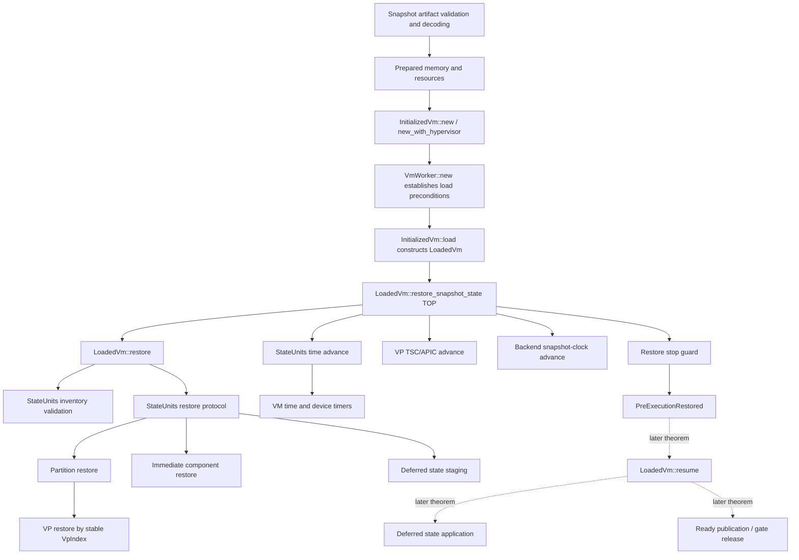

# `LoadedVm::restore_snapshot_state` verification scope

## Purpose

This document defines the proof scope required by the snapshot-restore specification. It is derived from proof obligations, not from whether Pedro changed a function, whether a symbol contains `snapshot` or `restore`, or whether rust-analyzer can represent every dynamic edge.

`VM_LOAD_CALL_GRAPH.md` remains useful discovery evidence. Its 1,426-function ordinary-call closure is not itself the verification scope: it includes inactive configuration branches and generic infrastructure, while missing some semantic edges carried by trait dispatch, state-unit messages, callbacks, and spawned tasks.

## Scope inventory, not a completion count

The earlier review identified **68 restore-semantic function-level targets** for one frozen x86-64 microVM profile:

| Scope | Functions |
| --- | ---: |
| Snapshot artifact, caller, and `InitializedVm` construction | 8 |
| TOP restore orchestration and later lifecycle entry points | 5 |
| Generic state-unit orchestration and dispatch | 8 |
| Partition and stable-identity VP restore | 15 |
| VM time and backend-clock refinement | 6 |
| Core microVM chipset restore and RTC time refinement | 13 |
| Virtio MMIO/PCI restore and deferred-application lifecycle | 13 |
| **Restore-semantic inventory** | **68** |

This is not the complete production verification closure and must not be used as a completion counter. It omits destination setup/build/wiring functions that execute before the snapshot branch, frontend type/trait/async dependencies, and any caller/preparation functions whose bodies have not yet been replaced by independently proved contracts. Conditional VMBus/VTL2 VMBus profiles also require an extension.

The final closure is established edge by edge: every reachable call must target a verified body, an independently verified contract, a proved irrelevant/unreachable path, or an explicitly reviewed narrow trusted boundary. Its final size is determined by that closure, not by the number 68.

## Primary theorem

The focused restore-correctness TOP is:

```text
openvmm/openvmm_core/src/worker/dispatch.rs
LoadedVm::restore_snapshot_state
```

The theorem pre-state begins after destination construction, memory/resource preparation, and VP instantiation. It ends when the helper successfully returns with the restore stop guard held, before `LoadedVm::resume` allows guest execution.

Given valid decoded saved state and correctly prepared destination resources, the returned `LoadedVm` must:

- have snapshot state equal to `restore_snapshot_projection(initial_snapshot_state, request, active_vp_count)`;
- preserve the prepared memory, compatibility class, destination capacity, and external resources;
- restore partition state;
- restore VP state by stable `VpIndex`, preserving initial/default state for VP identities not restored from the saved state;
- preserve the complete component inventory while applying saved active state and retaining pending/deferred state;
- apply the permitted virtual-time adjustment;
- remain in `PreExecutionRestored`.

The non-snapshot branch is not part of this theorem. Its existing behavior must continue to compile and run, but firmware loading and cold-boot initialization are not restore proof obligations.

## Obligation graph



## Scope classification

### A. TOP body: prove directly

| Symbol | Obligation |
| --- | --- |
| `LoadedVm::restore_snapshot_state` | Establish ordering: validate clock compatibility, restore state, advance time, acquire the restore stop guard, then return. |

`InitializedVm::load` retains its wrapper-level conditional restore contract, but it is not the focused verification target. Both contracts adapt their different pre-state Views to the shared `snapshot_restore_result` predicate, so snapshot equality, destination-frame preservation, active VP count, and lifecycle semantics have one definition.

### B. Caller-side precondition producers

These functions are not additional TOPs. Future contracts must establish the `LoadedVm` pre-state and request validity consumed by `LoadedVm::restore_snapshot_state`.

| Symbol | Obligation |
| --- | --- |
| `OpenedSnapshot::open` | Tie manifest, state bytes, and memory file to one validated snapshot generation. |
| `OpenedSnapshot::validate_memory_generation` | Preserve the identity and expected length of the opened memory artifact. |
| `OpenedSnapshot::duplicate_memory_file_for_mapping` | Ensure the mapped handle denotes the same validated memory generation. |
| `OpenedSnapshot::into_parts` | Preserve the association among manifest, state bytes, and lifetime guards. |
| `prepare_snapshot_restore_for_config` | Establish validated manifest, exact memory generation, decoded state bytes, restore-time contract, and attachment identities. |
| Saved-state decode at `VmWorker::new` | Establish that the `SavedState` argument corresponds to the prepared snapshot generation. |
| `VmWorker::new` | Preserve preparation facts while constructing and loading the VM. |
| `InitializedVm::new` / `InitializedVm::new_with_hypervisor` / `InitializedVm::load` | Install the prepared backing/resources, enforce VP-selection rules, and establish the `LoadedVm` TOP pre-state. |

Filesystem reads, OS file identity, and memory mapping syscalls may use narrow trusted contracts. Repository-owned manifest validation, generation checks, offset/range validation, and construction logic must be specified rather than replaced by one unconstrained function.

### C. Core restore semantic closure

These functions provide facts consumed directly by the TOP postcondition.

| Symbol | Obligation |
| --- | --- |
| `LoadedVm::restore` | Validate the complete component inventory and initiate restoration of all supplied mutable component state. |
| `StateUnits::inventory` | Define the stable abstract component inventory. |
| `StateUnits::validate_inventory` | Prove that a non-empty saved inventory exactly equals the registered inventory. |
| `StateUnits::restore` | Match saved blobs to stable component identities, reject unknown/duplicate entries, respect dependency order, consume every supplied state, and finish stopped. |
| `StateUnits::run_op` and `StateRequest::Restore` dispatch | Connect the orchestration call to each component's `StateUnit::restore` implementation. This semantic message edge is required even when absent from the ordinary call graph. |
| `PartitionUnitRunner::restore` | Restore partition state before VP state and preserve stable VP identities. |
| `VpSet::restore` | Select and restore states by `VpIndex`, reject invalid identities, and restore exactly the supported instantiated set. |
| `select_instantiated_vp_states` | Establish the actual relationship among destination capacity, instantiated count, and saved VP identities. |
| `PartitionUnit::new` / `VpSet::new` | Establish the initial/default state and stable identity of destination VPs used by `restore_vp_projection`. |
| `PartitionUnit::temporarily_stop_vps` | Establish the stop guard used to represent `PreExecutionRestored`. |

The proof must follow semantic message dispatch and trait dispatch. An ordinary static call edge is not required for a function to be in this closure.

### D. Time-refinement closure

The TOP View exposes one abstract virtual-time transition. The following implementations refine it:

| Symbol | Obligation |
| --- | --- |
| `StateUnits::advance_time` | Apply the same downtime to all applicable stopped components in dependency order and propagate failure. |
| `StateRequest::AdvanceTime` dispatch | Connect the orchestration request to component `advance_time` implementations. |
| `vmm_core::vmtime_unit` state-unit implementation | Prove VM time advances by truncated 100ns units with `u64` wrapping. |
| `PartitionUnit::advance_tsc` / `VpSet::advance_tsc` | Prove selected VP TSC and APIC timer state implement the abstract elapsed-time relation and reject overflow. |
| `HvlitePartition::advance_snapshot_time` | State the backend-clock interface contract. |
| Supported backend implementations of `advance_snapshot_time` | Prove the backend-specific behavior: checked KVM clock advance or the documented no-op behavior. |
| RTC and other time-aware state units | Prove their observable time state refines the same abstract downtime transition. |

Register layouts, APIC bit encodings, ioctl representation, and arithmetic implementation details stay below the TOP View, but the resulting abstract time relation may not be omitted.

### E. Component restore profiles

The generic `StateUnits` proof is not sufficient by itself. Every component admitted by the supported microVM profile must supply a View and restore contract.

| Component class | Required guarantee |
| --- | --- |
| Partition | Saved partition state is restored before VP state. |
| VP | State is keyed by stable `VpIndex`; optional absent fields preserve their specified initial value. |
| Stateless component | It remains in the complete inventory and retains its initial/default abstract state without requiring a blob. |
| Immediate stateful component | Its saved state is applied before `load` returns. |
| Deferred virtio component | Exact pending payload, including `Some(None)` versus not-restored, is retained without activation. |
| External-resource-backed component | The restored logical identity refers to the caller-approved attachment; host FD equality is not required. |

For configured virtio devices, the load-boundary closure includes the restore implementations that stage state into `VirtioTransportCore` and `DeviceTask::stage_restore`. `DeviceTask::apply_pending_restore` is a later-phase obligation, not part of the `load` success theorem.

### F. Caller failure theorem

`anyhow::Error` does not carry execution or publication state, so failure safety is not modeled as a View of the error.

The real caller proofs must establish:

| Caller | Failure obligation |
| --- | --- |
| `VmWorker::new` | If `load` returns `Err`, execution returns through `?` before attaching the ready sink, calling `LOADED_VM.store`, constructing `VmWorker`, entering `run`, or publishing ready. |
| `VmWorker::restart` | If `load` returns `Err`, execution returns through `?` before `LOADED_VM.store` and before conditional `resume`. |

Cleanup is the release of caller-owned and partially constructed resources according to Rust ownership/drop behavior. No transactional rollback of already-applied internal state is claimed.

### G. Later lifecycle theorems

These functions are required for end-to-end restore readiness but are deliberately outside the `load` TOP:

| Symbol | Obligation |
| --- | --- |
| `LoadedVm::resume` | Start state units before releasing the restore stop guard; establish `Running`; publish ready immediately only when no restore gate is configured. |
| `LoadedVm::publish_restore_ready` | Emit and flush/sync the readiness event at most once by consuming the sink. |
| `LoadedVm::release_snapshot_boundary` | For gated restore, publish readiness before releasing the snapshot stop guard and clearing gate state. |
| `DeviceTask::apply_pending_restore` | Apply the exact pending payload before device operations that depend on it. |
| `DeviceTask::enable`, `start`, config access, and kick paths | Establish that they call `apply_pending_restore` before dependent device behavior. |

These are separate theorems composed after the `PreExecutionRestored` result; they must not be folded into the helper's open TOP specification.

## Explicitly excluded from the restore proof body

The following may need ordinary tests or separate proofs, but they are not dependencies of the snapshot-success theorem:

- the `saved_state == None` firmware path, including `LoadedVmInner::load_firmware` and `LoadedVm::assign_pci_resources`;
- snapshot capture/quiesce behavior such as `VpSet::stop_at_io_boundary`;
- debugger and dump operations such as `get_dump_vp_state`, `set_debug_state`, `read_virtual_memory`, and `write_virtual_memory`;
- unrelated PCIe, storage, network, VMBus, firmware, and chipset construction internals once their required identity/default-state contracts have been established;
- tracing, profiling, formatting, and diagnostic message construction;
- standard-library/container implementation details;
- generic executor, channel, and scheduling internals beyond their explicit ordering/ownership contracts.

Exclusion means “consume a sufficient contract” or “irrelevant to this theorem”, not “assume arbitrary behavior”.

## Trusted boundaries

Trust must be narrow and explicit:

- OS filesystem operations and stable opened-file identity;
- memory mapping primitives after repository-owned range/size validation;
- serialization codec correctness connecting accepted bytes to decoded values;
- supported hypervisor operations whose implementations are outside the verified Rust closure;
- task-runtime scheduling primitives, while preserving message ownership and ordering contracts.

No trusted boundary may directly assert `snapshot_restore_success`, `restore_snapshot_projection`, or equality of the final snapshot-state projection.

## Verification order

1. Freeze the TOP-level full-state, snapshot projection, restore request, lifecycle, and success semantics.
2. Attach that contract to `LoadedVm::restore_snapshot_state`.
3. In later proof work, replace representation bridges with component Views and prove the helper body.
4. Separately prove preparation/destination construction before the TOP and caller/lifecycle behavior after the TOP.

## Acceptance criteria

This TOP-level specification task is complete when:

- the production helper carries the reviewable open precondition and postcondition;
- full runtime state is distinct from the snapshot-state projection;
- the specification identifies stable VP identity, component inventory, active/pending state, time adjustment, preserved destination frame, and the pre-execution lifecycle boundary;
- preparation, proof, caller failure, resume, and deferred activation remain explicit separate obligations rather than being claimed by this TOP.

Proof completion criteria are intentionally not part of this task.

The earlier Pedro-change and name-filtered counts are retained only in `VM_LOAD_CALL_GRAPH.md` as historical discovery data. They are not acceptance criteria and do not define proof completeness.
